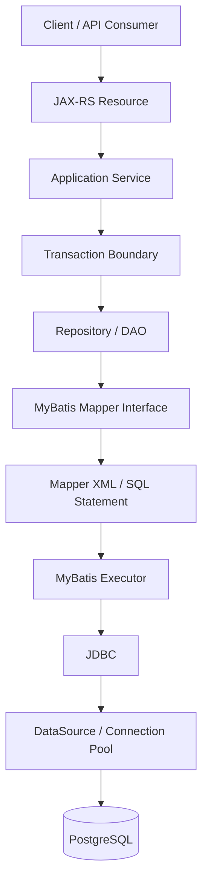
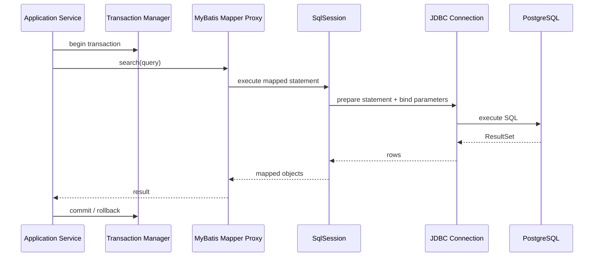
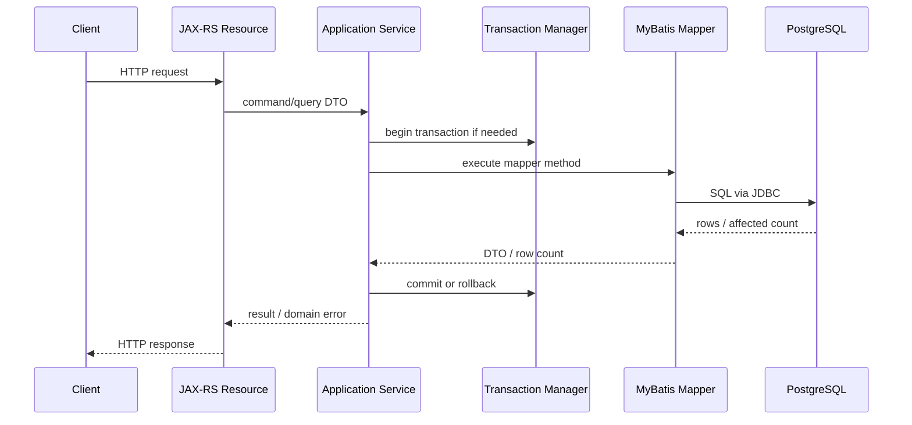

# MyBatis Foundation

## 1. Core Thesis

MyBatis adalah persistence framework yang memindahkan beban utama dari **object lifecycle management** ke **explicit SQL ownership**.

Ia bukan ORM penuh seperti JPA/Hibernate. MyBatis tidak mencoba menyembunyikan database di balik entity lifecycle, persistence context, dirty checking, lazy proxy, atau automatic relationship traversal. MyBatis memberi struktur agar Java code dapat mengeksekusi SQL dengan aman, reusable, testable, dan terintegrasi dengan transaction management.

Mental model paling penting:

> MyBatis = SQL-first / mapper-first / explicit query execution.

Artinya:

- SQL adalah artifact utama.
- Mapper adalah boundary antara Java method dan SQL statement.
- ResultMap adalah kontrak mapping dari result set ke object.
- Parameter binding harus eksplisit dan aman.
- Transaction tetap dikelola di boundary aplikasi/framework, bukan “ajaib” oleh mapper.
- Performance lebih terlihat karena SQL ditulis langsung.
- Correctness lebih bergantung pada disiplin query, mapping, dan transaction boundary.

Dalam enterprise Java/JAX-RS system, MyBatis cocok ketika tim ingin mempertahankan kendali penuh terhadap SQL, query plan, projection, PostgreSQL-specific feature, batch query, reporting query, dynamic search, dan legacy schema.

Tetapi kontrol eksplisit juga berarti tanggung jawab eksplisit. Tidak ada dirty checking otomatis. Tidak ada entity lifecycle otomatis. Tidak ada automatic cascade. Tidak ada persistence context yang menjaga object identity. Semua update, locking, audit field, tenant filter, soft delete filter, dan version check harus dirancang secara sadar.

---

## 2. MyBatis in the Persistence Stack

Dalam stack Java/JAX-RS, MyBatis biasanya berada di antara repository/DAO layer dan JDBC/DataSource.



Yang penting:

- JAX-RS resource tidak seharusnya memanggil mapper langsung kecuali convention internal memang sangat tipis.
- Application service biasanya menentukan use case dan transaction boundary.
- Repository/DAO menyembunyikan detail mapper dari application service.
- Mapper interface mendefinisikan method-level query contract.
- Mapper XML menyimpan SQL dan result mapping.
- MyBatis Executor menerjemahkan method call menjadi JDBC PreparedStatement.
- DataSource dan transaction manager menentukan connection yang dipakai.

Dalam production system, bug MyBatis sering muncul bukan karena syntax mapper semata, tetapi karena boundary ini tidak jelas: mapper dipanggil dari banyak tempat, transaksi tidak konsisten, filter tenant/soft-delete lupa ditambahkan, atau SQL yang kompleks tidak punya owner.

---

## 3. What MyBatis Is Not

MyBatis sering disalahpahami sebagai “ORM ringan”. Itu framing yang berbahaya.

MyBatis bukan:

- full ORM,
- entity lifecycle manager,
- persistence context,
- unit-of-work engine,
- dirty checking engine,
- relationship graph manager,
- cache-consistency authority,
- domain model framework,
- replacement for transaction design,
- replacement for database constraint.

MyBatis dapat memetakan row ke object, tetapi object tersebut tidak otomatis menjadi managed entity. Setelah query selesai, object Java yang dihasilkan adalah object biasa. Jika field diubah, MyBatis tidak tahu. Jika ingin update, harus memanggil mapper update secara eksplisit.

Konsekuensi:

```java
OrderDto order = orderMapper.findById(orderId);
order.setStatus("APPROVED");

// Tidak ada SQL UPDATE otomatis.
// Harus eksplisit:
orderMapper.updateStatus(orderId, "APPROVED");
```

Perbandingan mental model:

| Concern | MyBatis | JPA/Hibernate |
|---|---|---|
| Unit utama | SQL statement / mapper method | Entity / persistence context |
| Update | Explicit mapper call | Dirty checking pada managed entity |
| Query visibility | Tinggi, SQL ditulis langsung | Bisa rendah jika generated SQL tidak diamati |
| Relationship loading | Manual via SQL/result mapping | Lazy/eager/fetch join/entity graph |
| Cache utama | Local session cache, optional second-level | First-level persistence context, optional second-level |
| Schema fit | Sangat cocok untuk legacy/complex schema | Cocok jika mapping object-relational stabil |
| Debugging | Lihat SQL langsung | Perlu memahami flush/lifecycle/generated SQL |

---

## 4. Why MyBatis Exists

MyBatis ada karena banyak enterprise system tidak cocok dipaksa masuk ke model ORM penuh.

Beberapa realitas enterprise:

- schema database sudah ada sebelum aplikasi,
- query membutuhkan join kompleks,
- reporting/read model tidak cocok dengan aggregate entity,
- PostgreSQL feature seperti JSONB, CTE, `RETURNING`, `ON CONFLICT`, `SKIP LOCKED`, function, trigger, atau full-text search digunakan intensif,
- tim ingin melihat SQL sebagai first-class artifact,
- performance perlu dikontrol sampai query plan,
- update harus eksplisit dan mudah diaudit,
- sistem memiliki banyak projection DTO,
- domain model dan persistence model tidak selalu sama,
- JPA relationship mapping bisa terlalu berat atau terlalu tersembunyi untuk use case tertentu.

MyBatis memberi kompromi:

- lebih terstruktur daripada raw JDBC,
- lebih SQL-visible daripada JPA,
- lebih mudah menulis PostgreSQL-specific SQL,
- lebih eksplisit untuk projection/read model,
- lebih predictable untuk complex query,
- tetap bisa ikut transaction manager aplikasi.

Tetapi MyBatis juga membawa risiko:

- duplicate SQL,
- inconsistent filter,
- mapping drift,
- manual optimistic locking yang terlupakan,
- SQL injection pada dynamic SQL,
- mapper method yang terlalu banyak,
- query ownership kabur,
- object model yang tidak mencerminkan invariant domain,
- logic bisnis tersebar di XML.

---

## 5. Core Components

### 5.1 Mapper Interface

Mapper interface adalah kontrak Java yang dipanggil oleh repository/service.

Contoh:

```java
public interface QuoteMapper {
    QuoteRow findById(UUID quoteId);

    List<QuoteSummaryRow> search(QuoteSearchQuery query);

    int updateStatus(UpdateQuoteStatusCommand command);
}
```

Yang perlu diperhatikan:

- nama method harus menggambarkan query/command,
- parameter object lebih baik untuk query kompleks,
- return type harus eksplisit,
- command update sebaiknya mengembalikan affected row count,
- method mapper bukan tempat business decision,
- mapper interface harus punya ownership jelas.

Mapper method bukan sekadar “function”. Ia adalah persistence operation. Maka PR review harus melihat:

- SQL apa yang dijalankan,
- transaction apa yang membungkusnya,
- invariant apa yang diasumsikan,
- table/index apa yang disentuh,
- apakah tenant/soft-delete/effective-date filter sudah benar,
- apakah update path aman terhadap concurrency.

### 5.2 Mapper XML

Mapper XML menghubungkan method Java ke SQL.

Contoh minimal:

```xml
<mapper namespace="com.example.persistence.quote.QuoteMapper">
  <select id="findById" parameterType="java.util.UUID" resultMap="QuoteRowMap">
    SELECT
      q.id,
      q.quote_number,
      q.status,
      q.created_at,
      q.updated_at
    FROM quote q
    WHERE q.id = #{quoteId}
  </select>
</mapper>
```

Dalam sistem production, XML bukan tempat menaruh SQL acak. XML adalah artifact persistence yang harus diperlakukan seperti code:

- readable,
- diff-friendly,
- testable,
- reviewable,
- memiliki naming convention,
- memiliki ownership,
- tidak menyembunyikan business rule besar tanpa dokumentasi.

### 5.3 SqlSession

`SqlSession` adalah context MyBatis untuk menjalankan statement.

Ia mengelola:

- statement execution,
- local cache dalam session,
- mapper proxy,
- commit/rollback jika dikelola manual,
- interaction dengan executor,
- connection binding tergantung integrasi framework.

Dalam aplikasi enterprise yang memakai framework transaction, engineer biasanya tidak membuka dan menutup SqlSession manual di setiap repository. SqlSession sering dikelola oleh integrasi framework.

Tetapi mental model tetap penting:



Yang harus diverifikasi di codebase internal:

- siapa yang membuat SqlSession,
- apakah session bound ke transaction,
- apakah mapper memakai datasource yang sama dengan transaction manager,
- apakah ada manual commit/rollback,
- apakah ada mixed transaction dengan JPA,
- apakah local cache MyBatis memengaruhi read-after-write behavior.

### 5.4 SqlSessionFactory

`SqlSessionFactory` membuat SqlSession. Ia dibangun dari konfigurasi MyBatis.

Konfigurasi ini dapat mencakup:

- datasource,
- transaction factory,
- mapper locations,
- type aliases,
- type handlers,
- plugins/interceptors,
- cache settings,
- executor type,
- naming behavior,
- logging.

Dalam sistem enterprise, konfigurasi SqlSessionFactory adalah area risiko tinggi karena memengaruhi semua mapper.

Checklist cepat:

- Apakah mapper XML semua ter-load?
- Apakah datasource benar?
- Apakah transaction integration benar?
- Apakah type handler PostgreSQL-specific terdaftar?
- Apakah cache behavior sesuai policy?
- Apakah logging aman terhadap PII?
- Apakah plugin/interceptor menambahkan behavior tersembunyi?

### 5.5 Mapped Statement

Mapped statement adalah representasi internal MyBatis untuk satu SQL operation.

Satu mapped statement biasanya berasal dari:

```xml
<select id="...">
<insert id="...">
<update id="...">
<delete id="...">
```

Statement identity biasanya:

```text
<mapper namespace>.<statement id>
```

Contoh:

```text
com.example.persistence.quote.QuoteMapper.findById
```

Statement identity penting untuk:

- log debugging,
- error message,
- SQL tracing,
- mapper test,
- cache key,
- ownership.

Jika error production menyebut mapped statement, engineer harus bisa cepat menemukan XML dan method Java terkait.

---

## 6. ResultMap Mental Model

`ResultMap` adalah kontrak mapping dari column result set ke property object.

Contoh:

```xml
<resultMap id="QuoteRowMap" type="com.example.persistence.quote.QuoteRow">
  <id property="id" column="id" />
  <result property="quoteNumber" column="quote_number" />
  <result property="status" column="status" />
  <result property="createdAt" column="created_at" />
  <result property="updatedAt" column="updated_at" />
</resultMap>
```

Prinsip penting:

- ResultMap adalah schema-to-object contract.
- Column alias harus jelas terutama untuk join.
- Mapping nested object harus di-review untuk N+1 risk.
- `resultType` boleh untuk query sederhana, tetapi `resultMap` lebih eksplisit untuk production mapping yang kompleks.
- Perubahan column/table harus disinkronkan dengan ResultMap.
- ResultMap harus dites jika query penting.

Failure mode umum:

- kolom baru tidak dimap,
- alias bentrok pada join,
- field null karena nama kolom salah,
- enum mapping gagal,
- timestamp/timezone berubah,
- JSONB tidak dikonversi benar,
- nested select menghasilkan N+1,
- constructor mapping rusak setelah refactor.

---

## 7. Parameter Mapping

MyBatis memakai parameter binding untuk mengirim nilai ke PreparedStatement.

Gunakan:

```xml
WHERE q.id = #{quoteId}
```

Hindari untuk input user:

```xml
WHERE q.status = ${status}
```

Perbedaan kritikal:

| Syntax | Meaning | Risk |
|---|---|---|
| `#{value}` | PreparedStatement parameter binding | Aman untuk value |
| `${value}` | String substitution langsung ke SQL | SQL injection risk |

`#{}` digunakan untuk values:

```xml
WHERE customer_id = #{customerId}
AND status = #{status}
AND created_at >= #{createdFrom}
```

`${}` hanya boleh dipakai untuk SQL fragment yang sudah di-whitelist ketat, seperti column sort yang dipilih dari enum internal, bukan input mentah.

Contoh aman untuk sorting:

```java
public enum QuoteSortField {
    CREATED_AT("q.created_at"),
    UPDATED_AT("q.updated_at"),
    QUOTE_NUMBER("q.quote_number");

    private final String sqlExpression;
}
```

Lalu mapper hanya menerima SQL expression dari enum yang dikontrol aplikasi, bukan string bebas dari request.

---

## 8. TypeHandler

`TypeHandler` mengontrol mapping antara Java type dan JDBC type.

Dipakai untuk kasus seperti:

- enum custom,
- PostgreSQL JSONB,
- PostgreSQL array,
- domain-specific value object,
- timestamp normalization,
- custom identifier type.

Contoh konsep:

```java
public final class JsonbTypeHandler extends BaseTypeHandler<JsonNode> {
    @Override
    public void setNonNullParameter(
        PreparedStatement ps,
        int i,
        JsonNode parameter,
        JdbcType jdbcType
    ) throws SQLException {
        PGobject jsonObject = new PGobject();
        jsonObject.setType("jsonb");
        jsonObject.setValue(parameter.toString());
        ps.setObject(i, jsonObject);
    }
}
```

TypeHandler adalah area yang harus dites serius karena bug-nya bisa menyebar ke semua mapper yang memakai type tersebut.

Review concern:

- Apakah handler aman terhadap null?
- Apakah format serialize/deserialize stabil?
- Apakah timezone diperlakukan benar?
- Apakah enum unknown value ditangani?
- Apakah PostgreSQL-specific type dipakai dengan benar?
- Apakah ada migration impact jika representasi berubah?

---

## 9. Dynamic SQL Overview

Dynamic SQL memungkinkan satu mapper statement menghasilkan SQL berbeda berdasarkan parameter.

Contoh:

```xml
<select id="search" parameterType="QuoteSearchQuery" resultMap="QuoteSummaryRowMap">
  SELECT
    q.id,
    q.quote_number,
    q.status,
    q.created_at
  FROM quote q
  <where>
    <if test="customerId != null">
      q.customer_id = #{customerId}
    </if>
    <if test="status != null">
      AND q.status = #{status}
    </if>
    <if test="createdFrom != null">
      AND q.created_at &gt;= #{createdFrom}
    </if>
  </where>
  ORDER BY q.created_at DESC
  LIMIT #{limit}
  OFFSET #{offset}
</select>
```

Dynamic SQL berguna untuk:

- optional filter,
- search endpoint,
- partial update,
- batch `IN` clause,
- dynamic insert/update,
- conditional joins.

Tetapi dynamic SQL juga rawan:

- combinatorial explosion,
- SQL injection pada dynamic sorting,
- query plan tidak stabil,
- filter wajib lupa ditambahkan,
- readability XML turun,
- test coverage tidak mencakup semua branch.

Prinsip senior engineer:

> Dynamic SQL harus punya batas kompleksitas. Jika XML sudah menjadi mini programming language, pertimbangkan split query, query builder yang typed, atau desain endpoint yang lebih jelas.

---

## 10. MyBatis vs Raw JDBC

MyBatis mengurangi boilerplate JDBC, tetapi tidak menghapus pemahaman JDBC.

Dengan raw JDBC, engineer harus menulis:

- obtain connection,
- prepare statement,
- bind parameter,
- execute query,
- iterate result set,
- map columns,
- close resources,
- handle exceptions.

Dengan MyBatis:

- mapper method menjadi entry point,
- parameter binding dikelola framework,
- ResultSet mapping dideklarasikan,
- resource handling lebih terstruktur,
- integration dengan transaction manager lebih mudah,
- SQL tetap terlihat.

Tetapi MyBatis tetap bergantung pada:

- JDBC driver,
- DataSource,
- Connection,
- PreparedStatement,
- ResultSet,
- SQLState/SQLException,
- transaction commit/rollback,
- database behavior.

Jadi, ketika terjadi production issue seperti timeout, deadlock, connection leak, bad query plan, atau serialization failure, debugging tetap membutuhkan pemahaman JDBC dan PostgreSQL.

---

## 11. MyBatis and Transaction Boundary

MyBatis tidak boleh dipahami sebagai unit transaction. Mapper method hanya menjalankan SQL. Transaction boundary biasanya ditentukan di service/application layer.

Contoh boundary sehat:

```java
public class QuoteApprovalService {
    private final QuoteRepository quoteRepository;
    private final OutboxRepository outboxRepository;

    @Transactional
    public void approveQuote(ApproveQuoteCommand command) {
        QuoteRow quote = quoteRepository.findForUpdate(command.quoteId());
        validateApproval(quote, command);

        int updated = quoteRepository.markApproved(command.quoteId(), quote.version());
        if (updated != 1) {
            throw new ConcurrentModificationException();
        }

        outboxRepository.insertQuoteApprovedEvent(command.quoteId());
    }
}
```

Yang harus benar:

- read, validation, update, dan outbox insert berada dalam transaction yang sama,
- mapper update mengembalikan affected row count,
- optimistic/pessimistic locking eksplisit,
- rollback terjadi jika validation atau write gagal,
- event publication tidak dilakukan sebelum commit kecuali via outbox.

Failure mode:

- mapper dipanggil tanpa transaction,
- read dan write berada di transaction berbeda,
- update berhasil tetapi outbox gagal,
- external API call dilakukan di tengah transaction panjang,
- MyBatis dan JPA memakai transaction manager berbeda,
- manual SqlSession commit bercampur dengan framework transaction.

---

## 12. MyBatis Local Cache

MyBatis memiliki local cache pada level SqlSession. Secara default, query yang sama dalam session bisa memanfaatkan cache lokal tergantung konfigurasi dan statement behavior.

Dalam banyak aplikasi, efek local cache jarang dibahas, tetapi penting saat:

- satu transaction membaca data yang sama beberapa kali,
- ada update di tengah session,
- MyBatis dicampur dengan JPA,
- mapper read dilakukan setelah write oleh mekanisme lain,
- code mengandalkan read-after-write visibility.

Concern utama bukan “cache membuat cepat”, tetapi “apakah hasil read merepresentasikan state database yang benar dalam transaction ini?”

Jika MyBatis dicampur dengan JPA:

- JPA persistence context dapat menyimpan entity stale,
- MyBatis query dapat membaca database langsung,
- MyBatis update dapat melewati JPA persistence context,
- JPA flush dapat terjadi sebelum query,
- second-level cache dapat makin memperumit state.

Karena itu, mixing MyBatis dan JPA harus punya rule explicit flush/clear/cache ownership.

---

## 13. MyBatis in Java/JAX-RS Request Lifecycle

Dalam service JAX-RS, request lifecycle biasanya seperti ini:



Design principle:

- Resource layer handles HTTP concern.
- Service layer handles use case and transaction.
- Repository/mapper handles persistence operation.
- Mapper should not know HTTP status, request headers, or response DTO shape unless internal convention deliberately collapses layers.

Bad smell:

```java
@Path("/quotes")
public class QuoteResource {
    @Inject QuoteMapper quoteMapper;

    @POST
    public Response approve(ApproveQuoteRequest request) {
        quoteMapper.updateStatus(request.quoteId(), "APPROVED");
        return Response.ok().build();
    }
}
```

Kenapa bermasalah:

- transaction boundary tidak jelas,
- validation/invariant bisa terlewat,
- affected row count diabaikan,
- audit/outbox bisa terlewat,
- HTTP layer terlalu tahu persistence detail,
- sulit menambahkan retry/lock/error mapping.

---

## 14. MyBatis and PostgreSQL

MyBatis sangat kuat untuk PostgreSQL karena SQL ditulis eksplisit. Ini membuat fitur PostgreSQL mudah digunakan tanpa menunggu abstraction ORM.

Contoh fitur yang cocok dengan MyBatis:

- `RETURNING`,
- `ON CONFLICT DO UPDATE`,
- JSONB operators,
- array operators,
- CTE,
- window function,
- full-text search,
- `SELECT FOR UPDATE SKIP LOCKED`,
- advisory lock,
- stored function/procedure,
- partial index-aware query,
- expression index-aware query.

Contoh `RETURNING`:

```xml
<insert id="insertQuote" parameterType="CreateQuoteCommand" resultMap="QuoteRowMap">
  INSERT INTO quote (
    customer_id,
    quote_number,
    status,
    created_at,
    updated_at
  ) VALUES (
    #{customerId},
    #{quoteNumber},
    'DRAFT',
    now(),
    now()
  )
  RETURNING id, customer_id, quote_number, status, created_at, updated_at
</insert>
```

Contoh optimistic update:

```xml
<update id="approveQuote" parameterType="ApproveQuoteCommand">
  UPDATE quote
  SET
    status = 'APPROVED',
    version = version + 1,
    updated_at = now()
  WHERE id = #{quoteId}
    AND version = #{expectedVersion}
    AND status = 'PENDING_APPROVAL'
</update>
```

Repository harus memeriksa affected rows:

```java
int updated = quoteMapper.approveQuote(command);
if (updated != 1) {
    throw new OptimisticConcurrencyFailure("Quote was modified or is no longer approvable");
}
```

Tanpa affected row check, update yang tidak terjadi dapat terlihat seperti sukses.

---

## 15. MyBatis Failure Modes

### 15.1 SQL Injection from Dynamic SQL

Paling sering terjadi ketika `${}` digunakan untuk input user.

Risk area:

- ORDER BY,
- dynamic column,
- dynamic table,
- search expression,
- raw filter fragment.

Mitigation:

- whitelist enum,
- gunakan `#{}` untuk values,
- jangan menerima SQL fragment dari client,
- test negative case,
- review semua `${}`.

### 15.2 Mapping Drift

Schema berubah tetapi ResultMap/DTO tidak berubah.

Symptoms:

- field null tiba-tiba,
- enum parse error,
- data salah kolom,
- constructor mapping error,
- API response kehilangan field.

Mitigation:

- mapper integration test,
- migration compatibility test,
- explicit column list,
- hindari `SELECT *`,
- review migration + mapper bersama.

### 15.3 Missing Tenant/Soft Delete Filter

Query baru lupa menambahkan filter wajib.

Symptoms:

- data tenant lain muncul,
- data deleted muncul,
- price/catalog expired terpakai,
- compliance incident.

Mitigation:

- query template,
- repository-level convention,
- tests dengan data tenant/deleted/expired,
- PR checklist.

### 15.4 Ignored Affected Row Count

Update/delete tidak mengubah row tetapi aplikasi menganggap sukses.

Symptoms:

- lost update tidak terdeteksi,
- stale command dianggap berhasil,
- status transition invalid diam-diam gagal,
- API response misleading.

Mitigation:

- update/delete return `int`,
- require affected row assertion,
- map zero rows to domain error,
- use version/status guard in WHERE.

### 15.5 Hidden N+1 via Nested Select

ResultMap nested select menjalankan query tambahan per row.

Symptoms:

- endpoint lambat hanya pada data besar,
- query count naik linear,
- database CPU tinggi,
- connection pool pressure.

Mitigation:

- prefer join/nested result/DTO projection untuk list endpoint,
- query count assertion,
- avoid nested select in high-cardinality result.

### 15.6 Transaction Boundary Leak

Mapper dipanggil tanpa transaction atau dengan transaction berbeda dari operasi lain.

Symptoms:

- partial write,
- outbox missing,
- read-after-write inconsistency,
- lock tidak bertahan sampai update,
- rollback tidak membatalkan semua perubahan.

Mitigation:

- service-level transaction,
- repository convention,
- integration test rollback,
- avoid manual SqlSession commit in managed app.

---

## 16. MyBatis vs JPA in the Same Codebase

MyBatis boleh hidup berdampingan dengan JPA jika ownership jelas.

Contoh sehat:

- JPA mengelola aggregate lifecycle untuk command CRUD sederhana.
- MyBatis dipakai untuk reporting query/projection read model.
- MyBatis dipakai untuk PostgreSQL-specific query yang sulit diekspresikan di JPQL.
- Keduanya menyentuh bounded context/module berbeda.
- Jika menyentuh datasource sama, transaction manager jelas.
- Jika menyentuh table sama, ada aturan flush/clear/cache dan ownership eksplisit.

Contoh bahaya:

- JPA entity dan MyBatis mapper sama-sama update table yang sama dalam use case sama.
- MyBatis update melewati JPA `@Version`.
- MyBatis read dilakukan sebelum JPA flush sehingga membaca state lama.
- MyBatis write dilakukan setelah JPA entity sudah loaded sehingga entity stale.
- Hibernate second-level cache tetap menganggap data lama valid.
- Audit/tenant/soft delete logic berbeda antara entity dan mapper.

Prinsip:

> Jangan mencampur MyBatis dan JPA hanya karena satu query “lebih gampang”. Campuran harus punya alasan architecture dan correctness rule.

---

## 17. Production Debugging Workflow for MyBatis

Ketika ada issue pada endpoint yang memakai MyBatis, jangan mulai dari tebakan. Mulai dari mapping evidence.

Langkah:

1. Identifikasi endpoint dan use case.
2. Temukan service method dan transaction boundary.
3. Temukan repository/mapper method.
4. Temukan mapped statement XML.
5. Ambil SQL final dan parameter.
6. Jalankan SQL di environment aman dengan sample parameter.
7. Cek EXPLAIN/EXPLAIN ANALYZE.
8. Cek index/filter/join/cardinality.
9. Cek ResultMap dan DTO mapping.
10. Cek affected row count untuk write.
11. Cek transaction/lock behavior.
12. Cek log error SQLState jika ada.
13. Cek apakah ada JPA/cache interaction.
14. Reproduksi lewat integration test.

Debugging harus menjawab:

- SQL apa yang benar-benar jalan?
- Parameter apa yang dipakai?
- Transaction apa yang membungkus SQL?
- Database plan seperti apa?
- Berapa row yang dibaca/diubah?
- Mapping object apakah sesuai?
- Apakah ada query tambahan tersembunyi?
- Apakah query aman terhadap tenant/soft-delete/effective-date?

---

## 18. PR Review Checklist for MyBatis Foundation

Gunakan checklist ini saat review perubahan MyBatis.

### Query contract

- Apakah nama mapper method jelas?
- Apakah SQL sesuai use case?
- Apakah return type tepat?
- Apakah query command/read dipisahkan?
- Apakah affected row count diperiksa untuk update/delete?

### SQL safety

- Apakah parameter memakai `#{}`?
- Apakah penggunaan `${}` punya whitelist?
- Apakah query menghindari `SELECT *`?
- Apakah dynamic SQL mudah dibaca?
- Apakah query punya stable ordering jika paginated?

### Data correctness

- Apakah tenant filter wajib ada?
- Apakah soft delete/effective date/status filter benar?
- Apakah optimistic lock/version check diperlukan?
- Apakah constraint race dipertimbangkan?
- Apakah audit fields diisi konsisten?

### Transaction

- Apakah mapper dipanggil dalam transaction yang tepat?
- Apakah read-modify-write aman?
- Apakah lock bertahan sampai update?
- Apakah outbox/event insert atomic dengan write utama?
- Apakah ada manual commit/rollback yang mencurigakan?

### Mapping

- Apakah ResultMap sesuai column list?
- Apakah alias join jelas?
- Apakah enum/JSONB/array TypeHandler benar?
- Apakah null handling disengaja?
- Apakah nested select berisiko N+1?

### Performance

- Apakah index mendukung WHERE/JOIN/ORDER BY?
- Apakah query plan dicek untuk query penting?
- Apakah pagination aman untuk volume besar?
- Apakah batch/fetch size relevan?
- Apakah query count terkendali?

### Observability

- Apakah SQL bisa dilacak di log/trace?
- Apakah parameter sensitif tidak bocor?
- Apakah error SQLState dipetakan?
- Apakah slow query dapat dikorelasikan ke mapper id?

---

## 19. Internal Verification Checklist

Gunakan checklist ini di codebase/team internal. Jangan mengasumsikan detail CSG tanpa verifikasi.

### Mapper structure

- Di mana mapper interface disimpan?
- Di mana mapper XML disimpan?
- Apakah namespace XML selalu match dengan interface?
- Apakah naming convention method sudah ada?
- Apakah ada mapper per aggregate, per table, atau per use case?

### Configuration

- Bagaimana SqlSessionFactory dikonfigurasi?
- Datasource mana yang dipakai MyBatis?
- Apakah MyBatis memakai transaction manager yang sama dengan service layer?
- Apakah ada plugin/interceptor?
- Apakah cache MyBatis enabled?
- Apakah type aliases/type handlers diregistrasi global?

### Transaction integration

- Apakah mapper method dipanggil dari service transactional?
- Apakah ada manual SqlSession usage?
- Apakah ada manual commit/rollback?
- Apakah ada MyBatis dan JPA dalam transaction sama?
- Bagaimana rollback exception diatur?

### PostgreSQL usage

- Apakah mapper memakai PostgreSQL-specific syntax?
- Apakah JSONB/array/enum ditangani TypeHandler?
- Apakah `RETURNING`, `ON CONFLICT`, `SKIP LOCKED`, function/procedure digunakan?
- Apakah query plan penting didokumentasikan?

### Testing

- Apakah mapper punya integration test?
- Apakah dynamic SQL branch dites?
- Apakah ResultMap dites?
- Apakah query PostgreSQL-specific dites dengan PostgreSQL nyata/Testcontainers?
- Apakah transaction/locking behavior dites?

### Production evidence

- Apakah slow query log menampilkan mapper id?
- Apakah ada dashboard query duration/count?
- Apakah incident notes menyebut mapper tertentu?
- Apakah DBA/backend team punya review path untuk query kompleks?

---

## 20. Key Takeaways

- MyBatis adalah SQL-first mapper, bukan full ORM.
- Mapper method adalah persistence operation, bukan helper biasa.
- Mapper XML adalah production artifact yang harus di-review seperti code.
- `#{}` adalah parameter binding; `${}` adalah string substitution dan harus dicurigai.
- ResultMap adalah kontrak schema-to-object.
- TypeHandler adalah extension point penting untuk PostgreSQL-specific type.
- Transaction boundary tetap harus dirancang di service/application layer.
- MyBatis cocok untuk explicit SQL, complex query, projection, PostgreSQL feature, dan legacy schema.
- MyBatis berbahaya jika query ownership, filter, transaction, mapping, dan affected row checks tidak disiplin.
- Mixing MyBatis dan JPA boleh, tetapi harus punya ownership, transaction, flush/clear, dan cache rules yang eksplisit.
