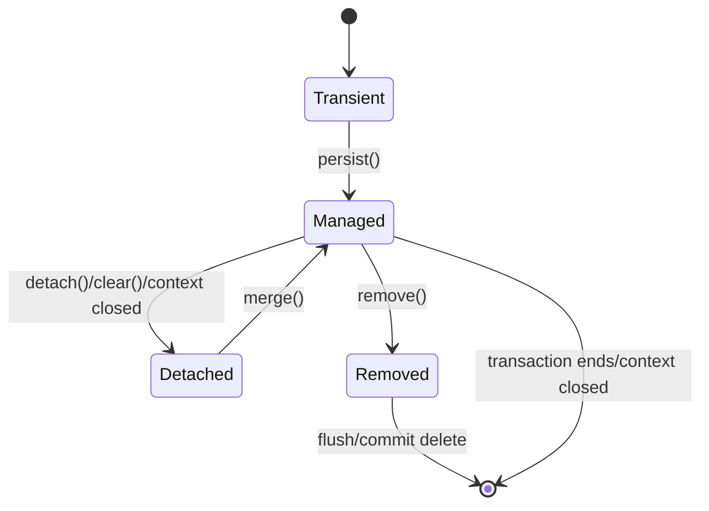

# JPA/Jakarta Persistence Foundation

## 1. Core Thesis

JPA/Jakarta Persistence bukan sekadar cara menulis CRUD tanpa SQL.

JPA adalah specification untuk object-relational mapping dan entity lifecycle management. Ia memperkenalkan model kerja yang sangat berbeda dari JDBC/MyBatis:

- aplikasi bekerja dengan entity object,
- entity bisa berada dalam persistence context,
- perubahan pada managed entity dapat terdeteksi otomatis,
- SQL bisa muncul saat flush, bukan saat method setter dipanggil,
- EntityManager bertindak sebagai gateway ke persistence context,
- transaction menjadi boundary unit-of-work,
- provider seperti Hibernate menerjemahkan lifecycle entity menjadi SQL.

Prinsip utama:

> JPA adalah entity-first dan unit-of-work driven. Ia cocok ketika lifecycle aggregate dan relationship object penting. Tetapi ia berbahaya jika engineer menganggap SQL selalu eksplisit seperti MyBatis.

Dalam MyBatis, update biasanya terlihat:

```java
quoteMapper.updateStatus(command);
```

Dalam JPA, update bisa terjadi hanya karena object berubah saat masih managed:

```java
Quote quote = entityManager.find(Quote.class, quoteId);
quote.changeStatus(APPROVED);
// no explicit update call
// SQL UPDATE may happen on flush/commit
```

Mental model ini harus benar sejak awal. Banyak production bug JPA berasal dari asumsi MyBatis/JDBC yang dibawa ke dunia persistence context.

---

## 2. JPA, Jakarta Persistence, and Hibernate

Istilah yang harus dibedakan:

| Term | Meaning |
|---|---|
| JPA | Java Persistence API, nama historis specification |
| Jakarta Persistence | Nama modern specification di ekosistem Jakarta EE |
| Hibernate | Salah satu provider/implementation paling populer |
| ORM | Object-Relational Mapping, pendekatan mapping object ke table |
| EntityManager | API utama JPA untuk entity lifecycle dan persistence context |
| Persistence Context | Unit runtime yang menyimpan managed entities |
| Entity | Object Java yang dimap ke table atau persistence structure |

JPA/Jakarta Persistence adalah kontrak/specification.

Hibernate adalah provider yang menjalankan kontrak tersebut dan menambahkan behavior/extension spesifik.

Dalam production, engineer harus memahami keduanya:

- apa yang dijanjikan JPA,
- apa yang dilakukan Hibernate secara konkret,
- apa yang spesifik terhadap PostgreSQL,
- apa yang bergantung pada framework transaction di service.

Jangan menyebut semua behavior sebagai “JPA” jika sebenarnya behavior itu Hibernate-specific.

---

## 3. Mental Model: Entity-First Persistence

Dalam JPA, database row direpresentasikan sebagai entity object.

```java
@Entity
@Table(name = "quote")
public class Quote {

    @Id
    private UUID id;

    @Column(name = "quote_number", nullable = false)
    private String quoteNumber;

    @Enumerated(EnumType.STRING)
    @Column(name = "status", nullable = false)
    private QuoteStatus status;

    @Version
    private long version;

    public void approve() {
        if (status != QuoteStatus.READY_FOR_APPROVAL) {
            throw new IllegalStateException("Quote cannot be approved from " + status);
        }
        status = QuoteStatus.APPROVED;
    }
}
```

Service code:

```java
@Transactional
public void approveQuote(UUID quoteId) {
    Quote quote = entityManager.find(Quote.class, quoteId);
    quote.approve();
}
```

Tidak ada explicit `UPDATE`. Tetapi saat transaction commit, provider dapat melakukan dirty checking dan menghasilkan SQL:

```sql
UPDATE quote
SET status = ?, version = ?
WHERE id = ? AND version = ?
```

Ini adalah kekuatan sekaligus risiko JPA.

---

## 4. Mental Model: Persistence Context

Persistence context adalah runtime scope yang melacak entity managed.

Ia seperti identity map + change tracker:

```text
Persistence Context
  Quote#123 -> managed Quote object
  Customer#456 -> managed Customer object
  Order#789 -> managed Order object
```

Karakteristik:

- satu database row/entity identity hanya punya satu managed instance dalam persistence context,
- repeated `find` untuk id yang sama dapat mengembalikan object instance yang sama,
- perubahan field pada managed entity bisa dilacak,
- flush menyinkronkan perubahan ke database,
- clear/detach mengeluarkan entity dari context,
- context biasanya scoped ke transaction/request tergantung framework.

Konsekuensi:

- entity bisa stale jika database diubah di luar context,
- MyBatis update ke table sama bisa tidak terlihat oleh entity yang sudah managed,
- query JPA bisa memicu flush sebelum SELECT,
- persistence context besar dapat membuat memory dan dirty checking mahal,
- bulk update JPQL/native query bisa membuat context tidak sinkron.

---

## 5. Unit of Work

JPA bekerja dengan pola Unit of Work.

Satu transaction biasanya mengumpulkan perubahan entity, lalu menyinkronkan perubahan saat flush/commit.

```text
BEGIN TRANSACTION
  load Quote
  load Customer
  change Quote status
  add QuoteLine
  remove Discount
  flush
COMMIT
```

SQL tidak harus terjadi persis pada saat object berubah.

Ia bisa terjadi:

- saat `persist`, tergantung id strategy/provider,
- saat query dijalankan dan flush mode memerlukan flush,
- saat explicit `entityManager.flush()`,
- saat transaction commit,
- saat provider butuh synchronize state.

Rule:

> Dalam JPA, “kapan object berubah” dan “kapan SQL dikirim” adalah dua hal berbeda.

---

## 6. Entity Lifecycle States

Entity dalam JPA memiliki beberapa state penting.

### Transient / New

Object Java biasa, belum dikenal oleh persistence context.

```java
Quote quote = new Quote(...);
```

Belum ada tracking, belum akan disimpan kecuali dipersist.

### Managed

Entity berada dalam persistence context.

```java
Quote quote = entityManager.find(Quote.class, quoteId);
quote.approve();
```

Perubahan dapat dideteksi saat flush.

### Detached

Entity pernah managed, tetapi sekarang keluar dari persistence context.

```java
entityManager.detach(quote);
```

Perubahan pada detached entity tidak otomatis tersimpan.

### Removed

Entity ditandai untuk dihapus.

```java
entityManager.remove(quote);
```

DELETE biasanya terjadi saat flush.

### State Diagram



---

## 7. EntityManager Core Operations

### `persist`

Menjadikan transient entity menjadi managed dan scheduled untuk insert.

```java
entityManager.persist(quote);
```

Concern:

- id generation strategy,
- cascade persist,
- constraint violation saat flush,
- insert ordering,
- generated value availability,
- transaction required.

### `find`

Mengambil entity by primary key.

```java
Quote quote = entityManager.find(Quote.class, quoteId);
```

Concern:

- first-level cache bisa mengembalikan entity yang sudah ada,
- lazy relationship belum tentu loaded,
- lock mode bisa ditambahkan,
- entity bisa stale terhadap update di luar persistence context.

### `merge`

Meng-copy state detached entity ke managed instance.

```java
Quote managed = entityManager.merge(detachedQuote);
```

Concern:

- object yang dikembalikan adalah managed; object argument tetap detached,
- merge bisa overwrite state,
- merge graph besar berisiko,
- merge sering menjadi sumber unexpected update.

### `remove`

Menandai managed entity untuk delete.

```java
entityManager.remove(quote);
```

Concern:

- cascade remove,
- orphan removal,
- foreign key constraint,
- soft delete convention,
- delete SQL terjadi saat flush.

### `flush`

Memaksa synchronization ke database.

```java
entityManager.flush();
```

Concern:

- constraint violation muncul di titik flush,
- SQL dikirim tetapi transaction belum commit,
- flush tidak sama dengan commit,
- flush bisa diperlukan sebelum MyBatis read dalam mixed usage.

### `clear`

Mengosongkan persistence context.

```java
entityManager.clear();
```

Concern:

- semua managed entity menjadi detached,
- perubahan belum flush bisa hilang,
- berguna setelah bulk update/native update/MyBatis write.

### `refresh`

Reload entity dari database.

```java
entityManager.refresh(quote);
```

Concern:

- local changes bisa tertimpa,
- butuh managed entity,
- berguna untuk membaca trigger-generated/default values.

---

## 8. Dirty Checking

Dirty checking adalah mekanisme provider untuk mendeteksi perubahan pada managed entity.

```java
@Transactional
public void renameQuote(UUID id, String newName) {
    Quote quote = entityManager.find(Quote.class, id);
    quote.rename(newName);
}
```

Provider membandingkan state entity saat load dengan state saat flush.

Jika berubah, provider menghasilkan SQL update.

Kekuatan:

- code domain lebih natural,
- update lifecycle aggregate mudah,
- perubahan bisa terkumpul dalam unit-of-work,
- optimistic locking bisa otomatis.

Risiko:

- update tersembunyi,
- setter sembarangan bisa memicu write,
- entity mutation di helper method bisa sulit dilacak,
- persistence context besar membuat dirty checking mahal,
- field mutable collection/embedded object bisa tricky,
- unexpected update muncul saat query/commit.

Rule:

> Dalam JPA, semua mutation pada managed entity adalah kandidat database write.

---

## 9. Flush

Flush adalah proses menyinkronkan persistence context ke database.

Flush dapat mengirim:

- INSERT,
- UPDATE,
- DELETE,
- collection table changes,
- join table changes,
- version updates.

Flush bisa terjadi:

1. Explicit `entityManager.flush()`.
2. Sebelum transaction commit.
3. Sebelum query tertentu, tergantung flush mode.
4. Saat provider butuh id/generated value.

Flush bukan commit.

```text
flush  = send SQL to database inside transaction
commit = make transaction durable and visible according to isolation
```

Jika flush berhasil tetapi commit gagal, perubahan tetap rollback.

Jika flush gagal, transaction biasanya harus dianggap rollback-only.

---

## 10. Flush Before Query Surprise

JPA dapat flush sebelum menjalankan query agar query melihat perubahan pending.

Contoh:

```java
@Transactional
public List<Quote> approveAndSearch(UUID quoteId) {
    Quote quote = entityManager.find(Quote.class, quoteId);
    quote.approve();

    return entityManager
        .createQuery("select q from Quote q where q.status = :status", Quote.class)
        .setParameter("status", QuoteStatus.APPROVED)
        .getResultList();
}
```

Sebelum SELECT, provider bisa melakukan UPDATE dulu.

Risiko:

- constraint violation muncul saat query, bukan commit,
- SQL write muncul di tengah method,
- MyBatis query setelah entity mutation bisa melihat atau tidak melihat state tergantung flush,
- debugging stack trace terlihat seperti read query gagal, padahal write pending yang gagal.

Review rule:

> Jika service memodifikasi entity lalu menjalankan query, reviewer harus bertanya apakah flush timing disengaja.

---

## 11. Transactional Write-Behind

JPA sering melakukan write-behind: perubahan dikumpulkan lalu dikirim kemudian.

Keuntungan:

- batching lebih mungkin,
- ordering SQL bisa dioptimasi provider,
- domain operation bisa diekspresikan sebagai object mutation,
- unit-of-work lebih natural.

Risiko:

- SQL tidak terlihat dari call site,
- exception muncul terlambat,
- external side effect bisa terjadi sebelum database benar-benar flush/commit,
- transaction panjang menyimpan banyak dirty entity,
- mixed MyBatis/JPA access bisa stale.

Anti-pattern:

```java
@Transactional
public void approveAndNotify(UUID quoteId) {
    Quote quote = entityManager.find(Quote.class, quoteId);
    quote.approve();

    emailClient.sendApprovalEmail(quoteId);
    // database update may not have flushed/committed yet
}
```

Lebih aman:

- flush sebelum side effect jika benar-benar harus,
- publish event setelah commit,
- gunakan outbox dalam transaction,
- hindari external call dalam transaction.

---

## 12. Persistence Context as First-Level Cache

Persistence context adalah first-level cache wajib dalam JPA.

Jika entity sudah managed:

```java
Quote a = entityManager.find(Quote.class, id);
Quote b = entityManager.find(Quote.class, id);
```

`a` dan `b` biasanya instance yang sama dalam persistence context.

Keuntungan:

- identity consistency,
- mengurangi select berulang by id,
- tracking perubahan lebih mudah.

Risiko:

- entity bisa stale terhadap update di luar JPA,
- native/MyBatis update tidak otomatis memperbarui managed entity,
- query database bisa return row baru, tetapi managed entity lama tetap dipakai,
- transaction panjang memperbesar stale window,
- cache ini tidak bisa “dimatikan” karena bagian dari model JPA.

Ini sangat penting saat MyBatis dan JPA dipakai bersama.

---

## 13. Example: MyBatis Update Behind JPA Entity

```java
@Transactional
public QuoteView updateAndRead(UUID quoteId) {
    Quote quote = entityManager.find(Quote.class, quoteId);

    quoteMapper.updateQuoteStatus(quoteId, "APPROVED");

    return QuoteView.from(quote.getStatus());
}
```

Masalah:

- `quote` sudah managed dengan status lama,
- MyBatis update langsung ke database,
- persistence context tidak tahu,
- `quote.getStatus()` bisa mengembalikan status lama,
- saat flush, JPA bisa overwrite perubahan MyBatis jika entity dirty.

Perbaikan tergantung intent:

```java
entityManager.flush();
quoteMapper.updateQuoteStatus(quoteId, "APPROVED");
entityManager.clear();
Quote refreshed = entityManager.find(Quote.class, quoteId);
```

Tetapi lebih baik hindari same-use-case mixed write kecuali ada alasan kuat dan test eksplisit.

---

## 14. Entity Identity and Equality

JPA entity equality harus dirancang hati-hati.

Masalah umum:

- menggunakan generated id yang null sebelum persist,
- mutable fields dalam `equals/hashCode`,
- entity proxy class berbeda dari concrete class,
- entity dalam `HashSet` berubah hash setelah id assigned,
- detached vs managed comparison misleading.

Rule sederhana:

- jangan gunakan mutable business fields dalam hashCode,
- hati-hati dengan generated id,
- hindari menaruh entity mutable dalam hash-based collection sebelum identity stabil,
- gunakan domain-specific equality jika benar-benar dibutuhkan,
- pahami proxy behavior provider.

Pembahasan mendalam relationship/proxy akan masuk part Hibernate dan relationship mapping.

---

## 15. JPA in Java/JAX-RS Request Lifecycle

Dalam service Java/JAX-RS, JPA biasanya berjalan dalam pola:

```text
HTTP request
  -> JAX-RS Resource
     -> Application Service
        -> Transaction begins
           -> EntityManager / Repository
           -> Persistence Context active
           -> entity load/mutate/query
           -> flush
        -> commit/rollback
  -> response
```

Pertanyaan penting:

- Apakah transaction dimulai di resource, service, atau interceptor?
- Apakah EntityManager scoped ke request atau transaction?
- Apakah lazy loading masih terjadi setelah transaction selesai?
- Apakah response DTO dibuat di dalam transaction?
- Apakah entity bocor ke serialization layer?
- Apakah exception mapping membedakan constraint vs not found vs conflict?
- Apakah external call dilakukan dalam transaction?

Anti-pattern besar:

```text
JAX-RS returns JPA entity directly
  -> JSON serialization touches lazy relation
  -> LazyInitializationException or unexpected query storm
```

Lebih sehat:

- load entity dalam service,
- map ke response DTO/projection,
- close transaction,
- return DTO.

---

## 16. Repository Pattern with JPA

Repository JPA sebaiknya menyembunyikan EntityManager detail dari application service, tetapi tidak boleh menyembunyikan transaction semantics.

Contoh:

```java
public interface QuoteRepository {
    Optional<Quote> findById(QuoteId id);
    void save(Quote quote);
}
```

Implementasi:

```java
public final class JpaQuoteRepository implements QuoteRepository {

    private final EntityManager entityManager;

    @Override
    public Optional<Quote> findById(QuoteId id) {
        return Optional.ofNullable(entityManager.find(Quote.class, id.value()));
    }

    @Override
    public void save(Quote quote) {
        if (quote.isNew()) {
            entityManager.persist(quote);
        } else {
            entityManager.merge(quote);
        }
    }
}
```

Review concern:

- apakah `save` semantics jelas,
- apakah merge digunakan aman,
- apakah repository mengembalikan managed entity,
- apakah transaction boundary berada di service,
- apakah query method memicu lazy loading,
- apakah repository abstraction terlalu generik.

Generic repository yang terlalu abstrak sering menyembunyikan query dan transaction cost.

---

## 17. JPA vs MyBatis: Foundation Difference

| Aspect | MyBatis | JPA |
|---|---|---|
| Mental model | SQL-first | Entity-first |
| Main unit | Mapper method / SQL | Entity / persistence context |
| Update | Explicit statement | Dirty checking / flush |
| Query visibility | High | Depends on logging/provider |
| Relationship | Manual mapping | Entity relationship mapping |
| Cache | Local mapper/session optional behavior | Persistence context first-level cache mandatory |
| Best fit | Explicit SQL, reporting, PostgreSQL features | Aggregate lifecycle, object graph, CRUD-heavy domain |
| Main risk | SQL duplication, mapping bug, dynamic SQL risk | Hidden query, flush surprise, stale context, N+1 |

Senior engineer harus bisa berpindah mental model. Jangan review JPA seperti MyBatis, dan jangan mendesain MyBatis seolah punya persistence context.

---

## 18. PostgreSQL Implications

JPA tetap menghasilkan SQL PostgreSQL melalui JDBC/provider.

Hal yang perlu diperhatikan:

- id generation strategy: sequence vs identity,
- transaction isolation default PostgreSQL,
- optimistic locking via version column,
- generated SQL dan index usage,
- `varchar`/enum mapping,
- timestamp timezone handling,
- JSONB mapping melalui converter/custom type/provider-specific support,
- batch insert/update support,
- pagination SQL,
- locking SQL untuk pessimistic lock,
- constraint violation SQLState mapping,
- schema naming/case sensitivity.

JPA tidak menghapus kebutuhan memahami PostgreSQL. Ia hanya menambahkan layer lifecycle di atas SQL.

---

## 19. Transaction Boundary Implications

Dalam JPA, transaction boundary menentukan:

- persistence context lifecycle,
- kapan entity managed,
- kapan dirty checking terjadi,
- kapan flush/commit terjadi,
- kapan lazy loading aman,
- apakah rollback membatalkan perubahan,
- apakah optimistic lock exception muncul,
- apakah multiple repository call berada dalam unit-of-work sama.

Rule:

> JPA tanpa transaction mental model akan menghasilkan bug yang sulit terlihat di code review.

Contoh issue:

```java
public Quote approve(UUID id) {
    Quote quote = repository.get(id);
    quote.approve();
    return quote;
}
```

Pertanyaan:

- Apakah method ini transactional?
- Apakah `quote` managed?
- Apakah update akan flush?
- Apakah returned entity akan diserialisasi?
- Apakah lazy relation bisa dipanggil setelah transaction?

---

## 20. Rollback Semantics

Jika transaction rollback:

- SQL yang sudah flush akan dibatalkan,
- database state kembali,
- tetapi object Java di memory tidak otomatis “kembali” ke state lama,
- external side effect tidak rollback,
- cache/event yang sudah dipublish bisa inconsistent jika tidak diatur after-commit.

Contoh:

```java
@Transactional
public void approve(UUID id) {
    Quote quote = entityManager.find(Quote.class, id);
    quote.approve();
    entityManager.flush();

    if (someCondition()) {
        throw new RuntimeException("rollback");
    }
}
```

Database rollback, tetapi object `quote` di memory tetap status APPROVED sampai method selesai. Jangan gunakan entity state setelah rollback sebagai fakta database.

---

## 21. Common Failure Modes

Failure JPA foundation yang sering terjadi:

1. Entity returned langsung dari JAX-RS endpoint.
2. Lazy loading setelah transaction selesai.
3. N+1 karena relationship lazy di-loop.
4. Unexpected update karena managed entity dimutasi helper method.
5. Constraint violation muncul saat query karena auto flush.
6. Merge detached DTO-like entity overwrite data.
7. Bulk update membuat persistence context stale.
8. MyBatis/native update tidak terlihat oleh managed entity.
9. Transaction boundary terlalu besar sehingga persistence context membengkak.
10. Entity relationship cascade menghapus/menyimpan data tidak disengaja.
11. SQL generated tidak memakai index yang diasumsikan.
12. Optimistic lock tidak dipakai pada aggregate yang perlu concurrency protection.

---

## 22. Debugging JPA Foundation Issues

Ketika bug JPA muncul:

1. Cari transaction boundary.
2. Cari EntityManager/persistence context scope.
3. Aktifkan SQL logging aman.
4. Cek kapan flush terjadi.
5. Cek entity state: managed/detached/transient.
6. Cek apakah ada lazy loading di luar transaction.
7. Cek query count.
8. Cek apakah MyBatis/native SQL mengubah table sama.
9. Cek bulk update/delete.
10. Cek optimistic lock/version.
11. Cek cascade relationship.
12. Cek generated SQL dengan EXPLAIN jika performance issue.

Pertanyaan debug paling penting:

```text
Object ini managed atau detached saat dimutasi?
```

Jika tidak bisa menjawab, root cause analysis belum cukup.

---

## 23. Testing JPA Foundation

Test penting:

### Entity mapping test

Pastikan entity bisa persist dan load dari PostgreSQL.

### Dirty checking test

```text
Given managed entity
When field changed inside transaction
Then update SQL occurs on flush/commit
```

### Flush test

Pastikan constraint violation muncul pada titik yang dipahami.

### Detached entity test

Pastikan perubahan detached entity tidak tersimpan kecuali merge.

### Merge test

Pastikan merge tidak overwrite field yang tidak dimaksud.

### Lazy loading test

Pastikan DTO mapping tidak memicu lazy loading setelah transaction.

### Mixed MyBatis/JPA test

Jika table sama disentuh, buktikan stale context ditangani.

Test JPA sebaiknya memakai PostgreSQL asli, bukan H2, jika production PostgreSQL. Banyak behavior SQL, type, locking, dan constraint berbeda.

---

## 24. PR Review Checklist

Saat review code JPA foundation:

### Entity lifecycle

- Apakah entity managed saat dimutasi?
- Apakah detached entity di-merge aman?
- Apakah persist/remove semantics jelas?
- Apakah returned object managed bocor ke layer luar?

### Transaction

- Apakah transaction boundary jelas?
- Apakah flush timing disengaja?
- Apakah external call terjadi dalam transaction?
- Apakah rollback semantics aman?

### Query and SQL

- Apakah generated SQL terlihat di test/log?
- Apakah query bisa N+1?
- Apakah pagination/sort aman?
- Apakah index mendukung query?

### Mapping

- Apakah entity annotation cocok schema?
- Apakah enum/timestamp/id strategy benar?
- Apakah nullable sesuai database?
- Apakah version column ada jika perlu?

### Mixing risk

- Apakah MyBatis/native query menyentuh table/entity sama?
- Apakah flush/clear/refresh diperlukan?
- Apakah second-level cache terlibat?
- Apakah test membuktikan consistency?

### API boundary

- Apakah entity keluar ke response?
- Apakah DTO mapping dilakukan dalam transaction?
- Apakah lazy relation aman?

---

## 25. Internal Verification Checklist

Cek di codebase/team:

- Apakah menggunakan JPA/Jakarta Persistence.
- Provider yang dipakai: Hibernate atau lain.
- Versi Hibernate/Jakarta Persistence.
- Lokasi entity package.
- Lokasi repository JPA.
- EntityManager injection/configuration.
- Persistence context scope.
- Transaction framework dan annotation/configuration.
- Flush mode default jika dikustom.
- Naming strategy table/column.
- ID generation strategy: sequence/identity/UUID.
- Version column/optimistic locking convention.
- Lazy/eager loading convention.
- DTO mapping convention.
- Apakah entity boleh keluar ke API response.
- Apakah MyBatis dan JPA menyentuh table sama.
- SQL logging setting untuk local/test.
- Integration tests dengan PostgreSQL asli.
- Incident notes tentang LazyInitializationException, N+1, stale entity, merge overwrite, atau flush surprise.
- Diskusi dengan senior engineer tentang standard JPA internal.

---

## 26. Practical Design Rules

1. Letakkan transaction boundary di application service, bukan random repository helper.
2. Jangan return JPA entity langsung dari JAX-RS endpoint.
3. Map entity ke DTO sebelum keluar transaction.
4. Hindari `merge` untuk request DTO kecuali benar-benar paham overwrite risk.
5. Treat every managed entity mutation as potential database write.
6. Cek generated SQL untuk query penting.
7. Gunakan optimistic locking untuk aggregate yang bisa diubah concurrent.
8. Jangan campur MyBatis write dan JPA managed entity tanpa flush/clear strategy.
9. Hindari transaction panjang yang memuat banyak entity.
10. Jangan bergantung pada lazy loading di serialization layer.
11. Test dengan PostgreSQL asli.
12. Dokumentasikan provider-specific behavior jika memakai Hibernate extension.

---

## 27. Senior Engineer Heuristics

JPA cocok ketika:

- domain aggregate lifecycle penting,
- CRUD dan state transition entity dominan,
- relationship object model memang membantu,
- optimistic locking natural,
- team paham persistence context,
- generated SQL masih observable,
- schema relatif cocok dengan object model.

JPA kurang cocok ketika:

- query sangat SQL/reporting-heavy,
- PostgreSQL-specific feature dominan,
- legacy schema tidak cocok dengan object graph,
- read model projection lebih penting dari entity lifecycle,
- performance path butuh SQL sangat eksplisit,
- team tidak punya observability dan discipline terhadap generated SQL,
- use case sama sudah dikelola MyBatis dengan write model eksplisit.

---

## 28. Key Takeaways

- JPA/Jakarta Persistence adalah entity lifecycle dan persistence context model, bukan sekadar CRUD generator.
- EntityManager mengelola managed entity dalam persistence context.
- Unit of Work membuat perubahan entity disinkronkan saat flush/commit.
- Dirty checking membuat update bisa terjadi tanpa explicit update call.
- Flush bukan commit, tetapi bisa mengirim SQL dan memunculkan constraint error.
- Persistence context adalah first-level cache yang bisa menyebabkan stale state jika database diubah di luar JPA.
- Transaction boundary adalah kunci untuk memahami JPA correctness.
- Dalam Java/JAX-RS, jangan bocorkan entity ke response serialization.
- JPA tetap membutuhkan pemahaman PostgreSQL, SQL, index, lock, dan transaction.
- Mixing JPA dan MyBatis harus direview sangat hati-hati karena model state-nya berbeda.

