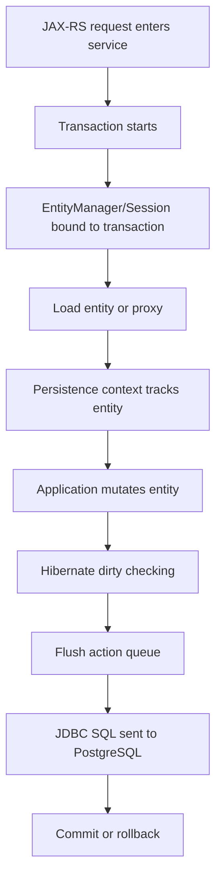
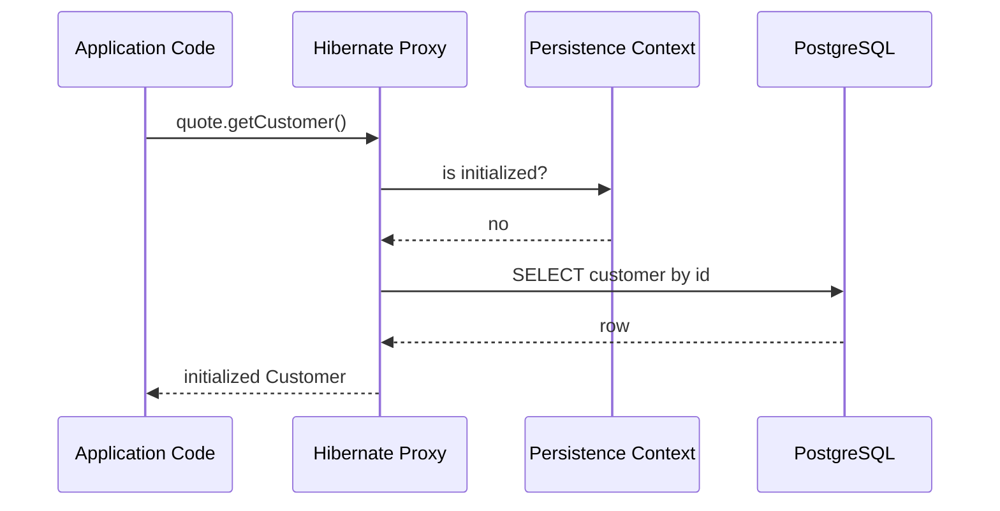

# Hibernate as JPA Provider

## 1. Core Thesis

JPA/Jakarta Persistence adalah specification.

Hibernate adalah salah satu provider yang menjalankan specification tersebut sekaligus menambahkan behavior, extension, optimization, dan trade-off sendiri.

Sebagai senior backend engineer, memahami JPA API saja tidak cukup. Production behavior yang Anda lihat di log, transaction, SQL, lazy loading, cache, batch operation, dan exception sering kali adalah behavior Hibernate.

Prinsip utama:

> Dalam aplikasi enterprise Java/JAX-RS, Anda menulis terhadap JPA, tetapi production incident sering terjadi karena detail Hibernate.

Contoh:

```java
Quote quote = entityManager.find(Quote.class, quoteId);
quote.changeStatus(APPROVED);
```

Kode ini terlihat sederhana. Tetapi Hibernate harus memutuskan:

- kapan `SELECT` dijalankan,
- apakah entity sudah ada di persistence context,
- apakah proxy harus di-initialize,
- apakah field berubah saat dirty checking,
- kapan `UPDATE` di-flush,
- apakah query sebelum commit memicu flush,
- apakah second-level cache perlu invalidation,
- apakah optimistic version berubah,
- apakah SQL batch bisa dipakai,
- apakah connection diambil dari pool sekarang atau nanti.

Jadi Hibernate bukan sekadar library mapping annotation ke SQL. Hibernate adalah runtime state machine untuk object persistence.

---

## 2. JPA Contract vs Hibernate Implementation

Bedakan tiga lapisan berikut:

| Layer | Peran | Contoh |
|---|---|---|
| Jakarta Persistence/JPA | Specification | `EntityManager`, `@Entity`, `@Id`, `@Version`, JPQL |
| Hibernate ORM | Provider implementation | `Session`, proxy, flush strategy, batch fetching, L2 cache |
| PostgreSQL | Database engine | MVCC, lock, sequence, planner, constraint, JSONB |

Kesalahan umum adalah menganggap semua behavior yang terlihat berasal dari JPA spec.

Contoh yang harus dibedakan:

| Behavior | JPA-level? | Hibernate-specific? | PostgreSQL-specific? |
|---|---:|---:|---:|
| Entity managed/detached | Yes | Implemented by Hibernate | No |
| Dirty checking | Yes conceptually | Concrete algorithm by Hibernate | No |
| Proxy class for lazy loading | Partially | Strongly Hibernate-specific | No |
| Sequence allocation optimization | Partially | Hibernate optimizer behavior | Uses PostgreSQL sequence |
| Second-level cache | Optional concept/provider | Hibernate implementation-specific | No |
| JSONB mapping | No standard portable mapping | Via custom type/provider extension | Yes |
| `SELECT FOR UPDATE SKIP LOCKED` | Via native query/hints | Provider behavior differs | Yes |

Senior review rule:

> Jika behavior memengaruhi correctness, jangan hanya bertanya “apakah ini valid JPA?” Tanyakan “bagaimana Hibernate mengeksekusinya terhadap PostgreSQL dalam transaction ini?”

---

## 3. Hibernate Mental Model

Hibernate mengelola entity melalui beberapa komponen utama:

- `SessionFactory`
- `Session`
- persistence context
- entity entry/state snapshot
- proxy/lazy initializer
- action queue
- flush process
- JDBC coordinator
- transaction integration
- cache layer

Dalam JPA API, Anda biasanya melihat:

```java
@PersistenceContext
EntityManager entityManager;
```

Di belakangnya, Hibernate memiliki konsep `Session`.

Secara praktis:

| JPA API | Hibernate counterpart | Mental model |
|---|---|---|
| `EntityManagerFactory` | `SessionFactory` | Heavy application-level factory |
| `EntityManager` | `Session` | Unit-of-work API/runtime context |
| Persistence context | Session persistence context | Identity map + snapshots + lifecycle state |
| JPQL | HQL/SQL generation engine | Query translated to SQL |
| Flush | Flush event/action queue | SQL synchronization process |

Hibernate bekerja seperti unit-of-work engine:



Failure biasanya muncul ketika engineer lupa bahwa `EntityManager`/`Session` bukan stateless DAO.

---

## 4. SessionFactory

`SessionFactory` adalah Hibernate runtime factory yang mahal dibuat dan biasanya hidup selama aplikasi hidup.

Tanggung jawabnya:

- menyimpan metadata entity mapping,
- mengetahui konfigurasi Hibernate,
- membangun `Session`,
- mengelola second-level cache region,
- mengintegrasikan connection provider,
- menyimpan query plan cache internal,
- memahami dialect database.

Dalam aplikasi Jakarta/JAX-RS enterprise, `SessionFactory` biasanya tidak dibuat manual oleh business code. Ia dikelola container/framework.

Hal yang penting untuk senior engineer:

- jangan membuat `SessionFactory` per request,
- jangan menganggap konfigurasi Hibernate bisa diubah dinamis tanpa konsekuensi,
- pastikan metadata mapping sinkron dengan migration,
- pahami dialect PostgreSQL yang digunakan,
- pahami lifecycle aplikasi saat deployment/rolling restart.

### Failure Mode: SessionFactory Recreated Too Often

Gejala:

- startup lambat,
- memory naik,
- connection spike,
- cache warm-up berulang,
- deployment lebih riskan.

Kemungkinan penyebab:

- konfigurasi persistence dibuat manual salah,
- test setup membuat factory terus-menerus,
- multiple persistence unit tidak perlu,
- classpath scanning terlalu luas.

### Internal Verification Checklist

- Cek siapa yang membuat `EntityManagerFactory`/`SessionFactory`.
- Cek apakah ada lebih dari satu persistence unit.
- Cek Hibernate dialect PostgreSQL.
- Cek entity scanning package.
- Cek startup log Hibernate.
- Cek integration test yang membuat factory berulang.
- Cek memory footprint startup.

---

## 5. Session

`Session` adalah Hibernate API yang kurang lebih setara dengan `EntityManager`.

Dalam application code berbasis JPA, Anda mungkin jarang memakai `Session` langsung. Namun Hibernate tetap menjalankan `Session` di belakang `EntityManager`.

`Session` bertindak sebagai:

- gateway ke persistence context,
- identity map untuk entity managed,
- tempat dirty checking dilakukan,
- tempat lazy proxy di-resolve,
- coordinator untuk flush,
- perantara ke JDBC connection,
- boundary runtime untuk unit-of-work.

Contoh unwrap:

```java
Session session = entityManager.unwrap(Session.class);
```

Ini bisa berguna untuk fitur Hibernate-specific, tetapi harus hati-hati.

### Kapan Unwrap ke Session Masuk Akal?

Masuk akal jika:

- perlu Hibernate statistics/debugging,
- perlu fitur provider-specific yang tidak ada di JPA,
- perlu tuning batch/flush mode spesifik,
- framework internal memang menstandarkan Hibernate API.

Berbahaya jika:

- membuat code tidak portable tanpa alasan,
- melewati abstraction repository,
- mencampur JPA dan native Hibernate secara acak,
- memperumit testing,
- memperkenalkan behavior yang tidak dipahami reviewer.

### Senior Rule

> Gunakan JPA API sebagai default. Gunakan Hibernate API langsung hanya ketika ada alasan teknis yang eksplisit dan terdokumentasi.

---

## 6. Persistence Context in Hibernate

Persistence context adalah identity map dan state tracker.

Dalam Hibernate, persistence context menyimpan:

- entity instance managed,
- identifier,
- entity status,
- loaded state snapshot,
- version value,
- lock mode,
- proxy references,
- collection wrappers,
- pending actions.

Contoh:

```java
Quote q1 = entityManager.find(Quote.class, quoteId);
Quote q2 = entityManager.find(Quote.class, quoteId);

assert q1 == q2;
```

Dalam transaction yang sama, Hibernate mengembalikan object yang sama karena first-level cache/persistence context.

Ini bagus untuk identity consistency, tetapi bisa menyebabkan stale state jika database diubah lewat jalur lain.

### MyBatis Update Behind Hibernate Context

```java
Quote quote = entityManager.find(Quote.class, quoteId);

quoteMapper.updateStatus(quoteId, APPROVED);

Quote again = entityManager.find(Quote.class, quoteId);

// again is same object as quote
// status may still be old unless refreshed/cleared
```

Hibernate tidak otomatis tahu bahwa MyBatis mengubah row yang sama.

### Design Implication

Jika Hibernate dan MyBatis hidup berdampingan:

- hindari MyBatis write terhadap table/entity yang sedang managed,
- lakukan explicit `flush()` sebelum MyBatis read yang bergantung pada JPA changes,
- lakukan `clear()` atau `refresh()` setelah MyBatis write jika JPA akan membaca entity yang sama,
- dokumentasikan ownership write path.

---

## 7. Entity State Snapshot

Dirty checking Hibernate bekerja dengan membandingkan state entity saat load dengan state saat flush.

Sederhana:

```java
Quote quote = entityManager.find(Quote.class, quoteId);
// Hibernate stores loaded snapshot

quote.setStatus(APPROVED);

// At flush, Hibernate compares current state vs snapshot
```

Jika berbeda, Hibernate membuat SQL `UPDATE`.

### Consequence

Setter biasa bisa menjadi database write.

Itulah alasan entity mutation di dalam transaction harus dianggap sebagai operation yang meaningful.

Buruk:

```java
quote.setUpdatedAt(Instant.now()); // harmless-looking
quote.setStatus(calculateStatus());
// developer lupa bahwa entity managed
```

Lebih baik:

```java
quote.approve(actor, clock.now());
```

Entity method domain-aware membuat mutation lebih eksplisit.

### Failure Mode: Accidental Update

Gejala:

- SQL `UPDATE` muncul padahal tidak ada repository `save`,
- updated_at berubah saat read endpoint,
- audit field berubah tanpa business event,
- optimistic version meningkat tanpa niat.

Penyebab umum:

- managed entity diubah untuk formatting response,
- mapper mengisi derived field ke entity managed,
- bidirectional relationship helper salah,
- lifecycle callback mengubah field tanpa sadar,
- entity dipakai sebagai DTO.

---

## 8. Dirty Checking

Dirty checking adalah salah satu fitur paling berguna sekaligus paling berbahaya di Hibernate.

Keuntungannya:

- application code tidak perlu explicit update untuk setiap field,
- aggregate lifecycle lebih natural,
- perubahan bisa dikumpulkan dalam satu unit-of-work,
- Hibernate bisa mengurutkan SQL berdasarkan dependency.

Risikonya:

- SQL tidak terlihat di call site,
- mutation kecil bisa menyebabkan update besar,
- transaction panjang menambah biaya dirty checking,
- persistence context besar memperlambat flush,
- accidental mutation menjadi database write.

### Dirty Checking Cost

Dirty checking bukan gratis.

Biaya dipengaruhi oleh:

- jumlah managed entity,
- jumlah property per entity,
- collection yang dimanage,
- bytecode enhancement atau snapshot comparison,
- flush frequency,
- transaction duration.

Jika transaction memproses ribuan entity managed, flush bisa mahal.

### Batch Processing Rule

Untuk batch besar dengan Hibernate:

```java
for (int i = 0; i < items.size(); i++) {
    entityManager.persist(items.get(i));

    if (i % batchSize == 0) {
        entityManager.flush();
        entityManager.clear();
    }
}
```

Tanpa `flush()` dan `clear()`, persistence context dapat tumbuh besar dan dirty checking menjadi bottleneck.

---

## 9. Flush Process

Flush adalah proses sinkronisasi persistence context ke database.

Flush dapat terjadi:

- saat commit,
- sebelum query tertentu,
- saat `entityManager.flush()` dipanggil manual,
- tergantung flush mode,
- saat provider perlu menjaga query consistency.

Flush bukan commit.

| Operation | Meaning |
|---|---|
| Flush | SQL dikirim ke database dalam transaction aktif |
| Commit | Transaction diselesaikan dan perubahan dibuat durable |
| Rollback | Transaction dibatalkan, termasuk SQL yang sudah di-flush |

Contoh:

```java
quote.approve();
entityManager.flush();
// SQL UPDATE may already be sent

throw new RuntimeException();
// transaction rollback, update not committed
```

### Flush Before Query

Hibernate bisa flush sebelum query agar query melihat perubahan pending.

```java
quote.changeStatus(APPROVED);

List<Quote> approved = entityManager
    .createQuery("select q from Quote q where q.status = :status", Quote.class)
    .setParameter("status", APPROVED)
    .getResultList();

// Hibernate may flush before SELECT
```

Ini mengejutkan bagi engineer yang mengira SQL hanya terjadi saat commit.

### Flush and MyBatis

Jika Anda mengubah entity JPA lalu menjalankan MyBatis query di transaction sama, MyBatis tidak otomatis memicu Hibernate flush.

```java
quote.changeStatus(APPROVED);

// MyBatis read may not see pending JPA change unless flush happens first
QuoteProjection p = quoteMapper.findProjection(quoteId);
```

Solusi jika memang harus:

```java
entityManager.flush();
QuoteProjection p = quoteMapper.findProjection(quoteId);
```

Tetapi lebih baik hindari mixed read/write path dalam use case sama kecuali ada alasan kuat.

---

## 10. Flush Mode

Flush mode mengatur kapan Hibernate melakukan flush otomatis.

Konsep umum:

| Flush Mode | Mental model |
|---|---|
| AUTO | Hibernate boleh flush sebelum query/commit jika perlu |
| COMMIT | Flush terutama saat commit, dengan caveat provider behavior |
| MANUAL | Provider-specific; flush manual, biasanya untuk advanced use |

Dalam JPA, flush mode sering terlihat sebagai:

```java
entityManager.setFlushMode(FlushModeType.COMMIT);
```

Dalam Hibernate-specific API, variasi flush mode bisa lebih detail.

### Jangan Jadikan Flush Mode sebagai Patch Buta

Mengubah flush mode untuk “menghilangkan update aneh” sering salah arah.

Pertanyaan yang lebih tepat:

- Mengapa entity managed dimutasi?
- Apakah read endpoint memegang entity managed terlalu lama?
- Apakah entity dipakai sebagai DTO?
- Apakah repository boundary bocor?
- Apakah MyBatis dan JPA bercampur dalam transaction yang sama?

Flush mode adalah tuning/semantic tool, bukan obat untuk mental model yang salah.

---

## 11. First-Level Cache

First-level cache adalah persistence context cache.

Sifatnya:

- selalu ada,
- scoped ke `EntityManager`/`Session`,
- menyimpan entity managed berdasarkan identity,
- tidak shared antar transaction/session,
- membuat repeated find by id dalam context yang sama tidak selalu query lagi.

Contoh:

```java
Quote q1 = entityManager.find(Quote.class, id);
Quote q2 = entityManager.find(Quote.class, id);
```

Query kedua dapat mengambil dari persistence context.

### Correctness Benefit

First-level cache menjaga identity consistency:

- satu row = satu object managed dalam context,
- perubahan pada object terlihat oleh caller lain dalam transaction sama,
- aggregate consistency lebih mudah.

### Correctness Risk

First-level cache bisa stale jika row diubah di luar Hibernate context:

- MyBatis update,
- raw JDBC update,
- trigger database,
- stored procedure,
- concurrent transaction yang commit lebih dulu,
- bulk JPQL update,
- native query update.

Solusi tergantung kasus:

```java
entityManager.refresh(entity);
```

atau:

```java
entityManager.clear();
```

Tetapi kedua operasi ini harus dipakai dengan sadar karena memengaruhi semua managed state.

---

## 12. Second-Level Cache

Second-level cache adalah cache provider-level yang bisa shared antar `Session`.

Sifatnya:

- optional,
- perlu configuration,
- per entity/collection/query region,
- bisa meningkatkan performance read-heavy data,
- bisa menyebabkan stale data jika invalidation salah,
- sangat berisiko jika data yang sama diubah oleh MyBatis/raw SQL tanpa cache awareness.

### Cocok untuk

- reference data yang jarang berubah,
- lookup table stabil,
- catalog metadata dengan invalidation jelas,
- data immutable,
- read-heavy endpoint dengan update path terkendali.

### Tidak cocok untuk

- high-write entity,
- status order/quote yang sering berubah,
- data tenant-sensitive tanpa cache key discipline,
- data yang juga di-update MyBatis,
- data yang diubah trigger/procedure tanpa Hibernate tahu,
- data yang memerlukan strict read-after-write lintas node.

### Critical Rule for MyBatis + Hibernate

> Jika MyBatis mengubah table yang entity-nya di-cache oleh Hibernate second-level cache, Anda punya risiko stale cache kecuali ada invalidation strategy eksplisit.

Internal review harus menanyakan:

- Apakah entity ini cacheable?
- Siapa saja write path ke table ini?
- Apakah ada mapper update?
- Apakah ada trigger/procedure?
- Bagaimana cache invalidated?
- Apakah cache tenant-aware?

---

## 13. Query Cache

Hibernate query cache menyimpan hasil query, biasanya berupa identifier list, bukan entity full object.

Query cache sering disalahpahami.

Ia bukan magic acceleration untuk semua query.

Risiko:

- invalidation sulit,
- parameter-sensitive,
- data churn membuat cache tidak efektif,
- query cache + entity cache harus dipahami bersama,
- bisa menyembunyikan query behavior saat debugging.

Gunakan query cache hanya jika:

- query read-heavy,
- data jarang berubah,
- parameter cardinality rendah,
- invalidation acceptable,
- observability cache tersedia,
- reviewer memahami konsekuensinya.

Hindari query cache untuk:

- search/filter dinamis banyak kombinasi,
- quote/order status yang berubah sering,
- tenant-specific high-cardinality query,
- operational dashboard real-time,
- data yang dimutasi MyBatis.

---

## 14. Proxy and Lazy Loading

Hibernate menggunakan proxy untuk lazy loading entity association.

Contoh:

```java
Quote quote = entityManager.find(Quote.class, quoteId);
Customer customer = quote.getCustomer();
```

Jika `customer` lazy, `getCustomer()` mungkin hanya mengembalikan proxy. SQL baru dijalankan ketika property customer diakses.

### Lazy Loading Lifecycle



### LazyInitializationException

Error klasik:

```text
failed to lazily initialize a collection of role: ..., could not initialize proxy - no Session
```

Artinya code mengakses lazy association setelah session/persistence context sudah closed.

Umumnya terjadi saat:

- entity dikembalikan langsung ke serialization layer,
- response mapper berjalan di luar transaction,
- async processing membawa entity keluar boundary,
- Open Session in View tidak aktif atau tidak diinginkan,
- test tidak merepresentasikan runtime transaction.

### Design Rule

Jangan mengandalkan lazy loading di boundary API.

Untuk endpoint JAX-RS:

- load data yang dibutuhkan secara eksplisit,
- gunakan DTO projection,
- gunakan fetch join/entity graph bila tepat,
- lakukan mapping response dalam transaction jika perlu,
- jangan return entity langsung.

---

## 15. Bytecode Enhancement Awareness

Hibernate dapat menggunakan bytecode enhancement untuk optimasi lazy loading, dirty tracking, dan association management.

Tidak semua project mengaktifkan ini.

Sebagai engineer, Anda tidak perlu langsung mengubah setting ini, tetapi perlu sadar bahwa behavior dirty checking/lazy loading bisa dipengaruhi konfigurasi enhancement.

Hal yang perlu diverifikasi:

- apakah build mengaktifkan Hibernate enhancer,
- apakah lazy loading field-level digunakan,
- apakah dirty tracking enhanced atau snapshot-based,
- apakah tooling coverage/test compatible,
- apakah ada class instrumentation saat build.

Risk:

- behavior test berbeda dari production jika enhancement hanya aktif di salah satu environment,
- debugging object field menjadi membingungkan,
- serialization/proxy behavior berubah,
- build plugin failure membuat runtime behavior berubah.

Internal verification harus dilakukan sebelum menyimpulkan dirty checking performance atau lazy loading behavior.

---

## 16. Hibernate Annotations vs JPA Annotations

JPA annotations portable:

```java
@Entity
@Table(name = "quote")
@Id
@GeneratedValue
@Column(name = "quote_number")
@Version
```

Hibernate-specific annotations:

```java
@BatchSize(size = 50)
@Fetch(FetchMode.SUBSELECT)
@Where(clause = "deleted = false")
@Filter(name = "tenantFilter")
@CreationTimestamp
@UpdateTimestamp
@Immutable
@NaturalId
```

Hibernate-specific annotations bisa berguna, tetapi menambah coupling ke provider.

### Review Rule

Setiap Hibernate-specific annotation harus menjawab:

- Mengapa JPA standard tidak cukup?
- Apa behavior runtime-nya?
- Apakah berlaku untuk PostgreSQL?
- Apakah memengaruhi query generation?
- Apakah konsisten dengan MyBatis query path?
- Apakah ada test yang membuktikan behavior?
- Apakah aman untuk migration/schema evolution?

### Example: `@Where`

`@Where(clause = "deleted = false")` terlihat nyaman untuk soft delete.

Risiko:

- hanya berlaku pada Hibernate-generated query tertentu,
- MyBatis tidak otomatis memakai filter ini,
- native query bisa melewati filter,
- admin/reporting use case mungkin butuh deleted rows,
- condition tersembunyi dari SQL reader.

Jika MyBatis dan Hibernate sama-sama membaca table soft-delete, wajib ada convention eksplisit.

---

## 17. Hibernate Configuration Areas

Konfigurasi Hibernate yang sering relevan:

| Area | Contoh concern |
|---|---|
| Dialect | PostgreSQL dialect compatibility |
| DDL generation | Jangan auto-update schema di production tanpa governance |
| SQL logging | Debugging vs PII leakage |
| Batch size | Insert/update batching |
| Fetch size | Large result read behavior |
| Statement timeout | Query safety |
| L2 cache | Stale data risk |
| Statistics | Observability |
| Flush mode | Consistency and surprise |
| Naming strategy | Entity/table/column mapping consistency |
| Timezone | Timestamp correctness |

### Production Rule: Disable Dangerous Auto-DDL

Di production enterprise system, schema evolution harus melalui migration tool seperti Liquibase/Flyway.

Hindari pola:

```properties
hibernate.hbm2ddl.auto=update
```

untuk production.

Alasan:

- migration tidak reviewable,
- perubahan schema tidak terkontrol,
- rollback/roll-forward sulit,
- multi-service compatibility window tidak terjaga,
- DDL bisa terjadi saat startup pod,
- tidak cocok untuk GitOps/IaC governance.

---

## 18. PostgreSQL Dialect Implications

Hibernate dialect menentukan SQL yang dihasilkan untuk database tertentu.

Untuk PostgreSQL, hal yang perlu diperhatikan:

- sequence handling,
- identity column support,
- pagination SQL,
- lock syntax,
- boolean mapping,
- timestamp/timezone handling,
- array/JSON support melalui extension/custom type,
- function registration,
- generated SQL compatibility.

### Failure Mode: Wrong Dialect

Gejala:

- SQL syntax error aneh,
- pagination tidak optimal,
- sequence/identity insert bermasalah,
- lock hint tidak sesuai,
- function tidak dikenali,
- migration schema tidak match dengan generated SQL expectation.

Internal verification:

- cek dialect property,
- cek Hibernate version vs PostgreSQL version,
- cek generated SQL di test,
- cek integration test dengan real PostgreSQL, bukan H2,
- cek custom type JSONB/array.

---

## 19. Sequence and Identifier Generation

Hibernate punya strategi identifier generation.

Umum:

- sequence,
- identity,
- table generator,
- UUID/manual id,
- pooled optimizer.

Untuk PostgreSQL enterprise system, sequence sering digunakan.

Contoh:

```java
@Id
@GeneratedValue(strategy = GenerationType.SEQUENCE, generator = "quote_seq")
@SequenceGenerator(
    name = "quote_seq",
    sequenceName = "quote_id_seq",
    allocationSize = 50
)
private Long id;
```

### Allocation Size Matters

`allocationSize` harus dipahami.

Jika allocation size Hibernate tidak sinkron dengan sequence increment/expectation, bisa muncul:

- gap id yang besar,
- duplicate id risk pada konfigurasi salah,
- performance buruk karena sequence call terlalu sering,
- kebingungan saat audit/debugging.

Gap ID biasanya bukan bug. Sequence tidak menjamin gapless ID, terutama saat rollback, cache, restart, atau allocation pooling.

### Review Questions

- Apakah id harus gapless? Jika iya, sequence biasa bukan jawabannya.
- Apakah sequence dibuat via migration?
- Apakah allocation size sesuai convention?
- Apakah id generated oleh DB atau application?
- Apakah MyBatis insert memakai sequence yang sama?
- Apakah ada multi-node behavior yang perlu dipahami?

---

## 20. Lazy Loading and JAX-RS Serialization

JAX-RS endpoint sering mengubah entity menjadi response JSON.

Bahaya besar:

```java
@GET
@Path("/{id}")
public Quote getQuote(@PathParam("id") Long id) {
    return quoteRepository.find(id);
}
```

Ini buruk jika `Quote` adalah JPA entity.

Risiko:

- lazy loading saat JSON serialization,
- recursive bidirectional relationship,
- N+1 saat serializer mengakses association,
- sensitive fields bocor,
- transaction sudah closed,
- entity internal contract bocor ke API.

Lebih baik:

```java
@GET
@Path("/{id}")
public QuoteResponse getQuote(@PathParam("id") Long id) {
    return quoteApplicationService.getQuoteResponse(id);
}
```

Service mengontrol query dan mapping:

```java
@Transactional
public QuoteResponse getQuoteResponse(Long id) {
    Quote quote = quoteRepository.findWithRequiredData(id);
    return quoteResponseMapper.toResponse(quote);
}
```

Atau gunakan DTO projection jika hanya read model.

---

## 21. Hibernate and Transaction Boundary

Hibernate Session biasanya terikat ke transaction.

Correctness rule:

> Entity managed hanya aman dimaknai dalam boundary persistence context aktif.

Jika entity keluar dari transaction:

- entity bisa detached,
- lazy association tidak bisa di-load,
- mutation tidak otomatis persistent,
- merge bisa menimbulkan surprise,
- stale data bisa terjadi.

### Long Transaction Risk

Transaction terlalu panjang menyebabkan:

- connection tertahan,
- lock tertahan,
- persistence context membesar,
- dirty checking makin mahal,
- stale decision window melebar,
- timeout meningkat,
- failure rollback lebih mahal.

Untuk JAX-RS service:

- hindari remote call dalam transaction jika tidak perlu,
- hindari streaming besar sambil memegang transaction tanpa desain eksplisit,
- batasi work dalam transaction pada database consistency work,
- publish event melalui outbox, bukan direct broker call dalam transaction tanpa pattern.

---

## 22. Hibernate and PostgreSQL Locks

Hibernate dapat menjalankan lock melalui JPA LockModeType atau native query.

Contoh pessimistic lock:

```java
Quote quote = entityManager.find(
    Quote.class,
    quoteId,
    LockModeType.PESSIMISTIC_WRITE
);
```

Hibernate akan menghasilkan SQL lock sesuai dialect.

Untuk PostgreSQL, perlu memahami:

- `SELECT FOR UPDATE`,
- `NOWAIT`,
- `SKIP LOCKED`,
- lock wait,
- deadlock,
- transaction duration,
- index choice memengaruhi row yang dikunci,
- isolation level memengaruhi visibility.

### Review Rule

Locking tidak boleh direview hanya dari annotation.

Harus dicek:

- SQL yang dihasilkan,
- index yang dipakai,
- transaction duration,
- timeout,
- retry policy,
- user-facing error mapping,
- concurrency test.

---

## 23. Hibernate Batch Fetching

Batch fetching membantu mengurangi N+1 ketika lazy association diakses untuk banyak entity.

Contoh:

```java
@BatchSize(size = 50)
@ManyToOne(fetch = FetchType.LAZY)
private Customer customer;
```

Atau konfigurasi global.

Manfaat:

- mengurangi jumlah query,
- tetap mempertahankan lazy loading,
- cocok untuk read path tertentu.

Risiko:

- masih hidden SQL,
- batch size salah bisa boros memory,
- query plan bisa berubah,
- tidak selalu lebih baik dari DTO projection/fetch join,
- sulit terlihat tanpa query count metric.

Senior heuristic:

- fetch join untuk satu use case spesifik,
- entity graph untuk loading plan eksplisit,
- batch fetching untuk pola repeated lazy access yang terkontrol,
- DTO projection untuk read model/reporting/API list.

---

## 24. Hibernate JDBC Batching

Hibernate dapat melakukan batching untuk insert/update/delete.

Konfigurasi umum:

```properties
hibernate.jdbc.batch_size=50
hibernate.order_inserts=true
hibernate.order_updates=true
```

Manfaat:

- mengurangi round trip,
- meningkatkan throughput bulk writes,
- cocok untuk import/backfill tertentu.

Risiko:

- identity generation bisa menghambat batching,
- persistence context tetap bisa membesar,
- error dalam batch lebih sulit didiagnosis,
- lock lebih lama jika transaction besar,
- rollback mahal jika chunk terlalu besar.

Batching Hibernate bukan pengganti desain chunking.

Untuk operasi besar, tetap gunakan:

- chunk size,
- flush/clear berkala,
- retry idempotent,
- timeout realistis,
- progress tracking,
- observability.

---

## 25. Hibernate Second-Level Cache and MyBatis Mixing

Ini salah satu area paling berbahaya.

Scenario:

1. Hibernate load `Quote` id 123 dan menyimpan di L2 cache.
2. MyBatis menjalankan `UPDATE quote SET status = 'APPROVED' WHERE id = 123`.
3. Hibernate session lain membaca `Quote` id 123.
4. Jika cache tidak invalidated, status lama bisa muncul.

Ini bukan bug PostgreSQL. Ini cache ownership bug.

### Safe Options

- Jangan cache entity yang juga di-write MyBatis.
- Batasi MyBatis untuk read-only projection.
- Pakai MyBatis untuk table berbeda/read model berbeda.
- Invalidate cache eksplisit jika ada integration yang aman.
- Hindari L2 cache untuk mutable business transaction data.
- Dokumentasikan owner write path.

### PR Review Questions

- Apakah table ini punya entity cacheable?
- Apakah mapper menulis table yang sama?
- Apakah stored procedure/trigger mengubah table ini?
- Bagaimana cache invalidation terjadi?
- Apakah read-after-write expectation strict?
- Apakah test mencakup stale cache?

---

## 26. Hidden Query Problem

Hibernate sering menghasilkan SQL yang tidak terlihat langsung dari code.

Sumber hidden query:

- lazy association access,
- flush before query,
- dirty checking update,
- cascade persist/remove,
- orphan removal,
- entity graph/fetch join effect,
- collection initialization,
- `equals()`/`toString()` yang mengakses lazy field,
- serializer mengakses getter,
- logging entity dengan lazy field.

### Dangerous Example

```java
log.info("Quote loaded: {}", quote);
```

Jika `toString()` mengakses lazy association, logging bisa memicu query.

### Guardrails

- Jangan buat `toString()` entity mengakses association.
- Jangan gunakan entity langsung di JSON response.
- Gunakan query count tests untuk endpoint penting.
- Enable SQL logging di local/test.
- Gunakan DTO projection untuk list endpoint.
- Hindari open-ended lazy traversal.

---

## 27. Hibernate Exceptions

Hibernate membungkus banyak error database/framework.

Kategori umum:

| Error | Meaning |
|---|---|
| `ConstraintViolationException` | Constraint DB violated |
| `StaleObjectStateException` | Optimistic lock conflict/stale entity |
| `LazyInitializationException` | Lazy association accessed without session |
| `NonUniqueObjectException` | Two objects with same identifier in session |
| `TransientObjectException` | Unsaved transient association referenced |
| `PersistentObjectException` | Detached entity passed to persist |
| `QueryException` | HQL/JPQL/query issue |
| `JDBCException` | JDBC-level failure wrapped by Hibernate |

Production handling tidak boleh hanya menangkap `Exception`.

Harus dipetakan ke:

- domain error,
- HTTP response,
- retryable/non-retryable classification,
- observability label,
- safe log message.

---

## 28. Hibernate Statistics

Hibernate statistics dapat membantu diagnosis:

- entity load count,
- entity fetch count,
- query execution count,
- query execution max time,
- second-level cache hit/miss/put,
- flush count,
- collection fetch count,
- optimistic failure count.

Namun jangan asal aktifkan di production tanpa memahami overhead.

Gunakan untuk:

- local debugging,
- integration test assertions,
- staging diagnosis,
- limited production observability jika approved.

### Useful Test Assertion

Misalnya endpoint detail quote harus maksimal N query.

```java
long before = statistics.getPrepareStatementCount();
service.getQuoteDetail(id);
long after = statistics.getPrepareStatementCount();
assertThat(after - before).isLessThanOrEqualTo(3);
```

Ini membantu mencegah N+1 regression.

---

## 29. Hibernate with PostgreSQL JSONB and Custom Types

JPA standard tidak memberi pengalaman JSONB PostgreSQL yang kaya.

Opsi yang umum:

- custom AttributeConverter,
- Hibernate custom type,
- native query,
- MyBatis mapper untuk query JSONB kompleks,
- library provider-specific.

Decision rule:

| Use case | Better option |
|---|---|
| Store/load JSON as opaque value | JPA converter may be enough |
| Query deeply into JSONB | MyBatis/native SQL often clearer |
| Index JSONB expression | Migration + explicit SQL review |
| Frequent partial update JSONB | MyBatis/native SQL likely safer |
| Domain object with strong lifecycle | JPA entity may still own aggregate |

Jangan memaksakan JPA untuk query JSONB kompleks jika SQL PostgreSQL eksplisit lebih jelas dan reviewable.

---

## 30. Hibernate and Migration Discipline

Hibernate mapping harus sinkron dengan migration.

Bahaya:

- entity field ada tetapi column belum ada,
- column nullable tetapi entity menganggap wajib,
- enum value berubah tanpa migration/data compatibility,
- sequence allocation mismatch,
- index tidak dibuat untuk query generated,
- constraint tidak sesuai validation,
- rename column dilakukan tanpa compatibility window,
- `hbm2ddl.auto` menutupi migration gap di local.

### Migration Review for Hibernate Entity Change

Setiap perubahan entity harus ditanya:

- Apakah migration schema ada?
- Apakah backward compatible dengan versi aplikasi lama?
- Apakah generated SQL berubah?
- Apakah JPQL/native query terdampak?
- Apakah MyBatis mapper juga perlu update?
- Apakah index/constraint perlu ditambah?
- Apakah data backfill diperlukan?
- Apakah tests memakai real PostgreSQL?

---

## 31. Hibernate in Kubernetes Runtime

Hibernate behavior juga dipengaruhi runtime Kubernetes/cloud:

- tiap pod punya connection pool sendiri,
- startup semua pod bisa memicu metadata validation/query,
- L2 cache local per pod bisa inconsistent jika tidak distributed/invalidation-aware,
- rolling deployment membuat schema compatibility penting,
- pod restart dapat mengubah sequence/cache behavior,
- network latency ke cloud DB memperbesar cost N+1,
- connection storm dapat terjadi saat scale-out.

### Runtime Review Questions

- Berapa replica service?
- Berapa max pool per pod?
- Apakah Hibernate melakukan schema validation saat startup?
- Apakah L2 cache local per pod?
- Apakah migration job selesai sebelum app rollout?
- Apakah deployment rolling backward-compatible?
- Apakah SQL chattiness aman terhadap latency cloud/on-prem hybrid?

---

## 32. Production Failure Modes

### 32.1 LazyInitializationException

Root cause:

- entity keluar dari transaction/session,
- serializer mengakses lazy field,
- mapping response dilakukan setelah session closed.

Fix:

- DTO projection,
- fetch join/entity graph,
- mapping dalam transaction,
- jangan return entity.

### 32.2 N+1 Query

Root cause:

- lazy association diakses dalam loop,
- serializer/logging memicu traversal,
- fetch strategy default tidak cocok.

Fix:

- fetch join,
- entity graph,
- batch fetching,
- DTO projection,
- query count test.

### 32.3 Unexpected Update

Root cause:

- managed entity dimutasi tidak sengaja,
- dirty checking saat flush,
- entity dipakai sebagai response model.

Fix:

- response DTO,
- domain method explicit,
- transaction boundary jelas,
- avoid mutating managed entity in read flow.

### 32.4 Stale Entity After MyBatis Update

Root cause:

- Hibernate first-level cache tidak tahu mapper update.

Fix:

- avoid mixed write path,
- flush/clear/refresh if necessary,
- separate repository ownership,
- tests.

### 32.5 Stale Second-Level Cache

Root cause:

- non-Hibernate write path terhadap cacheable entity.

Fix:

- disable cache for mutable entity,
- explicit invalidation,
- avoid MyBatis write for cacheable table.

### 32.6 Transaction Too Long

Root cause:

- remote call dalam transaction,
- batch besar tanpa chunk,
- streaming result tanpa boundary,
- JAX-RS endpoint melakukan banyak work di satu transaction.

Fix:

- shorten transaction,
- chunk batch,
- outbox for event publish,
- read-only transaction where appropriate.

---

## 33. Debugging Hibernate Issues

Urutan diagnosis praktis:

1. Reproduce dengan real PostgreSQL jika memungkinkan.
2. Enable SQL logging di local/test.
3. Lihat jumlah query, bukan hanya query lambat.
4. Cek transaction boundary.
5. Cek apakah entity masih managed.
6. Cek flush timing.
7. Cek lazy association access.
8. Cek generated SQL dan parameter.
9. Cek PostgreSQL `EXPLAIN` untuk query lambat.
10. Cek apakah ada MyBatis/raw SQL menulis table sama.
11. Cek second-level cache.
12. Cek migration/schema mismatch.
13. Tambahkan regression test.

### SQL Logging Caution

Jangan menyalakan parameter logging mentah di production tanpa redaction.

Risiko:

- PII bocor,
- token/customer data masuk log,
- compliance issue,
- log volume tinggi.

---

## 34. Testing Hibernate Behavior

Test penting:

- entity mapping test,
- relationship loading test,
- query count test,
- dirty checking test,
- flush before query test,
- optimistic lock test,
- pessimistic lock test,
- migration compatibility test,
- serialization boundary test,
- MyBatis + Hibernate coexistence test jika campur.

### Example: Dirty Checking Test

```java
@Test
void changingManagedEntityFlushesUpdate() {
    Quote quote = entityManager.find(Quote.class, quoteId);
    quote.changeStatus(APPROVED);

    entityManager.flush();
    entityManager.clear();

    Quote reloaded = entityManager.find(Quote.class, quoteId);
    assertThat(reloaded.getStatus()).isEqualTo(APPROVED);
}
```

### Example: Stale Context Test

```java
@Test
void mybatisUpdateDoesNotRefreshManagedEntityAutomatically() {
    Quote quote = entityManager.find(Quote.class, quoteId);

    quoteMapper.updateStatus(quoteId, APPROVED);

    assertThat(quote.getStatus()).isNotEqualTo(APPROVED);

    entityManager.refresh(quote);
    assertThat(quote.getStatus()).isEqualTo(APPROVED);
}
```

---

## 35. PR Review Checklist

Untuk perubahan Hibernate/JPA provider behavior, cek:

### Entity and Mapping

- Apakah annotation JPA/Hibernate sesuai schema?
- Apakah Hibernate-specific annotation benar-benar dibutuhkan?
- Apakah relationship lazy/eager dipilih sadar?
- Apakah cascade/orphan removal aman?
- Apakah entity keluar ke API response?

### Query and Loading

- Apakah generated SQL terlihat?
- Apakah ada N+1 risk?
- Apakah fetch join/entity graph/projection tepat?
- Apakah pagination stabil?
- Apakah query memakai index?

### Transaction and Flush

- Apakah mutation entity berada dalam transaction benar?
- Apakah flush timing dipahami?
- Apakah read-only flow memutasi entity?
- Apakah MyBatis/native SQL bercampur dalam transaction sama?

### Cache

- Apakah L2/query cache aktif?
- Apakah entity mutable di-cache?
- Apakah ada non-Hibernate write path?
- Apakah invalidation jelas?

### PostgreSQL

- Apakah dialect benar?
- Apakah sequence/allocation sesuai migration?
- Apakah lock SQL sesuai expectation?
- Apakah JSONB/array mapping ditest dengan PostgreSQL real?

### Production

- Apakah SQL logging aman?
- Apakah metrics tersedia?
- Apakah migration compatible?
- Apakah test mencakup failure mode?
- Apakah reviewer bisa membuktikan correctness?

---

## 36. Internal Verification Checklist

Gunakan checklist ini saat masuk codebase internal:

### Provider and Version

- Hibernate version.
- Jakarta Persistence/JPA version.
- PostgreSQL version.
- Hibernate dialect.
- JDBC driver version.

### Configuration

- DDL auto setting.
- Batch size.
- Fetch size.
- SQL logging.
- Statistics setting.
- Naming strategy.
- Timezone setting.
- Second-level cache setting.
- Query cache setting.

### Entity Runtime

- Entity scanning package.
- Hibernate-specific annotations.
- Lazy/eager defaults.
- Cascade/orphan removal patterns.
- Entity listener usage.
- Soft delete/tenant filter implementation.

### Transaction Integration

- Transaction manager.
- EntityManager scope.
- Session binding.
- Read-only transaction convention.
- Flush mode override.
- MyBatis/JPA transaction sharing.

### Mixing with MyBatis

- Table/entity also touched by mapper.
- Shared write path.
- Cache conflict risk.
- Explicit flush/clear/refresh convention.
- Tests for mixed paths.

### Observability

- SQL log local/test.
- Query count visibility.
- Hibernate statistics.
- Slow query correlation.
- Pool metrics.
- Lock/deadlock dashboard.

---

## 37. Practical Design Rules

1. Treat Hibernate as stateful unit-of-work runtime, not stateless DAO.
2. Never return JPA entity directly from JAX-RS API.
3. Keep transaction boundaries short and explicit.
4. Make entity mutation domain-intentional.
5. Prefer DTO projection for read-heavy list/search endpoints.
6. Use fetch join/entity graph deliberately, not randomly.
7. Avoid eager relationship by default.
8. Test query count for important endpoints.
9. Disable/avoid L2 cache for mutable data unless governance exists.
10. Do not mix MyBatis writes with Hibernate-managed cached entities.
11. Use migration tools as source of schema change, not Hibernate auto-DDL.
12. Verify generated SQL against PostgreSQL, not H2 assumptions.
13. Understand flush before query before blaming PostgreSQL.
14. Treat Hibernate-specific annotations as architecture decisions.
15. Document any direct `Session` usage.

---

## 38. Senior Engineer Heuristics

- If SQL is invisible, create visibility before optimizing.
- If entity is mutable, ask who owns its lifecycle.
- If lazy loading fixes one endpoint but breaks another, the loading plan is not explicit enough.
- If second-level cache is enabled, identify every write path.
- If MyBatis and Hibernate touch the same table, assume stale state until proven otherwise.
- If a read endpoint updates `updated_at`, entity boundary is leaking.
- If production query count is surprising, inspect serialization and logging.
- If migration changes a column, inspect entity, mapper, native query, JPQL, index, and tests together.
- If a transaction includes remote call plus entity mutation, challenge the boundary.
- If performance tuning starts by increasing pool size, check query count and transaction duration first.

---

## 39. Key Takeaways

Hibernate adalah provider JPA, tetapi dalam production ia adalah runtime persistence engine yang sangat opinionated.

Hal yang wajib dikuasai:

- `SessionFactory` adalah factory runtime heavy.
- `Session`/`EntityManager` adalah stateful unit-of-work context.
- Persistence context adalah first-level cache dan identity map.
- Dirty checking membuat mutation object menjadi SQL update.
- Flush bukan commit, dan bisa terjadi sebelum query.
- Lazy loading memakai proxy dan membutuhkan session aktif.
- Second-level cache bisa mempercepat read, tetapi berbahaya untuk mutable/mixed-write data.
- Hibernate-specific annotations harus direview sebagai provider coupling.
- PostgreSQL dialect, sequence, lock, JSONB, dan query plan tetap harus diverifikasi.
- Mixing MyBatis dan Hibernate pada table/use case sama adalah area correctness-risk tinggi.

Persistence engineer senior tidak hanya tahu annotation Hibernate. Ia tahu kapan Hibernate membantu, kapan menyembunyikan SQL, kapan cache menjadi stale, kapan flush mengejutkan, dan kapan pilihan ORM harus dikalahkan oleh query eksplisit.
