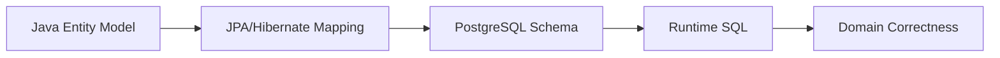

# JPA Entity Mapping

## 1. Core Thesis

JPA entity mapping adalah kontrak antara object model Java dan schema database.

Kontrak ini tidak boleh dianggap sekadar annotation boilerplate.

Mapping yang salah dapat menyebabkan:

- data ditulis ke column yang salah,
- nullable mismatch,
- enum corrupt,
- sequence conflict,
- unexpected update,
- optimistic lock tidak bekerja,
- soft delete tidak konsisten,
- migration gagal saat deployment,
- MyBatis mapper membaca schema dengan asumsi berbeda,
- PostgreSQL constraint dilanggar di production.

Prinsip utama:

> Entity mapping adalah executable schema assumption. Setiap annotation harus konsisten dengan migration, PostgreSQL behavior, transaction semantics, dan persistence ownership.

Contoh sederhana:

```java
@Entity
@Table(name = "quote")
public class Quote {

    @Id
    @GeneratedValue(strategy = GenerationType.SEQUENCE, generator = "quote_id_gen")
    @SequenceGenerator(
        name = "quote_id_gen",
        sequenceName = "quote_id_seq",
        allocationSize = 50
    )
    private Long id;

    @Column(name = "quote_number", nullable = false, unique = true, length = 64)
    private String quoteNumber;

    @Enumerated(EnumType.STRING)
    @Column(name = "status", nullable = false, length = 32)
    private QuoteStatus status;

    @Version
    @Column(name = "version", nullable = false)
    private long version;
}
```

Kode ini bukan hanya mapping. Ia menyatakan:

- table yang menjadi source of truth,
- strategy identifier,
- uniqueness expectation,
- enum storage format,
- optimistic locking strategy,
- schema constraint expectation.

Jika migration tidak mencerminkan ini, mapping menjadi janji palsu.

---

## 2. Entity Mapping as Contract

Entity mapping menghubungkan empat model:



Setiap perubahan di satu model harus diperiksa dampaknya ke model lain.

| Change | Must check |
|---|---|
| Add entity field | Column migration, nullability, default, mapper SQL |
| Rename field | Column mapping, JSON serialization, JPQL, tests |
| Change enum | Stored values, migration, backward compatibility |
| Change id strategy | Sequence/identity, insert SQL, MyBatis compatibility |
| Add `@Version` | Existing data backfill, update SQL, conflict handling |
| Add soft delete | Query filters, MyBatis WHERE, unique constraints |
| Add converter | DB representation, queryability, index, test |

Senior review mindset:

> Mapping change is schema contract change unless proven otherwise.

---

## 3. `@Entity`

`@Entity` menandai class sebagai persistent entity.

```java
@Entity
public class Quote {
    @Id
    private Long id;
}
```

JPA membutuhkan:

- class entity dikenali provider,
- primary key,
- accessible constructor minimal protected/no-arg,
- non-final class/method constraints tergantung proxy/enhancement,
- field/property access konsisten.

### Entity Is Not DTO

Entity bukan response DTO.

Alasan:

- entity membawa persistence lifecycle,
- lazy association bisa ter-trigger saat serialization,
- internal field bisa bocor,
- bidirectional relationship bisa recursive,
- dirty checking bisa terjadi saat entity dimutasi untuk presentation,
- API contract jadi terikat schema.

Buruk:

```java
@GET
public Quote getQuote(Long id) {
    return quoteRepository.findById(id);
}
```

Lebih baik:

```java
@GET
public QuoteResponse getQuote(Long id) {
    return quoteService.getQuoteResponse(id);
}
```

### Entity Boundary Rule

Entity aman digunakan di dalam application/domain/persistence boundary, bukan sebagai API contract eksternal.

---

## 4. `@Table`

`@Table` mengikat entity ke table.

```java
@Entity
@Table(name = "quote", schema = "sales")
public class Quote {
}
```

Hal yang harus dipastikan:

- nama table sesuai migration,
- schema sesuai deployment/database search path,
- naming strategy tidak mengejutkan,
- table ownership jelas,
- MyBatis mapper tidak menggunakan table dengan asumsi berbeda.

### Schema Field

Menggunakan `schema = "..."` bisa membantu eksplisit, tetapi juga bisa menyulitkan jika environment memakai schema berbeda.

Internal verification:

- apakah schema hardcoded diperbolehkan,
- apakah service memakai default search path,
- apakah multi-tenancy pakai schema berbeda,
- apakah migration tool membuat object di schema yang sama.

### Index/Unique Constraint in `@Table`

JPA mendukung metadata seperti:

```java
@Table(
    name = "quote",
    indexes = {
        @Index(name = "idx_quote_customer_id", columnList = "customer_id")
    },
    uniqueConstraints = {
        @UniqueConstraint(name = "uk_quote_number", columnNames = "quote_number")
    }
)
```

Namun dalam production, source of truth untuk index/constraint biasanya migration.

Annotation ini boleh menjadi documentation, tetapi jangan mengandalkan Hibernate auto-DDL untuk production governance.

---

## 5. Field Access vs Property Access

JPA bisa membaca mapping dari field atau getter.

Field access:

```java
@Id
private Long id;
```

Property access:

```java
@Id
public Long getId() {
    return id;
}
```

Rule:

> Jangan campur field access dan property access tanpa alasan kuat.

Field access biasanya lebih umum untuk domain entity karena:

- getter bisa berisi logic,
- setter bisa dibatasi,
- JPA tetap bisa mengakses field,
- domain method bisa menjaga invariant.

Buruk:

```java
@Id
private Long id;

@Column(name = "status")
public QuoteStatus getStatus() {
    return status;
}
```

Campuran seperti ini bisa membuat mapping membingungkan.

### Internal Verification Checklist

- Cek annotation ditempatkan konsisten di field atau getter.
- Cek entity base class.
- Cek embeddable access style.
- Cek apakah Lombok generated getter/setter mengganggu invariant.
- Cek apakah framework serialization memanggil getter yang punya side effect.

---

## 6. `@Column`

`@Column` mengikat property entity ke column database.

```java
@Column(name = "quote_number", nullable = false, length = 64)
private String quoteNumber;
```

Parameter umum:

| Attribute | Meaning |
|---|---|
| `name` | Nama column |
| `nullable` | Apakah null diperbolehkan menurut mapping |
| `length` | Panjang string default untuk DDL generation/documentation |
| `precision`/`scale` | Numeric precision |
| `insertable` | Apakah column ikut INSERT |
| `updatable` | Apakah column ikut UPDATE |
| `unique` | Unique constraint hint |
| `columnDefinition` | SQL fragment provider-specific |

### Mapping vs Real Constraint

`nullable = false` tidak cukup jika database column masih nullable.

```java
@Column(nullable = false)
private String quoteNumber;
```

Ini adalah mapping assumption. Constraint yang benar harus ada di PostgreSQL:

```sql
ALTER TABLE quote ALTER COLUMN quote_number SET NOT NULL;
```

### `insertable=false`, `updatable=false`

Berguna untuk:

- generated column,
- database-managed timestamp,
- read-only derived field,
- column yang dikelola trigger,
- mapping foreign key raw id plus relationship.

Tetapi berbahaya jika dipakai untuk menyembunyikan ownership yang tidak jelas.

Review questions:

- Siapa yang mengisi column?
- Apakah trigger/procedure terlibat?
- Apakah MyBatis menulis column ini?
- Apakah entity perlu refresh setelah insert/update?
- Apakah test membuktikan value benar?

---

## 7. Nullability Discipline

Nullability harus konsisten di semua layer:

| Layer | Example |
|---|---|
| API validation | required field |
| Domain invariant | constructor/method rejects null |
| JPA mapping | `nullable = false` |
| Database | `NOT NULL` |
| Test fixture | always provides value |

Bug umum:

- Java field primitive tetapi DB nullable,
- Java field wrapper tetapi domain menganggap wajib,
- `nullable=false` tetapi migration belum `NOT NULL`,
- database default tidak tercermin di entity,
- MyBatis insert tidak mengisi required column,
- JPA insert bergantung pada DB default tetapi entity state tidak refreshed.

### Senior Rule

> Untuk invariant kuat, database constraint wajib. Annotation saja bukan cukup.

---

## 8. `@Id`

Setiap entity membutuhkan identifier.

```java
@Id
private Long id;
```

Identifier berperan sebagai:

- primary key mapping,
- identity dalam persistence context,
- basis entity equality jika dirancang hati-hati,
- foreign key target,
- cache key,
- reference antar aggregate.

### ID Must Be Stable

Jangan ubah id entity setelah persistent.

Mutable id menyebabkan:

- persistence context corrupt,
- relationship rusak,
- cache key salah,
- update/delete tidak predictable.

### Natural ID vs Surrogate ID

Surrogate id:

```java
@Id
private Long id;
```

Natural id:

```java
@Column(name = "quote_number", unique = true, nullable = false)
private String quoteNumber;
```

Dalam enterprise system, biasanya gunakan surrogate id untuk primary key dan natural key sebagai unique constraint/business identifier.

Quote number mungkin business identifier, tetapi belum tentu primary key yang baik.

---

## 9. `@GeneratedValue`

`@GeneratedValue` mengatur strategi id generation.

```java
@GeneratedValue(strategy = GenerationType.SEQUENCE)
```

Strategi umum:

| Strategy | Meaning | PostgreSQL note |
|---|---|---|
| AUTO | Provider chooses | Bisa kurang eksplisit |
| SEQUENCE | Database sequence | Umum dan baik untuk batching |
| IDENTITY | Identity column | Bisa memengaruhi batching |
| TABLE | Table generator | Jarang direkomendasikan |

### Avoid Blind AUTO

`AUTO` bisa acceptable untuk prototype, tetapi dalam production lebih baik eksplisit.

Kenapa:

- reviewer tahu SQL behavior,
- migration bisa dibuat jelas,
- batching implication diketahui,
- MyBatis insert bisa selaras,
- schema compatibility lebih mudah.

---

## 10. Sequence Strategy

PostgreSQL sequence umum dipakai untuk generated id.

```java
@SequenceGenerator(
    name = "quote_id_generator",
    sequenceName = "quote_id_seq",
    allocationSize = 50
)
@GeneratedValue(
    strategy = GenerationType.SEQUENCE,
    generator = "quote_id_generator"
)
private Long id;
```

### Allocation Size

`allocationSize` mengontrol berapa id dialokasikan per sequence fetch oleh provider.

Manfaat allocation lebih besar:

- mengurangi round trip ke sequence,
- mendukung batching lebih baik,
- throughput insert meningkat.

Trade-off:

- gap id lebih terlihat,
- konfigurasi harus sinkron dengan expectation,
- debugging gapless id expectation harus diluruskan.

### Gapless ID Myth

Database sequence tidak cocok untuk requirement nomor dokumen gapless.

Rollback, crash, cache, allocation, dan concurrency dapat membuat gap.

Jika bisnis butuh quote number gapless, itu problem domain/numbering service, bukan primary key sequence biasa.

### Internal Verification Checklist

- Cek sequence dibuat via migration.
- Cek allocation size convention.
- Cek sequence ownership jika MyBatis insert juga pakai.
- Cek whether id gap acceptable.
- Cek batching behavior.
- Cek test insert dengan PostgreSQL real.

---

## 11. Identity Strategy

PostgreSQL identity column bisa digunakan:

```java
@GeneratedValue(strategy = GenerationType.IDENTITY)
private Long id;
```

Kelebihan:

- sederhana,
- database menghasilkan id saat insert,
- mapping mudah dipahami.

Kekurangan:

- provider perlu insert untuk mendapatkan id,
- batching bisa kurang optimal dibanding sequence,
- behavior tergantung provider/version,
- insert ordering bisa lebih terbatas.

Decision rule:

- Untuk high-throughput insert/batch, sequence sering lebih fleksibel.
- Untuk simple CRUD dengan volume rendah, identity bisa cukup.
- Ikuti convention internal agar tidak campur strategi tanpa alasan.

---

## 12. UUID Identifier

UUID dapat dipakai untuk id:

```java
@Id
@Column(name = "id", nullable = false, updatable = false)
private UUID id;
```

Kelebihan:

- bisa dibuat di application,
- tidak perlu sequence round trip,
- cocok untuk distributed creation,
- tidak mudah ditebak jika terekspos.

Trade-off:

- index lebih besar,
- random UUID dapat menyebabkan index fragmentation,
- debugging lebih sulit,
- sorting by id tidak natural,
- storage overhead.

Untuk PostgreSQL, pertimbangkan:

- tipe `uuid`, bukan `varchar`,
- generation source application vs DB,
- UUID version/ordering,
- index locality,
- API exposure.

---

## 13. `@Embedded` and `@Embeddable`

Embeddable cocok untuk value object yang disimpan dalam table yang sama.

```java
@Embeddable
public class Money {
    @Column(name = "amount", nullable = false)
    private BigDecimal amount;

    @Column(name = "currency", nullable = false, length = 3)
    private String currency;
}

@Entity
public class QuoteLine {
    @Embedded
    private Money price;
}
```

Manfaat:

- value object reusable,
- domain model lebih ekspresif,
- invariant bisa diletakkan di value object,
- mapping tetap ke column biasa.

Risiko:

- column naming collision,
- embedded object null handling,
- override column membingungkan,
- domain invariant tidak ditegakkan database jika constraint kurang.

### Attribute Override

```java
@Embedded
@AttributeOverrides({
    @AttributeOverride(name = "amount", column = @Column(name = "net_amount")),
    @AttributeOverride(name = "currency", column = @Column(name = "net_currency"))
})
private Money netPrice;
```

Review:

- apakah override jelas,
- apakah migration sesuai,
- apakah multiple embedded object tidak ambigu,
- apakah tests cover mapping.

---

## 14. Enum Mapping

Enum mapping adalah area correctness-risk tinggi.

Dua opsi umum:

```java
@Enumerated(EnumType.STRING)
private QuoteStatus status;
```

atau:

```java
@Enumerated(EnumType.ORDINAL)
private QuoteStatus status;
```

### Avoid ORDINAL for Business Data

`EnumType.ORDINAL` menyimpan angka berdasarkan urutan enum.

Bahaya:

```java
public enum QuoteStatus {
    DRAFT,
    APPROVED,
    CANCELLED
}
```

Jika kemudian disisipkan:

```java
public enum QuoteStatus {
    DRAFT,
    PENDING_APPROVAL,
    APPROVED,
    CANCELLED
}
```

Data lama bisa berubah makna.

Gunakan `STRING` untuk business status.

### PostgreSQL Native Enum

PostgreSQL punya native enum type, tetapi JPA mapping-nya butuh perhatian provider/custom type.

Trade-off:

| Approach | Pros | Cons |
|---|---|---|
| varchar + `EnumType.STRING` | Simple, flexible | DB tidak membatasi value tanpa check constraint |
| varchar + check constraint | Flexible + constrained | Migration update saat enum bertambah |
| PostgreSQL enum type | Strong DB type | Alter enum/versioning lebih khusus |

Senior rule:

> Untuk enterprise portability dan migration simplicity, string enum + DB check constraint sering menjadi pilihan pragmatis. Tetapi ikuti convention internal.

---

## 15. AttributeConverter

`AttributeConverter` mengubah value Java ke representation database.

```java
@Converter(autoApply = false)
public class QuoteStatusConverter implements AttributeConverter<QuoteStatus, String> {

    @Override
    public String convertToDatabaseColumn(QuoteStatus attribute) {
        return attribute == null ? null : attribute.code();
    }

    @Override
    public QuoteStatus convertToEntityAttribute(String dbData) {
        return dbData == null ? null : QuoteStatus.fromCode(dbData);
    }
}
```

Dipakai:

```java
@Convert(converter = QuoteStatusConverter.class)
@Column(name = "status", nullable = false)
private QuoteStatus status;
```

Cocok untuk:

- enum dengan stable code,
- value object sederhana,
- encrypted/tokenized value wrapper,
- custom scalar representation.

Risiko:

- queryability menurun jika representation kompleks,
- converter error saat membaca data lama,
- autoApply terlalu luas,
- MyBatis mapper harus memakai conversion logic yang sama atau compatible,
- index/constraint harus mengikuti DB representation.

### Converter Review Questions

- Apa DB representation final?
- Apakah readable di SQL/debugging?
- Apakah backward compatible?
- Apakah MyBatis path tahu format ini?
- Apakah invalid DB value ditangani?
- Apakah migration/backfill dibutuhkan?

---

## 16. JSONB Mapping

Untuk PostgreSQL JSONB, opsi mapping:

- store as `String`,
- store as `JsonNode`,
- custom converter,
- Hibernate custom type,
- native query/MyBatis for JSONB operations.

Contoh conceptual:

```java
@Column(name = "attributes", columnDefinition = "jsonb")
private String attributesJson;
```

Ini sederhana tetapi domain-poor.

Value object:

```java
@Convert(converter = QuoteAttributesConverter.class)
@Column(name = "attributes", columnDefinition = "jsonb")
private QuoteAttributes attributes;
```

### Decision Rule

Gunakan JPA JSONB mapping jika:

- JSON terutama disimpan/dibaca sebagai blob value,
- query terhadap field JSON minim,
- conversion stabil,
- tests real PostgreSQL tersedia.

Gunakan MyBatis/native SQL jika:

- banyak query operator JSONB,
- partial update JSONB,
- indexing expression intensif,
- reporting/filtering berdasarkan JSON field,
- SQL visibility penting.

---

## 17. Array Mapping

PostgreSQL array juga bukan area portable JPA standar yang sederhana.

Opsi:

- normalisasi ke child table,
- converter ke string/json,
- provider-specific array type,
- MyBatis TypeHandler,
- native query.

Decision rule:

- Jika array punya lifecycle/query sendiri, normalisasi.
- Jika array hanya metadata kecil, mapping scalar bisa cukup.
- Jika sering difilter dengan array operator PostgreSQL, MyBatis/native SQL bisa lebih jelas.

Review:

- Apakah array perlu index GIN?
- Apakah update parsial diperlukan?
- Apakah value order penting?
- Apakah MyBatis juga membaca format ini?
- Apakah test memakai PostgreSQL real?

---

## 18. `@Version`

`@Version` digunakan untuk optimistic locking.

```java
@Version
@Column(name = "version", nullable = false)
private long version;
```

Hibernate akan menambahkan version check saat update/delete.

Conceptual SQL:

```sql
UPDATE quote
SET status = ?, version = version + 1
WHERE id = ? AND version = ?;
```

Jika row count 0, terjadi optimistic lock failure.

### Why It Matters

Tanpa optimistic lock, lost update bisa terjadi:

1. User A load quote version 1.
2. User B load quote version 1.
3. User A approve quote.
4. User B cancel quote berdasarkan stale data.
5. Update terakhir menang jika tidak ada version check.

### MyBatis Compatibility

Jika table yang sama di-update MyBatis, mapper harus menghormati version.

```sql
UPDATE quote
SET status = #{status}, version = version + 1
WHERE id = #{id}
  AND version = #{expectedVersion}
```

Jika MyBatis update tidak menaikkan/check version, JPA optimistic lock bisa menjadi tidak reliable.

### Review Questions

- Apakah aggregate butuh optimistic lock?
- Apakah version column ada di migration?
- Apakah existing rows punya default version?
- Apakah MyBatis update path check/increment version?
- Apakah error mapped ke HTTP 409/conflict-like domain response?
- Apakah retry policy sesuai use case?

---

## 19. Created/Updated Timestamp

Audit timestamp bisa dikelola oleh:

- application code,
- JPA entity listener,
- Hibernate annotation,
- database default/trigger,
- MyBatis explicit column assignment.

Contoh Hibernate annotation:

```java
@CreationTimestamp
@Column(name = "created_at", nullable = false, updatable = false)
private Instant createdAt;

@UpdateTimestamp
@Column(name = "updated_at", nullable = false)
private Instant updatedAt;
```

Contoh application-controlled:

```java
quote.markUpdated(clock.now(), actorId);
```

Contoh DB default:

```sql
created_at timestamptz not null default now()
```

### Choose One Ownership Model

Jangan biarkan JPA, MyBatis, trigger, dan service masing-masing punya aturan sendiri.

Risiko:

- timestamp berbeda zona/waktu,
- update MyBatis tidak mengubah updated_at,
- read endpoint tidak sengaja mengubah updated_at via dirty checking,
- trigger mengubah value tetapi entity tidak refresh,
- audit tidak konsisten antar write path.

### Internal Verification Checklist

- Siapa owner timestamp?
- Apakah MyBatis update mengisi updated_at?
- Apakah JPA listener/annotation dipakai?
- Apakah database trigger ada?
- Apakah timezone `timestamptz` digunakan?
- Apakah clock source disepakati?

---

## 20. Created By / Updated By

Audit user fields lebih kompleks dari timestamp karena membutuhkan actor context.

```java
@Column(name = "created_by", nullable = false, updatable = false)
private String createdBy;

@Column(name = "updated_by", nullable = false)
private String updatedBy;
```

Pertanyaan penting:

- Dari mana actor context berasal?
- Bagaimana system user/batch job direpresentasikan?
- Bagaimana message consumer mengisi actor?
- Bagaimana Camunda workflow action mengisi actor?
- Bagaimana MyBatis dan JPA share audit logic?
- Apakah audit field wajib database constraint?

Jangan sembunyikan actor context terlalu jauh dalam static/thread local tanpa governance. Di async/event-driven path, context propagation mudah gagal.

---

## 21. Soft Delete Mapping

Soft delete menyimpan row tetapi menandainya deleted.

```java
@Column(name = "deleted", nullable = false)
private boolean deleted;

@Column(name = "deleted_at")
private Instant deletedAt;
```

Hibernate-specific approach mungkin memakai `@Where` atau `@SQLDelete`.

Conceptual:

```java
@SQLDelete(sql = "UPDATE quote SET deleted = true WHERE id = ?")
@Where(clause = "deleted = false")
@Entity
public class Quote {
}
```

### Risk

Soft delete adalah cross-cutting query rule.

Jika JPA menyembunyikan deleted rows tetapi MyBatis tidak:

```sql
SELECT * FROM quote WHERE id = #{id}
```

Mapper bisa mengembalikan row deleted.

### Soft Delete Review

- Apakah semua read path filter deleted?
- Apakah admin/reporting butuh include deleted?
- Apakah unique constraint mempertimbangkan deleted?
- Apakah foreign key masih valid?
- Apakah cascade soft delete ada?
- Apakah MyBatis query ikut convention?
- Apakah `@Where` cukup atau terlalu tersembunyi?

### Unique Constraint with Soft Delete

Jika quote number unique hanya untuk non-deleted rows, PostgreSQL partial unique index mungkin diperlukan:

```sql
CREATE UNIQUE INDEX uk_quote_number_active
ON quote (quote_number)
WHERE deleted = false;
```

Ini harus di migration, bukan hanya annotation.

---

## 22. Immutable Entity

Entity immutable cocok untuk:

- reference data,
- historical snapshot,
- event record,
- audit record,
- read-only view mapping.

Hibernate-specific:

```java
@Immutable
@Entity
@Table(name = "quote_audit")
public class QuoteAuditRecord {
}
```

Manfaat:

- mencegah dirty checking update,
- menyatakan intent read-only,
- cocok untuk audit/history.

Risiko:

- developer mengira perubahan akan tersimpan,
- MyBatis mungkin tetap bisa update table,
- DB permission tidak otomatis read-only,
- mapping immutable bukan pengganti database governance.

Review:

- Apakah table benar-benar append-only/read-only?
- Apakah migration mencegah update/delete jika perlu?
- Apakah service tidak expose mutation?
- Apakah MyBatis write path tidak ada?

---

## 23. Database Defaults and Generated Columns

Database default:

```sql
created_at timestamptz not null default now()
```

Generated column:

```sql
total_amount numeric generated always as (...) stored
```

JPA mapping perlu hati-hati.

```java
@Column(name = "created_at", insertable = false, updatable = false)
private Instant createdAt;
```

Jika DB mengisi value, entity mungkin tidak otomatis punya value setelah flush kecuali provider melakukan returning/refresh atau entity di-reload.

Review questions:

- Apakah application butuh value langsung setelah insert?
- Apakah Hibernate generated value annotation diperlukan?
- Apakah MyBatis memakai `RETURNING`?
- Apakah refresh dilakukan?
- Apakah tests memverifikasi value setelah persist?

---

## 24. Column Definition

`columnDefinition` memungkinkan SQL spesifik database:

```java
@Column(name = "attributes", columnDefinition = "jsonb")
private String attributes;
```

Gunakan dengan sadar.

Kelebihan:

- mendokumentasikan tipe PostgreSQL,
- membantu DDL generation di non-production,
- memperjelas mapping.

Risiko:

- provider-specific,
- portability turun,
- bisa bertentangan dengan migration,
- memberi ilusi bahwa annotation adalah source of truth schema.

Rule:

> Untuk production, migration tetap source of truth. `columnDefinition` adalah metadata mapping, bukan pengganti DDL reviewed.

---

## 25. Naming Strategy

Hibernate naming strategy dapat mengubah nama class/field menjadi table/column.

Contoh:

```java
private String quoteNumber;
```

bisa menjadi:

```sql
quote_number
```

tergantung strategy.

Dalam enterprise codebase, explicit naming sering lebih aman untuk table penting:

```java
@Column(name = "quote_number")
private String quoteNumber;
```

Keuntungan explicit:

- mengurangi surprise,
- memudahkan grep antara code dan schema,
- membantu MyBatis mapper alignment,
- memudahkan review migration.

Trade-off:

- lebih verbose,
- butuh disiplin saat rename.

Internal verification:

- cek naming strategy global,
- cek apakah annotation explicit convention,
- cek mismatch entity vs migration,
- cek mapper SQL memakai nama yang sama.

---

## 26. Equality and HashCode

Entity equality adalah topik riskan.

Masalah:

- id generated baru tersedia setelah persist,
- proxy class Hibernate bisa memengaruhi `getClass()` comparison,
- mutable business key berbahaya,
- collection Set bisa rusak jika hash berubah,
- lazy field tidak boleh dipakai di equals/hashCode.

Bad:

```java
@Override
public int hashCode() {
    return Objects.hash(id, status, customer.getName());
}
```

Ini bisa:

- memicu lazy loading,
- berubah setelah status berubah,
- tidak stabil.

Safer heuristic:

- gunakan immutable natural key jika benar-benar stable,
- atau gunakan id dengan hati-hati setelah assigned,
- jangan gunakan mutable fields,
- jangan traverse relationship,
- test proxy equality jika penting.

Jika team punya base entity convention, ikuti dan pahami konsekuensinya.

---

## 27. Lombok and Entity Mapping

Lombok bisa membantu tetapi berbahaya untuk JPA entity.

Hati-hati dengan:

```java
@Data
@Entity
public class Quote {
}
```

`@Data` menghasilkan:

- getter/setter semua field,
- equals/hashCode semua field,
- toString semua field.

Risiko:

- lazy loading dalam `toString`,
- relationship traversal recursive,
- hashCode berubah,
- invariant domain bypass via setter publik,
- accidental mutation.

Lebih aman:

- gunakan getter selektif,
- hindari setter publik untuk field yang dijaga invariant,
- exclude association dari toString,
- tulis equals/hashCode manual atau convention base class,
- gunakan domain methods.

Review:

- Apakah entity memakai `@Data`?
- Apakah setter membuka invariant?
- Apakah toString mengakses lazy association?
- Apakah equals/hashCode melibatkan mutable field?

---

## 28. Entity Mapping and MyBatis Coexistence

Jika JPA entity dan MyBatis mapper menyentuh table sama, mapping harus sinkron.

Contoh risk:

Entity:

```java
@Column(name = "status", nullable = false)
@Convert(converter = QuoteStatusConverter.class)
private QuoteStatus status;
```

MyBatis:

```xml
<result property="status" column="status"/>
```

Jika converter menyimpan stable code seperti `APR`, tetapi MyBatis menganggap value database adalah enum name `APPROVED`, data bisa salah dibaca atau corrupt.

### Shared Mapping Risks

- enum representation berbeda,
- timestamp ownership berbeda,
- soft delete filter berbeda,
- version increment berbeda,
- audit field berbeda,
- tenant condition berbeda,
- JSONB converter berbeda,
- null/default assumption berbeda.

### Governance Rule

> Jika dua framework mengakses table sama, DB representation harus dianggap public contract internal dan wajib diuji dari dua sisi.

---

## 29. Entity Mapping and PostgreSQL Constraints

JPA annotation tidak menggantikan constraint database.

| JPA Mapping | PostgreSQL Constraint Needed? |
|---|---|
| `nullable=false` | `NOT NULL` |
| `unique=true` | unique constraint/index |
| `@Version` | version column default/not null |
| enum string | check constraint or controlled values |
| length | varchar length or check |
| relationship optional=false | NOT NULL + FK |
| soft delete uniqueness | partial unique index |

Database constraint penting karena:

- MyBatis/raw SQL bisa bypass JPA validation,
- concurrent transaction butuh DB arbitration,
- application bug tetap dicegah,
- data correctness tidak bergantung hanya pada service code.

---

## 30. Entity Mapping and Migration

Setiap mapping change harus punya migration strategy.

### Add Non-Nullable Column

Naive:

```sql
ALTER TABLE quote ADD COLUMN source text NOT NULL;
```

Berbahaya jika table sudah berisi data.

Safer expand-contract:

1. Add nullable column.
2. Deploy app that writes new column.
3. Backfill existing rows.
4. Add NOT NULL constraint.
5. Remove fallback code jika ada.

### Rename Column

Naive rename bisa memutus app versi lama saat rolling deployment.

Safer:

1. Add new column.
2. Dual-write old and new.
3. Backfill.
4. Dual-read or switch read.
5. Deploy all services.
6. Drop old column later.

### Review Rule

> Entity mapping can move faster than schema only in local code. In production, schema compatibility window controls the pace.

---

## 31. Entity Mapping and Transaction Boundary

Mapping memengaruhi transaction behavior.

Contoh:

- `@Version` menambah optimistic lock check saat flush.
- Cascade persist dapat menambah banyak insert dalam transaction.
- Orphan removal dapat menambah delete/update saat collection berubah.
- Generated id strategy memengaruhi kapan insert harus terjadi.
- DB default/trigger dapat membutuhkan refresh dalam transaction.
- Soft delete custom SQL mengubah delete semantics.

Jangan review mapping tanpa bertanya:

- SQL apa yang akan muncul saat flush?
- Apakah SQL itu berada dalam transaction yang tepat?
- Apakah lock/constraint mungkin gagal?
- Apakah rollback behavior benar?
- Apakah event/outbox melihat state yang benar?

---

## 32. Entity Mapping and Event-Driven Architecture

Dalam event-driven system, entity mapping memengaruhi event correctness.

Contoh outbox:

```java
quote.approve(actor);
outboxRepository.append(QuoteApprovedEvent.from(quote));
```

Jika `quote` memakai generated field dari DB trigger yang belum refreshed, event bisa membawa data salah.

Jika MyBatis update bypass JPA entity, domain event dari entity tidak muncul.

Jika optimistic version tidak sinkron, event ordering bisa ambigu.

Checklist:

- Apakah event dibuat dari state entity yang sudah final?
- Apakah flush diperlukan sebelum outbox append?
- Apakah DB-generated value dibutuhkan event?
- Apakah MyBatis write path juga membuat outbox event?
- Apakah version/timestamp digunakan untuk ordering?
- Apakah transaction mencakup entity update dan outbox insert?

---

## 33. Entity Mapping and Kubernetes/Cloud Deployment

Mapping problem sering muncul saat deployment, bukan saat local dev.

Contoh:

- pod versi baru mengharapkan column baru,
- pod versi lama masih menulis column lama,
- migration job belum selesai,
- read replica lag menampilkan schema/data lama,
- rolling deployment memperpanjang compatibility window,
- Hibernate schema validation gagal startup,
- multiple services berbagi table dengan mapping berbeda.

Production rule:

> Mapping change harus kompatibel dengan deployment topology.

Internal verification:

- Apakah migration berjalan sebelum app rollout?
- Apakah old/new app version compatible?
- Apakah schema validation setting aman?
- Apakah on-prem/cloud deployment punya urutan berbeda?
- Apakah rollback app masih compatible dengan schema baru?

---

## 34. Common Failure Modes

### 34.1 Column Missing

Gejala:

```text
column quote0_.source does not exist
```

Root cause:

- entity field ditambah tetapi migration belum jalan,
- environment schema tertinggal,
- wrong schema/search path,
- deployment order salah.

### 34.2 Null Constraint Violation

Root cause:

- entity tidak mengisi required field,
- MyBatis insert lupa column,
- DB default tidak ada,
- validation tidak jalan.

### 34.3 Enum Mapping Error

Root cause:

- enum renamed,
- DB value lama tidak dikenali,
- ordinal berubah,
- MyBatis/JPA representation berbeda.

### 34.4 Optimistic Lock Not Working

Root cause:

- no `@Version`,
- MyBatis update bypass version,
- version nullable/default salah,
- bulk update tidak increment version.

### 34.5 Soft Deleted Data Appears

Root cause:

- MyBatis query tidak filter deleted,
- native query bypass `@Where`,
- admin/reporting path reuse wrong mapper,
- unique constraint tidak partial.

### 34.6 Audit Fields Inconsistent

Root cause:

- JPA listener dan MyBatis manual update berbeda,
- trigger mengubah value tanpa refresh,
- actor context tidak tersedia di async path.

---

## 35. Debugging Mapping Issues

Urutan diagnosis:

1. Cek entity annotation.
2. Cek migration DDL aktual.
3. Cek PostgreSQL schema dengan `\d` atau information_schema.
4. Cek generated SQL Hibernate.
5. Cek MyBatis SQL jika table sama.
6. Cek null/default/constraint.
7. Cek enum DB values.
8. Cek sequence definition.
9. Cek transaction/flush timing.
10. Cek test data fixture.
11. Cek deployment/migration order.
12. Tambahkan regression test.

### Practical SQL Checks

```sql
select column_name, data_type, is_nullable
from information_schema.columns
where table_name = 'quote'
order by ordinal_position;
```

```sql
select constraint_name, constraint_type
from information_schema.table_constraints
where table_name = 'quote';
```

```sql
select sequencename, increment_by, cache_size
from pg_sequences
where sequencename = 'quote_id_seq';
```

---

## 36. Testing Entity Mapping

Test yang harus ada untuk mapping penting:

- persist and reload entity,
- update and reload entity,
- enum round trip,
- converter round trip,
- embedded value mapping,
- optimistic lock conflict,
- timestamp/audit behavior,
- soft delete behavior,
- DB default behavior,
- MyBatis/JPA compatibility if shared table,
- migration compatibility test.

### Example: Enum Round Trip

```java
@Test
void quoteStatusRoundTrip() {
    Quote quote = Quote.draft("Q-001");
    entityManager.persist(quote);
    entityManager.flush();
    entityManager.clear();

    Quote loaded = entityManager.find(Quote.class, quote.getId());
    assertThat(loaded.getStatus()).isEqualTo(QuoteStatus.DRAFT);
}
```

### Example: Optimistic Lock

```java
@Test
void concurrentUpdateFailsWithVersionConflict() {
    Quote q1 = tx1.find(Quote.class, id);
    Quote q2 = tx2.find(Quote.class, id);

    q1.approve();
    tx1.commit();

    q2.cancel();
    assertThatThrownBy(() -> tx2.commit())
        .isInstanceOf(OptimisticLockException.class);
}
```

---

## 37. PR Review Checklist

### Mapping Basics

- Entity has explicit table mapping.
- Column names match migration.
- Nullability matches DB constraints.
- Length/precision/scale are appropriate.
- Field/property access is consistent.
- No accidental entity-as-DTO exposure.

### Identifier

- ID strategy is explicit.
- Sequence/identity exists in migration.
- Allocation size is intentional.
- ID is immutable.
- Business key has unique constraint if needed.

### Enum and Converter

- No ordinal enum for business data.
- Converter representation is stable.
- Invalid DB values handled.
- MyBatis path uses compatible representation.
- Check constraint/migration updated.

### Version and Locking

- `@Version` exists where concurrent update matters.
- Existing rows initialized.
- MyBatis update checks/increments version if same table.
- Error mapping handles conflict.

### Audit and Timestamp

- Owner of created/updated timestamps is clear.
- Actor context is clear.
- MyBatis/JPA/trigger behavior consistent.
- Timezone is correct.

### Soft Delete

- Read filters consistent.
- MyBatis/native query respects deleted condition.
- Unique constraints account for deleted rows.
- Admin/reporting exceptions documented.

### Migration

- Migration exists.
- Backward compatibility considered.
- Backfill considered.
- Rollback/roll-forward considered.
- Tests use real PostgreSQL.

---

## 38. Internal Verification Checklist

Gunakan ini saat mempelajari codebase internal:

### Entity Structure

- Di mana package entity berada?
- Apakah entity dipisah per module/domain?
- Apakah ada base entity?
- Apakah Lombok digunakan?
- Apakah entity punya domain methods atau public setters?

### Mapping Convention

- Apakah table/column explicit?
- Apakah naming strategy global dipakai?
- Apakah schema explicit?
- Apakah sequence naming convention ada?
- Apakah enum pakai STRING/converter/native enum?

### Schema Alignment

- Apakah migration tool source of truth?
- Apakah Hibernate auto-DDL disabled di production?
- Apakah schema validation aktif?
- Apakah test schema sama dengan production PostgreSQL?

### Audit/Soft Delete/Tenant

- Bagaimana created/updated fields diisi?
- Bagaimana soft delete dilakukan?
- Bagaimana tenant filter dilakukan?
- Apakah MyBatis mengikuti aturan yang sama?
- Apakah trigger/procedure terlibat?

### MyBatis Coexistence

- Table mana yang punya entity dan mapper sekaligus?
- Apakah mapper menulis table entity?
- Apakah enum/converter representation sama?
- Apakah version/timestamp/soft delete konsisten?
- Apakah ada mixed tests?

### Production Evidence

- Mapping incident apa yang pernah terjadi?
- Migration failure apa yang pernah terjadi?
- Slow query apa yang berasal dari mapping/fetching?
- Apakah dashboard bisa menghubungkan endpoint ke SQL?
- Siapa reviewer utama persistence mapping?

---

## 39. Practical Design Rules

1. Treat entity mapping as a schema contract.
2. Use explicit table and column names for important enterprise tables.
3. Keep entity out of API response.
4. Prefer `EnumType.STRING` or stable converter over ordinal.
5. Use database constraints for strong invariants.
6. Make id generation strategy explicit.
7. Do not expect sequence IDs to be gapless.
8. Use `@Version` for aggregate with concurrent modifications.
9. Ensure MyBatis updates respect version if sharing table.
10. Decide one owner for audit timestamps.
11. Do not hide soft delete rules only in Hibernate if MyBatis also reads table.
12. Avoid `@Data` on JPA entity.
13. Do not use mutable/lazy fields in equals/hashCode/toString.
14. Keep migration and entity mapping in the same review scope.
15. Test mapping against real PostgreSQL.

---

## 40. Senior Engineer Heuristics

- If annotation and migration disagree, migration/database wins in production.
- If MyBatis and JPA disagree about column representation, data correctness is already at risk.
- If a field is required by business, enforce it at database too.
- If enum value is persisted, renaming enum is data migration, not refactor only.
- If soft delete exists, every read path is suspect until checked.
- If ID must be gapless, do not use normal sequence as business number.
- If entity has public setters for everything, invariants are probably weak.
- If entity is serialized to JSON, lazy loading and data leakage risk are high.
- If mapping change ships without migration test, deployment risk is high.
- If MyBatis writes table with `@Version`, check row count and version increment.

---

## 41. Key Takeaways

JPA entity mapping is not annotation decoration. It is a runtime contract between Java object state, Hibernate behavior, PostgreSQL schema, migration discipline, transaction correctness, and production operations.

Hal yang wajib dikuasai:

- `@Entity` membawa lifecycle, bukan DTO semantics.
- `@Table` dan `@Column` harus sinkron dengan migration.
- Nullability harus dijaga di API/domain/JPA/database.
- Identifier strategy memengaruhi insert, batching, sequence, dan MyBatis compatibility.
- Enum ordinal berbahaya untuk business state.
- AttributeConverter harus direview sebagai DB representation contract.
- `@Version` penting untuk optimistic locking, tetapi harus dihormati semua write path.
- Audit timestamp/user harus punya ownership tunggal.
- Soft delete adalah query rule lintas framework, bukan sekadar annotation.
- Mapping change harus compatible dengan rolling deployment dan schema migration.
- Test entity mapping harus memakai PostgreSQL real untuk behavior yang PostgreSQL-specific.

Senior persistence engineer membaca entity mapping seperti membaca desain data ownership, transaction correctness, dan production failure surface.
