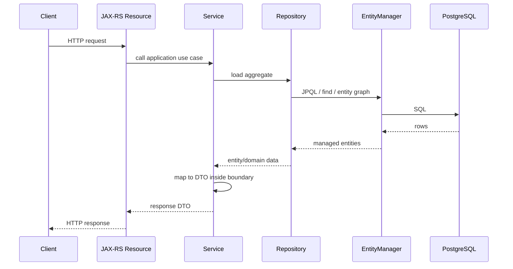
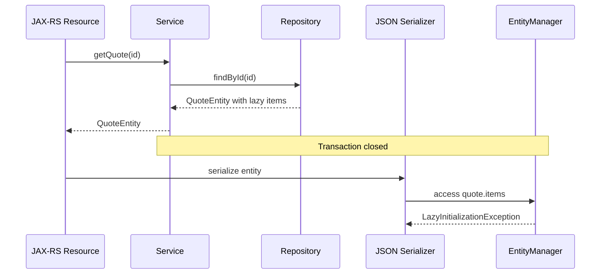

# Part 013 — JPA Relationship Mapping

Relationship mapping adalah salah satu area JPA/Hibernate yang paling sering terlihat sederhana di code review tetapi mahal di production.

Annotation seperti `@OneToMany`, `@ManyToOne`, `@JoinColumn`, `cascade`, dan `fetch` terlihat deklaratif. Tetapi di runtime, annotation tersebut memengaruhi:

- query yang dihasilkan Hibernate,
- kapan SQL dieksekusi,
- siapa pemilik foreign key,
- kapan child row ikut disimpan atau dihapus,
- apakah object graph membesar tanpa sadar,
- apakah endpoint JAX-RS meledak menjadi ratusan query,
- apakah serialize response memicu lazy loading,
- apakah update kecil berubah menjadi delete/insert besar,
- apakah transaction boundary menjadi terlalu panjang.

Untuk senior backend engineer, relationship mapping bukan sekadar "menghubungkan object". Ini adalah keputusan persistence ownership dan query-shape.

---

## 1. Mental Model: Database Relationship vs Object Relationship

Relasi database dan relasi object bukan hal yang sama.

Di PostgreSQL, relationship biasanya diwujudkan sebagai:

- foreign key,
- join table,
- unique constraint,
- index,
- check constraint,
- sometimes trigger or function-side enforcement.

Di Java object model, relationship diwujudkan sebagai reference:

```java
quote.getItems()
quoteItem.getQuote()
```

Masalah muncul ketika kita menganggap dua model ini identik.

Database relationship menjawab:

> Row mana yang menunjuk ke row mana, constraint apa yang menjaga integritasnya, dan index apa yang membuat join efisien?

JPA relationship menjawab:

> Object mana yang dapat dinavigasi dari object lain, siapa yang mengelola foreign key, kapan child diload, dan perubahan object graph apa yang diterjemahkan menjadi SQL?

Perbedaan ini penting karena JPA relationship bisa membuat persistence behavior tersembunyi di balik operasi object biasa.

Contoh sederhana:

```java
quote.getItems().add(item);
```

Secara Java, ini hanya menambah object ke collection.

Secara Hibernate, tergantung mapping-nya, ini bisa berarti:

- insert child row,
- update foreign key,
- delete orphan,
- trigger dirty checking,
- initialize lazy collection,
- produce multiple SQL statements saat flush.

---

## 2. Relationship Mapping Is Not API Modelling

Kesalahan umum di enterprise service adalah menjadikan JPA entity graph sebagai API response graph.

Contoh smell:

```java
@Path("/quotes")
public class QuoteResource {
    @GET
    @Path("/{id}")
    public QuoteEntity getQuote(@PathParam("id") UUID id) {
        return quoteRepository.findById(id);
    }
}
```

Ini berbahaya karena:

- JPA entity keluar dari persistence boundary,
- JSON serializer dapat memicu lazy loading,
- bidirectional relationship bisa menyebabkan recursive serialization,
- field internal seperti audit/version/tenant dapat bocor,
- query shape dikontrol serializer, bukan repository,
- transaction mungkin sudah selesai saat lazy field diakses.

Dalam sistem JAX-RS enterprise, entity relationship harus dipakai untuk persistence lifecycle, bukan langsung sebagai API contract.

Lebih aman:

```java
@GET
@Path("/{id}")
public QuoteResponse getQuote(@PathParam("id") UUID id) {
    QuoteDetailsView view = quoteQueryRepository.findQuoteDetails(id);
    return QuoteResponse.from(view);
}
```

Atau gunakan DTO projection/query model untuk response shape.

---

## 3. Relationship Ownership: The Most Important Concept

Dalam JPA, relationship ownership menentukan sisi mana yang mengelola foreign key.

Ownership tidak selalu sama dengan domain ownership.

### Database ownership

Jika table `quote_item` punya column `quote_id`, maka secara database foreign key berada di child table:

```sql
create table quote_item (
    id uuid primary key,
    quote_id uuid not null references quote(id),
    product_code text not null,
    quantity numeric not null
);
```

### JPA ownership

Sisi owning dalam JPA adalah sisi yang punya `@JoinColumn`.

```java
@Entity
@Table(name = "quote_item")
public class QuoteItemEntity {
    @ManyToOne(fetch = FetchType.LAZY, optional = false)
    @JoinColumn(name = "quote_id", nullable = false)
    private QuoteEntity quote;
}
```

Jika `QuoteEntity` punya collection:

```java
@Entity
@Table(name = "quote")
public class QuoteEntity {
    @OneToMany(mappedBy = "quote", cascade = CascadeType.ALL, orphanRemoval = true)
    private List<QuoteItemEntity> items = new ArrayList<>();
}
```

`mappedBy = "quote"` berarti collection ini bukan owning side. Yang mengontrol foreign key adalah `QuoteItemEntity.quote`.

### Practical invariant

Jika bidirectional relationship digunakan, update kedua sisi secara konsisten:

```java
public void addItem(QuoteItemEntity item) {
    items.add(item);
    item.setQuote(this);
}

public void removeItem(QuoteItemEntity item) {
    items.remove(item);
    item.setQuote(null);
}
```

Kalau hanya `items.add(item)` tanpa `item.setQuote(this)`, object graph terlihat benar dari parent side, tetapi owning side belum tentu benar saat flush.

---

## 4. ManyToOne: Usually the Most Predictable Relationship

`@ManyToOne` sering menjadi relationship paling aman karena foreign key berada pada table entity saat ini.

Contoh:

```java
@Entity
@Table(name = "quote_item")
public class QuoteItemEntity {
    @Id
    private UUID id;

    @ManyToOne(fetch = FetchType.LAZY, optional = false)
    @JoinColumn(name = "quote_id", nullable = false)
    private QuoteEntity quote;
}
```

Recommendation:

- default-kan `fetch = FetchType.LAZY`,
- set `optional = false` jika foreign key `NOT NULL`,
- pastikan `@JoinColumn(nullable = false)` sinkron dengan schema,
- pastikan ada index pada foreign key jika sering join/filter,
- hindari expose `quote` langsung ke API response.

### Failure mode

`@ManyToOne` default JPA adalah eager. Ini sering menjadi sumber hidden query.

Buruk:

```java
@ManyToOne
@JoinColumn(name = "account_id")
private AccountEntity account;
```

Lebih aman:

```java
@ManyToOne(fetch = FetchType.LAZY)
@JoinColumn(name = "account_id")
private AccountEntity account;
```

### PR review question

Saat melihat `@ManyToOne`, tanya:

> Apakah relationship ini perlu dinavigasi sebagai object, atau cukup simpan foreign key ID?

Dalam banyak command/write path, menyimpan `accountId` sebagai scalar bisa lebih sederhana daripada memuat `AccountEntity` penuh.

---

## 5. OneToMany: Powerful but Dangerous

`@OneToMany` sering menggoda karena domain terlihat natural:

```java
quote.getItems()
```

Tetapi collection relationship membawa risiko:

- lazy initialization di luar transaction,
- N+1 saat iterasi,
- object graph besar,
- cascade surprise,
- orphan removal surprise,
- dirty checking collection mahal,
- accidental delete/insert saat replace collection,
- serialization recursion.

Contoh mapping yang relatif aman:

```java
@OneToMany(
    mappedBy = "quote",
    cascade = CascadeType.ALL,
    orphanRemoval = true
)
private List<QuoteItemEntity> items = new ArrayList<>();
```

Mapping ini cocok jika:

- item benar-benar bagian dari lifecycle aggregate quote,
- item tidak hidup tanpa quote,
- update quote dan item memang satu transaction boundary,
- ukuran collection bounded dan masuk akal,
- delete item saat dilepas dari quote memang behavior yang benar.

Mapping ini berbahaya jika:

- collection bisa sangat besar,
- child punya lifecycle independen,
- child sering diupdate oleh use case lain,
- delete child tidak boleh otomatis,
- parent sering dibaca tanpa child,
- endpoint list parent bisa memicu banyak child load.

---

## 6. Unidirectional OneToMany: Usually Avoid Unless Deliberate

Unidirectional `@OneToMany` sering terlihat bersih dari sisi Java:

```java
@OneToMany(cascade = CascadeType.ALL)
@JoinColumn(name = "quote_id")
private List<QuoteItemEntity> items;
```

Namun ini bisa menghasilkan SQL yang tidak intuitif. Hibernate dapat melakukan insert child lalu update foreign key, tergantung mapping dan generation strategy.

Lebih predictable biasanya bidirectional dengan owning side di child:

```java
@ManyToOne(fetch = FetchType.LAZY)
@JoinColumn(name = "quote_id", nullable = false)
private QuoteEntity quote;
```

Dan parent:

```java
@OneToMany(mappedBy = "quote", cascade = CascadeType.ALL, orphanRemoval = true)
private List<QuoteItemEntity> items = new ArrayList<>();
```

Rule of thumb:

- `ManyToOne` owning side di child biasanya paling jelas.
- `OneToMany` parent-side collection harus dibatasi untuk aggregate lifecycle yang benar-benar dimiliki parent.
- Hindari collection relationship hanya demi kenyamanan navigasi.

---

## 7. OneToOne: Use Carefully

`@OneToOne` sering dipakai untuk memecah table besar atau memodelkan extension record.

Contoh:

```java
@Entity
@Table(name = "quote")
public class QuoteEntity {
    @OneToOne(mappedBy = "quote", fetch = FetchType.LAZY, cascade = CascadeType.ALL)
    private QuotePricingSummaryEntity pricingSummary;
}
```

Child side:

```java
@Entity
@Table(name = "quote_pricing_summary")
public class QuotePricingSummaryEntity {
    @OneToOne(fetch = FetchType.LAZY, optional = false)
    @JoinColumn(name = "quote_id", nullable = false, unique = true)
    private QuoteEntity quote;
}
```

Important database invariant:

```sql
alter table quote_pricing_summary
add constraint uq_quote_pricing_summary_quote_id unique (quote_id);
```

Tanpa unique constraint, database sebenarnya mengizinkan many-to-one, meskipun Java mapping menyatakan one-to-one.

### Failure mode

Lazy loading untuk `@OneToOne` bisa lebih tricky daripada `@ManyToOne`, tergantung arah relasi, bytecode enhancement, optionality, dan provider behavior. Jangan mengandalkan asumsi bahwa semua `@OneToOne(fetch = LAZY)` pasti lazy tanpa verifikasi SQL log.

---

## 8. ManyToMany: Usually a Smell in Enterprise Domains

Direct `@ManyToMany` terlihat ringkas:

```java
@ManyToMany
@JoinTable(
    name = "user_role",
    joinColumns = @JoinColumn(name = "user_id"),
    inverseJoinColumns = @JoinColumn(name = "role_id")
)
private Set<RoleEntity> roles;
```

Untuk domain sederhana, ini bisa diterima. Namun dalam enterprise systems, join table sering punya metadata:

- status,
- effective date,
- created by,
- created time,
- tenant id,
- source system,
- audit version,
- soft delete,
- ordering,
- business attributes.

Begitu join table punya meaning, jangan gunakan direct ManyToMany. Jadikan join table sebagai entity eksplisit.

Lebih baik:

```java
@Entity
@Table(name = "user_role_assignment")
public class UserRoleAssignmentEntity {
    @ManyToOne(fetch = FetchType.LAZY, optional = false)
    @JoinColumn(name = "user_id", nullable = false)
    private UserEntity user;

    @ManyToOne(fetch = FetchType.LAZY, optional = false)
    @JoinColumn(name = "role_id", nullable = false)
    private RoleEntity role;

    @Column(name = "effective_from", nullable = false)
    private Instant effectiveFrom;

    @Column(name = "assigned_by", nullable = false)
    private String assignedBy;
}
```

Rule:

> In enterprise systems, prefer explicit association entity over direct `@ManyToMany` unless the join table is truly pure and stable.

---

## 9. Cascade: Lifecycle Propagation, Not Convenience

Cascade menjawab:

> Jika operasi dilakukan pada parent entity, apakah operasi itu ikut diterapkan ke child entity?

Common cascade types:

- `PERSIST`
- `MERGE`
- `REMOVE`
- `REFRESH`
- `DETACH`
- `ALL`

Cascade bukan fitur untuk "biar tidak perlu save manual". Cascade adalah lifecycle ownership decision.

Aman jika:

```java
@OneToMany(mappedBy = "quote", cascade = CascadeType.ALL, orphanRemoval = true)
private List<QuoteItemEntity> items;
```

Dengan asumsi:

- `QuoteItem` tidak punya lifecycle independen,
- item dibuat/dihapus hanya melalui `Quote`,
- aggregate boundary benar,
- collection size bounded,
- deletion behavior benar.

Berbahaya jika:

```java
@ManyToOne(cascade = CascadeType.ALL)
private AccountEntity account;
```

Ini dapat menyebabkan operasi pada child ikut mem-persist/merge/remove parent/shared entity.

Rule:

- Cascade dari aggregate root ke owned child bisa valid.
- Cascade dari child ke parent biasanya red flag.
- Cascade ke shared reference data hampir selalu berbahaya.
- `CascadeType.REMOVE` harus direview sangat ketat.

---

## 10. Orphan Removal: Delete by Collection Mutation

`orphanRemoval = true` berarti child row akan dihapus ketika dilepas dari parent collection.

```java
@OneToMany(mappedBy = "quote", cascade = CascadeType.ALL, orphanRemoval = true)
private List<QuoteItemEntity> items;
```

Jika code melakukan:

```java
quote.getItems().remove(item);
```

Hibernate dapat menerjemahkannya menjadi `DELETE FROM quote_item ...` saat flush.

Ini benar untuk owned child.

Ini berbahaya jika developer mengira remove dari collection hanya "detach dari object graph".

### Dangerous pattern: replacing collection

```java
quote.setItems(newItems);
```

Jika mapping memakai orphan removal, replace collection bisa menyebabkan delete/insert massal atau exception tergantung bagaimana collection dikelola Hibernate.

Lebih aman:

```java
quote.clearItems();
for (QuoteItemEntity item : newItems) {
    quote.addItem(item);
}
```

Tetapi tetap review cost SQL-nya. Untuk collection besar, pendekatan differential update lebih baik.

---

## 11. FetchType: Query Strategy Hidden in Mapping

JPA default fetch behavior sering menjebak:

| Relationship | JPA default | Safer default for enterprise systems |
| --- | --- | --- |
| `@ManyToOne` | EAGER | LAZY |
| `@OneToOne` | EAGER | LAZY, verify actual SQL |
| `@OneToMany` | LAZY | LAZY |
| `@ManyToMany` | LAZY | Avoid or LAZY |

Default eager pada `ManyToOne` dan `OneToOne` adalah sumber hidden query.

Safer baseline:

```java
@ManyToOne(fetch = FetchType.LAZY)
private CustomerEntity customer;
```

Namun `LAZY` bukan silver bullet. Lazy berarti data akan diambil saat property diakses. Jika akses terjadi dalam loop, N+1 tetap terjadi.

```java
for (QuoteEntity quote : quotes) {
    log.info("customer={}", quote.getCustomer().getName());
}
```

Jika `quotes` berisi 100 row, ini bisa menghasilkan 1 query quote + 100 query customer.

Fetching strategy harus dipilih per use case, bukan hanya per mapping.

---

## 12. LazyInitializationException Is a Boundary Smell

`LazyInitializationException` biasanya terjadi ketika lazy relationship diakses setelah persistence context/transaction selesai.

Contoh:

```java
QuoteEntity quote = quoteRepository.findById(id);
return QuoteResponse.from(quote); // accesses quote.getItems() outside transaction
```

Possible fixes:

1. Load data yang dibutuhkan di repository dengan fetch join/entity graph.
2. Gunakan DTO projection.
3. Map entity ke DTO di dalam transaction boundary.
4. Jangan expose entity ke serializer.

Hindari solusi default seperti Open Session In View untuk API service tanpa governance ketat. Itu dapat memperpanjang persistence context sampai serialization dan membuat query terjadi di layer yang tidak terlihat.

---

## 13. Relationship Mapping and Aggregate Boundary

Dalam domain modelling, aggregate boundary menentukan object mana yang harus konsisten dalam satu transaction.

Relationship mapping seharusnya mengikuti aggregate boundary, bukan semua foreign key database.

Misalnya pada quote/order domain:

- `Quote` -> `QuoteItem`: mungkin satu aggregate.
- `Quote` -> `CustomerAccount`: mungkin reference ke aggregate lain.
- `Order` -> `OrderLine`: mungkin satu aggregate.
- `Order` -> `BillingAccount`: mungkin reference.
- `QuoteItem` -> `ProductCatalogEntry`: biasanya reference/read-only snapshot, bukan cascade-owned child.

Mapping lifecycle harus berbeda:

```java
@OneToMany(mappedBy = "quote", cascade = CascadeType.ALL, orphanRemoval = true)
private List<QuoteItemEntity> items;
```

vs

```java
@ManyToOne(fetch = FetchType.LAZY)
@JoinColumn(name = "account_id", insertable = false, updatable = false)
private AccountEntity account;

@Column(name = "account_id", nullable = false)
private UUID accountId;
```

Pattern scalar foreign key + optional relationship bisa berguna jika command path hanya butuh ID tetapi occasional query butuh navigation.

---

## 14. Relationship Mapping and PostgreSQL

JPA mapping harus selalu diverifikasi terhadap PostgreSQL schema.

### Foreign key nullability

Jika Java mapping menyatakan wajib:

```java
@ManyToOne(optional = false)
@JoinColumn(name = "quote_id", nullable = false)
private QuoteEntity quote;
```

Schema harus sejalan:

```sql
quote_id uuid not null references quote(id)
```

Jika schema nullable tetapi mapping non-null, bug bisa muncul saat membaca legacy rows.

Jika schema not null tetapi mapping optional, bug bisa muncul sebelum flush/commit.

### Index on foreign key

PostgreSQL tidak otomatis membuat index untuk foreign key referencing column. Jika join/filter/delete parent sering terjadi, foreign key index sering dibutuhkan.

```sql
create index idx_quote_item_quote_id on quote_item (quote_id);
```

Tanpa index, operasi seperti load items by quote, join, atau delete parent bisa mahal.

### Unique constraint for one-to-one

`@OneToOne` harus didukung unique constraint di database.

### Delete behavior

JPA cascade remove berbeda dari database `ON DELETE CASCADE`.

- JPA cascade terjadi di application/Hibernate lifecycle.
- DB cascade terjadi di database saat delete parent.

Mencampur keduanya tanpa awareness bisa membuat audit, trigger, dan expected SQL sulit dipahami.

---

## 15. Relationship Mapping and Transaction Boundary

Relationship access sering membutuhkan active persistence context.

Dalam JAX-RS service, request lifecycle kira-kira:



Potential failure:



Correctness rule:

> The repository/service layer must define response query shape before the transaction ends. The serializer must not discover persistence requirements accidentally.

---

## 16. Bidirectional Relationship Pitfalls

Bidirectional mapping can be useful, but it increases maintenance burden.

Problems:

- both sides must be kept consistent in memory,
- JSON serialization can recurse,
- `equals`/`hashCode` can accidentally traverse graph,
- debugging object graph is harder,
- cascading and orphan removal become more complex,
- collection mutation has SQL consequences.

Avoid putting relationship fields in `equals`, `hashCode`, and `toString`.

Bad:

```java
@Override
public String toString() {
    return "QuoteEntity{" +
        "id=" + id +
        ", items=" + items +
        '}';
}
```

This can trigger lazy loading or recursive traversal.

Better:

```java
@Override
public String toString() {
    return "QuoteEntity{id=" + id + '}';
}
```

For `equals`/`hashCode`, be extremely careful with generated IDs, proxies, and mutable fields. In many enterprise codebases, entity equality convention should be standardized internally.

---

## 17. Relationship Mapping and MyBatis Coexistence

If the same table is accessed by both JPA relationships and MyBatis mapper, relationship mapping becomes more dangerous.

Example:

1. JPA loads `QuoteEntity` with `items` lazy collection.
2. MyBatis updates `quote_item` rows in the same transaction.
3. JPA persistence context still holds stale entity/collection state.
4. Later flush or serialization uses stale data.

Possible mitigations:

- avoid same aggregate mutation through both JPA and MyBatis,
- use MyBatis for projection/read model only,
- explicit `flush()` before MyBatis read if JPA changes must be visible,
- explicit `clear()` or `refresh()` after MyBatis write if JPA state may be stale,
- avoid second-level cache for mixed-access entities,
- document table ownership.

Relationship-heavy aggregates are usually better kept under one persistence model.

If JPA owns aggregate lifecycle, MyBatis should not silently mutate child tables behind the persistence context.

---

## 18. Common Anti-Patterns

### Anti-pattern 1: Eager everywhere

```java
@ManyToOne(fetch = FetchType.EAGER)
private CustomerEntity customer;
```

This causes hidden query expansion and makes endpoint cost hard to predict.

### Anti-pattern 2: Cascade all on shared references

```java
@ManyToOne(cascade = CascadeType.ALL)
private ProductEntity product;
```

A quote item should not persist/remove product catalog reference.

### Anti-pattern 3: Direct ManyToMany in domain with metadata

If join table has attributes, use association entity.

### Anti-pattern 4: Entity graph as response graph

Returning JPA entities from JAX-RS resource couples API to persistence internals.

### Anti-pattern 5: Orphan removal without lifecycle ownership

Do not enable orphan removal unless removal from collection truly means delete row.

### Anti-pattern 6: Relationship used for every foreign key

Not every FK needs object navigation. Sometimes scalar ID is enough.

### Anti-pattern 7: No FK/index in database

JPA mapping without database constraint is weak correctness.

### Anti-pattern 8: Collection relationship on unbounded child set

A parent with potentially thousands/millions of children should not casually expose `List<ChildEntity>`.

---

## 19. Debugging Relationship Mapping Issues

### Symptom: endpoint slow

Check:

- SQL count,
- repeated SELECT pattern,
- lazy loading in loop,
- eager relationship chain,
- serialization-triggered loading,
- missing index on FK,
- bad query plan.

### Symptom: unexpected delete

Check:

- `orphanRemoval = true`,
- `CascadeType.REMOVE`,
- collection replacement,
- parent delete behavior,
- database `ON DELETE CASCADE`,
- flush log.

### Symptom: unexpected update

Check:

- dirty checking from managed entity mutation,
- bidirectional helper method,
- merge behavior,
- flush before query,
- cascade merge.

### Symptom: LazyInitializationException

Check:

- transaction boundary,
- DTO mapping location,
- entity exposure to resource/serializer,
- fetch join/entity graph usage,
- Open Session In View setting if any.

### Symptom: stale relationship data

Check:

- MyBatis/JPA mixed access,
- first-level cache,
- second-level cache,
- missing refresh/clear,
- transaction ordering,
- isolation level.

---

## 20. Relationship Mapping Review Checklist

Use this checklist during PR review.

### Ownership

- Which table owns the foreign key?
- Which JPA side owns the relationship?
- Is `mappedBy` correct?
- Are helper methods maintaining both sides?
- Is database FK aligned with mapping?

### Fetching

- Are `ManyToOne` and `OneToOne` explicitly `LAZY` unless justified?
- Is there a known query shape for the use case?
- Could this create N+1?
- Is fetch join/entity graph/projection more appropriate?
- Will serializer access lazy fields?

### Cascade and lifecycle

- Is cascade used only for true lifecycle ownership?
- Is `CascadeType.REMOVE` justified?
- Is orphan removal justified?
- Could removing from collection delete production data unexpectedly?
- Are shared reference entities protected from cascade?

### Schema alignment

- Do nullability and optionality match?
- Is one-to-one backed by unique constraint?
- Are foreign keys indexed where needed?
- Are delete rules clear between JPA cascade and DB cascade?
- Are tenant/soft-delete/effective-date filters considered?

### Performance

- Is collection size bounded?
- Is query count tested?
- Is generated SQL visible?
- Is FK index present?
- Is DTO projection better for read endpoint?

### MyBatis/JPA coexistence

- Does MyBatis update the same table that JPA relationship manages?
- Could persistence context become stale?
- Is explicit flush/clear/refresh needed?
- Is second-level cache unsafe here?
- Is table ownership documented?

---

## 21. Internal Verification Checklist

Use this checklist inside the actual CSG/team codebase. Do not assume these details; verify them.

### Repository/package structure

- Where are JPA entities located?
- Where are repositories located?
- Are relationship-heavy entities concentrated in specific modules?
- Are API DTOs separated from entities?
- Are MapStruct/manual mappers used?

### Entity mapping

- Which entities use `@OneToMany`?
- Which entities use direct `@ManyToMany`?
- Which relationships use cascade all?
- Which relationships use orphan removal?
- Which `ManyToOne`/`OneToOne` are eager?
- Are relationship fields included in `toString`, `equals`, or `hashCode`?

### Schema

- Are all JPA relationships backed by FK constraints?
- Are FK columns indexed?
- Are one-to-one mappings backed by unique constraints?
- Are nullable constraints aligned with `optional`/`nullable` mapping?
- Is soft delete/tenant/effective-date behavior enforced consistently?

### Runtime behavior

- Is SQL logging available in lower environments?
- Is Hibernate statistics enabled anywhere?
- Are query count tests used?
- Are N+1 issues tracked historically?
- Is Open Session In View or equivalent enabled/disabled?

### MyBatis coexistence

- Do MyBatis mappers touch tables managed by JPA entities?
- Are those mappers read-only/projection-only or write-capable?
- Are there tests for stale state after MyBatis write?
- Is second-level cache disabled for mixed entities?
- Is ownership documented?

### Team/process

- Is there an internal rule for relationship mapping?
- Who reviews cascade/orphan removal changes?
- Who approves relationship-heavy aggregate changes?
- Are DBAs involved for FK/index changes?
- Are architecture decisions recorded for major mapping choices?

---

## 22. Senior Engineer Heuristics

Relationship mapping is justified when it models lifecycle and consistency, not merely convenience.

Prefer scalar foreign key when:

- use case only needs ID,
- referenced aggregate is owned elsewhere,
- relationship is large or rarely traversed,
- query shape should be explicit,
- MyBatis/read model is already used for projection.

Prefer JPA relationship when:

- child lifecycle is owned by parent,
- aggregate is small and bounded,
- invariants are enforced through object graph,
- transactional consistency requires parent-child coordination,
- query paths are known and tested.

Avoid relationship mapping when:

- it mirrors every FK blindly,
- it causes unbounded graph traversal,
- it leaks entities into API,
- it duplicates MyBatis mapping for the same write path,
- it hides performance behavior from reviewers.

---

## 23. Practical Rule Set

For enterprise Java/JAX-RS services:

1. Default to `LAZY` relationships.
2. Do not return entities from REST resources.
3. Use DTO projection for read-heavy endpoint shapes.
4. Use cascade only for true aggregate lifecycle ownership.
5. Avoid direct `ManyToMany` unless join table is pure and stable.
6. Verify database constraints and indexes, not just annotations.
7. Test query count for relationship-heavy endpoints.
8. Avoid collection relationships for unbounded child sets.
9. Keep MyBatis writes away from JPA-managed aggregate state unless explicitly governed.
10. Treat relationship mapping changes as architecture-sensitive PRs.

---

## 24. Closing Mental Model

A JPA relationship is not just a Java reference.

It is a contract across:

- Java object graph,
- Hibernate persistence context,
- dirty checking,
- flush behavior,
- SQL generation,
- PostgreSQL foreign keys and indexes,
- transaction boundary,
- API response mapping,
- cache behavior,
- production performance.

The senior-level question is not:

> Can Hibernate map this relationship?

The better question is:

> Should this use case be modelled as an entity relationship, an explicit query, a scalar foreign key, a DTO projection, or a separate read model?

That question prevents relationship mapping from becoming a hidden production cost.
