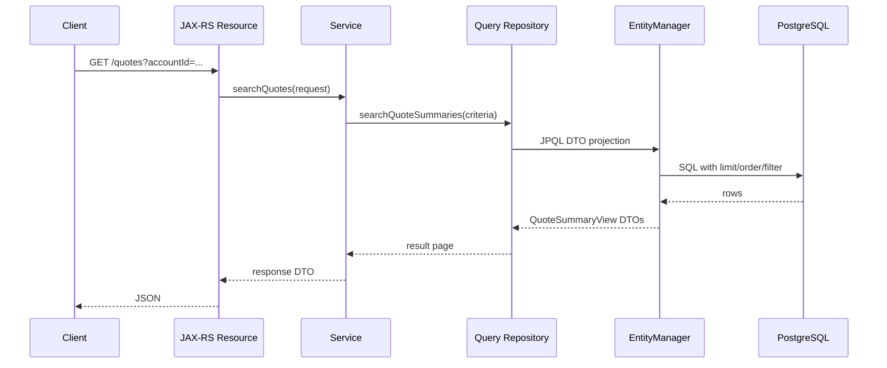
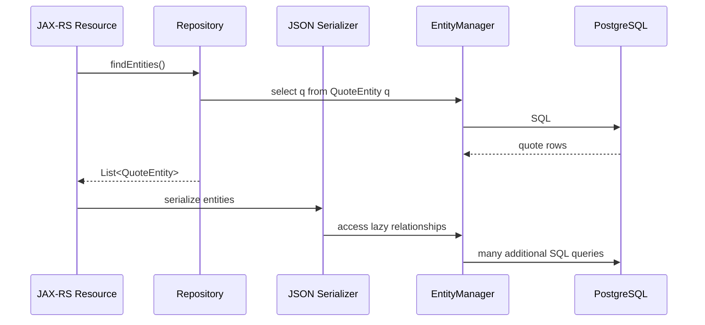

# Part 014 — JPA Querying

JPA querying adalah area tempat banyak engineer mulai menyadari bahwa JPA bukan sekadar `save()` dan `findById()`.

Dalam sistem enterprise Java/JAX-RS, query JPA harus dipikirkan sebagai kontrak antara:

- use case application service,
- entity lifecycle,
- persistence context,
- transaction boundary,
- PostgreSQL query planner,
- response DTO shape,
- performance budget,
- observability dan debugging.

JPQL, Criteria API, native query, entity graph, fetch join, projection, pagination, lock mode, dan bulk operation masing-masing memiliki trade-off.

Tujuan part ini adalah membangun kemampuan memilih query mechanism yang tepat, bukan menghafal syntax.

---

## 1. Mental Model: JPA Query Is Not Just SQL With Different Syntax

JPQL terlihat mirip SQL, tetapi ia bekerja di atas entity model, bukan table model.

SQL:

```sql
select q.id, q.status
from quote q
where q.account_id = ?
```

JPQL:

```java
select q
from QuoteEntity q
where q.accountId = :accountId
```

Perbedaannya:

| Aspect | SQL | JPQL |
| --- | --- | --- |
| Target | Table/column | Entity/property |
| Result | Row/projection | Entity/object/projection |
| Relationship | Explicit join condition | Entity association path |
| Runtime | Database directly | Hibernate translates to SQL |
| Cache interaction | Database result | Persistence context aware |
| Flush interaction | None by itself | May trigger flush before query |
| Debugging | SQL visible | Need generated SQL visibility |

JPQL query bisa memicu flush sebelum SELECT jika flush mode mengharuskan Hibernate menyinkronkan pending changes.

Jadi query JPA bukan hanya read operation. Query bisa dipengaruhi oleh entity state yang sedang managed dalam transaction.

---

## 2. Query Types in JPA/Hibernate

Common query mechanisms:

1. `EntityManager.find`
2. JPQL
3. Criteria API
4. Named query
5. TypedQuery
6. Native SQL query
7. DTO projection
8. Entity graph
9. Fetch join
10. Stored procedure query
11. Bulk update/delete

Pilihan query harus berdasarkan:

- apakah result perlu managed entity atau DTO,
- apakah relationship perlu diload,
- apakah SQL harus PostgreSQL-specific,
- apakah dynamic filtering kompleks,
- apakah query perlu lock,
- apakah query akan dipakai di high-traffic endpoint,
- apakah result besar,
- apakah query harus mudah di-debug.

---

## 3. EntityManager.find

`find` cocok untuk lookup by primary key.

```java
QuoteEntity quote = entityManager.find(QuoteEntity.class, quoteId);
```

Kelebihan:

- sederhana,
- persistence context aware,
- bisa return entity dari first-level cache,
- cocok untuk command path yang akan memodifikasi aggregate.

Risiko:

- hanya by primary key,
- relationship tidak otomatis sesuai use case,
- lazy field dapat memicu query tambahan,
- entity menjadi managed dan dirty-checked,
- jika hanya butuh read DTO, ini bisa terlalu berat.

Use when:

- command use case perlu load aggregate by ID,
- entity lifecycle perlu dikelola,
- update akan dilakukan dalam transaction yang sama.

Avoid when:

- endpoint hanya butuh list/projection,
- table besar dan response shape tidak sama dengan entity,
- query butuh join/filter kompleks,
- data harus read-only DTO.

---

## 4. JPQL

JPQL adalah query language berbasis entity.

Contoh:

```java
TypedQuery<QuoteEntity> query = entityManager.createQuery(
    """
    select q
    from QuoteEntity q
    where q.accountId = :accountId
      and q.status = :status
    order by q.createdAt desc
    """,
    QuoteEntity.class
);

query.setParameter("accountId", accountId);
query.setParameter("status", QuoteStatus.ACTIVE);

List<QuoteEntity> quotes = query.getResultList();
```

JPQL cocok untuk:

- query entity berbasis domain property,
- filter sederhana sampai menengah,
- query yang portable antar database,
- relationship query yang tidak terlalu PostgreSQL-specific.

JPQL kurang cocok untuk:

- JSONB operator,
- CTE kompleks,
- window function intensif,
- query reporting besar,
- PostgreSQL-specific locking pattern,
- highly optimized SQL yang perlu dikontrol penuh.

### JPQL path navigation risk

```java
select q
from QuoteEntity q
where q.account.name = :accountName
```

Path navigation dapat menghasilkan join implicit. Untuk readability, join eksplisit lebih baik:

```java
select q
from QuoteEntity q
join q.account a
where a.name = :accountName
```

---

## 5. TypedQuery

Gunakan `TypedQuery<T>` daripada raw `Query` jika memungkinkan.

```java
TypedQuery<QuoteEntity> query = entityManager.createQuery(jpql, QuoteEntity.class);
```

Keuntungan:

- result type lebih eksplisit,
- mengurangi casting error,
- lebih mudah direview,
- repository contract lebih jelas.

Raw `Query` biasanya hanya dibutuhkan untuk native query atau dynamic result yang sangat spesifik.

---

## 6. Named Query

Named query mendeklarasikan query dekat dengan entity atau metadata.

```java
@NamedQuery(
    name = "Quote.findActiveByAccount",
    query = """
        select q
        from QuoteEntity q
        where q.accountId = :accountId
          and q.status = 'ACTIVE'
    """
)
@Entity
public class QuoteEntity {
    // ...
}
```

Named query bisa membantu standardisasi query yang sering dipakai, tetapi ada trade-off:

Kelebihan:

- query reusable,
- bisa divalidasi lebih awal tergantung provider,
- nama query eksplisit.

Kekurangan:

- entity bisa penuh query unrelated,
- sulit melihat use case owner,
- kurang fleksibel untuk dynamic query,
- query dekat entity bukan selalu dekat repository/use case.

Dalam enterprise codebase, lebih sering query diletakkan di repository agar ownership use case lebih jelas.

---

## 7. Criteria API

Criteria API membangun query secara programmatic dan type-oriented.

Contoh sederhana:

```java
CriteriaBuilder cb = entityManager.getCriteriaBuilder();
CriteriaQuery<QuoteEntity> cq = cb.createQuery(QuoteEntity.class);
Root<QuoteEntity> quote = cq.from(QuoteEntity.class);

List<Predicate> predicates = new ArrayList<>();

if (accountId != null) {
    predicates.add(cb.equal(quote.get("accountId"), accountId));
}

if (status != null) {
    predicates.add(cb.equal(quote.get("status"), status));
}

cq.select(quote)
  .where(predicates.toArray(Predicate[]::new))
  .orderBy(cb.desc(quote.get("createdAt")));

List<QuoteEntity> results = entityManager.createQuery(cq).getResultList();
```

Criteria API cocok untuk:

- dynamic filtering,
- query builder internal,
- reusable predicate composition,
- cases where string JPQL becomes too conditional.

Kekurangannya:

- verbose,
- sulit dibaca,
- generated SQL tetap harus dicek,
- string property path masih raw jika tidak memakai metamodel,
- complex query bisa lebih sulit daripada SQL/MyBatis.

Senior heuristic:

> Criteria API membantu dynamic query sedang. Untuk query kompleks yang harus dikontrol penuh, MyBatis/native SQL sering lebih readable dan debuggable.

---

## 8. Native Query

Native query memakai SQL database langsung.

```java
List<Object[]> rows = entityManager.createNativeQuery(
    """
    select q.id, q.status, q.created_at
    from quote q
    where q.account_id = :accountId
    order by q.created_at desc
    limit :limit
    """
)
.setParameter("accountId", accountId)
.setParameter("limit", limit)
.getResultList();
```

Native query cocok untuk:

- PostgreSQL-specific SQL,
- JSONB operators,
- CTE,
- window functions,
- optimized reporting query,
- complex join/projection,
- query yang lebih jelas ditulis sebagai SQL.

Risiko:

- result mapping manual/raw,
- portability rendah,
- entity state/caching semantics bisa membingungkan,
- schema rename tidak terdeteksi compile-time,
- query string bisa tersebar,
- native update dapat membuat persistence context stale.

Jika native query menjadi dominan dan SQL-first control penting, pertimbangkan apakah MyBatis lebih cocok untuk area tersebut.

---

## 9. Entity Result vs DTO Projection

Salah satu keputusan terpenting dalam JPA querying:

> Apakah query harus mengembalikan managed entity atau read-only DTO/projection?

### Entity result

```java
select q from QuoteEntity q where q.status = :status
```

Gunakan entity result jika:

- entity akan dimodifikasi,
- lifecycle/dirty checking dibutuhkan,
- aggregate akan divalidasi dan disimpan,
- relationship lifecycle penting.

Risiko:

- persistence context membesar,
- dirty checking cost,
- lazy loading risk,
- accidental update jika entity dimutasi,
- response mapping bisa memicu traversal.

### DTO projection

```java
select new com.example.quote.QuoteSummaryView(
    q.id,
    q.quoteNumber,
    q.status,
    q.createdAt
)
from QuoteEntity q
where q.accountId = :accountId
```

Gunakan DTO projection jika:

- endpoint read-only,
- hanya butuh sebagian kolom,
- response shape berbeda dari entity,
- ingin menghindari persistence context overhead,
- ingin query shape eksplisit.

Projection adalah default yang sering lebih aman untuk list/search endpoint.

---

## 10. Constructor Projection

JPQL mendukung constructor projection:

```java
public record QuoteSummaryView(
    UUID id,
    String quoteNumber,
    QuoteStatus status,
    Instant createdAt
) {}
```

```java
TypedQuery<QuoteSummaryView> query = entityManager.createQuery(
    """
    select new com.example.quote.QuoteSummaryView(
        q.id,
        q.quoteNumber,
        q.status,
        q.createdAt
    )
    from QuoteEntity q
    where q.accountId = :accountId
    order by q.createdAt desc
    """,
    QuoteSummaryView.class
);
```

Kelebihan:

- result type jelas,
- tidak managed,
- mengurangi lazy loading risk,
- cocok untuk API response/query model.

Kekurangan:

- fully qualified class name verbose,
- constructor signature harus sinkron,
- complex nested projection bisa sulit,
- PostgreSQL-specific projection kadang lebih nyaman di native SQL/MyBatis.

---

## 11. Pagination and Sorting

JPA pagination:

```java
TypedQuery<QuoteSummaryView> query = entityManager.createQuery(jpql, QuoteSummaryView.class)
    .setParameter("accountId", accountId)
    .setFirstResult(page * size)
    .setMaxResults(size);
```

Offset pagination cocok untuk dataset kecil/menengah dan UI sederhana.

Risiko offset besar:

- database tetap harus melewati banyak row,
- result bisa tidak stabil jika ordering tidak deterministic,
- concurrent insert/delete dapat menyebabkan duplicate/missing item antar halaman.

Selalu gunakan stable ordering:

```sql
order by q.created_at desc, q.id desc
```

Jangan hanya:

```sql
order by q.created_at desc
```

Jika timestamp sama, order tidak stabil.

### Dynamic sorting

Jangan bind column name sebagai parameter value. Ini tidak bekerja seperti value binding dan bisa membuka injection jika string digabung sembarangan.

Buruk:

```java
String jpql = "select q from QuoteEntity q order by q." + sortField;
```

Lebih aman: whitelist.

```java
Map<String, String> sortWhitelist = Map.of(
    "createdAt", "q.createdAt",
    "quoteNumber", "q.quoteNumber",
    "status", "q.status"
);

String sortExpression = sortWhitelist.get(request.sortBy());
if (sortExpression == null) {
    throw new BadRequestException("Unsupported sort field");
}
```

---

## 12. Count Query

Pagination sering butuh total count:

```java
select count(q)
from QuoteEntity q
where q.accountId = :accountId
```

Count query bisa mahal jika:

- filter kompleks,
- join banyak,
- table besar,
- condition tidak memakai index,
- tenant/effective-date/soft-delete filter berat.

Review question:

> Apakah UI benar-benar butuh exact total count?

Alternatif:

- return `hasNext`,
- use limit + 1,
- approximate count untuk reporting tertentu,
- async count,
- cached aggregate count jika acceptable.

---

## 13. Fetch Join

Fetch join dipakai untuk mengambil relationship bersama parent dalam satu query.

```java
select q
from QuoteEntity q
join fetch q.items
where q.id = :quoteId
```

Kelebihan:

- menghindari N+1,
- query shape eksplisit,
- cocok untuk aggregate detail view.

Risiko:

- result row menjadi duplikat secara SQL,
- pagination dengan collection fetch join berbahaya,
- multiple collection fetch join bisa meledakkan cartesian product,
- entity graph terlalu besar,
- memory pressure.

Gunakan `distinct` untuk entity result jika perlu:

```java
select distinct q
from QuoteEntity q
join fetch q.items
where q.id = :quoteId
```

Tetapi pahami bahwa SQL-level distinct dan Hibernate entity de-duplication memiliki implikasi berbeda tergantung query.

### Avoid collection fetch join with pagination

Buruk:

```java
select q
from QuoteEntity q
join fetch q.items
order by q.createdAt desc
```

Dengan `setFirstResult`/`setMaxResults`, pagination bisa terjadi pada row hasil join, bukan parent entity seperti yang dibayangkan, atau Hibernate dapat melakukan fallback yang mahal.

Safer alternatives:

1. Page parent IDs first, then fetch details by IDs.
2. Use DTO projection with aggregation if suitable.
3. Use batch fetching.
4. Use separate query for children.

---

## 14. Entity Graph

Entity graph menentukan relationship yang perlu diload untuk use case tertentu.

```java
EntityGraph<QuoteEntity> graph = entityManager.createEntityGraph(QuoteEntity.class);
graph.addAttributeNodes("items");

QuoteEntity quote = entityManager.find(
    QuoteEntity.class,
    quoteId,
    Map.of("jakarta.persistence.fetchgraph", graph)
);
```

Entity graph cocok untuk:

- use case-specific fetch plan,
- menghindari hardcoded fetch join di banyak query,
- controlled aggregate detail loading,
- mengurangi eager mapping global.

Risiko:

- graph bisa tumbuh terlalu besar,
- generated SQL tetap harus diverifikasi,
- multiple collections tetap berisiko,
- tidak menggantikan DTO projection untuk read-heavy list.

Named entity graph:

```java
@NamedEntityGraph(
    name = "Quote.withItems",
    attributeNodes = @NamedAttributeNode("items")
)
@Entity
public class QuoteEntity {
    // ...
}
```

Use case owner harus jelas. Jangan membuat entity graph global yang dipakai semua endpoint tanpa review query shape.

---

## 15. Query Hints

Query hints memberi instruksi tambahan ke provider/database.

Contoh timeout:

```java
query.setHint("jakarta.persistence.query.timeout", 5000);
```

Hibernate-specific hints bisa mencakup read-only, fetch size, cache behavior, comment, dan lainnya.

Read-only query dapat membantu mengurangi overhead dirty checking untuk entity result tertentu:

```java
query.setHint("org.hibernate.readOnly", true);
```

Namun jangan gunakan hints sebagai magic performance fix. Hints harus disertai:

- alasan jelas,
- SQL/generated behavior yang diverifikasi,
- test atau benchmark jika critical,
- review compatibility provider.

---

## 16. Lock Mode in Queries

JPA query dapat memakai lock mode.

Optimistic:

```java
entityManager.find(
    QuoteEntity.class,
    quoteId,
    LockModeType.OPTIMISTIC
);
```

Pessimistic:

```java
TypedQuery<QuoteEntity> query = entityManager.createQuery(
    "select q from QuoteEntity q where q.id = :id",
    QuoteEntity.class
);
query.setParameter("id", quoteId);
query.setLockMode(LockModeType.PESSIMISTIC_WRITE);
```

Lock mode memengaruhi PostgreSQL locking SQL yang dihasilkan. Verifikasi generated SQL.

Review concerns:

- berapa lama transaction menahan lock,
- apakah ada timeout,
- apakah lock order konsisten,
- apakah deadlock mungkin,
- apakah retry policy ada,
- apakah lock benar-benar melindungi invariant.

Jangan pakai pessimistic lock untuk menutupi model concurrency yang tidak jelas.

---

## 17. Bulk Update and Bulk Delete

JPQL bulk operation langsung memodifikasi database dan bypass entity lifecycle per row.

```java
int updated = entityManager.createQuery(
    """
    update QuoteEntity q
    set q.status = :expiredStatus
    where q.validUntil < :now
      and q.status = :activeStatus
    """
)
.setParameter("expiredStatus", QuoteStatus.EXPIRED)
.setParameter("activeStatus", QuoteStatus.ACTIVE)
.setParameter("now", now)
.executeUpdate();
```

Critical behavior:

- bulk update/delete tidak memanggil entity lifecycle callback per entity,
- tidak melakukan dirty checking per entity,
- persistence context bisa menjadi stale,
- optimistic version mungkin tidak otomatis dinaikkan kecuali dilakukan eksplisit,
- audit fields bisa terlewat,
- cache bisa stale.

Setelah bulk operation, pertimbangkan:

```java
entityManager.clear();
```

Atau pastikan tidak ada managed entity terkait dalam persistence context.

### Bulk operation checklist

- Apakah audit/version perlu diupdate?
- Apakah entity listener diharapkan berjalan? Jika iya, bulk JPQL tidak cocok.
- Apakah persistence context harus clear?
- Apakah second-level cache perlu invalidation?
- Apakah query memakai index?
- Apakah operation perlu chunking?
- Apakah transaction timeout cukup?

---

## 18. Flush Before Query

Hibernate dapat flush pending changes sebelum menjalankan query agar query melihat state terbaru sesuai flush mode.

Contoh:

```java
quote.setStatus(QuoteStatus.APPROVED);

List<OrderEntity> orders = entityManager.createQuery(
    "select o from OrderEntity o where o.quoteId = :quoteId",
    OrderEntity.class
).setParameter("quoteId", quote.getId())
 .getResultList();
```

Query `select` dapat memicu flush update quote sebelum SELECT.

Failure mode:

- constraint violation muncul di line query, bukan line update,
- SQL write terjadi lebih awal dari yang dibayangkan,
- MyBatis query setelah JPA mutation bisa melihat atau tidak melihat state tergantung flush,
- debugging stack trace membingungkan.

Senior habit:

> Saat ada exception dari SELECT JPA, cek apakah Hibernate melakukan flush sebelum SELECT.

---

## 19. Querying and Persistence Context Size

Entity result masuk ke persistence context.

Jika query mengambil 50.000 entity:

```java
List<QuoteEntity> quotes = entityManager.createQuery(
    "select q from QuoteEntity q",
    QuoteEntity.class
).getResultList();
```

Maka persistence context dapat berisi puluhan ribu managed entity. Dampaknya:

- memory naik,
- dirty checking mahal,
- flush lambat,
- GC pressure,
- transaction panjang,
- connection ditahan lama.

Untuk large read:

- gunakan DTO projection,
- gunakan streaming dengan hati-hati,
- gunakan pagination/chunking,
- mark read-only jika provider mendukung,
- clear persistence context per chunk jika processing entity diperlukan.

---

## 20. Native Query vs MyBatis Decision

Jika Anda sering menulis native query dalam JPA repository, tanya:

> Apakah use case ini sebenarnya SQL-first dan lebih cocok di MyBatis?

Native query di JPA valid jika:

- hanya beberapa query PostgreSQL-specific,
- result mapping sederhana,
- masih berada dekat aggregate JPA,
- transaction/persistence context interaction dipahami.

MyBatis lebih cocok jika:

- SQL kompleks dan dominan,
- query reporting/projection banyak,
- dynamic SQL butuh readability,
- PostgreSQL-specific features banyak,
- result mapping butuh kontrol eksplisit,
- tidak perlu managed entity lifecycle.

Jangan menjadikan native query JPA sebagai MyBatis versi tersembunyi tanpa mapper discipline.

---

## 21. Querying in JAX-RS Request Lifecycle

Typical safe read endpoint:



Unsafe pattern:



Rule:

> JAX-RS resource should receive response-ready DTOs or application models, not persistence entities with unresolved query shape.

---

## 22. Querying and PostgreSQL Performance

Even when using JPQL, PostgreSQL executes SQL.

Always verify:

- generated SQL,
- bind parameters,
- execution plan,
- index usage,
- join order,
- row estimates,
- sort/hash aggregate cost,
- limit/offset behavior,
- lock behavior if query locks rows.

For critical query, capture generated SQL and run:

```sql
explain analyze
select ...;
```

For production-safe diagnosis, use proper tooling/logging and avoid running heavy `explain analyze` directly on production without DBA/SRE-approved procedure.

### PostgreSQL-specific features not naturally expressed in JPQL

- JSONB operators,
- full-text search,
- recursive CTE,
- window functions,
- `ON CONFLICT`,
- `SKIP LOCKED`,
- advisory locks,
- lateral joins,
- custom function calls.

When these are core to the use case, SQL-first approach may be better.

---

## 23. Querying and Multi-Tenancy / Soft Delete / Effective Dating

Every query must respect data visibility rules.

Common filters:

- tenant ID,
- soft delete flag,
- effective date window,
- catalog version,
- status,
- security scope,
- ownership/account boundary.

Example:

```java
select q
from QuoteEntity q
where q.tenantId = :tenantId
  and q.deleted = false
  and q.accountId = :accountId
```

Review question:

> Is this query allowed to see all rows matching the technical condition, or only rows visible under tenant/security/temporal rules?

Hidden bugs often come from missing filters, not syntax errors.

If JPA filters are used, verify:

- where they are enabled,
- whether they apply to native query,
- whether MyBatis queries implement equivalent conditions,
- whether tests catch missing tenant/soft-delete conditions.

---

## 24. Querying and Security

Parameter binding is mandatory.

Good:

```java
query.setParameter("accountId", accountId);
```

Bad:

```java
String jpql = "select q from QuoteEntity q where q.accountId = '" + accountId + "'";
```

Dynamic query risk areas:

- ORDER BY,
- field names,
- direction `asc/desc`,
- filter operator,
- search expression,
- native SQL fragments.

Use whitelist for identifiers and bind values for data.

Also review:

- PII in SQL logs,
- parameter logging redaction,
- exception message exposure,
- least privilege DB user,
- tenant condition,
- row-level security if used.

---

## 25. Observability for JPA Queries

For production-grade persistence, you need visibility into:

- generated SQL,
- query duration,
- query count per request,
- slow query logs,
- transaction duration,
- lock wait,
- timeout rate,
- connection pool wait,
- Hibernate statistics,
- endpoint-to-query correlation.

Useful lower-environment practices:

- log SQL with bind parameter redaction,
- capture query count in integration tests,
- assert no N+1 for known endpoints,
- include repository/query name in trace spans,
- use query comments if allowed and safe.

Do not enable verbose SQL parameter logging in production if it leaks sensitive data.

---

## 26. Common Anti-Patterns

### Anti-pattern 1: Query returns entity for read-only list endpoint

If endpoint only needs summary fields, use DTO projection.

### Anti-pattern 2: Pagination with collection fetch join

This can produce incorrect or inefficient result shape.

### Anti-pattern 3: Native query everywhere inside JPA repository

This may indicate MyBatis would be clearer.

### Anti-pattern 4: Criteria API for extremely complex reporting query

Verbose object query builder can become less maintainable than explicit SQL.

### Anti-pattern 5: Missing stable order in pagination

Pagination without deterministic ordering causes duplicate/missing rows.

### Anti-pattern 6: Bulk update without clearing persistence context

Managed entities can become stale.

### Anti-pattern 7: Query depends on lazy loading after repository returns

Repository must define query shape.

### Anti-pattern 8: Missing tenant/soft-delete/effective-date condition

Correct syntax, wrong data visibility.

### Anti-pattern 9: Hidden flush surprise

SELECT query throws write-related exception because flush happened before query.

### Anti-pattern 10: No generated SQL review for critical JPQL

JPQL readability does not guarantee good SQL plan.

---

## 27. Debugging JPA Query Problems

### Symptom: slow endpoint

Check:

- generated SQL,
- number of queries,
- query plan,
- missing index,
- N+1,
- eager relationship,
- DTO vs entity result,
- persistence context size,
- count query cost.

### Symptom: unexpected write before query

Check:

- flush mode,
- managed entity mutations,
- dirty checking,
- flush before query,
- transaction boundary.

### Symptom: stale data after bulk update

Check:

- managed entities in persistence context,
- missing `clear()`/`refresh()`,
- second-level cache,
- MyBatis/JPA mixed access.

### Symptom: wrong rows visible

Check:

- tenant filter,
- soft delete filter,
- effective-date filter,
- security scope,
- native query bypassing JPA filters.

### Symptom: memory pressure

Check:

- entity result size,
- persistence context size,
- streaming/chunking strategy,
- DTO projection option,
- transaction duration.

---

## 28. Query Review Checklist

### Intent and result shape

- Is this command query or read query?
- Does it need managed entity or DTO projection?
- Is response shape explicit?
- Is entity escaping to JAX-RS resource/serializer?

### SQL visibility

- Has generated SQL been inspected?
- Is query count known?
- Is EXPLAIN needed for critical path?
- Are bind parameters used?
- Are logs safe from PII leakage?

### Performance

- Is pagination stable?
- Is count query necessary and affordable?
- Could this cause N+1?
- Are fetch joins/entity graphs used deliberately?
- Is collection fetch join combined with pagination?
- Are indexes aligned with filters/order?

### Correctness

- Are tenant/soft-delete/effective-date/security filters present?
- Does query run inside correct transaction boundary?
- Could flush happen before this query?
- Could bulk update make persistence context stale?
- Is lock mode needed or harmful?

### Framework choice

- Is JPQL the right tool?
- Would Criteria API be clearer for dynamic filtering?
- Would native SQL/MyBatis be clearer for PostgreSQL-specific logic?
- Is this query duplicating existing MyBatis mapper?
- Is table ownership clear if MyBatis and JPA coexist?

### Production readiness

- Is timeout configured?
- Is failure mapped to domain/HTTP error correctly?
- Is query observable in metrics/traces/logs?
- Is there integration test with real PostgreSQL?
- Is there regression coverage for query shape?

---

## 29. Internal Verification Checklist

Use this checklist inside the actual CSG/team codebase. Do not assume these details; verify them.

### Query locations

- Where are JPQL queries defined?
- Are queries in repository classes, named queries, or framework-derived methods?
- Are native queries used? Where?
- Are Criteria API builders used?
- Are query utilities shared across modules?

### Query behavior

- Is generated SQL visible in local/test environment?
- Is query count measured in tests or dashboards?
- Are slow queries tied back to repository methods?
- Are JPQL/native queries covered by integration tests?
- Are PostgreSQL-specific queries verified against real PostgreSQL?

### Read model and DTO

- Do list/search endpoints return DTO projections or entities?
- Are API DTOs separated from JPA entities?
- Are projection classes stable and owned by query repositories?
- Are response mappings inside transaction boundary if entity is used?

### Pagination/filtering

- Is pagination offset/keyset/cursor?
- Are sort fields whitelisted?
- Is ordering stable?
- Is count query required?
- Are dynamic filters tested in combinations?

### Relationship loading

- Are fetch joins used?
- Are entity graphs used?
- Are there N+1 regression tests?
- Are collection fetch joins paginated?
- Are eager mappings creating hidden joins?

### Multi-tenancy/security/privacy

- Are tenant filters applied consistently?
- Are soft delete/effective date filters applied?
- Do native queries bypass filters?
- Is SQL logging redacted?
- Are query errors sanitized before HTTP response?

### Bulk and locking

- Are bulk updates/deletes used?
- Is persistence context cleared after bulk operations?
- Is version/audit handling correct?
- Are lock modes used?
- Are lock timeout/retry policies documented?

### MyBatis coexistence

- Do JPA queries overlap with MyBatis mappers for same tables?
- Are native JPA queries duplicating MyBatis SQL?
- Is query ownership documented?
- Are stale persistence context risks tested?
- Is second-level cache safe for mixed access?

---

## 30. Senior Engineer Heuristics

Use these heuristics when reviewing or designing JPA queries.

1. For command/update use cases, entity query can be appropriate.
2. For read/list/search endpoints, prefer DTO projection unless entity lifecycle is needed.
3. For complex SQL/reporting, consider MyBatis or native SQL rather than forcing JPQL.
4. For dynamic filtering, Criteria API is acceptable only if readable and tested.
5. For relationship detail view, fetch join/entity graph can be appropriate.
6. For pagination, avoid collection fetch join.
7. For bulk update/delete, assume persistence context becomes stale unless proven otherwise.
8. For high-traffic queries, inspect generated SQL and query plan.
9. For security-sensitive data, verify tenant/security/soft-delete filters explicitly.
10. For MyBatis+JPA systems, keep query ownership visible and avoid duplicated write paths.

---

## 31. Practical Decision Table

| Use case | Preferred approach | Reason |
| --- | --- | --- |
| Load aggregate for command update | `find`/JPQL entity query | Needs managed lifecycle and dirty checking |
| Search/list endpoint | DTO projection | Avoids over-fetching and lazy loading |
| Detail endpoint with bounded children | Fetch join or entity graph | Controlled relationship loading |
| Complex dynamic filter | Criteria API or query builder | Composable predicates |
| PostgreSQL JSONB-heavy query | Native SQL or MyBatis | SQL-first control |
| Reporting query | MyBatis/native SQL | Explicit optimized SQL |
| Bulk status update | JPQL bulk or SQL | Avoid row-by-row entity loading |
| Massive export | Projection + streaming/chunking | Avoid persistence context memory blowup |
| Concurrent update | Entity query with lock/version | Protects invariants |
| Read model query in mixed system | MyBatis projection | Avoids JPA entity state overhead |

---

## 32. Closing Mental Model

JPA querying sits between object model and SQL execution.

A query is not good because it is valid JPQL.

A query is good when:

- it returns the right shape,
- it loads only what the use case needs,
- it respects tenant/security/temporal rules,
- it has predictable transaction and flush behavior,
- it produces understandable SQL,
- PostgreSQL can execute it efficiently,
- it is observable and testable,
- it does not accidentally couple API response to entity graph,
- it does not conflict with MyBatis or native SQL ownership.

The senior-level question is:

> What query shape does this use case need, and which persistence mechanism gives the most explicit, correct, observable, and maintainable implementation?

That question prevents JPA querying from becoming either underused CRUD magic or overused abstraction over SQL that nobody can debug.
