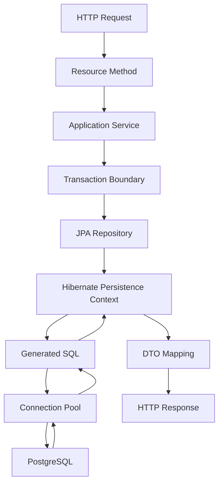

# Part 015 — JPA/Hibernate Performance

JPA/Hibernate performance bukan hanya soal "query lambat".

Masalah performance Hibernate sering berasal dari kombinasi:

- terlalu banyak query kecil,
- query yang tidak terlihat karena generated SQL,
- relationship loading yang salah,
- persistence context terlalu besar,
- dirty checking mahal,
- flush terlalu sering,
- batching tidak aktif,
- entity graph tidak sesuai response shape,
- PostgreSQL query plan buruk,
- connection terlalu lama ditahan oleh transaction,
- cache yang terlihat membantu tetapi menghasilkan stale data atau invalidation problem.

Dalam sistem enterprise Java/JAX-RS, performance JPA harus dilihat sebagai interaksi antara endpoint, transaction boundary, entity lifecycle, generated SQL, PostgreSQL planner, connection pool, observability, dan deployment topology.

Tujuan part ini adalah membangun cara berpikir performance-oriented saat memakai JPA/Hibernate, bukan sekadar menghafal annotation tuning.

---

## 1. Mental Model: Hibernate Performance Is Runtime Shape Management

Hibernate mengubah operasi object menjadi SQL.

Masalahnya: bentuk object graph tidak selalu sama dengan bentuk query yang optimal.

Contoh endpoint:

```http
GET /accounts/{accountId}/quotes
```

Response mungkin hanya butuh:

```json
[
  {
    "quoteId": "Q-1001",
    "status": "DRAFT",
    "customerName": "Acme",
    "totalAmount": 1200000
  }
]
```

Tetapi implementation JPA yang buruk bisa melakukan:

1. Load `AccountEntity`.
2. Lazy load `quotes`.
3. Untuk setiap quote, lazy load `customer`.
4. Untuk setiap quote, lazy load `lineItems`.
5. Untuk setiap line item, lazy load `product`.

Secara domain object terlihat natural. Secara database, ini bisa menjadi puluhan/ratusan query.

Performance JPA adalah tentang mengontrol runtime shape:

- entity shape,
- query shape,
- result shape,
- transaction shape,
- flush shape,
- memory shape,
- SQL shape.

---

## 2. Common Hibernate Performance Failure Modes

| Failure mode | Symptom | Root cause | Typical fix |
| --- | --- | --- | --- |
| N+1 query | Endpoint lambat, query count tinggi | Lazy association diakses dalam loop | Fetch join, entity graph, DTO projection, batch fetching |
| Cartesian explosion | Result row sangat besar | Terlalu banyak fetch join collection | Split query, DTO projection, batch fetching |
| Large persistence context | Memory naik, dirty checking lambat | Terlalu banyak managed entity | Pagination, clear, read-only query, DTO projection |
| Frequent flush | Query SELECT lambat karena flush dulu | Pending changes dalam transaction | Perbaiki transaction boundary, flush mode, split command/read |
| No JDBC batching | Banyak insert/update round trip | Batch config off atau ID strategy tidak cocok | Enable batching, sequence allocation, chunking |
| Hidden generated SQL | Sulit debug query lambat | SQL logging/observability kurang | Enable safe SQL logging dan query metrics |
| Bad PostgreSQL plan | Query lambat walau query count rendah | Missing/stale index/statistics | EXPLAIN ANALYZE, index tuning, rewrite query |
| Eager loading abuse | Query besar untuk data yang tidak dipakai | Relationship default eager | Ubah loading strategy, projection |
| L2 cache stale | Data tidak konsisten | Cache invalidation buruk | Hindari cache atau batasi cache untuk reference data |

---

## 3. Performance Starts at Use Case Shape

Sebelum memilih fetch join atau entity graph, jawab dulu:

- Apakah use case command atau query?
- Apakah result perlu managed entity?
- Apakah response hanya projection?
- Apakah data akan dimodifikasi dalam transaction yang sama?
- Apakah query ada di hot path?
- Apakah endpoint list, detail, export, atau background job?
- Apakah consistency perlu read-your-write?
- Apakah relationship perlu dimuat lengkap atau hanya agregat/count?

### Command path

Command path biasanya butuh entity lifecycle.

Contoh:

```java
QuoteEntity quote = entityManager.find(QuoteEntity.class, quoteId);
quote.submit(requestedBy);
```

Di sini JPA cocok karena:

- aggregate lifecycle penting,
- dirty checking bisa membantu,
- optimistic lock bisa dipakai,
- transaction boundary jelas.

Tetapi command path tetap harus menghindari load graph berlebihan.

### Query/read path

Read path sering lebih cocok dengan DTO projection.

```java
select new com.example.quote.QuoteSummaryDto(
    q.id,
    q.status,
    c.name,
    q.totalAmount
)
from QuoteEntity q
join q.customer c
where q.accountId = :accountId
```

Keuntungan:

- tidak semua entity menjadi managed,
- response shape eksplisit,
- query lebih mudah dikontrol,
- dirty checking cost lebih rendah,
- memory lebih ringan.

---

## 4. N+1 Problem

N+1 terjadi ketika satu query utama diikuti satu query tambahan untuk setiap row/entity.

Contoh sederhana:

```java
List<QuoteEntity> quotes = entityManager.createQuery(
    "select q from QuoteEntity q where q.accountId = :accountId",
    QuoteEntity.class
).setParameter("accountId", accountId)
 .getResultList();

for (QuoteEntity quote : quotes) {
    // Lazy load customer per quote
    String customerName = quote.getCustomer().getName();
}
```

Query pattern:

```sql
select * from quote where account_id = ?;
select * from customer where id = ?;
select * from customer where id = ?;
select * from customer where id = ?;
-- repeated N times
```

N+1 tidak selalu terlihat saat data kecil. Ia biasanya muncul ketika:

- endpoint pindah ke account besar,
- pagination size dinaikkan,
- dashboard/reporting memuat banyak row,
- serializer mengakses lazy property,
- mapper DTO mengakses relationship dalam loop,
- logging/debug statement memanggil getter lazy association.

### N+1 detection checklist

- Hitung jumlah SQL per request.
- Lihat query pattern berulang dengan parameter berbeda.
- Cek lazy getter di loop.
- Cek JSON serialization entity langsung.
- Cek MapStruct/manual mapper yang menyentuh relationship.
- Cek integration test dengan data lebih dari 1 row.
- Cek query count assertion untuk endpoint penting.

---

## 5. Fixing N+1 with Fetch Join

Fetch join memuat association dalam query yang sama.

```java
select q
from QuoteEntity q
join fetch q.customer
where q.accountId = :accountId
```

Cocok untuk:

- many-to-one atau one-to-one yang memang selalu dibutuhkan,
- detail page yang butuh relationship terbatas,
- command path yang butuh child tertentu.

Risiko:

- result row membesar,
- duplicate parent row,
- pagination dengan collection fetch join berbahaya,
- terlalu banyak fetch join bisa menghasilkan cartesian explosion,
- query menjadi sulit diprediksi jika graph terlalu dalam.

### Fetch join review rule

Fetch join harus menjawab pertanyaan:

> Relationship ini benar-benar dibutuhkan untuk use case ini, atau hanya dipakai karena entity graph terasa nyaman?

Jika hanya butuh beberapa kolom, DTO projection sering lebih baik.

---

## 6. Entity Graph

Entity graph memungkinkan menentukan loading plan tanpa mengubah JPQL utama.

```java
EntityGraph<QuoteEntity> graph = entityManager.createEntityGraph(QuoteEntity.class);
graph.addAttributeNodes("customer");

List<QuoteEntity> quotes = entityManager.createQuery(
    "select q from QuoteEntity q where q.accountId = :accountId",
    QuoteEntity.class
)
.setParameter("accountId", accountId)
.setHint("jakarta.persistence.fetchgraph", graph)
.getResultList();
```

Entity graph berguna saat:

- query structure sama tetapi loading plan berbeda per use case,
- ingin menghindari hardcoded fetch join di semua query,
- relationship loading perlu eksplisit tetapi tetap entity-oriented.

Risiko:

- graph bisa sulit dilacak jika didefinisikan tersebar,
- terlalu banyak graph membuat behavior repository tidak obvious,
- tetap dapat menghasilkan SQL besar,
- tidak menggantikan kebutuhan melihat generated SQL.

---

## 7. Batch Fetching

Batch fetching mengurangi N+1 dengan mengambil lazy association dalam batch.

Misalnya, ketika 50 quote memiliki 50 customer berbeda, Hibernate bisa mengambil customer dengan `IN (...)`.

Konfigurasi umum:

```properties
hibernate.default_batch_fetch_size=50
```

Atau annotation Hibernate-specific:

```java
@BatchSize(size = 50)
@ManyToOne(fetch = FetchType.LAZY)
private CustomerEntity customer;
```

Batch fetching cocok untuk:

- lazy many-to-one yang sering diakses setelah parent list,
- collection yang tidak cocok difetch join,
- mengurangi query count tanpa membesarkan single query berlebihan.

Trade-off:

- query masih tambahan, bukan satu query,
- batch size terlalu besar dapat membuat query `IN` terlalu berat,
- behavior dapat berubah tergantung persistence context content,
- tetap perlu query count observability.

---

## 8. Subselect Fetching

Subselect fetching mengambil association untuk parent entities menggunakan subselect dari query parent.

Contoh konsep:

```sql
select *
from quote_line_item
where quote_id in (
  select id
  from quote
  where account_id = ?
)
```

Berguna untuk collection tertentu, tetapi harus hati-hati:

- query bisa besar,
- subselect bisa mahal,
- sulit dipahami saat debugging,
- sensitif terhadap query parent.

Gunakan jika sudah diverifikasi dengan query plan dan data volume realistis.

---

## 9. DTO Projection for Read Performance

DTO projection sering menjadi pilihan terbaik untuk read endpoint.

```java
public record QuoteSummaryView(
    UUID id,
    String status,
    String customerName,
    BigDecimal totalAmount
) {}
```

```java
select new com.example.quote.QuoteSummaryView(
    q.id,
    q.status,
    c.name,
    q.totalAmount
)
from QuoteEntity q
join q.customer c
where q.accountId = :accountId
order by q.createdAt desc
```

Keuntungan:

- tidak managed entity,
- tidak dirty-checked,
- kolom eksplisit,
- response shape jelas,
- lebih mudah menghindari lazy loading,
- memory lebih ringan.

Kekurangan:

- tidak cocok untuk command mutation,
- constructor projection bisa fragile saat refactor,
- dynamic query kompleks bisa verbose,
- untuk SQL PostgreSQL kompleks, MyBatis/native SQL mungkin lebih jelas.

### Rule of thumb

- Command path: entity boleh masuk akal.
- Query/list/report path: mulai dari projection, bukan entity graph.

---

## 10. Pagination and Fetching Risk

Pagination dengan entity + collection fetch join adalah area berbahaya.

Contoh:

```java
select q
from QuoteEntity q
join fetch q.lineItems
where q.accountId = :accountId
order by q.createdAt desc
```

Jika dipaginate, satu quote dengan banyak line item menghasilkan banyak row SQL. Database melakukan limit terhadap row hasil join, bukan selalu parent entity secara intuitif.

Risiko:

- page tidak stabil,
- parent entity hilang/duplikat,
- memory besar,
- Hibernate mungkin melakukan pagination in-memory tergantung query/provider behavior,
- endpoint terlihat benar di data kecil tetapi gagal di data besar.

Alternatif:

1. Page parent IDs dulu.
2. Fetch detail berdasarkan IDs.
3. Gunakan DTO projection.
4. Gunakan batch fetching untuk collection.
5. Pisahkan endpoint summary dan detail.

---

## 11. JDBC Batching in Hibernate

Hibernate bisa melakukan JDBC batching untuk insert/update/delete.

Konfigurasi umum:

```properties
hibernate.jdbc.batch_size=50
hibernate.order_inserts=true
hibernate.order_updates=true
hibernate.jdbc.batch_versioned_data=true
```

Batching mengurangi round trip database.

Tanpa batching:

```text
insert row 1
insert row 2
insert row 3
...
```

Dengan batching:

```text
send batch of 50 inserts
send batch of 50 inserts
...
```

### ID generation impact

Beberapa strategy ID dapat menghambat batching.

- Sequence dengan allocation size sering lebih batching-friendly.
- Identity generation bisa memaksa insert langsung untuk mendapatkan generated ID.

Untuk PostgreSQL, sequence-based ID generation sering lebih baik untuk batching dibanding identity jika batching insert adalah kebutuhan utama.

Internal detail harus diverifikasi pada codebase dan Hibernate version.

---

## 12. Insert/Update Batching Example

```java
for (int i = 0; i < commands.size(); i++) {
    entityManager.persist(toEntity(commands.get(i)));

    if (i > 0 && i % 50 == 0) {
        entityManager.flush();
        entityManager.clear();
    }
}
```

Mengapa `flush()` dan `clear()`?

- `flush()` mengirim pending SQL ke database.
- `clear()` melepas managed entities dari persistence context.
- Tanpa `clear()`, persistence context terus membesar.
- Dirty checking cost naik seiring jumlah managed entity.

Risiko:

- setelah `clear()`, entity menjadi detached,
- jangan akses lazy association setelah clear,
- error handling per chunk harus jelas,
- transaction size tetap harus dikontrol,
- idempotency penting untuk retry.

---

## 13. Dirty Checking Cost

Dirty checking adalah mekanisme Hibernate untuk mendeteksi perubahan pada managed entity.

```java
QuoteEntity quote = entityManager.find(QuoteEntity.class, quoteId);
quote.changeStatus(QuoteStatus.SUBMITTED);
// no explicit update call
```

Saat flush, Hibernate memeriksa entity managed untuk menentukan update.

Cost meningkat ketika:

- persistence context berisi banyak entity,
- entity memiliki banyak field,
- transaction terlalu panjang,
- batch processing tidak melakukan clear,
- read endpoint load entity padahal hanya butuh DTO,
- entity graph terlalu besar.

### Dirty checking performance rule

Jangan memuat banyak managed entity jika tidak perlu lifecycle management.

Untuk list/read-only endpoint, gunakan projection atau read-only hint.

---

## 14. Read-Only Query Hint

Hibernate dapat diberi hint read-only untuk mengurangi overhead.

```java
List<QuoteEntity> quotes = entityManager.createQuery(
    "select q from QuoteEntity q where q.accountId = :accountId",
    QuoteEntity.class
)
.setParameter("accountId", accountId)
.setHint("org.hibernate.readOnly", true)
.getResultList();
```

Gunakan dengan hati-hati:

- cocok untuk read-only query,
- jangan mutate entity hasil read-only query,
- tetap lebih berat daripada DTO projection jika response hanya butuh beberapa field,
- behavior detail dapat bergantung Hibernate version.

Internal verification diperlukan untuk mengetahui standard project.

---

## 15. Flush Frequency

Flush mengirim perubahan entity ke database.

Flush bisa terjadi:

- saat transaction commit,
- sebelum query tertentu,
- saat `entityManager.flush()` dipanggil manual,
- karena provider/framework behavior.

Performance issue muncul ketika:

- transaction panjang berisi banyak pending changes,
- SELECT memicu flush sebelum query,
- loop melakukan flush terlalu sering,
- flush menghasilkan banyak update karena dirty checking surprise,
- query read berada dalam transaction command yang sama.

### Review question

> Apakah SELECT ini benar-benar harus berada dalam transaction yang sama dengan pending writes?

Jika tidak, pisahkan read dan write path.

---

## 16. Persistence Context Size

Persistence context adalah first-level cache per EntityManager/session.

Ia menyimpan managed entities.

Masalah muncul ketika:

```java
List<QuoteEntity> allQuotes = query.getResultList(); // 100k rows
for (QuoteEntity quote : allQuotes) {
    process(quote);
}
```

Risiko:

- memory pressure,
- GC pressure,
- dirty checking lambat,
- connection/transaction terlalu lama,
- timeout,
- lock held too long jika ada write.

Alternatif:

- pagination/chunking,
- streaming dengan hati-hati,
- DTO projection,
- stateless processing,
- periodic flush/clear,
- MyBatis/JDBC untuk batch/reporting tertentu.

---

## 17. Second-Level Cache

Hibernate first-level cache selalu ada dalam persistence context.

Second-level cache bersifat lebih luas, biasanya per SessionFactory/application.

L2 cache bisa membantu untuk:

- reference data yang jarang berubah,
- lookup table kecil,
- configuration static,
- data dengan invalidation jelas.

L2 cache berbahaya untuk:

- data yang sering berubah,
- data yang juga ditulis MyBatis/JDBC,
- multi-tenant data tanpa key isolation jelas,
- data dengan soft delete/temporal filter kompleks,
- table yang diubah trigger/procedure/external job.

### MyBatis + JPA warning

Jika table yang sama ditulis MyBatis tetapi entity-nya dicache Hibernate L2, Hibernate bisa membaca data stale.

Dalam mixed persistence, default posture yang lebih aman:

- hindari L2 cache untuk shared mutable table,
- gunakan cache hanya untuk reference data yang ownership-nya jelas,
- dokumentasikan invalidation mechanism,
- test read-after-write behavior.

---

## 18. Query Cache

Hibernate query cache menyimpan hasil query, bukan entity state saja.

Risiko query cache biasanya lebih tinggi daripada manfaatnya di sistem enterprise mutable.

Masalah umum:

- invalidation sulit,
- query parameter combinatorial explosion,
- stale result list,
- tenant/security filter risk,
- soft delete/temporal query risk,
- sulit dijelaskan saat incident.

Gunakan hanya jika:

- data sangat stabil,
- invalidation dipahami,
- hit ratio terbukti,
- observability tersedia,
- correctness impact dapat diterima.

---

## 19. Query Plan Visibility

Hibernate performance tidak bisa dievaluasi hanya dari JPQL.

Harus melihat generated SQL.

Checklist:

- Aktifkan SQL logging di local/test.
- Log bind parameter secara aman.
- Redact PII.
- Ambil SQL final.
- Jalankan `EXPLAIN` atau `EXPLAIN ANALYZE` di PostgreSQL.
- Cek index usage.
- Cek join strategy.
- Cek row estimate vs actual row.
- Cek sort/hash memory.
- Cek sequential scan yang tidak diharapkan.

JPQL yang terlihat sederhana bisa menghasilkan SQL yang tidak efisien karena join, discriminator, filter, atau fetching plan.

---

## 20. PostgreSQL-Specific Considerations

Hibernate abstracts database access, tetapi PostgreSQL tetap menentukan runtime performance.

Hal yang harus diperhatikan:

- index sesuai filter dan ordering,
- composite index order,
- partial index untuk soft delete/tenant/status,
- statistics freshness,
- JSONB index jika native query memakai JSONB,
- lock wait,
- transaction duration,
- statement timeout,
- connection pool saturation,
- autovacuum/vacuum impact,
- query plan instability karena parameter distribution.

Jangan menyelesaikan semua masalah dengan annotation Hibernate. Kadang fix yang benar adalah index, rewrite query, atau perubahan endpoint contract.

---

## 21. Performance in Java/JAX-RS Request Lifecycle

Dalam JAX-RS service, request performance dipengaruhi oleh:



Bottleneck bisa berada di:

- resource method yang memicu lazy serialization,
- service method dengan transaction terlalu besar,
- repository query shape,
- Hibernate generated SQL,
- connection pool wait,
- PostgreSQL plan/lock,
- DTO mapping object graph,
- response serialization.

---

## 22. Open Session in View Warning

Jika framework membuka persistence context sampai view/serialization layer, lazy loading bisa terjadi saat response serialization.

Risiko:

- query muncul di luar service intention,
- N+1 saat JSON serializer menyentuh getter,
- transaction boundary kabur,
- error lazy loading muncul terlambat,
- performance sulit diprediksi.

Dalam API backend enterprise, lebih sehat:

- service layer menentukan data shape,
- repository mengembalikan entity/projection sesuai use case,
- response DTO sudah lengkap sebelum serialization,
- lazy loading tidak terjadi di serializer.

Internal verification checklist harus memastikan apakah pattern semacam Open Session in View digunakan atau tidak.

---

## 23. MyBatis vs JPA for Performance-Critical Query

JPA tidak otomatis buruk untuk performance. MyBatis tidak otomatis cepat.

Perbandingan:

| Scenario | JPA/Hibernate | MyBatis |
| --- | --- | --- |
| Aggregate command lifecycle | Strong fit | Bisa, tapi manual lifecycle |
| Simple entity lookup/update | Good fit | Good fit |
| Complex reporting SQL | Often awkward | Strong fit |
| JSONB-heavy query | Native query or MyBatis | Strong fit |
| DTO projection | Good for moderate query | Strong for SQL-heavy projection |
| Batch insert/update | Good if configured | Good with batch executor/JDBC |
| Debug generated SQL | Needs setup | SQL visible by default |
| Relationship graph | Strong but risky | Explicit but verbose |

Decision harus berdasarkan:

- visibility,
- correctness,
- query complexity,
- team expertise,
- operational diagnostics,
- schema shape,
- transaction semantics.

---

## 24. Performance Review Checklist

Gunakan checklist ini saat review PR JPA/Hibernate:

### Query shape

- Apakah query return entity atau DTO?
- Apakah result shape sesuai response/use case?
- Apakah query memuat kolom/relationship yang tidak dipakai?
- Apakah generated SQL dilampirkan untuk query penting?

### N+1 risk

- Ada lazy access dalam loop?
- Ada serializer yang menerima entity?
- Ada mapper DTO yang menyentuh relationship?
- Ada query count test?

### Fetching strategy

- Fetch join digunakan pada relationship yang tepat?
- Ada collection fetch join dengan pagination?
- Entity graph documented?
- Batch fetching size masuk akal?

### Transaction and flush

- Transaction terlalu panjang?
- SELECT bisa memicu flush pending writes?
- Ada explicit flush/clear di batch path?
- Persistence context bisa membesar?

### PostgreSQL

- Ada EXPLAIN untuk query hot path?
- Index mendukung WHERE/ORDER BY/JOIN?
- Query plan stabil untuk data besar?
- Statement timeout dipertimbangkan?

### Cache

- L2/query cache digunakan?
- Data mutable atau shared dengan MyBatis/JDBC?
- Invalidation jelas?
- Tenant/security/soft-delete safe?

---

## 25. Internal Verification Checklist

Untuk codebase internal, jangan mengasumsikan framework behavior. Verifikasi:

- Hibernate version dan JPA/Jakarta Persistence version.
- SQL logging configuration di local/test/staging.
- Hibernate statistics availability.
- Default fetch strategy convention.
- `hibernate.default_batch_fetch_size`.
- `hibernate.jdbc.batch_size`.
- ID generation strategy entity utama.
- Second-level cache dan query cache setting.
- Repository yang return entity untuk read endpoint.
- Endpoint dengan query count tinggi.
- Integration test untuk N+1.
- Slow query dashboard.
- PostgreSQL index untuk query hot path.
- Transaction timeout dan statement timeout.
- Apakah MyBatis/JPA menulis table yang sama.
- Incident notes terkait slow endpoint, N+1, stale cache, atau bad query plan.

---

## 26. Key Takeaways

- Hibernate performance adalah runtime shape management.
- Query count sama pentingnya dengan query duration.
- DTO projection sering lebih tepat untuk read/list endpoint.
- Fetch join berguna, tetapi collection fetch join + pagination adalah red flag.
- Batch fetching mengurangi N+1 tetapi tetap perlu observability.
- JDBC batching harus dikonfigurasi dan dipengaruhi ID generation strategy.
- Persistence context yang terlalu besar menciptakan memory dan dirty checking cost.
- Flush bisa terjadi sebelum query dan memengaruhi latency.
- L2/query cache harus dipakai sangat selektif, terutama jika MyBatis/JDBC ikut menulis data.
- Generated SQL dan PostgreSQL query plan wajib terlihat untuk query penting.

---

## 27. Self-Check Questions

1. Kapan entity loading lebih tepat daripada DTO projection?
2. Mengapa lazy loading bisa menyebabkan N+1?
3. Apa risiko collection fetch join dengan pagination?
4. Mengapa persistence context besar membuat dirty checking mahal?
5. Bagaimana ID generation strategy memengaruhi insert batching?
6. Kapan second-level cache berbahaya dalam sistem yang juga memakai MyBatis?
7. Apa evidence minimum yang perlu dilihat saat review query hot path?
8. Mengapa generated SQL harus diperiksa, bukan hanya JPQL?

---

## 28. Suggested Next Reading

Lanjutkan ke Part 016 untuk membahas lebih dalam area yang paling sering menjadi sumber surprise di JPA/Hibernate: flush, dirty checking, persistence context, detached entity, merge, stale state, dan hidden SQL.
