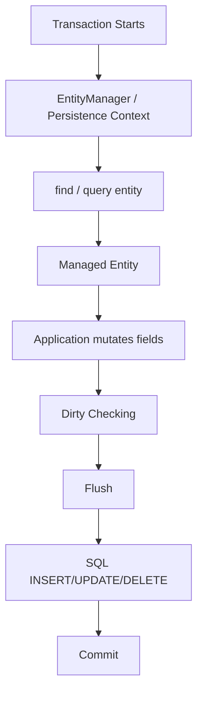
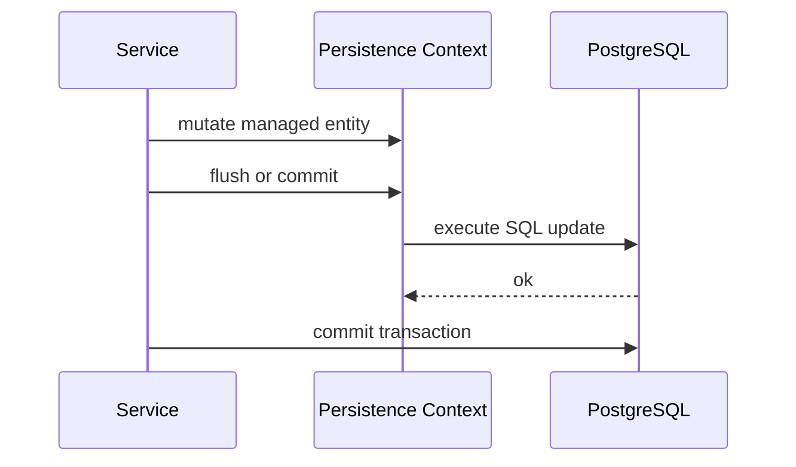

# Part 016 — JPA Flush, Dirty Checking, and Persistence Context Pitfalls

JPA/Hibernate sering terasa "magis" karena update bisa terjadi tanpa explicit `update()`.

Magic itu berguna jika dipahami. Berbahaya jika tidak.

Bagian paling penting dari mental model JPA adalah:

> Entity yang managed bukan sekadar object Java. Ia adalah object yang sedang diawasi oleh persistence context.

Akibatnya:

- mengubah field entity bisa menghasilkan SQL `UPDATE`,
- query `SELECT` bisa memicu flush pending changes,
- entity yang pernah dibaca bisa menjadi stale setelah MyBatis/native update,
- `merge()` bisa menyalin state yang tidak Anda maksud,
- bulk update bisa membuat persistence context tidak sinkron,
- transaction boundary yang kabur membuat hidden SQL muncul di tempat yang tidak diduga.

Tujuan part ini adalah membuat perilaku JPA/Hibernate terlihat eksplisit secara mental, sehingga engineer bisa men-debug dan mereview PR tanpa bergantung pada tebakan.

---

## 1. Core Mental Model: Persistence Context Is a Unit-of-Work

Persistence context adalah ruang kerja Hibernate dalam satu EntityManager/session.

Ia menyimpan entity managed dan melacak perubahannya.



Selama entity berada dalam state managed:

- Hibernate tahu identitas entity,
- Hibernate menyimpan snapshot state,
- perubahan dapat dideteksi,
- SQL bisa dibuat saat flush,
- first-level cache dapat mengembalikan entity yang sama tanpa query ulang.

Ini berbeda total dari MyBatis.

Di MyBatis:

```java
mapper.updateQuoteStatus(id, status);
```

SQL dieksekusi karena Anda memanggil mapper method.

Di JPA:

```java
quote.changeStatus(status);
```

SQL bisa dieksekusi nanti saat flush/commit karena entity managed berubah.

---

## 2. Entity States Refresher

| State | Meaning | Persistence implication |
| --- | --- | --- |
| Transient | Object baru, belum dikenal EntityManager | Tidak otomatis disimpan |
| Managed | Terasosiasi dengan persistence context | Dirty checked dan bisa di-flush |
| Detached | Pernah managed, sekarang di luar context | Tidak dirty checked |
| Removed | Ditandai untuk delete | DELETE saat flush |

Contoh:

```java
QuoteEntity quote = new QuoteEntity(); // transient
entityManager.persist(quote);          // managed
entityManager.detach(quote);           // detached
entityManager.remove(quote);           // removed, if managed
```

Bug sering muncul ketika engineer tidak sadar entity masih managed atau sudah detached.

---

## 3. Dirty Checking

Dirty checking adalah proses membandingkan state sekarang dengan snapshot awal.

```java
@Transactional
public void submitQuote(UUID quoteId) {
    QuoteEntity quote = entityManager.find(QuoteEntity.class, quoteId);
    quote.setStatus(QuoteStatus.SUBMITTED);
}
```

Tidak ada `save()`.

Tetapi saat commit, Hibernate dapat menjalankan:

```sql
update quote
set status = 'SUBMITTED'
where id = ?;
```

### Why dirty checking exists

Dirty checking mendukung Unit of Work:

- application logic bekerja dengan object,
- perubahan dikumpulkan,
- SQL dieksekusi saat flush,
- transaction commit menjadi synchronization point.

### Dirty checking risk

Dirty checking menjadi risk ketika:

- entity dimutasi di helper method tanpa disadari,
- entity dipakai sebagai DTO lalu setter dipanggil,
- mapper response mengubah managed entity,
- code review tidak melihat explicit update,
- transaction terlalu lebar,
- object graph besar.

---

## 4. Flush

Flush adalah proses sinkronisasi persistence context ke database.

Flush bukan commit.

Flush mengirim SQL, tetapi transaction masih bisa rollback.

```java
quote.setStatus(QuoteStatus.SUBMITTED);
entityManager.flush();
// SQL sent to DB, transaction still open
```

Commit biasanya melakukan flush terlebih dahulu.



---

## 5. Flush Timing

Flush bisa terjadi pada beberapa waktu:

1. Sebelum transaction commit.
2. Sebelum query tertentu.
3. Saat `entityManager.flush()` dipanggil.
4. Saat framework/provider memutuskan flush perlu dilakukan.

Contoh surprise:

```java
QuoteEntity quote = entityManager.find(QuoteEntity.class, quoteId);
quote.setStatus(QuoteStatus.SUBMITTED);

List<QuoteEntity> activeQuotes = entityManager.createQuery(
    "select q from QuoteEntity q where q.status = :status",
    QuoteEntity.class
).setParameter("status", QuoteStatus.ACTIVE)
 .getResultList();
```

Hibernate dapat melakukan flush sebelum SELECT agar query melihat perubahan yang konsisten dengan persistence context.

SQL sequence bisa menjadi:

```sql
update quote set status = 'SUBMITTED' where id = ?;
select * from quote where status = 'ACTIVE';
```

Engineer yang mengira SELECT tidak akan menulis ke DB bisa salah membaca latency dan lock behavior.

---

## 6. Flush Mode

Flush mode mengontrol kapan flush otomatis dilakukan.

Common concepts:

- `AUTO`: provider boleh flush sebelum query/commit jika perlu.
- `COMMIT`: flush terutama saat commit.
- Hibernate-specific modes bisa lebih detail.

Jangan mengubah flush mode sebagai quick fix tanpa memahami invariant.

Jika Anda menunda flush, query dalam transaction mungkin membaca state database yang belum sinkron dengan managed entity.

Pertanyaan review:

- Apakah query ini perlu melihat pending changes?
- Apakah pending changes boleh di-flush sebelum query?
- Apakah transaction terlalu banyak mencampur command dan read?
- Apakah explicit flush lebih jelas daripada mengandalkan auto flush?

---

## 7. Hidden SQL

Hidden SQL adalah SQL yang muncul tanpa method repository/mapper eksplisit.

Sumber hidden SQL:

- dirty checking,
- lazy loading,
- cascade persist/remove,
- orphan removal,
- flush before query,
- merge,
- entity listener,
- generated ID strategy,
- collection synchronization,
- lifecycle callback.

Contoh:

```java
quote.getLineItems().remove(item);
```

Jika `orphanRemoval = true`, ini bisa menghasilkan `DELETE`.

```sql
delete from quote_line_item where id = ?;
```

Bukan bug jika disengaja. Berbahaya jika reviewer tidak melihat consequence SQL-nya.

---

## 8. Managed Entity Mutation Surprise

Anti-pattern umum:

```java
QuoteEntity quote = repository.findById(id);
quote.setUpdatedBy(currentUser);
return QuoteResponse.from(quote);
```

Engineer mungkin mengira ini hanya menyiapkan response. Tetapi jika entity managed dan field berubah, Hibernate bisa melakukan update.

Risiko:

- accidental timestamp update,
- audit noise,
- version increment tanpa business change,
- row lock/update tidak perlu,
- event/outbox trigger tidak diharapkan,
- cache invalidation tidak perlu.

Rule:

> Jangan gunakan managed entity sebagai mutable response assembly object.

Gunakan DTO/projection atau immutable mapping.

---

## 9. Detached Entity

Detached entity adalah entity yang pernah managed tetapi tidak lagi berada dalam persistence context.

Contoh:

```java
QuoteEntity quote = entityManager.find(QuoteEntity.class, quoteId);
entityManager.clear();
quote.setStatus(QuoteStatus.SUBMITTED); // detached mutation
```

Perubahan tidak otomatis tersimpan.

Bug umum:

- engineer mengubah detached entity dan mengira akan update,
- lazy association diakses setelah context closed,
- detached object dikirim antar layer/request,
- stale data disimpan kembali lewat merge.

---

## 10. Merge Surprise

`merge()` bukan "attach object ini lalu update field yang berubah" secara sederhana.

`merge()` menyalin state dari detached entity ke managed entity.

```java
QuoteEntity detached = requestMapper.toEntity(request);
QuoteEntity managed = entityManager.merge(detached);
```

Risiko besar:

- field `null` dari request bisa overwrite database value,
- stale version bisa memicu optimistic lock exception,
- relationship detached bisa menghasilkan cascade tidak diharapkan,
- entity graph besar bisa ikut diproses,
- security-sensitive field bisa overwritten,
- audit fields bisa rusak.

### Safer command update pattern

Lebih aman untuk command path:

```java
QuoteEntity quote = entityManager.find(QuoteEntity.class, quoteId);
quote.changeRequestedDate(command.requestedDate());
quote.changeCustomerReference(command.customerReference());
```

Kelebihan:

- field yang berubah eksplisit,
- invariant domain bisa dipanggil,
- audit/version behavior lebih jelas,
- tidak semua request field dipercaya.

---

## 11. Clear, Detach, and Refresh

### `clear()`

Melepas semua managed entities dari persistence context.

```java
entityManager.clear();
```

Cocok untuk batch processing setelah flush.

Risiko:

- semua entity menjadi detached,
- lazy loading setelah clear gagal,
- perubahan belum flush bisa hilang jika clear dipanggil sembarangan.

### `detach(entity)`

Melepas satu entity.

```java
entityManager.detach(quote);
```

Cocok untuk menghindari dirty checking setelah read tertentu, tetapi jarang perlu jika desain repository baik.

### `refresh(entity)`

Reload state entity dari database.

```java
entityManager.refresh(quote);
```

Berguna jika database state berubah oleh trigger/procedure/native update, tetapi bisa membuang perubahan yang belum di-flush.

---

## 12. Stale State

Stale state terjadi ketika persistence context menyimpan entity lama sementara database sudah berubah.

Skenario umum:

```java
QuoteEntity quote = entityManager.find(QuoteEntity.class, quoteId);

myBatisMapper.updateQuoteStatus(quoteId, "CANCELLED");

QuoteEntity sameQuote = entityManager.find(QuoteEntity.class, quoteId);
```

`sameQuote` bisa tetap object lama dari first-level cache.

Hibernate tidak otomatis tahu MyBatis mengubah database.

Risiko:

- response menampilkan status lama,
- JPA flush berikutnya overwrite update MyBatis,
- optimistic lock tidak sinkron,
- audit/version/timestamp conflict,
- business decision memakai state lama.

### Safer options

- Hindari MyBatis dan JPA write ke table/entity yang sama dalam transaction sama.
- Jika MyBatis write harus terjadi, lakukan `flush()` sebelum dan `clear()` atau `refresh()` setelahnya sesuai kebutuhan.
- Gunakan repository ownership yang jelas.
- Jangan cache mutable shared table.
- Test mixed path secara eksplisit.

---

## 13. MyBatis Update Then JPA Stale Entity

Skenario berbahaya:

```java
@Transactional
public QuoteResponse cancel(UUID quoteId) {
    QuoteEntity quote = entityManager.find(QuoteEntity.class, quoteId);

    mapper.cancelQuote(quoteId, currentUser);

    return QuoteResponse.from(quote);
}
```

Jika `quote` sudah managed sebelum mapper update, response bisa memakai state lama.

Lebih buruk:

```java
quote.setComment("cancelled by support");
```

Saat flush, Hibernate bisa menulis update berdasarkan managed state lama dan menimpa sebagian perubahan.

Mitigasi:

```java
entityManager.flush();
mapper.cancelQuote(quoteId, currentUser);
entityManager.clear();
QuoteEntity refreshed = entityManager.find(QuoteEntity.class, quoteId);
```

Tetapi ini hanya mitigasi teknis. Pertanyaan arsitektural tetap:

> Mengapa use case yang sama butuh MyBatis dan JPA menulis aggregate yang sama?

---

## 14. JPA Update Then MyBatis Read

Skenario lain:

```java
QuoteEntity quote = entityManager.find(QuoteEntity.class, quoteId);
quote.setStatus(QuoteStatus.SUBMITTED);

QuoteReadModel readModel = mapper.findQuoteReadModel(quoteId);
```

Jika Hibernate belum flush, MyBatis read melihat database lama.

Mitigasi:

```java
quote.setStatus(QuoteStatus.SUBMITTED);
entityManager.flush();
QuoteReadModel readModel = mapper.findQuoteReadModel(quoteId);
```

Tetapi explicit flush berarti:

- SQL dikirim lebih awal,
- constraint violation muncul lebih awal,
- lock bisa diambil lebih awal,
- transaction masih bisa rollback,
- performance/ordering harus dipahami.

---

## 15. Bulk Update Pitfall

JPQL bulk update langsung ke database dan melewati managed entity state.

```java
entityManager.createQuery(
    "update QuoteEntity q set q.status = :expired where q.validUntil < :now"
)
.setParameter("expired", QuoteStatus.EXPIRED)
.setParameter("now", now)
.executeUpdate();
```

Persistence context tidak otomatis mengupdate entity yang sudah managed.

Jika sebelumnya ada:

```java
QuoteEntity quote = entityManager.find(QuoteEntity.class, quoteId);
```

Setelah bulk update, `quote` bisa stale.

Mitigasi:

- lakukan bulk update dalam transaction terpisah,
- `clear()` setelah bulk update,
- jangan campur bulk operation dengan managed entity mutation dalam context sama,
- gunakan versioning/updated timestamp strategy yang jelas,
- test stale behavior.

---

## 16. Cascade and Orphan Removal Surprise

Cascade bisa membuat satu operasi entity menghasilkan banyak SQL.

```java
@OneToMany(mappedBy = "quote", cascade = CascadeType.ALL, orphanRemoval = true)
private List<QuoteLineItemEntity> lineItems;
```

Operasi:

```java
quote.getLineItems().clear();
```

Bisa menghasilkan delete untuk semua line item.

Risiko:

- accidental mass delete,
- lock besar,
- audit/event trigger banyak,
- performance buruk,
- data loss jika relationship semantics salah.

Review cascade dengan pertanyaan:

- Apakah child lifecycle benar-benar dimiliki parent?
- Apakah remove parent harus remove child?
- Apakah collection clear valid business operation?
- Apakah database FK cascade juga ada?
- Apakah JPA cascade dan DB cascade konsisten?

---

## 17. Lazy Loading Outside Transaction

Jika entity detached lalu lazy association diakses:

```java
QuoteEntity quote = service.findQuote(id);
return quote.getCustomer().getName();
```

Bisa terjadi lazy initialization error jika persistence context sudah closed.

Root cause bukan sekadar "perlu eager".

Root cause biasanya:

- service mengembalikan entity ke layer yang salah,
- response mapping terjadi di luar transaction/persistence context,
- data shape tidak eksplisit,
- repository tidak menyediakan query sesuai use case.

Solusi sehat:

- mapping ke DTO di service/application boundary,
- fetch plan eksplisit,
- projection query untuk read endpoint,
- hindari exposing entity ke API serializer.

---

## 18. Persistence Context Memory Growth

Persistence context menyimpan semua managed entity yang dibaca/dibuat.

Batch processing buruk:

```java
for (Command command : commands) {
    entityManager.persist(toEntity(command));
}
```

Jika `commands` berisi 100k item, persistence context membesar.

Better:

```java
for (int i = 0; i < commands.size(); i++) {
    entityManager.persist(toEntity(commands.get(i)));

    if (i > 0 && i % 100 == 0) {
        entityManager.flush();
        entityManager.clear();
    }
}
```

Tetapi chunk size harus diuji.

Pertimbangkan:

- memory,
- lock duration,
- transaction timeout,
- retry granularity,
- idempotency,
- partial failure handling.

---

## 19. Unexpected Update

Unexpected update terjadi ketika Hibernate mengirim UPDATE padahal engineer tidak bermaksud mengubah data.

Penyebab umum:

- setter dipanggil saat mapping response,
- mutable embeddable berubah,
- collection order berubah,
- equals/hashCode buruk,
- timestamp updated otomatis,
- entity listener mengubah field,
- merge detached entity dari request,
- bidirectional relationship sync salah.

Detection:

- SQL log menunjukkan UPDATE saat read endpoint,
- version column bertambah tanpa business change,
- updated_at berubah tanpa alasan,
- audit log penuh noise,
- lock wait muncul di endpoint yang seharusnya read-only.

Mitigation:

- read-only transaction untuk read path jika framework mendukung,
- DTO projection,
- immutable entity untuk reference data,
- hindari setter publik sembarangan,
- query count/write count tests,
- review entity listeners.

---

## 20. Transaction Boundary Surprise

Transaction terlalu luas membuat persistence context terlalu luas.

Bad pattern:

```java
@Transactional
public QuoteResponse handle(Request request) {
    QuoteEntity quote = loadQuote(request.quoteId());
    callExternalService();
    enrichWithReferenceData();
    quote.submit();
    sendMessage();
    return mapResponse(quote);
}
```

Risiko:

- connection ditahan saat external call,
- entity managed terlalu lama,
- stale data window besar,
- flush timing sulit diprediksi,
- lock duration panjang,
- rollback melibatkan terlalu banyak operasi,
- event/message bisa tidak konsisten dengan commit.

Better thinking:

- validasi sebelum transaction jika memungkinkan,
- transaction hanya untuk database mutation yang perlu atomic,
- external call di luar transaction jika tidak perlu DB lock,
- outbox untuk event setelah commit,
- mapping response tidak memicu lazy loading.

---

## 21. Flush and Constraint Timing

Constraint violation bisa muncul saat flush, bukan saat setter dipanggil.

```java
quote.setQuoteNumber(existingQuoteNumber);
// no error here
entityManager.flush();
// unique constraint violation here
```

Dalam JAX-RS endpoint, exception mapper harus siap menangkap error dari flush/commit phase.

Risiko:

- error muncul di akhir request,
- sebagian side effect non-DB sudah dilakukan,
- log stack trace tidak jelas mengarah ke field penyebab,
- retry behavior salah.

Mitigasi:

- validate obvious uniqueness jika diperlukan, tetapi tetap rely pada DB constraint,
- letakkan side effect eksternal setelah commit atau via outbox,
- map constraint violation ke domain/API error,
- gunakan SQLState/constraint name jika tersedia.

---

## 22. Interaction with PostgreSQL MVCC and Locks

Flush mengirim SQL ke PostgreSQL.

Saat UPDATE/DELETE, PostgreSQL dapat:

- mengambil row lock,
- menunggu lock lain,
- memicu deadlock detection,
- memicu constraint check,
- menjalankan trigger,
- menghasilkan serialization failure,
- memperbarui row version MVCC.

Jadi flush timing memengaruhi:

- kapan lock diambil,
- berapa lama lock ditahan,
- kapan constraint violation muncul,
- kapan trigger side effect terjadi,
- apa yang terlihat oleh MyBatis/native query dalam transaction sama.

Flush bukan detail internal Hibernate saja. Flush adalah event database.

---

## 23. JPA, MyBatis, and Cache Conflict

First-level cache JPA selalu ada dalam persistence context.

Jika MyBatis menulis database, JPA first-level cache tidak otomatis invalidated.

Jika Hibernate second-level cache aktif, risiko makin besar.

Conflict matrix:

| Scenario | Risk |
| --- | --- |
| JPA read, MyBatis write same table | JPA managed entity stale |
| MyBatis write, JPA read same transaction | First-level cache may return old entity |
| JPA write, MyBatis read before flush | MyBatis reads old DB state |
| JPA L2 cache, MyBatis update | Cross-transaction stale cache |
| Bulk JPQL update, managed entity exists | Persistence context stale |

Default recommendation:

- jangan mix write models untuk aggregate sama,
- jika harus mix, document ordering and cache rules,
- use explicit flush/clear/refresh intentionally,
- add integration tests that prove behavior.

---

## 24. Debugging Playbook

Saat melihat bug JPA aneh, jangan mulai dari annotation. Mulai dari lifecycle.

### Step 1: Identify transaction boundary

- Method mana yang transactional?
- Apakah nested call ikut transaction sama?
- Apakah external call terjadi dalam transaction?

### Step 2: Identify managed entities

- Entity apa yang diload?
- Apakah entity masih managed saat dimutasi?
- Apakah entity pernah detached/cleared?

### Step 3: Identify flush points

- Commit?
- Query setelah mutation?
- Explicit flush?
- Bulk operation?

### Step 4: Inspect SQL

- SQL apa yang benar-benar dijalankan?
- Apakah ada UPDATE/DELETE tidak diharapkan?
- Apakah SELECT memicu flush sebelumnya?

### Step 5: Check mixed persistence

- Apakah MyBatis/JDBC/native query menyentuh table sama?
- Apakah persistence context perlu clear/refresh?
- Apakah L2 cache aktif?

### Step 6: Check PostgreSQL behavior

- Ada lock wait?
- Ada trigger?
- Ada constraint violation?
- Ada deadlock/serialization failure?

---

## 25. PR Review Checklist

Gunakan checklist ini untuk review perubahan JPA/Hibernate:

### Managed state

- Apakah entity yang dimutasi managed?
- Apakah update disengaja atau efek samping mapping?
- Apakah entity keluar ke API/serializer?

### Flush

- Kapan flush terjadi?
- Apakah SELECT setelah mutation bisa memicu flush?
- Apakah explicit flush diperlukan?
- Apakah flush memperpanjang lock duration?

### Merge

- Apakah `merge()` dipakai?
- Apakah detached entity berasal dari request?
- Apakah null field bisa overwrite data?
- Apakah relationship/cascade ikut ter-merge?

### Clear/detach/refresh

- Apakah clear dipakai setelah bulk/MyBatis write?
- Apakah clear membuang pending changes?
- Apakah refresh bisa membuang local mutation?

### Bulk operation

- Apakah bulk update/delete melewati persistence context?
- Apakah managed entity bisa stale?
- Apakah version/audit/timestamp konsisten?

### MyBatis/JPA mixing

- Apakah mapper menyentuh table/entity yang sama?
- Apakah JPA write diflush sebelum mapper read?
- Apakah mapper write diikuti clear/refresh sebelum JPA read?
- Apakah second-level cache aman?

### Production risk

- Apakah SQL log/generator behavior sudah diverifikasi?
- Apakah ada test untuk dirty checking/flush behavior?
- Apakah constraint error dimap ke API error?
- Apakah external side effect terjadi setelah commit/outbox?

---

## 26. Internal Verification Checklist

Untuk codebase internal, verifikasi hal berikut:

- Scope EntityManager/persistence context per request/transaction.
- Framework transaction annotation/configuration yang dipakai.
- Default flush mode.
- Apakah read endpoint memakai read-only transaction.
- Apakah Open Session in View atau pattern sejenis aktif.
- Apakah entity pernah dikembalikan langsung ke JAX-RS response.
- Penggunaan `merge()` di repository/service.
- Penggunaan explicit `flush()`, `clear()`, `detach()`, `refresh()`.
- Bulk JPQL/native update/delete.
- MyBatis mapper yang menyentuh table sama dengan JPA entity.
- Hibernate second-level cache/query cache setting.
- Entity listener/callback yang mengubah audit fields.
- Cascade/orphan removal mapping pada aggregate penting.
- Integration test untuk stale state dan mixed persistence.
- SQL logging setup di local/staging.
- Incident notes terkait unexpected update, stale read, lock wait, atau data overwrite.

---

## 27. Key Takeaways

- Managed entity adalah object yang diawasi persistence context.
- Dirty checking membuat update bisa terjadi tanpa explicit repository update call.
- Flush bukan commit, tetapi flush mengirim SQL ke database dan bisa mengambil lock.
- SELECT bisa memicu flush sebelum query.
- `merge()` sering lebih berbahaya daripada terlihat, terutama jika detached entity berasal dari request.
- Bulk update/delete melewati persistence context dan bisa membuat managed entity stale.
- MyBatis/JPA mixing pada table/use case sama harus diperlakukan sebagai correctness risk.
- Persistence context besar menyebabkan memory dan dirty checking cost.
- Hidden SQL harus dideteksi dengan SQL logging, tests, dan PR review discipline.
- Transaction boundary yang sehat adalah pertahanan utama terhadap flush surprise.

---

## 28. Self-Check Questions

1. Apa bedanya flush dan commit?
2. Mengapa setter pada managed entity bisa menghasilkan SQL UPDATE?
3. Kapan SELECT bisa memicu flush?
4. Mengapa `merge()` dari request DTO berbahaya?
5. Apa yang terjadi jika MyBatis update table yang entity-nya sudah managed oleh JPA?
6. Mengapa bulk JPQL update bisa membuat persistence context stale?
7. Apa risiko cascade dan orphan removal terhadap hidden DELETE?
8. Bagaimana cara men-debug unexpected update di endpoint read-only?

---

## 29. Suggested Next Reading

Lanjutkan ke Part 017 untuk menyatukan mental model MyBatis vs JPA: SQL-first explicit mapper versus entity-first persistence-context-driven Unit of Work. Part berikutnya menjadi fondasi untuk decision framework JDBC vs MyBatis vs JPA serta pembahasan mixing MyBatis dan JPA dalam use case yang sama.
