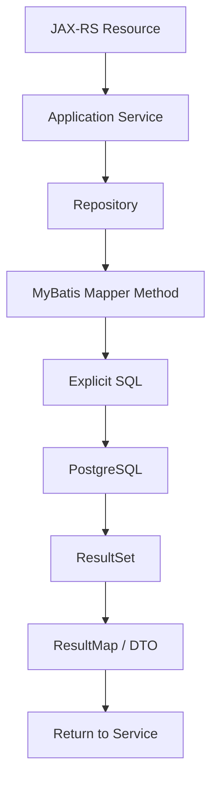
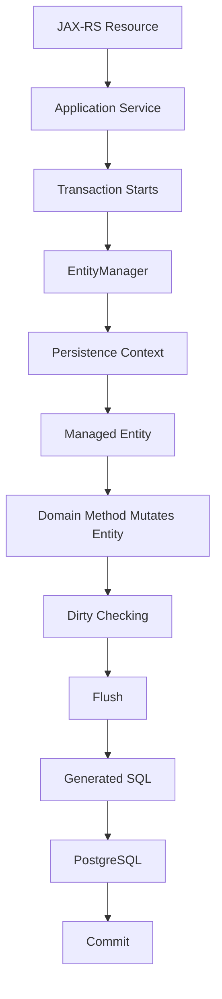
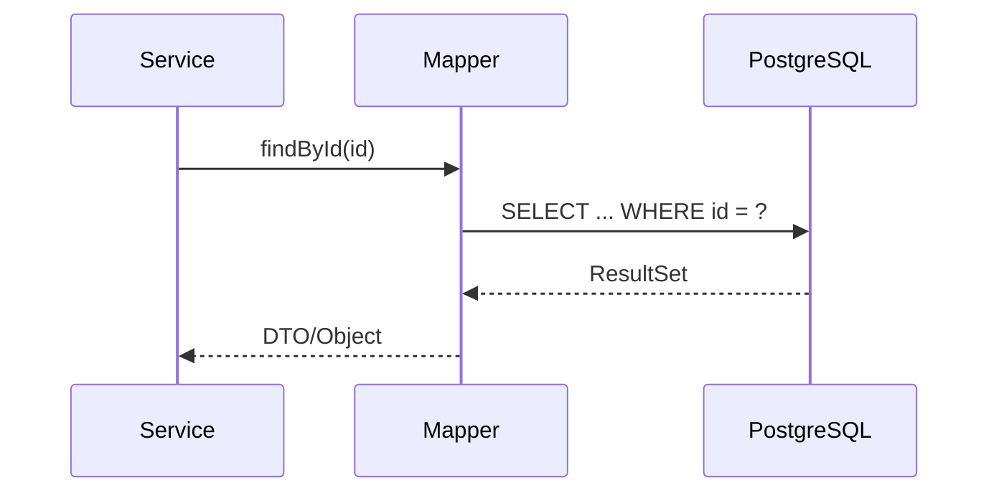
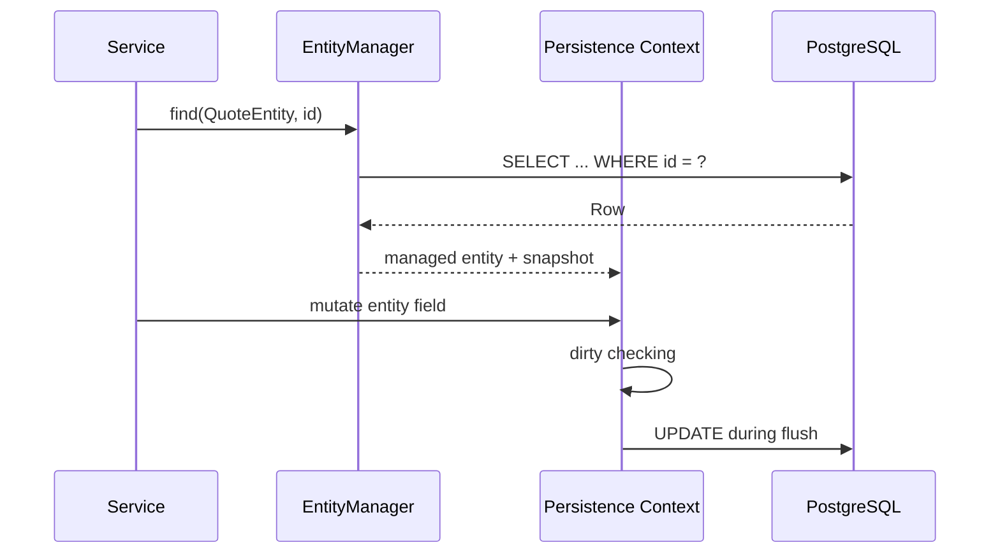
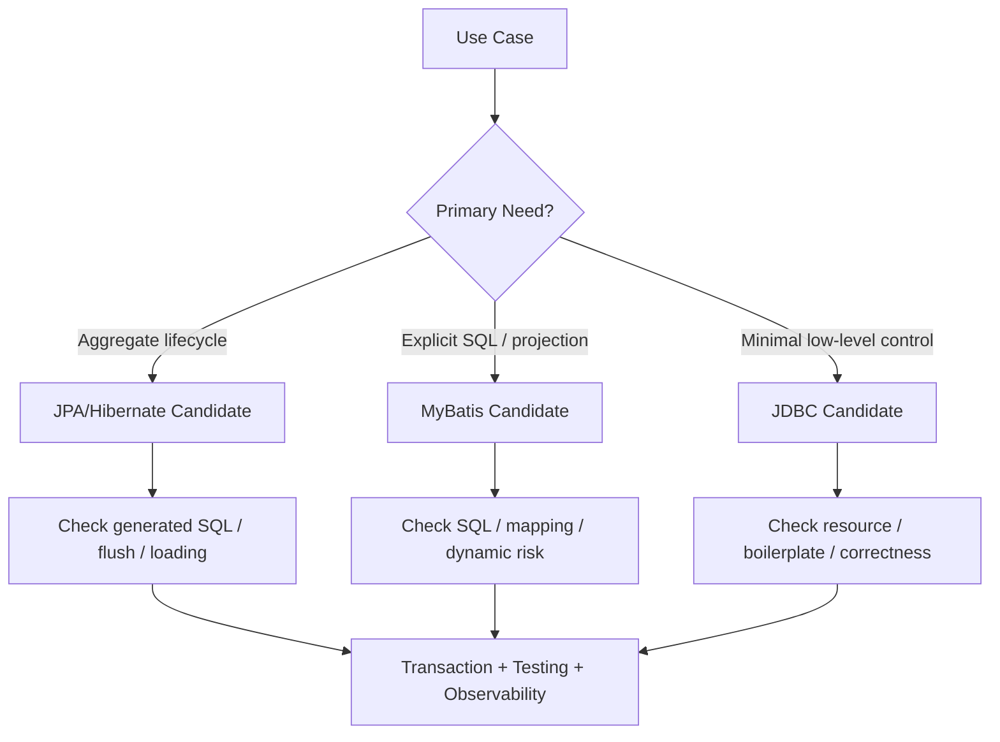

# Part 017 — MyBatis vs JPA Mental Model

MyBatis dan JPA sama-sama dipakai untuk mengakses database dari aplikasi Java.

Tetapi mental model keduanya berbeda secara fundamental.

Kesalahan paling umum adalah memperlakukan MyBatis seperti ORM ringan, atau memperlakukan JPA seperti SQL mapper otomatis.

Itu framing yang salah.

Mental model yang lebih akurat:

> MyBatis adalah SQL-first mapper. Anda memiliki query. Object Java adalah hasil mapping dari query itu.

> JPA adalah entity-first persistence model. Anda memiliki entity lifecycle. SQL adalah konsekuensi dari state transition entity di dalam persistence context.

Perbedaan ini memengaruhi:

- cara mendesain repository,
- cara menulis query,
- cara menentukan transaction boundary,
- cara men-debug performance,
- cara menghindari stale state,
- cara mereview PR,
- cara memilih framework untuk use case tertentu,
- cara mencampur atau tidak mencampur MyBatis dan JPA dalam sistem yang sama.

Part ini bukan membahas syntax.

Part ini membahas cara berpikir.

---

## 1. Core Difference

Ringkasnya:

| Dimension | MyBatis | JPA/Hibernate |
| --- | --- | --- |
| Primary model | SQL / mapper method | Entity / persistence context |
| Query ownership | Developer menulis SQL | Provider bisa generate SQL |
| Write model | Explicit `insert/update/delete` | Entity state transition + flush |
| Read model | ResultMap / DTO projection | Managed entity / projection |
| Lifecycle | Mapper call lifecycle | Entity lifecycle |
| Cache dasar | SqlSession local cache | Persistence context first-level cache |
| Relationship loading | SQL join/nested mapping | Lazy/eager/fetch join/entity graph |
| Debugging entry point | SQL file / mapper method | Entity state + generated SQL + flush |
| Main danger | Dynamic SQL/mapping drift | Hidden query/flush/dirty checking |

Tidak ada yang mutlak lebih baik.

Yang ada adalah kecocokan antara use case dan model eksekusi.

---

## 2. MyBatis Is SQL-First

Dalam MyBatis, developer secara eksplisit menulis SQL.

Contoh mapper:

```java
public interface QuoteMapper {
    QuoteSummaryDto findQuoteSummaryById(UUID quoteId);
}
```

XML:

```xml
<select id="findQuoteSummaryById" resultMap="QuoteSummaryMap">
  SELECT
      q.id,
      q.quote_number,
      q.status,
      c.name AS customer_name,
      q.created_at
  FROM quote q
  JOIN customer c ON c.id = q.customer_id
  WHERE q.id = #{quoteId}
</select>
```

Mental model-nya:



Hal yang penting:

- query terlihat,
- join terlihat,
- filter terlihat,
- pagination terlihat,
- lock clause terlihat,
- database-specific feature terlihat,
- mapping harus dijaga manual,
- lifecycle object tidak dikelola otomatis.

Jika ingin update, Anda memanggil update:

```java
mapper.updateQuoteStatus(quoteId, QuoteStatus.APPROVED, actorUserId);
```

Tidak ada dirty checking.

Tidak ada flush otomatis.

Tidak ada persistence context yang mengingat object lama sebagai managed state.

Ini membuat MyBatis sangat jelas untuk operational debugging.

Tetapi juga membuat developer bertanggung jawab penuh atas SQL correctness.

---

## 3. JPA Is Entity-First

Dalam JPA/Hibernate, developer berinteraksi dengan entity dan persistence context.

Contoh:

```java
@Transactional
public void approveQuote(UUID quoteId, UserId actor) {
    QuoteEntity quote = entityManager.find(QuoteEntity.class, quoteId);
    quote.approve(actor);
}
```

Tidak ada explicit `update`.

Tetapi SQL bisa tetap terjadi saat flush/commit:

```sql
UPDATE quote
SET status = 'APPROVED', updated_by = ?, updated_at = ?, version = version + 1
WHERE id = ? AND version = ?;
```

Mental model-nya:



Hal yang penting:

- object identity dijaga di persistence context,
- entity lifecycle penting,
- mutation field bisa menghasilkan SQL,
- SQL bisa muncul saat query atau commit,
- relationship bisa lazy-loaded,
- flush timing penting,
- generated SQL harus diobservasi,
- persistence context bisa stale jika database diubah dari luar context.

JPA cocok ketika entity lifecycle dan aggregate consistency lebih penting daripada kontrol SQL eksplisit untuk setiap query.

---

## 4. Mapper Lifecycle vs Entity Lifecycle

### MyBatis lifecycle

MyBatis lifecycle biasanya pendek dan method-oriented:



Setelah object dikembalikan, MyBatis tidak memonitor object itu.

Jika object diubah:

```java
QuoteDto quote = mapper.findById(id);
quote.setStatus("APPROVED");
```

Tidak ada SQL otomatis.

Anda harus memanggil mapper update:

```java
mapper.updateStatus(id, "APPROVED");
```

### JPA lifecycle

JPA lifecycle transaction-oriented:



Entity managed akan dilacak.

Ini berguna untuk aggregate behavior.

Tetapi dangerous jika engineer tidak sadar entity masih managed.

---

## 5. Explicit Update vs Automatic Update

### MyBatis

Update eksplisit:

```xml
<update id="approveQuote">
  UPDATE quote
  SET
      status = 'APPROVED',
      updated_by = #{actorUserId},
      updated_at = now(),
      version = version + 1
  WHERE id = #{quoteId}
    AND status = 'PENDING_APPROVAL'
    AND version = #{expectedVersion}
</update>
```

Kelebihan:

- intent query jelas,
- condition business terlihat,
- optimistic locking manual terlihat,
- mudah membaca SQL di PR,
- mudah menambahkan PostgreSQL clause seperti `RETURNING`.

Risiko:

- developer bisa lupa update `version`,
- developer bisa lupa audit field,
- developer bisa tidak konsisten dengan soft delete/tenant filter,
- duplicate SQL bisa muncul di banyak mapper,
- mapping bisa drift dari schema.

### JPA

Update melalui mutation:

```java
@Transactional
public void approve(UUID id, long expectedVersion, UserId actor) {
    QuoteEntity quote = entityManager.find(QuoteEntity.class, id);
    quote.assertVersion(expectedVersion);
    quote.approve(actor);
}
```

Kelebihan:

- invariant bisa hidup dekat entity,
- lifecycle aggregate lebih natural,
- optimistic locking via `@Version`,
- audit bisa di-centralize via listener,
- dirty checking mengurangi boilerplate update.

Risiko:

- SQL tidak terlihat langsung,
- update bisa terjadi tanpa explicit repository method,
- flush timing bisa mengejutkan,
- relationship lazy loading bisa membuat query tambahan,
- persistence context bisa menyimpan state stale.

---

## 6. Query Visibility

Query visibility adalah perbedaan paling praktis saat production incident.

### MyBatis visibility

Pada MyBatis, PR biasanya menunjukkan SQL:

```xml
<select id="searchQuotes" resultMap="QuoteSearchResultMap">
  SELECT ...
  FROM quote q
  WHERE q.tenant_id = #{tenantId}
    <if test="status != null">
      AND q.status = #{status}
    </if>
  ORDER BY q.created_at DESC
  LIMIT #{limit}
  OFFSET #{offset}
</select>
```

Reviewer bisa langsung bertanya:

- Apakah ada index untuk `tenant_id, status, created_at`?
- Apakah dynamic sort aman?
- Apakah pagination stabil?
- Apakah filter soft delete ada?
- Apakah query ini bisa full table scan?
- Apakah perlu keyset pagination?

### JPA visibility

Pada JPA, PR bisa terlihat seperti ini:

```java
List<QuoteEntity> quotes = quoteRepository.findByStatus(status);
```

Atau:

```java
@Query("select q from QuoteEntity q where q.status = :status")
List<QuoteEntity> findByStatus(QuoteStatus status);
```

Generated SQL perlu dilihat melalui log/test:

```sql
select q.id, q.status, q.customer_id, q.created_at, ...
from quote q
where q.status = ?
```

Reviewer harus bertanya:

- SQL apa yang benar-benar dihasilkan?
- Apakah relationship ikut loaded?
- Apakah query ini menghasilkan N+1 saat field digunakan?
- Apakah pagination dilakukan di database?
- Apakah projection lebih tepat daripada entity?
- Apakah fetch join membuat duplicate row?
- Apakah query ini memicu flush sebelumnya?

Untuk senior engineer, review JPA tanpa melihat generated SQL adalah review yang belum selesai.

---

## 7. Relationship Loading

Relationship loading adalah salah satu area paling berbeda.

### MyBatis relationship loading

MyBatis relationship loading biasanya explicit melalui join, nested result, atau nested select.

Join projection:

```sql
SELECT
    q.id AS quote_id,
    q.quote_number,
    c.id AS customer_id,
    c.name AS customer_name
FROM quote q
JOIN customer c ON c.id = q.customer_id
WHERE q.id = #{quoteId}
```

Nested select:

```xml
<collection property="items"
            column="id"
            select="findQuoteItemsByQuoteId" />
```

Nested select bisa menyebabkan N+1 jika digunakan untuk list.

Tetapi query relationship terlihat di mapper.

### JPA relationship loading

JPA relationship loading bisa terlihat sederhana:

```java
QuoteEntity quote = entityManager.find(QuoteEntity.class, quoteId);
quote.getItems().size();
```

Tetapi `getItems()` bisa memicu query tambahan jika lazy.

Pada list:

```java
List<QuoteEntity> quotes = quoteRepository.findRecentQuotes();
for (QuoteEntity quote : quotes) {
    quote.getItems().size();
}
```

Ini bisa menjadi N+1.

Solusi JPA:

- fetch join,
- entity graph,
- batch fetching,
- DTO projection,
- query split eksplisit.

Solusi MyBatis:

- explicit join,
- nested result,
- batch query by IDs,
- DTO projection,
- hindari nested select untuk collection list besar.

---

## 8. ResultMap vs Persistence Context

MyBatis `ResultMap` dan JPA persistence context sering terlihat sama-sama “mapping object”.

Tetapi beda fungsi.

### ResultMap

ResultMap menjawab pertanyaan:

> Bagaimana row/column dari ResultSet menjadi object Java?

Contoh:

```xml
<resultMap id="QuoteSummaryMap" type="QuoteSummaryDto">
  <id property="id" column="id" />
  <result property="quoteNumber" column="quote_number" />
  <result property="status" column="status" />
  <result property="customerName" column="customer_name" />
</resultMap>
```

ResultMap tidak melacak perubahan object setelah mapping selesai.

### Persistence context

Persistence context menjawab pertanyaan:

> Entity apa yang managed dalam Unit of Work, apa snapshot awalnya, dan SQL apa yang perlu di-flush?

Persistence context melakukan:

- identity map,
- dirty checking,
- first-level cache,
- write-behind,
- flush ordering,
- relationship proxy management.

Jadi perbandingannya bukan `ResultMap` vs `@Entity` saja.

Perbandingan yang benar adalah:

```text
MyBatis = SQL + ResultMap + mapper method
JPA     = Entity + EntityManager + persistence context + provider behavior
```

---

## 9. Domain Modelling Difference

### MyBatis and domain model

Dengan MyBatis, Anda bebas memilih apakah mapper mengembalikan:

- DTO projection,
- persistence object,
- domain object,
- command result,
- flat read model,
- hierarchical object hasil nested mapping.

Tetapi karena MyBatis tidak punya entity lifecycle, domain behavior harus dipanggil dan disimpan secara explicit.

Contoh:

```java
Quote quote = quoteRepository.findAggregate(quoteId);
quote.approve(actor);
quoteRepository.saveApprovedState(quote);
```

Repository harus menerjemahkan domain state menjadi SQL update.

Ini bisa sangat bersih jika disiplin.

Tetapi bisa menjadi procedural SQL scripts jika tidak ada aggregate boundary.

### JPA and domain model

Dengan JPA, entity bisa menjadi domain model:

```java
quote.approve(actor);
```

Lalu Hibernate mengurus update saat flush.

Ini nyaman untuk aggregate lifecycle.

Tetapi ada trade-off:

- entity membawa annotation persistence,
- relationship mapping memengaruhi domain object,
- lazy proxy bisa bocor ke domain/application logic,
- serialization entity ke API berbahaya,
- transaction boundary harus menjaga lazy access.

Dalam enterprise system, keputusan “JPA entity sebagai domain model” harus sadar konsekuensi.

Alternatifnya:

- JPA entity sebagai persistence model,
- domain model terpisah,
- mapper domain-entity eksplisit.

Trade-off-nya adalah boilerplate mapping lebih banyak.

---

## 10. Query Model Difference

### MyBatis favors query model clarity

MyBatis unggul saat use case query lebih penting daripada lifecycle object.

Contoh:

- search quote dengan banyak optional filter,
- report quote aging,
- projection untuk dashboard,
- query JSONB catalog attributes,
- query dengan CTE/window function,
- `SKIP LOCKED` worker polling,
- `INSERT ... ON CONFLICT ... RETURNING`,
- stored procedure/function integration.

Karena query ditulis langsung, developer bisa mengoptimasi SQL seperti SQL.

### JPA favors entity lifecycle

JPA unggul saat use case berpusat pada aggregate lifecycle.

Contoh:

- create/update aggregate dengan relationship yang jelas,
- optimistic locking via version,
- domain method menjaga invariant,
- cascade terbatas dan terkontrol,
- unit-of-work perlu menyimpan beberapa perubahan entity,
- simple CRUD admin/domain maintenance.

JPA tidak berarti tidak bisa complex query.

Tetapi semakin query Anda PostgreSQL-specific dan projection-heavy, semakin sering JPA menjadi kurang natural.

---

## 11. Batch Operation Difference

### MyBatis batch

MyBatis batch biasanya explicit:

```java
for (QuoteImportRow row : rows) {
    mapper.insertQuote(row);
}
```

Dengan executor batch, statement bisa dikirim sebagai batch.

Keuntungan:

- SQL jelas,
- memory bisa dikontrol,
- chunking jelas,
- tidak ada dirty checking cost,
- cocok untuk import/update massal.

Risiko:

- error partial batch perlu ditangani,
- generated keys perlu hati-hati,
- transaction size bisa terlalu besar,
- audit/version logic harus konsisten manual.

### JPA batch

JPA batch terlihat object-oriented:

```java
for (QuoteEntity quote : quotes) {
    entityManager.persist(quote);
    if (++count % batchSize == 0) {
        entityManager.flush();
        entityManager.clear();
    }
}
```

Keuntungan:

- entity lifecycle tetap dipakai,
- validation/listener bisa konsisten,
- `@Version` dan cascade bisa ikut bekerja.

Risiko:

- persistence context membesar,
- dirty checking cost naik,
- batch insert bisa gagal karena ID strategy,
- flush order bisa memengaruhi constraint,
- bulk JPQL membuat context stale.

Untuk batch besar, senior engineer harus bertanya:

- Butuh entity lifecycle atau hanya bulk SQL?
- Butuh listener/audit otomatis?
- Butuh PostgreSQL-specific SQL?
- Berapa volume data?
- Apa retry/idempotency strategy?
- Bagaimana chunk boundary?

---

## 12. Operational Debugging Difference

### Debugging MyBatis

Mulai dari mapper method.

Langkah umum:

1. Cari mapper method yang dipanggil.
2. Buka XML SQL.
3. Ambil SQL final dengan parameter.
4. Jalankan `EXPLAIN ANALYZE` di PostgreSQL.
5. Cek ResultMap/TypeHandler.
6. Cek dynamic branch.
7. Cek transaction/lock clause.
8. Cek index dan row estimate.

MyBatis debugging sering lebih linear.

Masalah biasanya di:

- SQL salah,
- parameter salah,
- dynamic SQL branch salah,
- ResultMap salah,
- TypeHandler salah,
- index tidak sesuai,
- transaction/lock tidak sesuai.

### Debugging JPA/Hibernate

Mulai dari use case dan persistence context.

Langkah umum:

1. Cari service transaction boundary.
2. Identifikasi entity yang loaded.
3. Cek relationship yang disentuh.
4. Cek generated SQL.
5. Cek flush timing.
6. Cek dirty checking update.
7. Cek persistence context size.
8. Cek lazy loading/N+1.
9. Cek second-level cache jika aktif.
10. Cek bulk update/native query yang membuat stale state.

JPA debugging lebih stateful.

Masalah biasanya di:

- hidden SQL,
- unexpected flush,
- N+1,
- stale entity,
- merge surprise,
- wrong cascade,
- eager loading berlebihan,
- persistence context terlalu besar,
- generated SQL tidak sesuai ekspektasi.

---

## 13. Transaction Boundary Implication

MyBatis dan JPA sama-sama butuh transaction boundary.

Tetapi efeknya berbeda.

### MyBatis in transaction

Dalam transaction:

```java
@Transactional
public void approveQuote(UUID quoteId) {
    mapper.lockQuote(quoteId);
    mapper.updateQuoteStatus(quoteId, APPROVED);
    mapper.insertAuditEvent(...);
}
```

Semua SQL dieksekusi saat method mapper dipanggil.

Transaction mengatur commit/rollback.

### JPA in transaction

Dalam transaction:

```java
@Transactional
public void approveQuote(UUID quoteId) {
    QuoteEntity quote = entityManager.find(QuoteEntity.class, quoteId);
    quote.approve();
    auditEntityManager.persist(new AuditEventEntity(...));
}
```

Sebagian SQL bisa ditunda sampai flush.

Jika di tengah method ada query:

```java
repository.countApprovedQuotes();
```

Hibernate bisa flush pending changes dulu supaya query melihat state konsisten.

Ini penting saat mencampur JPA dengan MyBatis.

Jika MyBatis membaca database sebelum JPA flush, MyBatis mungkin tidak melihat perubahan entity yang masih pending.

Jika MyBatis mengubah row yang sudah ada sebagai managed entity di JPA, JPA bisa tetap memegang stale state.

---

## 14. Mixing Implication: Why Same Use Case Is Dangerous

Misalnya dalam satu transaction:

```java
@Transactional
public void approveQuote(UUID quoteId) {
    QuoteEntity quote = entityManager.find(QuoteEntity.class, quoteId);
    quote.approve();

    QuoteSummaryDto summary = quoteMapper.findSummary(quoteId);
}
```

Pertanyaan review:

- Apakah JPA sudah flush sebelum MyBatis read?
- Jika belum, summary membaca status lama atau baru?
- Jika Hibernate auto-flush terjadi, apakah SQL update terjadi lebih awal dari yang diduga?
- Apakah query MyBatis memicu lock yang berinteraksi dengan pending update?

Contoh sebaliknya:

```java
@Transactional
public void patchQuote(UUID quoteId) {
    QuoteEntity quote = entityManager.find(QuoteEntity.class, quoteId);

    quoteMapper.updateDiscount(quoteId, newDiscount);

    quote.recalculateTotal();
}
```

Risiko:

- entity `quote` di persistence context stale,
- `recalculateTotal()` memakai discount lama,
- flush JPA bisa overwrite perubahan MyBatis,
- `@Version` bisa tidak sinkron,
- audit/timestamp bisa inconsistent.

Karena itu same-use-case mixing harus dianggap suspicious by default.

Bukan selalu salah.

Tetapi harus dibuktikan aman.

---

## 15. Correctness Concern

### MyBatis correctness concern

MyBatis correctness bergantung pada SQL dan convention manual.

Checklist mental:

- Apakah `WHERE tenant_id = ?` selalu ada?
- Apakah soft delete filter selalu ada?
- Apakah optimistic locking manual benar?
- Apakah audit fields di-update?
- Apakah status transition dijaga?
- Apakah `UPDATE` terlalu luas?
- Apakah dynamic SQL bisa menghapus filter penting?
- Apakah `resultMap` sesuai schema?
- Apakah null handling benar?

### JPA correctness concern

JPA correctness bergantung pada entity lifecycle dan persistence context behavior.

Checklist mental:

- Apakah entity masih managed?
- Apakah mutation field disengaja?
- Apakah flush timing diketahui?
- Apakah merge membawa state stale?
- Apakah cascade terlalu luas?
- Apakah lazy loading terjadi di luar transaction?
- Apakah bulk update membuat context stale?
- Apakah version column dipakai?
- Apakah generated SQL sesuai invariant?

---

## 16. Performance Concern

### MyBatis performance concern

- SQL bisa sangat optimal.
- SQL juga bisa sangat buruk.
- Performance langsung bergantung pada kualitas query.
- Dynamic SQL bisa menghasilkan banyak plan shape.
- Nested select bisa N+1.
- Large result bisa OOM jika fetch/streaming salah.
- Manual pagination bisa buruk jika offset besar.

Debugging performance MyBatis biasanya SQL-centric.

### JPA performance concern

- Generated SQL bisa tidak terlihat di review.
- Lazy loading bisa N+1.
- Eager loading bisa over-fetching.
- Dirty checking bisa mahal untuk context besar.
- Flush terlalu sering bisa menambah round trip.
- Batch insert/update perlu konfigurasi.
- Entity graph/fetch join harus dirancang.

Debugging performance JPA biasanya SQL + lifecycle-centric.

---

## 17. Security and Privacy Concern

### MyBatis

Security risk utama:

- SQL injection melalui `${}`,
- dynamic ORDER BY tanpa whitelist,
- tenant filter terlupa,
- soft delete/security filter terlupa,
- sensitive parameter muncul di SQL log,
- query terlalu bebas untuk export/report.

MyBatis memberi kontrol tinggi.

Kontrol tinggi berarti tanggung jawab tinggi.

### JPA

Security risk utama:

- entity expose ke API dan serialize relationship sensitif,
- lazy field sensitif ikut loaded,
- tenant filter tidak diterapkan pada semua query/native query,
- bulk/native query bypass entity listener/security filter,
- generated SQL logging membocorkan parameter,
- second-level cache tidak tenant-aware.

JPA menyembunyikan sebagian query.

Query tersembunyi tetap harus aman.

---

## 18. Observability Concern

Untuk MyBatis, observability ideal mencakup:

- mapper method name,
- SQL statement id,
- duration,
- row count,
- error SQLState,
- parameter redaction,
- slow query correlation ke request trace,
- connection pool wait time.

Untuk JPA/Hibernate, observability ideal mencakup:

- generated SQL,
- query count per request,
- flush count,
- entity load count,
- collection fetch count,
- second-level cache hit/miss,
- transaction duration,
- connection acquisition time,
- slow query correlation ke request trace.

Dalam JAX-RS service, trace harus bisa menjawab:

> Endpoint ini lambat karena CPU, downstream call, connection pool wait, lock wait, atau query plan?

Tanpa observability, diskusi MyBatis vs JPA akan berubah menjadi opini.

---

## 19. Decision Heuristics

### Prefer MyBatis when

- SQL adalah bagian utama use case.
- Query butuh PostgreSQL-specific feature.
- Projection/reporting lebih penting daripada entity lifecycle.
- Query shape harus terlihat jelas di PR.
- Legacy schema tidak cocok dengan ORM.
- Batch/bulk operation butuh kontrol SQL eksplisit.
- Dynamic search kompleks dengan filter banyak.
- Anda butuh `RETURNING`, `ON CONFLICT`, CTE, window function, JSONB operator, atau lock clause spesifik.

### Prefer JPA/Hibernate when

- Use case berpusat pada aggregate lifecycle.
- Entity relationship cukup natural dan terkendali.
- CRUD/update domain object sering terjadi.
- Optimistic locking via `@Version` berguna.
- Domain method dan invariant dekat entity memberi value.
- Query relatif sederhana atau bisa dipenuhi dengan JPQL/projection.
- Team memahami persistence context dan Hibernate behavior.

### Prefer JDBC directly when

- Operasi sangat kecil dan framework overhead tidak perlu.
- Integrasi database sangat spesifik.
- Anda butuh kontrol resource/fetch/streaming sangat eksplisit.
- Migration/tooling/internal library memang berbasis JDBC.
- Use case jarang dan tidak layak menambah mapper/entity model.

Tetapi raw JDBC berarti Anda mengurus semuanya sendiri.

---

## 20. Example: Quote Search

Use case:

> Search quotes by tenant, status, customer, date range, product family, sales channel, effective date, and sort by created date or total amount.

MyBatis fit:

- banyak filter optional,
- projection DTO,
- explicit index-aware SQL,
- dynamic SQL dengan whitelist sorting,
- bisa pakai CTE/window function,
- result tidak perlu managed entity.

JPA fit jika:

- filter sederhana,
- entity graph jelas,
- query count bisa dikontrol,
- projection cukup sederhana.

Raw JDBC fit jika:

- endpoint sangat performance-critical,
- perlu streaming besar,
- query dikelola dalam library khusus,
- overhead mapper tidak diperlukan.

Senior review question:

> Apakah endpoint search ini membutuhkan entity lifecycle atau hanya query projection?

Jika hanya projection, JPA entity loading sering menjadi beban yang tidak perlu.

---

## 21. Example: Quote Approval

Use case:

> Approve quote with business invariants, status transition, version check, audit, and outbox event.

JPA fit:

- aggregate lifecycle penting,
- `quote.approve()` menjaga invariant,
- `@Version` menjaga optimistic lock,
- audit listener bisa konsisten,
- transaction menyimpan quote + audit + outbox.

MyBatis fit jika:

- status transition lebih SQL-centric,
- constraint dan version check ingin diekspresikan di `WHERE`,
- update harus minimal dan explicit,
- ada stored function/procedure,
- team ingin menghindari persistence context.

Raw JDBC fit jarang, kecuali write path sangat khusus.

Senior review question:

> Di mana invariant approval dijaga: entity/domain method, SQL `WHERE`, database constraint, atau kombinasi?

Jawaban harus eksplisit.

---

## 22. Example: Worker Polling with SKIP LOCKED

Use case:

> Worker mengambil job pending secara concurrent tanpa saling blocking.

SQL PostgreSQL:

```sql
SELECT id
FROM outbox_event
WHERE status = 'PENDING'
ORDER BY created_at
FOR UPDATE SKIP LOCKED
LIMIT ?;
```

MyBatis biasanya lebih natural karena SQL adalah inti use case.

JPA bisa memakai native query, tetapi jika sudah native query + lock clause + projection, value JPA sebagai ORM kecil.

Senior review question:

> Apakah kita sedang menggunakan JPA hanya sebagai transport untuk SQL native?

Jika iya, MyBatis atau JDBC mungkin lebih jujur.

---

## 23. Example: Catalog Entity Graph

Use case:

> Product catalog punya product, product offering, price, compatibility rule, effective date, and version.

JPA bisa cocok jika:

- relationship lifecycle natural,
- aggregate boundary jelas,
- update graph perlu cascade terbatas,
- effective dating dijaga entity/domain method,
- fetch strategy dikontrol.

MyBatis bisa cocok jika:

- query catalog lebih banyak berupa read projection,
- JSONB/rule query kompleks,
- version/effective date filtering sangat SQL-heavy,
- performance query lebih penting daripada object graph.

Senior review question:

> Apakah model ini benar-benar aggregate mutable, atau read-optimized catalog projection?

Jawaban menentukan framework yang cocok.

---

## 24. PR Review Checklist: MyBatis vs JPA Decision

Saat melihat PR persistence, tanyakan:

### Use case shape

- Apakah ini command write path atau query/read path?
- Apakah butuh aggregate lifecycle?
- Apakah butuh projection/reporting?
- Apakah query SQL kompleks?
- Apakah PostgreSQL-specific feature dipakai?
- Apakah volume data besar?
- Apakah operation batch/streaming?

### Transaction correctness

- Di mana transaction boundary?
- Apakah write perlu atomic dengan event/outbox?
- Apakah ada lock/optimistic version?
- Apakah ada retry untuk deadlock/serialization?
- Apakah MyBatis dan JPA dicampur dalam transaction yang sama?

### Mapping correctness

- Jika MyBatis: apakah ResultMap benar?
- Jika JPA: apakah entity mapping sesuai schema?
- Apakah DTO/entity/domain model tercampur?
- Apakah tenant/soft delete/effective date filter konsisten?

### Performance

- SQL apa yang dieksekusi?
- Apakah ada N+1?
- Apakah index mendukung filter/sort?
- Apakah pagination stabil?
- Apakah batch/fetch size sesuai?
- Apakah generated SQL dilampirkan untuk JPA?

### Operational readiness

- Apakah query observable?
- Apakah error mapped dengan benar?
- Apakah migration kompatibel?
- Apakah tests memakai PostgreSQL nyata/Testcontainers?
- Apakah sensitive data tidak masuk log?

---

## 25. Anti-Framing to Avoid

Hindari framing seperti:

> JPA lebih modern daripada MyBatis.

Salah. Keduanya menyelesaikan problem berbeda.

> MyBatis lebih cepat daripada JPA.

Terlalu simplistik. SQL MyBatis buruk bisa lebih lambat dari JPA yang benar. JPA buruk bisa menghasilkan N+1 fatal.

> JPA menghilangkan kebutuhan SQL.

Salah. Senior engineer tetap harus membaca generated SQL dan query plan.

> MyBatis aman karena semua SQL terlihat.

Salah. SQL terlihat bukan berarti benar. Dynamic SQL, missing tenant filter, dan mapping drift tetap berbahaya.

> Kita bisa pakai keduanya kapan saja.

Salah. Coexistence butuh ownership, transaction discipline, cache discipline, dan PR checklist.

---

## 26. Senior Engineer Mental Model

Mental model senior bukan:

```text
JPA vs MyBatis = mana yang lebih bagus?
```

Tetapi:

```text
Use case shape + data ownership + transaction boundary + query complexity + operational risk = framework choice.
```

Dengan kata lain:



Framework choice adalah design decision.

Design decision harus bisa dijelaskan, diuji, dan dioperasikan.

---

## 27. Internal Verification Checklist

Gunakan checklist ini di codebase internal.

### Inventory

- Cari module/package yang memakai MyBatis.
- Cari module/package yang memakai JPA/Hibernate.
- Cari raw JDBC usage.
- Cari mapper dan entity yang menyentuh table yang sama.
- Cari repository yang memanggil mapper dan EntityManager sekaligus.

### Convention

- Verifikasi convention pemilihan MyBatis vs JPA.
- Verifikasi apakah ada ADR persistence.
- Verifikasi apakah ada rule untuk native query JPA.
- Verifikasi apakah ada rule untuk mapper XML naming.
- Verifikasi apakah ada rule untuk transaction annotation/config.

### Runtime behavior

- Verifikasi SQL logging untuk MyBatis.
- Verifikasi generated SQL logging untuk Hibernate.
- Verifikasi query count observability.
- Verifikasi connection pool metrics.
- Verifikasi transaction duration metrics.

### Correctness

- Verifikasi tenant filter/soft delete/effective date convention.
- Verifikasi optimistic locking strategy.
- Verifikasi audit/timestamp strategy.
- Verifikasi validation/invariant placement.
- Verifikasi MyBatis/JPA mixing tests jika ada.

### Discussion with team

Tanyakan ke senior engineer/DBA/platform/backend team:

- Area mana yang sengaja memakai MyBatis?
- Area mana yang sengaja memakai JPA?
- Apakah ada historical incident karena ORM/query mapping?
- Apakah ada table yang tidak boleh disentuh dari dua model persistence?
- Apakah Hibernate second-level cache aktif?
- Apakah MyBatis second-level cache dipakai?
- Bagaimana migration dan schema ownership diatur?

---

## 28. Common Failure Modes

| Failure mode | More common in | Detection |
| --- | --- | --- |
| Missing tenant filter | MyBatis/native query | Security test, query review |
| N+1 query | JPA, MyBatis nested select | Query count, SQL log |
| Hidden update | JPA | Hibernate SQL log, dirty checking test |
| Mapping mismatch | MyBatis/JPA | Integration test, migration test |
| Stale persistence context | JPA + MyBatis/native update | Repro test within same transaction |
| Dynamic SQL injection | MyBatis | Static review, security test |
| Over-fetching relationship | JPA | SQL log, heap profile |
| Duplicate write model | MyBatis + JPA | Code inventory, PR review |
| Missing optimistic lock | MyBatis/manual SQL | Concurrent update test |
| Bulk update stale entity | JPA | Flush/clear test |

---

## 29. Practical Rule of Thumb

Gunakan rule berikut sebagai starting point, bukan hukum absolut.

- Untuk **simple aggregate lifecycle**: pertimbangkan JPA.
- Untuk **complex read query/projection/reporting**: pertimbangkan MyBatis.
- Untuk **PostgreSQL-specific SQL heavy path**: pertimbangkan MyBatis atau JDBC.
- Untuk **high-volume batch**: pertimbangkan MyBatis/JDBC; JPA hanya jika lifecycle entity benar-benar dibutuhkan.
- Untuk **stored procedure/function heavy integration**: pertimbangkan MyBatis/JDBC.
- Untuk **legacy schema yang tidak ORM-friendly**: pertimbangkan MyBatis.
- Untuk **relationship-heavy mutable domain**: JPA bisa cocok, tetapi harus dikontrol fetch/cascade-nya.
- Untuk **same table write melalui MyBatis dan JPA**: anggap berbahaya sampai terbukti aman.

---

## 30. What Good Looks Like

Sistem persistence yang sehat tidak harus memilih hanya satu framework.

Tetapi harus memiliki boundary yang jelas.

Contoh sehat:

```text
Quote aggregate lifecycle     -> JPA repository
Quote search/read model       -> MyBatis query repository
Outbox polling                -> MyBatis/JDBC PostgreSQL-specific query
Migration                     -> Flyway/Liquibase
Batch import                  -> MyBatis batch / JDBC batch
```

Dengan syarat:

- ownership terdokumentasi,
- transaction boundary jelas,
- same table write tidak diduplikasi,
- JPA flush/stale context diperhatikan,
- MyBatis query punya tenant/soft delete/effective date discipline,
- generated SQL dan mapper SQL observable,
- tests mencakup integration, transaction, concurrency, dan migration.

---

## 31. Summary

MyBatis dan JPA bukan sekadar dua library data access.

Mereka membawa model berpikir yang berbeda:

```text
MyBatis = SQL-first, explicit query, explicit update, mapper/result mapping discipline.

JPA/Hibernate = entity-first, persistence context, unit-of-work, dirty checking, flush discipline.
```

MyBatis memberi SQL visibility dan kontrol eksplisit.

JPA memberi entity lifecycle dan unit-of-work abstraction.

Keduanya bisa efektif.

Keduanya bisa menjadi sumber incident.

Senior engineer harus mampu melihat:

- bentuk use case,
- ownership data,
- transaction boundary,
- query complexity,
- concurrency risk,
- observability,
- migration impact,
- performance profile,
- correctness invariant.

Baru setelah itu memilih JDBC, MyBatis, atau JPA.

Di part berikutnya, kita akan membuat decision framework lebih eksplisit: kapan menggunakan JDBC langsung, kapan MyBatis, kapan JPA/Hibernate, dan bagaimana membuat decision matrix yang bisa dipakai dalam PR/architecture review.
