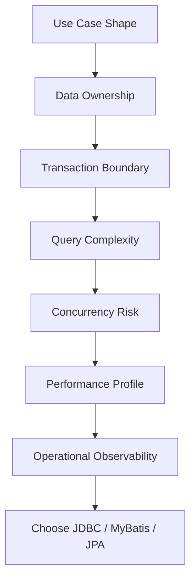
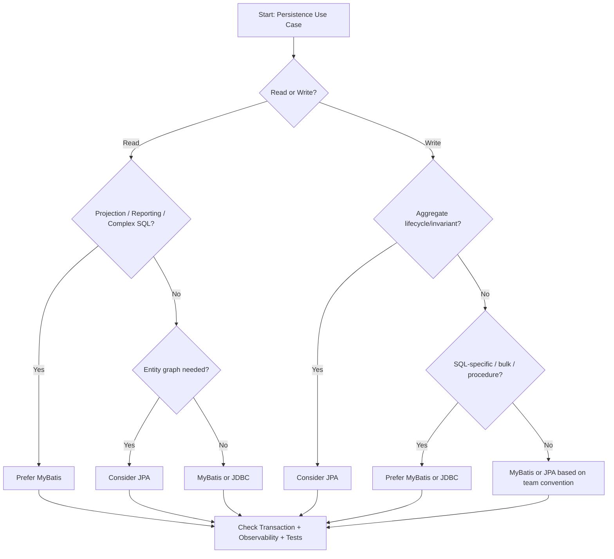

# Part 018 — JDBC vs MyBatis vs JPA Decision Framework

Pemilihan JDBC, MyBatis, atau JPA/Hibernate bukan soal selera.

Ini adalah architecture decision.

Decision yang buruk akan muncul sebagai:

- query yang sulit di-debug,
- transaction boundary yang tidak jelas,
- N+1 yang baru terlihat di production,
- dynamic SQL yang terlalu liar,
- duplicate mapping,
- stale persistence context,
- migration yang mematahkan mapper/entity,
- batch job yang lambat atau OOM,
- correctness bug akibat write path ganda,
- PR review yang berubah menjadi debat opini.

Decision yang baik bisa dijelaskan dengan kalimat seperti:

> Use case ini memakai MyBatis karena primary problem-nya adalah read projection dengan SQL PostgreSQL-specific, bukan aggregate lifecycle.

Atau:

> Use case ini memakai JPA karena write path berpusat pada aggregate lifecycle, optimistic locking, dan domain invariant yang cocok ditempatkan di entity/domain method.

Atau:

> Use case ini memakai JDBC langsung karena operation-nya low-level streaming/batch dan framework abstraction tidak memberi value.

Part ini memberi decision framework praktis untuk senior Java/JAX-RS backend engineer.

---

## 1. First Principle: Start from Use Case Shape

Jangan mulai dari framework.

Mulai dari bentuk use case.

Tanyakan:

- Apakah ini read path atau write path?
- Apakah butuh aggregate lifecycle?
- Apakah query kompleks?
- Apakah result berupa entity atau projection?
- Apakah butuh PostgreSQL-specific feature?
- Apakah volume data besar?
- Apakah operation batch/streaming?
- Apakah schema legacy atau ORM-friendly?
- Apakah transaction boundary sederhana atau kompleks?
- Apakah ada concurrency/locking requirement?
- Apakah perlu audit/outbox/idempotency?
- Apakah perlu high observability?

Framework hanya alat untuk menjalankan shape tersebut.



---

## 2. The Three Mental Models

### JDBC

```text
JDBC = low-level database access primitive
```

Anda mengelola:

- connection,
- statement,
- parameter binding,
- result set,
- transaction/autocommit,
- resource closing,
- exception handling,
- fetch size,
- batch,
- generated keys.

JDBC memberi kontrol paling eksplisit.

Tetapi juga memberi boilerplate paling besar.

### MyBatis

```text
MyBatis = SQL-first mapper
```

Anda menulis SQL.

MyBatis membantu:

- mapper interface,
- XML/annotation SQL binding,
- parameter mapping,
- result mapping,
- TypeHandler,
- dynamic SQL,
- SqlSession integration,
- reduced JDBC boilerplate.

MyBatis cocok ketika SQL adalah desain utama.

### JPA/Hibernate

```text
JPA/Hibernate = entity-first persistence context / unit-of-work
```

Anda memodelkan entity dan lifecycle.

Provider membantu:

- entity mapping,
- persistence context,
- dirty checking,
- flush,
- relationship mapping,
- optimistic locking,
- JPQL/Criteria/native query,
- caching,
- transactional write-behind.

JPA cocok ketika lifecycle entity dan aggregate consistency adalah desain utama.

---

## 3. Decision Axis

Gunakan axis berikut.

| Axis | JDBC | MyBatis | JPA/Hibernate |
| --- | --- | --- | --- |
| SQL control | Maximum | High | Medium/variable |
| Boilerplate | High | Medium | Low-medium |
| Entity lifecycle | Manual | Manual | Built-in |
| Query visibility | Maximum | High | Must inspect generated SQL |
| Complex SQL | Strong | Strong | Possible, less natural |
| CRUD aggregate | Manual | Explicit | Strong |
| Relationship graph | Manual | Explicit mapping | Built-in but risky |
| Batch/streaming | Strong | Strong | Needs discipline |
| PostgreSQL-specific feature | Strong | Strong | Usually native query |
| Dynamic search | Manual | Strong | Criteria/specification, can get complex |
| Operational debugging | SQL/resource-centric | SQL/mapper-centric | SQL + lifecycle + flush-centric |

Tidak ada baris yang otomatis menentukan jawaban.

Tetapi axis ini membantu menghindari debat yang terlalu abstrak.

---

## 4. When to Use JDBC Directly

Gunakan JDBC langsung ketika Anda benar-benar butuh kontrol low-level atau ketika framework tidak memberi value cukup.

### Good JDBC candidates

- health check database sederhana,
- migration utility internal,
- low-level streaming result besar,
- custom batch loader sangat performance-sensitive,
- database metadata inspection,
- one-off infrastructure operation,
- integration dengan function/procedure yang sangat spesifik,
- library internal yang memang menjadi primitive bagi framework lain,
- operation yang tidak layak dibuat mapper/entity model.

### Example: streaming export low-level

```java
try (Connection connection = dataSource.getConnection()) {
    connection.setAutoCommit(false);

    try (PreparedStatement ps = connection.prepareStatement("""
        SELECT id, quote_number, status, created_at
        FROM quote
        WHERE tenant_id = ?
        ORDER BY created_at
        """)) {

        ps.setFetchSize(1_000);
        ps.setObject(1, tenantId);

        try (ResultSet rs = ps.executeQuery()) {
            while (rs.next()) {
                writer.writeRow(mapRow(rs));
            }
        }
    }
}
```

Kenapa JDBC?

- fetch size ingin dikontrol eksplisit,
- resource lifetime terlihat,
- connection held open disadari,
- tidak butuh entity lifecycle,
- mapping bisa dibuat khusus untuk export.

### JDBC trade-off

Kelebihan:

- kontrol penuh,
- dependency minimal,
- behavior eksplisit,
- cocok untuk primitive/utility.

Kekurangan:

- boilerplate tinggi,
- raw mapping manual,
- mudah lupa close resource,
- exception translation manual,
- consistency convention manual,
- test dan review harus lebih ketat.

### Avoid JDBC when

- operasi menjadi banyak dan berulang,
- mapper abstraction akan mengurangi duplicate boilerplate,
- query butuh ResultMap yang kompleks,
- domain lifecycle butuh entity model,
- team akan kesulitan maintain raw JDBC tersebar.

JDBC langsung sebaiknya exception, bukan default untuk application repository besar.

---

## 5. When to Use MyBatis

Gunakan MyBatis ketika SQL adalah first-class artifact dari use case.

### Strong MyBatis candidates

- complex search query,
- reporting/dashboard query,
- read model projection,
- PostgreSQL JSONB query,
- CTE/window function,
- `INSERT ... ON CONFLICT ... RETURNING`,
- worker polling dengan `FOR UPDATE SKIP LOCKED`,
- stored procedure/function call,
- legacy schema,
- dynamic filtering/sorting,
- batch update/import,
- cross-table projection yang tidak perlu entity managed,
- performance-critical query yang perlu SQL review eksplisit.

### Example: query repository

```java
public interface QuoteSearchMapper {
    List<QuoteSearchRow> searchQuotes(QuoteSearchQuery query);
}
```

```xml
<select id="searchQuotes" resultMap="QuoteSearchRowMap">
  SELECT
      q.id,
      q.quote_number,
      q.status,
      q.total_amount,
      c.name AS customer_name,
      q.created_at
  FROM quote q
  JOIN customer c ON c.id = q.customer_id
  WHERE q.tenant_id = #{tenantId}
    AND q.deleted_at IS NULL
    <if test="status != null">
      AND q.status = #{status}
    </if>
    <if test="customerName != null">
      AND c.name ILIKE '%' || #{customerName} || '%'
    </if>
  ORDER BY q.created_at DESC, q.id DESC
  LIMIT #{limit}
</select>
```

Kenapa MyBatis?

- query shape penting,
- projection bukan entity lifecycle,
- join dan filter perlu visible,
- index review mudah,
- PostgreSQL syntax bisa dipakai langsung,
- mapper method bisa diobservasi.

### MyBatis trade-off

Kelebihan:

- SQL terlihat,
- mapping eksplisit,
- cocok untuk PostgreSQL-specific feature,
- query performance lebih mudah didiagnosis,
- DTO projection natural,
- batch/query customization kuat.

Kekurangan:

- invariant manual,
- audit/version/tenant/soft delete convention manual,
- dynamic SQL bisa kompleks,
- duplicate SQL bisa menyebar,
- ResultMap bisa drift,
- nested select bisa N+1,
- tidak ada automatic entity lifecycle.

### Avoid MyBatis when

- use case sangat entity lifecycle driven,
- aggregate behavior lebih penting daripada SQL projection,
- relationship update/cascade ingin dikelola konsisten,
- team akan menduplikasi business invariant di banyak SQL,
- write path perlu unit-of-work object graph yang natural.

---

## 6. When to Use JPA/Hibernate

Gunakan JPA/Hibernate ketika entity lifecycle, unit-of-work, dan aggregate consistency memberi value nyata.

### Strong JPA candidates

- CRUD aggregate sederhana-menengah,
- aggregate lifecycle dengan domain method,
- optimistic locking via `@Version`,
- relationship yang terkontrol,
- transactional update beberapa entity dalam satu unit-of-work,
- audit/listener/converter yang konsisten,
- object graph mutation yang natural,
- repository command path yang tidak terlalu SQL-specific.

### Example: aggregate lifecycle

```java
@Transactional
public void approveQuote(UUID quoteId, long expectedVersion, UserId actor) {
    QuoteEntity quote = quoteRepository.findRequired(quoteId);

    quote.assertVersion(expectedVersion);
    quote.approve(actor);

    outboxRepository.add(QuoteApprovedEvent.from(quote));
}
```

Entity:

```java
@Entity
@Table(name = "quote")
public class QuoteEntity {
    @Id
    private UUID id;

    @Version
    private long version;

    @Enumerated(EnumType.STRING)
    private QuoteStatus status;

    public void approve(UserId actor) {
        if (status != QuoteStatus.PENDING_APPROVAL) {
            throw new InvalidQuoteTransitionException(status, QuoteStatus.APPROVED);
        }
        this.status = QuoteStatus.APPROVED;
        this.updatedBy = actor.value();
        this.updatedAt = Instant.now();
    }
}
```

Kenapa JPA?

- invariant dekat entity,
- versioning built-in,
- dirty checking mengurangi explicit update boilerplate,
- aggregate lifecycle jelas,
- transaction menjadi unit-of-work.

### JPA trade-off

Kelebihan:

- entity lifecycle built-in,
- dirty checking,
- optimistic locking mudah,
- relationship mapping,
- JPQL abstraction,
- reusable domain behavior,
- first-level cache.

Kekurangan:

- generated SQL harus diinspeksi,
- flush timing bisa mengejutkan,
- lazy loading bisa N+1,
- cascade bisa berbahaya,
- persistence context bisa stale/besar,
- native/bulk query bisa bypass lifecycle,
- debugging butuh pemahaman provider.

### Avoid JPA when

- use case hanya projection/read model,
- query sangat SQL/PostgreSQL-specific,
- schema legacy sulit dipetakan sebagai entity,
- batch sangat besar dan lifecycle entity tidak penting,
- relationship loading sulit dikontrol,
- generated SQL menjadi liability,
- team belum punya observability/test untuk Hibernate behavior.

---

## 7. Decision Matrix by Use Case

| Use case | Preferred default | Why |
| --- | --- | --- |
| Simple CRUD aggregate | JPA | Entity lifecycle, dirty checking, optimistic lock |
| Complex reporting query | MyBatis | SQL visibility, projection, index-aware tuning |
| Batch import large volume | MyBatis/JDBC | Explicit batch/chunk control |
| Stored procedure integration | MyBatis/JDBC | Callable SQL visibility |
| JSONB-heavy query | MyBatis | PostgreSQL operator support and explicit SQL |
| Dynamic search API | MyBatis | Dynamic SQL/projection control |
| Relationship-heavy mutable domain | JPA | Entity graph/lifecycle can help, but requires discipline |
| Legacy schema | MyBatis | Avoid forced ORM mapping |
| Performance-critical read path | MyBatis/JDBC | Explicit SQL and plan control |
| Audit-heavy aggregate write | JPA or MyBatis | Depends where audit/invariant is centralized |
| Outbox polling | MyBatis/JDBC | `SKIP LOCKED`, explicit transaction SQL |
| Read model path | MyBatis | Projection-first |
| Minimal low-level utility | JDBC | Avoid unnecessary abstraction |

Default bukan hukum.

Setiap keputusan tetap harus melewati transaction, correctness, performance, observability, dan migration review.

---

## 8. CRUD-Heavy Use Case

CRUD-heavy sering dianggap otomatis JPA.

Biasanya benar, tetapi tidak selalu.

### JPA is good when

- table mapping stabil,
- relationship tidak terlalu liar,
- update mengikuti lifecycle entity,
- optimistic lock dibutuhkan,
- domain method bisa menjaga invariant,
- generated SQL sederhana.

### MyBatis is good when

- CRUD sebenarnya adalah command SQL dengan status transition ketat,
- schema tidak ORM-friendly,
- update harus minimal dan explicit,
- ada tenant/soft delete/effective date logic yang lebih aman di SQL eksplisit,
- team ingin setiap SQL terlihat.

### Review question

> Apakah operasi CRUD ini benar-benar lifecycle entity, atau hanya thin SQL command?

Jika CRUD hanya `insert/update/select` tanpa behavior, JPA bisa menjadi overhead.

Jika CRUD membawa invariant dan concurrency, JPA bisa memberi value.

---

## 9. Complex SQL Use Case

Complex SQL termasuk:

- multi-join,
- CTE,
- window function,
- aggregation,
- lateral join,
- JSONB operator,
- full-text search,
- dynamic filters,
- custom sorting,
- query hint/index-aware pattern,
- database-specific lock clause.

MyBatis biasanya lebih tepat.

JPA native query bisa dipakai, tetapi jika sebagian besar query adalah native query, tanyakan:

> Value apa yang masih diberikan JPA di use case ini?

Jika jawabannya hanya “karena repository sudah JPA”, itu alasan lemah.

Native query JPA juga harus memperhatikan:

- result mapping,
- persistence context stale state,
- flush before query,
- entity vs DTO projection,
- cache bypass/invalidation.

---

## 10. Reporting Use Case

Reporting query biasanya read-only, projection-heavy, dan SQL-optimized.

Contoh:

- quote aging report,
- order conversion funnel,
- failed order count by reason,
- revenue by product family,
- workflow SLA dashboard,
- backlog by assignee/status.

MyBatis cocok karena:

- DTO projection natural,
- SQL aggregation visible,
- index dan materialized view discussion lebih mudah,
- tidak perlu entity managed,
- bisa memakai CTE/window function.

JPA entity loading untuk reporting sering wasteful.

Rule:

> Jangan load aggregate penuh hanya untuk mengisi table dashboard.

---

## 11. Batch Use Case

Batch use case harus dievaluasi dari volume dan lifecycle.

Pertanyaan utama:

- Berapa row?
- Apakah perlu entity listener?
- Apakah perlu validation domain?
- Apakah perlu generated ID?
- Apakah perlu retry per chunk?
- Apakah operation idempotent?
- Apakah lock impact besar?
- Apakah transaction terlalu panjang?

### MyBatis/JDBC fit

- volume besar,
- SQL sederhana atau explicit,
- chunking manual,
- retry manual,
- lifecycle entity tidak penting.

### JPA fit

- volume sedang,
- lifecycle entity penting,
- audit/listener penting,
- mapping entity memberi value,
- flush/clear discipline diterapkan.

JPA batch tanpa `flush()`/`clear()` bisa membuat persistence context tumbuh besar.

---

## 12. JSONB-Heavy Use Case

PostgreSQL JSONB sering dipakai untuk flexible attributes, product/catalog metadata, rule payload, integration payload, atau semi-structured configuration.

Jika query sering memakai:

```sql
payload ->> 'productFamily'
payload @> '{"channel":"B2B"}'
jsonb_path_query
GIN index
```

MyBatis lebih natural.

JPA bisa memakai AttributeConverter untuk menyimpan JSONB sebagai object.

Tetapi querying JSONB secara kaya sering jatuh ke native query.

Decision rule:

- Jika JSONB hanya disimpan/dibaca sebagai blob: JPA converter bisa cukup.
- Jika JSONB adalah query dimension utama: MyBatis biasanya lebih cocok.
- Jika JSONB butuh index/operator tuning: SQL visibility penting.

---

## 13. Stored Procedure / Function Use Case

Jika sistem banyak memakai PostgreSQL function/procedure/trigger:

- MyBatis dan JDBC lebih eksplisit,
- JPA stored procedure query bisa dipakai tetapi kurang natural untuk logic DB-heavy,
- ownership database logic harus jelas,
- migration/versioning procedure harus kuat,
- error mapping harus diuji.

Pertanyaan review:

- Business rule ini sengaja di database atau historical artifact?
- Bagaimana procedure dimigration?
- Bagaimana test-nya?
- Bagaimana error code dipetakan?
- Apakah side effect trigger diketahui aplikasi?
- Apakah transaction boundary jelas?

---

## 14. Relationship-Heavy Domain Use Case

JPA sering dipilih untuk relationship-heavy domain.

Namun relationship-heavy bukan otomatis JPA.

Tanyakan:

- Apakah relationship benar-benar perlu dimutasi sebagai object graph?
- Atau hanya perlu dibaca sebagai projection?
- Apakah cascade aman?
- Apakah aggregate boundary jelas?
- Apakah lazy loading bisa dikontrol?
- Apakah query count diuji?

JPA cocok untuk relationship lifecycle.

MyBatis cocok untuk relationship projection.

Perbedaan besar:

```text
Mutable aggregate graph -> JPA candidate
Read-only joined view   -> MyBatis candidate
```

---

## 15. High-Performance Write Path

High-performance write path perlu hati-hati.

Contoh:

- event ingestion,
- audit append,
- outbox insert,
- high-volume status update,
- bulk price update,
- worker state transition.

MyBatis/JDBC sering lebih cocok jika:

- SQL update harus minimal,
- `INSERT ... ON CONFLICT` dibutuhkan,
- `RETURNING` dibutuhkan,
- batching penting,
- lifecycle entity tidak penting,
- write path harus mudah di-benchmark.

JPA cocok jika:

- write path adalah aggregate lifecycle,
- invariant domain penting,
- optimistic locking built-in berguna,
- volume tidak membuat dirty checking menjadi bottleneck,
- SQL generated sudah diverifikasi.

Review question:

> Apakah bottleneck write path ada di database round trip, lock contention, flush behavior, batch size, atau business validation?

Framework choice harus mengikuti bottleneck.

---

## 16. Legacy Schema

Legacy schema sering tidak cocok dengan ORM karena:

- composite key kompleks,
- naming tidak konsisten,
- nullable aneh,
- trigger side effects,
- denormalized fields,
- no clean aggregate boundary,
- stored procedure heavy,
- table dipakai banyak aplikasi,
- constraint tidak lengkap.

MyBatis sering lebih aman karena mapping eksplisit.

JPA masih bisa dipakai, tetapi biaya mapping dan behavior surprise bisa tinggi.

Rule:

> Jangan memaksa schema non-ORM-friendly menjadi JPA entity graph besar hanya demi terlihat object-oriented.

---

## 17. Transaction Boundary Decision

Framework choice harus dievaluasi bersama transaction boundary.

### Questions

- Siapa membuka transaction?
- Apakah mapper/entity manager berbagi transaction manager?
- Apakah external call terjadi dalam transaction?
- Apakah event publication atomic dengan DB write?
- Apakah retry aman?
- Apakah isolation cukup?
- Apakah lock duration wajar?
- Apakah JPA flush timing diketahui?
- Apakah MyBatis membaca perubahan JPA pending?

Jika transaction boundary kompleks, simplicity framework menjadi penting.

Kadang explicit SQL MyBatis lebih mudah dibuktikan.

Kadang JPA unit-of-work lebih aman karena semua entity mutation berada dalam satu context.

Tetapi mencampur keduanya tanpa aturan adalah red flag.

---

## 18. Microservices and Event-Driven Decision

Dalam microservices/event-driven architecture, persistence choice juga dipengaruhi oleh data ownership.

### Outbox

Transactional outbox sering lebih SQL-centric:

- insert business row,
- insert outbox row,
- commit,
- publisher polling with `SKIP LOCKED`,
- publish to Kafka/RabbitMQ,
- mark as published.

Business aggregate write bisa JPA.

Outbox polling bisa MyBatis/JDBC.

Ini coexistence yang masuk akal jika boundary jelas.

### Read model

Read model/projection dari event biasanya query-first.

MyBatis cocok untuk:

- rebuild projection,
- query optimized table,
- dashboard endpoint,
- event replay validation.

JPA cocok jika projection sebenarnya entity lifecycle lokal.

### Saga/compensation

Saga state bisa JPA atau MyBatis.

Decision tergantung:

- state machine complexity,
- query pattern,
- lock/retry semantics,
- integration with Camunda/job executor,
- need for explicit SQL locking.

---

## 19. Kubernetes/Cloud Runtime Decision

Framework choice juga punya runtime consequence di Kubernetes/cloud/on-prem.

### JDBC/MyBatis

- query execution explicit,
- connection use usually bounded by mapper call,
- streaming/cursor bisa hold connection lama,
- batch job bisa connection-heavy,
- dynamic SQL bisa menghasilkan plan variability.

### JPA/Hibernate

- transaction panjang bisa hold persistence context dan connection,
- lazy loading bisa terjadi di unexpected place,
- flush bisa terjadi before query,
- batch config memengaruhi round trip,
- second-level cache perlu cluster/cache strategy,
- startup entity validation bisa memengaruhi deployment.

Runtime questions:

- Berapa pool size per pod?
- Berapa replica?
- Apakah endpoint streaming menahan connection?
- Apakah transaction terlalu panjang?
- Apakah migration job berjalan di deployment?
- Apakah generated SQL stabil setelah rollout?
- Apakah cloud DB memiliki connection/timeout limit?

---

## 20. Decision Flow

Gunakan flow berikut.



Flow ini memaksa pertanyaan yang benar sebelum memilih framework.

---

## 21. Example Decision: Quote Search Endpoint

### Context

JAX-RS endpoint:

```http
GET /quotes?status=PENDING&customer=acme&from=2026-01-01&sort=createdAt.desc
```

Requirement:

- tenant-aware,
- soft delete excluded,
- filter optional,
- dynamic sort whitelist,
- paginated,
- projection response,
- no mutation,
- high traffic,
- index-sensitive.

### Decision

Prefer MyBatis.

### Why

- SQL shape is central.
- Projection is enough.
- JPA entity lifecycle adds little value.
- Generated SQL opacity is a liability.
- Query plan/index review is important.

### Review evidence

- SQL attached in PR.
- Sort whitelist visible.
- Pagination stable.
- Index proposal included.
- Integration test with PostgreSQL.
- Query count and duration observable.

---

## 22. Example Decision: Quote Approval Command

### Context

JAX-RS endpoint:

```http
POST /quotes/{id}/approve
```

Requirement:

- status transition,
- version check,
- audit fields,
- domain invariant,
- outbox event,
- rollback all if failed,
- concurrency safe.

### Option A: JPA

Good when:

- `QuoteEntity.approve()` centralizes invariant,
- `@Version` is used,
- outbox entity is persisted in same transaction,
- generated SQL is verified,
- no MyBatis writes same quote row in same transaction.

### Option B: MyBatis

Good when:

- transition is expressed as conditional SQL,
- manual version check in `WHERE`,
- `UPDATE ... RETURNING` used,
- status machine is SQL-driven,
- audit/outbox insert explicit.

### Decision rule

Both can be correct.

The anti-pattern is using both for the same status transition without a clear reason.

---

## 23. Example Decision: Outbox Publisher Polling

### Context

Job polls pending events:

```sql
SELECT id
FROM outbox_event
WHERE status = 'PENDING'
ORDER BY created_at
FOR UPDATE SKIP LOCKED
LIMIT ?
```

### Decision

Prefer MyBatis or JDBC.

### Why

- SQL lock semantics are the main behavior.
- Projection is small.
- JPA entity lifecycle adds little value.
- `SKIP LOCKED` must be visible and reviewed.
- Worker concurrency depends on SQL correctness.

### Review evidence

- Locking SQL visible.
- Transaction boundary documented.
- Retry and timeout behavior tested.
- Metrics for claimed/published/failed events.
- Dead letter/reconciliation path exists.

---

## 24. Example Decision: Catalog Effective Dating

### Context

Catalog price lookup requires:

- tenant,
- product offering,
- channel,
- valid-from/valid-to,
- catalog version,
- JSONB attributes,
- fallback rule.

### Decision

Likely MyBatis for lookup query.

JPA may still be used for catalog management CRUD if lifecycle matters.

### Why

- Read path is SQL/filter heavy.
- Effective dating bug risk is high.
- JSONB and index usage must be visible.
- Projection can be optimized.

### Coexistence rule

It is acceptable to use:

```text
JPA  -> catalog admin lifecycle
MyBatis -> catalog lookup projection
```

Only if ownership and cache invalidation are clear.

---

## 25. Example Decision: Migration Utility

### Context

Internal one-off job migrates data from old schema to new schema.

Requirement:

- read large result,
- transform rows,
- batch insert,
- checkpoint,
- retry from checkpoint,
- resource control.

### Decision

Prefer JDBC or MyBatis.

### Why

- streaming and batching are core,
- entity lifecycle probably not needed,
- memory and transaction chunking must be explicit,
- job may need custom retry/checkpoint.

JPA can work only with strict flush/clear and batch config, but often adds unnecessary lifecycle cost.

---

## 26. Decision Smells

### Smell: JPA repository with complex native SQL everywhere

Potential issue:

- JPA is being used as a SQL transport,
- persistence context can still create stale/flush surprises,
- MyBatis may be a better fit.

### Smell: MyBatis mapper implementing aggregate lifecycle in many SQL snippets

Potential issue:

- business invariant duplicated,
- status transition scattered,
- audit/version inconsistent,
- JPA/domain model may be better if lifecycle is central.

### Smell: raw JDBC inside application service

Potential issue:

- transaction integration unclear,
- resource handling duplicated,
- exception mapping inconsistent,
- mapper/repository abstraction may be needed.

### Smell: MyBatis and JPA write same table

Potential issue:

- stale persistence context,
- duplicate audit/version logic,
- cache conflict,
- hidden overwrite.

This requires explicit architecture justification.

---

## 27. Decision Record Template

Untuk persistence decision penting, buat mini ADR.

```md
# ADR: Persistence Strategy for <Use Case>

## Context
- Service/module:
- Endpoint/job:
- Tables involved:
- Read/write path:
- Transaction boundary:
- Volume/performance expectation:
- Concurrency requirement:

## Options
1. JDBC
2. MyBatis
3. JPA/Hibernate
4. Mixed approach

## Decision
Chosen option:

## Rationale
- Query complexity:
- Entity lifecycle need:
- PostgreSQL-specific feature:
- Transaction correctness:
- Performance/observability:
- Testing strategy:

## Risks
- Correctness:
- Performance:
- Migration:
- Security/privacy:
- Operational:

## Guardrails
- PR checklist:
- Tests required:
- Metrics/logs required:
- Internal verification:
```

ADR tidak perlu panjang.

Yang penting decision tidak hilang menjadi tribal knowledge.

---

## 28. PR Review Checklist

### Framework choice

- Kenapa JDBC/MyBatis/JPA dipilih?
- Apa alternatifnya?
- Apakah use case shape mendukung pilihan ini?
- Apakah keputusan mengikuti convention internal?
- Apakah ada ADR jika impact besar?

### SQL visibility

- Jika MyBatis/JDBC: SQL terlihat dan reviewable?
- Jika JPA: generated SQL dilampirkan/dibuktikan?
- Apakah query plan dicek untuk path penting?
- Apakah parameter logging aman?

### Transaction

- Di mana transaction boundary?
- Apakah rollback behavior jelas?
- Apakah flush timing JPA relevan?
- Apakah MyBatis/JPA dicampur?
- Apakah lock/retry behavior jelas?

### Data correctness

- Apakah invariant dijaga?
- Apakah version/optimistic locking ada jika perlu?
- Apakah tenant/soft delete/effective date filter konsisten?
- Apakah audit/timestamp konsisten?
- Apakah database constraint mendukung invariant?

### Performance

- Apakah ada N+1 risk?
- Apakah pagination stabil?
- Apakah batch/fetch size sesuai?
- Apakah index tersedia?
- Apakah connection pool impact dipahami?

### Testing

- Apakah test memakai PostgreSQL nyata/Testcontainers untuk SQL penting?
- Apakah migration test ada?
- Apakah concurrency test diperlukan?
- Apakah query regression/performance test diperlukan?
- Apakah SQL injection guard test ada untuk dynamic SQL?

---

## 29. Internal Verification Checklist

Gunakan checklist ini sebelum menerapkan decision framework ke codebase internal.

### Repository and package structure

- Verifikasi package repository/DAO/mapper/entity.
- Verifikasi apakah repository memisahkan command dan query.
- Verifikasi apakah mapper XML punya naming convention.
- Verifikasi apakah entity package punya boundary jelas.
- Verifikasi apakah raw JDBC usage dikontrol.

### Framework usage

- Verifikasi area yang memakai JDBC langsung.
- Verifikasi area yang memakai MyBatis.
- Verifikasi area yang memakai JPA/Hibernate.
- Verifikasi apakah ada table yang diakses oleh MyBatis dan JPA sekaligus.
- Verifikasi apakah ada guideline pemilihan framework.

### Transaction and datasource

- Verifikasi transaction manager yang dipakai.
- Verifikasi apakah MyBatis dan JPA berbagi datasource/transaction.
- Verifikasi pool config.
- Verifikasi isolation/timeout default.
- Verifikasi retry policy untuk deadlock/serialization.

### Migration and schema

- Verifikasi migration tool.
- Verifikasi migration repository.
- Verifikasi apakah mapper/entity divalidasi terhadap migration.
- Verifikasi expand-contract convention.
- Verifikasi rollback/roll-forward policy.

### Observability

- Verifikasi SQL logging MyBatis.
- Verifikasi generated SQL logging Hibernate.
- Verifikasi slow query dashboard.
- Verifikasi pool metrics.
- Verifikasi query count/transaction duration metrics.
- Verifikasi redaction policy.

### Team discussion

Tanyakan:

- Kapan internal team memilih MyBatis?
- Kapan memilih JPA?
- Apakah JDBC langsung diperbolehkan?
- Apakah ada incident karena wrong framework choice?
- Apakah ada table ownership rules?
- Apakah ada anti-pattern yang disepakati?
- Siapa reviewer untuk migration/index/query performance?

---

## 30. Common Bad Decisions and Better Alternatives

| Bad decision | Why risky | Better alternative |
| --- | --- | --- |
| JPA entity loaded for dashboard table | Over-fetching, N+1, managed state not needed | MyBatis DTO projection |
| MyBatis update duplicates JPA entity lifecycle | Duplicate invariant/audit/version | Centralize write model |
| Raw JDBC scattered in services | Resource/transaction inconsistency | Wrap in repository/utility |
| Native query JPA mutates table of managed entity | Stale persistence context | Flush/clear or use one write model |
| Dynamic SQL sort uses raw input | SQL injection | Whitelist column mapping |
| JPA relationship set eager globally | Over-fetching everywhere | Lazy + fetch join/entity graph per use case |
| Batch JPA without flush/clear | Memory growth | Chunked flush/clear or MyBatis/JDBC batch |
| MyBatis mapper missing tenant filter | Data leakage | Central query convention/test |

---

## 31. How to Explain a Good Decision in Review

A good PR explanation sounds like this:

```text
This endpoint uses MyBatis because it is a read-only search projection with dynamic filters, tenant and soft-delete constraints, and index-sensitive sorting. We do not need entity lifecycle. The SQL is included in the mapper XML, covered by PostgreSQL integration tests, and the proposed index supports tenant_id/status/created_at ordering.
```

Or:

```text
This command uses JPA because the approval flow is an aggregate lifecycle transition. The invariant is enforced by QuoteEntity.approve(), optimistic locking is handled through @Version, and the outbox event is persisted in the same transaction. Generated SQL is verified in integration tests and no MyBatis mapper writes the quote table in this use case.
```

Or:

```text
This job uses JDBC because it streams a large result set and writes in explicit chunks. We need direct control over fetch size, transaction chunking, and resource closing. The job is isolated in an infrastructure package, with integration tests against PostgreSQL.
```

Bad explanation:

```text
We use JPA because it is easier.
```

Or:

```text
We use MyBatis because JPA is slow.
```

Those are opinions without evidence.

---

## 32. Decision Framework Summary

Use this compressed rule:

```text
JDBC    -> low-level control, streaming, infrastructure, special-case batch/utility.
MyBatis -> SQL-first, projection, complex query, PostgreSQL-specific feature, reporting, explicit batch.
JPA     -> entity-first, aggregate lifecycle, unit-of-work, optimistic locking, controlled relationship model.
```

Then validate with:

- transaction correctness,
- data ownership,
- schema compatibility,
- query visibility,
- concurrency behavior,
- performance profile,
- migration impact,
- testing strategy,
- observability,
- security/privacy.

Framework choice is only good if it remains debuggable at 3 AM during production incident.

---

## 33. Final Checklist Before Choosing

Before choosing JDBC, MyBatis, or JPA, answer:

1. What is the primary use case shape?
2. Is this read, write, batch, stream, report, or worker polling?
3. Is entity lifecycle actually needed?
4. Is SQL complexity central?
5. Is PostgreSQL-specific feature central?
6. What is the transaction boundary?
7. What invariant must be protected?
8. What concurrency failure can happen?
9. What data volume is expected?
10. What query/index evidence exists?
11. What migration risk exists?
12. How will this be tested?
13. How will this be observed in production?
14. Could MyBatis and JPA touch the same table/use case?
15. What internal convention must be verified?

If these questions cannot be answered, the framework decision is premature.

---

## 34. Summary

JDBC, MyBatis, and JPA/Hibernate occupy different layers of abstraction.

JDBC gives direct control over database primitives.

MyBatis gives SQL-first mapping with reduced JDBC boilerplate.

JPA/Hibernate gives entity-first unit-of-work with persistence context behavior.

A senior engineer does not choose based on habit.

A senior engineer chooses based on:

- use case shape,
- transaction boundary,
- correctness invariant,
- query complexity,
- runtime behavior,
- production debugging,
- migration safety,
- testing evidence,
- team ownership.

The next part will focus on a sharper problem: how MyBatis and JPA can coexist in the same system, when that is healthy, and when it becomes a source of duplicate mapping, stale state, cache conflict, and transaction surprise.
