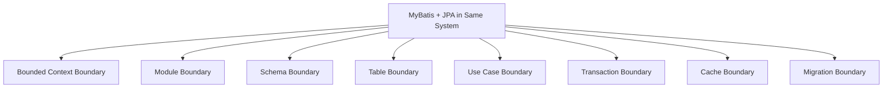
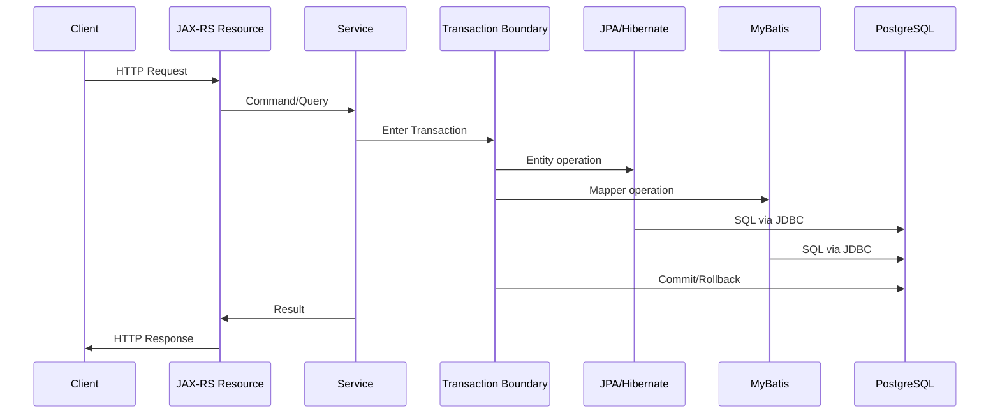

# Part 019 — Using MyBatis and JPA in the Same System

MyBatis dan JPA boleh hidup dalam sistem yang sama.

Yang berbahaya bukan keberadaan dua framework.

Yang berbahaya adalah ketika dua framework itu menjadi dua model kebenaran untuk data yang sama.

Dalam enterprise Java/JAX-RS service, coexistence MyBatis dan JPA sering muncul karena alasan yang masuk akal:

- sebagian domain cocok dengan entity lifecycle JPA,
- sebagian query butuh SQL eksplisit PostgreSQL,
- sebagian schema legacy tidak nyaman dimodelkan sebagai ORM,
- sebagian read model/reporting lebih tepat sebagai projection,
- sebagian write path butuh aggregate lifecycle dan optimistic locking,
- sebagian endpoint butuh dynamic filtering yang lebih mudah dikontrol lewat SQL,
- sebagian migrasi framework terjadi bertahap,
- sebagian module berasal dari sejarah codebase yang berbeda.

Masalahnya: alasan historis tidak otomatis menjadi architecture yang sehat.

Part ini membahas bagaimana menilai coexistence MyBatis + JPA secara senior-engineer level: boundary, ownership, transaction, datasource, cache, schema, PR review, dan production failure mode.

---

## 1. Core Thesis

```text
MyBatis + JPA is acceptable when they have clear ownership boundaries.
MyBatis + JPA is dangerous when they compete over the same persistence state.
```

Coexistence sehat berarti:

- siapa membaca apa jelas,
- siapa menulis apa jelas,
- siapa pemilik table/aggregate jelas,
- transaction boundary jelas,
- cache behavior jelas,
- flush behavior dipahami,
- migration impact bisa diprediksi,
- testing membuktikan ordering dan consistency,
- PR reviewer bisa menjawab “framework ini dipakai untuk apa?”.

Coexistence buruk berarti:

- entity JPA dan mapper MyBatis menulis table yang sama tanpa aturan,
- repository berbeda mengubah aggregate yang sama,
- MyBatis update melewati dirty checking JPA,
- JPA persistence context menyimpan state stale setelah mapper update,
- second-level cache menyimpan data yang sudah berubah di luar Hibernate,
- audit/version/soft delete/tenant filter diimplementasikan dua kali secara tidak konsisten,
- transaction boundary terlihat sama di code tetapi runtime behavior berbeda.

---

## 2. Coexistence vs Mixing

Jangan samakan coexistence dengan mixing.

### Coexistence

Coexistence berarti dua framework ada dalam sistem yang sama, tetapi dipisahkan oleh boundary yang jelas.

Contoh:

```text
Module quote-command   -> JPA for aggregate lifecycle
Module quote-reporting -> MyBatis for read-only projection
```

Atau:

```text
Catalog reference read model -> MyBatis
Order aggregate write model  -> JPA
```

### Mixing

Mixing berarti dua framework dipakai dalam alur data yang sama tanpa aturan yang tegas.

Contoh:

```text
Service method:
1. Load QuoteEntity with JPA
2. Modify entity field
3. Run MyBatis update on quote table
4. Query QuoteEntity again
5. Return response
```

Ini bukan sekadar variasi implementation.

Ini adalah dua persistence model yang saling mengganggu.

---

## 3. Boundary Dimensions

Saat menemukan MyBatis dan JPA dalam sistem yang sama, jangan langsung bertanya “boleh atau tidak?”.

Tanyakan boundary-nya.



Boundary yang paling aman biasanya berada di level:

1. bounded context,
2. module,
3. schema,
4. table,
5. use case,
6. method call.

Semakin rendah boundary-nya, semakin tinggi risikonya.

Boundary di level method call biasanya paling rawan.

---

## 4. Bounded Context Separation

Pemisahan paling sehat adalah bounded context.

Contoh konseptual:

```text
Quote Management Context
- JPA entities
- aggregate lifecycle
- optimistic locking
- domain invariant

Reporting/Search Context
- MyBatis mappers
- projection DTO
- complex SQL
- read-only access
```

Dalam model ini, MyBatis dan JPA tidak memperebutkan ownership data yang sama sebagai write model.

JPA mungkin memiliki aggregate lifecycle, sedangkan MyBatis hanya membangun projection atau query view.

### Why It Works

Karena setiap context punya tujuan berbeda:

- command side menjaga invariant,
- read side mengoptimalkan query,
- reporting side tidak mengubah lifecycle aggregate,
- projection tidak dianggap authoritative domain state.

### Risk

Tetap ada risiko bila read model membaca langsung table write model tanpa memahami soft delete, tenant filter, effective dating, atau versioning.

Read-only tidak otomatis aman kalau filter correctness tidak konsisten.

---

## 5. Module Separation

Jika satu service memakai MyBatis dan JPA, pisahkan module atau package secara jelas.

Contoh:

```text
com.company.quote.persistence.jpa
com.company.quote.persistence.mybatis
com.company.quote.repository.command
com.company.quote.repository.query
```

Atau:

```text
quote-command-persistence-jpa
quote-query-persistence-mybatis
```

Tujuannya bukan estetika package.

Tujuannya agar ownership terlihat di code review.

### Good Module Separation

Ciri-cirinya:

- JPA repository tidak diam-diam memanggil MyBatis mapper,
- MyBatis mapper tidak mengembalikan JPA entity managed,
- query repository mengembalikan DTO/projection,
- command repository mengelola aggregate lifecycle,
- service layer tahu mana command path dan mana query path,
- test fixture dan migration impact jelas.

### Bad Module Separation

Ciri-cirinya:

- mapper dan entity berada di package random,
- repository menjadi facade campuran tanpa aturan,
- method `saveQuote()` kadang JPA, kadang MyBatis,
- satu table punya dua owner,
- mapper XML dan entity mapping divergen.

---

## 6. Schema Separation

Schema separation lebih kuat daripada package separation.

Contoh:

```text
schema: quote_core
- managed by JPA aggregate model

schema: quote_read
- managed by MyBatis read model
```

Atau:

```text
schema: operational
schema: reporting
```

Dengan schema separation, risiko accidental same-table mutation lebih rendah.

Namun, schema separation punya trade-off:

- migration lebih kompleks,
- cross-schema query perlu governance,
- ownership harus jelas,
- privilege DB user harus tepat,
- replication/refresh read model perlu monitoring.

### Senior Review Question

```text
Apakah pemisahan schema ini mencerminkan ownership nyata,
atau hanya memindahkan coupling ke tempat yang lebih sulit dilihat?
```

---

## 7. Table Ownership

Table ownership adalah batas minimum yang harus jelas.

Untuk setiap table penting, harus bisa dijawab:

- siapa owner write path?
- apakah table ini dimutasi oleh JPA?
- apakah table ini dimutasi oleh MyBatis?
- apakah table ini hanya dibaca MyBatis?
- apakah ada trigger yang mengubah data?
- apakah ada job/batch lain yang menulis table ini?
- apakah ada second-level cache di atas table ini?
- apakah ada audit/version/tenant/soft-delete convention?

Jika satu table ditulis oleh JPA dan MyBatis, itu bukan otomatis salah, tetapi harus dianggap high-risk.

Default stance untuk senior review:

```text
One table should have one primary write model unless there is a documented exception.
```

---

## 8. Shared Datasource

MyBatis dan JPA sering memakai datasource yang sama.

Itu normal.

Tetapi shared datasource berarti:

- connection pool dipakai bersama,
- transaction manager harus konsisten,
- timeout harus konsisten,
- isolation level harus dipahami,
- connection leak dari satu framework mengganggu framework lain,
- pool exhaustion tidak peduli framework mana penyebabnya.

### Failure Example

```text
MyBatis reporting query lambat
-> connection pool penuh
-> JPA write endpoint ikut timeout
-> user melihat command gagal
```

Padahal JPA code tidak berubah.

Akar masalahnya adalah shared runtime resource.

---

## 9. Shared Transaction Manager

Jika MyBatis dan JPA dipakai dalam transaction yang sama, pertanyaan kritikalnya:

```text
Apakah keduanya benar-benar berpartisipasi dalam transaction fisik yang sama?
```

Dalam framework enterprise, ini bergantung pada konfigurasi:

- transaction manager,
- datasource binding,
- EntityManager scope,
- SqlSession lifecycle,
- connection synchronization,
- propagation behavior.

Jangan asumsikan hanya karena method diberi annotation transaction, semua framework otomatis sinkron.

### What Must Be True

Agar MyBatis dan JPA aman dalam satu transaction:

- datasource sama atau transaction manager mendukung keduanya,
- MyBatis SqlSession terikat pada transaction context,
- EntityManager memakai transaction yang sama,
- commit/rollback dikoordinasikan,
- flush ordering dipahami,
- exception translation tidak menutupi rollback rule.

### Internal Verification Checklist

Cek di codebase:

- transaction manager class/config,
- datasource bean/config,
- EntityManagerFactory config,
- SqlSessionFactory config,
- annotation transaction convention,
- integration test yang membuktikan rollback MyBatis + JPA bersama,
- logging connection identity bila perlu saat debugging.

---

## 10. Java/JAX-RS Request Lifecycle Impact

Dalam JAX-RS service, persistence biasanya terjadi dalam request lifecycle:



Risiko muncul bila resource/service layer tidak jelas:

- query endpoint membuka transaction terlalu panjang,
- response mapping menyentuh lazy relation setelah transaction selesai,
- mapper query berjalan sebelum JPA flush,
- MyBatis update terjadi setelah entity dimuat ke persistence context,
- exception mapper mengubah error tetapi transaction rollback tidak terjadi.

### Rule of Thumb

Untuk endpoint command:

```text
Open transaction late, close transaction early, keep external calls outside when possible.
```

Untuk endpoint query:

```text
Prefer projection/read model, avoid loading entity graph unless lifecycle behavior is needed.
```

---

## 11. JPA Persistence Context vs MyBatis Direct SQL

Perbedaan fundamental:

```text
JPA sees managed object state.
MyBatis sees database rows through explicit SQL.
```

JPA persistence context dapat menyimpan state yang belum di-flush ke database.

MyBatis query membaca database, bukan memory JPA.

Akibatnya:

```text
Modify JPA entity
-> not flushed yet
-> MyBatis SELECT
-> MyBatis does not see change
```

Sebaliknya:

```text
Load JPA entity
-> MyBatis UPDATE same row
-> JPA entity remains stale in persistence context
```

Ini adalah akar banyak bug mixing.

Part 020 akan membahas use case yang sama secara lebih detail.

---

## 12. Flush Ordering

Hibernate dapat melakukan flush:

- saat commit,
- sebelum query tertentu,
- saat manual flush,
- tergantung flush mode,
- tergantung transaction boundary.

MyBatis tidak tahu dirty checking Hibernate.

Jika satu transaction memakai keduanya, ordering harus eksplisit.

### Example Risk

```text
1. Load QuoteEntity
2. quote.setStatus(APPROVED)
3. MyBatis SELECT quote status for validation
4. Hibernate has not flushed
5. MyBatis sees old status
```

Atau:

```text
1. Load QuoteEntity
2. MyBatis UPDATE quote SET status = CANCELLED
3. quote.setAmount(newAmount)
4. Commit
5. Hibernate flush overwrites row partially/fully depending SQL generation
```

### Senior Rule

```text
If the same transaction mixes JPA and MyBatis against the same table,
flush/clear rules must be written down and tested.
```

---

## 13. Cache Boundary

Cache risk meningkat ketika MyBatis dan JPA coexist.

Layer cache yang mungkin ada:

- JPA first-level cache / persistence context,
- Hibernate second-level cache,
- Hibernate query cache,
- MyBatis local cache,
- MyBatis second-level cache,
- Redis/application cache,
- PostgreSQL buffer cache,
- HTTP/API cache jika ada.

Masalah paling berbahaya adalah cache yang berada di atas database tetapi tidak tahu ada write path lain.

### Example

```text
Hibernate L2 cache stores ProductEntity
MyBatis updates product table
Hibernate later returns cached ProductEntity
Application sees stale data
```

Ini bukan bug PostgreSQL.

Ini cache ownership bug.

### Review Question

```text
Apakah semua write path yang mengubah table ini meng-invalidasi semua cache yang bisa membaca table ini?
```

Jika jawabannya tidak jelas, disable/avoid cache untuk area tersebut sampai governance matang.

---

## 14. Migration Boundary

Jika MyBatis dan JPA menyentuh area schema yang sama, migration harus memikirkan dua jenis consumer:

- entity mapping,
- mapper SQL.

Contoh migration sederhana seperti rename column bisa gagal di dua tempat berbeda:

```text
JPA entity field mapping old column
MyBatis XML SELECT old column alias
```

Atau migration menambah NOT NULL constraint:

```text
JPA write path sets field
MyBatis insert path lupa field
```

### Migration Review Must Ask

- Entity mana yang terpengaruh?
- Mapper SQL mana yang terpengaruh?
- Native query mana yang terpengaruh?
- Projection DTO mana yang berubah?
- Test mana yang membuktikan compatibility?
- Apakah deployment rolling aman?
- Apakah ada dual-read/dual-write window?

---

## 15. Read-Only MyBatis Beside JPA Write Model

Pola yang sering aman:

```text
JPA = authoritative write model
MyBatis = read-only projection model
```

Contoh:

- JPA mengelola Quote aggregate,
- MyBatis membuat query list quote untuk search screen,
- MyBatis mengembalikan `QuoteSearchRowDto`, bukan `QuoteEntity`,
- MyBatis tidak melakukan update/delete table quote,
- MyBatis query mengikuti tenant/soft delete/effective date convention,
- JPA write path mengatur audit/version/invariant.

### Why It Is Often Good

- command correctness tetap di aggregate,
- read query tetap eksplisit dan performan,
- projection tidak memicu lazy loading,
- SQL plan lebih mudah dioptimalkan,
- endpoint list/search tidak dipaksa mengikuti entity graph.

### Remaining Risks

- read-after-write dalam transaction yang sama,
- stale cache,
- filter mismatch,
- projection tidak ikut migration,
- duplicate business rule dalam WHERE clause.

---

## 16. MyBatis Write Beside JPA Read Model

Pola ini lebih berisiko.

```text
MyBatis = write model
JPA = read entity model
```

Jika JPA entity dipakai hanya untuk read simple dan tidak memakai cache, risiko bisa dikelola.

Namun dalam banyak sistem, JPA read model tetap membawa persistence context, lazy loading, entity lifecycle, dan cache behavior.

Jika MyBatis menulis row yang sama, JPA bisa melihat stale state.

### Use Only When

- JPA entity tidak menjadi authoritative aggregate,
- cache Hibernate dimatikan untuk entity terkait,
- transaction tidak mencampur stale entity dan mapper write,
- version/audit/tenant/soft-delete logic konsisten,
- ada test concurrency dan stale state,
- ada documented reason kenapa MyBatis harus menulis.

---

## 17. Separate Command and Query Repositories

Jika harus coexist, pisahkan repository secara eksplisit.

Contoh:

```java
public interface QuoteCommandRepository {
    Quote findByIdForUpdate(QuoteId id);
    void save(Quote quote);
}

public interface QuoteQueryRepository {
    QuoteDetailView findDetailView(QuoteId id);
    Page<QuoteSearchRow> search(QuoteSearchCriteria criteria);
}
```

Implementation bisa berbeda:

```text
QuoteCommandRepositoryJpa
QuoteQueryRepositoryMyBatis
```

Yang penting: consumer tidak bingung.

Jangan buat repository seperti:

```java
class QuoteRepository {
    // some methods use JPA
    // some methods use MyBatis
    // no clear command/query semantics
}
```

Itu membuat PR reviewer sulit melihat boundary.

---

## 18. Avoid Returning JPA Entities from MyBatis

MyBatis sebaiknya tidak mengembalikan JPA managed entity sebagai hasil query.

Secara teknis mungkin object type-nya sama.

Secara architecture, itu membingungkan.

MyBatis tidak membuat entity menjadi managed di persistence context.

Akibatnya:

```text
MyBatis returns QuoteEntity object
Developer thinks it is JPA-managed
Developer mutates it
No dirty checking happens
Change is lost unless explicit update exists
```

### Rule

```text
MyBatis should return DTO/projection/read model unless there is a very explicit exception.
```

Kalau object itu bukan managed entity, jangan beri nama/tipe yang membuat developer mengira ia managed entity.

---

## 19. Avoid Injecting EntityManager into Mapper-Oriented Service Randomly

Service yang awalnya MyBatis-oriented lalu tiba-tiba inject EntityManager untuk satu kebutuhan kecil sering menjadi smell.

Contoh smell:

```java
class QuoteSearchService {
    private final QuoteMapper quoteMapper;
    private final EntityManager entityManager;
}
```

Ini belum tentu salah.

Tetapi perlu ditanya:

- apakah service ini command atau query?
- kenapa query service butuh EntityManager?
- apakah ini workaround lazy loading?
- apakah ini bypass repository boundary?
- apakah transaction behavior berubah?
- apakah ini membuat same-use-case mixing?

---

## 20. PostgreSQL-Specific Considerations

PostgreSQL tidak peduli apakah SQL berasal dari MyBatis atau Hibernate.

Yang terlihat PostgreSQL hanya:

- connection,
- transaction,
- statement,
- lock,
- isolation,
- query plan,
- timeout,
- constraint,
- trigger,
- function/procedure side effect.

Masalah muncul di application layer saat framework state tidak sama dengan database state.

### PostgreSQL Concerns in Coexistence

- row lock diambil oleh MyBatis, JPA query menunggu,
- JPA flush melakukan UPDATE setelah MyBatis update,
- trigger mengubah column yang tidak diketahui entity,
- RETURNING dipakai MyBatis tetapi JPA entity tidak refresh,
- function/procedure mengubah banyak table yang juga di-cache Hibernate,
- constraint violation muncul dari path yang tidak diuji.

---

## 21. Microservices and Event-Driven Context

Dalam microservices, coexistence MyBatis/JPA harus dilihat bersama data ownership.

Pertanyaan penting:

- apakah service ini owner database?
- apakah MyBatis query membaca table service lain?
- apakah JPA entity merepresentasikan data lokal atau replicated read model?
- apakah event outbox ditulis oleh JPA atau MyBatis?
- apakah inbox/idempotency table diakses framework mana?
- apakah transaction outbox konsisten dengan aggregate write?

### Outbox Example

Pola yang cukup umum:

```text
JPA writes aggregate
JPA/MyBatis writes outbox row in same transaction
Publisher reads outbox with MyBatis using SKIP LOCKED
```

Ini bisa sehat jika:

- outbox table ownership jelas,
- aggregate table tidak dimutasi oleh publisher,
- publisher transaction pendek,
- retry/idempotency jelas,
- event payload versioned,
- lock/skip locked behavior diuji.

---

## 22. Kubernetes, Cloud, and Runtime Operations

Coexistence MyBatis/JPA juga berdampak ke runtime:

- connection pool dipakai dua framework,
- SQL logging bisa menjadi noisy,
- Hibernate generated SQL dan MyBatis SQL perlu correlation ID,
- replica count mengalikan pool usage,
- batch job MyBatis bisa mengganggu endpoint JPA,
- migration job harus kompatibel dengan mapper dan entity,
- cloud DB latency membuat N+1 lebih mahal,
- on-prem environment mungkin punya connection limit lebih ketat.

### Operational Question

```text
Jika endpoint lambat, apakah dashboard bisa membedakan:
- MyBatis query slow,
- Hibernate generated SQL slow,
- connection wait,
- lock wait,
- transaction duration,
- cache miss,
- pool exhaustion?
```

Kalau tidak bisa, coexistence akan sulit dioperasikan.

---

## 23. Safe Coexistence Patterns

### Pattern 1: JPA Command, MyBatis Query

```text
JPA:
- aggregate write
- lifecycle
- optimistic lock
- invariant

MyBatis:
- read-only projection
- list/search/report
- PostgreSQL-specific query
```

Ini salah satu pola paling praktis.

### Pattern 2: Separate Domain Modules

```text
Module A uses JPA
Module B uses MyBatis
No shared write tables
```

Aman jika database ownership jelas.

### Pattern 3: MyBatis for Infrastructure Tables

Contoh:

- outbox polling,
- inbox deduplication,
- audit/reporting read,
- job queue table,
- SKIP LOCKED worker.

Aman jika tidak mengubah aggregate table secara tidak terlihat.

### Pattern 4: MyBatis for Legacy Schema

Jika schema sulit dimodelkan ORM, MyBatis bisa lebih aman daripada memaksa JPA relationship rumit.

### Pattern 5: JPA for ORM-Friendly Aggregate

Jika domain cocok dengan aggregate lifecycle dan relationship manageable, JPA memberi value.

---

## 24. Dangerous Coexistence Patterns

### Pattern 1: Same Table, Two Write Models

```text
JPA updates quote
MyBatis updates quote
No single owner
```

High-risk.

### Pattern 2: MyBatis Bulk Update Behind JPA

```text
Load entities with JPA
Run MyBatis bulk update
Continue using loaded entities
```

Stale state risk.

### Pattern 3: Duplicate Soft Delete Logic

```text
JPA @Where deleted = false
MyBatis forgets deleted = false
```

Hidden data bug.

### Pattern 4: Duplicate Tenant Filter

```text
JPA tenant filter enabled
MyBatis query misses tenant_id
```

Security incident risk.

### Pattern 5: Duplicate Optimistic Locking

```text
JPA @Version
MyBatis update does not check version
```

Lost update risk.

---

## 25. Governance Rules

A mature codebase needs simple governance rules.

Example rules:

```text
1. A table has one primary write owner.
2. MyBatis may read JPA-owned tables for projection only.
3. MyBatis write to JPA-owned table requires ADR or explicit exception.
4. MyBatis must not return JPA entity types.
5. JPA second-level cache must be reviewed for tables written outside Hibernate.
6. All mixed transaction paths require integration tests.
7. Mapper SQL must apply tenant/soft-delete/effective-date filters consistently.
8. Migration PR must search both entity mappings and mapper XML/native SQL.
9. Bulk update/delete must document persistence context impact.
10. PR must include query/performance evidence for complex persistence changes.
```

Rules should be boring.

Boring rules prevent exciting incidents.

---

## 26. PR Review Questions

When reviewing PR that introduces or modifies MyBatis + JPA coexistence, ask:

### Ownership

- Table apa yang disentuh?
- Siapa owner write path?
- Apakah table ini juga punya JPA entity?
- Apakah mapper ini read-only atau write?
- Apakah ada duplicate repository method?

### Transaction

- Apakah MyBatis dan JPA berada dalam transaction yang sama?
- Apakah flush ordering dipahami?
- Apakah perlu explicit flush?
- Apakah perlu clear/refresh setelah mapper write?
- Apakah rollback behavior diuji?

### Cache

- Apakah entity ini memakai Hibernate second-level cache?
- Apakah MyBatis update meng-invalidasi cache?
- Apakah Redis cache membaca data yang sama?
- Apakah query cache aktif?

### Correctness

- Apakah optimistic locking konsisten?
- Apakah audit fields konsisten?
- Apakah soft delete filter konsisten?
- Apakah tenant filter konsisten?
- Apakah effective dating konsisten?

### Performance

- Apakah query plan diperiksa?
- Apakah query count diketahui?
- Apakah mapper dynamic SQL aman?
- Apakah JPA fetch strategy jelas?
- Apakah pool impact dipahami?

---

## 27. Testing Strategy for Coexistence

Minimal test untuk mixed persistence path:

- rollback test: JPA write + MyBatis write rollback bersama,
- flush visibility test: JPA change terlihat/tidak terlihat oleh MyBatis sesuai expectation,
- stale state test: MyBatis update lalu JPA entity behavior jelas,
- cache invalidation test jika cache aktif,
- tenant filter test,
- soft delete test,
- optimistic locking test,
- migration compatibility test,
- query count/performance test untuk read projection,
- concurrency test untuk row yang sama.

### Example Test Intent

```text
Given entity loaded by JPA
When mapper updates same row
Then service must clear/refresh or must not reuse stale entity
```

Test seperti ini lebih bernilai daripada hanya mengecek HTTP 200.

---

## 28. Debugging Playbook

Saat ada bug di sistem yang memakai MyBatis dan JPA, lakukan diagnosis dengan urutan:

1. Identifikasi table dan row yang salah.
2. Cari semua write path untuk table itu.
3. Cari JPA entity mapping untuk table itu.
4. Cari MyBatis mapper SQL untuk table itu.
5. Cari native query/procedure/trigger terkait.
6. Cek transaction boundary endpoint/job.
7. Cek SQL log urutan statement.
8. Cek apakah Hibernate flush terjadi sebelum/ketika commit.
9. Cek persistence context stale risk.
10. Cek second-level cache/Redis cache.
11. Cek tenant/soft-delete/effective-date filter.
12. Cek migration terakhir.
13. Cek concurrent request atau retry.
14. Reproduksi dengan integration test.

Jangan mulai dari “framework mana yang salah”.

Mulai dari state transition data.

---

## 29. Internal Verification Checklist

Gunakan checklist ini di codebase internal.

### Code Structure

- Di mana package JPA entity?
- Di mana package MyBatis mapper?
- Di mana repository command/query?
- Apakah ada naming convention?
- Apakah mapper mengembalikan entity type?

### Configuration

- Transaction manager apa yang digunakan?
- Apakah MyBatis dan JPA memakai datasource yang sama?
- Bagaimana SqlSessionFactory dikonfigurasi?
- Bagaimana EntityManagerFactory dikonfigurasi?
- Apakah second-level cache aktif?
- Apakah SQL logging aktif di environment non-prod?

### Ownership

- Table mana yang dikelola JPA?
- Table mana yang dikelola MyBatis?
- Table mana yang dibaca keduanya?
- Table mana yang ditulis keduanya?
- Apakah ada ADR untuk pengecualian?

### Correctness

- Apakah tenant filter konsisten?
- Apakah soft delete konsisten?
- Apakah audit fields konsisten?
- Apakah version/optimistic locking konsisten?
- Apakah effective dating konsisten?

### Testing

- Apakah ada test rollback mixed JPA/MyBatis?
- Apakah ada test stale state?
- Apakah ada test mapper projection?
- Apakah ada test migration terhadap entity dan mapper?
- Apakah ada concurrency test?

### Operations

- Apakah dashboard membedakan query MyBatis vs Hibernate?
- Apakah slow query log bisa dikaitkan ke endpoint?
- Apakah pool metrics tersedia?
- Apakah deadlock/lock wait terpantau?
- Apakah incident notes menyebut persistence framework involved?

---

## 30. Practical Mental Model

Gunakan mental model ini:

```text
JPA owns object state inside persistence context.
MyBatis owns explicit SQL execution against database state.
PostgreSQL owns committed truth.
Transaction owns atomicity.
Cache owns temporary memory of truth.
Repository boundary owns developer understanding.
```

Jika ownership ini kabur, bug akan muncul.

---

## 31. Review Smell Catalog

Waspadai smell berikut:

- mapper method bernama `saveEntity`,
- MyBatis resultMap ke class JPA entity,
- service method memakai EntityManager dan mapper untuk table sama,
- MyBatis bulk update dalam transaction yang sudah load entity,
- JPA entity cache aktif untuk table yang diupdate MyBatis,
- mapper query tidak punya tenant condition,
- mapper query tidak punya soft-delete condition,
- JPA relation eager untuk query endpoint yang seharusnya projection,
- migration mengubah column tetapi hanya test JPA yang diperbarui,
- duplicate validation di entity dan mapper command tetapi beda rule,
- duplicate audit timestamp tetapi beda timezone/source,
- native query di JPA melakukan operasi yang lebih cocok di MyBatis namun tidak terdokumentasi.

Smell bukan bukti salah.

Smell adalah sinyal untuk minta penjelasan.

---

## 32. Common Production Failure Modes

### Failure Mode 1: Stale Response After Update

```text
MyBatis updates row
JPA entity already loaded
Response built from stale entity
```

### Failure Mode 2: Missing Tenant Filter

```text
JPA query safe
MyBatis projection forgot tenant_id
Cross-tenant data leaked
```

### Failure Mode 3: Lost Update

```text
JPA uses @Version
MyBatis update ignores version
Concurrent change overwritten
```

### Failure Mode 4: Cache Inconsistency

```text
Hibernate L2 cache returns stale entity after MyBatis write
```

### Failure Mode 5: Migration Mismatch

```text
Column renamed
Entity updated
Mapper XML not updated
Endpoint fails at runtime
```

### Failure Mode 6: Flush Surprise

```text
Developer expects MyBatis read to see JPA changes
Flush has not happened
Validation reads old state
```

---

## 33. What Senior Engineers Should Document

Dokumen internal tidak perlu panjang, tetapi harus menjawab:

- kapan JPA digunakan,
- kapan MyBatis digunakan,
- apakah JDBC langsung diizinkan,
- table ownership,
- mapper naming convention,
- entity mapping convention,
- transaction convention,
- cache policy,
- migration review policy,
- testing requirement untuk mixed path,
- ADR requirement untuk same-table write.

Tanpa dokumentasi ini, keputusan persistence akan diulang di setiap PR.

---

## 34. Final Checklist

Sebelum menyetujui coexistence MyBatis dan JPA, pastikan:

- boundary framework jelas,
- primary write owner table jelas,
- query/read model tidak dianggap entity lifecycle,
- MyBatis tidak diam-diam mengembalikan managed entity type,
- transaction manager sudah diverifikasi,
- flush/clear rule jelas untuk mixed transaction,
- cache policy jelas,
- tenant/soft-delete/audit/version rule konsisten,
- migration impact mencakup entity dan mapper,
- integration test membuktikan rollback/stale behavior,
- observability cukup untuk debugging,
- ada ADR untuk pengecualian high-risk.

---

## 35. Key Takeaways

- MyBatis dan JPA boleh coexist jika ownership jelas.
- Risiko terbesar muncul saat keduanya menulis table/aggregate yang sama.
- JPA mengelola state di persistence context; MyBatis mengeksekusi SQL langsung ke database.
- Shared datasource berarti shared pool risk.
- Shared transaction tidak boleh diasumsikan; harus diverifikasi.
- Cache membuat coexistence jauh lebih berisiko.
- MyBatis untuk read projection dan JPA untuk command aggregate sering menjadi kombinasi sehat.
- Mapper yang mengembalikan JPA entity adalah smell kuat.
- Same-table write oleh dua framework memerlukan dokumentasi, test, dan review ekstra.
- Production correctness lebih penting daripada konsistensi gaya framework.

