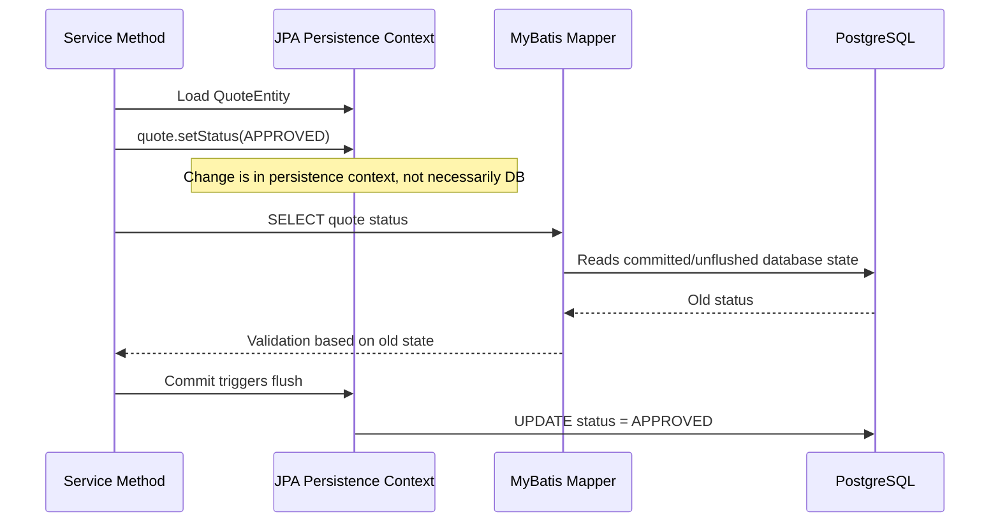
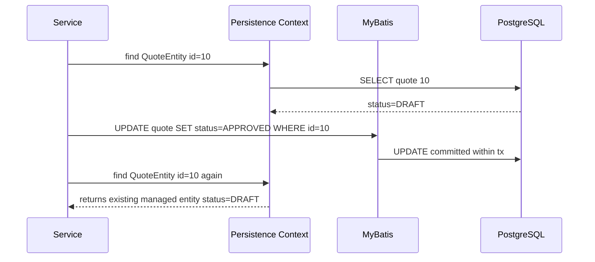
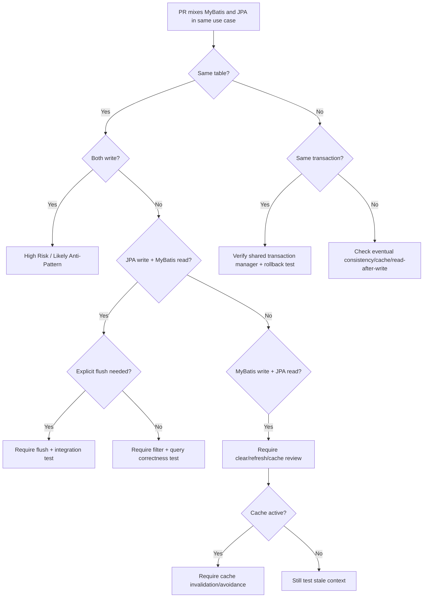

# Part 020 — MyBatis and JPA for the Same Use Case: Safe or Anti-Pattern?

Pertanyaan paling penting dalam seri ini:

> Bagaimana kalau dalam satu sistem menggunakan JPA dan MyBatis untuk use case yang sama atau mirip?

Jawaban senior-engineer bukan “boleh” atau “tidak boleh”.

Jawaban yang benar adalah:

```text
It depends on ownership, transaction ordering, persistence context visibility,
cache behavior, write responsibility, and correctness invariants.
```

Namun untuk PR review, default stance yang sehat adalah:

```text
Using MyBatis and JPA for the same use case is high-risk until proven safe.
```

Part ini membahas definisi “same use case”, scenario yang masih bisa diterima, scenario yang harus dianggap anti-pattern, dan checklist review agar tidak terjadi stale state, lost update, inconsistent audit, duplicate validation, hidden flush, atau cache conflict.

---

## 1. What Does “Same Use Case” Mean?

Sebuah use case dianggap sama atau sangat berdekatan jika MyBatis dan JPA menyentuh satu atau lebih hal berikut:

- same HTTP endpoint,
- same application service method,
- same transaction boundary,
- same aggregate,
- same table,
- same row,
- same business invariant,
- same read-after-write expectation,
- same audit trail,
- same version/concurrency control,
- same outbox/event side effect.

Contoh:

```text
POST /quotes/{id}/approve
```

Dalam endpoint ini:

- JPA load `QuoteEntity`,
- MyBatis update quote line discount,
- JPA update quote status,
- MyBatis insert audit row,
- JPA writes outbox event.

Ini jelas same use case karena semua berada dalam command yang sama.

---

## 2. Risk Gradient

Tidak semua same-use-case mixing sama risikonya.

```text
Lowest risk:
JPA command writes aggregate, MyBatis read-only projection after commit

Medium risk:
JPA command writes aggregate, MyBatis reads projection inside same transaction with explicit flush

High risk:
JPA and MyBatis both write same table in same transaction

Very high risk:
JPA entity loaded, MyBatis updates same row, JPA continues mutating stale entity

Usually anti-pattern:
Two independent write models for same aggregate with duplicate validation/audit/versioning
```

Gunakan risk gradient ini saat review.

---

## 3. Same Table Access

Same table access adalah sinyal risiko pertama.

Bukan berarti otomatis salah.

Namun setiap same-table access harus dikategorikan:

| Access Pattern | Risk | Notes |
|---|---:|---|
| JPA write, MyBatis read-only projection | Medium | Sering aman jika filter dan transaction visibility jelas |
| JPA read, MyBatis write | High | Stale entity/cache risk |
| JPA write, MyBatis write different columns | High | Ownership dan audit/version risk |
| JPA write, MyBatis bulk update same rows | Very high | Persistence context stale dan overwrite risk |
| MyBatis write, JPA second-level cache active | Very high | Cache inconsistency risk |
| Both write same aggregate lifecycle | Usually anti-pattern | Duplicate write model |

Senior review harus mencari table, bukan hanya class.

Class bisa terlihat berbeda, tetapi table sama.

---

## 4. Same Aggregate Access

Lebih penting dari same table adalah same aggregate.

Contoh aggregate:

```text
Quote
- quote header
- quote lines
- discounts
- terms
- approval state
```

Mungkin JPA entity menulis `quote_header`, sedangkan MyBatis menulis `quote_line`.

Secara table berbeda.

Secara aggregate bisa sama.

Jika invariant aggregate bergantung pada header dan line, maka mixing tetap high-risk.

Contoh invariant:

```text
Approved quote cannot have line price changed.
Total amount must equal sum of active quote lines.
Discount cannot exceed configured threshold.
Only latest catalog version can be quoted.
```

Jika MyBatis update line melewati aggregate method JPA, invariant bisa bocor.

---

## 5. Same Transaction Access

Same transaction access bisa aman atau berbahaya.

Aman jika:

- MyBatis dan JPA benar-benar memakai transaction fisik yang sama,
- ordering jelas,
- flush dilakukan sebelum read yang membutuhkan state terbaru,
- clear/refresh dilakukan setelah write yang bypass JPA,
- rollback diuji,
- cache tidak membuat stale read.

Berbahaya jika:

- transaction manager tidak sinkron,
- MyBatis memakai connection berbeda,
- JPA belum flush tetapi MyBatis membaca database,
- MyBatis update row yang sudah ada di persistence context,
- commit order tidak dipahami,
- exception mapping tidak memicu rollback.

### Transaction Visibility Diagram



Bug-nya bukan karena query salah.

Bug-nya karena visibility expectation salah.

---

## 6. Same Read Path

MyBatis dan JPA dalam read path yang sama biasanya muncul karena developer ingin “melengkapi data”.

Contoh:

```text
1. JPA loads QuoteEntity
2. MyBatis loads quote summary metrics
3. Response combines both
```

Ini bisa diterima jika:

- tidak ada entity mutation,
- transaction read-only atau scoped jelas,
- lazy loading tidak menyebabkan query tambahan liar,
- projection MyBatis jelas read-only,
- response contract tidak bergantung pada unflushed state,
- query count dipahami.

Namun bisa menjadi smell jika:

- JPA dipakai hanya untuk convenience relationship,
- MyBatis dipakai untuk patch data yang entity tidak punya,
- response mapping menyentuh lazy relation setelah mapper query,
- query count tidak terkendali,
- data dari dua source memakai filter berbeda.

### Safer Alternative

Untuk endpoint query/list/detail, sering lebih baik:

```text
Use MyBatis projection-only query
```

daripada load entity graph JPA lalu tambal dengan MyBatis.

---

## 7. Same Write Path

Same write path adalah area paling berbahaya.

Contoh:

```text
1. JPA validates and updates quote status
2. MyBatis updates quote line values
3. JPA dirty checking updates quote totals
4. MyBatis inserts audit
5. Commit
```

Pertanyaan senior review:

- siapa pemilik invariant quote?
- siapa menghitung total?
- siapa mengatur version?
- siapa mengisi audit?
- siapa menulis outbox?
- apakah MyBatis write melewati validation?
- apakah JPA flush bisa overwrite perubahan MyBatis?
- apakah rollback mencakup semua write?

Jika jawaban tidak jelas, ini anti-pattern.

---

## 8. Scenario: JPA Write + MyBatis Read

Ini salah satu pattern yang bisa diterima.

Contoh:

```text
JPA writes aggregate
MyBatis reads projection for response
```

Tetapi ada jebakan: MyBatis hanya melihat database state.

Jika JPA belum flush, MyBatis bisa membaca state lama.

### Safe Version

```java
@Transactional
public QuoteApprovalResponse approve(QuoteId id) {
    QuoteEntity quote = quoteRepository.findById(id);
    quote.approve();

    entityManager.flush();

    QuoteApprovalView view = quoteMapper.findApprovalView(id.value());
    return map(view);
}
```

### Still Need Caution

Explicit flush membuat database melihat perubahan JPA dalam transaction yang sama.

Tetapi flush bukan commit.

Jika setelah flush terjadi exception, rollback tetap bisa membatalkan perubahan.

### Review Questions

- Apakah MyBatis read benar-benar butuh state terbaru?
- Apakah response bisa dibangun dari entity/domain result tanpa mapper read?
- Apakah explicit flush acceptable?
- Apakah flush memicu constraint violation lebih awal?
- Apakah MyBatis query memakai tenant/soft delete/effective date filter yang sama?

---

## 9. Scenario: MyBatis Write + JPA Read

Ini lebih berisiko.

Contoh:

```text
MyBatis updates quote row
JPA reads QuoteEntity
```

Jika entity belum pernah diload di persistence context, JPA mungkin membaca database state terbaru.

Tetapi jika entity sudah ada di persistence context, JPA akan mengembalikan managed entity yang sudah ada.



JPA tidak otomatis tahu MyBatis sudah mengubah row.

### Safer Version

Jika memang harus:

```java
quoteMapper.approve(id);
entityManager.clear();
QuoteEntity quote = entityManager.find(QuoteEntity.class, id);
```

Atau lebih sempit:

```java
entityManager.refresh(quote);
```

Namun ini bukan free lunch.

Clear dapat melepaskan entity lain dari persistence context.

Refresh dapat menimpa perubahan in-memory yang belum di-flush.

---

## 10. Scenario: JPA Entity Modified Then MyBatis Update

Ini high-risk.

Contoh:

```java
@Transactional
public void changeQuote(QuoteId id) {
    QuoteEntity quote = entityManager.find(QuoteEntity.class, id);
    quote.setStatus(Status.APPROVED);

    quoteMapper.updateDiscount(id.value(), newDiscount);

    quote.setUpdatedBy(currentUser);
}
```

Masalah:

- JPA punya dirty state,
- MyBatis update langsung ke database,
- Hibernate flush di commit,
- SQL update order mungkin tidak sesuai ekspektasi,
- entity mungkin tidak tahu discount berubah,
- audit/version bisa tidak konsisten.

### Failure Possibilities

- JPA flush overwrite column yang diubah MyBatis,
- JPA version increment tidak mencakup MyBatis update,
- audit timestamp berbeda,
- entity method menghitung total dari state lama,
- response memakai state entity lama.

### Review Stance

```text
Do not mix JPA dirty entity mutation and MyBatis update to the same aggregate
unless the ordering and ownership are explicitly designed and tested.
```

---

## 11. Scenario: MyBatis Update Then JPA Entity Modified

Ini juga high-risk.

Contoh:

```java
@Transactional
public void changeQuote(QuoteId id) {
    QuoteEntity quote = entityManager.find(QuoteEntity.class, id);

    quoteMapper.markLinesInactive(id.value());

    quote.recalculateTotal();
}
```

Jika `quote.recalculateTotal()` bergantung pada relationship lines yang sudah dimuat sebelum MyBatis update, total bisa salah.

Jika lines lazy-loaded setelah MyBatis update, mungkin benar.

Tetapi correctness tidak boleh bergantung pada kebetulan lazy loading timing.

### Safer Alternatives

- lakukan seluruh aggregate change melalui JPA,
- atau lakukan seluruh operation SQL-first melalui MyBatis,
- atau pisahkan menjadi dua transaction/use case,
- atau clear/refresh dengan test eksplisit,
- atau gunakan database constraint/check untuk invariant final.

---

## 12. Persistence Context Stale State

Stale state adalah bug inti mixing JPA + MyBatis.

JPA persistence context adalah identity map:

```text
Within one persistence context, same entity id returns same object instance.
```

Jika database berubah di luar EntityManager, object itu tidak otomatis berubah.

MyBatis adalah salah satu “outside EntityManager” writer.

### Stale State Symptoms

- response menampilkan data lama setelah update,
- validation memakai status lama,
- total amount salah,
- audit event payload salah,
- outbox event berisi state lama,
- optimistic lock tidak naik,
- update berikutnya overwrite data baru.

### Detection

- aktifkan SQL log,
- bandingkan object state vs database row,
- cek urutan SELECT/UPDATE,
- cek apakah entity sudah loaded sebelum mapper update,
- tambahkan test yang mengecek state setelah mapper update.

---

## 13. First-Level Cache Conflict

JPA first-level cache adalah persistence context.

Ia selalu aktif.

Tidak bisa “dimatikan” seperti second-level cache.

Conflict muncul saat:

```text
EntityManager has entity A
MyBatis updates row A
EntityManager still returns old entity A
```

### Mitigation Options

- jangan update row yang sudah managed oleh JPA,
- flush sebelum MyBatis read,
- clear setelah MyBatis write,
- refresh entity setelah MyBatis write,
- pisahkan transaction,
- pisahkan use case,
- gunakan MyBatis untuk seluruh operation,
- gunakan JPA untuk seluruh operation.

Tidak ada mitigasi universal.

Pilihan tergantung invariant dan lifecycle.

---

## 14. Second-Level Cache Conflict

Jika Hibernate second-level cache aktif, risikonya lebih besar.

Second-level cache bisa bertahan melewati transaction dan request.

Contoh:

```text
Request A loads ProductEntity -> Hibernate L2 cache filled
Request B updates product via MyBatis
Request C loads ProductEntity -> Hibernate returns stale L2 cached entity
```

### Mitigation

- hindari L2 cache untuk table yang ditulis MyBatis,
- explicit evict cache setelah MyBatis write,
- jangan campur write model,
- gunakan cache invalidation event,
- dokumentasikan cache ownership,
- test stale cache behavior.

### Review Question

```text
Apakah ada writer di luar Hibernate untuk entity yang di-cache Hibernate?
```

Jika ya, cache policy wajib dibahas.

---

## 15. Flush Surprise

Flush surprise terjadi saat Hibernate mengirim SQL pada waktu yang tidak diduga developer.

Misalnya:

- sebelum commit,
- sebelum JPQL query,
- sebelum native query tertentu,
- saat manual flush,
- saat transaction synchronization.

Dalam mixed path, flush surprise bisa mengubah urutan SQL terhadap MyBatis.

### Example

```text
1. Modify JPA entity
2. Execute JPA query -> Hibernate flushes first
3. Execute MyBatis update
4. Commit
```

Developer mungkin mengira MyBatis update terjadi sebelum JPA update.

SQL log bisa berkata sebaliknya.

### Detection

- enable SQL logging in test,
- assert final row state,
- inspect statement order,
- use explicit flush where needed,
- avoid relying on implicit flush timing.

---

## 16. Duplicate Optimistic Locking

JPA optimistic locking biasanya memakai `@Version`.

MyBatis harus melakukan version check manual.

Contoh aman MyBatis:

```sql
UPDATE quote
SET status = #{status}, version = version + 1
WHERE id = #{id}
  AND version = #{expectedVersion}
```

Lalu cek affected rows:

```text
0 rows updated => optimistic lock conflict
```

Anti-pattern:

```sql
UPDATE quote
SET status = #{status}
WHERE id = #{id}
```

Jika JPA memakai `@Version`, MyBatis update tanpa version check dapat melewati concurrency protection.

### Review Questions

- Apakah table punya version column?
- Apakah JPA entity punya @Version?
- Apakah MyBatis update menaikkan version?
- Apakah affected row count dicek?
- Apakah conflict dimapping ke domain/HTTP error yang tepat?

---

## 17. Duplicate Audit Handling

Audit sering rusak saat MyBatis dan JPA sama-sama menulis.

JPA mungkin memakai:

- entity listener,
- auditing annotation,
- lifecycle callback,
- application interceptor.

MyBatis mungkin memakai:

- explicit SQL column update,
- database trigger,
- manual value dari service.

Jika tidak konsisten:

- `updated_by` kosong di satu path,
- timezone berbeda,
- timestamp source berbeda,
- audit event hilang,
- version tidak naik,
- change history tidak lengkap.

### Rule

```text
Audit convention must be framework-independent or explicitly duplicated with tests.
```

---

## 18. Duplicate Soft Delete Logic

JPA soft delete bisa memakai:

- custom SQL delete,
- filter,
- where clause annotation,
- application query convention.

MyBatis harus menulis WHERE condition manual.

Anti-pattern:

```text
JPA excludes deleted rows automatically
MyBatis search query forgets deleted = false
```

Akibatnya data “terhapus” muncul di API.

### Review Checklist

- Apakah table memakai soft delete?
- Apakah semua MyBatis SELECT punya filter?
- Apakah JPA filter aktif untuk semua query?
- Apakah native query melewati filter?
- Apakah index mendukung filter tersebut?
- Apakah test mencakup deleted row?

---

## 19. Duplicate Tenant and Security Filter

Ini bukan hanya correctness bug.

Ini bisa menjadi security incident.

Jika JPA memakai tenant filter tetapi MyBatis tidak, cross-tenant leak bisa terjadi.

```sql
-- Dangerous if tenant_id is required
SELECT * FROM quote WHERE id = #{id}
```

Harusnya:

```sql
SELECT *
FROM quote
WHERE id = #{id}
  AND tenant_id = #{tenantId}
```

### Review Rule

```text
Every MyBatis query against tenant-scoped table must show tenant filtering explicitly
or prove that filtering is enforced elsewhere such as RLS.
```

Jangan mengandalkan “id global seharusnya unik” tanpa bukti.

---

## 20. Duplicate Business Validation

Saat JPA entity/domain method punya validation, MyBatis write bisa melewatinya.

Contoh:

```java
quote.approve(); // validates state transition
```

MyBatis:

```sql
UPDATE quote SET status = 'APPROVED' WHERE id = #{id}
```

Jika mapper update tidak mengecek valid transition, state machine bisa rusak.

### Safer SQL

```sql
UPDATE quote
SET status = 'APPROVED'
WHERE id = #{id}
  AND status = 'READY_FOR_APPROVAL'
```

Lalu cek affected rows.

Tetapi ini berarti validation duplicate.

Jika duplicate, harus intentional dan tested.

---

## 21. Same Use Case with Outbox/Event Side Effects

Event-driven persistence menambah risiko.

Contoh:

```text
JPA updates aggregate
MyBatis updates extra table
Outbox event payload built from JPA entity
```

Jika MyBatis update mengubah data yang seharusnya masuk event payload, tetapi entity tidak refresh, event bisa salah.

### Example Failure

```text
MyBatis updates quote total
JPA entity still has old total
Outbox event QuoteApproved contains old total
Consumers build wrong read model
```

### Rule

```text
Outbox payload must be built from authoritative state after all relevant writes are visible.
```

Atau gunakan event payload minimal:

```text
event contains id + version
consumer re-reads authoritative state
```

Tetapi ini punya trade-off latency dan coupling.

---

## 22. Same Use Case with Redis Cache

Jika Redis cache membaca data yang diubah MyBatis/JPA, invalidation harus jelas.

Mixed persistence memperbesar pertanyaan:

- siapa invalidasi cache?
- kapan invalidasi dilakukan?
- sebelum commit atau after commit?
- bagaimana jika rollback?
- apakah cache key tenant-aware?
- apakah event invalidation dikirim?
- apakah JPA L2 cache dan Redis cache bisa divergen?

### Dangerous Pattern

```text
MyBatis update DB
Redis cache not invalidated
JPA read later also returns stale L2 cache
```

Sekarang ada dua stale layer.

---

## 23. When It Is Acceptable

Menggunakan MyBatis dan JPA dalam use case yang sama bisa diterima jika kondisi berikut terpenuhi.

### Acceptable Case 1: JPA Write, MyBatis Read Projection After Explicit Flush

- JPA adalah owner write model.
- MyBatis hanya read projection.
- EntityManager flush sebelum MyBatis read jika butuh state terbaru.
- Mapper tidak menulis table yang sama.
- Query filter konsisten.
- Test membuktikan response benar.

### Acceptable Case 2: MyBatis Infrastructure Write, JPA Aggregate Write

Contoh:

- JPA writes aggregate,
- MyBatis inserts outbox/inbox/idempotency row,
- table berbeda,
- transaction sama,
- rollback tested.

### Acceptable Case 3: Separate Tables, Same Transaction, No Shared Aggregate Invariant

- Table berbeda,
- tidak ada invariant lintas table yang tersembunyi,
- transaction atomicity memang dibutuhkan,
- ownership jelas.

### Acceptable Case 4: Migration/Refactoring Transitional Period

- Ada ADR,
- ada compatibility test,
- ada target end-state,
- ada deadline/hapus legacy path,
- tidak dibiarkan permanen tanpa owner.

---

## 24. When It Is Dangerous

Berbahaya jika:

- dua framework menulis table yang sama,
- MyBatis update row yang sudah managed oleh JPA,
- JPA entity dipakai setelah MyBatis bulk update,
- cache Hibernate aktif untuk table yang diupdate MyBatis,
- optimistic locking hanya ada di JPA,
- audit hanya ada di satu path,
- tenant/soft delete filter berbeda,
- outbox payload dibuat dari stale entity,
- migration harus mengubah entity dan mapper tetapi hanya satu yang diuji,
- transaction manager tidak diverifikasi,
- PR tidak punya test mixed behavior.

---

## 25. When It Is an Anti-Pattern

Anggap anti-pattern jika:

```text
1. Same aggregate has two independent write models.
2. Same business transition can be executed via JPA or MyBatis without shared invariant enforcement.
3. MyBatis bypasses @Version, audit, soft delete, tenant, or domain validation.
4. JPA entity is loaded and reused after MyBatis changes the same row.
5. Hibernate second-level cache is active and MyBatis writes the same table without invalidation.
6. Developers cannot explain SQL ordering at commit.
7. There is no integration test proving rollback and stale-state behavior.
8. The reason is only "lebih gampang" or "sudah ada mapper".
```

Anti-pattern bukan berarti harus langsung rewrite semua.

Artinya risk harus dibatasi, didokumentasikan, dan diprioritaskan untuk diperbaiki.

---

## 26. Decision Flow

Gunakan flow berikut saat review.



---

## 27. Review Checklist: Same Use Case

### Ownership

- Apa use case-nya?
- Table apa yang disentuh?
- Aggregate apa yang disentuh?
- Siapa primary write owner?
- Apakah ada duplicate write path?
- Apakah mapper read-only atau write?

### Transaction

- Apakah keduanya dalam transaction sama?
- Apakah transaction manager diverifikasi?
- Apakah JPA flush timing diketahui?
- Apakah MyBatis read butuh unflushed JPA state?
- Apakah MyBatis write membuat entity stale?
- Apakah rollback tested?

### Persistence Context

- Apakah entity sudah loaded sebelum mapper update?
- Apakah entity dipakai setelah mapper update?
- Apakah perlu clear/refresh?
- Apakah merge digunakan?
- Apakah bulk update melewati persistence context?

### Cache

- Apakah Hibernate L2 cache aktif?
- Apakah query cache aktif?
- Apakah Redis cache membaca data sama?
- Siapa invalidasi cache?
- Apakah invalidasi after commit?

### Correctness

- Apakah @Version/optimistic lock konsisten?
- Apakah audit konsisten?
- Apakah tenant filter konsisten?
- Apakah soft delete konsisten?
- Apakah effective dating konsisten?
- Apakah domain invariant bisa dilewati?

### Observability

- Apakah SQL log bisa menunjukkan statement order?
- Apakah slow query terhubung ke endpoint?
- Apakah query count diketahui?
- Apakah lock wait/deadlock observable?

---

## 28. Testing Requirements

PR same-use-case mixing minimal butuh test yang membuktikan behavior, bukan hanya happy path.

### Required Tests

- JPA write + MyBatis read sees expected state.
- MyBatis write + JPA read handles stale context correctly.
- Rollback membatalkan semua write.
- Optimistic lock conflict terdeteksi.
- Tenant filter tidak bocor.
- Soft-deleted row tidak muncul.
- Audit fields terisi konsisten.
- Outbox payload memakai state benar.
- Cache tidak mengembalikan stale state jika cache aktif.

### Testcontainers Recommended

Gunakan PostgreSQL nyata melalui Testcontainers untuk:

- transaction behavior,
- lock behavior,
- SQL syntax,
- constraint violation,
- trigger/function behavior,
- isolation semantics.

Mock tidak cukup untuk membuktikan persistence correctness.

---

## 29. Production Debugging Checklist

Jika terjadi bug pada mixed MyBatis/JPA use case:

1. Ambil request/correlation ID.
2. Identifikasi endpoint/use case.
3. Cari SQL log statement order.
4. Identifikasi semua table yang berubah.
5. Cek apakah entity diload sebelum mapper update.
6. Cek apakah flush terjadi sebelum mapper read.
7. Cek final DB row.
8. Cek response/event payload.
9. Cek cache layer.
10. Cek transaction rollback/commit.
11. Cek retry/duplicate request.
12. Cek concurrent transaction.
13. Cek migration terakhir.
14. Reproduksi dengan integration test.

Fokus pada state transition, bukan framework blame.

---

## 30. Examples of Safer Refactoring

### Before: Mixed Write Path

```text
ApproveQuoteService
- JPA loads quote
- MyBatis updates quote_line
- JPA updates quote status
- MyBatis updates quote audit
```

### Option A: Move Aggregate Write to JPA

```text
ApproveQuoteService
- JPA loads quote aggregate
- Domain method updates line/status
- JPA flushes aggregate
- MyBatis only reads projection after flush
```

### Option B: Move Whole Command to MyBatis

```text
ApproveQuoteService
- MyBatis performs conditional update with version check
- MyBatis updates line/status/audit explicitly
- MyBatis inserts outbox
- No JPA entity loaded in same transaction
```

### Option C: Split Command and Projection

```text
Transaction 1:
- JPA command updates aggregate
- outbox event written

Transaction 2 / async:
- MyBatis updates read model/projection
```

Tidak ada opsi yang selalu terbaik.

Pilih berdasarkan invariant, schema shape, performance, dan operational clarity.

---

## 31. Internal Verification Checklist

Gunakan ini untuk codebase internal.

### Find Mixed Use Cases

- Search service classes yang inject repository JPA dan MyBatis mapper sekaligus.
- Search mapper XML yang menyentuh table entity JPA.
- Search native query di JPA yang overlap dengan mapper.
- Search table write operations dari dua framework.
- Search bulk update/delete.

### Verify Transaction

- Cek transaction annotation/configuration.
- Cek transaction manager.
- Cek SqlSession participation.
- Cek EntityManager scope.
- Cek rollback behavior integration test.
- Cek transaction timeout.

### Verify Entity/Mapper Overlap

- Buat daftar table -> JPA entity.
- Buat daftar table -> MyBatis mapper.
- Tandai table yang overlap.
- Tandai table yang ditulis dua framework.
- Tandai table yang cache-enabled.

### Verify Correctness Rules

- Version column.
- Audit columns.
- Tenant ID.
- Soft delete fields.
- Effective date fields.
- Status transition constraints.
- Unique/check/foreign key constraints.

### Verify Tests

- Test rollback mixed write.
- Test stale persistence context.
- Test flush before mapper read.
- Test cache invalidation.
- Test tenant/soft delete consistency.
- Test optimistic locking.
- Test outbox payload correctness.

### Verify Observability

- SQL statement order visible?
- Hibernate SQL visible?
- MyBatis SQL visible?
- Parameter redaction safe?
- Query count observable?
- Transaction duration observable?
- Cache hit/miss observable?

---

## 32. Senior Engineer Judgment

Framework mixing harus dinilai dengan pertanyaan:

```text
Can we explain and test the exact state observed by each layer at each step?
```

Jika tidak, gunakan satu persistence model untuk use case tersebut.

Lebih baik code sedikit kurang “elegan” tetapi state transition jelas, daripada abstraction terlihat rapi tetapi runtime state tidak bisa dijelaskan.

---

## 33. Practical Rules of Thumb

1. Jangan pakai MyBatis dan JPA untuk menulis aggregate yang sama kecuali ada alasan kuat.
2. Jangan biarkan MyBatis update row yang sedang managed JPA tanpa clear/refresh strategy.
3. Jangan anggap MyBatis read melihat perubahan JPA sebelum flush.
4. Jangan aktifkan Hibernate L2 cache untuk table yang ditulis MyBatis tanpa invalidation.
5. Jangan return JPA entity dari MyBatis mapper.
6. Jangan duplicate optimistic locking tanpa affected-row check.
7. Jangan duplicate audit/tenant/soft-delete rule tanpa test.
8. Jangan membangun outbox payload dari entity stale.
9. Jangan menyetujui mixed persistence PR tanpa integration test.
10. Jangan jadikan “lebih cepat implementasi” sebagai alasan architecture permanen.

---

## 34. Key Takeaways

- Same-use-case MyBatis + JPA adalah high-risk area.
- Same table lebih riskan daripada same service; same aggregate lebih riskan daripada same table.
- JPA persistence context dapat stale setelah MyBatis update.
- MyBatis read tidak melihat unflushed JPA changes.
- First-level cache selalu ada dalam JPA.
- Second-level cache membuat external writes jauh lebih berbahaya.
- JPA `@Version` tidak melindungi MyBatis update kecuali MyBatis mengecek version manual.
- Tenant, soft delete, audit, dan effective dating harus konsisten di dua framework.
- Outbox/event payload harus dibangun dari authoritative state yang benar.
- Jika state transition tidak bisa dijelaskan, jangan mix framework dalam use case itu.

