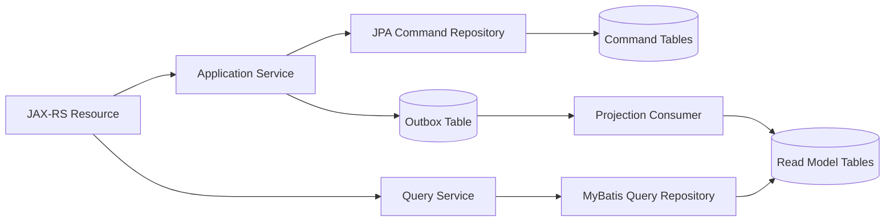
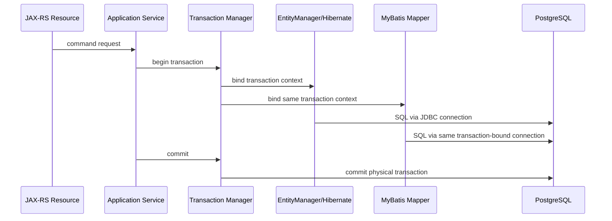

# Part 021 — Patterns for Mixing MyBatis and JPA Safely

Mixing MyBatis dan JPA bukan tujuan arsitektur.

Mixing adalah kompromi.

Kompromi bisa sehat jika boundary-nya jelas. Kompromi menjadi berbahaya jika dua persistence model mengklaim ownership yang sama terhadap data, lifecycle, cache, audit, validation, dan transaction ordering.

Part ini membahas pola-pola yang masih defensible ketika satu Java/JAX-RS service memakai MyBatis dan JPA/Hibernate bersama-sama.

Prinsip dasarnya:

```text
Mixing MyBatis and JPA is acceptable only when ownership, ordering,
visibility, and cache behavior are explicit.
```

Jika tidak eksplisit, anggap high-risk.

---

## 1. Core Safety Rule

Aturan paling penting:

```text
Do not let MyBatis and JPA become two independent write models for the same aggregate.
```

Yang harus dipisahkan:

- siapa pemilik aggregate lifecycle,
- siapa pemilik write path,
- siapa pemilik read projection,
- siapa pemilik transaction boundary,
- siapa pemilik audit/version field,
- siapa pemilik soft delete/tenant/security filter,
- siapa pemilik outbox/event side effect,
- siapa pemilik cache invalidation.

Mixing masih mungkin aman jika salah satu framework menjadi owner utama, sedangkan framework lain hanya menjalankan peran terbatas dan terdokumentasi.

---

## 2. Safe Pattern: JPA Owns Aggregate Lifecycle, MyBatis Owns Read Projection

Ini salah satu pola paling umum dan paling defensible.

Gunakan JPA untuk:

- create/update/delete aggregate,
- entity lifecycle,
- cascade yang memang bagian dari aggregate,
- optimistic locking dengan `@Version`,
- invariant yang dijaga melalui domain method,
- audit fields yang terintegrasi entity listener,
- outbox event yang dibuat dalam transaction yang sama.

Gunakan MyBatis untuk:

- read-only projection,
- reporting query,
- dashboard query,
- search result DTO,
- PostgreSQL-specific SQL,
- join kompleks yang tidak cocok dengan entity graph,
- query yang tidak membutuhkan managed entity.

Contoh boundary:

```text
QuoteCommandRepository  -> JPA/Hibernate
QuoteQueryRepository    -> MyBatis
```

### Example Shape

```java
public interface QuoteCommandRepository {
    QuoteEntity findForUpdate(QuoteId id);
    void save(QuoteEntity quote);
}

public interface QuoteQueryRepository {
    QuoteSummaryView findSummary(QuoteId id);
    List<QuoteSearchRow> search(QuoteSearchCriteria criteria);
}
```

Dalam pola ini, nama repository sengaja membedakan command dan query.

Jangan membuat satu `QuoteRepository` yang sebagian method-nya JPA dan sebagian MyBatis tanpa boundary yang terlihat.

---

## 3. Safe Pattern: MyBatis for Reporting, JPA for Transactional Commands

Reporting query sering kali lebih cocok menggunakan MyBatis karena membutuhkan:

- aggregate function,
- CTE,
- window function,
- JSONB operator,
- conditional join,
- query planner tuning,
- explicit index-aware SQL,
- DTO projection langsung.

JPA tetap dipakai untuk command use case yang membutuhkan lifecycle entity.

Contoh:

```text
POST /quotes/{id}/approve       -> JPA command
GET  /quotes/{id}/summary       -> MyBatis projection
GET  /quotes/search             -> MyBatis dynamic search
GET  /quotes/report/monthly     -> MyBatis reporting SQL
```

Batas sehatnya:

```text
Reporting path must not mutate aggregate state.
```

Jika reporting mapper mulai melakukan update status, insert audit, atau mutate domain table, boundary sudah rusak.

---

## 4. Safe Pattern: MyBatis for Read Model in Event-Driven Architecture

Dalam microservices/event-driven architecture, read model sering berbeda dari command model.

Contoh:

```text
Command model:
- quote
- quote_line
- quote_discount
- quote_approval

Read model:
- quote_search_view
- quote_summary_projection
- quote_dashboard_snapshot
```

JPA bisa mengelola command aggregate.

MyBatis bisa membaca read model yang:

- dibangun oleh outbox consumer,
- dibangun oleh projection updater,
- diisi melalui batch job,
- disimpan di table terpisah,
- tidak menjadi source of truth untuk command.

### Boundary Diagram



Kuncinya:

```text
Read model is not the same persistence model as aggregate model.
```

Jika MyBatis membaca table command langsung untuk projection, masih bisa diterima, tetapi risiko lebih tinggi dan filter/invariant harus jelas.

---

## 5. Safe Pattern: MyBatis for PostgreSQL-Specific Query, JPA for Generic Lifecycle

Gunakan MyBatis ketika query sangat bergantung pada PostgreSQL:

- `jsonb_path_query`,
- `@>`, `?`, `?|`, `?&`,
- full-text search,
- `WITH RECURSIVE`,
- window function,
- `DISTINCT ON`,
- `RETURNING`,
- `ON CONFLICT`,
- `SKIP LOCKED`,
- advisory lock,
- function/procedure call.

JPA/Hibernate bisa dipakai untuk operasi entity biasa.

Contoh aman:

```text
JPA:
- create quote
- update quote lifecycle state
- optimistic locking

MyBatis:
- search quote by JSONB attribute
- calculate commercial summary
- fetch denormalized projection
```

Yang harus dicegah:

```text
MyBatis PostgreSQL query becomes an alternate write path for the same entity state.
```

---

## 6. Safe Pattern: Separate Repository Interfaces

Jangan sembunyikan mixing di balik repository yang sama tanpa sinyal.

Kurang baik:

```java
class QuoteRepository {
    // Uses JPA
    QuoteEntity findById(UUID id) { ... }

    // Uses MyBatis
    QuoteSummary findSummary(UUID id) { ... }

    // Uses MyBatis
    void updateLineStatus(UUID lineId, String status) { ... }

    // Uses JPA
    void save(QuoteEntity quote) { ... }
}
```

Lebih baik:

```java
interface QuoteCommandRepository {
    QuoteEntity findAggregate(QuoteId id);
    void save(QuoteEntity quote);
}

interface QuoteProjectionRepository {
    QuoteSummary findSummary(QuoteId id);
    List<QuoteSearchRow> search(QuoteSearchCriteria criteria);
}
```

Atau jika tetap satu class karena convention internal:

```text
Method ownership must be explicit in naming, package, documentation, and tests.
```

Contoh:

```java
class JpaQuoteCommandRepository implements QuoteCommandRepository { ... }
class MyBatisQuoteProjectionRepository implements QuoteProjectionRepository { ... }
```

---

## 7. Safe Pattern: Explicit Flush Before MyBatis Read

Jika JPA sudah mengubah managed entity tetapi MyBatis perlu membaca state terbaru dari database dalam transaction yang sama, lakukan flush eksplisit.

Tanpa flush:

```java
quote.approve();

QuoteSummary summary = quoteSummaryMapper.findSummary(quote.id());
// MyBatis may read old DB state because JPA change is still in persistence context.
```

Dengan flush:

```java
quote.approve();

entityManager.flush();

QuoteSummary summary = quoteSummaryMapper.findSummary(quote.id());
```

Namun flush bukan magic safety.

Flush hanya memastikan pending SQL JPA dikirim ke database.

Flush tidak:

- meng-clear persistence context,
- memperbarui entity yang sudah stale karena MyBatis write,
- menyelesaikan cache second-level,
- menggantikan ownership design,
- memperbaiki transaction manager yang berbeda.

### Rule

```text
Use explicit flush when MyBatis must read JPA-mutated state before commit.
```

Tapi jangan jadikan flush sebagai tambalan untuk desain yang kacau.

---

## 8. Safe Pattern: Clear or Refresh After MyBatis Write

Jika MyBatis melakukan write ke row yang mungkin sudah ada di persistence context JPA, entity JPA bisa stale.

Contoh bug:

```java
QuoteEntity quote = entityManager.find(QuoteEntity.class, id);

quoteLineMapper.updateDiscount(id, newDiscount);

quote.recalculateTotal();
// quote still sees old line state in memory.

entityManager.flush();
// Potential overwrite or incorrect derived value.
```

Opsi mitigasi:

```java
entityManager.flush();
quoteLineMapper.updateDiscount(id, newDiscount);
entityManager.clear();
QuoteEntity freshQuote = entityManager.find(QuoteEntity.class, id);
```

Atau:

```java
quoteLineMapper.updateDiscount(id, newDiscount);
entityManager.refresh(quote);
```

Namun `refresh` hanya aman jika entity mapping mencakup state yang berubah dan relationship loading-nya sesuai.

### Rule

```text
After MyBatis writes data that JPA might already manage, either avoid continued JPA mutation or explicitly clear/refresh and reload.
```

Kalau flow membutuhkan banyak flush/clear/refresh, itu sinyal bahwa boundary desain perlu ditinjau ulang.

---

## 9. Safe Pattern: Avoid Same Table Mutation

Pola paling aman:

```text
JPA writes command tables.
MyBatis reads command tables or writes separate projection/support tables.
```

MyBatis write masih acceptable jika table-nya bukan table yang dimanage JPA untuk aggregate utama.

Contoh acceptable:

| Table | Owner | Notes |
|---|---|---|
| `quote` | JPA | aggregate lifecycle |
| `quote_line` | JPA | aggregate child |
| `quote_search_projection` | MyBatis | read model |
| `quote_report_snapshot` | MyBatis | reporting snapshot |
| `quote_processing_lock` | MyBatis | operational lock table |
| `outbox_event` | JPA or MyBatis, but one owner only | transaction side effect |

Yang berbahaya:

| Table | Owner Conflict |
|---|---|
| `quote` | JPA updates status, MyBatis updates status too |
| `quote_line` | JPA owns line lifecycle, MyBatis updates price/discount |
| `quote_audit` | JPA listener inserts audit, MyBatis also inserts manual audit inconsistently |

---

## 10. Safe Pattern: MyBatis for Bulk Operation Outside Managed Entity Flow

Bulk operation sering lebih cocok memakai MyBatis karena explicit SQL dan performa lebih terkontrol.

Namun harus dipisahkan dari JPA managed entity flow.

Aman:

```text
Nightly batch job uses MyBatis to update projection table or operational status.
No JPA entities are loaded in the same transaction.
No second-level cache relies on those rows.
Version/audit semantics are explicit.
```

Berbahaya:

```text
JAX-RS command loads JPA entity.
MyBatis bulk-updates rows for that aggregate.
JPA continues business logic with stale object graph.
```

Jika bulk update menyentuh table yang juga dimap JPA:

- jalankan di transaction terpisah,
- hindari entity managed di transaction yang sama,
- clear persistence context setelah bulk update,
- invalidate cache jika ada,
- update version/audit fields secara konsisten,
- dokumentasikan ownership.

---

## 11. Safe Pattern: One Transaction Manager, One Physical Transaction

Jika MyBatis dan JPA dipakai dalam satu service method transactional, pastikan keduanya ikut transaction yang sama.

Target mental model:

```text
JAX-RS Resource
  -> Application Service
      -> Transaction Manager opens transaction
          -> JPA uses transaction-bound connection
          -> MyBatis uses same transaction-bound connection
      -> Commit/Rollback once
```

Diagram:



Failure mode:

```text
JPA commits, MyBatis rolls back.
MyBatis commits, JPA rolls back.
Both use different connections with autocommit confusion.
```

Dalam Java enterprise framework, detail ini sangat bergantung pada transaction integration internal.

Tandai sebagai internal verification, bukan asumsi.

---

## 12. Safe Pattern: Explicit Ownership Document

Coexistence harus punya dokumentasi pendek.

Tidak perlu dokumen panjang.

Minimal:

```md
# Persistence Ownership: Quote

## JPA-owned
- quote
- quote_line
- quote_discount
- quote_approval

## MyBatis-owned read models
- quote_search_projection
- quote_dashboard_snapshot

## MyBatis read-only queries over command tables
- QuoteSummaryMapper.findSummary
- QuoteSearchMapper.searchActiveQuotes

## Forbidden
- MyBatis update to quote.status
- MyBatis update to quote_line.price
- JPA entity mapping for quote_search_projection unless read-only

## Required safeguards
- Flush before MyBatis read inside command transaction
- No Hibernate second-level cache for quote aggregate unless invalidation strategy is documented
- Query count tests for summary endpoint
```

Tujuannya bukan birokrasi.

Tujuannya agar reviewer tahu apakah PR melanggar ownership.

---

## 13. Safe Pattern: Read-Only Entity or Immutable Projection

Jika JPA harus membaca table projection yang juga diisi MyBatis, pertimbangkan read-only mapping.

Contoh konsep:

```java
@Entity
@Table(name = "quote_search_projection")
@org.hibernate.annotations.Immutable
public class QuoteSearchProjectionEntity {
    @Id
    private UUID quoteId;
    private String quoteNumber;
    private String customerName;
}
```

Aturan:

```text
Projection entity must not become command entity.
```

Jika table projection diisi MyBatis atau consumer, JPA entity hanya boleh digunakan untuk read-only query bila benar-benar diperlukan.

Namun sering kali DTO projection MyBatis lebih jujur dan lebih sederhana.

---

## 14. Safe Pattern: Disable or Avoid Unsafe Second-Level Cache

Hibernate first-level cache selalu ada di persistence context.

Second-level cache optional, tetapi jika aktif dan MyBatis menulis table yang sama, risiko stale data meningkat.

Safe stance:

```text
Do not enable Hibernate second-level cache for tables that MyBatis can mutate unless invalidation is explicitly solved.
```

Jika cache tetap dipakai, harus jelas:

- entity mana yang cacheable,
- table mana yang bisa dimutasi MyBatis,
- bagaimana invalidation terjadi,
- apakah update MyBatis meng-evict region cache,
- apakah stale read acceptable,
- berapa TTL jika cache eksternal seperti Redis digunakan,
- apakah tenant/security context masuk cache key.

Untuk enterprise order/quote flow, stale data sering bukan sekadar performance issue.

Stale data bisa menjadi correctness incident.

---

## 15. Safe Pattern: MyBatis Writes Outbox, JPA Writes Aggregate — But Only With Clear Contract

Outbox sering berada dalam transaction yang sama dengan aggregate write.

Ada dua opsi:

### Option A: JPA owns aggregate and outbox

```text
JPA persists aggregate.
JPA persists OutboxEvent entity.
Commit once.
```

Keuntungan:

- satu persistence model,
- lifecycle terlihat di entity manager,
- easier rollback semantics.

Risiko:

- outbox insert performance,
- explicit SQL kurang terlihat,
- batch publishing query mungkin tetap perlu MyBatis.

### Option B: JPA owns aggregate, MyBatis inserts outbox

```text
JPA mutates aggregate.
entityManager.flush() if outbox payload depends on DB-generated state.
MyBatis inserts outbox_event.
Commit once.
```

Bisa diterima jika:

- transaction manager sama,
- outbox insert tidak menduplikasi audit/version logic,
- payload source jelas,
- rollback behavior diuji,
- outbox table ownership jelas.

Yang tidak boleh:

```text
Outbox insert commits independently while aggregate transaction can still fail.
```

---

## 16. Safe Pattern: Separate Read Service from Command Service

Kadang lebih bersih memisahkan service class:

```java
class QuoteCommandService {
    private final QuoteCommandRepository commandRepository; // JPA
}

class QuoteQueryService {
    private final QuoteProjectionRepository projectionRepository; // MyBatis
}
```

JAX-RS resource boleh mengorkestrasi keduanya pada endpoint berbeda:

```text
POST /quotes/{id}/approve -> QuoteCommandService
GET  /quotes/{id}/summary -> QuoteQueryService
```

Namun hati-hati pada endpoint yang melakukan command lalu langsung query:

```text
POST /quotes/{id}/approve-and-return-summary
```

Untuk endpoint seperti ini, tentukan:

- apakah response summary dibangun dari in-memory domain state,
- apakah harus membaca database setelah flush,
- apakah query boleh membaca read model eventual consistent,
- apakah API contract menjanjikan read-after-write terbaru.

---

## 17. Safe Pattern: Response Built From Command Result, Not Re-Query

Dalam command endpoint, sering lebih aman membangun response dari command result daripada re-query via MyBatis.

Contoh:

```java
ApproveQuoteResult result = quoteService.approve(command);
return Response.ok(toResponse(result)).build();
```

Daripada:

```java
quoteService.approve(command);
QuoteSummary summary = quoteSummaryMapper.findSummary(id);
return Response.ok(summary).build();
```

Re-query bisa membutuhkan flush dan membuat visibility ambiguity.

Namun re-query tetap mungkin diperlukan jika:

- DB trigger menghasilkan nilai final,
- generated column digunakan,
- aggregate summary hanya bisa dihitung lewat SQL,
- response harus identik dengan read API.

Jika re-query diperlukan, tulis eksplisit:

```text
Command endpoint intentionally flushes before MyBatis read to return DB-derived summary.
```

---

## 18. Safe Pattern: Separate Table Ownership for Operational Locking

MyBatis sering cocok untuk operational locking patterns:

- queue table processing,
- `SELECT ... FOR UPDATE SKIP LOCKED`,
- advisory lock,
- job coordination,
- idempotency table,
- outbox polling,
- inbox deduplication.

Ini bisa hidup berdampingan dengan JPA aggregate jika table locking/idempotency tidak menjadi alternate aggregate write model.

Contoh:

```text
quote                -> JPA aggregate table
quote_line           -> JPA aggregate child table
quote_processing_job -> MyBatis operational table
idempotency_key      -> MyBatis or JPA, but one owner only
```

Aturan:

```text
Operational persistence is allowed to be SQL-first as long as it does not bypass aggregate invariants.
```

---

## 19. Safe Pattern: One Validation and Audit Source

Jika JPA dan MyBatis menyentuh data yang sama, validation dan audit sering terduplikasi.

Pola aman:

```text
Validation belongs to application/domain layer.
Database constraints enforce non-negotiable invariants.
JPA/MyBatis only persist already-validated command state.
```

Untuk audit:

- pilih entity listener, atau
- pilih explicit audit insert, atau
- pilih database trigger, atau
- pilih outbox/change history pattern.

Jangan biarkan masing-masing path membuat audit sendiri dengan format berbeda.

Checklist:

```text
If JPA and MyBatis can both write, do they both set updated_by, updated_at, version, tenant_id, and audit event consistently?
```

Jika jawabannya tidak jelas, desain belum aman.

---

## 20. Safe Pattern: Contract Tests for Mixed Flow

Mixing tidak cukup dijelaskan dalam code review.

Harus ada test yang membuktikan behavior.

Test minimal untuk flow campuran:

- JPA write then MyBatis read in same transaction,
- MyBatis write then JPA refresh/reload,
- rollback rolls back both JPA and MyBatis changes,
- optimistic lock/version behavior benar,
- audit fields konsisten,
- tenant/soft delete/security filter konsisten,
- query count tidak meledak,
- second-level/cache behavior tidak stale atau memang disabled.

Contoh scenario:

```text
Given quote is DRAFT
When service approves quote using JPA and returns MyBatis summary
Then summary shows APPROVED status
And database has one audit record
And rollback on failure reverts aggregate and outbox insert
```

---

## 21. Transaction Ordering Checklist

Dalam mixed flow, selalu tulis ordering secara eksplisit.

Contoh template:

```text
1. Load aggregate via JPA.
2. Apply domain method.
3. Flush JPA before mapper read.
4. Execute MyBatis read-only projection.
5. Insert outbox using the chosen owner.
6. Commit once.
```

Atau:

```text
1. Execute MyBatis bulk update in isolated transaction.
2. Clear persistence context.
3. Reload aggregate via JPA if further entity logic is needed.
4. Continue with fresh state only.
```

Jika developer tidak bisa menjelaskan ordering, PR belum siap.

---

## 22. Failure Modes This Pattern Prevents

Pola-pola aman di atas bertujuan mencegah:

| Failure Mode | Prevention |
|---|---|
| MyBatis reads old JPA state | explicit flush before mapper read |
| JPA overwrites MyBatis update | clear/refresh/reload after mapper write |
| duplicate write model | single owner per aggregate/table/use case |
| inconsistent audit | one audit ownership model |
| inconsistent tenant filter | shared filter contract/test |
| stale L2 cache | avoid/evict cache for MyBatis-mutated tables |
| partial commit | one transaction manager and rollback tests |
| hidden reporting mutation | read-only mapper convention |
| soft-deleted data visible | shared soft delete predicate/contract test |
| version mismatch | one optimistic locking owner |

---

## 23. PR Review Questions

Saat melihat PR yang mencampur MyBatis dan JPA, tanya:

1. Apakah MyBatis dan JPA menyentuh table yang sama?
2. Apakah mereka menyentuh aggregate yang sama?
3. Siapa pemilik write path?
4. Apakah MyBatis hanya projection/read-only?
5. Apakah JPA entity sudah loaded sebelum MyBatis write?
6. Apakah perlu `flush()` sebelum mapper read?
7. Apakah perlu `clear()` atau `refresh()` setelah mapper write?
8. Apakah kedua framework memakai transaction fisik yang sama?
9. Apakah second-level cache aktif untuk entity terkait?
10. Apakah audit/version/tenant/soft-delete/security filter konsisten?
11. Apakah rollback sudah diuji?
12. Apakah ada contract test untuk mixed flow?
13. Apakah ownership didokumentasikan?

Jika sebagian besar jawaban tidak jelas, jangan approve hanya karena test happy path pass.

---

## 24. Internal Verification Checklist

Gunakan checklist ini di CSG/team secara hati-hati. Jangan mengasumsikan detail internal sebelum diverifikasi.

### Codebase Structure

- Cari package `repository`, `dao`, `mapper`, `entity`, `projection`, `readmodel`.
- Identifikasi class JPA repository dan MyBatis mapper untuk domain yang sama.
- Cek apakah naming membedakan command vs query.
- Cek apakah ada mapper yang melakukan write ke table entity JPA.

### Transaction Configuration

- Cek transaction manager yang digunakan.
- Cek apakah MyBatis dan JPA join transaction yang sama.
- Cek bagaimana connection di-bind ke thread/request.
- Cek rollback rules untuk checked/unchecked exception.
- Cek transaction timeout.

### JPA/Hibernate

- Cek second-level cache dan query cache.
- Cek flush mode.
- Cek entity lifecycle listener.
- Cek `@Version`, soft delete, tenant filter, security filter.
- Cek generated SQL log configuration.

### MyBatis

- Cek mapper XML yang menyentuh table JPA.
- Cek dynamic SQL predicate untuk tenant/soft delete/security.
- Cek TypeHandler untuk JSONB/enum/array.
- Cek MyBatis local/second-level cache setting.
- Cek batch executor usage.

### Database/PostgreSQL

- Cek table ownership.
- Cek constraint, index, trigger, function.
- Cek audit table/trigger.
- Cek lock/timeout setting.
- Cek outbox/inbox/idempotency table ownership.

### Testing and Observability

- Cek integration test untuk mixed flow.
- Cek rollback test.
- Cek stale state test.
- Cek query count test.
- Cek slow query dashboard.
- Cek incident notes terkait stale data/cache/transaction.

---

## 25. Practical Decision Heuristic

Gunakan heuristic ini:

```text
If the use case is command-heavy and aggregate-lifecycle-heavy:
Prefer JPA as write owner.

If the use case is query-heavy, reporting-heavy, SQL-heavy, or PostgreSQL-specific:
Prefer MyBatis as read/projection owner.

If both are needed in one service:
Separate command and query repositories.

If both write the same aggregate/table:
Treat as an exception requiring explicit design review.

If the design requires repeated flush/clear/refresh to stay correct:
Reconsider the boundary.
```

---

## 26. Senior Engineer Summary

Safe mixing MyBatis dan JPA bukan soal “framework mana lebih bagus”.

Ini soal ownership dan runtime semantics.

JPA/Hibernate membawa:

- persistence context,
- dirty checking,
- flush semantics,
- lifecycle management,
- first-level cache,
- optional second-level cache.

MyBatis membawa:

- explicit SQL,
- explicit mapping,
- direct PostgreSQL feature access,
- strong query visibility,
- minimal entity lifecycle magic.

Ketika keduanya dipakai bersama, risiko muncul di perbatasan:

```text
JPA thinks it owns object state.
MyBatis changes database state.
PostgreSQL only sees SQL order.
Production only sees correctness failures.
```

Pola aman selalu membuat boundary eksplisit:

- JPA for aggregate lifecycle,
- MyBatis for read projection/reporting/SQL-heavy query,
- one transaction manager,
- explicit flush before MyBatis reads JPA-mutated state,
- clear/refresh after MyBatis writes JPA-managed state,
- avoid unsafe second-level cache,
- document ownership,
- test rollback and stale state.

Jika boundary tidak bisa dijelaskan dalam satu halaman, desainnya belum cukup aman.
