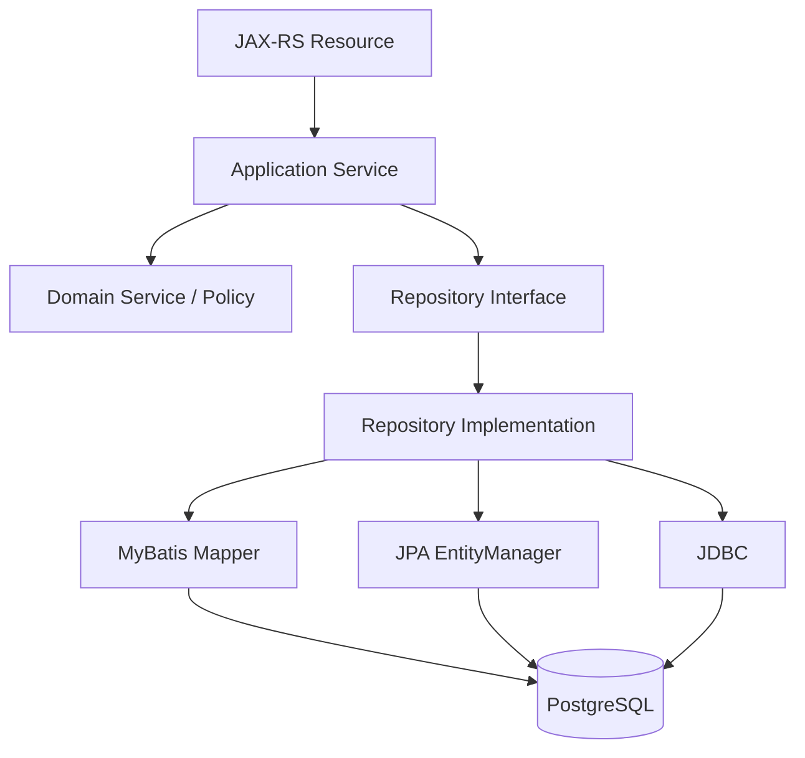
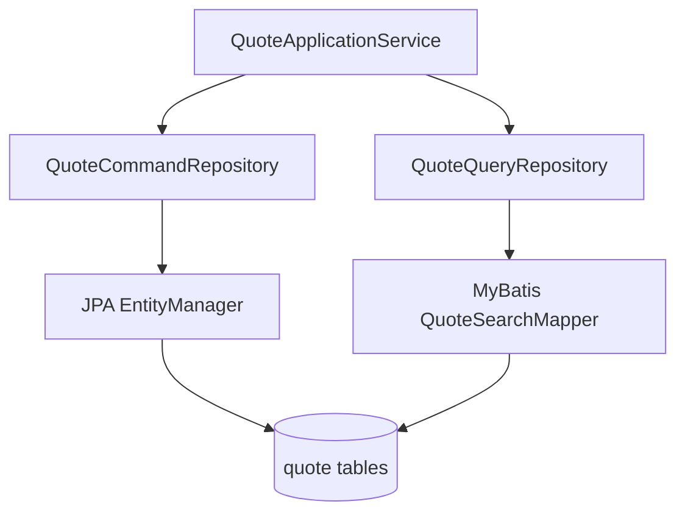

# Part 023 — Repository, DAO, and Service Boundary Design

Persistence layer yang sehat bukan hanya soal memilih JDBC, MyBatis, atau JPA. Masalah yang lebih mendasar adalah **di mana boundary data access ditempatkan**, siapa yang memiliki query, siapa yang membuka transaction, siapa yang boleh melihat entity, dan siapa yang bertanggung jawab terhadap correctness.

Di enterprise Java/JAX-RS system, repository dan DAO sering dipakai sebagai istilah yang tumpang tindih. Itu tidak selalu salah, tetapi berbahaya bila tim tidak punya definisi operasional. Tanpa boundary yang jelas, mapper MyBatis bisa dipanggil langsung dari resource/controller, `EntityManager` bisa bocor ke service, transaction bisa tersebar di banyak method kecil, dan business invariant bisa tercecer di API layer, repository, mapper XML, entity listener, trigger, serta validation annotation.

Part ini membahas cara mendesain boundary repository, DAO, service, mapper, dan EntityManager agar persistence layer tetap explicit, transaction-aware, dan mudah di-review.

---

## 1. Core Mental Model

Persistence boundary adalah kontrak antara application logic dan storage. Boundary ini harus menjawab beberapa pertanyaan:

1. **Siapa yang boleh membaca/menulis database?**
2. **Siapa yang memiliki query?**
3. **Siapa yang menentukan transaction boundary?**
4. **Object apa yang boleh keluar dari persistence layer?**
5. **Apakah caller tahu bahwa implementasi memakai MyBatis, JPA, JDBC, atau kombinasi?**
6. **Bagaimana write path menjaga invariant, audit, locking, dan error mapping?**
7. **Bagaimana read path menjaga performance, pagination, filtering, security, dan tenant isolation?**

Repository/DAO yang baik bukan bertujuan menyembunyikan database sepenuhnya. Itu tidak realistis di sistem production. Tujuan yang lebih benar adalah:

> Mengisolasi detail data access tanpa menghilangkan visibility terhadap transaction, SQL cost, consistency semantics, dan ownership data.

---

## 2. Repository vs DAO vs Mapper

Istilah ini sering dipakai bergantian, tetapi sebaiknya dibedakan secara fungsional.

### DAO

DAO atau Data Access Object biasanya berfokus pada operasi data-level:

- insert row
- update row
- select by id
- select by criteria
- delete/soft delete
- call stored procedure
- map query result ke object

DAO dekat dengan table, SQL, mapper, dan persistence technology.

Contoh karakteristik DAO:

```java
public interface QuoteDao {
    QuoteRecord findById(UUID quoteId);
    int updateStatus(UUID quoteId, QuoteStatus status, long expectedVersion);
    List<QuoteSummaryRow> search(QuoteSearchCriteria criteria);
}
```

DAO biasanya tidak memodelkan aggregate behavior. Ia lebih dekat ke data shape.

### Repository

Repository lebih dekat ke domain/application concept. Ia merepresentasikan collection of aggregates atau access boundary untuk use case tertentu.

Contoh:

```java
public interface QuoteRepository {
    Optional<Quote> findQuoteForRevision(QuoteId quoteId);
    void save(Quote quote);
    List<QuoteSearchResult> searchQuotes(QuoteSearchQuery query);
}
```

Repository dapat diimplementasikan dengan:

- MyBatis mapper
- JPA EntityManager
- JDBC langsung
- kombinasi mapper + manual mapping
- read model table
- external reference data cache

Repository lebih cocok menjadi boundary yang dilihat oleh service layer.

### Mapper

Mapper, terutama dalam MyBatis, adalah binding antara Java method dan SQL statement.

```java
public interface QuoteMapper {
    QuoteRow selectQuoteById(@Param("quoteId") UUID quoteId);
    int updateQuoteStatus(QuoteStatusUpdateCommand command);
}
```

Mapper bukan tempat business decision. Mapper adalah SQL ownership unit.

### EntityManager Boundary

`EntityManager` adalah low-level JPA runtime API. Ia memegang persistence context, entity lifecycle, dirty checking, flush, dan query execution. Membiarkan `EntityManager` tersebar ke seluruh service membuat JPA behavior sulit dikendalikan.

Dalam sistem yang disiplin, `EntityManager` sebaiknya berada di adapter/repository layer, bukan resource/controller layer.

---

## 3. Layering yang Sehat dalam Java/JAX-RS Service

Sebuah JAX-RS backend biasanya memiliki alur seperti ini:



Boundary penting:

| Layer | Boleh tahu apa? | Tidak boleh tahu apa? |
|---|---|---|
| JAX-RS Resource | HTTP, DTO, auth context, request validation | SQL, EntityManager, mapper XML, transaction internals |
| Application Service | Use case, transaction boundary, repository contract | Column alias, ResultSet, MyBatis XML detail |
| Domain Service | Business rule, invariant, policy | Database connection, SQL, persistence context |
| Repository Interface | Domain/query contract | Concrete mapper/entity implementation |
| Repository Implementation | MyBatis/JPA/JDBC detail | HTTP semantics |
| Mapper/EntityManager/JDBC | SQL/entity persistence mechanics | Business orchestration |

Kunci desainnya: **service layer mengorkestrasi use case, repository layer mengorkestrasi persistence mechanics**.

---

## 4. Resource Layer Tidak Boleh Menjadi Persistence Orchestrator

JAX-RS resource sebaiknya tidak langsung melakukan ini:

```java
@Path("/quotes")
public class QuoteResource {
    @Inject QuoteMapper quoteMapper;

    @POST
    public Response submit(SubmitQuoteRequest request) {
        quoteMapper.insertQuote(...);
        quoteMapper.insertQuoteItem(...);
        quoteMapper.updateStatus(...);
        return Response.ok().build();
    }
}
```

Masalahnya:

- HTTP layer menjadi tahu persistence detail.
- Transaction boundary tidak jelas.
- Error mapping bercampur dengan data access.
- Sulit menambahkan audit/outbox/idempotency.
- Sulit mengetes use case tanpa HTTP.
- Sulit mengganti MyBatis/JPA/JDBC implementation.

Lebih sehat:

```java
@Path("/quotes")
public class QuoteResource {
    @Inject QuoteApplicationService quoteApplicationService;

    @POST
    public Response submit(SubmitQuoteRequest request) {
        SubmitQuoteResult result = quoteApplicationService.submitQuote(request);
        return Response.status(Response.Status.CREATED).entity(result).build();
    }
}
```

Resource menerjemahkan HTTP ke application command, bukan mengatur database writes.

---

## 5. Application Service sebagai Transaction Boundary Owner

Application service adalah tempat natural untuk transaction boundary karena ia tahu satu use case penuh.

Contoh:

```java
public class QuoteApplicationService {
    private final QuoteRepository quoteRepository;
    private final OutboxRepository outboxRepository;

    @Transactional
    public SubmitQuoteResult submitQuote(SubmitQuoteCommand command) {
        Quote quote = quoteRepository.findDraftForUpdate(command.quoteId())
            .orElseThrow(() -> new QuoteNotFoundException(command.quoteId()));

        quote.submit(command.submittedBy());

        quoteRepository.save(quote);
        outboxRepository.append(QuoteSubmittedEvent.from(quote));

        return SubmitQuoteResult.from(quote);
    }
}
```

Kenapa transaction cocok di sini?

- Use case tahu semua write yang harus atomik.
- Outbox dan domain update bisa commit bersama.
- Retry/error mapping bisa dikaitkan dengan use case.
- Repository tetap fokus pada persistence.

Anti-pattern umum:

```java
@Transactional
public void repositoryMethodA() { ... }

@Transactional
public void repositoryMethodB() { ... }

public void serviceMethod() {
    repositoryMethodA();
    repositoryMethodB();
}
```

Jika transaction hanya tersebar di repository method, service sulit memastikan bahwa beberapa operasi berada dalam satu atomic unit.

---

## 6. Repository Interface: Contract, Not Technology Leak

Repository interface harus menyatakan kebutuhan use case, bukan detail SQL/framework.

Kurang baik:

```java
public interface QuoteRepository {
    List<QuoteEntity> findByNativeSql(String sql);
    EntityManager getEntityManager();
    QuoteMapper mapper();
}
```

Lebih baik:

```java
public interface QuoteRepository {
    Optional<Quote> findDraftForUpdate(QuoteId quoteId);
    void save(Quote quote);
    boolean existsActiveQuoteForCustomer(CustomerId customerId);
}
```

Untuk query/read model:

```java
public interface QuoteQueryRepository {
    Page<QuoteSearchResult> search(QuoteSearchQuery query);
    Optional<QuoteDetailView> findDetailView(QuoteId quoteId);
}
```

Repository contract sebaiknya menyiratkan semantic:

- `findDraftForUpdate` berarti locking atau concurrency control mungkin terjadi.
- `save` berarti aggregate lifecycle disimpan.
- `search` berarti read-only query/projection.
- `append` pada outbox berarti insert-only event record.

Nama method adalah bagian dari design. Jangan membuat nama generik yang menyembunyikan behavior penting.

---

## 7. Command Repository vs Query Repository

Dalam banyak enterprise system, memisahkan command repository dan query repository membuat boundary lebih jelas.

### Command Repository

Fokus pada write path dan aggregate lifecycle:

```java
public interface QuoteCommandRepository {
    Optional<Quote> findForUpdate(QuoteId quoteId);
    void save(Quote quote);
}
```

Concern utama:

- transaction correctness
- optimistic/pessimistic lock
- invariant
- audit
- outbox
- versioning
- write consistency

### Query Repository

Fokus pada read path, search, projection, reporting, pagination:

```java
public interface QuoteQueryRepository {
    Page<QuoteSearchResult> search(QuoteSearchQuery query);
    QuoteDetailView getDetailView(QuoteId quoteId);
}
```

Concern utama:

- SQL performance
- index usage
- dynamic filtering
- pagination
- DTO projection
- tenant/security filter
- data privacy

Pemisahan ini sangat membantu ketika JPA dan MyBatis coexist:

- JPA dapat dipakai untuk aggregate command lifecycle.
- MyBatis dapat dipakai untuk read model/projection/reporting query.

Yang berbahaya adalah ketika keduanya sama-sama menjadi write model untuk aggregate/table yang sama tanpa ownership jelas.

---

## 8. Repository Implementation dengan MyBatis

Contoh repository implementation yang menggunakan MyBatis mapper:

```java
public class MyBatisQuoteQueryRepository implements QuoteQueryRepository {
    private final QuoteMapper quoteMapper;

    @Override
    public Page<QuoteSearchResult> search(QuoteSearchQuery query) {
        List<QuoteSearchResult> rows = quoteMapper.searchQuotes(query);
        long total = quoteMapper.countQuotes(query);
        return Page.of(rows, total, query.page(), query.size());
    }
}
```

Prinsip:

- Mapper method tetap SQL-level.
- Repository method tetap use-case/query-level.
- Repository boleh melakukan mapping tipis ke Page/result object.
- Repository tidak boleh memuat business workflow panjang.

Untuk command path:

```java
public class MyBatisQuoteCommandRepository implements QuoteCommandRepository {
    private final QuoteMapper quoteMapper;
    private final QuoteItemMapper quoteItemMapper;

    @Override
    public Optional<Quote> findForUpdate(QuoteId quoteId) {
        QuoteRow quoteRow = quoteMapper.selectQuoteForUpdate(quoteId.value());
        List<QuoteItemRow> itemRows = quoteItemMapper.selectItemsByQuoteId(quoteId.value());
        return QuoteAssembler.toDomain(quoteRow, itemRows);
    }

    @Override
    public void save(Quote quote) {
        int updated = quoteMapper.updateQuoteWithVersion(QuoteRow.from(quote));
        if (updated != 1) {
            throw new OptimisticConcurrencyException("Quote was modified by another transaction");
        }
        quoteItemMapper.replaceItems(QuoteItemRow.from(quote));
    }
}
```

MyBatis repository harus explicit terhadap:

- jumlah query
- lock SQL
- version check
- affected row count
- mapping domain ↔ row/projection
- transaction expectation

---

## 9. Repository Implementation dengan JPA

Contoh repository dengan JPA:

```java
public class JpaQuoteCommandRepository implements QuoteCommandRepository {
    @PersistenceContext
    private EntityManager entityManager;

    @Override
    public Optional<Quote> findForUpdate(QuoteId quoteId) {
        QuoteEntity entity = entityManager.find(
            QuoteEntity.class,
            quoteId.value(),
            LockModeType.OPTIMISTIC
        );
        return Optional.ofNullable(entity).map(QuoteEntityMapper::toDomain);
    }

    @Override
    public void save(Quote quote) {
        QuoteEntity entity = QuoteEntityMapper.toEntity(quote);
        entityManager.merge(entity);
    }
}
```

Catatan penting: `merge` sering terlihat sederhana, tetapi bisa memunculkan surprise:

- entity detached disalin ke managed instance
- field null bisa menimpa data jika mapping tidak hati-hati
- dirty checking menentukan SQL update
- flush bisa terjadi sebelum query

Untuk domain yang menjadikan JPA entity sebagai aggregate model, repository bisa lebih langsung:

```java
public interface QuoteJpaRepository {
    Optional<QuoteEntity> findById(UUID quoteId);
    void persist(QuoteEntity quote);
}
```

Namun keputusan ini harus sadar trade-off. Jika entity keluar ke domain/application layer, service harus memahami lifecycle managed/detached/lazy loading.

---

## 10. EntityManager Tidak Boleh Menjadi Global Escape Hatch

Anti-pattern:

```java
public class QuoteApplicationService {
    @PersistenceContext
    EntityManager entityManager;

    public void doSomething(UUID quoteId) {
        QuoteEntity quote = entityManager.find(QuoteEntity.class, quoteId);
        entityManager.createNativeQuery("update ...").executeUpdate();
    }
}
```

Masalah:

- Service menjadi repository implementation implisit.
- Query ownership tidak jelas.
- Sulit menemukan semua SQL/native query.
- Persistence context stale risk meningkat.
- Mixing JPA native SQL dengan entity state rawan flush/stale bugs.

Lebih baik tempatkan native query di repository/DAO dengan nama jelas:

```java
public interface QuoteMaintenanceRepository {
    int expireQuotesOlderThan(Instant cutoff);
}
```

---

## 11. Transaction Script vs Domain Model

Dua gaya umum:

### Transaction Script

Application service berisi langkah procedural:

```java
@Transactional
public void approveQuote(UUID quoteId, UserId approver) {
    QuoteRow quote = quoteMapper.selectForUpdate(quoteId);
    if (!quote.status().equals("SUBMITTED")) {
        throw new InvalidQuoteStateException();
    }
    quoteMapper.updateStatus(quoteId, "APPROVED", approver);
    outboxMapper.insert(...);
}
```

Cocok untuk:

- use case sederhana
- data model procedural
- legacy schema
- high-SQL-visibility path
- MyBatis-heavy service

Risiko:

- business rule tersebar di service/SQL
- domain behavior sulit reusable
- invariant sulit dites sebagai object behavior

### Rich Domain / Aggregate Repository

Domain object memegang behavior:

```java
@Transactional
public void approveQuote(ApproveQuoteCommand command) {
    Quote quote = quoteRepository.findForUpdate(command.quoteId())
        .orElseThrow(QuoteNotFoundException::new);

    quote.approve(command.approver());

    quoteRepository.save(quote);
    outboxRepository.append(QuoteApprovedEvent.from(quote));
}
```

Cocok untuk:

- domain lifecycle kompleks
- invariant penting
- state machine
- quote/order lifecycle
- audit/compliance path

Risiko:

- mapping domain ↔ persistence lebih kompleks
- JPA entity lifecycle bisa bercampur dengan domain behavior
- over-engineering bila use case hanya CRUD/reporting

Tidak ada jawaban universal. Yang penting: pilih sadar trade-off dan dokumentasikan.

---

## 12. Read/Write Separation di Repository Boundary

Read path dan write path sering punya requirement berbeda.

| Concern | Write Path | Read Path |
|---|---|---|
| Primary goal | correctness | performance + UX |
| Model | aggregate/command | projection/view |
| Query | by id/lock/version | search/filter/join/report |
| Framework fit | JPA atau MyBatis | MyBatis/native SQL sering kuat |
| Transaction | required | read-only/short |
| Failure | invariant breach | slow query/wrong page |
| Testing | concurrency/rollback | mapping/query count/index |

Menyatukan semuanya dalam satu `QuoteRepository` besar biasanya berakhir menjadi god repository.

Lebih sehat:

```java
public interface QuoteCommandRepository { ... }
public interface QuoteQueryRepository { ... }
public interface QuoteAuditRepository { ... }
public interface QuoteOutboxRepository { ... }
```

Namun jangan memecah terlalu dini. Pisahkan ketika concern-nya benar-benar berbeda.

---

## 13. Leaky Abstraction: Mana yang Buruk, Mana yang Perlu

Tidak semua leak buruk. Persistence abstraction yang terlalu bersih sering berbohong.

Contoh leak yang buruk:

```java
List<QuoteEntity> searchQuotes(...)
```

Jika entity JPA keluar ke API layer, lazy loading bisa terjadi saat serialization.

Contoh leak yang perlu:

```java
Optional<Quote> findForUpdate(QuoteId quoteId);
```

Nama `ForUpdate` sengaja membocorkan concurrency semantic. Ini baik karena caller perlu tahu bahwa method ini mengambil lock atau versi khusus.

Contoh lain leak yang sehat:

```java
Page<QuoteSearchResult> search(QuoteSearchQuery query);
Stream<QuoteExportRow> streamForExport(QuoteExportCriteria criteria);
```

`streamForExport` memberi sinyal bahwa connection/transaction/resource lifetime harus diperhatikan.

Prinsipnya:

> Sembunyikan detail implementation. Jangan sembunyikan semantic correctness dan performance.

---

## 14. Boundary untuk MyBatis + JPA Coexistence

Jika sistem memakai MyBatis dan JPA bersama, boundary harus lebih tegas.

Contoh sehat:



Aturan minimal:

1. Command repository bertanggung jawab pada aggregate lifecycle.
2. Query repository bertanggung jawab pada projection/read model.
3. Tidak ada dua write model untuk table/aggregate yang sama tanpa aturan eksplisit.
4. Jika MyBatis membaca data yang baru diubah JPA dalam transaction sama, lakukan flush eksplisit sebelum read.
5. Jika MyBatis mengubah data yang sudah ada dalam persistence context JPA, lakukan clear/refresh atau hindari pola itu.
6. Jangan mengaktifkan second-level cache untuk entity yang juga dimutasi MyBatis kecuali ada invalidation strategy kuat.

Contoh rawan:

```java
@Transactional
public void updateQuote(UUID quoteId) {
    QuoteEntity entity = entityManager.find(QuoteEntity.class, quoteId);
    entity.changeStatus(APPROVED);

    quoteMapper.updateDiscount(quoteId, BigDecimal.TEN);

    // entity mungkin stale terhadap discount
    // flush order bisa menghasilkan update yang tidak diharapkan
}
```

Boundary yang sehat mencegah service melakukan orchestration campuran seperti ini secara bebas.

---

## 15. Repository Method Naming sebagai Correctness Tool

Nama method repository harus membantu reviewer memahami behavior.

Kurang baik:

```java
Quote get(UUID id);
void update(Quote quote);
List<Quote> list(Filter filter);
```

Lebih baik:

```java
Optional<Quote> findDraftForUpdate(QuoteId quoteId);
void saveWithOptimisticVersion(Quote quote);
Page<QuoteSearchResult> searchActiveQuotes(QuoteSearchQuery query);
boolean existsSubmittedQuoteForCustomer(CustomerId customerId);
void appendOutboxEvent(DomainEvent event);
```

Nama yang baik menyiratkan:

- lock atau tidak
- active/soft-deleted filter
- tenant/security filter
- projection vs aggregate
- command vs query
- idempotency behavior
- expected cardinality

---

## 16. Boundary dan PostgreSQL

Repository design harus memperhatikan PostgreSQL behavior.

Contoh:

- `findForUpdate` harus jelas memakai `SELECT ... FOR UPDATE`, `NOWAIT`, atau optimistic version.
- Search repository harus tahu index yang mendukung filter/sort.
- Batch repository harus tahu lock duration dan transaction size.
- Streaming repository harus tahu cursor/fetch size dan connection lifetime.
- JSONB-heavy query sebaiknya tidak dipaksa masuk JPA entity relationship bila SQL PostgreSQL lebih natural.

Repository yang baik tidak hanya menyembunyikan PostgreSQL. Ia mengekspresikan semantic PostgreSQL yang penting ke contract.

---

## 17. Boundary dan Microservices/Event-Driven Architecture

Dalam microservices, repository boundary harus sejalan dengan data ownership.

Anti-pattern:

```java
public interface CustomerRepository {
    Customer findCustomerFromAnotherServiceDatabase(UUID customerId);
}
```

Jika service membaca database service lain secara langsung, repository menyembunyikan coupling berbahaya.

Alternatif:

- gunakan API call ke owning service
- gunakan replicated read model
- gunakan reference data table yang ownership-nya jelas
- gunakan event-driven projection

Untuk event-driven write path:

```java
@Transactional
public void submitQuote(SubmitQuoteCommand command) {
    Quote quote = quoteRepository.findForUpdate(command.quoteId());
    quote.submit();
    quoteRepository.save(quote);
    outboxRepository.append(QuoteSubmittedEvent.from(quote));
}
```

Outbox repository adalah bagian dari persistence boundary karena event publication harus terikat dengan database transaction.

---

## 18. Boundary dan Kubernetes/Cloud Runtime

Repository design juga berdampak pada runtime:

- Repository method yang melakukan banyak query kecil memperbesar network round trip antara pod dan database.
- Transaction panjang menahan connection pool lebih lama.
- Streaming method menahan connection selama response berlangsung.
- Batch method besar dapat membuat pod memory pressure.
- Query repository yang tidak predictable menyulitkan autoscaling karena bottleneck sebenarnya ada di database.

Karena itu method repository yang mahal harus terlihat dari namanya atau dokumentasinya:

```java
Stream<QuoteExportRow> streamLargeQuoteExport(...);
int bulkExpireQuotes(...);
Page<QuoteSearchResult> searchWithComplexFilters(...);
```

---

## 19. Failure Modes

### 19.1 Resource Memanggil Mapper Langsung

Gejala:

- duplicate transaction logic
- inconsistent error mapping
- sulit test use case
- SQL tersebar di HTTP layer

Deteksi:

- search injection mapper/entity manager di resource package
- lihat resource yang melakukan banyak persistence call

Perbaikan:

- pindahkan orchestration ke application service
- resource hanya convert HTTP request/response

### 19.2 Repository Menjadi God Object

Gejala:

- satu repository punya ratusan method
- command, search, export, audit, batch bercampur
- sulit tahu ownership

Deteksi:

- class/interface terlalu besar
- banyak dependency mapper/entity

Perbaikan:

- pisahkan command/query/audit/batch repository
- split berdasarkan aggregate/use case

### 19.3 EntityManager Bocor ke Service

Gejala:

- native query tersebar
- `flush`, `clear`, `merge` dipanggil dari service acak
- stale state sulit ditelusuri

Deteksi:

- search `EntityManager` di service/resource package

Perbaikan:

- bungkus dalam repository implementation
- expose semantic method

### 19.4 Mapper Dipakai sebagai Domain Service

Gejala:

- mapper method bernama seperti business action
- SQL mengandung banyak business branching
- service hanya pass-through

Deteksi:

- mapper XML sangat kompleks
- conditional SQL merepresentasikan business workflow

Perbaikan:

- pindahkan rule ke application/domain service
- mapper tetap data operation

### 19.5 Transaction Boundary Tersembunyi

Gejala:

- repository method masing-masing transactional
- service method tidak jelas atomicity-nya
- partial commit tidak diharapkan

Deteksi:

- review annotation transaction di repository/service
- tracing transaction logs jika tersedia

Perbaikan:

- jadikan application service sebagai transaction owner
- repository tidak membuka transaction baru kecuali explicit reason

---

## 20. Debugging Boundary Problem

Saat menemukan bug persistence, tanyakan berurutan:

1. Request masuk ke resource mana?
2. Application service mana yang menjalankan use case?
3. Di mana transaction dimulai dan selesai?
4. Repository mana yang dipanggil?
5. Apakah repository memakai MyBatis, JPA, JDBC, atau kombinasi?
6. SQL apa yang sebenarnya dieksekusi?
7. Apakah ada flush otomatis?
8. Apakah ada lock/version check?
9. Apakah ada cache/persistence context stale?
10. Apakah error database dipetakan benar?
11. Apakah outbox/event commit bersama data utama?
12. Apakah read path melewati filter tenant/soft delete/security?

Jika jawabannya tersebar di banyak class tanpa ownership jelas, masalahnya bukan hanya bug implementation. Masalahnya adalah boundary design.

---

## 21. Trade-Offs

### Repository Abstraction Terlalu Tipis

Kelebihan:

- mudah melihat SQL/framework
- sedikit boilerplate

Kekurangan:

- persistence detail bocor
- service terlalu tahu mapper/entity
- sulit enforce convention

### Repository Abstraction Terlalu Tebal

Kelebihan:

- service bersih
- implementation bisa diganti
- domain contract jelas

Kekurangan:

- SQL cost tersembunyi
- abstraction bisa bohong
- debugging lebih sulit bila naming buruk

### Command/Query Separation

Kelebihan:

- ownership jelas
- cocok untuk MyBatis+JPA coexistence
- performance read path lebih mudah dioptimalkan

Kekurangan:

- lebih banyak interface/class
- mapping tambahan
- perlu discipline naming

---

## 22. Code Review Checklist

Gunakan checklist ini saat review PR yang menyentuh repository/DAO/service boundary.

### Boundary

- Apakah JAX-RS resource hanya menangani HTTP concern?
- Apakah application service menjadi use case orchestrator?
- Apakah repository interface menyatakan semantic use case, bukan framework detail?
- Apakah mapper/EntityManager tidak bocor ke layer atas?

### Transaction

- Di mana transaction dimulai dan berakhir?
- Apakah semua write yang harus atomik berada dalam transaction yang sama?
- Apakah repository membuka transaction baru tanpa alasan jelas?
- Apakah ada call eksternal di dalam transaction?

### MyBatis/JPA

- Apakah MyBatis mapper hanya data access, bukan business workflow?
- Apakah EntityManager disembunyikan di repository implementation?
- Jika MyBatis dan JPA dipakai bersama, apakah ownership read/write jelas?
- Apakah ada risk stale persistence context atau cache conflict?

### Model Boundary

- Apakah repository mengembalikan domain object, projection, atau entity secara sadar?
- Apakah entity JPA keluar ke API serialization?
- Apakah read model dipisahkan dari write aggregate?

### PostgreSQL/Performance

- Apakah method repository menyembunyikan query mahal?
- Apakah pagination/filter/sort punya index support?
- Apakah method streaming/batch diberi nama dan handling resource yang jelas?
- Apakah query count dan SQL visibility cukup?

### Production Readiness

- Apakah error database dipetakan ke domain/HTTP error dengan benar?
- Apakah audit/outbox/idempotency terjaga?
- Apakah observability cukup untuk debugging production?
- Apakah ada integration/concurrency test untuk critical path?

---

## 23. Internal Verification Checklist

Gunakan daftar ini untuk mengecek codebase/team internal tanpa mengasumsikan detail CSG yang belum diverifikasi.

### Package and Ownership

- Cari package `repository`, `dao`, `mapper`, `entity`, `model`, `dto`, `service`.
- Identifikasi apakah repository interface dan implementation dipisah.
- Identifikasi mapper MyBatis berada di package apa.
- Identifikasi JPA entity berada di package apa.
- Identifikasi apakah ada shared persistence library internal.

### Resource and Service Boundary

- Cek apakah JAX-RS resource memanggil mapper/repository/entity manager langsung.
- Cek apakah application service punya transaction annotation/configuration.
- Cek apakah service method terlalu procedural atau terlalu pass-through.
- Cek apakah resource melakukan business decision yang seharusnya di service/domain.

### MyBatis Boundary

- Cek mapper interface yang dipakai langsung dari service.
- Cek mapper XML organization.
- Cek mapper yang terlalu besar.
- Cek duplicate mapper untuk table/use case yang sama.
- Cek naming method mapper apakah SQL-level atau business-level.

### JPA Boundary

- Cek penggunaan `EntityManager` di luar repository layer.
- Cek entity yang keluar ke resource/API DTO.
- Cek native query di service.
- Cek penggunaan `merge`, `flush`, `clear`, `detach`, `refresh`.

### Transaction Boundary

- Cek transaction annotation/config di service dan repository.
- Cek propagation rules.
- Cek call chain critical write path.
- Cek outbox/audit berada di transaction yang sama atau tidak.
- Cek external API/message publishing di dalam transaction.

### Read/Write Separation

- Cek apakah command dan query repository dipisah.
- Cek search/reporting query ada di repository khusus.
- Cek batch/export repository.
- Cek apakah read model/projection dipakai untuk query kompleks.

### Production Evidence

- Cek slow query dashboard.
- Cek incident notes terkait stale data, lock, deadlock, migration mismatch.
- Cek PR historis yang menyentuh repository/mapper/entity.
- Diskusi dengan senior engineer/DBA/platform/backend team tentang convention persistence internal.

---

## 24. Practical Heuristics

1. **Resource should not know database shape.**
2. **Application service should own transaction boundary.**
3. **Repository should expose semantic data operations.**
4. **Mapper should own SQL, not business workflow.**
5. **EntityManager should stay behind repository implementation.**
6. **Do not hide lock, streaming, batch, or expensive query behavior behind innocent method names.**
7. **Separate command and query when their concerns diverge.**
8. **Mix MyBatis and JPA only behind explicit ownership boundaries.**
9. **A repository abstraction that hides correctness semantics is dangerous.**
10. **A repository abstraction that hides implementation detail but exposes operational semantics is useful.**

---

## 25. Part Summary

Repository, DAO, mapper, and service boundary design determines whether persistence layer remains understandable under production pressure. The key is not to create beautiful abstractions. The key is to create boundaries that preserve:

- transaction correctness
- SQL visibility
- ownership clarity
- model separation
- performance awareness
- testability
- operational debuggability

For senior engineers, the most important question during review is not “does this repository compile?” but:

> Does this boundary make the data operation safer, clearer, and easier to reason about when production fails?

