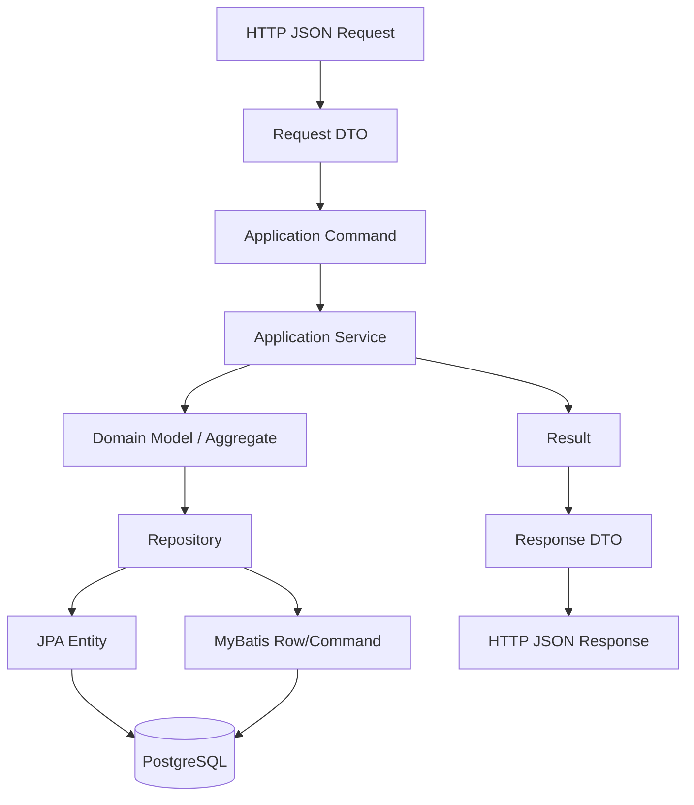
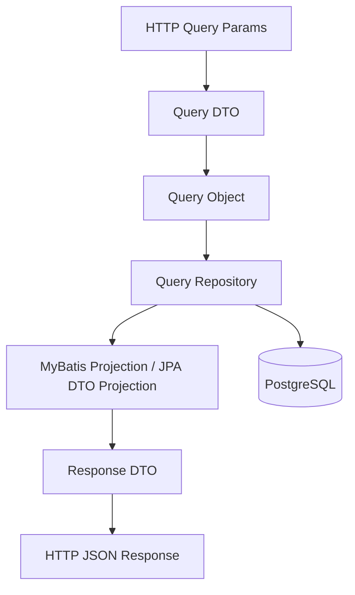

# Part 024 — DTO, Entity, Domain Model, and Persistence Model Boundary

Salah satu sumber technical debt terbesar di enterprise backend adalah model yang dipakai untuk terlalu banyak tujuan. Object yang awalnya dibuat sebagai response DTO kemudian dipakai sebagai query result. Entity JPA dipakai langsung sebagai API response. MyBatis projection dipakai sebagai domain object. Request DTO dipakai untuk update database. Akibatnya, persistence detail bocor ke API, business invariant tersebar, lazy loading muncul saat serialization, dan perubahan schema kecil bisa memecahkan contract eksternal.

Part ini membahas boundary antara API DTO, request/response DTO, domain model, persistence entity, MyBatis row/projection model, command model, query model, read model, dan mapping ownership.

Tujuannya bukan membuat layer sebanyak mungkin. Tujuannya adalah membuat model memiliki **alasan keberadaan yang jelas**.

---

## 1. Core Mental Model

Setiap model harus menjawab pertanyaan: **object ini mewakili apa, untuk siapa, dan pada lifecycle apa?**

Jenis model utama:

| Model | Tujuan | Pemilik | Risiko jika bocor |
|---|---|---|---|
| Request DTO | Mewakili input HTTP/API | Resource/API layer | API shape mengontrol domain/persistence |
| Response DTO | Mewakili output HTTP/API | Resource/API layer | Lazy loading, data leak, versioning sulit |
| Command Model | Mewakili intent use case | Application layer | Request mentah masuk domain/write path |
| Domain Model | Mewakili behavior/invariant bisnis | Domain/application layer | Persistence annotation/SQL concern masuk business rule |
| JPA Entity | Mewakili persistent entity lifecycle | Persistence layer atau domain jika sengaja | Lazy loading, dirty checking, flush surprise |
| MyBatis Row Model | Mewakili row/table result | Persistence layer | Table shape bocor ke service/API |
| Projection/View Model | Mewakili read query result | Query repository/API adapter | Bisa salah dipakai untuk write command |
| Read Model | Mewakili optimized query model | Query side/service | Stale/eventual consistency disalahpahami |

Prinsip utama:

> Jangan biarkan satu object memiliki terlalu banyak lifecycle.

---

## 2. Mengapa Boundary Model Penting

Boundary model penting karena masing-masing layer berubah karena alasan berbeda.

API DTO berubah karena:

- public/internal API contract
- client requirement
- backward compatibility
- field masking
- pagination/filtering UX

Domain model berubah karena:

- business rule
- state machine
- invariant
- lifecycle behavior
- policy decision

Persistence model berubah karena:

- schema evolution
- index/query optimization
- normalization/denormalization
- migration
- audit/soft delete/tenant field

Query/read model berubah karena:

- search requirement
- performance
- projection shape
- reporting/export
- dashboard

Jika semua concern menempel pada satu class, setiap perubahan menjadi high-risk.

---

## 3. Typical Flow dalam JAX-RS Backend

Alur sehat untuk command/write endpoint:



Alur sehat untuk query/read endpoint:



Command path dan query path boleh memakai model berbeda karena optimasinya berbeda.

---

## 4. API DTO

API DTO adalah contract dengan client. Dalam JAX-RS, DTO biasanya dipakai untuk JSON serialization/deserialization.

```java
public record SubmitQuoteRequest(
    UUID quoteId,
    String submittedBy,
    String comment
) {}
```

DTO API sebaiknya:

- stabil terhadap client compatibility
- eksplisit terhadap field yang boleh dikirim/diterima
- tidak mengandung persistence annotation
- tidak mengandung lazy relationship
- tidak menjadi JPA entity
- tidak menjadi MyBatis row model

Response DTO:

```java
public record QuoteResponse(
    UUID quoteId,
    String quoteNumber,
    String status,
    Instant createdAt,
    List<QuoteItemResponse> items
) {}
```

Response DTO harus dipilih secara sadar:

- apakah field boleh terlihat oleh caller?
- apakah field mengandung PII?
- apakah field harus masked?
- apakah field masih backward compatible?
- apakah field berasal dari source of truth atau read model?

---

## 5. Command Model

Command model mengubah request menjadi intent application-level.

```java
public record SubmitQuoteCommand(
    QuoteId quoteId,
    UserId submittedBy,
    Optional<String> comment,
    IdempotencyKey idempotencyKey
) {}
```

Kenapa tidak langsung memakai request DTO?

Request DTO merepresentasikan bentuk HTTP. Command merepresentasikan intent use case.

Command dapat menambahkan:

- authenticated user
- tenant id
- idempotency key
- request metadata
- parsed value object
- normalized input
- validated enum/value

Resource layer melakukan transformasi:

```java
@POST
public Response submit(SubmitQuoteRequest request, @Context SecurityContext securityContext) {
    SubmitQuoteCommand command = new SubmitQuoteCommand(
        new QuoteId(request.quoteId()),
        UserId.from(securityContext.getUserPrincipal().getName()),
        Optional.ofNullable(request.comment()),
        IdempotencyKey.fromHeader(...)
    );

    SubmitQuoteResult result = quoteApplicationService.submit(command);
    return Response.status(Response.Status.CREATED)
        .entity(QuoteResponse.from(result))
        .build();
}
```

Command model membantu mencegah API contract mengontrol domain dan persistence secara langsung.

---

## 6. Domain Model

Domain model mewakili behavior dan invariant.

```java
public final class Quote {
    private final QuoteId id;
    private QuoteStatus status;
    private final List<QuoteItem> items;
    private long version;

    public void submit(UserId submittedBy) {
        if (status != QuoteStatus.DRAFT) {
            throw new InvalidQuoteStateException("Only draft quote can be submitted");
        }
        if (items.isEmpty()) {
            throw new QuoteInvariantViolation("Quote must have at least one item");
        }
        this.status = QuoteStatus.SUBMITTED;
    }
}
```

Domain model sebaiknya tidak peduli:

- nama table
- nama column
- JSON serialization
- MyBatis XML
- Hibernate proxy
- lazy loading
- SQL query

Namun dalam banyak enterprise Java system, JPA entity kadang juga menjadi domain model. Ini bisa diterima jika dilakukan sadar, tetapi ada trade-off besar.

---

## 7. JPA Entity sebagai Domain Model vs Persistence Model

Ada dua pendekatan.

### Pendekatan A — JPA Entity sebagai Domain Model

```java
@Entity
@Table(name = "quote")
public class QuoteEntity {
    @Id
    private UUID id;

    @Enumerated(EnumType.STRING)
    private QuoteStatus status;

    @Version
    private long version;

    public void submit() {
        if (status != QuoteStatus.DRAFT) {
            throw new InvalidQuoteStateException();
        }
        status = QuoteStatus.SUBMITTED;
    }
}
```

Kelebihan:

- mapping lebih sedikit
- dirty checking natural
- lifecycle aggregate dan persistence bersatu
- cocok untuk CRUD/aggregate lifecycle yang tidak terlalu kompleks

Kekurangan:

- domain bergantung pada JPA/Hibernate
- lazy loading bisa masuk business logic
- entity lifecycle managed/detached harus dipahami
- serialization entity berbahaya
- schema concern masuk domain class
- testing domain mungkin butuh JPA setup bila entity behavior memakai persistence behavior

### Pendekatan B — Domain Model Terpisah dari JPA Entity

```java
public final class Quote { ... }

@Entity
@Table(name = "quote")
public class QuoteEntity { ... }
```

Mapper:

```java
public final class QuoteEntityMapper {
    public static Quote toDomain(QuoteEntity entity) { ... }
    public static QuoteEntity toEntity(Quote quote) { ... }
}
```

Kelebihan:

- domain bersih dari persistence annotation
- cocok untuk complex business lifecycle
- lebih mudah mengganti persistence strategy
- memudahkan test domain murni

Kekurangan:

- mapping boilerplate
- risk mapping bug
- perlu strategi version/audit/id consistency
- save/merge semantics lebih kompleks

Tidak ada pendekatan universal. Yang buruk adalah memakai entity sebagai domain tanpa menyadari konsekuensi lifecycle JPA.

---

## 8. MyBatis Row Model dan Projection

MyBatis biasanya bekerja lebih baik dengan explicit row/projection model.

```java
public record QuoteRow(
    UUID id,
    String quoteNumber,
    String status,
    long version,
    Instant createdAt,
    Instant updatedAt
) {}
```

Untuk query/search:

```java
public record QuoteSearchResult(
    UUID quoteId,
    String quoteNumber,
    String customerName,
    String status,
    Instant submittedAt
) {}
```

Perbedaan penting:

- `QuoteRow` dekat dengan table/write mapping.
- `QuoteSearchResult` adalah projection untuk read use case.
- `Quote` domain model berisi behavior/invariant.
- `QuoteResponse` adalah API output.

Jangan pakai `QuoteSearchResult` untuk update command. Projection sering tidak lengkap dan tidak membawa invariant/version/lock info yang diperlukan.

---

## 9. Persistence Entity dan Table Shape

Persistence model sering harus mengikuti database reality:

- normalized table
- legacy column naming
- audit columns
- soft delete flags
- tenant discriminator
- version column
- generated id/sequence
- JSONB columns
- denormalized reporting fields

Contoh:

```java
@Entity
@Table(name = "quote_header")
public class QuoteEntity {
    @Id
    @Column(name = "quote_id")
    private UUID id;

    @Column(name = "quote_no")
    private String quoteNumber;

    @Column(name = "status_cd")
    private String statusCode;

    @Column(name = "tenant_id")
    private String tenantId;

    @Version
    @Column(name = "row_version")
    private long version;
}
```

Domain tidak harus ikut nama `status_cd` atau `row_version`. Persistence model boleh “kotor” karena ia merepresentasikan database contract.

---

## 10. DTO Anti-Patterns

### 10.1 JPA Entity sebagai API Response

```java
@GET
@Path("/{id}")
public QuoteEntity get(@PathParam("id") UUID id) {
    return quoteRepository.findEntity(id);
}
```

Risiko:

- lazy loading saat serialization
- infinite recursion pada bidirectional relationship
- expose internal columns
- expose PII/audit fields
- client contract ikut berubah saat entity berubah
- dirty checking risk jika entity managed dan dimutasi

Lebih baik:

```java
public QuoteResponse get(UUID id) {
    QuoteDetailView view = quoteQueryRepository.getDetailView(new QuoteId(id));
    return QuoteResponse.from(view);
}
```

### 10.2 Request DTO Langsung untuk Persistence Update

```java
quoteMapper.updateQuote(request);
```

Risiko:

- client bisa mengisi field yang tidak seharusnya
- missing normalization
- missing authenticated user/tenant context
- validation tidak lengkap
- API shape mengikat SQL update

Lebih baik ubah ke command:

```java
UpdateQuoteCommand command = UpdateQuoteCommand.from(request, authenticatedUser, tenantId);
quoteApplicationService.update(command);
```

### 10.3 MyBatis Projection sebagai Domain Object

```java
QuoteSearchResult quote = quoteMapper.search(...).get(0);
quote.approve(); // projection bukan aggregate
```

Projection tidak menjamin invariant lengkap. Ia mungkin hanya sebagian field.

---

## 11. Mapping Ownership

Mapping harus punya lokasi dan pemilik yang jelas.

Pilihan umum:

### Manual Mapper

```java
public final class QuoteMapper {
    public static QuoteResponse toResponse(QuoteDetailView view) { ... }
    public static Quote toDomain(QuoteRow row, List<QuoteItemRow> items) { ... }
}
```

Kelebihan:

- explicit
- mudah debug
- tidak ada magic

Kekurangan:

- boilerplate
- risk lupa field

### MapStruct

```java
@Mapper(componentModel = "cdi")
public interface QuoteDtoMapper {
    QuoteResponse toResponse(QuoteDetailView view);
}
```

Kelebihan:

- compile-time generated
- mengurangi boilerplate
- explicit enough bila dikonfigurasi ketat

Kekurangan:

- mapping tersembunyi di generated code
- nested mapping bisa membingungkan
- perlu policy untuk unmapped fields

### Constructor/Factory

```java
public static QuoteResponse from(QuoteDetailView view) { ... }
```

Kelebihan:

- simple untuk mapping kecil
- dekat dengan target model

Kekurangan:

- bisa membuat DTO tahu terlalu banyak source model
- bisa menjadi besar untuk object kompleks

Prinsip:

> Mapping bukan noise. Mapping adalah boundary enforcement.

---

## 12. Boundary dengan Transaction

Model boundary memengaruhi transaction correctness.

Jika JPA entity keluar dari transaction:

```java
QuoteEntity entity = quoteRepository.findById(id);
return QuoteResponse.from(entity); // lazy field accessed outside transaction
```

Risiko:

- LazyInitializationException
- accidental additional query
- stale detached state

Jika domain model terpisah:

```java
@Transactional
public QuoteDetailResult getDetail(QuoteId id) {
    QuoteDetailView view = quoteQueryRepository.getDetailView(id);
    return QuoteDetailResult.from(view);
}
```

Response dibentuk dari projection yang lengkap. Tidak ada lazy loading setelah transaction selesai.

Untuk command path, jangan mapping request langsung ke managed entity lalu merge tanpa kontrol:

```java
QuoteEntity entity = dtoMapper.toEntity(request);
entityManager.merge(entity);
```

Risiko:

- overwrite field yang tidak ada di request
- null field menjadi update
- bypass domain invariant
- version/tenant/audit salah

Lebih aman:

1. Load aggregate/entity existing.
2. Jalankan behavior/update method.
3. Persist via repository.
4. Commit transaction.

---

## 13. Boundary dengan PostgreSQL

PostgreSQL schema sering memiliki concern yang tidak cocok masuk API/domain langsung:

- `tenant_id`
- `deleted_at`
- `created_by`
- `updated_by`
- `row_version`
- `effective_from`
- `effective_to`
- JSONB internal metadata
- generated columns
- trigger-maintained columns

DTO response tidak harus menampilkan semuanya.

Domain model hanya perlu field yang relevan untuk behavior.

Persistence model harus membawa field yang diperlukan untuk correctness:

- version untuk optimistic locking
- tenant id untuk isolation
- deleted flag untuk soft delete
- audit fields untuk compliance
- effective dating untuk temporal correctness

Kesalahan umum: menghapus field dari model Java karena tidak terlihat di API, padahal field itu penting untuk persistence correctness.

---

## 14. Boundary dengan Microservices dan Event-Driven Systems

Dalam event-driven architecture, model tambahan muncul:

- event payload
- outbox row
- inbox row
- read model projection
- integration DTO

Jangan samakan event payload dengan entity atau API DTO.

```java
public record QuoteSubmittedEventPayload(
    UUID quoteId,
    String quoteNumber,
    String status,
    Instant submittedAt
) {}
```

Event payload adalah contract integrasi. Ia harus:

- versioned
- backward compatible
- bebas dari lazy entity
- tidak expose field internal sembarangan
- cukup untuk consumer
- tidak terlalu bergantung pada table shape

Outbox row berbeda lagi:

```java
public record OutboxMessageRow(
    UUID id,
    String aggregateType,
    UUID aggregateId,
    String eventType,
    String payloadJson,
    Instant createdAt,
    String status
) {}
```

Outbox row adalah persistence/infrastructure model, bukan domain event murni.

---

## 15. Boundary dengan Kubernetes/Cloud Runtime

Model boundary juga berpengaruh pada runtime:

- Response DTO yang memicu lazy loading dapat menghasilkan query tambahan per item, memperburuk latency antar pod dan cloud database.
- Entity besar yang dikembalikan ke API meningkatkan serialization cost dan memory usage.
- Projection yang tepat mengurangi network transfer dari PostgreSQL ke service.
- Read model yang denormalized dapat mengurangi join mahal untuk endpoint high-traffic.
- DTO masking mencegah PII masuk log/tracing/APM.

Dalam cloud/hybrid deployment, latency dan throughput membuat model boundary bukan sekadar cleanliness. Ia berdampak langsung ke cost dan reliability.

---

## 16. Failure Modes

### 16.1 Lazy Loading Saat Serialization

Gejala:

- endpoint lambat tanpa perubahan business logic
- query count naik drastis
- `LazyInitializationException`
- recursive serialization

Penyebab:

- JPA entity dikembalikan sebagai response DTO
- relationship lazy diakses oleh serializer

Perbaikan:

- gunakan DTO/projection
- fetch data eksplisit di repository/query
- hindari entity keluar dari transaction boundary

### 16.2 API Contract Pecah Karena Entity Berubah

Gejala:

- field response berubah setelah migration/entity refactor
- client gagal parsing
- data internal muncul ke client

Penyebab:

- entity dipakai sebagai response contract

Perbaikan:

- pisahkan response DTO
- version API jika perlu
- tambahkan contract tests

### 16.3 Request Overposting

Gejala:

- client bisa mengubah field yang seharusnya server-controlled
- audit/status/tenant berubah tidak sah

Penyebab:

- request DTO langsung dipakai untuk entity/update SQL

Perbaikan:

- pakai command model
- whitelist field update
- set tenant/user/status dari server context

### 16.4 Projection Dipakai untuk Write

Gejala:

- update kehilangan field
- version check hilang
- invariant tidak lengkap

Penyebab:

- read model/projection dianggap domain aggregate

Perbaikan:

- pisahkan command aggregate dari query projection
- naming projection jelas: `View`, `Summary`, `SearchResult`

### 16.5 Mapping Bug

Gejala:

- field tertukar
- null tidak diharapkan
- enum salah konversi
- audit/version hilang

Penyebab:

- mapping manual/MapStruct tidak dites
- column alias ambigu
- DTO/entity field mirip tetapi semantic beda

Perbaikan:

- mapping unit test/integration test
- strict unmapped field policy
- explicit field naming

---

## 17. Debugging Model Boundary Problem

Saat menemukan data salah di response atau database, telusuri model flow:

1. Apa request DTO yang diterima?
2. Bagaimana request diubah menjadi command?
3. Apakah command membawa user/tenant/idempotency context?
4. Domain model/entity apa yang dimuat?
5. Apakah object tersebut managed JPA entity atau domain object biasa?
6. Mapping apa yang terjadi sebelum save?
7. Apakah MyBatis row/projection dipakai untuk write?
8. SQL apa yang dieksekusi?
9. Apa response DTO dibentuk dari entity, domain, atau projection?
10. Apakah serializer memicu lazy loading?
11. Apakah field PII/internal ikut keluar?
12. Apakah mapping punya test?

Boundary problem sering terlihat seperti “bug field”, tetapi akar masalahnya adalah model lifecycle yang tercampur.

---

## 18. Trade-Offs

### Satu Model untuk Semua Layer

Kelebihan:

- cepat dibuat
- sedikit mapping
- sedikit class

Kekurangan:

- coupling tinggi
- API mudah pecah
- lazy loading/data leak risk
- persistence change berdampak ke client
- invariant tersebar

Cocok hanya untuk prototype atau internal tool kecil, bukan mission-critical enterprise backend.

### Model Terpisah per Layer

Kelebihan:

- boundary jelas
- API stable
- domain lebih bersih
- persistence bisa evolve
- security/privacy lebih mudah dikontrol

Kekurangan:

- lebih banyak mapping
- lebih banyak class
- perlu convention kuat
- risk mapping bug

Cocok untuk sistem enterprise yang berubah jangka panjang.

### Hybrid

Gunakan pemisahan penuh untuk critical domain/write path, tetapi pakai projection langsung untuk read-only endpoint sederhana.

Contoh:

- Command path: Request DTO → Command → Domain → Persistence Model
- Query path: Query DTO → Query Object → SQL Projection → Response DTO

Ini sering menjadi kompromi paling efektif.

---

## 19. Naming Convention yang Membantu Boundary

Gunakan suffix yang jelas:

| Suffix | Makna |
|---|---|
| `Request` | HTTP request DTO |
| `Response` | HTTP response DTO |
| `Command` | Use case intent untuk write |
| `Query` | Search/filter request application-level |
| `Result` | Output application service |
| `Entity` | JPA persistence entity |
| `Row` | Table/SQL row representation |
| `View` | Read-only detail projection |
| `Summary` | Compact read projection |
| `SearchResult` | Search/list projection |
| `EventPayload` | Integration/event contract |
| `OutboxRow` | Outbox persistence row |

Nama bukan kosmetik. Nama membantu reviewer melihat lifecycle object.

---

## 20. Code Review Checklist

### API DTO

- Apakah request/response DTO terpisah dari entity?
- Apakah response tidak expose internal/audit/PII field tanpa sengaja?
- Apakah request tidak bisa mengubah server-controlled field?
- Apakah backward compatibility API diperhatikan?

### Command/Query Model

- Apakah request diubah menjadi command/query object?
- Apakah command membawa user, tenant, idempotency, dan metadata yang dibutuhkan?
- Apakah query object melakukan whitelist sorting/filtering?

### Domain Model

- Apakah invariant berada di domain/application layer yang tepat?
- Apakah domain object bebas dari serialization/persistence concern, jika memang dipisahkan?
- Jika JPA entity menjadi domain model, apakah lifecycle JPA dipahami?

### Persistence Model

- Apakah JPA entity merepresentasikan schema dengan benar?
- Apakah MyBatis Row/ResultMap tidak bocor ke API?
- Apakah version/tenant/soft delete/audit field tidak hilang dalam mapping?
- Apakah enum/converter/type handler konsisten?

### Mapping

- Apakah mapping location jelas?
- Apakah MapStruct/manual mapping punya test?
- Apakah unmapped field ditangani eksplisit?
- Apakah null handling jelas?

### Read/Write Separation

- Apakah projection hanya dipakai untuk read?
- Apakah write path memuat aggregate/entity yang lengkap untuk invariant?
- Apakah response DTO dibentuk dari projection yang tepat, bukan lazy entity?

### Security/Privacy

- Apakah PII dimasked/redacted?
- Apakah tenant id tidak bisa dimanipulasi dari request?
- Apakah logs tidak mencetak DTO sensitif?

---

## 21. Internal Verification Checklist

Gunakan checklist ini untuk codebase internal tanpa mengasumsikan detail CSG yang belum diverifikasi.

### Package Structure

- Cari package `dto`, `request`, `response`, `command`, `query`, `domain`, `entity`, `row`, `projection`, `view`.
- Cek apakah naming convention konsisten.
- Cek apakah DTO/entity/domain bercampur dalam package yang sama.

### API Boundary

- Cek JAX-RS resource return type.
- Cek apakah entity JPA dikembalikan langsung.
- Cek apakah MyBatis projection dikembalikan langsung atau dibungkus response DTO.
- Cek serialization annotation pada entity.

### Command Boundary

- Cek apakah request DTO langsung dikirim ke repository/mapper.
- Cek apakah command object membawa authenticated user/tenant/idempotency.
- Cek whitelist field update.
- Cek validation di request vs command vs domain.

### Domain Boundary

- Cek apakah domain model terpisah dari JPA entity.
- Jika tidak terpisah, cek apakah entity memiliki business behavior.
- Cek apakah lazy relationship dipakai dalam domain logic.
- Cek apakah domain tests butuh database atau tidak.

### Persistence Boundary

- Cek entity mapping ke table/column.
- Cek MyBatis Row/ResultMap classes.
- Cek projection classes untuk search/detail/export.
- Cek version/tenant/soft delete/audit mapping.

### Mapping Ownership

- Cek apakah MapStruct digunakan.
- Cek mapper manual location.
- Cek mapping tests.
- Cek policy untuk unmapped target/source fields.
- Cek null/default handling.

### Privacy and Compliance

- Cek PII fields di DTO/entity/log.
- Cek masking/tokenization/encryption boundary.
- Cek test data privacy.
- Cek response DTO untuk accidental data exposure.

### Production Evidence

- Cek incident terkait lazy loading, response data leak, mapping mismatch, stale entity, wrong DTO field.
- Cek PR historis yang mengubah entity lalu memecahkan API.
- Diskusi dengan senior engineer tentang convention: entity-as-domain atau separated domain model.

---

## 22. Practical Heuristics

1. **API DTO is not persistence model.**
2. **Request DTO is not command model.**
3. **JPA entity is not automatically domain model.**
4. **MyBatis projection is not aggregate.**
5. **Read model should not be used for write invariant.**
6. **Mapping is a boundary, not merely boilerplate.**
7. **Entity should not be serialized unless deliberately designed for it, which is rare in enterprise systems.**
8. **Every model should have one primary lifecycle.**
9. **Name models by lifecycle: Request, Response, Command, Query, Entity, Row, View, EventPayload.**
10. **When in doubt, protect external API and write correctness first.**

---

## 23. Part Summary

Model boundary is a data correctness tool. A class is not just a bag of fields; it carries lifecycle, ownership, transaction assumptions, serialization behavior, security exposure, and persistence semantics.

Senior engineers should review model design by asking:

- What layer owns this model?
- What lifecycle does it represent?
- Can it be safely serialized?
- Can it be safely persisted?
- Does it carry enough information for invariants?
- Does it expose too much information to clients?
- Does it hide version, tenant, audit, soft delete, or effective dating fields?
- Does mapping have tests?

The best persistence systems are not the ones with the fewest classes. They are the ones where each model has a clear reason to exist and does not accidentally become the contract for every layer.

