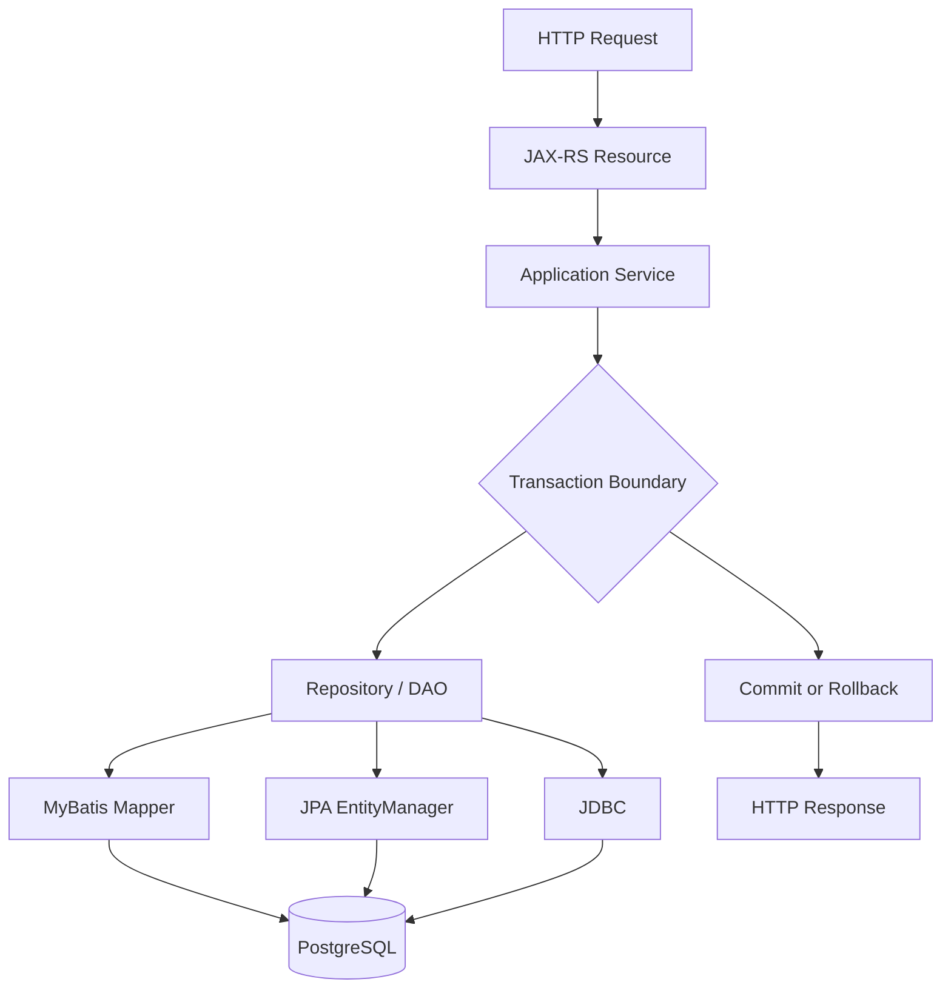
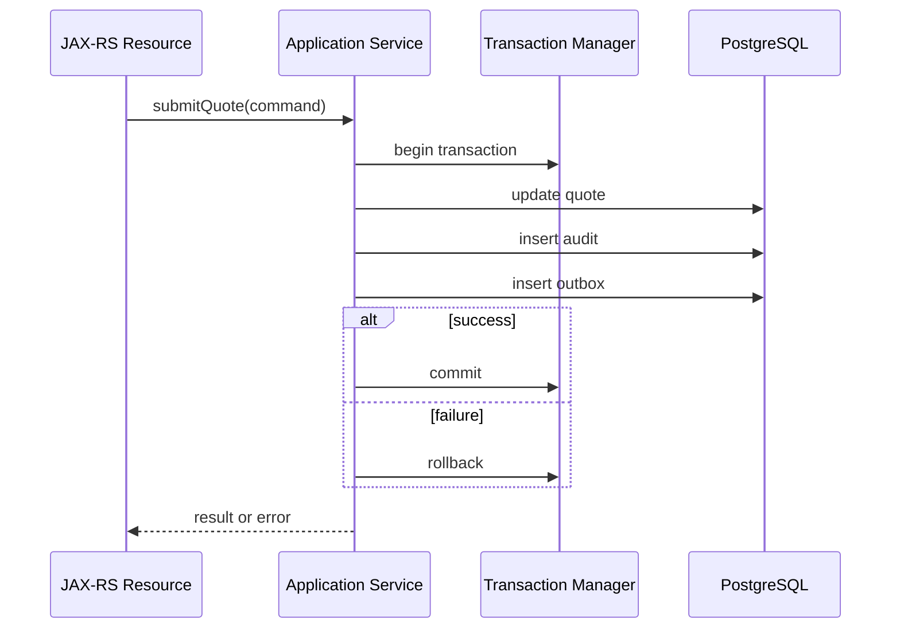
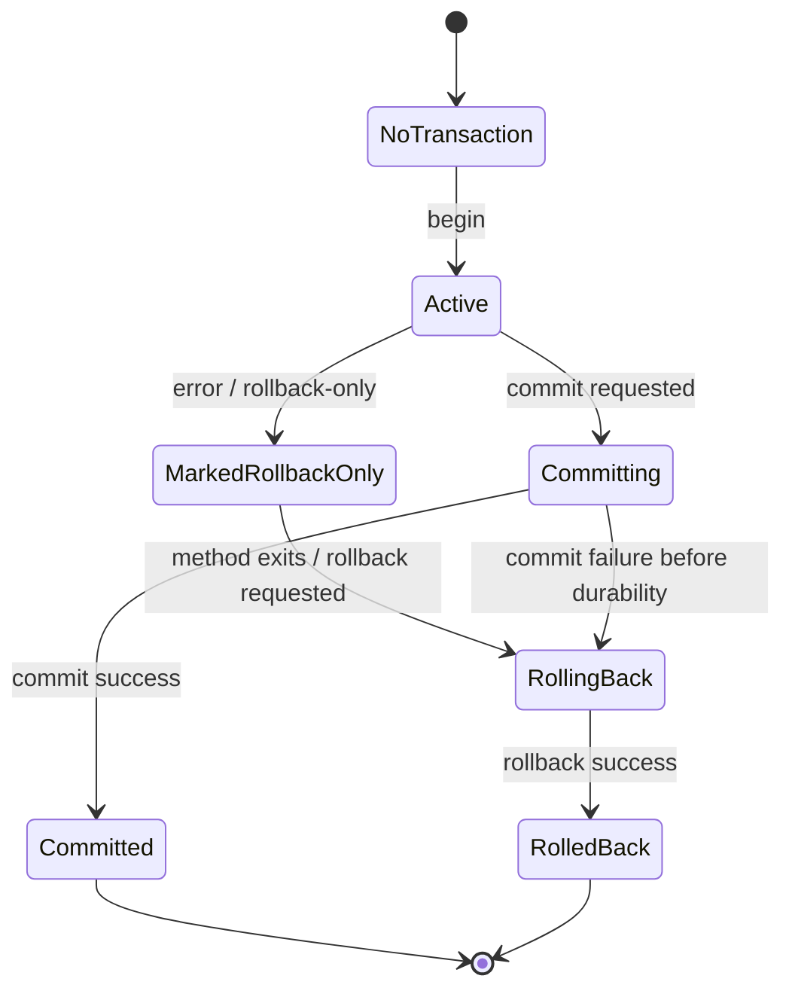
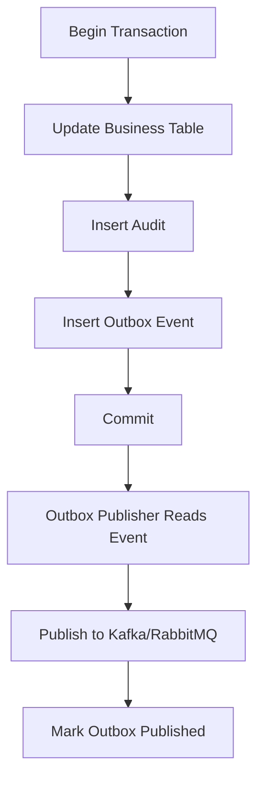

# Part 025 — Transaction Management Foundation

Persistence layer tidak bisa dipahami hanya dari repository, mapper, entity, atau SQL. Unit correctness yang paling penting adalah **transaction boundary**.

Banyak bug enterprise backend bukan terjadi karena query salah secara syntax, tetapi karena:

- data ditulis di luar boundary transaksi yang benar
- rollback tidak terjadi ketika business operation gagal
- sebagian perubahan commit sementara sebagian lain gagal
- external call dilakukan di dalam transaction terlalu lama
- JPA flush terjadi pada waktu yang tidak dipahami
- MyBatis update membaca state yang belum diflush oleh JPA
- event dipublish sebelum database commit
- retry dilakukan pada operasi yang tidak idempotent
- transaction timeout tidak dikonfigurasi
- lock dipegang terlalu lama karena service method terlalu besar

Part ini membangun fondasi transaction management untuk Java/JAX-RS enterprise systems yang memakai PostgreSQL, JDBC, MyBatis, JPA/Hibernate, migration, event-driven consistency, dan production operations.

Fokusnya bukan annotation tertentu. Fokusnya adalah **apa yang sebenarnya dijamin oleh transaksi, kapan jaminan itu berlaku, dan kapan jaminan itu runtuh**.

---

## 1. Core Mental Model

Transaction adalah boundary untuk perubahan data yang harus terlihat sebagai satu unit.

Secara sederhana:

> Transaction adalah janji bahwa beberapa operasi database diperlakukan sebagai satu perubahan logis: semuanya commit, atau semuanya rollback.

Dalam enterprise backend, transaction bukan hanya konsep database. Transaction adalah bagian dari contract use case.

Contoh use case:

- submit quote
- approve quote
- reserve inventory
- create order
- attach order item
- record audit entry
- insert outbox event
- update workflow state
- persist idempotency result

Pertanyaan yang harus selalu dijawab:

1. Operasi apa saja yang harus atomic?
2. Operasi apa saja yang boleh terjadi di luar transaction?
3. Kapan commit terjadi?
4. Kapan rollback terjadi?
5. Exception apa yang menyebabkan rollback?
6. Lock apa yang dipegang selama transaction?
7. Berapa lama transaction hidup?
8. Apakah ada event/message yang harus konsisten dengan commit?
9. Apakah ada JPA persistence context yang menyimpan state lama?
10. Apakah MyBatis dan JPA menyentuh data yang sama di boundary ini?

Transaction boundary adalah boundary correctness, bukan sekadar implementation detail.

---

## 2. Transaction dalam Java/JAX-RS Request Lifecycle

Dalam aplikasi JAX-RS, request HTTP biasanya masuk melalui resource class, lalu diteruskan ke application service, domain service, repository/DAO/mapper/entity manager, kemudian ke PostgreSQL.



Boundary yang paling umum dan sehat ada di **application service method**, bukan di resource dan bukan di individual mapper method.

Kenapa?

Resource layer bertanggung jawab atas:

- HTTP parsing
- authentication context
- request DTO validation
- response mapping
- HTTP status mapping

Repository/mapper layer bertanggung jawab atas:

- query execution
- persistence mapping
- database interaction

Application service bertanggung jawab atas:

- use case orchestration
- domain invariant
- transaction boundary
- idempotency
- event/outbox coordination
- audit/change tracking

Boundary yang terlalu rendah membuat satu use case terdiri dari beberapa transaksi kecil yang tidak atomic. Boundary yang terlalu tinggi membuat transaksi menahan lock dan connection terlalu lama.

---

## 3. Transaction Boundary sebagai Use Case Boundary

Contoh command path:

```java
public SubmitQuoteResult submitQuote(SubmitQuoteCommand command) {
    Quote quote = quoteRepository.findForUpdate(command.quoteId());

    quote.submit(command.submittedBy(), command.comment());

    quoteRepository.save(quote);
    auditRepository.recordQuoteSubmitted(quote.id(), command.submittedBy());
    outboxRepository.insert(new QuoteSubmittedEvent(quote.id()));

    return SubmitQuoteResult.from(quote);
}
```

Secara business, operasi ini harus atomic:

- quote berubah status menjadi submitted
- audit record tercatat
- outbox event tersimpan

Jika audit berhasil tetapi quote gagal, data audit salah.

Jika quote berhasil tetapi outbox gagal, downstream system tidak tahu quote sudah submitted.

Jika outbox berhasil tetapi quote rollback, downstream bisa menerima event untuk state yang tidak pernah commit.

Karena itu, transaction boundary harus mengelilingi semua database write yang merupakan satu business fact.



---

## 4. ACID dalam Praktik

ACID sering dijelaskan terlalu abstrak. Dalam persistence engineering, ACID harus diterjemahkan ke failure mode nyata.

| Property | Arti praktis | Pertanyaan review |
|---|---|---|
| Atomicity | Semua write dalam use case commit/rollback bersama | Apakah ada write penting di luar transaction? |
| Consistency | Constraint dan invariant tetap benar setelah commit | Apakah invariant ditegakkan di domain dan DB? |
| Isolation | Concurrent transaction tidak saling merusak | Apakah ada lost update/write skew/race? |
| Durability | Setelah commit, data bertahan walau crash | Apakah commit sudah terjadi sebelum response/event? |

ACID bukan berarti semua bug concurrency hilang.

Contoh:

- `READ COMMITTED` tidak otomatis mencegah lost update jika tidak ada version check atau lock.
- unique constraint mencegah duplicate row, tetapi application harus memetakan error-nya dengan benar.
- transaction atomic tidak otomatis membuat external HTTP call ikut rollback.
- JPA persistence context bisa menyimpan state yang tidak lagi sama dengan database jika database diubah lewat MyBatis dalam transaction yang sama.

ACID harus dikombinasikan dengan boundary design, locking, retry, idempotency, dan persistence model discipline.

---

## 5. JDBC Transaction Primitive

Di level JDBC, transaction dikendalikan oleh `Connection`.

Contoh manual transaction:

```java
Connection connection = dataSource.getConnection();
try {
    connection.setAutoCommit(false);

    try (PreparedStatement ps1 = connection.prepareStatement(
            "update quote set status = ? where id = ?")) {
        ps1.setString(1, "SUBMITTED");
        ps1.setObject(2, quoteId);
        ps1.executeUpdate();
    }

    try (PreparedStatement ps2 = connection.prepareStatement(
            "insert into quote_audit (quote_id, action) values (?, ?)")) {
        ps2.setObject(1, quoteId);
        ps2.setString(2, "SUBMITTED");
        ps2.executeUpdate();
    }

    connection.commit();
} catch (Exception e) {
    connection.rollback();
    throw e;
} finally {
    connection.setAutoCommit(true);
    connection.close();
}
```

Hal penting:

- transaction hidup pada satu `Connection`
- `commit()` membuat perubahan permanent
- `rollback()` membatalkan perubahan sejak begin transaction
- `autoCommit=false` diperlukan untuk multi-statement transaction manual
- connection harus dikembalikan ke pool dalam state bersih
- exception handling harus hati-hati agar rollback tidak gagal diam-diam

Framework transaction pada akhirnya mengatur hal-hal ini untuk Anda.

---

## 6. Autocommit

Autocommit berarti setiap statement adalah transaction sendiri.

Dengan autocommit `true`:

```sql
update quote set status = 'SUBMITTED' where id = 'q1';
insert into quote_audit values ('q1', 'SUBMITTED');
```

Dua statement di atas menjadi dua transaction berbeda.

Risiko:

- update quote commit
- insert audit gagal
- database masuk state inconsistent secara business

Autocommit cocok untuk:

- query read-only sederhana
- tool administratif kecil
- statement tunggal yang memang atomic sendiri

Autocommit berbahaya untuk:

- multi-table write
- aggregate state transition
- audit + entity write
- outbox + business write
- idempotency state + business write
- order/quote lifecycle operation

Dalam aplikasi enterprise, autocommit biasanya tidak dikontrol manual di service code. Transaction manager atau framework akan mengambil connection dari pool dan mengatur autocommit selama transaction.

Internal yang harus dicek:

- apakah connection pool mengembalikan connection dalam autocommit state yang benar
- apakah ada raw JDBC code yang mengubah autocommit manual
- apakah MyBatis/JPA berada di bawah transaction manager yang sama
- apakah ada query tool/helper yang bypass transaction convention

---

## 7. Commit Semantics

Commit adalah titik ketika database menerima perubahan sebagai permanent.

Sebelum commit:

- perubahan hanya terlihat sesuai isolation semantics
- lock masih bisa dipegang
- rollback masih bisa membatalkan
- outbox event belum boleh dianggap published secara eksternal
- HTTP response success belum seharusnya dikirim jika commit belum selesai

Setelah commit:

- perubahan visible untuk transaction lain
- lock dilepas
- rollback tidak bisa membatalkan
- event publisher boleh memproses outbox row
- response success dapat dipertanggungjawabkan

Contoh salah:

```java
quoteRepository.save(quote);
eventPublisher.publish(new QuoteSubmittedEvent(quote.id()));
// commit happens later
```

Jika event publish sukses tetapi commit gagal, downstream menerima event palsu.

Pola yang lebih aman:

```java
quoteRepository.save(quote);
outboxRepository.insert(new QuoteSubmittedEvent(quote.id()));
// quote update and outbox insert commit together
```

Event eksternal dikirim setelah commit oleh outbox publisher.

---

## 8. Rollback Semantics

Rollback membatalkan perubahan database dalam transaction yang sama.

Rollback tidak membatalkan:

- HTTP call ke service lain
- message yang sudah dipublish ke Kafka/RabbitMQ
- file yang sudah ditulis ke object storage
- email yang sudah terkirim
- Redis write jika tidak berada di transaction yang sama
- side effect di luar database

Karena itu, external side effect di dalam transaction harus diperlakukan sebagai risiko besar.

Contoh berbahaya:

```java
@Transactional
public void approveQuote(ApproveQuoteCommand command) {
    quoteRepository.approve(command.quoteId());
    billingClient.reserveCredit(command.customerId());
    auditRepository.recordApproval(command.quoteId());
}
```

Jika `billingClient.reserveCredit` sukses tetapi audit insert gagal, database rollback tetapi external billing side effect tetap terjadi.

Pola yang lebih aman:

- commit database state + outbox event
- worker/publisher melakukan external call setelah commit
- external call dibuat idempotent
- reconciliation tersedia

---

## 9. Transaction Manager

Transaction manager bertugas mengatur lifecycle transaction.

Tanggung jawab umum:

- membuka transaction
- mengambil connection dari DataSource
- mengikat connection ke current execution context/thread/request
- mengatur commit/rollback
- mengatur propagation
- mengatur timeout
- mengatur synchronization callbacks
- mengintegrasikan MyBatis/JPA/JDBC ke connection/transaction yang sama
- menerjemahkan exception tertentu jika framework menyediakan abstraction

Dalam Java enterprise, transaction manager bisa berasal dari beberapa model:

- Jakarta Transactions/JTA
- CDI/EJB container-managed transaction
- Spring transaction management
- framework internal perusahaan
- manual transaction utility
- application server transaction manager

Seri ini tidak mengasumsikan CSG memakai salah satu model tertentu. Untuk codebase internal, hal ini harus diverifikasi.

Internal verification checklist:

- framework transaction apa yang dipakai?
- annotation apa yang menandai transaction boundary?
- apakah MyBatis ikut transaction manager yang sama?
- apakah JPA EntityManager ikut transaction manager yang sama?
- apakah raw JDBC memakai DataSource yang sama?
- apakah ada multiple DataSource?
- apakah ada read/write datasource split?
- apakah ada distributed transaction?
- timeout default berapa?
- rollback rule default apa?

---

## 10. Declarative Transaction

Declarative transaction berarti transaction boundary dideklarasikan melalui annotation/configuration, bukan manual `commit()`/`rollback()`.

Contoh generic:

```java
@Transactional
public SubmitQuoteResult submitQuote(SubmitQuoteCommand command) {
    Quote quote = quoteRepository.find(command.quoteId());
    quote.submit(command.submittedBy());
    quoteRepository.save(quote);
    outboxRepository.insert(QuoteSubmittedEvent.from(quote));
    return SubmitQuoteResult.from(quote);
}
```

Keunggulan:

- business code lebih bersih
- boundary terlihat di service method
- rollback/commit konsisten
- integration dengan JPA/MyBatis lebih mudah
- propagation dapat dikontrol

Risiko:

- annotation tidak aktif karena class/method tidak diproxy
- self-invocation membuat annotation callee tidak berjalan
- rollback rule tidak sesuai ekspektasi
- transaction terlalu besar karena annotation ditempatkan di method orchestration besar
- hidden transaction di repository membuat use case tidak atomic
- propagation disalahpahami

Declarative transaction harus direview sebagai runtime behavior, bukan dekorasi code.

---

## 11. Programmatic Transaction

Programmatic transaction berarti code secara eksplisit menjalankan block dalam transaction.

Pseudo-code:

```java
return transactionRunner.required(() -> {
    Quote quote = quoteRepository.find(command.quoteId());
    quote.submit(command.submittedBy());
    quoteRepository.save(quote);
    outboxRepository.insert(QuoteSubmittedEvent.from(quote));
    return SubmitQuoteResult.from(quote);
});
```

Keunggulan:

- boundary eksplisit
- mudah membuat nested block tertentu
- lebih jelas untuk library/helper
- menghindari beberapa proxy caveat

Risiko:

- boilerplate
- transaction tersebar jika dipakai sembarangan
- rollback rule harus jelas
- developer bisa membuat transaction terlalu kecil/terlalu banyak

Programmatic transaction berguna untuk:

- job/batch processing
- retry per chunk
- test utility
- internal framework helper
- code path yang tidak dikelola container/proxy

Namun dalam service biasa, declarative transaction sering lebih konsisten jika convention internal jelas.

---

## 12. Local Transaction

Local transaction adalah transaction terhadap satu database/resource.

Contoh:

- satu PostgreSQL database
- satu DataSource
- satu connection
- MyBatis dan JPA memakai datasource/transaction manager yang sama

Local transaction cukup untuk mayoritas service modern.

Keunggulan:

- sederhana
- performan
- mudah didiagnosis
- cocok dengan transactional outbox
- tidak membutuhkan two-phase commit

Risiko:

- tidak bisa atomic dengan Kafka/RabbitMQ secara langsung
- tidak bisa rollback external HTTP call
- tidak bisa atomic lintas database berbeda

Karena itu microservices biasanya menghindari distributed transaction dan memakai:

- outbox
- inbox
- saga
- compensation
- idempotency
- reconciliation

---

## 13. Distributed Transaction Awareness

Distributed transaction mencoba membuat beberapa resource commit sebagai satu unit, misalnya database A + database B + message broker.

Di banyak architecture microservices modern, distributed transaction dihindari karena:

- operational complexity tinggi
- coupling antar resource kuat
- recovery sulit
- latency meningkat
- failure mode rumit
- tidak semua resource mendukung semantics yang sama

Namun Anda tetap harus sadar apakah codebase memakai:

- JTA/XA
- two-phase commit
- application server transaction
- multiple datasource transaction
- legacy integration transaction

Jika ada distributed transaction, review harus lebih ketat:

- apa participant resource-nya?
- apa timeout-nya?
- bagaimana recovery jika prepare/commit stuck?
- bagaimana monitoring in-doubt transaction?
- siapa owner operational recovery?

Untuk event-driven architecture dengan Kafka/RabbitMQ, pola yang sering lebih practical adalah transactional outbox, bukan distributed transaction antara database dan broker.

---

## 14. Transaction Lifecycle

Lifecycle umum:



Important states:

- **Active**: statements execute, locks may be held
- **Rollback-only**: transaction masih berjalan tetapi tidak boleh commit
- **Committing**: database commit sedang terjadi
- **Committed**: durable, visible
- **Rolled back**: changes discarded

Rollback-only state sering mengejutkan.

Contoh:

```java
try {
    repository.insertSomething();
} catch (ConstraintViolationException e) {
    // swallowed
}
repository.insertSomethingElse();
// commit fails because transaction was marked rollback-only
```

Jika framework menandai transaction rollback-only setelah exception tertentu, menelan exception tidak otomatis membuat transaction sehat kembali.

---

## 15. Savepoint

Savepoint adalah checkpoint di dalam transaction.

JDBC example:

```java
connection.setAutoCommit(false);
Savepoint sp = connection.setSavepoint("before_optional_step");

try {
    optionalRepository.insertOptionalData(connection);
} catch (SQLException e) {
    connection.rollback(sp);
}

mandatoryRepository.insertMandatoryData(connection);
connection.commit();
```

Savepoint memungkinkan rollback sebagian tanpa membatalkan seluruh transaction.

Use case:

- optional enrichment
- partial import dalam transaction besar
- nested transaction simulation
- recoverable sub-operation

Risiko:

- semantics framework `NESTED` tidak selalu sama dengan true independent transaction
- lock sebelum savepoint bisa tetap relevan
- kompleksitas mental model naik
- tidak semua transaction manager/resource mendukung savepoint dengan cara sama

Untuk enterprise service biasa, savepoint harus digunakan jarang dan dengan alasan kuat.

---

## 16. Timeout

Transaction timeout membatasi durasi transaction.

Timeout penting karena transaction yang terlalu lama dapat:

- menahan connection dari pool
- menahan row lock
- memperpanjang MVCC bloat
- menghambat vacuum
- memperbesar deadlock window
- membuat request timeout tapi transaction masih berjalan
- menyebabkan pool exhaustion cascade

Timeout layer yang perlu dibedakan:

| Timeout | Lokasi | Tujuan |
|---|---|---|
| HTTP timeout | gateway/client/server | Batasi durasi request |
| Transaction timeout | transaction manager | Batasi durasi unit transaction |
| Statement timeout | PostgreSQL/session | Batasi durasi query |
| Lock timeout | PostgreSQL/session | Batasi waktu menunggu lock |
| Connection timeout | pool | Batasi waktu menunggu connection |
| Socket timeout | driver/network | Batasi network wait |

Timeout harus selaras.

Contoh buruk:

- HTTP timeout 30s
- transaction timeout 5m
- statement timeout unlimited

Akibatnya client sudah timeout, tetapi database work masih berjalan lama.

---

## 17. Transaction dan PostgreSQL

Di PostgreSQL, transaction memengaruhi:

- MVCC snapshot
- lock lifetime
- row visibility
- vacuum behavior
- isolation semantics
- error state

Hal penting: setelah error tertentu di PostgreSQL, transaction dapat masuk state aborted.

Contoh psql behavior:

```text
ERROR:  duplicate key value violates unique constraint
ERROR:  current transaction is aborted, commands ignored until end of transaction block
```

Artinya:

- statement berikutnya gagal sampai rollback
- menelan exception di Java tidak cukup
- transaction harus rollback atau menggunakan savepoint jika ingin recover sebagian

Implikasi untuk Java:

- constraint violation di tengah transaction harus diperlakukan serius
- retry harus dilakukan dengan transaction baru
- jangan lanjutkan use case seolah transaction masih sehat

---

## 18. Transaction dan MyBatis

MyBatis mengeksekusi SQL eksplisit melalui `SqlSession`/mapper.

Dalam aplikasi enterprise, mapper biasanya harus ikut transaction manager.

Hal yang harus dipastikan:

- mapper memakai connection yang sama dengan transaction aktif
- SqlSession lifecycle dikelola framework/container
- commit/rollback tidak dilakukan manual di mapper
- mapper method tidak membuka transaction sendiri tanpa alasan
- batch executor flush terjadi pada waktu yang diketahui

Contoh boundary sehat:

```java
@Transactional
public void submitQuote(SubmitQuoteCommand command) {
    quoteMapper.updateStatus(command.quoteId(), "SUBMITTED");
    quoteAuditMapper.insertAudit(command.quoteId(), "SUBMITTED");
    outboxMapper.insertEvent(...);
}
```

Contoh boundary buruk:

```java
public void submitQuote(SubmitQuoteCommand command) {
    quoteMapper.updateStatusAutocommit(command.quoteId(), "SUBMITTED");
    quoteAuditMapper.insertAuditAutocommit(command.quoteId(), "SUBMITTED");
}
```

Jika method pertama commit lalu method kedua gagal, use case tidak atomic.

---

## 19. Transaction dan JPA/Hibernate

Dengan JPA/Hibernate, transaction tidak hanya membungkus SQL. Transaction juga membatasi lifecycle persistence context dan flush.

Dalam transaction:

- entity bisa menjadi managed
- perubahan field bisa dideteksi dirty checking
- SQL update bisa ditunda sampai flush/commit
- query tertentu bisa memicu flush sebelum query
- first-level cache menyimpan entity identity

Contoh:

```java
@Transactional
public void renameCustomer(UUID customerId, String newName) {
    Customer customer = entityManager.find(Customer.class, customerId);
    customer.rename(newName);
    // no explicit update call
    // Hibernate flushes update before commit
}
```

Implikasi:

- commit dapat menghasilkan SQL yang tidak terlihat secara eksplisit di code
- rollback membatalkan SQL yang sudah diflush tetapi belum commit
- flush bukan commit
- persistence context dapat menyimpan state stale jika database diubah lewat jalur lain

Review JPA transaction harus selalu menanyakan:

- kapan entity menjadi managed?
- field apa yang dimutasi?
- kapan flush terjadi?
- apakah query memicu flush?
- apakah persistence context terlalu besar?
- apakah ada bulk update/native/MyBatis yang bypass context?

---

## 20. Flush Bukan Commit

Flush mengirim SQL ke database dalam transaction aktif. Commit mengakhiri transaction dan membuat perubahan durable.

```java
@Transactional
public void example(UUID id) {
    Quote quote = entityManager.find(Quote.class, id);
    quote.submit();

    entityManager.flush();
    // SQL update may have been sent

    if (somethingFails()) {
        throw new RuntimeException("fail");
    }
    // commit happens after method returns
}
```

Jika exception terjadi setelah flush, rollback tetap bisa membatalkan update.

Kenapa flush penting?

- constraint violation bisa muncul saat flush, bukan saat field diubah
- MyBatis read setelah JPA mutation mungkin butuh explicit flush agar membaca update terbaru
- bulk operation bisa membuat persistence context stale
- SQL log bisa muncul sebelum commit

Dalam mixed MyBatis + JPA, flush timing adalah salah satu sumber bug utama.

---

## 21. Mixing MyBatis and JPA dalam Satu Transaction

Secara teknis MyBatis dan JPA bisa berada dalam transaction yang sama jika:

- datasource sama
- transaction manager sama
- connection binding benar
- EntityManager ikut transaction yang sama
- SqlSession ikut transaction yang sama

Namun secara correctness, tetap ada risiko besar.

Contoh:

```java
@Transactional
public QuoteSummary submitAndRead(UUID quoteId) {
    Quote quote = entityManager.find(Quote.class, quoteId);
    quote.submit();

    return quoteMapper.selectSummary(quoteId);
}
```

Pertanyaan penting:

- apakah Hibernate sudah flush sebelum mapper select?
- apakah mapper select membaca state lama?
- apakah flush mode AUTO memicu flush sebelum native/non-JPA query? Belum tentu untuk MyBatis karena MyBatis berada di luar EntityManager.
- apakah perlu explicit `entityManager.flush()`?

Contoh lain:

```java
@Transactional
public void updateWithMapperThenUseEntity(UUID quoteId) {
    Quote quote = entityManager.find(Quote.class, quoteId);

    quoteMapper.updateStatus(quoteId, "CANCELLED");

    if (quote.isSubmitted()) {
        // stale in-memory state possible
    }
}
```

Mapper mengubah database, tetapi managed entity di persistence context belum otomatis berubah.

Mitigasi:

- jangan mutate table/aggregate sama lewat dua model dalam transaction yang sama
- jika JPA write lalu MyBatis read, explicit flush dan dokumentasikan
- jika MyBatis write lalu JPA read, clear/refresh entity atau hindari managed entity lama
- jangan aktifkan cache yang membuat stale state makin sulit
- tulis integration test untuk urutan operasi

---

## 22. Transaction Synchronization

Transaction synchronization adalah hook yang dijalankan pada fase tertentu lifecycle transaction.

Contoh fase umum:

- before commit
- after commit
- after rollback
- after completion

Use case:

- publish in-memory notification setelah commit
- clear local cache setelah rollback/commit
- schedule outbox publisher trigger setelah commit
- update metrics
- release resource

Prinsip penting:

> Side effect eksternal yang bergantung pada database commit sebaiknya berjalan setelah commit, bukan sebelum commit.

Namun after-commit hook juga punya risiko:

- jika process crash setelah commit sebelum hook berjalan, side effect hilang
- karena itu untuk event penting, outbox table lebih aman daripada hanya after-commit callback

After-commit cocok untuk optimization atau notification non-critical. Untuk integration critical, gunakan outbox.

---

## 23. External Calls di Dalam Transaction

External call di dalam transaction adalah smell besar.

Contoh:

```java
@Transactional
public void createOrder(CreateOrderCommand command) {
    orderRepository.insert(command);
    paymentClient.authorize(command.payment());
    inventoryClient.reserve(command.items());
    orderRepository.markReady(command.orderId());
}
```

Risiko:

- transaction panjang
- connection ditahan selama network call
- row lock ditahan selama network call
- external side effect tidak rollback
- retry menjadi sulit
- timeout antar layer tidak sinkron
- downstream slowness membuat database pool habis

Alternatif:

- persist order state `PENDING_PAYMENT`
- insert outbox event `PaymentAuthorizationRequested`
- commit
- worker memanggil payment
- update state berdasarkan result event/callback
- gunakan idempotency/reconciliation

Tidak semua external call harus dilarang, tetapi harus sadar risiko. Misalnya read-only call sebelum transaction dimulai bisa lebih aman.

---

## 24. Transaction dan Outbox

Transactional outbox menyelesaikan masalah atomicity antara database write dan event publication.

Dalam satu transaction:



Keunggulan:

- business state dan event record commit bersama
- publisher bisa retry
- duplicate event bisa dikontrol
- crash setelah commit tidak menghilangkan event
- reconciliation lebih mudah

Review question:

- apakah outbox insert berada di transaction yang sama dengan business write?
- apakah event payload dibuat dari state yang benar?
- apakah publisher idempotent?
- apakah downstream consumer idempotent?
- apakah outbox cleanup aman?

---

## 25. Transaction Size

Transaction yang terlalu kecil menyebabkan atomicity pecah.

Transaction yang terlalu besar menyebabkan performance dan locking problem.

Transaction terlalu kecil:

```java
updateQuoteStatus(); // tx 1
insertAudit();       // tx 2
insertOutbox();      // tx 3
```

Risiko:

- partial commit
- recovery manual
- inconsistent business fact

Transaction terlalu besar:

```java
@Transactional
public void processHugeImport(File file) {
    for (Row row : parse(file)) {
        repository.insert(row);
        externalValidator.validate(row);
    }
}
```

Risiko:

- transaction sangat lama
- lock lama
- memory besar
- pool pressure
- rollback mahal

Prinsip:

- boundary harus mengikuti business atomicity
- batch besar perlu chunking
- external call sebaiknya di luar transaction
- read-only flow tidak perlu write transaction
- transaction harus sesingkat mungkin tanpa memecah invariant

---

## 26. Read-Only Transaction

Read-only transaction memberi sinyal bahwa operasi tidak menulis.

Manfaat potensial:

- dokumentasi intent
- optimisasi framework/database tertentu
- mencegah accidental write jika framework mendukung
- setting flush mode lebih aman untuk JPA

Namun read-only bukan pengganti permission atau code review.

Review question:

- apakah method query diberi read-only transaction?
- apakah ada write tersembunyi di method read?
- apakah JPA flush terjadi di read path?
- apakah connection diarahkan ke read replica jika ada?
- apakah read replica stale acceptable?

Dalam architecture dengan read replica, read-only transaction harus dikaitkan dengan consistency requirement. Quote/order command confirmation biasanya tidak boleh membaca data stale dari replica jika butuh read-after-write.

---

## 27. Rollback Rules

Rollback rule bergantung pada framework.

Beberapa framework default rollback pada unchecked exception, tetapi tidak pada checked exception kecuali dikonfigurasi. Framework lain bisa berbeda.

Karena itu jangan mengandalkan asumsi.

Internal verification wajib:

- exception apa yang memicu rollback?
- checked exception apakah rollback?
- business exception apakah rollback?
- validation exception apakah rollback?
- constraint violation diterjemahkan menjadi exception apa?
- apakah exception ditelan di service?
- apakah transaction bisa marked rollback-only?

Contoh risiko:

```java
@Transactional
public void importRow(Row row) throws ImportException {
    repository.insert(row);
    if (!row.isValid()) {
        throw new ImportException("invalid");
    }
}
```

Jika `ImportException` adalah checked exception dan framework tidak rollback by default, insert bisa commit walau method gagal.

Rule harus eksplisit untuk use case critical.

---

## 28. Retry Semantics

Retry harus dilakukan pada transaction baru.

Retry di dalam transaction yang sudah error sering salah karena:

- transaction mungkin sudah aborted
- lock state sudah tidak sehat
- persistence context mungkin stale
- rollback-only marker sudah diset

Pattern:

```java
Retry.execute(() -> transactionRunner.required(() -> {
    return service.performCommand(command);
}));
```

Bukan:

```java
transactionRunner.required(() -> {
    Retry.execute(() -> service.performCommand(command));
});
```

Retry cocok untuk:

- serialization failure
- deadlock victim
- transient connection failure tertentu
- lock timeout jika business acceptable

Retry berbahaya untuk:

- non-idempotent write
- external side effect
- duplicate event publish
- payment/charging tanpa idempotency

Retry harus dikombinasikan dengan:

- idempotency key
- unique constraint
- outbox/inbox
- bounded attempt
- backoff
- observability

---

## 29. Transaction Testing

Transaction correctness perlu dites dengan integration test, bukan mock repository saja.

Test penting:

1. Commit success path.
2. Rollback ketika exception terjadi.
3. Rollback untuk checked/business exception sesuai rule internal.
4. Constraint violation rollback.
5. MyBatis + JPA dalam transaction yang sama jika digunakan.
6. JPA flush before MyBatis read jika pattern dipakai.
7. MyBatis update then JPA refresh/clear jika pattern dipakai.
8. Outbox insert atomic dengan business write.
9. Retry membuat transaction baru.
10. Timeout/lock behavior untuk path critical.

Contoh test rollback:

```java
@Test
void shouldRollbackAuditWhenQuoteUpdateFails() {
    assertThrows(DomainException.class, () -> {
        quoteService.submitInvalidQuote(command);
    });

    assertThat(quoteRepository.find(command.quoteId()).status())
        .isEqualTo("DRAFT");

    assertThat(auditRepository.findByQuoteId(command.quoteId()))
        .isEmpty();
}
```

Test harus memakai PostgreSQL nyata/Testcontainers untuk behavior constraint, lock, isolation, dan SQL error yang realistis.

---

## 30. Observability untuk Transaction

Transaction issue sulit didiagnosis tanpa observability.

Metric/log yang berguna:

- transaction duration
- query duration
- connection acquisition time
- active connection count
- pool exhaustion count
- lock wait duration
- deadlock count
- rollback count
- retry count
- transaction timeout count
- statement timeout count
- outbox lag
- JPA flush count
- Hibernate session statistics

Log penting:

- transaction id/correlation id
- request id
- user/tenant context jika aman
- SQL duration tanpa bocor PII
- error SQLState
- retry attempt
- rollback reason

Hati-hati:

- jangan log parameter sensitif mentah
- jangan log full SQL dengan PII di production tanpa redaction
- jangan menyalakan SQL debug verbose global saat traffic tinggi tanpa kontrol

---

## 31. Common Failure Modes

| Failure mode | Gejala | Penyebab umum | Mitigasi |
|---|---|---|---|
| Partial commit | Entity berubah, audit/outbox hilang | Transaction boundary terlalu kecil | Boundary di application service |
| Rollback tidak terjadi | Data commit walau use case error | Rollback rule salah | Konfigurasi rollback eksplisit |
| Pool exhaustion | Request menunggu connection | Transaction panjang/external call | Perpendek transaction, timeout |
| Deadlock | Error deadlock detected | Lock order inconsistent | Standardisasi order, retry |
| Stale JPA state | Logic membaca entity lama | MyBatis update bypass context | Refresh/clear atau hindari mixing |
| Hidden flush | SQL muncul sebelum expected | JPA flush before query | Pahami flush mode, test |
| Event inconsistency | Event terkirim tanpa data commit | Publish sebelum commit | Transactional outbox |
| Retry duplicate | Data/event double | Non-idempotent retry | Idempotency key/unique constraint |
| Aborted transaction | Semua statement berikutnya gagal | PostgreSQL error di tengah tx | Rollback or savepoint |
| Long lock wait | Endpoint lambat | Row lock ditahan transaction lain | Lock monitoring, timeout |

---

## 32. PR Review Checklist

Saat mereview PR yang menyentuh persistence write path, tanyakan:

### Boundary

- Di mana transaction dimulai dan berakhir?
- Apakah boundary sesuai use case atomicity?
- Apakah ada repository/mapper yang membuka transaction sendiri?
- Apakah resource/controller memegang transaction terlalu luas?

### Rollback

- Exception apa yang menyebabkan rollback?
- Apakah business exception rollback sesuai kebutuhan?
- Apakah exception ditelan tetapi transaction sudah rollback-only?
- Apakah ada partial commit risk?

### MyBatis/JPA

- Apakah MyBatis dan JPA dipakai dalam transaction sama?
- Apakah menyentuh table/aggregate sama?
- Apakah perlu flush sebelum mapper read?
- Apakah perlu clear/refresh setelah mapper write?
- Apakah cache bisa stale?

### PostgreSQL

- Apakah ada lock panjang?
- Apakah isolation level cukup?
- Apakah unique constraint menangani race?
- Apakah deadlock/serialization failure perlu retry?
- Apakah statement/lock timeout relevan?

### External Side Effects

- Apakah ada HTTP call/message publish dalam transaction?
- Apakah outbox digunakan?
- Apakah side effect idempotent?
- Apakah failure dapat direconcile?

### Operations

- Apakah transaction duration dapat dimonitor?
- Apakah slow query/lock wait terlihat?
- Apakah rollback/retry terukur?
- Apakah logs aman dari PII?

---

## 33. Internal Verification Checklist

Cek di codebase/team:

### Transaction Framework

- Framework transaction apa yang digunakan?
- Annotation/config apa yang menandai transaction?
- Apakah transaction dikelola container, CDI, JTA, Spring, atau framework internal?
- Apakah ada transaction utility programmatic?
- Apakah ada convention nama method/class transactional?

### Boundary Convention

- Transaction biasanya dipasang di resource, service, repository, atau mapper?
- Apakah command/write service selalu transactional?
- Apakah query/read service memakai read-only transaction?
- Apakah repository boleh membuka transaction sendiri?
- Apakah ada nested transaction convention?

### MyBatis/JPA Integration

- Apakah MyBatis dan JPA memakai transaction manager sama?
- Apakah datasource sama?
- Apakah ada multiple datasource?
- Apakah ada read/write split?
- Apakah SqlSession lifecycle dikelola framework?
- Apakah EntityManager scope per transaction/request?

### PostgreSQL Runtime

- Default isolation level apa?
- Statement timeout berapa?
- Lock timeout berapa?
- Idle-in-transaction timeout ada?
- Bagaimana melihat lock wait/deadlock?
- Bagaimana melihat query aktif?

### Rollback and Exception

- Rollback default untuk exception apa?
- Checked exception rollback atau tidak?
- Business exception rollback atau tidak?
- Constraint violation diterjemahkan menjadi apa?
- Deadlock/serialization failure retry di mana?

### Event and Integration

- Apakah outbox digunakan?
- Apakah event publish setelah commit?
- Apakah ada after-commit hook?
- Apakah external HTTP call boleh di dalam transaction?
- Apakah ada saga/compensation pattern?

### Testing and Observability

- Ada transaction integration test?
- Ada rollback test?
- Ada concurrency test?
- Ada metric transaction duration?
- Ada dashboard connection pool?
- Ada slow query/deadlock alert?

---

## 34. Senior Engineer Heuristics

Gunakan heuristik ini saat membaca persistence code:

1. **Cari boundary sebelum membaca mapper/entity.** Tanpa boundary, query benar pun bisa menghasilkan system salah.
2. **Atomicity mengikuti business fact, bukan table count.** Satu use case bisa menulis banyak table, tetap satu fact.
3. **Flush bukan commit.** Jangan salah membaca SQL log sebagai durability.
4. **Rollback tidak membatalkan dunia luar.** External side effect butuh outbox/idempotency/compensation.
5. **Retry harus transaction-aware.** Retry di transaction rusak bukan recovery.
6. **MyBatis + JPA mixing harus eksplisit.** Jika tidak ada alasan dan test, anggap risk.
7. **Transaction panjang adalah production risk.** Ia memakai connection, lock, memory, dan MVCC resources.
8. **Database constraint adalah bagian dari invariant.** Jangan hanya mengandalkan validation di Java.
9. **Timeout adalah correctness guard.** Tanpa timeout, failure bisa berubah menjadi cascading outage.
10. **Observability adalah bagian dari design.** Transaction yang tidak bisa diamati sulit dioperasikan.

---

## 35. Summary

Transaction management adalah fondasi persistence correctness.

Hal yang harus dikuasai:

- transaction boundary harus mengikuti use case atomicity
- JDBC transaction hidup pada connection
- autocommit berbahaya untuk multi-step business operation
- commit membuat data durable; rollback hanya membatalkan database work dalam transaction yang sama
- external side effect tidak ikut rollback
- transaction manager mengatur lifecycle, propagation, timeout, commit, rollback, dan resource binding
- JPA menambahkan persistence context, flush, dirty checking, dan first-level cache ke dalam transaction
- MyBatis memberi SQL eksplisit tetapi tetap harus ikut transaction manager
- mixing MyBatis dan JPA dalam satu transaction membutuhkan flush/clear/ownership discipline
- PostgreSQL error dapat membuat transaction aborted sampai rollback
- retry harus dilakukan dengan transaction baru dan idempotency
- transaction observability wajib untuk production systems

Core rule:

> Transaction boundary adalah tempat business correctness, database behavior, framework behavior, dan production operations bertemu.

Jika boundary salah, persistence layer akan terlihat bekerja secara lokal tetapi gagal sebagai system.
