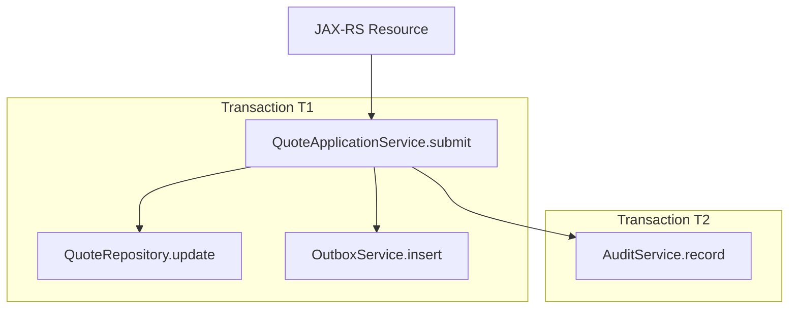
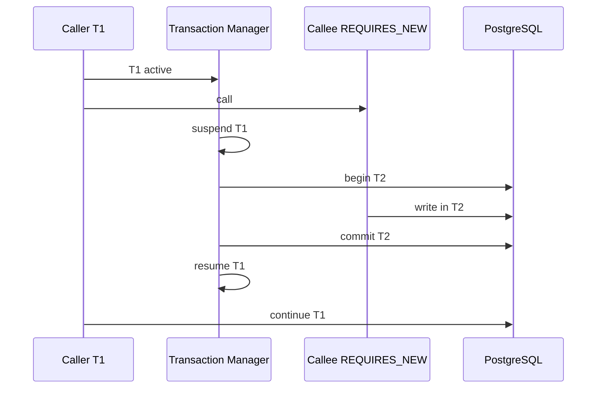
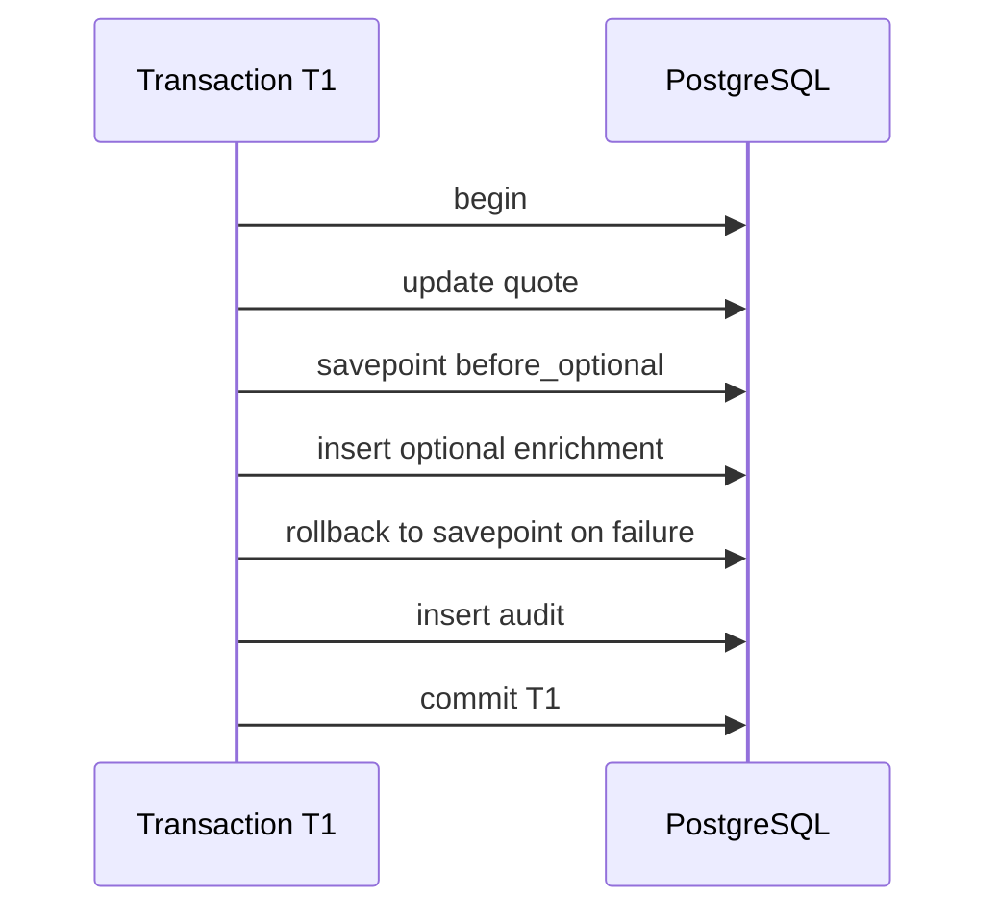
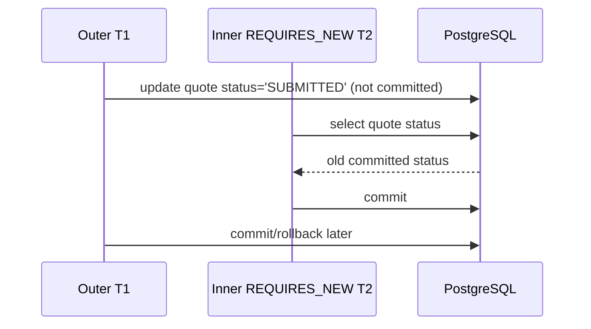

# Part 026 — Transaction Propagation

Setelah memahami transaction boundary, pertanyaan berikutnya adalah: **apa yang terjadi ketika method transactional memanggil method transactional lain?**

Itulah domain transaction propagation.

Propagation bukan sekadar pilihan annotation. Propagation menentukan:

- apakah callee ikut transaction caller
- apakah callee membuka transaction baru
- apakah transaction caller disuspend
- apakah callee wajib punya transaction
- apakah callee dilarang berjalan dalam transaction
- apakah rollback di callee membatalkan caller
- apakah savepoint dipakai
- apakah connection tambahan dibutuhkan
- apakah JPA persistence context ikut atau terpisah
- apakah MyBatis melihat data yang sama

Banyak bug transaction terjadi karena developer membaca propagation sebagai konfigurasi statis, bukan sebagai **runtime call graph**.

Part ini membahas propagation secara framework-agnostic, tetapi tetap menggunakan istilah umum seperti `REQUIRED`, `REQUIRES_NEW`, `SUPPORTS`, `NOT_SUPPORTED`, `MANDATORY`, `NEVER`, dan `NESTED` karena istilah ini umum di transaction management Java enterprise.

Internal CSG/team detail harus diverifikasi karena framework, annotation, proxy mechanism, rollback rules, dan transaction manager dapat berbeda.

---

## 1. Core Mental Model

Propagation menjawab pertanyaan:

> Ketika method ini dipanggil, apakah ia memakai transaction yang sudah ada, membuat transaction baru, berjalan tanpa transaction, atau menolak kondisi tertentu?

Contoh call graph:

```java
public void endpointHandler() {
    quoteService.submitQuote(command);
}

@Transactional(REQUIRED)
public void submitQuote(SubmitQuoteCommand command) {
    quoteRepository.updateStatus(...);
    auditService.recordAudit(...);
    outboxService.insertEvent(...);
}

@Transactional(REQUIRES_NEW)
public void recordAudit(AuditCommand command) {
    auditRepository.insert(...);
}
```

Pertanyaan runtime:

- `submitQuote` membuka transaction T1 atau ikut transaction yang sudah ada?
- `recordAudit` ikut T1 atau membuka T2?
- Jika T2 commit lalu T1 rollback, apakah audit tetap ada?
- Apakah itu diinginkan?
- Apakah T2 memakai connection kedua?
- Apakah JPA entity dari T1 terlihat di T2?

Propagation adalah salah satu area paling mudah menimbulkan bug karena secara visual hanya annotation, tetapi efeknya adalah runtime transaction topology.

---

## 2. Propagation sebagai Call Graph

Jangan membaca propagation method-per-method. Baca sebagai graph.



Jika `AuditService.record` memakai `REQUIRES_NEW`, maka audit bisa commit walau submit quote rollback.

Itu bisa benar untuk audit tertentu, tetapi bisa salah untuk business audit yang harus merefleksikan committed business fact.

Senior review harus bertanya:

- apakah transaction topology sesuai business meaning?
- apakah callee seharusnya ikut caller?
- apakah callee boleh commit terpisah?
- apakah callee boleh melihat state caller yang belum commit?
- apakah rollback callee harus membatalkan caller?

---

## 3. Propagation Summary Table

| Propagation | Jika transaction sudah ada | Jika belum ada transaction | Use case umum | Risiko utama |
|---|---|---|---|---|
| REQUIRED | Ikut transaction existing | Buat transaction baru | Default command use case | Callee rollback bisa membatalkan caller |
| REQUIRES_NEW | Suspend existing, buat transaction baru | Buat transaction baru | audit teknis, independent log, retry chunk | Partial commit, extra connection |
| SUPPORTS | Ikut jika ada | Jalan tanpa transaction | helper read-only fleksibel | Behavior berbeda tergantung caller |
| NOT_SUPPORTED | Suspend existing, jalan tanpa transaction | Jalan tanpa transaction | non-transactional external/read operation | Tidak atomic dengan caller |
| MANDATORY | Ikut existing | Error | repository internal yang wajib transactional | Runtime error jika dipanggil salah |
| NEVER | Error jika ada transaction | Jalan tanpa transaction | operation yang dilarang dalam tx | Surprise error dalam call path |
| NESTED | Savepoint dalam existing tx | Buat tx baru atau mirip REQUIRED tergantung framework | partial rollback | Disangka independent commit |

Tabel ini hanya mental model umum. Behavior aktual harus dicek di framework internal.

---

## 4. REQUIRED

`REQUIRED` biasanya propagation default untuk command/write use case.

Semantics umum:

- jika ada transaction aktif, ikut transaction itu
- jika tidak ada transaction aktif, buka transaction baru

Contoh:

```java
@Transactional(REQUIRED)
public void submitQuote(SubmitQuoteCommand command) {
    quoteRepository.updateStatus(command.quoteId(), "SUBMITTED");
    auditRepository.insertAudit(command.quoteId(), "SUBMITTED");
    outboxRepository.insertEvent(...);
}
```

Jika dipanggil dari resource tanpa transaction, method membuka transaction baru.

Jika dipanggil dari service lain yang sudah transactional, method ikut transaction caller.

Keunggulan:

- cocok sebagai default use case boundary
- menjaga atomicity antar repository call
- sederhana untuk dipahami jika boundary service jelas

Risiko:

- nested service call bisa memperbesar transaction tanpa sadar
- callee exception bisa mark rollback-only untuk seluruh caller
- helper method tampak harmless tetapi ikut transaction besar
- external call di callee ikut memperpanjang transaction caller

Review question:

- apakah method ini benar-benar harus ikut transaction caller?
- apakah method ini command use case atau reusable helper?
- apakah method ini melakukan external call?
- apakah exception callee seharusnya membatalkan caller?

---

## 5. REQUIRED Rollback-Only Surprise

Contoh:

```java
@Transactional(REQUIRED)
public void processQuote(UUID quoteId) {
    quoteRepository.updateStatus(quoteId, "PROCESSING");

    try {
        optionalEnrichmentService.enrich(quoteId); // REQUIRED
    } catch (Exception e) {
        log.warn("optional enrichment failed", e);
    }

    quoteRepository.updateStatus(quoteId, "DONE");
}
```

Jika `optionalEnrichmentService.enrich` ikut transaction yang sama dan exception tertentu membuat transaction marked rollback-only, maka walaupun exception ditangkap, commit akhir bisa gagal.

Gejala:

- log menunjukkan optional error ditangani
- method selesai normal
- commit gagal di akhir
- semua update rollback

Mitigasi:

- jangan tangkap exception transaction-critical tanpa memahami rollback-only
- gunakan savepoint/NESTED jika benar-benar partial rollback diperlukan
- gunakan `REQUIRES_NEW` hanya jika partial commit acceptable
- pindahkan optional work setelah commit jika tidak perlu atomic
- test rollback-only behavior

---

## 6. REQUIRES_NEW

`REQUIRES_NEW` membuka transaction baru. Jika caller punya transaction aktif, caller disuspend sementara.

Semantics umum:



Use case yang kadang valid:

- technical audit that must persist even if caller fails
- failure log independent from business transaction
- per-row batch progress checkpoint
- idempotency failure record, jika semantics benar
- compensation scheduling independent dari caller

Namun `REQUIRES_NEW` bukan solusi default untuk “biar aman”. Ia mengubah atomicity.

---

## 7. REQUIRES_NEW Partial Commit Risk

Contoh berbahaya:

```java
@Transactional(REQUIRED)
public void submitQuote(SubmitQuoteCommand command) {
    quoteRepository.updateStatus(command.quoteId(), "SUBMITTED");

    auditService.recordBusinessAudit(command.quoteId(), "SUBMITTED"); // REQUIRES_NEW

    outboxRepository.insertEvent(...);

    if (someFailure()) {
        throw new RuntimeException("submit failed");
    }
}
```

Jika audit `REQUIRES_NEW` commit, lalu caller rollback:

- quote tetap DRAFT
- audit mengatakan quote SUBMITTED
- outbox tidak ada

Audit menjadi misleading.

Pertanyaan kunci:

> Apakah data yang dicatat oleh REQUIRES_NEW masih benar jika caller rollback?

Jika jawabannya tidak, jangan pakai `REQUIRES_NEW`.

---

## 8. REQUIRES_NEW Connection Pool Impact

`REQUIRES_NEW` sering membutuhkan connection tambahan.

Jika T1 sudah memegang connection, lalu T2 dibuka:

- T1 connection disuspend tetapi belum dilepas
- T2 perlu connection lain dari pool
- pada concurrency tinggi, pool pressure naik

Contoh risiko:

- pool size per pod = 10
- request concurrent = 10
- setiap request membuka T1
- setiap request memanggil REQUIRES_NEW
- semua butuh connection kedua
- pool bisa habis

Gejala production:

- connection acquisition timeout
- thread menunggu pool
- PostgreSQL idle in transaction meningkat
- latency spike

Review question:

- berapa kali REQUIRES_NEW dipanggil dalam satu request?
- apakah dipanggil dalam loop?
- apakah pool sizing memperhitungkan nested transaction?
- apakah transaction T1 menahan lock saat T2 berjalan?

`REQUIRES_NEW` dalam loop adalah red flag besar.

---

## 9. SUPPORTS

`SUPPORTS` berarti:

- jika ada transaction, ikut
- jika tidak ada transaction, jalan tanpa transaction

Ini tampak fleksibel, tetapi bisa membuat behavior berbeda tergantung caller.

Contoh:

```java
@Transactional(SUPPORTS)
public QuoteSummary getQuoteSummary(UUID quoteId) {
    return quoteMapper.selectSummary(quoteId);
}
```

Dipanggil dari read endpoint:

- tidak ada transaction
- query autocommit/read behavior biasa

Dipanggil dari command service transactional:

- ikut transaction caller
- mungkin membaca uncommitted changes milik caller sendiri
- mungkin ikut lock/timeout caller

Risiko:

- query behavior berubah tergantung call path
- JPA flush mungkin terjadi sebelum read jika berada di context tertentu
- method tampak read-only tetapi ikut transaction panjang
- sulit diuji semua path

SUPPORTS cocok untuk helper read yang benar-benar aman dalam dua mode. Untuk critical query, lebih baik eksplisit.

---

## 10. NOT_SUPPORTED

`NOT_SUPPORTED` berarti method berjalan tanpa transaction. Jika ada transaction aktif, transaction caller disuspend.

Use case:

- operation yang tidak boleh menahan transaction
- external HTTP call yang sengaja dilakukan di luar transaction
- read-only long-running report yang tidak perlu ikut write transaction
- administrative check non-atomic

Contoh:

```java
@Transactional(NOT_SUPPORTED)
public CreditScore getCreditScore(CustomerId customerId) {
    return creditClient.fetchScore(customerId);
}
```

Jika dipanggil dari transaction caller, caller transaction disuspend selama external call.

Risiko:

- callee tidak atomic dengan caller
- callee tidak melihat uncommitted state caller
- jika callee membaca database, ia membaca committed state lama
- suspend/resume behavior perlu framework support

NOT_SUPPORTED dapat berguna untuk menghindari external call di dalam transaction, tetapi biasanya lebih baik struktur code dibuat agar external call terjadi sebelum begin transaction atau setelah commit.

---

## 11. MANDATORY

`MANDATORY` berarti method harus dipanggil dalam transaction. Jika tidak ada transaction, error.

Use case:

- low-level repository method yang tidak boleh commit sendiri
- internal method yang harus menjadi bagian dari use case atomicity
- write helper yang tidak meaningful di luar transaction

Contoh:

```java
@Transactional(MANDATORY)
public void insertOutboxEvent(OutboxEvent event) {
    outboxMapper.insert(event);
}
```

Ini memaksa outbox insert selalu berada dalam business transaction.

Keunggulan:

- mencegah accidental autocommit
- membuat contract explicit
- bagus untuk repository/helper internal

Risiko:

- runtime error jika dipanggil dari test/helper tanpa transaction
- terlalu banyak MANDATORY bisa membuat reuse sulit
- developer bisa membungkus transaction sembarangan hanya untuk melewati error

Review question:

- apakah method ini memang tidak valid di luar transaction?
- apakah error message jelas?
- apakah test setup menyediakan transaction?
- apakah convention internal memahami MANDATORY?

---

## 12. NEVER

`NEVER` berarti method dilarang berjalan dalam transaction. Jika ada transaction aktif, error.

Use case:

- long-running export yang tidak boleh menahan transaction
- operation yang melakukan blocking external call besar
- diagnostic operation yang harus berjalan di luar transaction
- code yang akan membuka transaction sendiri secara manual dan tidak boleh nested

Contoh:

```java
@Transactional(NEVER)
public void exportLargeReport(ReportRequest request) {
    reportStreamingService.streamToObjectStorage(request);
}
```

Risiko:

- caller transactional yang tidak sadar akan gagal runtime
- jika method ternyata butuh consistent snapshot, NEVER bisa salah
- bisa menjadi workaround untuk design yang seharusnya dipisah jelas

NEVER jarang dipakai, tetapi berguna untuk menegakkan “jangan panggil ini dalam transaction”.

---

## 13. NESTED

`NESTED` biasanya berarti nested transaction berbasis savepoint jika ada transaction aktif.

Semantics umum:

- jika caller transaction T1 aktif, buat savepoint S1
- jika callee gagal, rollback ke savepoint S1
- caller T1 bisa lanjut
- commit final tetap commit T1 secara keseluruhan



NESTED tidak sama dengan REQUIRES_NEW.

| Aspect | NESTED | REQUIRES_NEW |
|---|---|---|
| Mechanism | Savepoint dalam transaction caller | Transaction baru |
| Independent commit | Tidak | Ya |
| Jika caller rollback | Semua rollback termasuk nested | REQUIRES_NEW yang sudah commit tetap ada |
| Extra connection | Biasanya tidak | Sering ya |
| Use case | Partial rollback | Independent persistence |

Caveat:

- support tergantung transaction manager
- support tergantung datasource/resource
- semantics bisa berbeda antar framework
- JPA support untuk nested/savepoint perlu diverifikasi

---

## 14. NESTED Misunderstanding

Kesalahan umum:

> Mengira NESTED commit sendiri.

Contoh:

```java
@Transactional(REQUIRED)
public void processQuote(UUID quoteId) {
    quoteRepository.markProcessing(quoteId);
    enrichmentService.tryEnrich(quoteId); // NESTED
    quoteRepository.markDone(quoteId);
    throw new RuntimeException("fail after nested");
}
```

Jika caller rollback, semua perubahan rollback, termasuk perubahan nested yang sebelumnya sukses.

NESTED hanya memberi kemampuan rollback sebagian ke savepoint selama outer transaction tetap berjalan. Ia tidak memberi durability terpisah.

Gunakan NESTED jika:

- optional sub-step boleh gagal
- outer transaction boleh lanjut
- nested changes hanya valid jika outer commit

Jangan gunakan NESTED jika:

- sub-step harus tetap commit walau outer rollback
- framework support tidak jelas
- sub-step melakukan external side effect

---

## 15. Propagation dan JPA Persistence Context

Propagation memengaruhi persistence context.

Dalam transaction yang sama:

- EntityManager/persistence context biasanya sama atau terikat ke transaction context
- managed entity identity dipertahankan
- dirty checking terjadi saat flush/commit

Dengan `REQUIRES_NEW`:

- transaction baru bisa memakai EntityManager/persistence context berbeda
- entity dari outer transaction tidak boleh dipakai sembarangan di inner transaction
- outer persistence context bisa stale terhadap perubahan inner transaction

Contoh:

```java
@Transactional(REQUIRED)
public void outer(UUID quoteId) {
    Quote quote = entityManager.find(Quote.class, quoteId); // managed in T1

    innerService.cancelQuoteRequiresNew(quoteId); // T2 updates DB

    if (quote.isSubmitted()) {
        // quote may be stale in T1 persistence context
    }
}
```

Jika inner T2 mengubah status quote di database, entity `quote` di T1 tidak otomatis berubah.

Mitigasi:

- jangan update aggregate sama di REQUIRES_NEW
- refresh/clear outer persistence context jika benar-benar perlu
- hindari passing managed entity ke REQUIRES_NEW method
- pass ID/value, bukan entity managed
- test stale state behavior

---

## 16. Propagation dan MyBatis

MyBatis lebih eksplisit: mapper mengeksekusi SQL saat method dipanggil. Namun transaction binding tetap penting.

Dengan REQUIRED:

- mapper SQL ikut connection transaction caller
- commit/rollback dikendalikan transaction manager

Dengan REQUIRES_NEW:

- mapper inner memakai transaction/connection baru
- SQL inner bisa commit walau outer rollback

Contoh:

```java
@Transactional(REQUIRED)
public void outer(UUID quoteId) {
    quoteMapper.updateStatus(quoteId, "PROCESSING"); // T1
    auditService.insertTechnicalAudit(quoteId);       // T2 REQUIRES_NEW
    throw new RuntimeException("fail");
}
```

Hasil:

- quote update rollback
- technical audit commit jika T2 sukses

Itu mungkin benar untuk technical failure trace, tetapi salah untuk business audit.

Review MyBatis propagation:

- apakah mapper commit manual? Seharusnya tidak dalam managed transaction.
- apakah mapper dipanggil dari method transactional?
- apakah mapper SQL tergantung uncommitted state outer transaction?
- apakah REQUIRES_NEW menyebabkan row lock conflict dengan outer transaction?

---

## 17. Propagation dan MyBatis + JPA Mixing

Propagation membuat mixing MyBatis/JPA makin sulit.

Contoh kompleks:

```java
@Transactional(REQUIRED)
public void submit(UUID quoteId) {
    Quote quote = entityManager.find(Quote.class, quoteId);
    quote.submit();

    auditService.insertAuditRequiresNew(quoteId); // MyBatis, REQUIRES_NEW

    quoteMapper.selectSummary(quoteId); // MyBatis, T1
}
```

Pertanyaan:

- apakah JPA update sudah flush sebelum audit T2 membaca database?
- jika belum flush, T2 tidak melihat status baru
- jika flush dilakukan, outer T1 memegang lock yang bisa menghambat T2
- apakah T2 mencoba membaca/mengubah row yang locked by T1?
- apakah summary MyBatis melihat JPA mutation?

Ini bukan sekadar “bisa jalan atau tidak”. Ini pertanyaan ordering, lock, visibility, flush, dan stale state.

Heuristik:

- jangan pakai REQUIRES_NEW untuk membaca/mengubah aggregate yang sedang dimanage outer JPA transaction
- jangan campur JPA mutation dan MyBatis read tanpa explicit flush
- jangan campur MyBatis mutation dan JPA managed entity tanpa refresh/clear
- hindari propagation kompleks pada same table/same aggregate

---

## 18. Propagation dan PostgreSQL Visibility

PostgreSQL hanya melihat committed data dari transaction lain, kecuali isolation/visibility khusus current transaction.

Jika T1 belum commit, T2 tidak melihat perubahan T1.

Contoh:



Dengan `REQUIRES_NEW`, inner transaction bukan bagian dari snapshot outer transaction. Ia transaction berbeda.

Risiko:

- inner transaction membaca state lama
- inner transaction gagal karena lock held by outer
- inner transaction commit data yang tidak konsisten dengan outer final result

Jika inner perlu state baru dari outer, REQUIRES_NEW biasanya salah. Jika inner harus independen, pastikan ia tidak bergantung pada uncommitted state outer.

---

## 19. Propagation dan Locks

Propagation dapat mengubah lock behavior.

Contoh deadlock/self-block risk:

```java
@Transactional(REQUIRED)
public void outer(UUID quoteId) {
    quoteMapper.lockQuoteForUpdate(quoteId); // T1 locks row
    innerService.updateSameQuoteRequiresNew(quoteId); // T2 tries same row
}
```

T1 memegang row lock. T2 mencoba update row sama. Karena T1 disuspend tetapi belum commit, lock tetap dipegang. T2 menunggu T1. Tetapi T1 menunggu T2 selesai.

Ini bisa berakhir sebagai:

- lock timeout
- deadlock-like wait
- request timeout
- pool exhaustion under load

Rule:

> Jangan gunakan REQUIRES_NEW untuk mengakses row yang sudah dikunci outer transaction.

Review question:

- apakah outer transaction sudah melakukan SELECT FOR UPDATE?
- apakah inner transaction menyentuh row/table sama?
- apakah lock timeout dikonfigurasi?
- apakah ada test untuk concurrent path?

---

## 20. Self-Invocation Problem

Banyak framework transaction berbasis proxy/interceptor. Dalam model itu, annotation transaction aktif ketika method dipanggil melalui proxy, bukan ketika method dipanggil langsung dari object yang sama.

Contoh:

```java
public class QuoteService {

    public void submit(UUID quoteId) {
        validate(quoteId);
        persistSubmission(quoteId); // self-invocation
    }

    @Transactional(REQUIRED)
    public void persistSubmission(UUID quoteId) {
        quoteRepository.updateStatus(quoteId, "SUBMITTED");
    }
}
```

Jika framework berbasis proxy dan `submit()` memanggil `persistSubmission()` pada `this`, annotation pada `persistSubmission` bisa tidak aktif.

Akibat:

- transaction tidak dimulai
- propagation tidak berjalan
- rollback rule tidak berlaku
- method berjalan autocommit atau tanpa expected context

Mitigasi:

- letakkan transaction boundary pada public entry service method yang dipanggil dari luar bean/proxy
- pisahkan callee transactional ke bean/service lain jika memang butuh propagation berbeda
- gunakan programmatic transaction untuk kasus internal method
- verifikasi framework internal apakah self-invocation caveat berlaku

Internal verification checklist:

- transaction framework berbasis proxy/interceptor atau bytecode weaving?
- annotation di private method berlaku atau tidak?
- annotation di same-class call berlaku atau tidak?
- method final berlaku atau tidak?
- class final berlaku atau tidak?

---

## 21. Private Method and Final Method Caveat

Dalam banyak framework, transaction annotation pada private method tidak efektif karena private method tidak bisa diintercept proxy.

Contoh smell:

```java
public void submit(UUID quoteId) {
    doSubmit(quoteId);
}

@Transactional
private void doSubmit(UUID quoteId) {
    quoteRepository.updateStatus(quoteId, "SUBMITTED");
}
```

Jika framework tidak mendukung interception private method, transaction tidak aktif.

Final class/method juga bisa bermasalah pada beberapa proxy mechanism.

Review question:

- annotation ada di method yang benar-benar dipanggil melalui transaction infrastructure?
- method visibility sesuai framework?
- class final/proxyable?
- test membuktikan rollback?

Jangan percaya annotation sebelum tahu mekanisme runtime-nya.

---

## 22. Propagation Placement Pattern

Pattern sehat:

```java
@Path("/quotes")
public class QuoteResource {
    public Response submit(SubmitQuoteRequest request) {
        SubmitQuoteResult result = quoteApplicationService.submit(toCommand(request));
        return Response.ok(toResponse(result)).build();
    }
}

public class QuoteApplicationService {
    @Transactional(REQUIRED)
    public SubmitQuoteResult submit(SubmitQuoteCommand command) {
        Quote quote = quoteRepository.findForUpdate(command.quoteId());
        quote.submit(command.userId());
        quoteRepository.save(quote);
        outboxRepository.insert(...); // MANDATORY or REQUIRED participant
        return SubmitQuoteResult.from(quote);
    }
}
```

Characteristics:

- resource not transactional
- application service is boundary
- repositories participate
- outbox part of same transaction
- no external call inside transaction
- propagation mostly REQUIRED/MANDATORY

Pattern suspicious:

```java
public class QuoteResource {
    @Transactional
    public Response submit(...) {
        // parsing, external calls, orchestration, response mapping all in tx
    }
}
```

Resource-level transaction may be too broad and include HTTP/API concerns.

Pattern dangerous:

```java
public class QuoteRepository {
    @Transactional(REQUIRES_NEW)
    public void save(Quote quote) { ... }
}
```

Repository-level REQUIRES_NEW can silently break use case atomicity.

---

## 23. Propagation for Audit

Audit has two meanings:

1. **Business audit**: records a committed business fact.
2. **Technical audit/log**: records that an attempt happened, even if business transaction fails.

Business audit should usually be in same transaction:

```java
@Transactional(REQUIRED)
public void approveQuote(...) {
    quoteRepository.approve(...);
    businessAuditRepository.recordApproval(...); // same tx
    outboxRepository.insert(...);
}
```

Technical audit may use REQUIRES_NEW if it remains true even when caller rollback:

```java
@Transactional(REQUIRES_NEW)
public void recordFailedAttempt(...) {
    technicalAuditRepository.insert(...);
}
```

Review question:

- apakah audit record mengatakan “operation committed” atau “attempt happened”?
- apakah audit masih benar jika outer transaction rollback?
- apakah audit table dipakai compliance?
- apakah audit order harus sama dengan business event order?

Jangan pakai REQUIRES_NEW untuk audit tanpa memahami semantics audit.

---

## 24. Propagation for Outbox

Outbox event yang merepresentasikan business state change harus commit bersama business write.

Biasanya outbox repository sebaiknya:

- REQUIRED participant, atau
- MANDATORY agar tidak bisa dipanggil di luar transaction

Contoh:

```java
@Transactional(MANDATORY)
public void insertOutbox(OutboxEvent event) {
    outboxMapper.insert(event);
}
```

Anti-pattern:

```java
@Transactional(REQUIRES_NEW)
public void insertOutbox(OutboxEvent event) {
    outboxMapper.insert(event);
}
```

Jika outbox REQUIRES_NEW commit tetapi business transaction rollback, event palsu bisa dipublish.

Rule:

> Outbox event for business state transition must be in the same transaction as the state transition.

Exception hanya jika event semantics memang independent, tetapi itu bukan transactional outbox untuk business state.

---

## 25. Propagation for Idempotency

Idempotency sering memakai table dengan state:

- PROCESSING
- COMPLETED
- FAILED

Propagation harus hati-hati.

Pattern umum:

1. Insert/acquire idempotency key.
2. Execute business transaction.
3. Store response/result.
4. Commit.

Pertanyaan:

- apakah idempotency record commit jika business rollback?
- apakah PROCESSING state bisa stuck?
- apakah FAILED state harus commit independent?
- apakah retry boleh mengambil key yang sama?
- apakah response replay harus atomic dengan business result?

Kadang ada kombinasi transaction:

- small transaction to acquire key
- business transaction
- separate transaction to mark failure

Tetapi design ini harus eksplisit, bukan accidental propagation.

Review question:

- apakah duplicate request saat first request in-flight aman?
- apakah crash setelah business commit sebelum idempotency result commit mungkin?
- apakah unique constraint digunakan?
- apakah timeout cleanup tersedia?

---

## 26. Propagation for Batch Processing

Batch sering membutuhkan transaction per chunk, bukan satu transaction besar.

Programmatic pattern:

```java
for (List<Row> chunk : chunks(rows, 500)) {
    transactionRunner.required(() -> {
        importRepository.insertChunk(chunk);
        progressRepository.markChunkDone(chunk.id());
    });
}
```

Jika memakai `REQUIRES_NEW` di dalam loop:

```java
@Transactional(REQUIRED)
public void importAll(List<Row> rows) {
    for (Row row : rows) {
        rowService.importRowRequiresNew(row);
    }
}
```

Risiko:

- outer transaction tidak berguna atau malah menahan resources
- setiap row butuh transaction baru
- pool pressure tinggi
- partial commit sulit dipahami
- retry semantics rumit

Better:

- tidak ada outer transaction besar
- transaction per chunk eksplisit
- progress/idempotency jelas
- failure handling per chunk
- observability per chunk

---

## 27. Propagation for Read-Only Query

Read-only query bisa memiliki beberapa pattern:

### No transaction

Cocok untuk simple read dengan autocommit statement.

### Read-only REQUIRED

Cocok jika ingin consistent behavior dan framework optimizations.

### SUPPORTS

Cocok untuk helper yang aman dipanggil dari write/read path.

### NOT_SUPPORTED

Cocok jika query/report panjang tidak boleh ikut transaction caller.

Review question:

- apakah query butuh consistent snapshot?
- apakah query boleh membaca stale replica?
- apakah query dipanggil dari write transaction?
- apakah query bisa memicu JPA flush?
- apakah query memegang cursor/connection lama?

Read-only bukan berarti no risk. Long read transaction di PostgreSQL bisa memengaruhi vacuum dan MVCC bloat.

---

## 28. Exception Handling Across Propagation

Exception di inner transaction bisa berdampak berbeda tergantung propagation.

### REQUIRED inner fails

- same transaction
- outer transaction bisa marked rollback-only
- catching exception belum tentu menyelamatkan transaction

### REQUIRES_NEW inner fails

- inner rollback
- outer bisa lanjut jika exception ditangkap
- outer transaction belum tentu rollback

### NESTED inner fails

- rollback to savepoint
- outer bisa lanjut
- final commit tergantung outer

Contoh:

```java
@Transactional(REQUIRED)
public void outer() {
    try {
        innerRequiresNew();
    } catch (Exception e) {
        log.warn("inner failed, continue");
    }
    repository.updateOuter();
}
```

Ini bisa valid jika inner failure benar-benar optional.

Tapi jika inner adalah outbox/audit business, melanjutkan outer justru salah.

Review question:

- apakah exception ditangkap untuk recovery atau hanya menghilangkan error?
- apakah transaction masih sehat setelah exception?
- apakah failure inner harus membatalkan outer?
- apakah partial commit acceptable?

---

## 29. Propagation and Rollback Rules

Propagation dan rollback rules tidak bisa dipisahkan.

Contoh:

```java
@Transactional(REQUIRES_NEW)
public void recordFailure(FailureRecord record) throws FailureRecordException {
    failureRepository.insert(record);
    throw new FailureRecordException("after insert");
}
```

Jika checked exception tidak trigger rollback by default, record bisa commit walau method throw.

Pertanyaan:

- exception type apa yang trigger rollback untuk tiap propagation?
- apakah inner exception diterjemahkan?
- apakah rollbackFor/noRollbackFor dikonfigurasi?
- apakah rollback-only marker terlihat?

Dalam PR, jangan hanya cek propagation. Cek exception path.

---

## 30. Propagation Anti-Patterns

### Anti-pattern 1: REQUIRES_NEW everywhere

Gejala:

- setiap repository save punya transaction sendiri
- use case tidak atomic
- partial commit banyak
- sulit rollback

### Anti-pattern 2: Repository opens transaction independently

Repository tidak boleh diam-diam menentukan business atomicity.

### Anti-pattern 3: SUPPORTS for critical write helper

Write helper yang jalan tanpa transaction jika caller lupa adalah risk.

### Anti-pattern 4: Self-invocation transactional method

Annotation terlihat ada, tetapi runtime tidak aktif.

### Anti-pattern 5: NESTED dianggap independent commit

Savepoint bukan transaction baru durable.

### Anti-pattern 6: REQUIRES_NEW inside locked outer transaction

Bisa self-block atau timeout.

### Anti-pattern 7: Outbox REQUIRES_NEW

Event bisa commit tanpa business state.

### Anti-pattern 8: Swallowing REQUIRED exception

Transaction rollback-only tetapi code lanjut.

### Anti-pattern 9: Propagation in loop without pool analysis

Bisa menyebabkan connection pressure dan latency spike.

### Anti-pattern 10: Mixed MyBatis/JPA with propagation trick

Propagation dipakai untuk menutupi ownership problem, bukan memperbaiki design.

---

## 31. Testing Propagation

Propagation harus dites dengan database nyata atau integration test yang mengaktifkan transaction infrastructure.

Test cases:

### REQUIRED joins transaction

- outer insert + inner insert
- outer throws exception
- both rollback

### REQUIRES_NEW commits independently

- outer insert
- inner insert REQUIRES_NEW
- outer throws
- inner row remains, outer row gone

### MANDATORY fails without transaction

- call method directly without transaction
- expect error

### NESTED rollback savepoint

- outer insert
- nested insert fails
- outer continues
- final commit contains outer but not nested

### Self-invocation

- call outer method that invokes annotated inner same class
- verify whether rollback happens
- document framework behavior

### MyBatis/JPA flush visibility

- JPA mutate in outer
- MyBatis read in inner/outer
- verify need for flush

### Lock risk

- outer locks row
- inner REQUIRES_NEW touches row
- verify timeout/deadlock behavior with low lock timeout

---

## 32. Observability for Propagation

Propagation bugs are hard to see unless transaction events are observable.

Useful signals:

- transaction begin/commit/rollback count
- transaction duration by method/use case
- nested transaction count
- REQUIRES_NEW count
- connection acquisition during nested call
- rollback-only marker logs
- lock wait during inner transaction
- pool usage spike during nested call
- deadlock/timeout around propagation-heavy paths

Logging considerations:

- log correlation id across outer/inner calls
- log use case name, not sensitive payload
- log propagation mode only in debug/diagnostic if possible
- log SQLState for rollback reason

Production smell:

- endpoint with low QPS still exhausts pool because each request opens multiple nested transactions
- audit rows exist for operations that failed
- outbox events exist without business state
- transaction timeout occurs after external call inside REQUIRED flow

---

## 33. Internal Verification Checklist

### Framework Behavior

- Propagation modes supported apa saja?
- Apakah semantics sama dengan istilah umum REQUIRED/REQUIRES_NEW/etc.?
- Apakah transaction berbasis proxy/interceptor/container?
- Apakah self-invocation caveat berlaku?
- Apakah private/final method bisa transactional?
- Apakah annotation di interface atau implementation yang dipakai?

### Transaction Manager

- Apakah MyBatis dan JPA memakai transaction manager yang sama?
- Apakah REQUIRES_NEW memakai connection baru?
- Apakah suspend/resume didukung?
- Apakah NESTED/savepoint didukung?
- Apakah multiple datasource terlibat?

### Codebase Patterns

- Di layer mana propagation dipasang?
- Apakah repository memakai REQUIRES_NEW?
- Apakah outbox insert MANDATORY/REQUIRED?
- Apakah audit business dan technical dibedakan?
- Apakah idempotency memakai beberapa transaction?
- Apakah batch processing memakai per-chunk transaction?

### Risk Areas

- REQUIRES_NEW dalam loop.
- REQUIRES_NEW menyentuh table sama dengan outer.
- SUPPORTS pada write method.
- NOT_SUPPORTED membaca state yang baru diubah outer.
- NESTED tanpa test savepoint.
- MyBatis/JPA mixing dengan propagation berbeda.

### Testing

- Ada integration test propagation?
- Ada rollback-only test?
- Ada REQUIRES_NEW partial commit test?
- Ada self-invocation test?
- Ada lock timeout test untuk inner transaction?
- Ada pool pressure test untuk nested transaction?

### Operations

- Apakah transaction duration terlihat?
- Apakah nested transaction count terlihat?
- Apakah pool exhaustion pernah terjadi?
- Apakah audit/outbox inconsistency pernah terjadi?
- Apakah incident notes menyebut rollback-only, deadlock, lock wait, atau timeout?

---

## 34. PR Review Checklist

Saat melihat propagation di PR, tanyakan:

### Intent

- Kenapa propagation ini dibutuhkan?
- Apa yang salah jika memakai default REQUIRED?
- Apakah business meaning-nya independent atau atomic dengan caller?

### Atomicity

- Apakah callee boleh commit jika caller rollback?
- Apakah caller boleh commit jika callee rollback?
- Apakah partial commit acceptable dan terdokumentasi?

### Visibility

- Apakah callee perlu melihat uncommitted state caller?
- Apakah caller akan membaca state yang diubah callee?
- Apakah JPA persistence context bisa stale?
- Apakah MyBatis read perlu flush sebelumnya?

### Locking and Pool

- Apakah outer memegang lock saat inner dipanggil?
- Apakah inner menyentuh row/table sama?
- Apakah REQUIRES_NEW butuh connection tambahan?
- Apakah propagation dipakai dalam loop?

### Exception and Rollback

- Exception apa yang rollback inner?
- Exception apa yang rollback outer?
- Apakah exception ditangkap?
- Apakah rollback-only state mungkin terjadi?

### Testing

- Ada test yang membuktikan propagation behavior?
- Ada test partial commit/rollback?
- Ada test self-invocation jika relevan?
- Ada test MyBatis/JPA visibility jika mixing?

### Operations

- Apakah path ini high-traffic?
- Apakah propagation meningkatkan pool usage?
- Apakah lock timeout/statement timeout relevan?
- Apakah observability cukup?

---

## 35. Decision Heuristics

Gunakan heuristik berikut:

### Default command use case

Gunakan REQUIRED pada application service boundary.

### Repository write yang harus selalu bagian dari caller

Gunakan REQUIRED atau MANDATORY sesuai convention internal.

### Outbox event untuk business change

Gunakan same transaction. Hindari REQUIRES_NEW.

### Technical audit attempt yang harus survive rollback

REQUIRES_NEW bisa valid, tetapi audit wording harus jelas.

### Optional sub-step yang boleh gagal tetapi hanya valid jika outer commit

NESTED/savepoint bisa dipertimbangkan jika framework mendukung dan test ada.

### Long external call

Jangan lakukan dalam REQUIRED transaction. Struktur ulang agar di luar transaction atau via outbox/saga.

### Batch besar

Gunakan transaction per chunk. Jangan outer transaction besar + REQUIRES_NEW per item tanpa alasan.

### Same aggregate/table under JPA and MyBatis

Jangan pakai propagation untuk menambal ownership problem. Perbaiki boundary dan model.

---

## 36. Summary

Transaction propagation menentukan runtime topology transaction.

Hal yang harus dikuasai:

- REQUIRED ikut transaction existing atau membuat baru
- REQUIRES_NEW membuat transaction independent dan bisa partial commit
- SUPPORTS membuat behavior tergantung caller
- NOT_SUPPORTED berjalan tanpa transaction dan suspend caller jika ada
- MANDATORY memaksa caller punya transaction
- NEVER menolak transaction existing
- NESTED biasanya savepoint, bukan independent commit
- self-invocation dapat membuat annotation tidak aktif pada framework berbasis proxy
- propagation memengaruhi connection pool, lock, rollback, JPA persistence context, MyBatis visibility, dan PostgreSQL row visibility
- outbox business event harus commit bersama business write
- REQUIRES_NEW tidak boleh dipakai sembarangan, terutama dalam loop atau pada row yang dikunci outer transaction
- propagation harus dibuktikan dengan integration test

Core rule:

> Jangan memilih propagation berdasarkan kenyamanan local method. Pilih propagation berdasarkan atomicity, visibility, rollback, lock, connection, dan business meaning.

Propagation yang salah jarang terlihat saat happy path. Ia muncul sebagai partial commit, stale state, pool exhaustion, lock timeout, misleading audit, atau event inconsistency di production.
