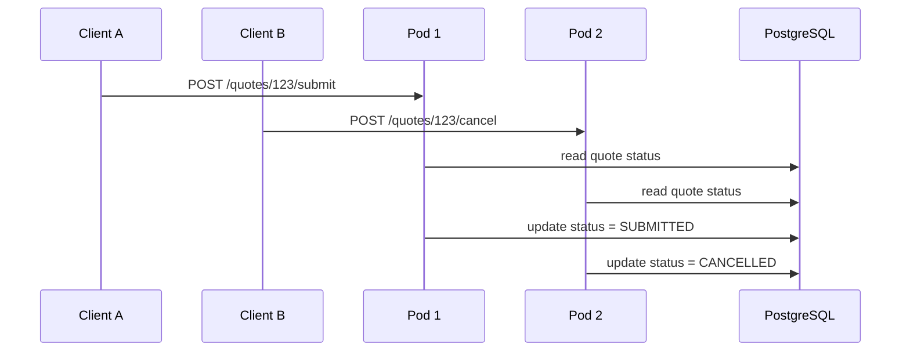
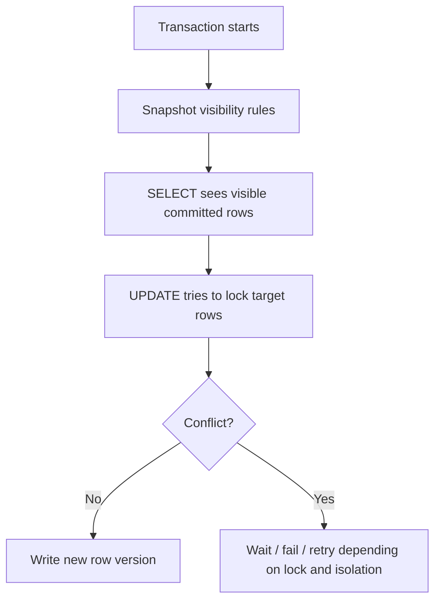
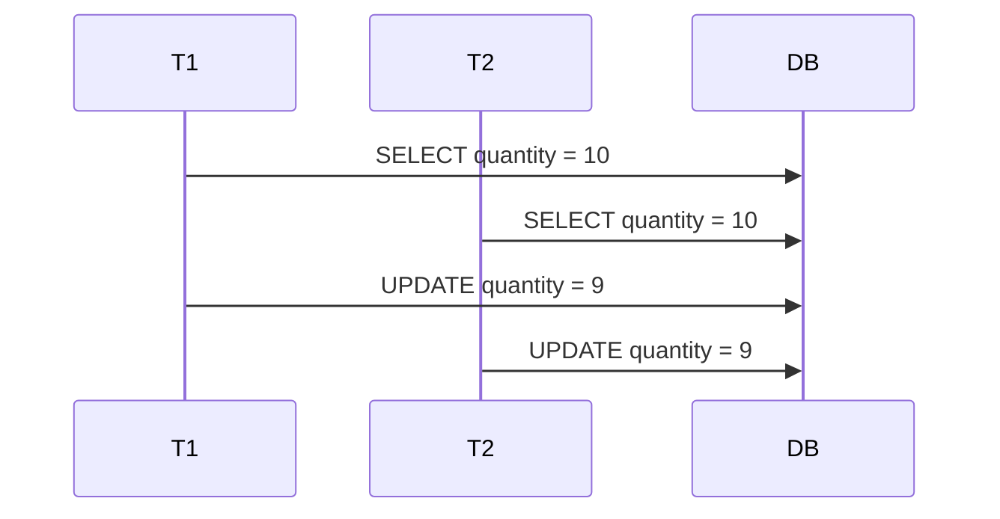
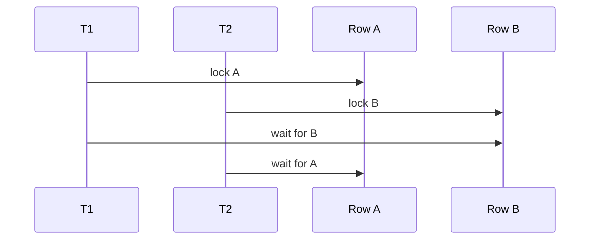

# Part 027 — Transaction Isolation and Concurrency

Transaction isolation adalah topik yang sering dianggap database-level, padahal efeknya langsung muncul di service Java/JAX-RS.

Bug concurrency biasanya tidak terlihat di happy-path test. Ia muncul ketika:

- dua request mengubah aggregate yang sama
- worker Kafka/RabbitMQ memproses event paralel
- scheduler menjalankan batch bersamaan dengan API write
- retry client mengirim command duplikat
- beberapa pod Kubernetes memproses pekerjaan dari queue yang sama
- JPA persistence context menyimpan state lama
- MyBatis menjalankan update eksplisit tanpa version check
- constraint database menjadi satu-satunya garis pertahanan terakhir

Part ini membahas transaction isolation sebagai alat untuk menjaga **data correctness under concurrency**.

Tujuan utama bukan menghafal nama isolation level. Tujuan utamanya adalah mampu menjawab:

> Invariant apa yang harus tetap benar ketika banyak transaksi berjalan bersamaan?

Jika invariant tidak jelas, isolation level apa pun akan dipakai secara serampangan.

---

## 1. Core Mental Model

Transaction isolation menentukan seberapa kuat satu transaksi dilindungi dari perubahan transaksi lain yang berjalan bersamaan.

Secara praktis, isolation menjawab:

- apakah transaksi melihat data yang sudah committed oleh transaksi lain?
- apakah row yang sudah dibaca bisa berubah sebelum transaksi selesai?
- apakah query yang sama bisa mengembalikan row tambahan?
- apakah dua transaksi bisa sama-sama mengambil keputusan dari snapshot yang tampak valid tetapi menghasilkan state akhir yang salah?
- apakah database akan memblokir, membiarkan, atau menggagalkan transaksi?

Dalam persistence layer, isolation harus dipikirkan bersama:

- transaction boundary
- locking strategy
- retry strategy
- version column
- unique constraint
- foreign key constraint
- check constraint
- idempotency key
- outbox/inbox table
- JPA persistence context
- MyBatis explicit SQL
- connection pool timeout
- statement timeout
- lock timeout

Concurrency correctness bukan hanya urusan database. Ia adalah gabungan application design + SQL + transaction semantics + operational runtime.

---

## 2. Why This Matters in Java/JAX-RS Backend

Contoh endpoint:

```http
POST /quotes/{quoteId}/submit
```

Kemungkinan flow:

```java
public Response submitQuote(UUID quoteId) {
    quoteApplicationService.submitQuote(quoteId);
    return Response.accepted().build();
}
```

Dalam satu pod, flow ini terlihat sederhana.

Tetapi di production:



Pertanyaan correctness:

- status akhir mana yang valid?
- apakah `CANCELLED` boleh menimpa `SUBMITTED`?
- apakah kedua command boleh sukses?
- apakah harus ada version check?
- apakah harus ada state transition guard di SQL?
- apakah harus ada lock?
- apakah perlu idempotency?
- apakah perlu retry?

Tanpa concurrency design, hasil akhir bergantung pada timing.

Itu bukan desain. Itu kebetulan.

---

## 3. PostgreSQL MVCC as Practical Background

PostgreSQL menggunakan MVCC: transaksi membaca snapshot, sementara write membuat versi row baru.

Konsekuensi praktis:

- reader biasanya tidak memblokir writer
- writer pada row yang sama akan berkonflik atau menunggu
- snapshot visibility bergantung pada isolation level
- transaksi bisa gagal dengan serialization failure pada level tertentu
- row yang terlihat oleh query belum tentu sama dengan row terbaru secara global
- update statement tetap melakukan locking pada row yang diubah

Mental model sederhana:



MVCC membuat read concurrency tinggi, tetapi tidak otomatis menyelesaikan business race condition.

Contoh race yang tetap mungkin:

- lost update jika update tidak memakai version/state predicate
- write skew jika invariant tersebar di beberapa row
- duplicate business action jika tidak ada idempotency key
- stale JPA entity jika database diubah di luar persistence context

---

## 4. Isolation Levels in Practice

Tabel mental model:

| Isolation level | Practical meaning | Common use | Risk to understand |
|---|---|---|---|
| Read Committed | Setiap statement melihat data committed terbaru sebelum statement dimulai | Default umum untuk OLTP | Dua SELECT dalam transaksi bisa melihat hasil berbeda |
| Repeatable Read | Transaksi membaca snapshot yang konsisten sepanjang transaksi | Read consistency kuat | Bisa gagal saat concurrent update tertentu; write skew masih perlu dipahami berdasarkan engine behavior |
| Serializable | Database berusaha menjamin hasil setara eksekusi serial | Invariant kritikal | Lebih banyak serialization failure; wajib retry |

Hal penting: menaikkan isolation level bukan pengganti modelling invariant.

Sering kali solusi yang lebih tepat adalah:

- optimistic locking dengan version column
- unique constraint
- conditional update
- pessimistic row lock
- idempotency key
- advisory/business lock
- transaction retry untuk error retryable
- desain command agar idempotent

---

## 5. Read Committed

Read Committed biasanya cocok untuk banyak use case OLTP biasa.

Karakteristik praktis:

- setiap statement membaca snapshot baru dari data committed
- transaksi tidak melihat uncommitted data dari transaksi lain
- dua query dalam transaksi yang sama bisa melihat hasil berbeda
- update pada row yang sama tetap akan menunggu lock writer lain

Contoh:

```sql
BEGIN;

SELECT status
FROM quote
WHERE id = 'q-123';

-- transaksi lain commit update status

SELECT status
FROM quote
WHERE id = 'q-123';

COMMIT;
```

Di Read Committed, SELECT kedua bisa melihat status berbeda dari SELECT pertama.

Itu bukan bug database. Itu semantics isolation.

### Failure mode

Service membaca state, membuat keputusan, lalu update tanpa guard:

```sql
SELECT status FROM quote WHERE id = :quoteId;

-- application decides status can become SUBMITTED

UPDATE quote
SET status = 'SUBMITTED'
WHERE id = :quoteId;
```

Masalahnya: antara SELECT dan UPDATE, status bisa diubah transaksi lain.

Mitigasi:

```sql
UPDATE quote
SET status = 'SUBMITTED'
WHERE id = :quoteId
  AND status = 'DRAFT';
```

Lalu cek affected row count.

Jika affected row `0`, state transition tidak valid atau sudah diubah transaksi lain.

---

## 6. Repeatable Read

Repeatable Read memberi snapshot konsisten dalam transaksi.

Cocok ketika:

- proses membutuhkan konsistensi antar beberapa SELECT
- report kecil perlu snapshot stabil
- business calculation membaca beberapa row dan harus melihat versi yang sama

Risiko:

- transaksi panjang menahan snapshot lama
- bisa meningkatkan conflict pada write path tertentu
- tetap butuh locking/constraint untuk invariant tertentu
- tidak cocok dijadikan default tanpa alasan

Contoh use case:

```sql
BEGIN ISOLATION LEVEL REPEATABLE READ;

SELECT * FROM quote WHERE id = :quoteId;
SELECT * FROM quote_item WHERE quote_id = :quoteId;
SELECT * FROM discount_rule WHERE active = true;

COMMIT;
```

Semua SELECT melihat snapshot yang konsisten.

Tetapi jika transaksi juga melakukan write, tetap perlu memahami conflict dan retry.

---

## 7. Serializable

Serializable adalah isolation paling kuat secara konseptual: hasil transaksi paralel harus setara dengan urutan serial tertentu.

Namun di production, Serializable berarti:

- lebih banyak transaksi bisa gagal
- application harus siap retry
- transaction harus pendek
- retry harus aman dan idempotent
- observability serialization failure harus tersedia

Contoh retryable failure:

```java
for (int attempt = 1; attempt <= maxAttempts; attempt++) {
    try {
        transactionRunner.runSerializable(() -> {
            allocationService.allocateCapacity(command);
        });
        return;
    } catch (SerializationFailureException e) {
        if (attempt == maxAttempts) throw e;
        backoff(attempt);
    }
}
```

Serializable tanpa retry adalah desain setengah matang.

Jika transaksi gagal karena serialization conflict, itu bukan sekadar error. Itu bagian dari concurrency control.

---

## 8. Lost Update

Lost update terjadi ketika dua transaksi membaca nilai yang sama, lalu keduanya menulis nilai baru, dan update terakhir menimpa update sebelumnya.

Contoh:



Secara bisnis, dua decrement seharusnya menghasilkan `8`, tetapi hasil akhir `9`.

### Bad pattern

```java
Inventory item = repository.findBySku(sku);
item.setQuantity(item.getQuantity() - 1);
repository.save(item);
```

Jika tidak ada optimistic lock, update bisa saling menimpa.

### Safer SQL pattern

```sql
UPDATE inventory
SET quantity = quantity - :amount
WHERE sku = :sku
  AND quantity >= :amount;
```

Lalu cek affected row.

### Optimistic locking pattern

```sql
UPDATE inventory
SET quantity = :newQuantity,
    version = version + 1
WHERE sku = :sku
  AND version = :expectedVersion;
```

Jika affected row `0`, berarti ada concurrent modification.

---

## 9. Write Skew

Write skew terjadi ketika dua transaksi membaca set data yang sama, masing-masing membuat keputusan yang tampak valid, lalu menulis row berbeda sehingga invariant global rusak.

Contoh invariant:

> Minimal satu approver harus tetap aktif untuk account.

T1 membaca ada approver A dan B aktif. T1 menonaktifkan A.

T2 membaca ada approver A dan B aktif. T2 menonaktifkan B.

Hasil akhir: tidak ada approver aktif.

Kedua transaksi tidak menulis row yang sama, sehingga row lock biasa pada row sendiri tidak cukup.

Mitigasi:

- constraint atau exclusion jika bisa diekspresikan di database
- lock parent row/account row sebelum update child rows
- serializable transaction dengan retry
- aggregate-level lock
- advisory lock berbasis business key
- redesign invariant agar berada pada satu row yang bisa dikunci

Contoh parent lock:

```sql
SELECT id
FROM account
WHERE id = :accountId
FOR UPDATE;

-- now change approver rows under this account
```

Lock parent row membuat semua operasi yang memengaruhi invariant account harus antre pada lock yang sama.

---

## 10. Phantom Read and Range Invariants

Phantom terjadi ketika query range melihat row baru yang disisipkan transaksi lain.

Contoh:

```sql
SELECT count(*)
FROM active_promotion
WHERE product_id = :productId
  AND valid_from <= :date
  AND valid_to > :date;
```

Invariant:

> Hanya boleh ada satu active promotion untuk product dan date tertentu.

Dua transaksi bisa sama-sama melihat count `0`, lalu insert promotion yang overlap.

Mitigasi paling baik biasanya bukan sekadar isolation level, tetapi constraint yang mengekspresikan invariant.

Pilihan:

- unique constraint jika invariant sederhana
- exclusion constraint untuk range overlap
- lock parent row
- serializable + retry
- idempotency/business key

Application check tanpa database constraint rentan race.

---

## 11. Unique Constraint Race

Pattern umum:

```sql
SELECT id
FROM customer
WHERE external_id = :externalId;

-- if not exists

INSERT INTO customer (external_id, name)
VALUES (:externalId, :name);
```

Dua transaksi bisa sama-sama melihat tidak ada row, lalu keduanya insert.

Solusi harus memakai unique constraint:

```sql
ALTER TABLE customer
ADD CONSTRAINT uq_customer_external_id UNIQUE (external_id);
```

Lalu gunakan salah satu:

```sql
INSERT INTO customer (external_id, name)
VALUES (:externalId, :name)
ON CONFLICT (external_id) DO NOTHING;
```

atau tangani unique violation sebagai hasil bisnis yang valid.

Rule senior:

> Jika uniqueness penting untuk correctness, uniqueness harus ditegakkan database, bukan hanya dicek application.

---

## 12. Conditional Update as Concurrency Guard

Conditional update adalah salah satu teknik paling sederhana dan efektif.

Contoh state transition:

```sql
UPDATE quote
SET status = 'SUBMITTED',
    submitted_at = now(),
    version = version + 1
WHERE id = :quoteId
  AND status = 'DRAFT'
  AND version = :expectedVersion;
```

Interpretasi affected row:

| Affected row | Meaning |
|---|---|
| 1 | transition berhasil |
| 0 | quote tidak ditemukan, status bukan DRAFT, atau version berubah |

Application harus membedakan jika perlu:

```sql
SELECT status, version
FROM quote
WHERE id = :quoteId;
```

Pattern ini cocok untuk MyBatis karena SQL eksplisit.

Di JPA, pattern serupa bisa memakai `@Version`, tetapi state transition guard tetap perlu didesain.

---

## 13. Optimistic Locking

Optimistic locking cocok ketika conflict jarang tetapi harus terdeteksi.

Mental model:

1. read row with version
2. modify object/command
3. update with `WHERE version = expectedVersion`
4. increment version
5. if affected row is zero, conflict occurred

SQL form:

```sql
UPDATE quote
SET status = :newStatus,
    version = version + 1
WHERE id = :quoteId
  AND version = :expectedVersion;
```

JPA form:

```java
@Entity
class QuoteEntity {
    @Id
    private UUID id;

    @Version
    private long version;

    private String status;
}
```

MyBatis form:

```xml
<update id="updateStatusWithVersion">
  UPDATE quote
  SET status = #{status},
      version = version + 1
  WHERE id = #{id}
    AND version = #{version}
</update>
```

Review rule:

> If the write path reads a row, makes a business decision, and writes later, ask where the version or state guard is.

---

## 14. Pessimistic Locking

Pessimistic locking cocok ketika conflict sering, invariant kritikal, atau cost retry tinggi.

PostgreSQL example:

```sql
SELECT *
FROM quote
WHERE id = :quoteId
FOR UPDATE;
```

Setelah row dikunci, transaksi lain yang ingin mengubah row yang sama harus menunggu atau gagal tergantung mode.

Variasi:

```sql
SELECT * FROM quote WHERE id = :quoteId FOR UPDATE NOWAIT;
```

```sql
SELECT * FROM job_queue
WHERE status = 'READY'
ORDER BY created_at
FOR UPDATE SKIP LOCKED
LIMIT 10;
```

Gunakan pessimistic lock ketika:

- state transition sangat sensitif
- ada parent aggregate invariant
- worker queue perlu claim job
- concurrent modification sering terjadi
- retry conflict terlalu mahal

Risiko:

- lock wait
- deadlock
- transaction duration panjang
- pool connection tertahan
- throughput turun
- incident hanya muncul saat load tinggi

---

## 15. SELECT FOR UPDATE

`SELECT FOR UPDATE` mengunci row yang dipilih untuk update.

Pattern:

```sql
BEGIN;

SELECT id, status, version
FROM quote
WHERE id = :quoteId
FOR UPDATE;

-- validate transition in application

UPDATE quote
SET status = 'SUBMITTED',
    version = version + 1
WHERE id = :quoteId;

COMMIT;
```

Prinsip:

- lock harus diambil sedekat mungkin dengan write
- transaction harus pendek
- jangan lakukan external HTTP call sambil memegang lock
- semua path yang memodifikasi invariant harus memakai lock yang sama
- lock ordering harus konsisten

Jika sebagian write path tidak memakai lock, lock strategy menjadi ilusi.

---

## 16. SKIP LOCKED

`SKIP LOCKED` berguna untuk worker parallel queue.

Contoh:

```sql
WITH picked AS (
  SELECT id
  FROM outbox_event
  WHERE status = 'READY'
  ORDER BY created_at
  FOR UPDATE SKIP LOCKED
  LIMIT 100
)
UPDATE outbox_event e
SET status = 'PROCESSING'
FROM picked
WHERE e.id = picked.id
RETURNING e.*;
```

Use case:

- polling outbox publisher
- job queue internal
- retry queue
- batch claim work

Risiko:

- starvation jika ordering buruk
- stuck row jika status PROCESSING tidak dipulihkan
- worker crash meninggalkan row claimed
- monitoring harus tahu READY/PROCESSING/FAILED counts
- idempotency tetap dibutuhkan pada consumer/publisher

`SKIP LOCKED` bukan magic exactly-once. Ia hanya membantu work distribution.

---

## 17. NOWAIT and Lock Timeout

`NOWAIT` membuat query gagal segera jika row terkunci.

```sql
SELECT *
FROM quote
WHERE id = :quoteId
FOR UPDATE NOWAIT;
```

Cocok untuk:

- API yang lebih baik mengembalikan conflict daripada menunggu lama
- admin operation yang tidak boleh menggantung
- lock acquisition eksplisit

Alternatif: `lock_timeout`.

```sql
SET LOCAL lock_timeout = '2s';
```

Prinsip:

- lock wait harus bounded
- error lock timeout harus dipetakan menjadi response/retry policy yang benar
- jangan biarkan thread request menunggu lock tanpa observability

---

## 18. Deadlock

Deadlock terjadi ketika dua transaksi saling menunggu lock.

Contoh:



Mitigasi:

- lock row dalam urutan konsisten
- lock parent sebelum child
- hindari transaction panjang
- hindari external call dalam transaction
- gunakan batch chunk kecil
- buat retry untuk deadlock victim
- monitor deadlock frequency

Deadlock bukan selalu bug fatal. Dalam sistem concurrency tinggi, deadlock bisa terjadi. Yang salah adalah tidak memiliki retry/observability/runbook.

---

## 19. Serialization Failure and Retry

Pada Serializable atau beberapa conflict tertentu, database bisa menggagalkan transaksi.

Aplikasi harus membedakan:

- error yang boleh diretry
- error yang tidak boleh diretry
- error yang butuh user action
- error yang menunjukkan bug logic

Retryable examples:

- serialization failure
- deadlock victim
- transient lock timeout untuk operation tertentu
- transient connection issue jika transaction belum commit dan command idempotent

Non-retryable examples:

- foreign key violation
- check constraint violation
- not null violation
- invalid enum value
- syntax error

Retry harus:

- bounded
- memakai backoff
- hanya mengulang transaction boundary utuh
- aman terhadap duplicate side effect
- tidak mengulang external irreversible call tanpa idempotency

Bad retry:

```java
try {
    repository.updateA();
    externalClient.chargeCustomer();
    repository.updateB();
} catch (Exception e) {
    retryEverything();
}
```

Jika external call sudah sukses, retry bisa menggandakan side effect.

Better design:

- simpan command/idempotency key
- commit DB state + outbox event
- external side effect diproses worker idempotent
- retry worker berdasarkan outbox/inbox state

---

## 20. MyBatis and Isolation

MyBatis tidak menyembunyikan SQL. Itu membuat concurrency guard sangat eksplisit.

Kelebihan:

- mudah menulis conditional update
- mudah memakai `FOR UPDATE`, `SKIP LOCKED`, `NOWAIT`
- mudah membaca affected row count
- mudah memakai PostgreSQL-specific syntax

Risiko:

- version check harus ditulis manual
- state transition guard mudah lupa
- duplicate SQL bisa memiliki guard berbeda
- mapper write bisa bypass JPA entity version
- nested dynamic SQL bisa menyembunyikan missing predicate

Contoh mapper command yang baik:

```xml
<update id="submitDraftQuote">
  UPDATE quote
  SET status = 'SUBMITTED',
      submitted_at = now(),
      version = version + 1
  WHERE id = #{quoteId}
    AND status = 'DRAFT'
    AND version = #{expectedVersion}
</update>
```

Service harus mengecek result:

```java
int updated = quoteMapper.submitDraftQuote(command);
if (updated == 0) {
    throw new ConcurrentModificationOrInvalidStateException(command.quoteId());
}
```

Jangan abaikan affected row count untuk command yang membawa invariant.

---

## 21. JPA/Hibernate and Isolation

JPA membantu optimistic locking melalui `@Version`.

Kelebihan:

- version check otomatis pada managed entity update
- exception conflict lebih idiomatis
- entity lifecycle bisa menjaga aggregate changes

Risiko:

- developer lupa bahwa managed entity update terjadi saat flush
- bulk JPQL update bypass persistence context dan version semantics tertentu
- native query/MyBatis update bisa membuat managed entity stale
- long persistence context memperbesar stale state dan dirty checking cost
- query sebelum flush bisa memicu flush surprise

Contoh:

```java
@Transactional
public void submitQuote(UUID quoteId) {
    QuoteEntity quote = entityManager.find(QuoteEntity.class, quoteId);
    quote.submit();
}
```

Jika `QuoteEntity` memiliki `@Version`, Hibernate akan melakukan version check saat flush.

Tetapi business state guard tetap harus ada di domain method:

```java
public void submit() {
    if (!status.equals(QuoteStatus.DRAFT)) {
        throw new InvalidQuoteTransitionException(id, status, QuoteStatus.SUBMITTED);
    }
    this.status = QuoteStatus.SUBMITTED;
}
```

Optimistic lock mendeteksi concurrent modification. Ia tidak menggantikan rule state transition.

---

## 22. Mixing MyBatis and JPA Under Concurrency

Ini area berbahaya.

Contoh:

```java
@Transactional
public void process(UUID quoteId) {
    QuoteEntity quote = entityManager.find(QuoteEntity.class, quoteId);

    quoteMapper.forceUpdateStatus(quoteId, "APPROVED");

    quote.setLastReviewedAt(Instant.now());
}
```

Masalah:

- JPA entity membaca state lama
- MyBatis mengubah row langsung
- persistence context tidak otomatis tahu perubahan MyBatis
- saat flush, Hibernate bisa menulis update berdasarkan snapshot lama
- version/cache bisa conflict atau stale

Mitigasi:

- jangan mutate table yang sama via MyBatis dan JPA dalam transaction yang sama kecuali ada alasan kuat
- flush sebelum MyBatis read jika perlu membaca hasil JPA pending changes
- clear/refresh setelah MyBatis write jika JPA masih memakai entity
- hindari second-level cache pada mixed write path
- dokumentasikan ownership write model
- test concurrency mixed path

Rule default:

> Dalam satu transaction, satu aggregate sebaiknya punya satu write model.

---

## 23. Concurrency in Event-Driven Architecture

Event-driven systems menambah concurrency source:

- duplicate events
- out-of-order events
- replay
- parallel consumers
- retry worker
- delayed messages
- saga compensation
- CDC lag

Persistence layer harus menjaga:

- idempotency per event/message
- inbox table atau processed-message table
- unique constraint pada message id/business key
- state transition guard
- retryable transaction wrapper
- outbox publication atomicity

Example inbox guard:

```sql
INSERT INTO processed_message (consumer_name, message_id, processed_at)
VALUES (:consumerName, :messageId, now())
ON CONFLICT (consumer_name, message_id) DO NOTHING;
```

Jika insert affected row `0`, message sudah diproses.

Jangan mengandalkan consumer framework saja untuk exactly-once semantics.

---

## 24. Concurrency in Kubernetes and Cloud Runtime

Di local environment, hanya satu instance service mungkin berjalan.

Di production:

- ada banyak pod
- setiap pod punya connection pool sendiri
- worker paralel bisa bertambah saat autoscaling
- rolling deployment menjalankan versi lama dan baru bersamaan
- retry dari load balancer/client bisa masuk pod berbeda
- cloud database latency membuat transaction duration lebih panjang

Implikasi:

- race condition lebih mungkin muncul setelah scale-out
- pool exhaustion bisa memperpanjang transaction wait
- lock wait bisa menghabiskan request thread
- retry storm bisa memperburuk contention
- migration backward compatibility penting untuk concurrent app versions

Checklist runtime:

- hitung concurrency dari pod x worker thread x pool size
- pastikan lock timeout dan statement timeout masuk akal
- pastikan retry punya jitter/backoff
- pastikan metrics lock wait/deadlock/serialization failure tersedia
- pastikan migration aman untuk versi lama dan baru

---

## 25. Testing Concurrency

Unit test biasa tidak cukup.

Concurrency test minimal harus bisa menjalankan dua transaction paralel.

Example pseudo-test:

```java
@Test
void concurrentSubmitShouldAllowOnlyOneWinner() throws Exception {
    UUID quoteId = fixture.createDraftQuote();

    ExecutorService executor = Executors.newFixedThreadPool(2);

    Future<Result> first = executor.submit(() -> submitQuote(quoteId, expectedVersion));
    Future<Result> second = executor.submit(() -> submitQuote(quoteId, expectedVersion));

    List<Result> results = List.of(first.get(), second.get());

    assertThat(results).containsExactlyInAnyOrder(SUCCESS, CONFLICT);
    assertThat(repository.find(quoteId).status()).isEqualTo(SUBMITTED);
}
```

Better tests:

- use real PostgreSQL via Testcontainers
- use barriers/latches to align timing
- assert affected row counts
- assert final database state
- assert exception mapping
- assert retry behavior
- assert no duplicate outbox/event rows

Avoid mocks for transaction isolation tests.

Mocks cannot reproduce MVCC, lock wait, deadlock, or unique constraint race.

---

## 26. Debugging Concurrency Incidents

Symptoms:

- duplicate rows
- invalid state transition
- intermittent optimistic lock exception
- deadlock errors
- lock timeout
- slow endpoint only under load
- queue worker stuck
- outbox rows stuck in PROCESSING
- user sees stale data
- audit record exists without business state

Debugging steps:

1. Identify affected invariant.
2. Find all write paths to the table/aggregate.
3. Check transaction boundaries.
4. Check isolation level.
5. Check version/state predicates.
6. Check unique/check/FK constraints.
7. Check lock usage and lock ordering.
8. Check retry behavior.
9. Check MyBatis/JPA mixed access.
10. Check logs for SQLState, deadlock, serialization failure, affected row count.
11. Reproduce with concurrent integration test.
12. Add regression test before changing production logic.

Do not start by randomly increasing isolation level.

Start from invariant and write paths.

---

## 27. Common Anti-Patterns

### Anti-pattern 1: read-check-write without guard

```sql
SELECT status FROM quote WHERE id = :id;
UPDATE quote SET status = 'SUBMITTED' WHERE id = :id;
```

Fix:

```sql
UPDATE quote
SET status = 'SUBMITTED'
WHERE id = :id
  AND status = 'DRAFT';
```

### Anti-pattern 2: application-only uniqueness check

```java
if (!repository.existsByExternalId(id)) {
    repository.insert(customer);
}
```

Fix: unique constraint + conflict handling.

### Anti-pattern 3: transaction retry around non-idempotent external call

Fix: outbox + idempotent worker.

### Anti-pattern 4: pessimistic lock with long external operation

Fix: shorten transaction; move external call after commit or outbox.

### Anti-pattern 5: MyBatis update behind JPA managed entity

Fix: single write model per aggregate/transaction; flush/clear/refresh if unavoidable.

### Anti-pattern 6: ignoring affected row count

Fix: treat affected row count as correctness signal.

### Anti-pattern 7: retry without backoff

Fix: bounded retry with jitter and observability.

---

## 28. PR Review Checklist

Ask these questions in PR review:

### Invariant

- What invariant is this write path protecting?
- Is the invariant per row, per aggregate, per tenant, or cross-table?
- Is the invariant enforced in database, application, or both?

### Transaction

- Where does the transaction start and end?
- Is transaction duration short?
- Are there external calls inside transaction?
- Is rollback behavior correct?

### Isolation and lock

- What isolation level is assumed?
- Is there a row lock, version check, state predicate, or unique constraint?
- Could two requests pass validation concurrently?
- Is lock ordering consistent?

### MyBatis

- Does update SQL include state/version guard?
- Is affected row count checked?
- Does dynamic SQL accidentally remove guard predicate?
- Does mapper bypass a JPA-managed entity/table?

### JPA/Hibernate

- Is `@Version` used where needed?
- Could flush happen earlier than expected?
- Is persistence context stale after native/MyBatis/bulk update?
- Are bulk updates followed by clear/refresh when needed?

### Retry

- Which errors are retryable?
- Is retry bounded?
- Is command idempotent?
- Are external side effects safe under retry?

### Observability

- Are conflict/deadlock/serialization failures logged with safe context?
- Are metrics available?
- Can production support diagnose this path?

---

## 29. Internal Verification Checklist

Verify in the internal codebase/team:

- Default PostgreSQL isolation level.
- Transaction manager framework and annotation semantics.
- Whether service methods use declarative or programmatic transaction.
- Retry policy for deadlock and serialization failure.
- SQLState mapping in persistence exception handling.
- Where optimistic locking/version columns are used.
- Whether MyBatis updates check affected row count.
- Whether JPA entities use `@Version` consistently.
- Whether same tables are written by both MyBatis and JPA.
- Lock timeout and statement timeout configuration.
- Slow query, lock wait, deadlock, and serialization failure dashboards.
- Concurrency integration tests with real PostgreSQL.
- Incident notes involving race condition, duplicate rows, stale state, or invalid transition.
- DBA/platform guidance for lock monitoring and retry policy.

---

## 30. Summary

Transaction isolation is not an abstract database topic. It is the foundation of correctness when multiple requests, pods, workers, and messages touch the same data.

The senior engineer mindset:

- start from invariant
- identify all write paths
- choose guard: constraint, version, conditional update, lock, serializable, idempotency
- keep transaction short
- design retry deliberately
- test with real concurrency
- observe conflict in production
- be extra careful when MyBatis and JPA touch the same data

A persistence layer is production-ready only when it behaves correctly not just for one request, but for many overlapping requests at scale.
