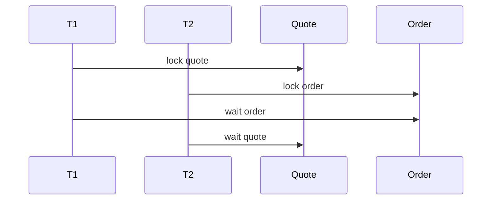

# Part 028 — Locking with MyBatis and JPA

Locking adalah mekanisme untuk menjaga invariant ketika beberapa transaksi bersaing mengubah data yang sama atau data yang saling terkait.

Locking bukan tujuan. Locking adalah alat.

Pertanyaan pertama bukan:

> Harus pakai optimistic atau pessimistic lock?

Pertanyaan pertama adalah:

> Invariant apa yang rusak jika dua transaksi berjalan bersamaan?

Setelah invariant jelas, baru pilih strategi:

- optimistic locking
- pessimistic locking
- conditional update
- unique constraint
- check constraint
- parent row lock
- advisory/business lock
- idempotency key
- serializable transaction + retry

Part ini membahas locking dari sudut pandang MyBatis dan JPA/Hibernate, terutama dalam konteks PostgreSQL dan Java/JAX-RS backend.

---

## 1. Locking Mental Model

Locking mengatur konflik antar transaksi.

Ada dua gaya utama:

| Strategy | Mental model | Cocok ketika | Trade-off |
|---|---|---|---|
| Optimistic locking | Jalan dulu, deteksi conflict saat update/flush | Conflict jarang | Perlu retry/user conflict handling |
| Pessimistic locking | Kunci dulu, transaksi lain menunggu/gagal | Conflict sering atau invariant kritikal | Lock wait, deadlock, lower throughput |

Optimistic locking bertanya:

> Apakah data berubah sejak saya membacanya?

Pessimistic locking bertanya:

> Saya akan mengubah data ini; transaksi lain harus menunggu dulu.

Keduanya valid. Yang salah adalah memilih tanpa memahami contention, transaction duration, dan business invariant.

---

## 2. Start from Invariant

Contoh invariant:

- quote hanya boleh submit dari status `DRAFT`
- order hanya boleh cancel jika belum fulfilled
- inventory tidak boleh negatif
- hanya satu active price untuk product dan effective date tertentu
- setiap event hanya boleh diproses sekali per consumer
- payment capture tidak boleh terjadi dua kali
- minimal satu approver harus aktif
- tenant A tidak boleh melihat/mengubah data tenant B

Setiap invariant membutuhkan guard.

| Invariant shape | Guard yang sering cocok |
|---|---|
| Single row state transition | Conditional update, optimistic lock |
| Single row concurrent mutation | `@Version`, manual version check |
| Parent-child aggregate invariant | Parent row lock, aggregate-level lock |
| Uniqueness | Unique constraint, UPSERT |
| Range overlap | Exclusion constraint, serializable, parent lock |
| Queue claim | `FOR UPDATE SKIP LOCKED` |
| Duplicate request/message | Idempotency table + unique constraint |
| Cross-service event consistency | Outbox/inbox pattern |

Senior review dimulai dari invariant, bukan dari annotation.

---

## 3. Optimistic Locking in JPA

JPA menyediakan optimistic locking melalui `@Version`.

Example:

```java
@Entity
@Table(name = "quote")
public class QuoteEntity {
    @Id
    private UUID id;

    @Version
    private long version;

    @Column(nullable = false)
    private String status;

    public void submit() {
        if (!"DRAFT".equals(status)) {
            throw new InvalidQuoteTransitionException(id, status, "SUBMITTED");
        }
        this.status = "SUBMITTED";
    }
}
```

Service:

```java
@Transactional
public void submit(UUID quoteId) {
    QuoteEntity quote = entityManager.find(QuoteEntity.class, quoteId);
    quote.submit();
}
```

Hibernate will generally produce update SQL with version predicate:

```sql
UPDATE quote
SET status = ?, version = ?
WHERE id = ?
  AND version = ?;
```

If no row is updated, Hibernate raises an optimistic locking exception.

Important mental model:

- `@Version` detects concurrent modification
- it does not automatically validate business transition
- business rule still belongs in domain/application logic
- conflict is detected at flush/commit time, not necessarily when setter is called

---

## 4. JPA Optimistic Lock Failure Handling

Optimistic lock conflict means:

> The row version observed by this transaction is no longer current.

Possible API responses:

- `409 Conflict` for user-facing command conflict
- retry internally for safe idempotent background operation
- reload latest state and ask user/client to re-submit
- ignore if operation is naturally idempotent and final state already matches desired outcome

Bad handling:

```java
catch (OptimisticLockException e) {
    // blindly retry forever
    submit(quoteId);
}
```

Better handling:

```java
catch (OptimisticLockException e) {
    throw new ConflictException("Quote was modified by another transaction. Reload and retry.");
}
```

For worker/background processing, bounded retry can be acceptable if:

- command is idempotent
- retry wraps the whole transaction
- external side effects are not repeated unsafely
- retry has backoff/jitter
- metrics track conflict rate

---

## 5. Optimistic Locking with MyBatis

MyBatis does not provide entity lifecycle or automatic dirty checking. Therefore optimistic locking must be explicit in SQL.

Typical table:

```sql
CREATE TABLE quote (
  id uuid PRIMARY KEY,
  status text NOT NULL,
  version bigint NOT NULL DEFAULT 0,
  updated_at timestamptz NOT NULL DEFAULT now()
);
```

Mapper:

```xml
<update id="submitQuote">
  UPDATE quote
  SET status = 'SUBMITTED',
      version = version + 1,
      updated_at = now()
  WHERE id = #{quoteId}
    AND status = 'DRAFT'
    AND version = #{expectedVersion}
</update>
```

Service:

```java
@Transactional
public void submit(SubmitQuoteCommand command) {
    int updated = quoteMapper.submitQuote(command);
    if (updated == 0) {
        throw new ConflictOrInvalidStateException(command.quoteId());
    }
}
```

The affected row count is not incidental. It is the conflict signal.

If a MyBatis command update ignores affected row count, it probably has a correctness bug.

---

## 6. Manual Version Check Pattern

A strong MyBatis write path often combines:

- identity predicate
- tenant predicate
- state predicate
- version predicate
- update timestamp
- affected row check

Example:

```sql
UPDATE quote
SET status = 'APPROVED',
    approved_by = :userId,
    approved_at = now(),
    version = version + 1
WHERE id = :quoteId
  AND tenant_id = :tenantId
  AND status = 'SUBMITTED'
  AND version = :expectedVersion;
```

This guards against:

- wrong tenant update
- invalid state transition
- lost update
- stale client command
- concurrent modification

But it also means service must interpret `0 rows updated` carefully.

Possible causes:

- quote does not exist
- tenant mismatch
- status mismatch
- version mismatch

For security, do not always reveal which one to external clients.

For internal logs, record enough safe context to debug.

---

## 7. Conditional Update vs Version Check

Sometimes state predicate is enough. Sometimes version is necessary.

Example state transition:

```sql
UPDATE quote
SET status = 'SUBMITTED'
WHERE id = :id
  AND status = 'DRAFT';
```

This prevents invalid transition from non-DRAFT.

But if two clients both update different fields while status remains valid, state predicate may not detect lost update.

Version check is better when:

- user edits form based on previously loaded state
- multiple fields can be changed independently
- stale client payload should be rejected
- update should only apply to the version the client saw

State predicate is better when:

- command is a transition, not full object replacement
- final state is naturally idempotent
- business rule depends on current state only

Often both are useful:

```sql
WHERE id = :id
  AND status = 'DRAFT'
  AND version = :expectedVersion
```

---

## 8. Pessimistic Locking in JPA

JPA supports pessimistic lock modes.

Common examples:

```java
QuoteEntity quote = entityManager.find(
    QuoteEntity.class,
    quoteId,
    LockModeType.PESSIMISTIC_WRITE
);
```

Or query:

```java
TypedQuery<QuoteEntity> query = entityManager.createQuery(
    "select q from QuoteEntity q where q.id = :id",
    QuoteEntity.class
);
query.setParameter("id", quoteId);
query.setLockMode(LockModeType.PESSIMISTIC_WRITE);
QuoteEntity quote = query.getSingleResult();
```

Mental model:

- database row lock is acquired
- other transactions trying conflicting write may wait or fail
- lock is held until transaction commit/rollback
- lock behavior depends on provider and dialect

Use when:

- conflict is common
- business action must serialize on a row
- retry cost is high
- update must be based on latest locked state

Risks:

- lock wait
- deadlock
- long transaction
- connection/thread blocking
- lower throughput

---

## 9. Pessimistic Locking in MyBatis

MyBatis lets you write PostgreSQL locking SQL directly.

Example:

```xml
<select id="findQuoteForUpdate" resultMap="QuoteResultMap">
  SELECT id, tenant_id, status, version, updated_at
  FROM quote
  WHERE id = #{quoteId}
    AND tenant_id = #{tenantId}
  FOR UPDATE
</select>
```

Then update later in the same transaction:

```xml
<update id="updateLockedQuoteStatus">
  UPDATE quote
  SET status = #{status},
      version = version + 1,
      updated_at = now()
  WHERE id = #{quoteId}
    AND tenant_id = #{tenantId}
</update>
```

Important:

- `SELECT FOR UPDATE` only matters inside a transaction
- if autocommit is on, lock is released immediately after statement
- service method must guarantee transaction boundary
- do not hold lock while doing remote calls
- lock all related rows in consistent order

---

## 10. Lock Timeout

Lock wait must be bounded.

A request thread waiting indefinitely for a database lock can become production incident:

- request latency spikes
- thread pool saturates
- connection pool saturates
- retries amplify load
- upstream timeout causes duplicate command

PostgreSQL supports lock timeout at session/transaction level.

Example:

```sql
SET LOCAL lock_timeout = '2s';

SELECT *
FROM quote
WHERE id = :quoteId
FOR UPDATE;
```

In Java, lock timeout may be configured via:

- datasource/session setting
- transaction setup
- JPA query hint
- raw SQL `SET LOCAL`
- platform/database parameter

Internal implementation must be verified.

Review questions:

- what happens when lock cannot be acquired?
- is error mapped to retry, conflict, or timeout?
- is lock wait observable?
- does lock timeout align with HTTP timeout?
- does retry create more contention?

---

## 11. NOWAIT

`NOWAIT` fails immediately if row is locked.

MyBatis SQL:

```sql
SELECT id, status, version
FROM quote
WHERE id = :quoteId
FOR UPDATE NOWAIT;
```

Good use cases:

- user-facing operation where conflict should be returned quickly
- admin action that must not block
- preventing request threads from waiting on long-running transaction
- explicit lock acquisition semantics

JPA equivalent may use provider-specific hints or lock timeout zero. Verify actual provider behavior.

Possible API mapping:

```http
409 Conflict
```

or

```http
423 Locked
```

Choose based on API convention. In many backend APIs, `409 Conflict` is simpler and more common for business concurrency conflict.

---

## 12. SKIP LOCKED

`SKIP LOCKED` is designed for parallel workers that claim available rows without blocking each other.

Example outbox claim:

```sql
WITH picked AS (
  SELECT id
  FROM outbox_event
  WHERE status = 'READY'
  ORDER BY created_at
  FOR UPDATE SKIP LOCKED
  LIMIT :batchSize
)
UPDATE outbox_event e
SET status = 'PROCESSING',
    claimed_at = now(),
    claimed_by = :workerId
FROM picked
WHERE e.id = picked.id
RETURNING e.id, e.aggregate_id, e.event_type, e.payload;
```

Good use cases:

- outbox publisher
- scheduled job queue
- retry queue
- inbox processing queue
- background batch claim

Failure modes:

- row stuck in PROCESSING after worker crash
- starvation from bad ordering
- unbounded retry of poison message
- duplicate publication if worker timeout is not handled
- missing idempotency at consumer side

Required companion design:

- processing timeout/reclaim job
- max retry count
- dead-letter state
- idempotent publisher/consumer
- metrics per status
- safe ordering assumption

---

## 13. Lock Ordering

Deadlock prevention starts with consistent lock ordering.

Bad pattern:



Better pattern:

- always lock parent before child
- always lock rows by sorted ID
- always lock quote before order if both needed
- document aggregate lock order
- keep transaction short

Example:

```sql
SELECT id
FROM quote
WHERE id IN (:quoteIds)
ORDER BY id
FOR UPDATE;
```

If multiple rows are locked, deterministic ordering matters.

---

## 14. Parent Row Lock for Aggregate Invariants

Sometimes child rows cannot protect aggregate invariant by themselves.

Example:

> Total quote item discount must not exceed allowed quote-level discount.

Multiple transactions update different `quote_item` rows.

If each transaction only locks its item row, aggregate total can become invalid.

Pattern:

```sql
SELECT id
FROM quote
WHERE id = :quoteId
FOR UPDATE;

-- then read/update quote_item rows
```

The parent quote row becomes aggregate lock.

This pattern works only if every write path that affects the aggregate invariant follows the same rule.

If one path bypasses the parent lock, invariant can still break.

---

## 15. Business-Level Lock

A business-level lock serializes operations by domain key, not necessarily by a single existing row.

Examples:

- one active pricing recalculation per product
- one quote submit workflow per quote
- one provisioning workflow per order
- one catalog publication per catalog version
- one tenant migration at a time

Implementation options:

- lock an existing parent row
- create a lock table with unique key
- use PostgreSQL advisory lock
- use Redis lock with strong caveats
- use workflow engine state if it is the true coordinator

Simple lock table idea:

```sql
CREATE TABLE business_lock (
  lock_key text PRIMARY KEY,
  owner text NOT NULL,
  acquired_at timestamptz NOT NULL,
  expires_at timestamptz NOT NULL
);
```

Acquire:

```sql
INSERT INTO business_lock (lock_key, owner, acquired_at, expires_at)
VALUES (:key, :owner, now(), now() + interval '5 minutes')
ON CONFLICT (lock_key) DO NOTHING;
```

If affected row is `0`, lock is held.

Caveats:

- expiry semantics are hard
- clock assumptions matter
- cleanup/reclaim required
- transaction coupling must be clear
- do not use lock table casually if row lock/constraint is enough

---

## 16. PostgreSQL Advisory Lock

PostgreSQL advisory locks can lock arbitrary application-defined keys.

They can be useful when:

- no natural row exists to lock
- lock key is a domain identifier
- operation must serialize across multiple tables

But they are easy to misuse.

Questions before using advisory lock:

- is lock session-level or transaction-level?
- what happens if connection is returned to pool?
- is lock key collision-safe?
- is every code path using the same key?
- is timeout/retry defined?
- is it observable?
- would a normal row lock or unique constraint be simpler?

Default preference:

1. database constraint
2. conditional update/version check
3. row lock
4. parent row lock
5. idempotency table
6. advisory lock only when justified

---

## 17. JPA Lock Modes: Practical Notes

Common JPA lock modes include:

- `OPTIMISTIC`
- `OPTIMISTIC_FORCE_INCREMENT`
- `PESSIMISTIC_READ`
- `PESSIMISTIC_WRITE`
- `PESSIMISTIC_FORCE_INCREMENT`

Practical guidance:

### `OPTIMISTIC`

Use when reading entity and requiring version check.

### `OPTIMISTIC_FORCE_INCREMENT`

Use when read itself should mark aggregate as changed or reserve version progression.

Be careful: it can create extra updates and contention.

### `PESSIMISTIC_WRITE`

Use when entity row must be locked for update.

### `PESSIMISTIC_READ`

Use carefully. Actual database behavior may not match intuition across dialects.

### `PESSIMISTIC_FORCE_INCREMENT`

Combines pessimistic lock with version increment. Useful only when you deliberately need both lock and version bump.

Always verify generated SQL.

Do not assume JPA lock mode maps exactly to the SQL you imagine.

---

## 18. Hibernate Flush and Locking

Hibernate flush can interact with locks in surprising ways.

Example:

```java
@Transactional
public void process(UUID quoteId, UUID orderId) {
    QuoteEntity quote = entityManager.find(QuoteEntity.class, quoteId);
    quote.markProcessing();

    OrderEntity order = entityManager.find(
        OrderEntity.class,
        orderId,
        LockModeType.PESSIMISTIC_WRITE
    );

    order.attachQuote(quoteId);
}
```

Before executing lock query for order, Hibernate may flush pending quote update depending on flush mode and query behavior.

Potential issues:

- lock acquisition order differs from code expectation
- update is sent earlier than expected
- deadlock risk increases
- SQL log surprises reviewer

Mitigation:

- understand flush mode
- explicitly flush only when intentional
- acquire locks before mutating managed entities if lock order matters
- keep transaction sequence simple
- verify generated SQL in tests/logs

---

## 19. Bulk Update and Locking

Bulk updates are dangerous with JPA persistence context.

Example:

```java
entityManager.createQuery("update QuoteEntity q set q.status = 'EXPIRED' where q.validTo < :now")
    .setParameter("now", now)
    .executeUpdate();
```

Risks:

- bypasses managed entity lifecycle
- persistence context may contain stale entities
- version may not behave like normal entity update unless explicitly handled
- audit/listener may be bypassed

MyBatis bulk update is explicit, but has similar correctness concerns:

```sql
UPDATE quote
SET status = 'EXPIRED'
WHERE valid_to < now()
  AND status IN ('DRAFT', 'SUBMITTED');
```

Review bulk update with:

- transaction size
- lock impact
- batch/chunk strategy
- version/audit behavior
- stale JPA context
- affected row monitoring
- retry/idempotency

---

## 20. Locking and MyBatis + JPA Mixing

Mixing frameworks can break lock assumptions.

Example:

```java
@Transactional
public void approve(UUID quoteId) {
    QuoteEntity quote = entityManager.find(QuoteEntity.class, quoteId);

    quoteMapper.lockQuoteForUpdate(quoteId); // SELECT FOR UPDATE

    quote.approve();
}
```

Problems:

- JPA entity was loaded before lock
- state may be stale by the time lock is acquired
- locking row after loading does not refresh entity automatically

Better:

```java
@Transactional
public void approve(UUID quoteId) {
    quoteMapper.lockQuoteForUpdate(quoteId);

    QuoteEntity quote = entityManager.find(QuoteEntity.class, quoteId);
    quote.approve();
}
```

Or pure JPA:

```java
QuoteEntity quote = entityManager.find(
    QuoteEntity.class,
    quoteId,
    LockModeType.PESSIMISTIC_WRITE
);
quote.approve();
```

Or pure MyBatis:

```sql
UPDATE quote
SET status = 'APPROVED', version = version + 1
WHERE id = :quoteId
  AND status = 'SUBMITTED'
  AND version = :expectedVersion;
```

Rule:

> The framework that owns the write path should also own the concurrency guard for that write path.

---

## 21. API Semantics for Lock Conflict

JAX-RS layer must translate lock/concurrency errors into useful API responses.

Possible mappings:

| Condition | Possible response | Notes |
|---|---|---|
| Optimistic lock conflict | `409 Conflict` | Client should reload/retry |
| Invalid state transition | `409 Conflict` or domain-specific 4xx | Not necessarily retryable |
| Lock timeout | `409 Conflict`, `423 Locked`, or `503` | Depends whether business conflict or infrastructure saturation |
| Deadlock victim | Retry internally if safe; otherwise `503`/`409` | Must be bounded |
| Serialization failure | Retry internally if safe; otherwise conflict/retry response | Needs idempotency |
| Duplicate idempotency key | Replay prior response or return conflict | Depends contract |

Do not leak raw SQL error messages.

Log internal details safely:

- operation name
- aggregate id if safe
- tenant id if safe
- SQLState/error category
- attempt count
- lock wait duration if known

Avoid logging PII or full SQL parameters if sensitive.

---

## 22. Locking and Event-Driven Processing

For Kafka/RabbitMQ consumers, locking must combine with idempotency.

Scenario:

- two duplicate messages arrive
- two consumers process same business event
- both try to update same order

Possible guard:

```sql
INSERT INTO inbox_message (consumer_name, message_id, received_at)
VALUES (:consumer, :messageId, now())
ON CONFLICT (consumer_name, message_id) DO NOTHING;
```

If inserted, process. If not inserted, skip/replay response.

Then state transition:

```sql
UPDATE order_state
SET status = 'FULFILLED',
    version = version + 1
WHERE order_id = :orderId
  AND status = 'READY_FOR_FULFILLMENT';
```

Locking alone does not solve duplicate messages.

Idempotency alone does not solve invalid state transition.

Use both when needed.

---

## 23. Locking and Camunda/Workflow-Oriented Systems

In workflow systems, concurrency can occur between:

- API command
- workflow task
- async job executor
- external worker
- compensation handler
- timeout handler
- manual admin action

Persistence review must ask:

- who owns state transition?
- is workflow state the source of truth or domain table?
- can API and workflow update same aggregate?
- does workflow retry duplicate a DB write?
- is there idempotency per workflow task?
- are locks held across workflow calls? They should not be.

Do not hold database transaction while waiting for workflow engine/external worker.

Use durable state + outbox/event/task boundaries.

---

## 24. Testing Locking Behavior

Testing locking requires real database behavior.

Use PostgreSQL integration tests, ideally with Testcontainers.

Test categories:

### Optimistic lock test

- read same row in two transactions
- update first transaction
- update second transaction
- assert second gets conflict

### Pessimistic lock test

- transaction A locks row
- transaction B tries lock with timeout/NOWAIT
- assert expected failure/wait behavior

### Conditional update test

- run two concurrent updates with same expected version
- assert one success, one conflict

### Deadlock/retry test

- lock rows in opposite order deliberately
- assert retry or error mapping

### SKIP LOCKED test

- run multiple workers
- assert same row is not claimed twice

Test should assert final database state, not just exceptions.

---

## 25. Troubleshooting Locking Incidents

Symptoms:

- endpoint latency spikes
- sudden pool exhaustion
- database CPU normal but requests stuck
- deadlock errors
- lock timeout errors
- worker queue stops progressing
- many rows stuck in PROCESSING
- optimistic lock conflict rate jumps
- user reports overwritten changes

Investigation sequence:

1. Identify operation and aggregate/table.
2. Check active transactions and lock wait.
3. Check transaction duration.
4. Check recent deploy/migration.
5. Check query plan/index changes.
6. Check lock ordering changes.
7. Check batch job overlap.
8. Check pod/worker scaling changes.
9. Check retry storm.
10. Check MyBatis/JPA mixed write path.
11. Reproduce with concurrent test.
12. Add regression guard.

Do not only increase timeout. Longer timeout can hide the bug and worsen resource exhaustion.

---

## 26. Common Locking Anti-Patterns

### Anti-pattern 1: Lock after read

Loading state before lock can make the loaded object stale.

Fix: lock first or refresh after lock.

### Anti-pattern 2: Long transaction with external call

```java
@Transactional
public void submit() {
    quoteMapper.lockQuoteForUpdate(id);
    externalPricingClient.calculate(...);
    quoteMapper.update(...);
}
```

Fix: do external call before transaction if safe, or use outbox/workflow.

### Anti-pattern 3: Pessimistic lock everywhere

Over-locking reduces throughput and creates deadlocks.

Fix: use optimistic locking where conflict is rare.

### Anti-pattern 4: Optimistic lock without conflict handling

Conflict exception becomes 500.

Fix: map to domain/API response or bounded retry.

### Anti-pattern 5: MyBatis update ignores affected row

Fix: affected row count is required correctness signal.

### Anti-pattern 6: JPA bulk update with stale persistence context

Fix: clear/refresh or isolate bulk operation.

### Anti-pattern 7: Lock ordering undefined

Fix: document and enforce deterministic lock order.

### Anti-pattern 8: Redis lock used where database constraint would be stronger

Fix: prefer database correctness primitive when invariant is in database.

---

## 27. PR Review Checklist

### Invariant and strategy

- What invariant requires locking or conflict detection?
- Is optimistic or pessimistic strategy justified?
- Is a database constraint more appropriate?
- Is idempotency also required?

### JPA/Hibernate

- Is `@Version` present where stale update matters?
- Is lock mode used intentionally?
- Is generated SQL verified?
- Could flush occur before lock acquisition?
- Could persistence context become stale after bulk/native/MyBatis update?

### MyBatis

- Does update include version/state/tenant predicate?
- Is affected row count checked?
- Is `FOR UPDATE` inside a real transaction?
- Are `NOWAIT` or timeout semantics defined?
- Is dynamic SQL preserving guard predicates?

### PostgreSQL

- Are lock timeout and statement timeout configured?
- Is lock ordering deterministic?
- Is `SKIP LOCKED` accompanied by reclaim/dead-letter logic?
- Are unique/check/exclusion constraints used where appropriate?

### Runtime

- Could this path hold locks during external calls?
- Could retries amplify contention?
- Are lock conflict metrics/logs available?
- Does API map conflict safely?

### Mixing frameworks

- Are MyBatis and JPA touching the same table in one transaction?
- If yes, is flush/clear/refresh explicitly handled?
- Is second-level cache safe?
- Which framework owns the write model?

---

## 28. Internal Verification Checklist

Verify in internal CSG/team context:

- Whether JPA entities consistently use `@Version` for mutable aggregates.
- Whether MyBatis update mappers use version/state predicates.
- Whether affected row counts are checked in command paths.
- Whether JPA pessimistic locks are used and how they map to PostgreSQL SQL.
- Whether lock timeout is configured globally or per transaction/query.
- Whether statement timeout exists and how it interacts with lock wait.
- Whether `FOR UPDATE`, `NOWAIT`, and `SKIP LOCKED` are used in mappers.
- Whether outbox/job queues use `SKIP LOCKED` and have reclaim logic.
- Whether lock ordering is documented for multi-row/multi-table operations.
- Whether MyBatis and JPA write the same tables.
- Whether Hibernate second-level cache is enabled for entities touched by MyBatis.
- Whether deadlock/lock timeout/optimistic lock conflicts are observable in dashboards.
- Whether concurrency tests exist for critical state transitions.
- Whether retry policy distinguishes deadlock, serialization failure, lock timeout, and optimistic conflict.
- Whether incident notes mention stale object, overwritten update, duplicate processing, or lock wait.

---

## 29. Summary

Locking is not about adding `FOR UPDATE` or `@Version` everywhere.

A senior persistence engineer thinks in this order:

1. Identify invariant.
2. Identify all concurrent actors.
3. Identify all write paths.
4. Choose the simplest correctness primitive.
5. Keep transaction short.
6. Check conflict signal.
7. Map error to domain/API semantics.
8. Test with real PostgreSQL concurrency.
9. Observe lock/conflict behavior in production.
10. Revisit design if MyBatis and JPA both touch the same data.

Optimistic locking is usually better for rare conflicts.

Pessimistic locking is useful for critical or frequent conflicts.

Constraints are often stronger than application checks.

Idempotency is mandatory for retry and message processing.

And when MyBatis and JPA are mixed, the write model and concurrency guard must be explicit. Otherwise, locking becomes an illusion.
