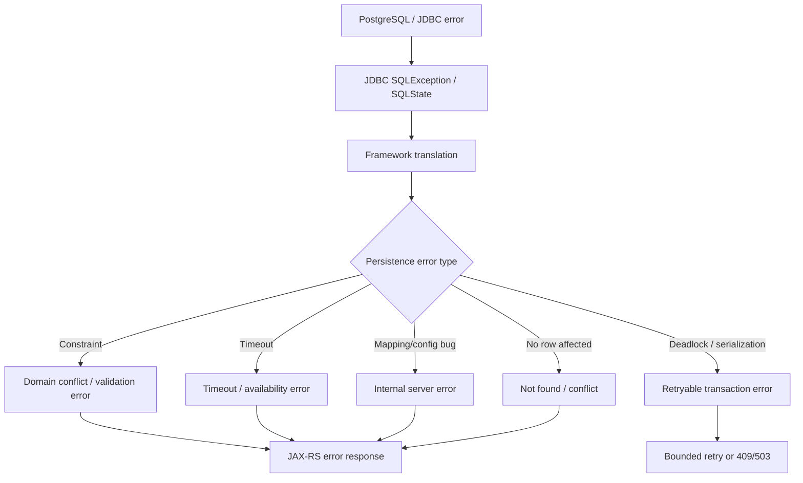
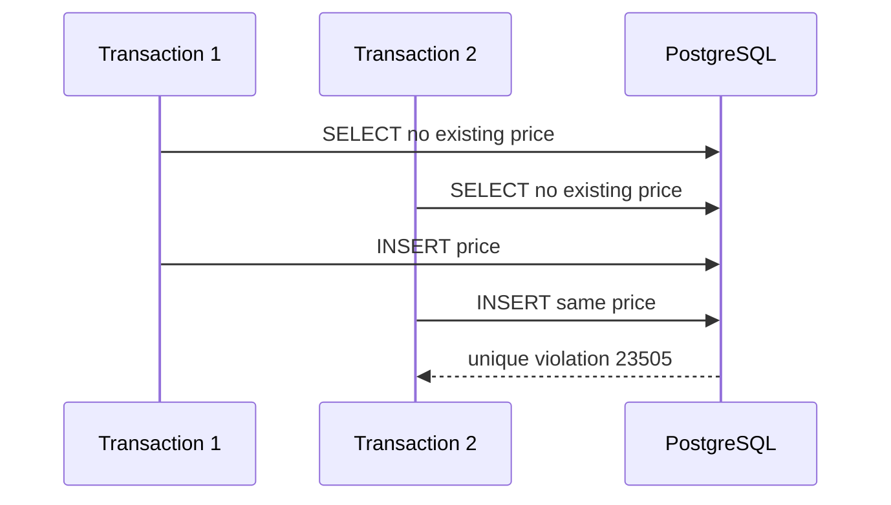
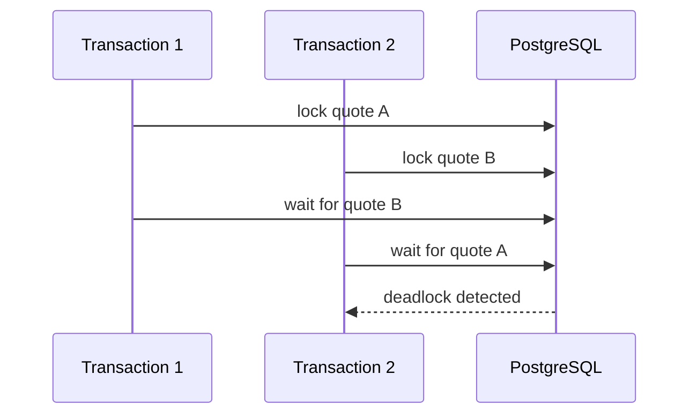

# Part 029 — Error Handling and Exception Mapping

Persistence error handling bukan sekadar `try-catch`.

Di enterprise Java/JAX-RS service, error persistence layer harus diterjemahkan secara disiplin dari:

- database error
- JDBC exception
- MyBatis exception
- JPA exception
- Hibernate exception
- transaction manager exception
- domain/application error
- HTTP API error
- retry decision
- observability signal

Tujuannya bukan menyembunyikan error.

Tujuannya adalah menjaga tiga hal:

1. **Correctness** — aplikasi tidak menganggap write gagal sebagai berhasil, atau sebaliknya.
2. **Contract** — client menerima error yang stabil dan tidak membocorkan detail internal.
3. **Operability** — engineer bisa menemukan root cause dari log, metric, trace, dan database evidence.

Error persistence yang buruk sering muncul sebagai:

- semua exception menjadi `500 Internal Server Error`
- unique constraint violation tidak menjadi `409 Conflict`
- deadlock tidak di-retry padahal aman
- serialization failure diabaikan
- timeout tidak dibedakan antara DB timeout, pool timeout, dan HTTP timeout
- MyBatis mapping error dianggap data not found
- JPA optimistic lock exception tidak diterjemahkan menjadi conflict
- detail SQL/PII bocor ke response
- rollback tidak terjadi karena exception dibungkus secara salah

Senior engineer harus bisa membaca error sebagai bagian dari lifecycle transaksi, bukan sebagai kejadian lokal di satu method.

---

## 1. Error Mapping Mental Model

Setiap persistence error perlu dijawab dengan beberapa pertanyaan:

1. Error terjadi di layer mana?
2. Apakah transaksi sudah rollback?
3. Apakah operasi aman untuk di-retry?
4. Apakah client harus mengubah request?
5. Apakah data sudah berubah sebagian?
6. Apakah error menunjukkan bug code, contention normal, data quality issue, atau masalah infrastructure?
7. Apa status HTTP yang paling defensible?
8. Apa metric/log/trace yang harus muncul?
9. Apakah response boleh memuat detail error?

Flow sederhananya:



Yang harus dihindari:

```java
catch (Exception e) {
    return Response.serverError().build();
}
```

Ini menghapus informasi paling penting: apakah error retryable, conflict, invalid request, bug, atau incident.

---

## 2. Error Taxonomy for Persistence Layer

Klasifikasi praktis:

| Error family | Contoh | Biasanya retryable? | Biasanya HTTP |
|---|---|---:|---|
| Input/domain invalid | status transition invalid, missing required business field | Tidak | `400`, `409`, `422` tergantung API convention |
| Constraint violation | unique, FK, check, not null | Tidak, kecuali race pada idempotency | `400`, `409`, `422` |
| Optimistic lock conflict | JPA `@Version`, manual version check | Kadang | `409` |
| Deadlock | PostgreSQL deadlock detected | Ya, jika whole transaction idempotent | `409`, `503`, atau internal retry |
| Serialization failure | serializable conflict | Ya, jika whole transaction idempotent | internal retry, lalu `409`/`503` jika gagal |
| Lock timeout | tidak dapat memperoleh lock dalam waktu tertentu | Kadang | `409`, `423`, `503` sesuai contract |
| Query timeout | statement terlalu lama | Kadang | `504`, `503`, atau `500` sesuai gateway/runtime |
| Pool exhaustion | tidak dapat mengambil connection | Kadang | `503` |
| Mapping/config bug | wrong column, bad ResultMap, lazy loading outside transaction | Tidak | `500` |
| Data quality bug | duplicate data tidak diharapkan, orphan row | Tidak | `500` atau domain-specific error |
| Availability issue | DB down, network error | Ya dengan backoff | `503` |

Klasifikasi ini tidak boleh hanya ada di kepala engineer. Idealnya ia muncul dalam:

- exception hierarchy
- JAX-RS `ExceptionMapper`
- retry policy
- metric tags
- log fields
- runbook production

---

## 3. SQLException and SQLState

JDBC membawa error database melalui `SQLException`.

Hal penting:

- `SQLException#getSQLState()` memberi kode standar/driver-specific family.
- `SQLException#getErrorCode()` dapat membawa vendor-specific code.
- `SQLException#getNextException()` bisa menyimpan detail tambahan.
- Framework seperti MyBatis/Hibernate sering membungkus SQLException.

Contoh handling rendah level:

```java
try (PreparedStatement ps = connection.prepareStatement(sql)) {
    ps.executeUpdate();
} catch (SQLException e) {
    String sqlState = e.getSQLState();
    throw translateSqlException(sqlState, e);
}
```

Namun di aplikasi enterprise, translation biasanya dilakukan di boundary persistence/application, bukan tersebar di semua DAO method.

Anti-pattern:

```java
catch (SQLException e) {
    throw new RuntimeException(e.getMessage());
}
```

Masalahnya:

- SQLState hilang dari domain error.
- Error family hilang.
- Retryability tidak bisa ditentukan.
- Message raw database berpotensi bocor.
- Observability menjadi lemah.

Lebih baik:

```java
catch (SQLException e) {
    throw persistenceExceptionTranslator.translate("submitQuote", e);
}
```

Dengan hasil translation seperti:

```java
public sealed interface PersistenceFailure permits
    UniqueConflictFailure,
    ForeignKeyFailure,
    DeadlockFailure,
    SerializationFailure,
    QueryTimeoutFailure,
    UnknownPersistenceFailure {

    String operation();
    boolean retryable();
}
```

---

## 4. PostgreSQL SQLState Families That Matter

Dalam konteks PostgreSQL, beberapa SQLState sangat penting untuk persistence engineer.

| SQLState | Meaning | Typical cause | Handling bias |
|---|---|---|---|
| `23505` | unique violation | duplicate key, idempotency conflict, race | `409` atau idempotent replay |
| `23503` | foreign key violation | parent missing, delete restricted | `400`/`409`/bug tergantung context |
| `23502` | not null violation | code tidak mengisi mandatory column | biasanya bug atau `400` jika input direct |
| `23514` | check violation | invariant database gagal | `400`/`409`/bug tergantung invariant |
| `40001` | serialization failure | serializable/repeatable-read conflict | retryable |
| `40P01` | deadlock detected | lock cycle antar transaksi | retryable if safe |
| `55P03` | lock not available | NOWAIT/lock timeout style conflict | retryable/`409`/`503` |
| `57014` | query canceled | statement timeout/cancel | timeout handling |

Catatan penting:

- Jangan hard-code semua mapping di banyak tempat.
- Buat translation terpusat.
- Tetap log SQLState dan operation name.
- Jangan kirim raw SQLState ke public API kecuali API contract memang mengizinkan internal diagnostic code yang disanitasi.

Contoh mapping internal:

```java
public PersistenceError translateSqlState(String operation, String sqlState, Throwable cause) {
    return switch (sqlState) {
        case "23505" -> new UniqueConstraintConflict(operation, cause);
        case "23503" -> new ReferentialIntegrityFailure(operation, cause);
        case "23502" -> new RequiredColumnMissing(operation, cause);
        case "23514" -> new CheckConstraintFailure(operation, cause);
        case "40001" -> new SerializationConflict(operation, cause);
        case "40P01" -> new DeadlockConflict(operation, cause);
        case "55P03" -> new LockUnavailable(operation, cause);
        case "57014" -> new StatementTimeout(operation, cause);
        default -> new UnknownPersistenceError(operation, sqlState, cause);
    };
}
```

---

## 5. Constraint Violation Is Not Always Validation Error

Constraint violation bisa berarti beberapa hal berbeda.

Contoh `unique violation`:

| Scenario | Meaning | API handling |
|---|---|---|
| User membuat username yang sudah ada | User conflict | `409 Conflict` |
| Idempotency key sudah ada dan result tersedia | Duplicate retry | replay previous response |
| Dua request submit quote menciptakan same derived row | Race condition | `409` atau retry depending semantics |
| Data duplicate karena bug migration | Internal data corruption | `500` + incident |
| Unique constraint dipakai untuk business invariant | Business conflict | `409` |

Jadi SQLState saja tidak cukup. Mapping harus mempertimbangkan:

- operation name
- constraint name
- table/domain context
- request intent
- idempotency semantics
- whether previous state can be safely interpreted

Lebih baik jika translator bisa membaca constraint name.

Pseudo-shape:

```java
public DomainException translateConstraint(String operation, String constraintName, Throwable cause) {
    return switch (constraintName) {
        case "uk_quote_number" -> new QuoteNumberAlreadyExists(cause);
        case "uk_idempotency_key" -> new DuplicateRequestDetected(cause);
        case "ck_quote_status" -> new InvalidQuoteStatePersisted(cause);
        default -> new PersistenceConflict(operation, cause);
    };
}
```

Checklist review:

- Constraint name harus stabil dan meaningful.
- Migration harus memberi nama constraint eksplisit.
- Error mapping jangan bergantung pada message string raw database.
- Domain exception jangan mengekspos nama table/constraint jika tidak aman.

---

## 6. Unique Violation and Race Conditions

Unique constraint sering menjadi guard terbaik untuk race condition.

Contoh: hanya satu active price untuk `(product_id, currency, valid_from)`.

```sql
ALTER TABLE price
ADD CONSTRAINT uk_price_active_window
UNIQUE (product_id, currency, valid_from);
```

Dua transaksi bisa lolos application-level validation:

```java
if (!priceRepository.exists(productId, currency, validFrom)) {
    priceRepository.insert(command);
}
```

Tetapi hanya database yang bisa menutup race sepenuhnya.

Flow race:



Correct handling:

- Application validation tetap boleh ada untuk UX.
- Unique constraint tetap wajib untuk correctness.
- Unique violation diterjemahkan ke domain conflict.
- Jangan menganggap unique violation sebagai unexpected error jika constraint memang bagian dari invariant.

---

## 7. Foreign Key Violation

Foreign key violation dapat berarti:

- request mengacu ke parent yang tidak ada
- parent dihapus oleh transaksi lain
- service melakukan write dalam urutan salah
- migration/test fixture tidak lengkap
- boundary service salah karena mengacu ke data yang bukan miliknya

Contoh mapping:

| Context | Meaning | Handling |
|---|---|---|
| Create order with missing customer ID | invalid reference | `400` atau `404` depending API contract |
| Delete product still used by price | conflict | `409` |
| Insert child before parent in same transaction | code bug/order bug | `500` |
| Cross-service foreign key impossible | boundary smell | architecture review |

Rule penting:

> FK violation bukan selalu user error. Kadang itu tanda application flow atau ownership model salah.

Internal review harus bertanya:

- Apakah foreign key merepresentasikan ownership yang benar?
- Apakah delete policy jelas?
- Apakah parent check dan insert child berada dalam transaction boundary yang sama?
- Apakah referential integrity lintas service justru membuat coupling yang tidak diinginkan?

---

## 8. Check Constraint Violation

Check constraint bagus untuk invariant sederhana:

```sql
ALTER TABLE quote
ADD CONSTRAINT ck_quote_total_non_negative
CHECK (total_amount >= 0);
```

Jika check constraint gagal, artinya minimal salah satu ini terjadi:

- API validation kurang
- domain invariant kurang
- mapper/entity mapping salah
- data migration menghasilkan value invalid
- database constraint lebih baru daripada code path lama

Handling:

- Jika constraint mewakili user input langsung: `400`/`422` bisa masuk akal.
- Jika constraint mewakili invariant internal: treat as bug/incident.
- Jika constraint gagal akibat concurrent state: bisa menjadi `409`.

Jangan otomatis kirim:

```json
{
  "error": "ck_quote_total_non_negative violated"
}
```

Lebih baik public error:

```json
{
  "code": "INVALID_QUOTE_TOTAL",
  "message": "Quote total must not be negative."
}
```

Sambil log internal memuat:

- operation
- constraint
- SQLState
- correlation ID
- entity/aggregate ID jika aman

---

## 9. Deadlock Handling

Deadlock terjadi ketika transaksi saling menunggu lock membentuk cycle.

Contoh:



Deadlock bukan selalu bug fatal. Dalam sistem concurrent, deadlock bisa terjadi jika lock order tidak konsisten.

Respons yang baik:

1. Rollback transaksi yang gagal.
2. Jika operasi idempotent, retry seluruh transaksi dengan backoff.
3. Jika retry gagal, return error yang aman.
4. Log deadlock dengan operation name dan involved aggregate IDs jika aman.
5. Perbaiki lock ordering jika deadlock sering.

Bad retry:

```java
catch (DeadlockLoserDataAccessException e) {
    repository.save(entity); // retry partial operation only
}
```

Good retry principle:

> Retry harus mengulang seluruh transaction boundary, bukan potongan mapper/entity operation di tengah state yang sudah berubah.

Pseudo-code:

```java
public <T> T runWithRetry(Supplier<T> txOperation) {
    int maxAttempts = 3;
    for (int attempt = 1; attempt <= maxAttempts; attempt++) {
        try {
            return txTemplate.execute(status -> txOperation.get());
        } catch (DeadlockConflict | SerializationConflict e) {
            if (attempt == maxAttempts) throw e;
            sleepWithJitter(attempt);
        }
    }
    throw new IllegalStateException("unreachable");
}
```

---

## 10. Serialization Failure Handling

Serialization failure biasanya berarti database tidak bisa mempertahankan serializable ordering untuk transaksi concurrent.

SQLState penting:

```text
40001
```

Handling bias:

- retryable jika whole operation idempotent
- retry whole transaction
- cap retry attempt
- add jitter/backoff
- track metric
- do not retry external side effects blindly

Contoh masalah:

```java
@Transactional
public void approveAndPublish(UUID quoteId) {
    quoteRepository.approve(quoteId);
    externalPublisher.publishQuoteApproved(quoteId); // unsafe inside retryable transaction
}
```

Jika transaksi gagal setelah external publish, retry bisa menerbitkan event ganda.

Lebih aman:

```java
@Transactional
public void approve(UUID quoteId) {
    quoteRepository.approve(quoteId);
    outboxRepository.insertQuoteApprovedEvent(quoteId);
}
```

Lalu publisher outbox melakukan delivery dengan idempotency.

---

## 11. Lock Timeout vs Query Timeout vs Connection Timeout

Timeout tidak sama.

| Timeout | Terjadi ketika | Source | Signal |
|---|---|---|---|
| Connection acquisition timeout | tidak dapat mengambil connection dari pool | connection pool | pool exception |
| Connect/socket timeout | tidak dapat connect/read network DB | driver/network | SQL/network exception |
| Statement/query timeout | query berjalan terlalu lama | JDBC/DB | query canceled / timeout |
| Lock timeout | query menunggu lock terlalu lama | PostgreSQL | lock unavailable/canceled |
| Transaction timeout | transaksi melewati limit framework | transaction manager | rollback/timeout exception |
| HTTP timeout | request melewati limit gateway/client | API edge | client sees timeout |

Jika semua dianggap `timeout`, debugging akan lambat.

Field log yang berguna:

```json
{
  "operation": "submitQuote",
  "timeoutType": "LOCK_TIMEOUT",
  "sqlState": "55P03",
  "aggregateType": "Quote",
  "aggregateId": "...",
  "transactionName": "QuoteService.submit",
  "correlationId": "..."
}
```

Production review:

- Apakah timeout DB lebih pendek dari HTTP gateway timeout?
- Apakah transaction timeout lebih pendek dari worker visibility timeout?
- Apakah lock timeout sengaja dikonfigurasi?
- Apakah statement timeout berbeda untuk OLTP vs reporting query?
- Apakah pool timeout terlihat di dashboard?

---

## 12. MyBatis Exception Mapping

MyBatis biasanya membungkus error dalam runtime exception seperti `PersistenceException` atau exception integration layer framework.

Common sources:

- SQL syntax error
- parameter binding error
- ResultMap mismatch
- TypeHandler error
- too many results for expected single result
- duplicate mapper statement ID
- missing mapper XML
- database constraint violation
- timeout/deadlock from JDBC

Contoh failure:

```xml
<select id="findQuote" resultMap="QuoteResultMap">
  SELECT id, quote_number, status
  FROM quote
  WHERE id = #{id}
</select>
```

Jika `QuoteResultMap` membaca column `version` tetapi query tidak mengambil `version`, mapping bisa gagal atau menghasilkan null/salah tergantung mapping.

Rule:

- Mapping/config error adalah bug, bukan user error.
- SQLState error harus diekstrak dari cause chain jika ada.
- MyBatis mapper operation name harus masuk log.
- Jangan kirim mapper statement ID ke public response.

Pseudo-translator:

```java
public RuntimeException translateMyBatis(String mapperStatement, RuntimeException e) {
    SQLException sql = findCause(e, SQLException.class);
    if (sql != null) {
        return sqlTranslator.translate(mapperStatement, sql);
    }
    return new PersistenceMappingFailure(mapperStatement, e);
}
```

Internal log:

```text
operation=QuoteMapper.submitQuote
framework=mybatis
failureFamily=CONSTRAINT_VIOLATION
sqlState=23505
constraint=uk_quote_number
```

---

## 13. JPA and Hibernate Exception Mapping

JPA/Hibernate errors sering datang dari beberapa kategori:

| Category | Example | Meaning |
|---|---|---|
| Entity state | detached entity passed to persist, lazy init outside session | lifecycle misuse |
| Query | invalid JPQL, non unique result, no result | query contract issue |
| Constraint | database constraint violation | DB invariant failed |
| Locking | optimistic/pessimistic lock exception | concurrency conflict |
| Flush | exception thrown at flush/commit | delayed write failed |
| Mapping | unknown column/table, wrong relation | mapping/schema mismatch |
| Timeout | query/lock/transaction timeout | performance/availability issue |

Critical point:

> In JPA/Hibernate, write error may happen at `flush()` or transaction commit, not at the line where entity was mutated.

Example:

```java
@Transactional
public void rename(UUID id, String newName) {
    ProductEntity product = entityManager.find(ProductEntity.class, id);
    product.setName(newName);
    // no SQL yet
    auditService.recordRename(id); // may run before DB detects constraint violation
    // flush/commit may fail here
}
```

Implication:

- Jangan menganggap setter success berarti persistence success.
- Jika perlu detect constraint earlier, call `flush()` deliberately at boundary yang tepat.
- Jangan melakukan irreversible side effect sebelum transaction commit.
- Gunakan outbox untuk event publication.

---

## 14. Flush-Time Exceptions

JPA/Hibernate delayed write membuat exception timing berbeda dari MyBatis.

MyBatis:

```java
mapper.updateQuoteStatus(id, status); // SQL happens here
```

JPA:

```java
quote.setStatus(status); // SQL may not happen yet
```

Flush bisa terjadi:

- before commit
- before JPQL query depending flush mode
- when `entityManager.flush()` is called
- before native query in some cases depending provider/integration

Failure mode:

```java
@Transactional
public QuoteResponse submit(UUID id) {
    QuoteEntity quote = quoteRepository.get(id);
    quote.submit();

    QuoteSummary summary = quoteMapper.findSummary(id); // may trigger flush before query

    return toResponse(summary);
}
```

Jika `quote.submit()` melanggar constraint, exception bisa muncul saat MyBatis/JPA query berikutnya, bukan di mutation line.

Review checklist:

- Apakah code memahami kapan flush terjadi?
- Apakah exception mapper menangani flush-time constraint violation?
- Apakah mixed MyBatis/JPA path melakukan explicit flush/clear bila perlu?
- Apakah log operation name tetap jelas walau exception muncul di commit?

---

## 15. Optimistic Lock Exception Mapping

JPA optimistic lock exception biasanya harus diterjemahkan sebagai conflict, bukan generic server error.

Public shape:

```json
{
  "code": "CONCURRENT_MODIFICATION",
  "message": "The resource was modified by another transaction. Reload and retry."
}
```

HTTP bias:

```text
409 Conflict
```

Untuk MyBatis manual version check:

```xml
<update id="updateQuoteStatus">
  UPDATE quote
  SET status = #{status}, version = version + 1
  WHERE id = #{id}
    AND version = #{expectedVersion}
</update>
```

Java:

```java
int updated = quoteMapper.updateQuoteStatus(command);
if (updated == 0) {
    throw new ConcurrentModificationException(command.id());
}
```

Jangan return success jika `updated == 0` kecuali operasi memang idempotent dan sudah diverifikasi current state-nya.

---

## 16. No Row Affected Is a Signal

Dalam MyBatis/JDBC, update/delete count adalah bagian dari correctness.

```java
int updated = mapper.cancelQuote(id);
```

Jika `updated == 0`, kemungkinan:

- row tidak ada
- row sudah dalam state yang tidak cocok
- tenant filter tidak cocok
- version mismatch
- soft delete filter mengecualikan row
- optimistic lock conflict
- concurrent update menang lebih dulu

Jangan abaikan:

```java
mapper.cancelQuote(id); // bad if return count ignored
```

Lebih baik:

```java
int updated = mapper.cancelQuote(id, expectedVersion, tenantId);
if (updated == 0) {
    QuoteState current = mapper.findState(id, tenantId);
    if (current == null) throw new QuoteNotFound(id);
    throw new QuoteStateConflict(id, current.status());
}
```

Review rule:

> Setiap command update/delete berbasis predicate harus punya policy terhadap zero-row update.

---

## 17. Data Not Found vs Access Denied vs Tenant Mismatch

Persistence layer sering tidak bisa langsung membedakan:

```sql
SELECT *
FROM quote
WHERE id = :id
  AND tenant_id = :tenantId;
```

Jika hasil kosong, artinya bisa:

- quote tidak ada
- quote ada tetapi tenant berbeda
- quote soft deleted
- user tidak punya akses

Public API sering sengaja mengembalikan `404 Not Found` untuk menghindari resource enumeration.

Namun internal log harus bisa membedakan jika aman:

- `NOT_FOUND`
- `TENANT_MISMATCH`
- `SOFT_DELETED`
- `ACCESS_DENIED`

Jangan memaksakan persistence repository selalu membedakan semua ini. Kadang perbedaan ini milik application/security layer.

Checklist:

- Apakah repository method tenant-aware?
- Apakah public 404 sengaja dipakai untuk access hiding?
- Apakah internal diagnostic cukup untuk debugging?
- Apakah audit mencatat denied access jika perlu?

---

## 18. HTTP Error Mapping in JAX-RS

JAX-RS biasanya menggunakan `ExceptionMapper`.

Contoh domain exception:

```java
public class QuoteConflictException extends RuntimeException {
    private final String code;

    public QuoteConflictException(String code, String message) {
        super(message);
        this.code = code;
    }

    public String code() {
        return code;
    }
}
```

Error response:

```java
public record ErrorResponse(
    String code,
    String message,
    String correlationId
) {}
```

Mapper:

```java
@Provider
public class QuoteConflictExceptionMapper implements ExceptionMapper<QuoteConflictException> {
    @Context
    HttpHeaders headers;

    @Override
    public Response toResponse(QuoteConflictException ex) {
        return Response.status(Response.Status.CONFLICT)
            .entity(new ErrorResponse(ex.code(), ex.getMessage(), correlationId()))
            .build();
    }
}
```

Persistence-specific exception sebaiknya tidak langsung menjadi public API shape tanpa translation.

Bad:

```java
@Provider
public class SQLExceptionMapper implements ExceptionMapper<SQLException> {
    public Response toResponse(SQLException e) {
        return Response.serverError().entity(e.getMessage()).build();
    }
}
```

Problem:

- raw message bocor
- constraint/table/SQL bisa bocor
- error code public tidak stabil
- domain context hilang

Lebih baik:

```text
SQLException -> PersistenceFailure -> Domain/ApplicationException -> JAX-RS ErrorResponse
```

---

## 19. Public Error Contract

Public error contract harus stabil.

Contoh:

```json
{
  "code": "QUOTE_ALREADY_SUBMITTED",
  "message": "Quote is already submitted.",
  "correlationId": "2d40c3..."
}
```

Field yang umumnya aman:

- stable application error code
- user-safe message
- correlation/request ID
- optional retry hint
- optional validation field errors

Field yang harus hati-hati:

- SQL text
- table name
- column name
- constraint name
- stack trace
- raw database message
- PII value
- tenant ID
- internal service name

Untuk internal clients, mungkin ada richer detail. Namun tetap harus versioned dan aman.

---

## 20. Retryable vs Non-Retryable Error

Retry bukan solusi umum. Retry adalah keputusan correctness.

Retryable jika:

- failure transient
- transaction rollback sempurna
- operasi idempotent atau seluruh side effect terlindungi
- external calls tidak diulang secara unsafe
- retry bounded
- ada backoff/jitter
- ada metric

Non-retryable jika:

- request invalid
- constraint violation karena user conflict
- mapping/config bug
- data corruption
- permission/tenant error
- duplicate operation tanpa idempotency handling

Matrix:

| Error | Retry? | Notes |
|---|---:|---|
| Deadlock | Ya, bounded | retry whole transaction |
| Serialization failure | Ya, bounded | expected under serializable contention |
| Lock timeout | Kadang | depends business semantics |
| Pool exhaustion | Kadang | can worsen storm; use backoff/circuit breaker |
| Unique violation | Biasanya tidak | except idempotency replay or UPSERT semantics |
| FK violation | Tidak | usually invalid reference/bug |
| Optimistic lock | Kadang | user command usually `409`; background may retry |
| Query timeout | Kadang | retry may repeat expensive query |
| Mapping error | Tidak | fix code/config |

Anti-pattern:

```java
@Retryable(Exception.class)
@Transactional
public void submit(...) { ... }
```

Ini bisa mengulang:

- invalid request
- unique conflict
- mapping bug
- external side effect
- non-idempotent command

Retry policy harus sempit dan sadar error family.

---

## 21. Rollback Semantics

Exception mapping harus memperhatikan rollback.

Pertanyaan penting:

- Exception checked atau unchecked?
- Framework transaction melakukan rollback untuk exception tersebut?
- Exception dibungkus menjadi tipe yang tidak memicu rollback?
- Catch block menelan exception lalu commit?
- Partial failure ditandai rollback-only?

Bad:

```java
@Transactional
public void createOrder(Command command) {
    try {
        orderRepository.insert(command);
        outboxRepository.insert(...);
    } catch (PersistenceException e) {
        log.warn("failed to create outbox", e);
    }
}
```

Jika exception ditelan, transaction bisa commit order tanpa outbox.

Better:

```java
@Transactional
public void createOrder(Command command) {
    orderRepository.insert(command);
    outboxRepository.insert(...);
}
```

Atau jika partial failure benar-benar acceptable, harus explicit dan documented.

Review checklist:

- Catch block di dalam transaction harus dicurigai.
- Jangan swallow persistence exception tanpa compensating action.
- Pastikan domain exception yang harus rollback memang memicu rollback.
- Pastikan retry wrapper berada di luar transaction boundary.

---

## 22. Exception Translation Boundary

Tempat translation yang sehat:

```text
Infrastructure exception
    -> Persistence/application exception
        -> Domain/API exception
            -> HTTP response
```

Jangan menyebar translation di semua mapper/repository method kecuali ada alasan kuat.

Pattern:

```java
public class QuoteRepository {
    public void submit(SubmitQuoteCommand command) {
        try {
            int updated = mapper.submit(command);
            if (updated == 0) throw new QuoteStateConflict(command.id());
        } catch (RuntimeException e) {
            throw translator.translate("QuoteRepository.submit", e);
        }
    }
}
```

Namun hati-hati: translator jangan mengubah semua error menjadi domain conflict.

Bagus jika translator memisahkan:

- constraint family
- concurrency family
- timeout family
- mapping/config family
- unknown family

---

## 23. Error Handling with MyBatis + JPA Mixing

Saat MyBatis dan JPA dipakai bersama, error timing bisa mengejutkan.

Scenario:

```java
@Transactional
public void submit(UUID id) {
    QuoteEntity quote = entityManager.find(QuoteEntity.class, id);
    quote.submit();

    quoteMapper.insertAuditRow(id); // MyBatis SQL now
}
```

Kemungkinan:

- JPA belum flush update quote.
- MyBatis insert audit sukses.
- JPA flush gagal di commit karena constraint/optimistic lock.
- Semua rollback jika transaction sama.
- Log bisa menunjuk ke commit, bukan ke `quote.submit()`.

Scenario lain:

```java
@Transactional
public Summary submitAndRead(UUID id) {
    QuoteEntity quote = entityManager.find(QuoteEntity.class, id);
    quote.submit();

    return quoteMapper.findSummary(id); // may see old DB state unless flush occurs
}
```

Possible guard:

```java
entityManager.flush();
Summary summary = quoteMapper.findSummary(id);
```

Atau hindari mixed same-use-case path.

Error handling checklist untuk mixed path:

- Apakah MyBatis dan JPA ikut transaction manager yang sama?
- Apakah flush timing explicit?
- Apakah persistence context bisa stale setelah mapper write?
- Apakah exception dari commit tetap dimap ke operation yang benar?
- Apakah second-level cache bisa stale?
- Apakah retry mengulang seluruh mixed transaction?

---

## 24. Logging Persistence Errors Safely

Log persistence error harus cukup untuk debugging tetapi tidak bocor.

Recommended fields:

- `correlationId`
- `requestId`
- `operation`
- `repositoryOrMapper`
- `aggregateType`
- `aggregateId` jika aman
- `tenantId` jika policy mengizinkan internal log
- `sqlState`
- `constraintName`
- `retryable`
- `attempt`
- `transactionName`
- `durationMs`
- `failureFamily`

Avoid:

- raw SQL dengan PII values
- full bind parameter tanpa redaction
- stack trace di response
- card/payment/credential data
- raw personal data

Example structured log:

```json
{
  "level": "WARN",
  "event": "persistence.error",
  "operation": "QuoteRepository.submit",
  "failureFamily": "OPTIMISTIC_LOCK",
  "retryable": false,
  "httpStatus": 409,
  "aggregateType": "Quote",
  "aggregateId": "a3f...",
  "correlationId": "c7e..."
}
```

For incident-grade unknown errors:

```json
{
  "level": "ERROR",
  "event": "persistence.error",
  "operation": "PriceMapper.searchActivePrices",
  "failureFamily": "SQL_SYNTAX_OR_MAPPING",
  "framework": "mybatis",
  "mapperStatement": "PriceMapper.searchActivePrices",
  "correlationId": "..."
}
```

---

## 25. Metrics and Alerts for Persistence Errors

Error handling tidak lengkap tanpa metrics.

Useful metrics:

- persistence error count by family
- SQLState count
- constraint violation count by constraint family
- deadlock count
- serialization failure count
- lock timeout count
- query timeout count
- pool acquisition timeout count
- optimistic lock conflict rate
- retry attempts and retry exhaustion
- mapper mapping failure count
- JPA flush failure count

Example dimensions:

```text
persistence_errors_total{
  service="quote-order",
  operation="submitQuote",
  framework="jpa",
  family="optimistic_lock",
  retryable="false"
}
```

Alerting principles:

- A few optimistic conflicts can be normal.
- Sudden spike in unique violations may indicate duplicate requests or client bug.
- Deadlock spike indicates lock order/regression.
- Query timeout spike indicates performance regression or DB pressure.
- Pool timeout spike indicates resource exhaustion or connection leak.
- Mapping failure should usually page or block deploy, because it is code/config bug.

---

## 26. Domain Error vs Persistence Error

Do not let persistence framework vocabulary dominate domain contract.

Bad API response:

```json
{
  "code": "PSQL_EXCEPTION_23505",
  "message": "duplicate key value violates unique constraint uk_quote_number"
}
```

Better:

```json
{
  "code": "QUOTE_NUMBER_ALREADY_EXISTS",
  "message": "A quote with this number already exists."
}
```

But internal logs should preserve persistence detail:

```json
{
  "domainCode": "QUOTE_NUMBER_ALREADY_EXISTS",
  "sqlState": "23505",
  "constraint": "uk_quote_number"
}
```

Rule:

> Public error speaks domain language. Internal diagnostic speaks system language.

---

## 27. Error Handling and Security

Persistence error can leak sensitive details.

Dangerous leak examples:

- `password_hash` column name in response
- tenant ID in public message
- raw SQL in API error
- duplicate email confirmation revealing account existence
- stack trace showing package names and SQL paths
- PII value in constraint violation detail

Safer public message:

```text
The request conflicts with an existing resource.
```

For sensitive uniqueness checks, domain may intentionally return generic message.

Example account existence:

```json
{
  "code": "REQUEST_NOT_ACCEPTED",
  "message": "The request cannot be completed."
}
```

Internal verification:

- Check API error payloads.
- Check logs for SQL bind values.
- Check exception mapper fallback.
- Check gateway/API policy for stack traces.
- Check support tooling access to logs.

---

## 28. Testing Exception Mapping

Persistence exception mapping needs tests.

Test categories:

1. Unique violation maps to domain conflict.
2. FK violation maps to invalid reference/conflict.
3. Check violation maps to domain validation/internal bug as appropriate.
4. Optimistic lock maps to `409`.
5. Deadlock/serialization failure triggers bounded retry.
6. Retry exhaustion maps to safe error.
7. Query timeout maps to timeout/service unavailable.
8. Mapper mapping bug maps to `500` without raw detail.
9. JPA flush-time exception is translated correctly.
10. SQL/PII is not exposed in response.

Example integration test shape:

```java
@Test
void duplicateQuoteNumberReturnsConflict() {
    createQuote("Q-001");

    Response response = client.createQuote(new CreateQuoteRequest("Q-001"));

    assertThat(response.status()).isEqualTo(409);
    assertThat(response.body().code()).isEqualTo("QUOTE_NUMBER_ALREADY_EXISTS");
}
```

For retry:

```java
@Test
void serializationFailureRetriesWholeTransaction() {
    // Use two concurrent transactions or controlled test hook.
    // Assert operation eventually succeeds or returns stable conflict.
    // Assert duplicate outbox event is not created.
}
```

---

## 29. Production Debugging Playbook

When persistence error happens in production:

1. Identify correlation ID/request ID.
2. Find error family and operation name.
3. Check SQLState/constraint if present.
4. Check transaction boundary and rollback result.
5. Check whether this is isolated or spike.
6. Check recent deployment/migration.
7. Check DB metrics: lock wait, deadlock, slow query, connection count.
8. Check service metrics: pool usage, latency, error rate, retry attempts.
9. Check if client retries caused amplification.
10. Decide: user conflict, code bug, DB pressure, migration issue, or data corruption.

Triage examples:

| Symptom | First suspicion | Next check |
|---|---|---|
| sudden `23505` spike | client duplicate submit or idempotency bug | request logs/idempotency table |
| sudden `23503` after deploy | migration/order/schema mismatch | release diff/migration |
| `40P01` spike | lock order regression | transaction code paths |
| `57014` spike | slow query/regressed plan | EXPLAIN/slow query log |
| pool timeout spike | leak, DB down, replica surge | pool metrics/pod count |
| optimistic conflict spike | hot aggregate/contention | command pattern/retry policy |

---

## 30. PR Review Checklist

Use this when reviewing persistence error handling changes.

### Exception translation

- Is there a clear translation boundary?
- Are SQLState/constraint names preserved internally?
- Are raw SQL/database messages kept out of public response?
- Are framework exceptions translated into domain/application exceptions?
- Does fallback exception mapper return safe response?

### Transaction correctness

- Does the exception trigger rollback?
- Are exceptions swallowed inside transaction?
- Is retry outside transaction boundary?
- Are external side effects protected by outbox/idempotency?
- Are partial writes impossible or explicitly handled?

### HTTP/API contract

- Are conflict/validation/not-found errors mapped correctly?
- Is optimistic lock conflict `409` or equivalent contract?
- Are retry hints safe and accurate?
- Are errors stable and documented?

### Retry

- Is retry limited to retryable errors?
- Is retry bounded?
- Is there backoff/jitter?
- Is operation idempotent?
- Are duplicate events/external calls prevented?

### Observability

- Are operation names logged?
- Are SQLState/constraint/failure family captured?
- Are metrics tagged by family?
- Are timeout types distinguishable?
- Are sensitive values redacted?

### MyBatis/JPA specifics

- Does MyBatis zero-row update become explicit conflict/not-found?
- Are MyBatis mapping errors treated as bugs?
- Are JPA flush-time exceptions handled?
- Are optimistic lock exceptions translated?
- Are mixed MyBatis/JPA errors traced to correct operation?

---

## 31. Internal Verification Checklist

Gunakan checklist ini di codebase/team internal.

### Exception hierarchy

- Cari domain exception untuk conflict, validation, not found, concurrent modification.
- Cari persistence exception translator jika ada.
- Cari global JAX-RS `ExceptionMapper`.
- Cek fallback mapper untuk uncaught exception.
- Cek apakah checked/unchecked exception memengaruhi rollback.

### SQLState and constraint mapping

- Cari mapping SQLState PostgreSQL.
- Cek apakah constraint names meaningful.
- Cek migration memberi nama eksplisit untuk unique/check/FK constraint.
- Cek apakah error mapping membaca constraint name atau hanya message string.

### MyBatis

- Cek mapper update/delete return count.
- Cek apakah zero-row update di-handle.
- Cek mapper XML dynamic SQL error handling.
- Cek ResultMap/TypeHandler exception tests.
- Cek SQL exception cause extraction.

### JPA/Hibernate

- Cek handling `OptimisticLockException`.
- Cek handling flush/commit exception.
- Cek lazy loading exception path.
- Cek mapping/schema mismatch handling.
- Cek Hibernate constraint violation mapping.

### Transaction and retry

- Cek retry policy.
- Cek retryable exception list.
- Cek retry attempt metrics.
- Cek retry around whole transaction.
- Cek outbox/idempotency untuk side effect.

### Observability and security

- Cek structured logs.
- Cek redaction SQL parameters.
- Cek error metrics/dashboard.
- Cek alert for deadlock, serialization failure, query timeout, pool timeout.
- Cek API response tidak membocorkan SQL/table/constraint/PII.

---

## 32. Summary

Persistence error handling adalah bagian dari architecture correctness.

Yang perlu diingat:

- SQLState penting, tetapi tidak cukup tanpa domain context.
- Constraint violation bisa berarti user conflict, race condition, code bug, atau data corruption.
- Deadlock dan serialization failure bisa retryable jika seluruh transaction idempotent.
- Timeout harus dibedakan: pool, connection, statement, lock, transaction, HTTP.
- JPA error sering muncul saat flush/commit, bukan saat entity dimutasi.
- MyBatis update count adalah signal correctness.
- Public API harus berbicara domain language.
- Internal log/metric harus menyimpan diagnostic detail yang aman.
- Retry harus bounded, selective, dan transaction-aware.
- Jangan swallow persistence exception di dalam transaction tanpa alasan eksplisit.

Senior engineer yang kuat tidak hanya bertanya:

> Kenapa exception ini terjadi?

Tetapi juga:

> Apakah transaction rollback? Apakah client boleh retry? Apakah data berubah? Apakah error contract benar? Apakah kita bisa membuktikan root cause dari observability?
