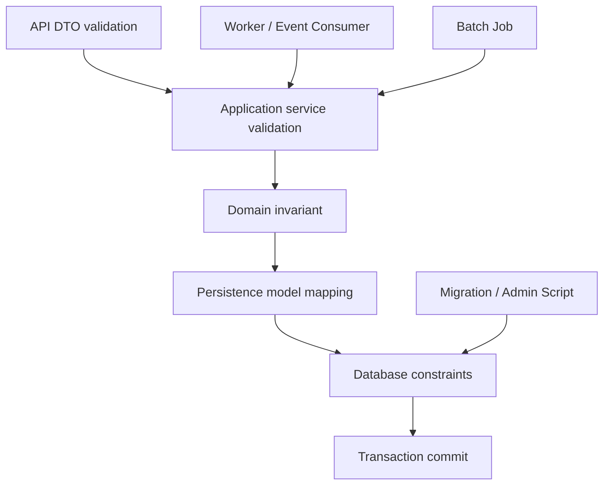

# Part 030 — Validation and Persistence Invariants

Validation bukan hanya mengecek field kosong.

Dalam persistence layer enterprise, validation adalah bagian dari **invariant enforcement**.

Invariant adalah aturan yang harus selalu benar pada data, terlepas dari:

- request datang dari API, worker, event consumer, batch job, migration, atau admin script
- code path memakai MyBatis, JPA, JDBC, atau stored procedure
- service berjalan di satu pod atau banyak pod
- request dijalankan bersamaan
- client melakukan retry
- deployment sedang rolling

Contoh invariant:

- quote number harus unik
- quote total tidak boleh negatif
- order tidak boleh dibuat tanpa customer valid
- status transition hanya boleh dari state tertentu
- hanya satu active price untuk product, currency, dan effective window tertentu
- tenant A tidak boleh mengubah data tenant B
- idempotency key hanya boleh diproses sekali
- created_at tidak boleh berubah setelah insert
- soft-deleted row tidak boleh muncul dalam default read path

Part ini membahas di mana invariant sebaiknya dijaga:

- API DTO validation
- Bean Validation
- application service validation
- domain model validation
- JPA entity validation/lifecycle callback
- MyBatis command validation
- PostgreSQL constraint
- transaction boundary
- unique/index/lock strategy
- tests dan PR review

Core principle:

> Semakin penting invariant terhadap correctness data, semakin dekat ia harus ditegakkan ke source of truth: database.

---

## 1. Validation vs Invariant

Validation sering bersifat request-level.

Contoh:

```java
public record CreateQuoteRequest(
    @NotNull UUID customerId,
    @NotBlank String quoteName,
    @PositiveOrZero BigDecimal initialAmount
) {}
```

Invariant bersifat system-level.

Contoh:

```text
A submitted quote must have at least one quote line.
```

Perbedaannya:

| Aspect | Validation | Invariant |
|---|---|---|
| Scope | request/input | domain/data/system |
| Timing | before processing | before/inside commit, always true after commit |
| Example | field not blank | no overlapping active price windows |
| Enforced by | DTO, Bean Validation, service | domain, DB constraint, transaction, lock |
| Failure meaning | invalid request | state conflict, bug, race, corruption |

Validation bisa gagal tanpa menyentuh database.

Invariant bisa membutuhkan:

- current database state
- transaction isolation
- lock
- unique constraint
- check constraint
- foreign key
- exclusion constraint
- idempotency table
- outbox/inbox discipline

---

## 2. Layered Enforcement Model

Tidak ada satu layer yang cukup untuk semua aturan.



Setiap layer punya peran:

| Layer | Strength | Weakness |
|---|---|---|
| API DTO | fast feedback, user-friendly | bypassed by workers/batch/migration |
| Bean Validation | declarative, easy | weak for DB-state/concurrency rules |
| Application service | sees use case | can be bypassed by other use cases |
| Domain model | encapsulates business rule | may not see database/global state |
| JPA lifecycle callback | close to entity lifecycle | hidden behavior, limited dependency access |
| MyBatis command validation | explicit SQL command boundary | manual discipline required |
| Database constraint | strongest source-of-truth guard | less user-friendly, needs error mapping |
| Transaction isolation/lock | protects concurrent changes | can reduce throughput/deadlock |

Good design often duplicates validation intentionally:

- API checks for UX.
- Domain checks for model integrity.
- Database checks for final correctness.

Bad design duplicates validation accidentally with inconsistent rules.

---

## 3. Defense in Depth

Defense in depth means the same invariant may be guarded at multiple layers for different reasons.

Example: quote total must not be negative.

API DTO:

```java
public record QuoteLineRequest(
    @Positive BigDecimal quantity,
    @PositiveOrZero BigDecimal unitPrice
) {}
```

Domain:

```java
public Money calculateTotal() {
    Money total = lines.stream()
        .map(QuoteLine::subtotal)
        .reduce(Money.zero(currency), Money::add);

    if (total.isNegative()) {
        throw new InvalidQuoteTotalException(id, total);
    }
    return total;
}
```

Database:

```sql
ALTER TABLE quote
ADD CONSTRAINT ck_quote_total_non_negative
CHECK (total_amount >= 0);
```

Why duplicate?

- API gives early, user-friendly error.
- Domain prevents internal code from producing invalid state.
- DB prevents bypass through mapper, migration, batch, or race.

This duplication is healthy if:

- rule meaning is identical
- error mapping is consistent
- tests cover all critical paths
- ownership is clear

---

## 4. What Must Be Enforced in Database

Rules that protect source-of-truth correctness should usually be database-enforced.

Strong candidates:

- primary key
- foreign key within service-owned schema
- unique business key
- idempotency key uniqueness
- non-null required columns
- check constraints for simple numeric/status invariants
- version column not null
- tenant ID not null
- created_at/updated_at not null
- valid enum/status domain where feasible
- no duplicate outbox event key
- no duplicate inbox message key

Example:

```sql
CREATE TABLE idempotency_record (
  idempotency_key text PRIMARY KEY,
  request_fingerprint text NOT NULL,
  status text NOT NULL,
  response_payload jsonb,
  created_at timestamptz NOT NULL DEFAULT now(),
  updated_at timestamptz NOT NULL DEFAULT now(),
  CONSTRAINT ck_idempotency_status
    CHECK (status IN ('PROCESSING', 'COMPLETED', 'FAILED'))
);
```

Why database?

Because only database can reliably arbitrate concurrent writes from multiple pods.

Application check alone is race-prone:

```java
if (!repository.existsByKey(key)) {
    repository.insert(key);
}
```

With two concurrent requests, both can pass `existsByKey`.

Database unique constraint closes the race.

---

## 5. What Should Usually Stay in Domain/Application Code

Not all rules belong in database.

Good candidates for domain/application:

- complex status transition rules
- rules involving external systems
- rules involving user permission
- rules requiring rich error messages
- rules that depend on feature flags/config
- rules that change frequently
- rules requiring orchestration across aggregates/services
- rules that are not easily expressed in SQL constraint

Example:

```java
public void submit(UserContext actor) {
    if (!actor.canSubmitQuote(this.salesRegion)) {
        throw new PermissionDeniedException(actor.userId(), id);
    }

    if (!status.equals(QuoteStatus.DRAFT)) {
        throw new InvalidQuoteTransitionException(id, status, QuoteStatus.SUBMITTED);
    }

    if (lines.isEmpty()) {
        throw new QuoteMustHaveLineException(id);
    }

    this.status = QuoteStatus.SUBMITTED;
}
```

Database may still enforce simpler parts:

```sql
ALTER TABLE quote
ADD CONSTRAINT ck_quote_status
CHECK (status IN ('DRAFT', 'SUBMITTED', 'APPROVED', 'REJECTED'));
```

The database checks that status is in allowed vocabulary.

The domain checks whether transition is allowed.

---

## 6. Bean Validation in Java/JAX-RS

Bean Validation is useful at API boundary.

Example:

```java
public record CreateQuoteRequest(
    @NotNull UUID customerId,
    @Size(min = 1, max = 120) String quoteName,
    @NotEmpty List<QuoteLineRequest> lines
) {}
```

JAX-RS resource:

```java
@Path("/quotes")
public class QuoteResource {
    private final QuoteApplicationService service;

    @POST
    public Response create(@Valid CreateQuoteRequest request) {
        QuoteId id = service.create(request);
        return Response.status(Response.Status.CREATED).entity(id).build();
    }
}
```

Good for:

- required field
- string length
- simple numeric range
- nested DTO validation
- early response before business logic

Weak for:

- uniqueness
- concurrent state
- cross-row invariant
- tenant permission
- status transition from current DB state
- event idempotency
- temporal overlap

Bean Validation should not be mistaken for persistence correctness.

---

## 7. API DTO Validation Is Not Persistence Validation

API DTO validation only applies to that API entrypoint.

But data can also enter through:

- Kafka consumer
- RabbitMQ consumer
- batch import
- scheduled job
- Camunda worker
- migration script
- manual support operation
- internal admin API
- test fixture

If invariant only exists on external REST DTO, other paths can bypass it.

Example bug:

```java
public record CreateQuoteRequest(@NotBlank String quoteName) {}
```

REST path validates `quoteName`.

But event consumer does:

```java
quoteMapper.insertQuote(event.quoteName()); // no validation
```

If event payload has blank name, database allows it unless constrained.

Correct options:

- validate event command using shared command validator
- enforce DB `NOT NULL` and check length/blank semantics if feasible
- normalize command object before persistence
- test non-REST paths

---

## 8. Domain Invariants

Domain invariant belongs near behavior.

Instead of:

```java
quote.setStatus("SUBMITTED");
```

Prefer:

```java
quote.submit(actor, clock);
```

Inside:

```java
public void submit(UserContext actor, Clock clock) {
    requireStatus(QuoteStatus.DRAFT);
    requireAtLeastOneLine();
    requireSubmitPermission(actor);

    this.status = QuoteStatus.SUBMITTED;
    this.submittedAt = Instant.now(clock);
    this.submittedBy = actor.userId();
}
```

Benefit:

- rule is attached to behavior
- fewer invalid intermediate states
- tests are meaningful
- persistence layer stores a valid aggregate

Caveat:

- JPA entity as domain model can work, but lazy loading, proxies, no-arg constructor, and dirty checking can distort domain purity.
- MyBatis DTO projection is usually not a domain aggregate unless intentionally designed.

---

## 9. JPA Entity as Domain Model vs Persistence Model

Two common styles:

### Style A — JPA entity as domain model

```java
@Entity
public class QuoteEntity {
    @Id
    private UUID id;

    @Enumerated(EnumType.STRING)
    private QuoteStatus status;

    public void submit() {
        if (status != QuoteStatus.DRAFT) {
            throw new InvalidTransitionException();
        }
        status = QuoteStatus.SUBMITTED;
    }
}
```

Pros:

- fewer mapping layers
- dirty checking can persist behavior changes
- convenient for aggregate lifecycle

Risks:

- persistence annotations leak into domain
- lazy loading can trigger hidden query
- setters can bypass behavior
- entity mutation inside transaction can flush unexpectedly
- equals/hashCode pitfalls

### Style B — JPA entity as persistence model

```java
public final class Quote {
    private final QuoteId id;
    private final QuoteStatus status;

    public Quote submit() { ... }
}

@Entity
@Table(name = "quote")
class QuoteEntity { ... }
```

Pros:

- domain independent from ORM
- clearer mapping boundary
- easier to test domain without DB

Risks:

- mapping overhead
- duplicate fields/rules if unmanaged
- more boilerplate

Internal convention must be verified. Do not assume CSG/team style.

---

## 10. JPA Lifecycle Callback Validation

JPA supports lifecycle callbacks:

```java
@PrePersist
@PreUpdate
private void validate() {
    if (totalAmount.signum() < 0) {
        throw new IllegalStateException("totalAmount must not be negative");
    }
}
```

Useful for:

- timestamps
- simple local consistency
- default normalization
- audit metadata if context is safely available

Risky for:

- database queries
- external service calls
- permission checks
- complex business workflows
- hidden side effects

Why risky?

- callback runs during flush
- exception timing surprises caller
- dependency injection may be awkward
- rules become hidden from service/domain flow
- batch updates may bypass entity lifecycle
- MyBatis/JDBC writes bypass callbacks entirely

Review question:

> If this invariant is critical, what happens when the row is written by MyBatis, JDBC, bulk JPQL, or migration?

If callback is the only guard, correctness is fragile.

---

## 11. MyBatis Validation Boundary

MyBatis is explicit SQL. It will not validate entity lifecycle automatically.

Therefore validation must happen before mapper calls or be enforced by SQL/database.

Command object:

```java
public record SubmitQuoteCommand(
    UUID quoteId,
    long expectedVersion,
    UUID actorId,
    Instant submittedAt
) {
    public SubmitQuoteCommand {
        Objects.requireNonNull(quoteId);
        Objects.requireNonNull(actorId);
        Objects.requireNonNull(submittedAt);
        if (expectedVersion < 0) throw new IllegalArgumentException("expectedVersion must be non-negative");
    }
}
```

Mapper:

```xml
<update id="submitQuote">
  UPDATE quote
  SET status = 'SUBMITTED',
      submitted_by = #{actorId},
      submitted_at = #{submittedAt},
      version = version + 1
  WHERE id = #{quoteId}
    AND status = 'DRAFT'
    AND version = #{expectedVersion}
</update>
```

Java:

```java
int updated = quoteMapper.submitQuote(command);
if (updated == 0) {
    throw new QuoteSubmitConflict(command.quoteId());
}
```

Here invariant is enforced by:

- command object non-null/range validation
- SQL predicate for state/version
- DB constraints for allowed status and required columns
- update count handling

This is a strong MyBatis style.

---

## 12. NOT NULL Constraint

`NOT NULL` is basic but powerful.

If a column is required for data correctness, do not rely only on Java validation.

Example:

```sql
ALTER TABLE quote
ALTER COLUMN tenant_id SET NOT NULL;

ALTER TABLE quote
ALTER COLUMN status SET NOT NULL;

ALTER TABLE quote
ALTER COLUMN created_at SET NOT NULL;
```

Why:

- protects from MyBatis mapper omission
- protects from JPA mapping mistake
- protects from migration/script mistake
- improves query assumptions
- helps index/selectivity reasoning

Caution during migration:

- adding `NOT NULL` to existing table may require backfill
- rolling deployment needs compatibility
- old code may not populate new column
- backfill and constraint validation should be planned

Review checklist:

- Is nullable column truly optional?
- If nullable, what does null mean?
- Are `unknown`, `not applicable`, and `not loaded` being confused?
- Does JPA `nullable=false` match database `NOT NULL`?
- Does MyBatis insert include required columns?

---

## 13. Unique Constraint

Unique constraint enforces identity/invariant under concurrency.

Examples:

```sql
ALTER TABLE quote
ADD CONSTRAINT uk_quote_number UNIQUE (quote_number);
```

Tenant-aware uniqueness:

```sql
ALTER TABLE quote
ADD CONSTRAINT uk_quote_tenant_number UNIQUE (tenant_id, quote_number);
```

Partial uniqueness for soft delete:

```sql
CREATE UNIQUE INDEX uk_active_quote_number
ON quote (tenant_id, quote_number)
WHERE deleted_at IS NULL;
```

Use cases:

- business key
- idempotency key
- outbox event key
- inbox consumed message key
- active config per tenant
- one active version per effective window shape

Application-level `exists` check is not sufficient.

Use `exists` for user-friendly pre-check if helpful, but rely on unique constraint for final arbitration.

---

## 14. Check Constraint

Check constraint captures simple local invariant.

Examples:

```sql
ALTER TABLE quote
ADD CONSTRAINT ck_quote_status
CHECK (status IN ('DRAFT', 'SUBMITTED', 'APPROVED', 'REJECTED'));
```

```sql
ALTER TABLE quote_line
ADD CONSTRAINT ck_quote_line_quantity_positive
CHECK (quantity > 0);
```

```sql
ALTER TABLE price
ADD CONSTRAINT ck_price_valid_range
CHECK (valid_to IS NULL OR valid_to > valid_from);
```

Good for:

- allowed status vocabulary
- positive/non-negative amount
- valid date range local to row
- simple enum-like field
- required relationship between two columns

Not good for:

- complex cross-row rules
- permission rules
- external service rules
- frequently changing rule matrix

Check constraint error must be mapped thoughtfully. It may represent invalid request or internal bug.

---

## 15. Foreign Key Constraint

Foreign key protects referential integrity.

Example:

```sql
ALTER TABLE quote_line
ADD CONSTRAINT fk_quote_line_quote
FOREIGN KEY (quote_id)
REFERENCES quote(id);
```

Benefits:

- prevents orphan child rows
- makes delete/update semantics explicit
- helps query assumptions
- protects against mapper/JPA bug

Trade-offs in microservices:

- FK across service-owned schemas/databases may create ownership coupling
- service boundaries may prefer reference IDs without DB FK
- reference data strategy must be explicit

Question:

> Is the referenced table owned by the same service/bounded context?

If yes, FK is often appropriate.

If no, be careful. Cross-service FK can turn runtime autonomy into database coupling.

---

## 16. Enum and Status Validation

Java enum mapping alone is not enough.

JPA:

```java
@Enumerated(EnumType.STRING)
@Column(nullable = false)
private QuoteStatus status;
```

Database:

```sql
ALTER TABLE quote
ADD CONSTRAINT ck_quote_status
CHECK (status IN ('DRAFT', 'SUBMITTED', 'APPROVED', 'REJECTED'));
```

MyBatis:

```xml
<insert id="insertQuote">
  INSERT INTO quote (id, status)
  VALUES (#{id}, #{status})
</insert>
```

Risks:

- Java enum changes but DB check not updated
- DB contains value unknown to older app version
- rolling deployment with enum addition breaks old version
- MyBatis passes raw string not validated
- JPA ordinal enum creates compatibility hazards

Prefer:

- string enum storage for readability
- explicit DB check or PostgreSQL enum only with migration discipline
- backward-compatible enum rollout
- unknown-value handling for readers if needed

---

## 17. Status Transition Invariant

Allowed status values are not the same as allowed transitions.

Allowed values:

```text
DRAFT, SUBMITTED, APPROVED, REJECTED
```

Allowed transitions:

```text
DRAFT -> SUBMITTED
SUBMITTED -> APPROVED
SUBMITTED -> REJECTED
```

Database check can enforce values.

Application/domain should enforce transitions.

MyBatis conditional update:

```sql
UPDATE quote
SET status = 'SUBMITTED', version = version + 1
WHERE id = :id
  AND status = 'DRAFT'
  AND version = :expectedVersion;
```

JPA domain method:

```java
public void submit() {
    if (status != QuoteStatus.DRAFT) {
        throw new InvalidTransitionException(status, QuoteStatus.SUBMITTED);
    }
    status = QuoteStatus.SUBMITTED;
}
```

Concurrency-safe JPA still needs optimistic lock or pessimistic lock. Otherwise two transitions can race.

---

## 18. Cross-Row Invariants

Cross-row invariants are harder.

Examples:

- quote must have at least one line before submit
- only one active price in date range
- no overlapping promotions for same product and channel
- total child allocation must not exceed parent budget
- only one active workflow instance per business key

Application query alone is race-prone.

Options:

| Invariant | Possible guard |
|---|---|
| no duplicate exact key | unique constraint |
| no overlapping range | exclusion constraint or lock/serializable strategy |
| parent-child aggregate total | parent row lock, serializable, materialized total with check |
| at least one child before state transition | transaction + lock + conditional update |
| one active workflow | unique partial index |

Example unique partial index:

```sql
CREATE UNIQUE INDEX uk_active_workflow_business_key
ON workflow_instance (tenant_id, business_key)
WHERE status IN ('RUNNING', 'WAITING');
```

This is often stronger than a pre-insert `SELECT`.

---

## 19. Temporal and Effective-Date Invariants

In CPQ/catalog/price/order systems, temporal correctness matters.

Common invariants:

- `valid_to > valid_from`
- only one active price for date/time window
- quote uses catalog version effective at quote time
- price effective date must not be after quote submission date
- expired catalog entry cannot be selected for new quote

Local check:

```sql
ALTER TABLE price
ADD CONSTRAINT ck_price_validity
CHECK (valid_to IS NULL OR valid_to > valid_from);
```

Cross-row overlap prevention may need stronger strategy.

Possible approaches:

- transaction + parent lock per product/catalog
- PostgreSQL exclusion constraint for range overlap where applicable
- serializable transaction + retry
- write model that closes previous version before opening new one
- effective version table with unique current row

Application code must be explicit about time source:

- do not mix client time and server time casually
- use injected `Clock` in Java
- use database `now()` consistently if DB time is source
- document time zone convention

---

## 20. Tenant Invariants

Tenant isolation is an invariant, not just a filter.

Every persistence operation should answer:

- Where does tenant ID come from?
- Is tenant ID part of the primary/unique key strategy?
- Is tenant ID included in query predicate?
- Is tenant ID included in update/delete predicate?
- Is tenant ID part of cache key?
- Is tenant ID propagated into outbox/inbox events?

MyBatis update:

```sql
UPDATE quote
SET status = 'SUBMITTED'
WHERE id = :quoteId
  AND tenant_id = :tenantId
  AND status = 'DRAFT';
```

JPA strategies may include:

- explicit tenant field in entity
- filter/multi-tenancy provider support
- repository methods requiring tenant context
- database row-level security where applicable

Danger:

```java
entityManager.find(QuoteEntity.class, quoteId)
```

If `quoteId` is globally unique, this may work. If not, or if access control depends on tenant, this can be unsafe unless tenant filter is guaranteed.

---

## 21. Soft Delete Invariants

Soft delete is not just an extra column.

Common fields:

```sql
deleted_at timestamptz NULL,
deleted_by uuid NULL
```

Invariant examples:

- default reads exclude deleted rows
- unique business key applies only to active rows
- deleted row cannot be updated by normal command path
- restore operation has explicit conflict handling
- audit/history still includes deleted rows where allowed

MyBatis default query:

```sql
SELECT *
FROM quote
WHERE id = :id
  AND tenant_id = :tenantId
  AND deleted_at IS NULL;
```

JPA can use filter/where clauses, but be careful:

- hidden filter can surprise reporting/admin use cases
- bulk updates may bypass entity behavior
- MyBatis queries must manually include condition
- unique constraints may need partial index

Review:

- Is soft delete condition consistently applied?
- Are admin/reporting queries intentionally different?
- Is unique constraint compatible with soft delete?
- Is restore behavior defined?

---

## 22. Idempotency Invariants

Idempotency is a persistence invariant.

For command APIs/events, duplicate execution must not create duplicate business effect.

Database guard:

```sql
CREATE TABLE request_idempotency (
  tenant_id uuid NOT NULL,
  idempotency_key text NOT NULL,
  request_fingerprint text NOT NULL,
  status text NOT NULL,
  response_body jsonb,
  created_at timestamptz NOT NULL DEFAULT now(),
  updated_at timestamptz NOT NULL DEFAULT now(),
  PRIMARY KEY (tenant_id, idempotency_key),
  CONSTRAINT ck_request_idempotency_status
    CHECK (status IN ('PROCESSING', 'COMPLETED', 'FAILED'))
);
```

Validation questions:

- Is idempotency key required for non-idempotent command?
- Is request fingerprint compared on duplicate key?
- Is response replay safe?
- Is processing state timeout handled?
- Is idempotency scoped by tenant/user/client?
- Are MyBatis/JPA writes inside same transaction as idempotency record?

Idempotency cannot be solved by API validation alone. It needs persistence coordination.

---

## 23. Invariants in Event-Driven Architecture

Event consumers often bypass REST DTO validation.

Example consumer:

```java
public void onQuoteApproved(QuoteApprovedEvent event) {
    projectionMapper.upsertQuoteStatus(event.quoteId(), event.status());
}
```

Questions:

- Is event schema validated?
- Is duplicate event handled?
- Is event order handled?
- Is event version checked?
- Is tenant ID present?
- Is projection update idempotent?
- Is invalid event sent to DLQ or rejected?

Persistence guards:

- inbox table unique key
- event version check
- conditional update
- projection constraint
- replay-safe UPSERT

Example:

```sql
INSERT INTO inbox_message (consumer_name, message_id, received_at)
VALUES (:consumerName, :messageId, now())
ON CONFLICT DO NOTHING;
```

If insert affected zero rows, message was already processed or is in progress depending design.

---

## 24. Validation and Transactions

Some validation must happen inside transaction.

Example:

```java
@Transactional
public void submit(UUID quoteId) {
    Quote quote = quoteRepository.loadForUpdate(quoteId);
    quote.requireCanSubmit();
    quoteRepository.markSubmitted(quoteId);
}
```

If validation depends on current state, doing it outside transaction may be stale.

Bad:

```java
Quote quote = quoteRepository.find(id); // outside transaction
if (quote.canSubmit()) {
    service.submit(id); // state may have changed
}
```

Better:

- validate inside same transaction as write
- use conditional update predicate
- use optimistic/pessimistic lock where needed
- handle zero-row update/conflict

Rule:

> Validation that guards a write must be tied to the write transaction or database predicate.

---

## 25. Validation and Isolation

At `READ COMMITTED`, every statement can see a new committed snapshot.

Application validation can be invalidated between statements.

Example:

```sql
SELECT count(*) FROM approval WHERE quote_id = :id AND active = true;
-- count = 1

INSERT INTO approval (...);
-- another transaction may have changed active approvals
```

Options:

- unique constraint
- conditional update
- row lock
- serializable isolation + retry
- parent aggregate lock
- materialized state with version

Do not assume `SELECT then INSERT` is safe under concurrency unless database constraint/lock/isolation supports it.

---

## 26. Validation and MyBatis/JPA Mixing

Mixing MyBatis and JPA can create inconsistent validation.

Example:

- JPA entity has `@PreUpdate` validation.
- MyBatis mapper updates same table directly.
- MyBatis bypasses `@PreUpdate`.

```java
@Entity
class QuoteEntity {
    @PreUpdate
    void validate() {
        if (totalAmount.signum() < 0) throw new IllegalStateException();
    }
}
```

Mapper:

```sql
UPDATE quote
SET total_amount = :amount
WHERE id = :id;
```

If database has no check constraint, MyBatis can write invalid value.

Conclusion:

> Any invariant that must hold across both JPA and MyBatis paths cannot live only in JPA callbacks or entity methods.

It must be:

- enforced in shared application/domain layer
- included in MyBatis SQL predicate/command validation
- enforced by database constraint where feasible
- tested through both access paths

---

## 27. Validation Duplication: Healthy vs Dangerous

Healthy duplication:

- same rule, same meaning
- different layers for UX and correctness
- database is final authority
- error mapping is consistent
- tests intentionally cover duplication

Dangerous duplication:

- API max length 100, DB max length 120
- JPA enum allows `APPROVED`, DB check missing it
- MyBatis query applies tenant filter, JPA query does not
- JPA soft delete filter exists, MyBatis forgets condition
- application says status transition allowed, SQL predicate rejects it
- constraint name maps to wrong domain error

Review question:

> If this rule changes, how many places must change, and which one is source of truth?

Document source of truth.

---

## 28. Command Objects as Validation Boundary

Command object is useful between API/event layer and application service.

Example:

```java
public record SubmitQuoteCommand(
    UUID tenantId,
    UUID quoteId,
    UUID actorId,
    long expectedVersion,
    Instant requestedAt
) {
    public SubmitQuoteCommand {
        Objects.requireNonNull(tenantId);
        Objects.requireNonNull(quoteId);
        Objects.requireNonNull(actorId);
        Objects.requireNonNull(requestedAt);
        if (expectedVersion < 0) throw new IllegalArgumentException("expectedVersion must be >= 0");
    }
}
```

Benefits:

- normalizes REST/event/batch input
- centralizes simple command-level validation
- avoids passing many primitives to mapper/repository
- makes required data explicit
- supports testability

But command object validation still does not replace database constraints.

---

## 29. Validation Error vs Conflict Error

Distinguish invalid request from valid request conflicting with current state.

| Scenario | Classification | HTTP bias |
|---|---|---|
| missing required field | validation error | `400` |
| string too long | validation error | `400`/`422` |
| quote already submitted | conflict | `409` |
| duplicate quote number | conflict | `409` |
| expected version mismatch | conflict | `409` |
| unknown customer ID | `404`, `400`, or `409` depending contract | varies |
| tenant mismatch | often `404` or `403` | security contract |
| invalid status value | validation error or internal bug | `400`/`500` |

Rule:

> If changing the request can fix it without reloading state, it is often validation. If current system state prevents it, it is often conflict.

---

## 30. Validation Error Response Design

Public response should be stable and safe.

Example:

```json
{
  "code": "VALIDATION_FAILED",
  "message": "Request validation failed.",
  "fields": [
    {
      "field": "quoteName",
      "code": "REQUIRED",
      "message": "Quote name is required."
    }
  ],
  "correlationId": "..."
}
```

Conflict response:

```json
{
  "code": "QUOTE_STATE_CONFLICT",
  "message": "Quote cannot be submitted from its current state.",
  "correlationId": "..."
}
```

Avoid exposing:

- raw SQL constraint
- table/column names
- stack trace
- actual sensitive value
- internal enum if API has different vocabulary

Internal logs can include sanitized diagnostic details.

---

## 31. Testing Validation and Invariants

Test layers separately and together.

### API validation tests

- missing field
- invalid length
- invalid numeric range
- nested DTO validation
- error response shape

### Domain invariant tests

- invalid status transition
- no lines on submit
- permission denied
- invalid effective date
- invalid tenant action

### Persistence constraint tests

- unique violation
- NOT NULL violation
- check violation
- FK violation
- soft delete uniqueness
- idempotency duplicate key

### Concurrency tests

- duplicate submit race
- lost update prevention
- unique constraint under concurrent insert
- optimistic lock conflict
- parent lock behavior
- idempotency duplicate request

Example persistence test:

```java
@Test
void databaseRejectsNegativeQuoteTotal() {
    assertThatThrownBy(() -> quoteMapper.insertWithTotal(new BigDecimal("-1.00")))
        .isInstanceOf(PersistenceException.class);
}
```

Better if translated:

```java
@Test
void negativeQuoteTotalMapsToDomainError() {
    assertThatThrownBy(() -> service.createInvalidQuote())
        .isInstanceOf(InvalidQuoteTotalException.class);
}
```

---

## 32. Migration and Validation

Schema migration can introduce or break invariants.

Adding a constraint to existing data requires plan:

1. Add nullable column or non-enforcing structure.
2. Backfill existing data.
3. Deploy app writing new column/rule.
4. Validate data quality.
5. Add `NOT NULL`/unique/check constraint.
6. Remove old compatibility code later.

Danger:

```sql
ALTER TABLE quote
ADD COLUMN tenant_id uuid NOT NULL;
```

On existing populated table, this can fail or lock heavily depending approach.

Safer pattern:

```sql
ALTER TABLE quote ADD COLUMN tenant_id uuid;
-- backfill in controlled chunks
-- deploy app that writes tenant_id
-- validate no nulls
ALTER TABLE quote ALTER COLUMN tenant_id SET NOT NULL;
```

For rolling deployment, ensure old app version can tolerate new schema and new constraints.

---

## 33. Invariants and Backward Compatibility

When adding validation or constraint, think about running versions:

- old application writes old shape
- new application expects new shape
- migration runs before, during, or after deployment
- event consumers may lag
- batch jobs may still use old code

Example enum addition:

1. Add DB check allowing old + new status.
2. Deploy readers that tolerate new status.
3. Deploy writers that may write new status.
4. Remove old assumptions later.

Bad rollout:

- deploy writer that writes new status
- old reader crashes because enum unknown
- event consumer DLQs messages

Persistence invariant changes are deployment changes, not just code changes.

---

## 34. Observability for Validation Failures

Track validation and invariant failures.

Metrics:

- API validation failure count by field/code
- domain conflict count by operation
- DB constraint violation count by constraint family
- optimistic lock conflict count
- idempotency duplicate count
- tenant filter zero-row update count
- soft delete conflict count
- migration data validation failure count

But avoid high-cardinality labels like raw field value or aggregate ID.

Useful logs:

```json
{
  "event": "domain.invariant_failed",
  "operation": "SubmitQuote",
  "code": "QUOTE_STATE_CONFLICT",
  "aggregateType": "Quote",
  "aggregateId": "...",
  "currentState": "APPROVED",
  "targetState": "SUBMITTED",
  "correlationId": "..."
}
```

For DB constraint:

```json
{
  "event": "db.constraint_violation",
  "operation": "CreateQuote",
  "constraint": "uk_quote_tenant_number",
  "sqlState": "23505",
  "domainCode": "QUOTE_NUMBER_ALREADY_EXISTS"
}
```

---

## 35. Security and Privacy in Validation

Validation can leak sensitive data.

Examples:

- “email already exists” reveals account existence
- “tenant not found” reveals tenant ID validity
- “customer belongs to another tenant” reveals cross-tenant data
- field-level error returns sensitive input value
- logs include raw request payload with PII

Safer design:

- public message generic where enumeration risk exists
- detailed reason in internal log only
- redact sensitive field values
- avoid echoing raw invalid value
- apply tenant/security check before detailed validation where needed

Example:

```json
{
  "code": "REQUEST_CONFLICT",
  "message": "The request cannot be completed."
}
```

Internal:

```json
{
  "reason": "DUPLICATE_EMAIL",
  "constraint": "uk_user_email",
  "correlationId": "..."
}
```

---

## 36. Performance Cost of Validation

Validation can become expensive.

Bad pattern:

```java
for (Line line : lines) {
    if (!productRepository.exists(line.productId())) {
        throw new InvalidProductException(line.productId());
    }
}
```

This creates N queries.

Better:

```java
Set<UUID> productIds = lines.stream().map(Line::productId).collect(toSet());
Set<UUID> existing = productRepository.findExistingIds(productIds);
if (!existing.containsAll(productIds)) {
    throw new InvalidProductReferenceException();
}
```

Or rely on FK where appropriate.

Validation performance concerns:

- N+1 validation queries
- repeated uniqueness checks before insert
- count query on large table
- unindexed lookup used only for validation
- distributed validation call inside transaction
- locking too broad for invariant

Validation must be correctness-aware and performance-aware.

---

## 37. Validation Placement Decision Matrix

| Rule | API DTO | Domain/Application | JPA/MyBatis | Database |
|---|---:|---:|---:|---:|
| field required | Yes | Sometimes | Yes | Yes |
| string length | Yes | Sometimes | Sometimes | Yes if important |
| positive amount | Yes | Yes | Sometimes | Yes |
| unique business key | UX pre-check | Yes | Sometimes | Yes |
| status transition | No | Yes | SQL predicate/entity method | Partially |
| no duplicate event processing | No | Yes | Yes | Yes |
| tenant isolation | No | Yes | Yes | Often yes/RLS optional |
| permission | No | Yes | No | Sometimes RLS |
| FK within owned schema | Maybe | Yes | Yes | Yes |
| cross-service reference validity | Maybe | Yes | No | Usually no direct FK |
| temporal overlap | Maybe | Yes | Yes | Strong DB strategy if possible |
| soft delete default visibility | No | Yes | Yes | partial indexes/constraints |

Use database for final correctness where feasible.

Use domain/application for meaning and orchestration.

Use API validation for fast feedback.

---

## 38. Anti-Patterns

### Anti-pattern 1 — API-only invariant

```java
@Valid CreateQuoteRequest request
```

But Kafka consumer and batch job bypass it.

### Anti-pattern 2 — JPA-only invariant in mixed persistence system

`@PreUpdate` protects JPA path but MyBatis writes invalid row.

### Anti-pattern 3 — Validation query without constraint

`exists` check before insert, but no unique constraint.

### Anti-pattern 4 — Inconsistent status vocabulary

Java enum, DB check, API schema, and event schema allow different values.

### Anti-pattern 5 — Ignoring zero-row update

Conditional update enforces invariant but code ignores affected row count.

### Anti-pattern 6 — Soft delete forgotten in mapper

JPA filter excludes deleted rows; MyBatis query returns them.

### Anti-pattern 7 — Tenant validation only in service method

Repository/mapper accepts raw ID and can accidentally cross tenant.

### Anti-pattern 8 — Constraint added without backfill/deployment plan

Migration breaks old app version or fails on existing data.

### Anti-pattern 9 — Validation performs external calls inside DB transaction

Long transaction, lock wait, timeout, and partial side effects.

### Anti-pattern 10 — Public error leaks constraint/table/value

Database detail exposed as API contract.

---

## 39. PR Review Checklist

Use this checklist when reviewing persistence validation/invariant changes.

### Invariant clarity

- What invariant is being protected?
- Is it request-level validation or data correctness invariant?
- Is source of truth identified?
- What happens under concurrent requests?
- What happens through REST, worker, batch, migration, and admin paths?

### Layer placement

- Is API DTO validation sufficient only for UX?
- Is domain/application rule explicit?
- Is database constraint needed?
- Is JPA callback being used safely?
- Is MyBatis command validation explicit?
- Is validation duplicated intentionally or accidentally?

### Database constraints

- Are `NOT NULL`, unique, check, FK constraints appropriate?
- Are constraint names explicit and meaningful?
- Does migration include backfill if needed?
- Is constraint compatible with rolling deployment?
- Does error mapping handle violations?

### MyBatis

- Are command parameters validated?
- Does SQL predicate enforce state/version/tenant where needed?
- Is affected row count checked?
- Are dynamic SQL branches safe?
- Are soft delete/tenant filters consistent?

### JPA/Hibernate

- Are entity methods protecting transitions?
- Are setters bypassing invariants?
- Are lifecycle callbacks hiding critical rules?
- Are Bean Validation annotations aligned with DB constraints?
- Are bulk updates bypassing entity validation?

### Concurrency

- Is `SELECT then INSERT/UPDATE` protected by constraint or lock?
- Is optimistic/pessimistic locking needed?
- Is unique constraint used for race closure?
- Is retry behavior defined?
- Are zero-row updates treated as conflict/not found?

### API and observability

- Is validation/conflict response safe and stable?
- Are internal logs detailed but redacted?
- Are metrics emitted for invariant failures?
- Are sensitive values not echoed?

---

## 40. Internal Verification Checklist

Gunakan checklist ini untuk codebase/team internal.

### API and command validation

- Cari DTO request dan Bean Validation annotations.
- Cek apakah validation juga berlaku untuk event/batch/worker path.
- Cek command object layer jika ada.
- Cek error response format untuk validation failure.

### Domain/application invariants

- Cek domain methods untuk status transition.
- Cek service validation sebelum write.
- Cek apakah validation dilakukan dalam transaction yang sama dengan write.
- Cek external calls di dalam validation/transaction.

### JPA/Hibernate

- Cek entity setters yang bisa bypass invariants.
- Cek lifecycle callbacks `@PrePersist`, `@PreUpdate`.
- Cek Bean Validation annotations on entities.
- Cek alignment `nullable=false` dengan DB `NOT NULL`.
- Cek bulk update/delete yang bypass entity lifecycle.

### MyBatis

- Cek mapper update predicates untuk status/version/tenant.
- Cek return count handling.
- Cek dynamic SQL untuk missing filters.
- Cek mapper insert/update required columns.
- Cek TypeHandler/enum validation.

### PostgreSQL schema

- Cek primary key, foreign key, unique, check, not null.
- Cek constraint names.
- Cek partial unique indexes untuk soft delete/active records.
- Cek tenant-aware uniqueness.
- Cek idempotency/inbox/outbox uniqueness.

### Migration

- Cek migration yang menambah constraint.
- Cek backfill scripts.
- Cek compatibility window.
- Cek old/new app version behavior.
- Cek rollback/roll-forward plan.

### Testing and observability

- Cek tests untuk constraint violation.
- Cek concurrency tests untuk race-prone invariants.
- Cek validation error mapping tests.
- Cek metrics for validation/conflict/constraint failure.
- Cek logs tidak bocor PII/raw SQL.

---

## 41. Summary

Validation adalah fast feedback. Invariant adalah data correctness.

Yang perlu diingat:

- API validation tidak cukup untuk persistence correctness.
- Domain/application validation memberi meaning, tetapi database harus menjaga invariant penting.
- Bean Validation bagus untuk shape dan simple input checks, bukan concurrency correctness.
- JPA lifecycle callback bisa berguna, tetapi berbahaya jika menjadi satu-satunya guard.
- MyBatis membutuhkan explicit command validation, SQL predicate, dan affected-row handling.
- Unique/check/FK/NOT NULL constraints adalah safety net penting.
- `SELECT then INSERT` tanpa constraint/lock adalah race-prone.
- Soft delete, tenant, temporal data, dan idempotency adalah invariant persistence, bukan sekadar filter tambahan.
- Mixing MyBatis dan JPA membuat invariant harus dijaga di shared layer atau database, bukan hanya entity callback.
- Validation changes adalah deployment/schema changes jika menyentuh database constraint.

Pertanyaan senior saat review:

> Jika request ini datang bersamaan dari dua pod, lewat path non-REST, dengan versi aplikasi berbeda, apakah data tetap benar setelah commit?

Jika jawabannya belum jelas, invariant placement belum selesai.
