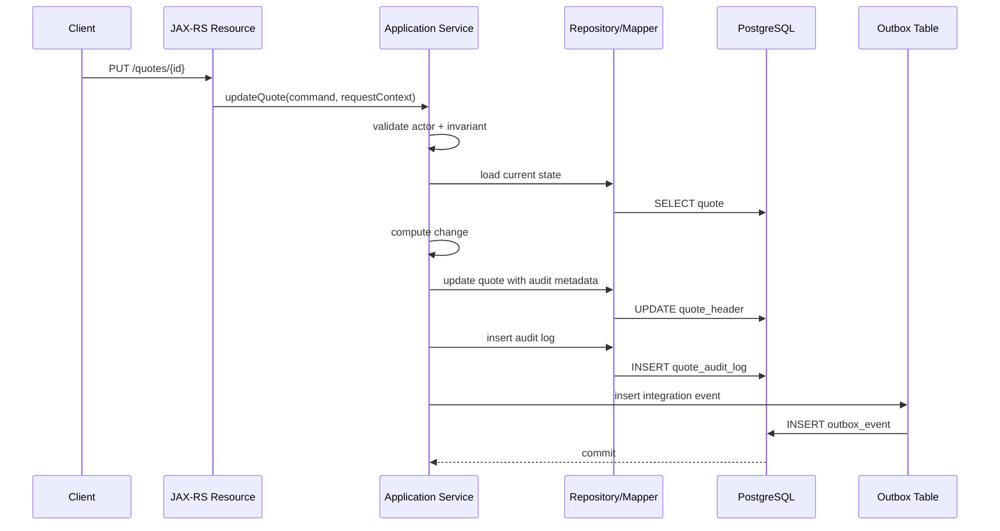

# Part 031 — Auditing and Change Tracking

Audit bukan sekadar menambahkan kolom `created_at` dan `updated_at`.

Dalam enterprise persistence layer, auditing adalah kemampuan sistem untuk menjawab pertanyaan berikut secara defensible:

- siapa yang mengubah data?
- kapan data berubah?
- operation apa yang dilakukan?
- nilai sebelum dan sesudahnya apa?
- perubahan terjadi lewat API, worker, event consumer, batch job, migration, atau manual script?
- perubahan terjadi dalam transaksi apa?
- perubahan menghasilkan event apa?
- apakah perubahan bisa direkonstruksi saat incident, dispute, compliance review, atau reconciliation?

Dalam konteks CPQ, quote management, order management, dan quote-to-cash, audit trail bukan fitur kosmetik. Audit trail menjadi bagian dari production correctness.

Contoh pertanyaan nyata:

- siapa yang mengubah quote discount sebelum approval?
- kapan order status berubah dari `SUBMITTED` ke `IN_PROGRESS`?
- apakah price snapshot berubah setelah quote accepted?
- apakah billing activation dikirim dari data order versi terbaru?
- apakah event Kafka/RabbitMQ dipublikasikan setelah database commit?
- apakah update dari MyBatis juga mengisi audit field yang sama dengan update dari JPA?
- apakah soft-delete tercatat sebagai business deletion atau hanya technical flag update?

Core principle:

> Auditability harus konsisten di semua write path. Jika satu write path melewati audit, maka audit trail tidak bisa dipercaya.

---

## 1. Auditing vs Logging vs Change Tracking

Tiga hal ini sering dicampur, padahal berbeda.

| Concept | Fokus | Storage | Dipakai untuk |
|---|---|---|---|
| Application logging | runtime event | log platform | debugging, incident triage |
| Auditing | accountable business/technical change | database/log/audit platform | compliance, traceability, evidence |
| Change tracking | state transition atau diff data | audit table/history table/event table | reconstruction, replay, reconciliation |

Logging menjawab:

```text
Apa yang terjadi di runtime?
```

Auditing menjawab:

```text
Siapa melakukan apa terhadap data apa, kapan, dan melalui action apa?
```

Change tracking menjawab:

```text
Bagaimana data berubah dari versi sebelumnya ke versi sekarang?
```

Dalam persistence layer, ketiganya saling melengkapi, tetapi tidak saling menggantikan.

---

## 2. Minimal Audit Metadata

Minimal audit metadata biasanya meliputi:

- `created_at`
- `created_by`
- `updated_at`
- `updated_by`
- `version`
- `source_system`
- `correlation_id`
- `request_id`
- `operation_type`

Contoh schema sederhana:

```sql
CREATE TABLE quote_header (
    id UUID PRIMARY KEY,
    quote_number TEXT NOT NULL UNIQUE,
    customer_id UUID NOT NULL,
    status TEXT NOT NULL,
    total_amount NUMERIC(19, 4) NOT NULL,
    version BIGINT NOT NULL DEFAULT 0,
    created_at TIMESTAMPTZ NOT NULL,
    created_by TEXT NOT NULL,
    updated_at TIMESTAMPTZ NOT NULL,
    updated_by TEXT NOT NULL,
    correlation_id TEXT,
    request_id TEXT
);
```

Catatan penting:

- `created_at` idealnya tidak berubah setelah insert.
- `updated_at` harus berubah saat business data berubah.
- `version` bisa dipakai untuk optimistic locking.
- `created_by` dan `updated_by` harus punya definisi jelas: user, service account, batch job, atau system actor.
- `correlation_id` membantu menghubungkan row update dengan trace/log/event.

---

## 3. Audit Metadata Is Not Enough

Audit metadata hanya memberi ringkasan perubahan terakhir.

Ia tidak menjawab:

- field mana yang berubah?
- nilai sebelumnya apa?
- apakah status pernah berada di state tertentu?
- siapa approver yang mengubah discount?
- apakah perubahan dilakukan oleh API atau replay event?
- apakah perubahan terjadi sebelum atau setelah event dipublikasikan?

Untuk pertanyaan tersebut, perlu audit trail lebih detail.

Contoh audit table:

```sql
CREATE TABLE quote_audit_log (
    audit_id UUID PRIMARY KEY,
    quote_id UUID NOT NULL,
    operation_type TEXT NOT NULL,
    actor_id TEXT NOT NULL,
    actor_type TEXT NOT NULL,
    source_system TEXT NOT NULL,
    request_id TEXT,
    correlation_id TEXT,
    before_state JSONB,
    after_state JSONB,
    changed_fields JSONB,
    occurred_at TIMESTAMPTZ NOT NULL
);

CREATE INDEX idx_quote_audit_log_quote_time
    ON quote_audit_log (quote_id, occurred_at DESC);
```

Trade-off:

| Option | Strength | Risk |
|---|---|---|
| Audit columns only | simple, cheap | no history |
| Audit table with snapshot | reconstructable | storage grows fast |
| Audit table with diff | compact | harder reconstruction |
| Event log/outbox | integration-friendly | event schema governance needed |
| Trigger-based audit | catches all SQL paths | hidden behavior, test complexity |

---

## 4. Audit Lifecycle in Java/JAX-RS Request

Typical lifecycle:



Hal yang harus jelas:

- request context masuk dari resource layer ke service layer
- service layer membawa actor/correlation metadata
- repository/mapper tidak mengarang actor sendiri
- update data, audit log, dan outbox idealnya berada dalam transaksi yang sama
- event publication terjadi setelah commit, bukan sebelum commit

---

## 5. Actor Context

Audit tanpa actor context akan lemah.

Actor bisa berupa:

- human user
- internal service
- scheduled job
- batch process
- event consumer
- migration script
- admin/support operation

Contoh Java context:

```java
public record AuditContext(
    String actorId,
    String actorType,
    String sourceSystem,
    String requestId,
    String correlationId
) {}
```

Contoh command:

```java
public record UpdateQuoteCommand(
    UUID quoteId,
    BigDecimal discountAmount,
    AuditContext auditContext
) {}
```

Prinsip:

- actor context harus eksplisit
- jangan ambil user context secara acak dari static/global object tanpa kontrol
- jangan biarkan repository membuat `updated_by = 'system'` sebagai default sembarangan
- batch job dan event consumer tetap harus punya actor identity

---

## 6. Created/Updated Field Discipline

Audit field punya invariant sendiri.

| Field | Insert | Update | Invariant |
|---|---:|---:|---|
| `created_at` | set | unchanged | waktu row dibuat |
| `created_by` | set | unchanged | pembuat asli |
| `updated_at` | set | set | waktu perubahan terakhir |
| `updated_by` | set | set | pengubah terakhir |
| `version` | initial | increment | optimistic concurrency |

Bug umum:

- `created_at` ikut berubah saat update.
- `updated_at` tidak berubah pada MyBatis update.
- JPA entity listener mengisi audit, tapi MyBatis mapper tidak.
- Manual SQL migration mengubah business data tanpa audit.
- Event consumer memakai `updated_by = null`.
- `updated_at` memakai timezone lokal pod, bukan database/application standard.

Recommendation:

- gunakan `TIMESTAMPTZ` di PostgreSQL
- definisikan standar clock: application clock vs database `now()`
- pastikan MyBatis dan JPA mengikuti convention sama
- test audit metadata di repository/mapper integration test

---

## 7. JPA Auditing

Dengan JPA/Hibernate, audit field sering diisi melalui lifecycle callback atau listener.

Contoh base entity:

```java
@MappedSuperclass
public abstract class AuditedEntity {
    @Column(name = "created_at", nullable = false, updatable = false)
    private Instant createdAt;

    @Column(name = "created_by", nullable = false, updatable = false)
    private String createdBy;

    @Column(name = "updated_at", nullable = false)
    private Instant updatedAt;

    @Column(name = "updated_by", nullable = false)
    private String updatedBy;

    @Version
    @Column(name = "version", nullable = false)
    private long version;
}
```

Contoh listener:

```java
public class AuditEntityListener {
    @PrePersist
    public void prePersist(Object entity) {
        // set createdAt, createdBy, updatedAt, updatedBy
    }

    @PreUpdate
    public void preUpdate(Object entity) {
        // set updatedAt, updatedBy
    }
}
```

Kelebihan:

- otomatis untuk entity lifecycle JPA
- mengurangi boilerplate
- dekat dengan persistence model

Risiko:

- hidden behavior
- sulit melihat dari service code field apa yang berubah
- tidak berlaku untuk MyBatis update
- tidak berlaku untuk bulk JPQL update tertentu seperti yang diharapkan
- bisa bergantung pada thread-local context
- bisa gagal jika listener tidak punya actor context valid

---

## 8. Hibernate Dirty Checking and Audit Surprise

Dalam Hibernate, update bisa terjadi karena dirty checking.

Contoh:

```java
@Transactional
public void updateQuoteName(UUID quoteId, String name) {
    QuoteEntity quote = entityManager.find(QuoteEntity.class, quoteId);
    quote.setName(name);
    // no explicit save call
}
```

Pada commit, Hibernate bisa melakukan flush:

```sql
UPDATE quote_header
SET name = ?, updated_at = ?, updated_by = ?, version = ?
WHERE id = ? AND version = ?;
```

Audit concern:

- apakah `updated_by` sudah tersedia ketika dirty checking terjadi?
- apakah perubahan tidak sengaja pada managed entity juga akan tercatat sebagai update?
- apakah listener bisa membedakan business update vs technical hydration/mutation?
- apakah update terjadi sebelum query lain karena flush-before-query?

Review question:

```text
Apakah setiap managed entity mutation memang intended write?
```

---

## 9. MyBatis Auditing

MyBatis tidak punya entity lifecycle dan dirty checking.

Audit harus eksplisit di SQL atau parameter object.

Contoh command object:

```java
public record UpdateQuoteStatusCommand(
    UUID quoteId,
    String expectedStatus,
    String newStatus,
    long expectedVersion,
    Instant updatedAt,
    String updatedBy,
    String correlationId
) {}
```

Contoh mapper:

```xml
<update id="updateQuoteStatus">
  UPDATE quote_header
  SET status = #{newStatus},
      updated_at = #{updatedAt},
      updated_by = #{updatedBy},
      correlation_id = #{correlationId},
      version = version + 1
  WHERE id = #{quoteId}
    AND status = #{expectedStatus}
    AND version = #{expectedVersion}
</update>
```

Kelebihan:

- SQL terlihat jelas
- audit field terlihat di mapper
- optimistic locking bisa eksplisit

Risiko:

- setiap mapper update harus disiplin mengisi audit field
- raw SQL bisa lupa update `version`
- copy-paste SQL bisa membuat audit inconsistency
- dynamic SQL bisa melewati audit field pada branch tertentu

---

## 10. MyBatis Audit Insert Pattern

Untuk audit history, MyBatis sering lebih eksplisit.

```xml
<insert id="insertQuoteAuditLog">
  INSERT INTO quote_audit_log (
      audit_id,
      quote_id,
      operation_type,
      actor_id,
      actor_type,
      source_system,
      request_id,
      correlation_id,
      before_state,
      after_state,
      changed_fields,
      occurred_at
  ) VALUES (
      #{auditId},
      #{quoteId},
      #{operationType},
      #{actorId},
      #{actorType},
      #{sourceSystem},
      #{requestId},
      #{correlationId},
      #{beforeState,jdbcType=OTHER,typeHandler=com.example.JsonbTypeHandler},
      #{afterState,jdbcType=OTHER,typeHandler=com.example.JsonbTypeHandler},
      #{changedFields,jdbcType=OTHER,typeHandler=com.example.JsonbTypeHandler},
      #{occurredAt}
  )
</insert>
```

Checklist:

- JSONB TypeHandler tested
- `occurred_at` memakai timezone-aware value
- audit insert berada dalam transaksi sama dengan business update
- audit insert failure menyebabkan business update rollback jika audit wajib
- audit data tidak menyimpan PII berlebihan tanpa masking/encryption policy

---

## 11. Database Trigger Auditing

Trigger bisa memastikan perubahan dicatat walau dilakukan oleh JPA, MyBatis, JDBC, migration, atau manual SQL.

Contoh sederhana:

```sql
CREATE TABLE quote_header_audit (
    audit_id BIGSERIAL PRIMARY KEY,
    quote_id UUID NOT NULL,
    operation TEXT NOT NULL,
    old_row JSONB,
    new_row JSONB,
    changed_at TIMESTAMPTZ NOT NULL DEFAULT now(),
    changed_by TEXT
);

CREATE OR REPLACE FUNCTION audit_quote_header_change()
RETURNS trigger AS $$
BEGIN
    INSERT INTO quote_header_audit (
        quote_id,
        operation,
        old_row,
        new_row,
        changed_by
    ) VALUES (
        COALESCE(NEW.id, OLD.id),
        TG_OP,
        to_jsonb(OLD),
        to_jsonb(NEW),
        current_setting('app.actor_id', true)
    );

    RETURN COALESCE(NEW, OLD);
END;
$$ LANGUAGE plpgsql;

CREATE TRIGGER trg_quote_header_audit
AFTER INSERT OR UPDATE OR DELETE ON quote_header
FOR EACH ROW EXECUTE FUNCTION audit_quote_header_change();
```

Kelebihan:

- menangkap semua write path ke table
- tidak bergantung pada ORM/mapper discipline
- kuat untuk compliance-grade data capture

Risiko:

- hidden behavior dari sudut pandang Java code
- actor context harus dipass ke session/transaction
- overhead write amplification
- schema change perlu update audit function
- test/debug lebih sulit
- trigger bisa memperlambat bulk operation

---

## 12. Passing Actor Context to PostgreSQL

Jika memakai trigger audit, aplikasi bisa mengisi session variable dalam transaksi.

```sql
SELECT set_config('app.actor_id', ?, true);
SELECT set_config('app.request_id', ?, true);
SELECT set_config('app.correlation_id', ?, true);
```

Contoh urutan:

```text
begin transaction
set app.actor_id
set app.request_id
perform update
trigger reads current_setting('app.actor_id', true)
commit
```

Caveat:

- harus transaction-scoped, bukan connection-scoped permanen
- connection pool dapat reuse connection
- jangan meninggalkan session state lintas request
- pastikan rollback/commit membersihkan state jika pakai transaction-local setting

Internal verification checklist:

- apakah internal DB trigger memakai `current_setting`?
- apakah app mengisi setting tersebut?
- apakah connection pool aman dari session leakage?
- apakah integration test memverifikasi actor masuk audit table?

---

## 13. Audit Table Design Options

### 13.1 Row Snapshot

Menyimpan seluruh row sebelum/sesudah perubahan.

```sql
old_row JSONB,
new_row JSONB
```

Kelebihan:

- mudah reconstruct
- mudah investigasi
- tidak perlu mendefinisikan diff logic di aplikasi

Kekurangan:

- storage besar
- PII exposure lebih tinggi
- schema drift harus dipikirkan

### 13.2 Field Diff

Menyimpan field yang berubah.

```json
{
  "status": { "from": "DRAFT", "to": "SUBMITTED" },
  "totalAmount": { "from": "100.00", "to": "95.00" }
}
```

Kelebihan:

- lebih compact
- fokus ke perubahan

Kekurangan:

- diff logic harus benar
- reconstruction penuh lebih sulit

### 13.3 Business Event History

Menyimpan business action.

```json
{
  "eventType": "QuoteSubmitted",
  "quoteId": "...",
  "submittedBy": "...",
  "submittedAt": "..."
}
```

Kelebihan:

- domain-readable
- cocok untuk investigation dan integration

Kekurangan:

- tidak selalu menangkap semua field-level change
- event schema governance diperlukan

---

## 14. Audit and Outbox Relationship

Audit log dan outbox event mirip, tetapi tidak sama.

| Aspect | Audit Log | Outbox Event |
|---|---|---|
| Audience | internal/compliance/support | downstream systems |
| Granularity | technical/business change | integration event |
| Schema | bisa internal | contract external/internal consumers |
| Retention | sering panjang | sesuai event/replay policy |
| Mutability | append-only | append-only |
| Failure mode | missing evidence | missing integration signal |

Prinsip:

- audit log tidak otomatis menggantikan outbox
- outbox tidak otomatis cukup sebagai audit trail
- keduanya bisa diinsert dalam transaksi yang sama
- event payload harus hati-hati terhadap PII dan data minimization

Contoh transaction:

```text
update quote
insert quote_audit_log
insert outbox_event
commit
publisher sends outbox event after commit
```

---

## 15. Change Tracking for State Machines

Untuk quote/order lifecycle, audit field biasa tidak cukup.

Gunakan state transition history.

```sql
CREATE TABLE order_state_history (
    id UUID PRIMARY KEY,
    order_id UUID NOT NULL,
    from_state TEXT,
    to_state TEXT NOT NULL,
    transition_reason TEXT,
    actor_id TEXT NOT NULL,
    request_id TEXT,
    correlation_id TEXT,
    occurred_at TIMESTAMPTZ NOT NULL
);

CREATE INDEX idx_order_state_history_order_time
    ON order_state_history (order_id, occurred_at);
```

State history berguna untuk:

- debugging stuck order
- audit approval/submission
- SLA calculation
- detecting invalid transition
- reconciliation with downstream systems
- customer support explanation

Review question:

```text
Apakah status berubah tanpa state_history row?
```

Jika ya, auditability lifecycle lemah.

---

## 16. Version Column as Audit and Concurrency Signal

`version` bukan audit log, tetapi membantu:

- optimistic locking
- update conflict detection
- replay safety
- event versioning
- debugging lost update

JPA:

```java
@Version
@Column(name = "version", nullable = false)
private long version;
```

MyBatis:

```sql
UPDATE quote_header
SET status = ?,
    version = version + 1,
    updated_at = ?,
    updated_by = ?
WHERE id = ?
  AND version = ?;
```

If affected rows = 0:

```text
Either row does not exist, status precondition failed, or optimistic lock conflict occurred.
```

Do not silently ignore affected row count.

---

## 17. Audit Consistency When Mixing MyBatis and JPA

Mixing MyBatis and JPA creates audit risk.

Common failure:

```text
JPA write path uses entity listener.
MyBatis write path updates same table directly.
MyBatis SQL forgets updated_by and version.
Audit data becomes inconsistent.
```

Another failure:

```text
JPA entity loaded in persistence context.
MyBatis updates the same row and inserts audit log.
JPA entity remains stale.
Later flush overwrites data or audit metadata.
```

Safe patterns:

- one write owner per table/aggregate
- MyBatis projection/read-only for complex query
- explicit `flush()` before mapper read if needed
- `clear()` or `refresh()` after mapper write if same transaction must continue with JPA
- disable/avoid second-level cache for mixed mutable entities
- test audit metadata across both paths

PR review question:

```text
Does this mapper update a table also mapped as a JPA entity?
```

If yes, audit and stale-state review must be mandatory.

---

## 18. Audit in Batch Jobs

Batch jobs often bypass normal request context.

Audit risk:

- `updated_by = system`
- no request id
- no correlation id
- no per-item outcome
- partial failure not traceable
- retry duplicates audit rows

Recommended batch audit metadata:

- `job_name`
- `job_run_id`
- `batch_id`
- `actor_type = BATCH_JOB`
- `source_system`
- `correlation_id`
- per-row status if operation is large

Example:

```sql
UPDATE quote_header
SET recalculated_flag = true,
    updated_at = now(),
    updated_by = 'job:quote-recalculation',
    correlation_id = :jobRunId
WHERE id = :quoteId;
```

For large batch:

- chunk transaction
- record batch progress
- make operation idempotent
- avoid huge audit JSON if not required
- verify retention/storage impact

---

## 19. Audit in Event Consumers

Event consumers are write paths.

They need audit discipline too.

Example actor:

```text
actor_type = EVENT_CONSUMER
actor_id = service-name:consumer-name
source_system = upstream-service
correlation_id = event.correlationId
request_id = event.eventId
```

Important:

- preserve upstream correlation id
- store consumed event id if relevant
- avoid duplicate processing through inbox/idempotency table
- audit both successful state change and ignored duplicate if compliance requires
- distinguish replay from live processing when needed

---

## 20. Audit and Migration Scripts

Migration can change production data.

If migration updates business rows, audit policy must be explicit.

Questions:

- Is this schema-only migration or data migration?
- Does it update business state?
- Does it need audit rows?
- Is actor `migration:<version>` recorded?
- Is rollback/roll-forward traceable?
- Does it preserve `created_at`?
- Does it intentionally change `updated_at`?

Example data migration marker:

```sql
UPDATE quote_header
SET status = 'EXPIRED',
    updated_at = now(),
    updated_by = 'migration:2026-07-quote-expiry-normalization'
WHERE status = 'OLD_EXPIRED';
```

Do not assume migrations are exempt from audit requirements.

---

## 21. Audit Data and Privacy

Audit tables often accidentally become sensitive-data dumps.

Risky fields:

- customer name
- address
- phone number
- email
- national ID
- payment details
- contract details
- pricing/discount negotiation
- internal approval comment

If audit table stores JSON snapshots, it may duplicate PII from primary tables.

Checklist:

- classify audit fields
- mask or omit sensitive fields where possible
- encrypt sensitive audit data if required
- apply access control to audit tables
- define retention policy
- avoid logging full audit payload in application logs
- ensure test fixtures do not contain real PII

---

## 22. Audit Retention and Storage Growth

Audit data grows monotonically.

Growth drivers:

- high update volume
- snapshot JSONB size
- trigger on every update
- batch jobs touching many rows
- verbose changed fields
- long retention requirements

PostgreSQL concerns:

- table bloat
- index bloat
- vacuum pressure
- slow audit queries
- storage cost
- backup size
- restore time

Design options:

- partition audit tables by time
- index by entity id + occurred_at
- store compact diff instead of full snapshot where acceptable
- archive old audit data
- separate operational audit from compliance archive
- define retention with legal/compliance stakeholders

---

## 23. Indexing Audit Tables

Audit queries usually look like:

```sql
SELECT *
FROM quote_audit_log
WHERE quote_id = ?
ORDER BY occurred_at DESC
LIMIT 100;
```

Useful index:

```sql
CREATE INDEX idx_quote_audit_log_quote_occurred
ON quote_audit_log (quote_id, occurred_at DESC);
```

Other possible indexes:

```sql
CREATE INDEX idx_quote_audit_log_actor_time
ON quote_audit_log (actor_id, occurred_at DESC);

CREATE INDEX idx_quote_audit_log_correlation
ON quote_audit_log (correlation_id);
```

Avoid indexing every JSONB field unless there is a real query pattern.

Index review questions:

- who queries audit data?
- by entity id?
- by actor?
- by time range?
- by correlation id?
- by operation type?
- by changed field?

---

## 24. Observability for Audit Writes

Audit failure is often silent until investigation day.

Metrics to consider:

- audit insert count
- audit insert failure count
- audit insert latency
- audit table growth
- missing audit ratio if detectable
- outbox insert vs audit insert correlation
- batch audit count
- trigger execution overhead if observable

Logs should include:

- request id
- correlation id
- entity id
- operation type
- actor type
- audit write failure

But logs should not include full sensitive audit payload.

---

## 25. Failure Modes

### 25.1 Missing Audit Field

Symptom:

```text
updated_by is null or 'system' for user-driven changes.
```

Likely causes:

- actor context not propagated
- mapper SQL forgot field
- entity listener failed
- batch job defaulted actor

Detection:

```sql
SELECT *
FROM quote_header
WHERE updated_by IS NULL
   OR updated_by = 'system';
```

### 25.2 Audit Table Missing Row

Symptom:

```text
business row changed, but no audit history exists.
```

Likely causes:

- update path bypassed audit insert
- trigger disabled
- bulk update bypassed listener
- migration script changed data

### 25.3 Audit Row Exists but Business Update Failed

Symptom:

```text
Audit says status changed, but main table did not change.
```

Likely causes:

- audit insert committed separately
- transaction boundary wrong
- out-of-band async audit not reconciled

### 25.4 Duplicate Audit Rows

Symptom:

```text
Same operation appears multiple times.
```

Likely causes:

- client retry without idempotency
- event replay without inbox
- batch retry not idempotent
- audit insert outside dedup boundary

### 25.5 PII Leak in Audit Payload

Symptom:

```text
Audit table contains sensitive data without proper access control.
```

Likely causes:

- full row JSON snapshot
- no field filtering
- no retention/masking policy

---

## 26. Debugging Audit Issues

Start with these questions:

1. Which entity/table changed?
2. Which code path changed it: JPA, MyBatis, JDBC, trigger, migration, batch, consumer?
3. Was the change inside a transaction with audit insert?
4. What actor context was available?
5. Did the update affect expected row count?
6. Did optimistic lock/version change?
7. Did an outbox event get inserted?
8. Did a downstream event publish?
9. Are logs/traces correlated with audit row?
10. Is there a stale persistence context or cache path?

Useful SQL:

```sql
SELECT id, status, version, updated_at, updated_by, correlation_id
FROM quote_header
WHERE id = :quoteId;
```

```sql
SELECT *
FROM quote_audit_log
WHERE quote_id = :quoteId
ORDER BY occurred_at DESC;
```

```sql
SELECT *
FROM outbox_event
WHERE aggregate_id = :quoteId
ORDER BY created_at DESC;
```

---

## 27. Audit Correctness Checklist

A write path is audit-correct if:

- it captures actor identity
- it captures operation context
- it updates audit metadata consistently
- it writes audit history if required
- audit write is in same transaction as business write when strict correctness is required
- retry behavior does not duplicate audit incorrectly
- event publication is traceable through outbox/correlation id
- sensitive data is protected
- audit query path is indexed
- tests prove audit behavior for JPA and MyBatis paths

---

## 28. MyBatis Review Checklist

For every MyBatis write mapper:

- Does SQL set `updated_at`?
- Does SQL set `updated_by`?
- Does SQL increment/check `version` if optimistic locking is required?
- Does SQL preserve `created_at` and `created_by`?
- Does SQL insert audit log where required?
- Is audit insert in same transaction?
- Is affected row count checked?
- Does dynamic SQL branch ever skip audit columns?
- Does mapper update a JPA-managed table?
- Is JSONB audit payload handled by tested TypeHandler?

---

## 29. JPA/Hibernate Review Checklist

For every JPA write path:

- Are audit fields mapped correctly?
- Are `created_at` and `created_by` non-updatable?
- Is `@Version` used where needed?
- Does entity listener have reliable actor context?
- Does dirty checking create unintended audit update?
- Are bulk JPQL/native updates audited?
- Does flush timing affect audit order?
- Are detached/merge operations safe?
- Is second-level cache safe for audited entity?
- Are audit tests verifying insert/update behavior?

---

## 30. Transaction Review Checklist

Audit and business write should be transaction-aware.

Check:

- business update and audit insert in one transaction
- rollback rolls back audit if business write fails
- audit failure rolls back business write if audit is mandatory
- outbox insert shares transaction if event must reflect committed state
- no external event publication before commit
- no async audit that can be lost without reconciliation
- transaction timeout does not leave partial evidence
- `REQUIRES_NEW` usage is intentional and documented

`REQUIRES_NEW` audit can be useful for technical attempt logging, but dangerous for business audit because it can commit audit even if business transaction rolls back.

---

## 31. Production Readiness Checklist

Before approving audit-sensitive persistence changes:

- audit fields exist and are non-null where required
- actor context propagation is tested
- MyBatis and JPA behavior are consistent
- audit table/index exists if history required
- audit table retention/storage considered
- PII policy applied
- migration impact reviewed
- batch/event consumer write paths covered
- outbox/inbox relationship understood
- observability exists for audit failures
- runbook explains how to reconstruct changes

---

## 32. Internal Verification Checklist

Verify in the actual codebase/team:

- apakah ada standard base entity untuk audit fields?
- apakah ada common `AuditContext` atau request context?
- apakah JAX-RS filters/interceptors mengisi correlation/request id?
- apakah MyBatis update mapper wajib mengisi audit fields?
- apakah JPA entity listener digunakan?
- apakah bulk JPQL/native SQL punya audit convention?
- apakah trigger audit digunakan di PostgreSQL?
- apakah migration data changes harus menulis audit?
- apakah outbox event dianggap audit, integration event, atau keduanya?
- apakah audit table menyimpan PII?
- apakah audit table punya retention policy?
- apakah audit table dipartisi?
- apakah ada dashboard audit insert failure/table growth?
- apakah incident notes pernah menyebut missing audit/inconsistent audit?
- siapa owner audit convention: backend, DBA, platform, compliance, atau product?

---

## 33. Senior Engineer Mental Model

Auditability adalah property dari seluruh write path, bukan fitur di satu framework.

JPA bisa membuat audit otomatis, tetapi bisa menyembunyikan dirty checking dan flush surprise.

MyBatis membuat SQL eksplisit, tetapi audit discipline harus diulang di setiap mapper.

Trigger menangkap semua write, tetapi menyembunyikan logic di database dan membutuhkan context propagation.

Outbox membantu integration consistency, tetapi tidak selalu cukup untuk compliance audit.

Senior persistence review harus selalu bertanya:

```text
Jika data ini diperdebatkan 3 bulan lagi, apakah sistem bisa membuktikan siapa mengubah apa, kapan, melalui jalur apa, dan akibatnya apa?
```

Jika jawabannya tidak, audit design belum selesai.
