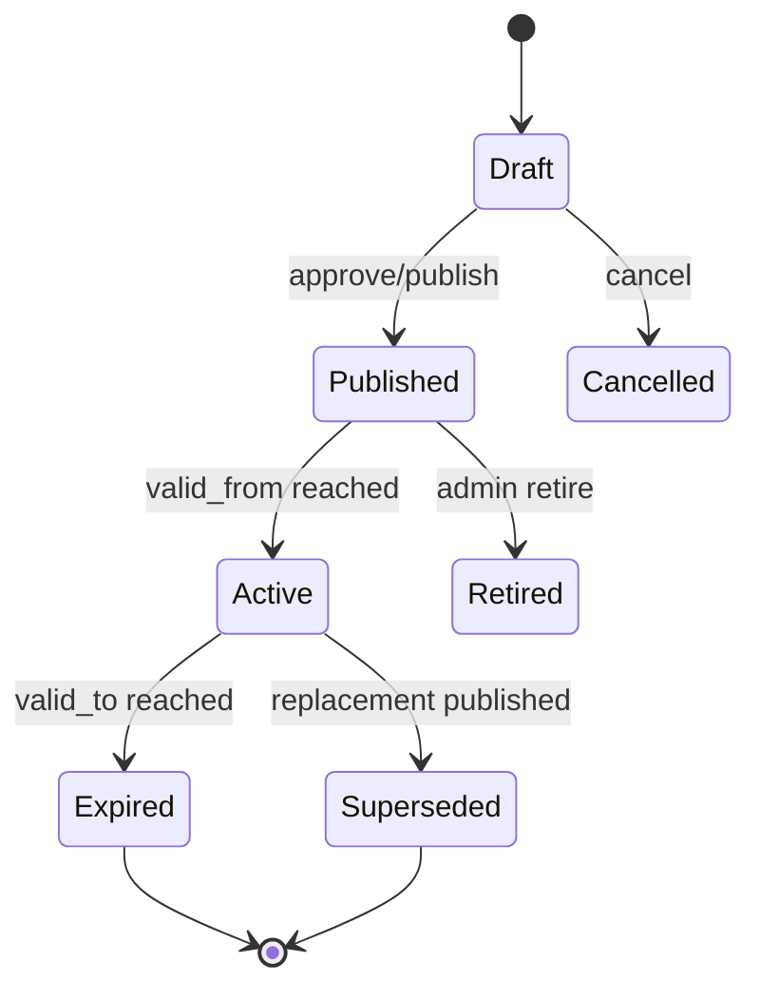

# Part 032 — Soft Delete, Temporal Data, and Effective Dating

Soft delete dan temporal data sering terlihat sederhana.

Tambahkan kolom:

```sql
deleted_at TIMESTAMPTZ
```

atau:

```sql
valid_from TIMESTAMPTZ
valid_to TIMESTAMPTZ
```

Lalu filter query.

Namun dalam enterprise system seperti CPQ, quote, order, catalog, pricing, billing, dan telco BSS/OSS, temporal semantics sering menjadi sumber bug data yang sulit dideteksi.

Contoh bug:

- quote memakai price version yang sudah tidak effective
- order dibuat dari catalog version yang sudah retired
- soft-deleted product offering masih muncul di search
- JPA query otomatis exclude deleted row, tetapi MyBatis query lupa filter
- count query menghitung row soft-deleted
- unique constraint gagal karena row lama masih ada
- historical quote berubah karena join ke current catalog, bukan snapshot
- tenant filter dan soft-delete filter tidak konsisten
- event replay memakai effective date sekarang, bukan event time

Core principle:

> Temporal correctness harus eksplisit. Jika query tidak menyatakan time semantics-nya, query itu kemungkinan salah untuk domain enterprise.

---

## 1. Soft Delete vs Hard Delete

Hard delete:

```sql
DELETE FROM product_offering WHERE id = ?;
```

Soft delete:

```sql
UPDATE product_offering
SET deleted_at = now(),
    deleted_by = ?,
    updated_at = now(),
    updated_by = ?
WHERE id = ?;
```

Perbandingan:

| Aspect | Hard Delete | Soft Delete |
|---|---|---|
| Data removed | yes | no |
| Restore possible | hard/impossible | possible |
| Auditability | requires audit elsewhere | row remains visible internally |
| Query complexity | simpler | every query needs filter |
| Unique constraint | simple | needs partial unique index |
| Storage | smaller | grows over time |
| Privacy deletion | stronger | may violate true deletion requirement |

Soft delete cocok untuk:

- operational restore
- auditability
- reference preservation
- avoiding FK breakage
- lifecycle state where delete means deactivate

Soft delete tidak otomatis cocok untuk:

- privacy/legal deletion
- high-volume ephemeral data
- tables with strict uniqueness and no lifecycle need
- data that must be physically removed

---

## 2. Soft Delete Is a Query Contract

Soft delete bukan hanya column.

Soft delete adalah kontrak bahwa default business query harus mengecualikan row deleted.

```sql
SELECT *
FROM product_offering
WHERE deleted_at IS NULL;
```

Bug terjadi ketika query lupa filter:

```sql
SELECT *
FROM product_offering;
```

Di Java/JAX-RS, bug ini bisa muncul di:

- list endpoint
- search endpoint
- count endpoint
- validation lookup
- uniqueness check
- export job
- event consumer reconciliation
- MyBatis dynamic query
- JPA native query
- reporting read model

Review question:

```text
Does this query intentionally include deleted rows?
```

Jika ya, nama method harus eksplisit:

```java
findIncludingDeletedById(...)
```

bukan:

```java
findById(...)
```

---

## 3. Soft Delete Column Design

Common options:

```sql
deleted BOOLEAN NOT NULL DEFAULT false
```

```sql
deleted_at TIMESTAMPTZ NULL
```

```sql
deleted_at TIMESTAMPTZ NULL,
deleted_by TEXT NULL,
delete_reason TEXT NULL
```

Recommended for audit-sensitive systems:

```sql
deleted_at TIMESTAMPTZ,
deleted_by TEXT,
delete_reason TEXT,
updated_at TIMESTAMPTZ NOT NULL,
updated_by TEXT NOT NULL
```

Why `deleted_at` is often better than boolean:

- records when deletion happened
- can support retention/archive jobs
- can distinguish never deleted vs deleted at time
- helps support temporal debugging

But boolean can help indexing/readability:

```sql
is_deleted BOOLEAN NOT NULL DEFAULT false,
deleted_at TIMESTAMPTZ
```

If both exist, enforce consistency:

```sql
CHECK (
  (is_deleted = false AND deleted_at IS NULL)
  OR
  (is_deleted = true AND deleted_at IS NOT NULL)
)
```

---

## 4. Soft Delete and Unique Constraints

Soft delete creates uniqueness issues.

Example:

```sql
CREATE UNIQUE INDEX uk_product_code
ON product (product_code);
```

If row is soft-deleted, inserting a new product with same code still fails.

Use partial unique index if business allows reusing code after deletion:

```sql
CREATE UNIQUE INDEX uk_product_code_active
ON product (tenant_id, product_code)
WHERE deleted_at IS NULL;
```

Review questions:

- should deleted rows still reserve unique keys?
- should product/quote/order number ever be reused?
- should natural keys be reusable after delete?
- should uniqueness be tenant-scoped?
- should effective dating be part of uniqueness?

For many enterprise domains, identifiers should not be reused even after delete.

Example:

```text
quote_number should probably remain globally/non-tenant uniquely traceable.
```

So partial uniqueness is not always correct.

---

## 5. Soft Delete and Foreign Keys

Soft-deleted parent rows still exist, so FK remains valid.

But business semantics may be invalid:

```text
Order references product_offering that is now soft-deleted.
```

This may be fine if order needs historical reference.

But new quote creation should not use deleted offering.

Different read semantics:

| Use Case | Should include soft-deleted reference? |
|---|---|
| Create new quote | no |
| View historical quote | yes, if snapshot/reference needed |
| Search active catalog | no |
| Audit old order | yes |
| Billing reconciliation | often yes |
| Admin restore UI | yes |

Do not blindly apply one filter to all use cases.

---

## 6. JPA Soft Delete

Hibernate supports patterns like `@SQLDelete` and filters, but behavior must be understood.

Example conceptual mapping:

```java
@Entity
@Table(name = "product_offering")
@SQLDelete(sql = "UPDATE product_offering SET deleted_at = now() WHERE id = ?")
@Where(clause = "deleted_at IS NULL")
public class ProductOfferingEntity {
    @Id
    private UUID id;
}
```

Caution:

- `@Where` is implicit and always applied to entity loading.
- Native queries may bypass it.
- MyBatis queries do not know about it.
- Bulk JPQL/native updates may not behave like entity delete.
- Relationship loading can silently exclude deleted child rows.
- Admin/audit use cases may need including deleted rows.

For dynamic behavior, Hibernate filters can be more explicit than static `@Where`, but require correct enablement per session/transaction.

Review question:

```text
Is hidden filter behavior acceptable for this entity?
```

---

## 7. MyBatis Soft Delete

MyBatis requires explicit query discipline.

Good default query:

```xml
<select id="findActiveProductOfferingById" resultMap="ProductOfferingResultMap">
  SELECT *
  FROM product_offering
  WHERE id = #{id}
    AND tenant_id = #{tenantId}
    AND deleted_at IS NULL
</select>
```

Admin query should be explicit:

```xml
<select id="findProductOfferingIncludingDeletedById" resultMap="ProductOfferingResultMap">
  SELECT *
  FROM product_offering
  WHERE id = #{id}
    AND tenant_id = #{tenantId}
</select>
```

Dangerous mapper:

```xml
<select id="findByCode" resultMap="ProductOfferingResultMap">
  SELECT *
  FROM product_offering
  WHERE product_code = #{productCode}
</select>
```

Why dangerous:

- no tenant condition
- no deleted filter
- ambiguous if duplicate historical/deleted rows exist

MyBatis review checklist:

- does query need `deleted_at IS NULL`?
- does query need tenant filter?
- is method name clear about deleted inclusion?
- does count query match list query?
- does dynamic SQL branch accidentally remove soft-delete condition?

---

## 8. Temporal Data Mental Model

Temporal data means data validity depends on time.

Common columns:

```sql
valid_from TIMESTAMPTZ NOT NULL,
valid_to TIMESTAMPTZ NULL
```

Meaning:

```text
Row is valid from valid_from inclusive until valid_to exclusive.
```

Recommended convention:

```text
valid_from <= t AND (valid_to IS NULL OR t < valid_to)
```

Use half-open interval `[from, to)` to avoid overlap at boundary.

Avoid:

```sql
valid_from <= :t AND valid_to >= :t
```

because inclusive end can create boundary ambiguity.

---

## 9. Effective Dating in CPQ/Pricing/Catalog

Effective dating is central for CPQ.

Examples:

- product offering available from date A to date B
- price effective for a currency, market, customer segment, and period
- discount policy valid during promotion window
- contract terms effective after acceptance
- catalog version published at time T

Price query example:

```sql
SELECT *
FROM product_price
WHERE product_offering_id = :offeringId
  AND currency = :currency
  AND tenant_id = :tenantId
  AND deleted_at IS NULL
  AND valid_from <= :pricingTime
  AND (valid_to IS NULL OR :pricingTime < valid_to)
ORDER BY valid_from DESC
LIMIT 1;
```

Key question:

```text
What is pricingTime?
```

Possible answers:

- request time
- quote creation time
- quote submission time
- contract start date
- order submission time
- billing activation time
- event occurred time

Different answers produce different business results.

---

## 10. Current Time vs Business Time vs Event Time

Do not blindly use `now()`.

| Time Type | Meaning | Example |
|---|---|---|
| System time | when system processes request | DB `now()` |
| Request time | when API request received | JAX-RS filter timestamp |
| Business time | date business rule should apply | contract start date |
| Event time | when upstream event occurred | event `occurredAt` |
| Processing time | when consumer processes event | consumer runtime timestamp |

Bug example:

```text
Quote created yesterday uses price effective today because service uses now() during recalculation.
```

Correct pattern:

```java
PriceContext context = new PriceContext(
    quote.getPricingEffectiveAt(),
    quote.getCurrency(),
    quote.getCustomerSegment()
);
```

Temporal code must name the time being used.

---

## 11. Validity Window Constraints

PostgreSQL can help prevent invalid temporal rows.

Basic check:

```sql
ALTER TABLE product_price
ADD CONSTRAINT ck_product_price_valid_window
CHECK (valid_to IS NULL OR valid_from < valid_to);
```

Prevent overlapping price windows per product/currency/tenant with exclusion constraint if using range types:

```sql
CREATE EXTENSION IF NOT EXISTS btree_gist;

ALTER TABLE product_price
ADD COLUMN valid_range tstzrange
GENERATED ALWAYS AS (tstzrange(valid_from, valid_to, '[)')) STORED;

ALTER TABLE product_price
ADD CONSTRAINT ex_product_price_no_overlap
EXCLUDE USING gist (
    tenant_id WITH =,
    product_offering_id WITH =,
    currency WITH =,
    valid_range WITH &&
)
WHERE (deleted_at IS NULL);
```

This is powerful but must be reviewed with DBA/team convention.

If exclusion constraints are not used, application/service layer must enforce overlap prevention with transaction and lock strategy.

---

## 12. Temporal Query Indexing

Temporal lookup can be expensive without the right index.

Common query:

```sql
WHERE tenant_id = ?
  AND product_offering_id = ?
  AND currency = ?
  AND deleted_at IS NULL
  AND valid_from <= ?
  AND (valid_to IS NULL OR ? < valid_to)
```

Possible indexes:

```sql
CREATE INDEX idx_product_price_lookup
ON product_price (tenant_id, product_offering_id, currency, valid_from DESC)
WHERE deleted_at IS NULL;
```

If using range:

```sql
CREATE INDEX idx_product_price_valid_range
ON product_price USING gist (tenant_id, product_offering_id, currency, valid_range)
WHERE deleted_at IS NULL;
```

Index selection depends on query patterns, cardinality, and PostgreSQL version/config.

Do not add advanced index blindly without `EXPLAIN ANALYZE`.

---

## 13. Snapshot vs Reference

Historical quote correctness often requires snapshotting.

Bad pattern:

```text
Quote item stores product_offering_id only.
View quote joins current product_offering and current product_price.
```

If catalog/price changes later, old quote appears changed.

Better pattern:

```sql
quote_item (
    id,
    quote_id,
    product_offering_id,
    product_offering_code_snapshot,
    product_offering_name_snapshot,
    price_id,
    unit_price_snapshot,
    currency_snapshot,
    pricing_effective_at,
    catalog_version_id
)
```

Reference is useful for traceability.

Snapshot is useful for historical correctness.

Question:

```text
Should this screen show current truth or historical truth?
```

For accepted quote/order/billing, historical truth is often required.

---

## 14. Catalog Versioning

Catalog-driven systems often need version awareness.

Possible model:

```sql
catalog_version (
    id UUID PRIMARY KEY,
    catalog_id UUID NOT NULL,
    version_number TEXT NOT NULL,
    status TEXT NOT NULL,
    published_at TIMESTAMPTZ,
    valid_from TIMESTAMPTZ NOT NULL,
    valid_to TIMESTAMPTZ
);
```

Product offering references version:

```sql
product_offering (
    id UUID PRIMARY KEY,
    catalog_version_id UUID NOT NULL,
    offering_code TEXT NOT NULL,
    valid_from TIMESTAMPTZ NOT NULL,
    valid_to TIMESTAMPTZ,
    deleted_at TIMESTAMPTZ
);
```

Query must decide:

- latest draft?
- published version?
- active at business time?
- version used by quote?
- version used by order?
- admin preview version?

Do not let method name `findProductOffering` hide these distinctions.

---

## 15. Temporal Lifecycle Diagram

Example price lifecycle:



Important distinction:

- lifecycle status is state
- valid_from/valid_to is temporal validity
- deleted_at is deletion visibility

Do not collapse all three into one boolean.

---

## 16. Soft Delete + Temporal Validity Combined

A row can be:

- active and current
- active but future-dated
- active but expired
- soft-deleted
- historical and referenced by quote/order

Default active-current predicate might be:

```sql
WHERE tenant_id = :tenantId
  AND deleted_at IS NULL
  AND valid_from <= :asOf
  AND (valid_to IS NULL OR :asOf < valid_to)
```

But admin/historical query may intentionally differ.

Method names should encode semantics:

```java
findActiveCurrentOffering(...)
findOfferingAsOf(...)
findOfferingIncludingDeleted(...)
findHistoricalOfferingForQuote(...)
```

Ambiguous `findById` is dangerous for temporal data.

---

## 17. JPA Temporal Querying

JPA can express temporal query in JPQL:

```java
TypedQuery<ProductPriceEntity> query = entityManager.createQuery("""
    select p
    from ProductPriceEntity p
    where p.tenantId = :tenantId
      and p.productOfferingId = :offeringId
      and p.currency = :currency
      and p.deletedAt is null
      and p.validFrom <= :asOf
      and (p.validTo is null or :asOf < p.validTo)
    order by p.validFrom desc
""", ProductPriceEntity.class);
```

Caution:

- generated SQL must be checked
- index usage must be checked
- pagination/limit behavior differs from SQL syntax
- entity loading may load more columns/relations than needed
- hidden `@Where` may combine with explicit predicates

For complex PostgreSQL temporal/range query, MyBatis or native query may be clearer.

---

## 18. MyBatis Temporal Querying

MyBatis makes temporal SQL explicit:

```xml
<select id="findActivePriceAsOf" resultMap="ProductPriceResultMap">
  SELECT id,
         product_offering_id,
         currency,
         amount,
         valid_from,
         valid_to,
         version
  FROM product_price
  WHERE tenant_id = #{tenantId}
    AND product_offering_id = #{productOfferingId}
    AND currency = #{currency}
    AND deleted_at IS NULL
    AND valid_from <= #{asOf}
    AND (valid_to IS NULL OR #{asOf} &lt; valid_to)
  ORDER BY valid_from DESC
  LIMIT 1
</select>
```

Strength:

- SQL semantics visible
- PostgreSQL-specific operators available
- easier to reason with `EXPLAIN`

Risk:

- every mapper must repeat correct predicates
- dynamic SQL can accidentally remove time filter
- XML escaping can reduce readability
- query object must carry correct `asOf`

---

## 19. Event-Driven Temporal Correctness

Event consumers must distinguish event time from processing time.

Bad pattern:

```java
priceService.findActivePrice(Instant.now(), productId);
```

Better:

```java
priceService.findActivePrice(event.occurredAt(), productId);
```

But only if business semantics require event time.

Event replay risk:

```text
Replaying a 3-month-old event should not apply today's catalog unless that is explicitly intended.
```

Outbox event should include enough temporal context:

- aggregate id
- aggregate version
- business effective time
- event occurred time
- catalog version id if relevant
- price snapshot if downstream must not reprice

---

## 20. Temporal Data and Transactions

Temporal write operations need transaction correctness.

Example: replacing active price.

Naive flow:

```text
insert new price window
update old price valid_to
commit
```

Race risk:

- two requests insert overlapping price
- old price updated by both
- gap or overlap created

Safer options:

- exclusion constraint
- lock product/currency price group
- serializable transaction with retry
- optimistic version on parent price group
- single stored procedure/function if team uses DB logic

MyBatis explicit lock:

```sql
SELECT id
FROM product_price_group
WHERE tenant_id = ?
  AND product_offering_id = ?
  AND currency = ?
FOR UPDATE;
```

JPA pessimistic lock:

```java
entityManager.find(PriceGroupEntity.class, id, LockModeType.PESSIMISTIC_WRITE);
```

---

## 21. Time Zone Correctness

Use timezone-aware types.

PostgreSQL:

```sql
TIMESTAMPTZ
```

Java:

```java
Instant
OffsetDateTime
```

Avoid ambiguous local time for persisted business timestamps.

Questions:

- are business dates date-only or timestamp?
- is effective date tenant-local?
- is catalog valid from midnight in which timezone?
- does billing cycle use account timezone?
- does API accept offset?
- do tests cover DST boundary if local business time matters?

For many backend persistence fields, `Instant` + `TIMESTAMPTZ` is safer.

But for business concepts like billing cycle date, a `LocalDate` with explicit business timezone may be correct.

---

## 22. Temporal Data and Reporting

Reporting often needs historical truth.

Danger:

```sql
SELECT q.quote_number, p.current_name, price.amount
FROM quote_item qi
JOIN product_offering p ON p.id = qi.product_offering_id
JOIN product_price price ON price.product_offering_id = p.id
WHERE price.valid_from <= now()
  AND (price.valid_to IS NULL OR now() < price.valid_to);
```

This reports old quote using current price.

Better:

- use quote snapshot fields
- join by `catalog_version_id`
- join as-of `quote.pricing_effective_at`
- use materialized read model built at quote finalization

Reporting query must state temporal basis:

```text
as of now
as of quote creation
as of submission
as of order activation
as of billing period
```

---

## 23. Hidden Data Bugs

### 23.1 Deleted Row Appears in Search

Cause:

- missing `deleted_at IS NULL`
- JPA native query bypasses filter
- MyBatis dynamic branch omits predicate

Detection:

```sql
SELECT *
FROM product_offering
WHERE deleted_at IS NOT NULL
  AND id IN (... results from search ...);
```

### 23.2 Historical Quote Changes After Catalog Update

Cause:

- quote view joins current catalog
- no snapshot fields
- no catalog version id

Detection:

- compare quote rendered before/after catalog publish
- test accepted quote immutability

### 23.3 Duplicate Active Price

Cause:

- no overlap constraint
- race condition
- missing lock

Detection:

```sql
SELECT p1.product_offering_id, p1.currency, p1.id, p2.id
FROM product_price p1
JOIN product_price p2
  ON p1.product_offering_id = p2.product_offering_id
 AND p1.currency = p2.currency
 AND p1.id < p2.id
 AND p1.deleted_at IS NULL
 AND p2.deleted_at IS NULL
 AND tstzrange(p1.valid_from, p1.valid_to, '[)') && tstzrange(p2.valid_from, p2.valid_to, '[)');
```

### 23.4 Count Query Mismatch

Cause:

- list query filters deleted/valid rows
- count query does not

Detection:

- integration test list/count consistency
- compare generated SQL/logs

---

## 24. Soft Delete Performance Concerns

If most rows are deleted, default query needs partial indexes.

Example:

```sql
CREATE INDEX idx_product_offering_active_lookup
ON product_offering (tenant_id, offering_code)
WHERE deleted_at IS NULL;
```

Without partial index:

- queries scan many deleted rows
- planner estimates may degrade
- table bloat increases
- vacuum/maintenance matters

Soft delete can turn tables into append/update-heavy history stores. If deleted rows are rarely needed online, consider archive strategy.

---

## 25. Soft Delete Security and Privacy Concerns

Soft delete is not privacy delete.

If user/customer data must be deleted or anonymized, soft delete may be insufficient.

Potential strategies:

- hard delete where legally required
- anonymization
- tokenization
- encryption key destruction
- retention-based purge
- separate operational delete vs compliance erase workflow

Review question:

```text
Does delete mean hide from UI, deactivate for business, or remove for privacy/compliance?
```

Different meanings require different persistence design.

---

## 26. Temporal Data in Kubernetes/Cloud/Hybrid Deployments

Temporal correctness can be affected by deployment/runtime:

- pod clock drift if NTP broken
- inconsistent timezone config
- app uses local JVM timezone
- DB uses UTC but app assumes local time
- cross-region latency and event ordering
- replay consumers process old events after deployment
- rolling deployment has old and new temporal logic concurrently

Checklist:

- standardize persisted timestamps
- avoid JVM default timezone dependency
- include temporal behavior in integration tests
- ensure old/new app versions are schema-compatible
- include effective time in events/contracts

---

## 27. Testing Soft Delete

Test cases:

- default find excludes deleted row
- explicit including-deleted query includes it
- list and count use same predicate
- unique constraint behavior after soft delete
- restore behavior if supported
- relationship loading with deleted child/parent
- MyBatis and JPA paths behave consistently
- admin/audit queries intentionally include deleted rows

Example assertion:

```java
assertThat(repository.findActiveById(id)).isEmpty();
assertThat(repository.findIncludingDeletedById(id)).isPresent();
```

---

## 28. Testing Temporal Queries

Test cases:

- before valid_from returns no row
- exactly at valid_from returns row
- just before valid_to returns row
- exactly at valid_to returns no row for `[from,to)` convention
- null valid_to means open-ended
- overlapping windows rejected
- future-dated rows not returned as current
- historical quote uses snapshot/as-of time
- event replay uses event time if required

Boundary test:

```java
Instant t0 = Instant.parse("2026-01-01T00:00:00Z");
Instant t1 = Instant.parse("2026-02-01T00:00:00Z");

assertNoPriceAt(t0.minusMillis(1));
assertPriceAt(t0);
assertPriceAt(t1.minusMillis(1));
assertNoPriceAt(t1);
```

---

## 29. Debugging Temporal Bugs

Ask:

1. What time was used by the query?
2. Was it system time, business time, event time, or processing time?
3. Was soft-delete filter applied?
4. Was tenant filter applied?
5. Was query using current catalog or versioned catalog?
6. Was quote/order supposed to use snapshot data?
7. Did JPA hidden filter differ from MyBatis explicit SQL?
8. Did count query match list query?
9. Did transaction race create overlap/gap?
10. Did event replay change temporal basis?

Useful SQL:

```sql
SELECT id, valid_from, valid_to, deleted_at, updated_at, updated_by
FROM product_price
WHERE product_offering_id = :offeringId
  AND currency = :currency
ORDER BY valid_from;
```

```sql
EXPLAIN ANALYZE
SELECT *
FROM product_price
WHERE tenant_id = :tenantId
  AND product_offering_id = :offeringId
  AND currency = :currency
  AND deleted_at IS NULL
  AND valid_from <= :asOf
  AND (valid_to IS NULL OR :asOf < valid_to)
ORDER BY valid_from DESC
LIMIT 1;
```

---

## 30. PR Review Checklist

For soft delete:

- Is delete semantic defined?
- Is `deleted_at`/`deleted_by` set?
- Do default queries exclude deleted rows?
- Are including-deleted queries explicitly named?
- Do list/count predicates match?
- Are unique indexes correct for deleted rows?
- Are JPA and MyBatis behavior consistent?
- Are admin/audit/reporting use cases covered?
- Is privacy deletion requirement different from soft delete?

For temporal data:

- Is time basis explicitly named?
- Is `[valid_from, valid_to)` convention used?
- Are overlap/gap rules defined?
- Are constraints/locks used to prevent race?
- Are indexes appropriate?
- Does query use snapshot or current reference intentionally?
- Are event replay semantics correct?
- Are boundary tests included?

---

## 31. Internal Verification Checklist

Verify in the actual codebase/team:

- apakah soft delete digunakan?
- kolom apa yang dipakai: `deleted`, `deleted_at`, `is_active`, status, atau kombinasi?
- apakah ada JPA `@Where`, `@Filter`, atau `@SQLDelete`?
- apakah MyBatis mapper punya reusable SQL fragment untuk active predicate?
- apakah native query bypass JPA filter?
- apakah count query sering mismatch dengan list query?
- apakah unique index partial digunakan untuk active rows?
- apakah temporal validity memakai `valid_from`/`valid_to`?
- apakah interval convention inclusive/exclusive sudah disepakati?
- apakah catalog/price versioning ada?
- apakah quote/order menyimpan snapshot atau join ke current catalog?
- apakah event payload membawa effective time/catalog version?
- apakah overlap prevention dilakukan oleh constraint, lock, service validation, atau manual review?
- apakah ada incident terkait stale catalog, wrong price, deleted row visible, atau historical quote changed?
- siapa owner temporal correctness: domain/backend, DBA, product, pricing/catalog team?

---

## 32. Senior Engineer Mental Model

Soft delete adalah visibility rule.

Effective dating adalah time-based validity rule.

Catalog/price versioning adalah historical correctness rule.

Snapshotting adalah immutability rule.

Semua rule ini harus terlihat di query, model, transaction, event, test, dan PR review.

Senior persistence engineer tidak hanya bertanya:

```text
Apakah query ini jalan?
```

Ia bertanya:

```text
Untuk tenant siapa, pada waktu bisnis apa, dengan versi catalog apa, termasuk deleted atau tidak, dan apakah hasilnya tetap benar saat data berubah besok?
```

Jika query tidak bisa menjawab itu, query belum siap untuk enterprise production system.
