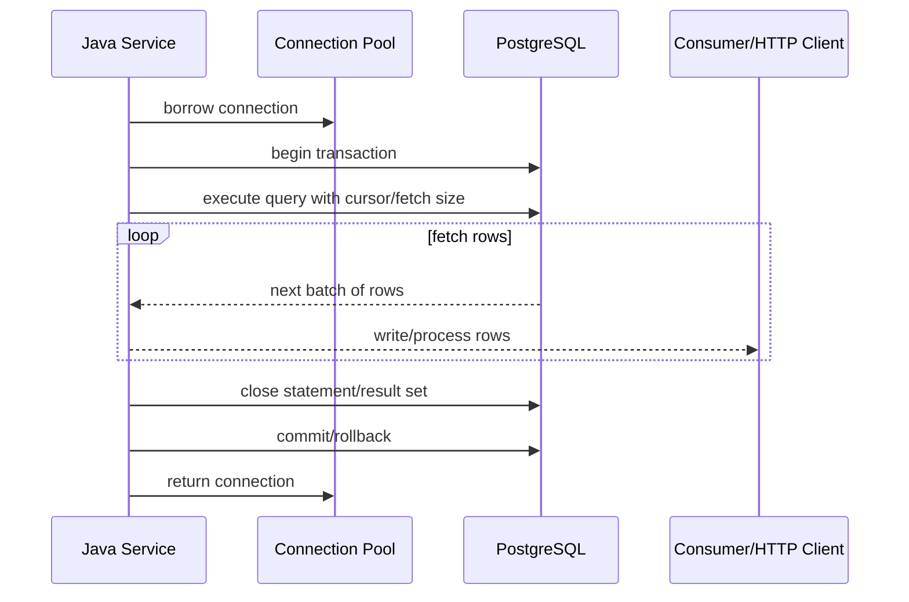
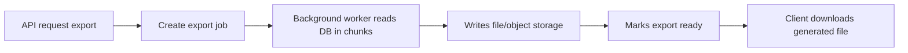

# Part 036 — Large Result Streaming

Large result streaming adalah teknik membaca hasil query besar tanpa memuat semuanya ke memory sekaligus.

Masalahnya: streaming database tidak gratis.

Saat result masih dibaca, biasanya:

- connection masih terpakai
- transaction masih terbuka
- cursor masih hidup
- statement masih aktif
- timeout masih relevan
- client cancellation harus ditangani
- backpressure harus dipikirkan
- resource closing harus benar

Core principle:

> Streaming result memindahkan risiko dari heap memory ke connection lifetime, transaction duration, timeout, dan operational control.

Dalam sistem CPQ, quote, order, catalog, billing, audit, dan reporting, large result muncul pada:

- export quote/order list
- generate report
- sync read model
- reprocess event backlog
- reconciliation job
- catalog/price dump
- migration/backfill
- audit investigation
- customer data export

Pertanyaan persistence engineer:

- Apakah data harus di-stream, atau harus dipaginate/chunk?
- Berapa lama connection akan tertahan?
- Apakah transaction harus tetap terbuka selama streaming?
- Apakah endpoint HTTP bisa dibatalkan dengan aman?
- Apakah cursor/fetch size benar-benar bekerja dengan PostgreSQL driver?
- Apakah MyBatis/JPA streaming tidak menyimpan object terlalu banyak?
- Apakah tenant/security/soft-delete filter tetap diterapkan?
- Apakah hasil streaming konsisten terhadap perubahan data selama proses?

---

## 1. Large Result Problem

Bad pattern:

```java
List<QuoteExportRow> rows = repository.findAllForExport(filter);
return csvWriter.write(rows);
```

Jika query menghasilkan 2 juta row:

- semua row masuk heap
- object allocation tinggi
- GC pressure
- latency tinggi sebelum byte pertama dikirim
- risiko OOM
- connection mungkin tetap tertahan selama query besar

Better mental model:

```text
read small window -> process/write -> release memory -> continue
```

Ada beberapa strategi:

| Strategy | Cocok untuk | Risiko |
|---|---|---|
| Pagination | UI list, bounded navigation | unstable page jika order buruk |
| Keyset chunking | job/backfill/export besar | perlu deterministic order |
| JDBC cursor/fetch size | streaming sequential | connection/transaction held open |
| MyBatis cursor | mapper-controlled streaming | resource closing wajib |
| JPA stream | entity/projection stream | persistence context growth/lazy loading |
| Server-side export job | long-running export | operational complexity |

Streaming bukan default terbaik. Sering kali chunked keyset processing lebih aman.

---

## 2. Streaming vs Pagination vs Chunking

### Pagination

Pagination cocok untuk API UI.

```sql
SELECT id, quote_number, status
FROM quote
WHERE tenant_id = :tenantId
ORDER BY created_at DESC, id DESC
LIMIT 50 OFFSET 0;
```

Pagination biasanya request/response pendek.

### Chunking

Chunking cocok untuk job besar.

```sql
SELECT id
FROM quote
WHERE id > :lastId
ORDER BY id
LIMIT 1000;
```

Setiap chunk bisa commit, checkpoint, dan resume.

### Streaming

Streaming cocok saat consumer ingin memproses row satu per satu dari satu query.

```text
Open query cursor.
Fetch rows gradually.
Process rows as they arrive.
Close cursor/statement/connection.
```

Streaming cocok jika:

- data harus diproses sequential
- memory harus bounded
- result order stabil
- connection bisa ditahan dalam durasi wajar
- consumer bisa membaca cukup cepat
- cancellation/resource cleanup dapat dijamin

Streaming tidak cocok jika:

- client lambat/tidak stabil
- export bisa berlangsung lama sekali
- connection pool kecil
- transaction tidak boleh terbuka lama
- query memblokir update online
- operation harus resumable setelah crash

---

## 3. JDBC Fetch Size

JDBC `fetchSize` memberi hint kepada driver tentang berapa banyak row diambil per round trip.

Naive:

```java
try (PreparedStatement statement = connection.prepareStatement(sql);
     ResultSet rs = statement.executeQuery()) {

    while (rs.next()) {
        processRow(rs);
    }
}
```

Dengan fetch size:

```java
try (PreparedStatement statement = connection.prepareStatement(sql)) {
    statement.setFetchSize(500);

    try (ResultSet rs = statement.executeQuery()) {
        while (rs.next()) {
            processRow(rs);
        }
    }
}
```

Untuk PostgreSQL JDBC, streaming behavior biasanya membutuhkan:

- autocommit disabled
- forward-only result set
- fetch size > 0
- transaction tetap terbuka selama cursor dibaca

Pattern:

```java
try (Connection connection = dataSource.getConnection()) {
    connection.setAutoCommit(false);

    try (PreparedStatement statement = connection.prepareStatement(
            sql,
            ResultSet.TYPE_FORWARD_ONLY,
            ResultSet.CONCUR_READ_ONLY)) {

        statement.setFetchSize(500);

        try (ResultSet rs = statement.executeQuery()) {
            while (rs.next()) {
                writer.write(mapRow(rs));
            }
        }
    }

    connection.commit();
}
```

Important:

> Fetch size is a hint, not a correctness guarantee. Verify actual driver behavior in the internal stack.

---

## 4. Cursor Mental Model

Cursor adalah pointer server-side/client-side untuk membaca result bertahap.

Simplified lifecycle:



Key implication:

```text
The connection is not available to other requests while streaming is active.
```

If 20 users start long export and each export holds one connection, a pool of 20 can be exhausted.

---

## 5. Transaction Requirement

Streaming cursor often requires transaction to stay open.

This creates trade-off:

- memory is bounded
- but transaction duration increases
- connection is held
- snapshot may be held
- database cleanup/vacuum can be affected for long snapshots
- locks may be retained depending on query

For read-only streaming, use read-only transaction if supported/configured:

```java
connection.setReadOnly(true);
connection.setAutoCommit(false);
```

Framework-level example concept:

```java
@Transactional(readOnly = true)
public void streamExport(ExportFilter filter, RowConsumer consumer) {
    repository.streamRows(filter, consumer);
}
```

But verify:

- does framework keep transaction open until stream consumed?
- does method return Stream that is consumed outside transaction?
- does JAX-RS response write after transaction scope ended?

Common bug:

```java
@Transactional(readOnly = true)
public Stream<QuoteRow> streamQuotes() {
    return repository.streamAll();
}

// Transaction may close before caller consumes stream.
```

Better:

```java
@Transactional(readOnly = true)
public void writeQuotes(OutputStream outputStream) {
    repository.streamAll(row -> csvWriter.write(outputStream, row));
}
```

The transaction encloses stream consumption.

---

## 6. Connection Held Open

Streaming trades heap memory for connection lifetime.

If one export takes 5 minutes, one connection is occupied for 5 minutes.

Capacity math:

```text
pool size = 20
normal traffic needs 15 connections at peak
available for export = 5
max concurrent exports should be <= 5, preferably lower
```

Bad:

```text
No export concurrency limit.
Each export streams directly from DB to slow client.
```

Failure mode:

- pool exhaustion
- API latency spike
- unrelated endpoints fail
- DB connection max reached
- rolling deployment amplifies connection usage

Controls:

- export concurrency limit
- dedicated datasource/pool for reporting/export
- async export job writing to object storage/file
- chunked processing with checkpoint
- timeout/cancellation
- rate limiting
- backpressure-aware output

Review question:

```text
How many concurrent streams can the system tolerate before normal traffic degrades?
```

---

## 7. MyBatis Cursor

MyBatis supports cursor-style reading.

Conceptual mapper:

```java
Cursor<QuoteExportRow> streamQuotes(QuoteExportFilter filter);
```

Usage pattern:

```java
try (Cursor<QuoteExportRow> cursor = mapper.streamQuotes(filter)) {
    for (QuoteExportRow row : cursor) {
        writer.write(row);
    }
}
```

Important:

- cursor must be closed
- SqlSession must remain open while cursor is consumed
- transaction/connection must remain open
- do not return cursor to caller if session closes first
- avoid nested select mapping that triggers N+1 during streaming

Bad:

```java
public Cursor<QuoteExportRow> streamQuotes(Filter filter) {
    try (SqlSession session = sqlSessionFactory.openSession()) {
        return session.getMapper(QuoteMapper.class).streamQuotes(filter);
    }
}
```

The session closes before cursor is consumed.

Better:

```java
public void streamQuotes(Filter filter, Consumer<QuoteExportRow> consumer) {
    try (SqlSession session = sqlSessionFactory.openSession()) {
        QuoteMapper mapper = session.getMapper(QuoteMapper.class);
        try (Cursor<QuoteExportRow> cursor = mapper.streamQuotes(filter)) {
            for (QuoteExportRow row : cursor) {
                consumer.accept(row);
            }
        }
    }
}
```

In framework-managed MyBatis integration, verify actual lifecycle.

---

## 8. JPA Stream

JPA supports query result streaming in modern implementations.

Example concept:

```java
try (Stream<QuoteExportRow> stream = entityManager
        .createQuery("""
            select new com.example.QuoteExportRow(
                q.id,
                q.quoteNumber,
                q.status,
                q.createdAt
            )
            from Quote q
            where q.tenantId = :tenantId
            order by q.createdAt desc, q.id desc
            """, QuoteExportRow.class)
        .setParameter("tenantId", tenantId)
        .getResultStream()) {

    stream.forEach(writer::write);
}
```

JPA streaming risk:

- persistence context may retain entities
- lazy loading may trigger N+1
- stream may be consumed outside transaction
- provider-specific behavior matters
- DTO projection is often safer than entity streaming

Prefer projection for export:

```java
select new QuoteExportRow(...)
```

Avoid streaming managed entities unless you need entity lifecycle behavior.

If streaming entities, consider periodic clear carefully:

```java
int[] count = {0};
stream.forEach(entity -> {
    process(entity);
    count[0]++;

    if (count[0] % 500 == 0) {
        entityManager.clear();
    }
});
```

But clearing while streaming provider-managed result can have subtle behavior. Verify with integration tests.

---

## 9. Hibernate Scrollable Results

Hibernate also has provider-specific streaming/scrolling APIs.

Conceptually:

```java
ScrollableResults results = query.scroll(ScrollMode.FORWARD_ONLY);
while (results.next()) {
    Object row = results.get();
    process(row);
}
```

Hibernate-specific options can be powerful, but increase coupling to provider behavior.

Use provider-specific APIs when:

- JPA standard API is insufficient
- performance requirement is clear
- behavior is tested against actual Hibernate/PostgreSQL stack
- team accepts provider coupling

Review question:

```text
Is provider-specific streaming justified, documented, and covered by integration tests?
```

---

## 10. HTTP Streaming

Large result is often streamed to HTTP response as CSV/JSONL.

Risk:

```text
DB connection lifetime becomes tied to client network speed.
```

If client is slow:

- response write blocks
- DB cursor remains open
- connection remains borrowed
- transaction remains open
- pool capacity decreases

Direct DB-to-HTTP streaming is acceptable only when:

- result size bounded or concurrency limited
- clients are trusted/stable enough
- timeout/cancellation is handled
- pool capacity is protected
- backpressure is understood

Safer architecture for very large exports:



This avoids holding DB connection while client slowly downloads.

---

## 11. JSON vs CSV vs JSONL

Output format affects memory.

### JSON array

```json
[
  { "id": "1" },
  { "id": "2" }
]
```

Can be streamed, but needs careful opening/commas/closing.

### JSONL

```jsonl
{"id":"1"}
{"id":"2"}
```

Simpler for streaming and line-by-line processing.

### CSV

Good for export, but requires:

- escaping
- stable column order
- timezone formatting
- locale rules
- PII masking
- formula injection prevention if opened in spreadsheet tools

Persistence concern:

> Export format can create security/privacy bugs even if query is correct.

For example, CSV cells starting with `=`, `+`, `-`, or `@` may be interpreted as formula by spreadsheet tools. Sanitize if exporting user-controlled fields.

---

## 12. Backpressure

Backpressure means producer should not produce faster than consumer can handle.

In DB streaming:

```text
PostgreSQL -> JDBC driver -> Java mapper -> writer -> HTTP client/file/message broker
```

If writer is slow, the pipeline must avoid unbounded buffering.

Bad:

```java
List<Row> buffer = new ArrayList<>();
stream.forEach(buffer::add);
writeAll(buffer);
```

This defeats streaming.

Better:

```java
stream.forEach(row -> {
    writer.write(row);
    writer.flushIfNeeded();
});
```

But excessive flushing hurts performance.

Balance:

- bounded buffer
- periodic flush
- cancellation check
- timeout
- max rows/bytes limit

Review question:

```text
Where can data accumulate unboundedly between DB and final consumer?
```

---

## 13. Cancellation

Streaming must handle cancellation.

Cancellation sources:

- HTTP client disconnects
- request timeout
- service shutdown
- Kubernetes pod termination
- operator cancels job
- downstream writer fails

When cancellation happens:

- stop reading result set
- close ResultSet/Cursor/Stream
- close Statement
- rollback/commit transaction as appropriate
- return connection to pool
- record partial progress if job-based

Bad:

```text
Client disconnected, but DB query/cursor continues until timeout.
```

Required pattern:

```java
try {
    streamRows(writer);
} catch (IOException clientGone) {
    // stop streaming, close cursor/result set via try-with-resources
    throw clientGone;
}
```

For long-running query, statement cancellation support matters. Verify driver/framework behavior.

---

## 14. Resource Closing

Every streaming path must close resources deterministically.

JDBC:

```java
try (Connection connection = dataSource.getConnection();
     PreparedStatement statement = connection.prepareStatement(sql);
     ResultSet rs = statement.executeQuery()) {

    while (rs.next()) {
        process(rs);
    }
}
```

MyBatis:

```java
try (Cursor<Row> cursor = mapper.streamRows(filter)) {
    for (Row row : cursor) {
        process(row);
    }
}
```

JPA:

```java
try (Stream<Row> stream = query.getResultStream()) {
    stream.forEach(this::process);
}
```

Common leak:

```java
Stream<Row> stream = repository.streamRows();
return stream.map(...);
```

If caller forgets to close the stream, connection leaks.

Rule:

> Prefer callback-style streaming inside the transaction/resource scope over returning raw Stream/Cursor across layers.

---

## 15. Streaming and Transaction Consistency

A long stream sees data according to transaction isolation and cursor behavior.

Questions:

- Does export need a consistent snapshot?
- Is it acceptable if rows inserted during export are missing?
- Is it acceptable if rows updated during export show old values?
- Does order need to be stable?

If strong consistency is required, one long transaction may provide a snapshot but increases operational cost.

If operational safety matters more, chunking with checkpoint may be better, but result can reflect changing data across chunks.

Trade-off:

| Requirement | Better strategy |
|---|---|
| Consistent snapshot small/medium export | cursor/transaction streaming |
| Very large export resumable | chunked job with checkpoint |
| UI page browsing | pagination/keyset |
| Online API low latency | avoid long streaming |
| Audit-grade export | job with snapshot/version marker |

---

## 16. Streaming and Tenant/Security Filters

Large result export often has higher security risk than normal API.

Why?

- more rows exposed
- data leaves system as file
- logs may include export metadata
- long-running job might bypass normal request filters
- background workers may not carry user/tenant context correctly

Checklist:

- tenant_id filter present
- soft delete filter present
- effective dating filter present if relevant
- authorization scope enforced before query
- column-level sensitive fields masked/excluded
- export audited
- output file access controlled
- temporary files encrypted/expired

Bad:

```sql
SELECT * FROM quote ORDER BY created_at DESC;
```

Better:

```sql
SELECT id, quote_number, status, created_at
FROM quote
WHERE tenant_id = :tenantId
  AND deleted_at IS NULL
ORDER BY created_at DESC, id DESC;
```

---

## 17. Streaming and MyBatis/JPA Mixing

Be careful when streaming via MyBatis inside a transaction that also has JPA-managed entities.

Failure mode:

```text
1. JPA modifies Quote but not flushed yet.
2. MyBatis streaming query reads quote rows.
3. Depending on flush mode and transaction ordering, stream may miss pending JPA changes.
```

If MyBatis stream must see JPA changes:

```java
entityManager.flush();
myBatisRepository.streamRows(...);
```

If MyBatis stream writes or triggers updates while JPA has loaded entities:

```java
entityManager.clear(); // or refresh affected entities, depending on use case
```

Streaming makes stale-state bugs harder because processing is long-running.

Review question:

```text
Does this stream run in a transaction containing both JPA persistence context state and MyBatis SQL reads/writes?
```

---

## 18. PostgreSQL Query Design for Streaming

Streaming a bad query is still a bad query.

Before streaming:

- ensure WHERE clause selective enough
- ensure ORDER BY supported by index where necessary
- avoid huge sort spilling to disk
- avoid unnecessary joins
- avoid selecting unused columns
- prefer projection
- verify EXPLAIN
- avoid `SELECT *`

Bad:

```sql
SELECT *
FROM quote q
JOIN quote_line_item li ON li.quote_id = q.id
JOIN product p ON p.id = li.product_id
WHERE q.tenant_id = :tenantId
ORDER BY q.created_at DESC;
```

Potential issues:

- row explosion from joins
- unused columns
- expensive sort
- duplicated quote data
- memory pressure in DB

Better:

```sql
SELECT
    q.id,
    q.quote_number,
    q.status,
    q.created_at,
    li.id AS line_item_id,
    li.product_id,
    li.quantity
FROM quote q
JOIN quote_line_item li ON li.quote_id = q.id
WHERE q.tenant_id = :tenantId
  AND q.deleted_at IS NULL
ORDER BY q.created_at DESC, q.id DESC, li.id ASC;
```

Still validate with EXPLAIN.

---

## 19. Timeout Strategy

Streaming needs multiple timeout layers:

- database statement timeout
- lock timeout
- transaction timeout
- HTTP request timeout
- proxy/load balancer timeout
- client timeout
- Kubernetes termination grace period
- job timeout

Bad combination:

```text
DB statement timeout: 30 minutes
HTTP gateway timeout: 60 seconds
```

The client gets disconnected but DB may keep working unless cancellation propagates.

Review:

```text
Are timeout values aligned across DB, app, gateway, and client?
```

For direct HTTP streaming, ensure:

- first byte sent before gateway timeout if required
- heartbeat/flush strategy if supported
- cancellation closes DB resources
- long export has async alternative

---

## 20. Large Result Streaming Patterns

### Pattern A: Callback streaming repository

```java
public interface QuoteExportRepository {
    void streamExportRows(QuoteExportFilter filter, Consumer<QuoteExportRow> consumer);
}
```

Advantages:

- resource lifecycle stays inside repository/service
- caller cannot forget closing cursor
- transaction scope easier to enforce

Risk:

- consumer code runs while DB resource is open
- consumer must be fast and safe

### Pattern B: Chunked job with checkpoint

```text
while true:
  rows = fetch next 1000 by keyset
  if empty: complete
  write rows to file
  save checkpoint
```

Advantages:

- resumable
- shorter transactions
- safer for very large export
- easier progress reporting

Risk:

- consistency across chunks requires design
- more code

### Pattern C: Direct stream to HTTP

Advantages:

- simple UX
- no intermediate storage
- low memory

Risk:

- DB connection tied to client speed
- cancellation complexity
- difficult retry/resume

### Pattern D: Materialized export table/file

Advantages:

- stable snapshot
- download separate from DB query
- audit-friendly

Risk:

- storage management
- lifecycle cleanup
- privacy controls

---

## 21. Failure Modes

| Failure mode | Cause | Detection | Mitigation |
|---|---|---|---|
| OOM | collecting stream into list | heap/GC/OOM logs | process row-by-row, bounded buffer |
| Pool exhaustion | long streams hold connections | pool active/wait metrics | concurrency limit, async job, dedicated pool |
| Transaction too long | cursor open for minutes/hours | transaction duration metric | chunking, export job |
| Client disconnect leak | resource not closed | pool leak detection | try-with-resources, cancellation handling |
| N+1 during stream | lazy/nested select per row | query count/slow logs | projection, join, fetch strategy |
| Stale JPA state | mixed MyBatis/JPA stream | inconsistent data/tests | flush/clear discipline |
| Timeout mismatch | gateway closes before DB | logs/traces | align timeout/cancel query |
| Security leak | missing tenant/auth filter | audit/security incident | mandatory filters, export auth |
| Slow query | bad plan/sort/join | EXPLAIN/slow query | index/projection/keyset |
| Non-resumable export | direct stream failed mid-way | user retry reports | background job/checkpoint |

---

## 22. PR Review Checklist

### Strategy

- Is streaming actually needed?
- Would pagination/keyset chunking be safer?
- Is direct HTTP streaming acceptable, or should this be async export?
- Is result size bounded?

### Resource lifecycle

- Who owns closing Stream/Cursor/ResultSet?
- Does transaction remain open during consumption?
- Does connection return to pool on exception/cancellation?
- Are try-with-resources/callback boundaries clear?

### Database

- Is fetch size configured and verified?
- Is query indexed and explained?
- Is ORDER BY deterministic?
- Are unnecessary columns avoided?
- Are joins causing row explosion?

### Framework

- For MyBatis, does SqlSession remain open while Cursor is consumed?
- For JPA, is Stream consumed inside transaction?
- Are entities or DTO projections streamed?
- Is persistence context growth controlled?
- Are lazy loads avoided?

### Transaction/correctness

- Is read-only transaction used where appropriate?
- Is consistency expectation documented?
- Are tenant/soft-delete/effective-date filters applied?
- Is MyBatis/JPA mixing flush/clear handled?

### Operations

- Is export concurrency limited?
- Are timeout/cancellation behavior tested?
- Are metrics/logs emitted for long streams?
- Is there a fallback async export for large data?
- Are sensitive fields masked/redacted?

---

## 23. Internal Verification Checklist

Verify in the actual CSG/team codebase.

### Repository and framework behavior

- Are large result paths implemented with JDBC, MyBatis Cursor, JPA Stream, Hibernate scroll, pagination, or job chunking?
- Are streams returned across service boundaries?
- Are callback-style repositories used?
- Are transactions open during stream consumption?

### JDBC/PostgreSQL

- What PostgreSQL JDBC driver version is used?
- Does fetch size behave as expected with current autocommit settings?
- Are read-only transactions configured?
- Are statement timeouts applied to streaming queries?

### MyBatis

- Are MyBatis cursors used?
- Is SqlSession lifecycle safe?
- Are nested select ResultMaps used in streaming paths?
- Are cursor resources closed in tests?

### JPA/Hibernate

- Are JPA streams used?
- Are entities or DTO projections streamed?
- Does persistence context grow during stream?
- Are lazy loads triggered per row?
- Are provider-specific Hibernate APIs used?

### API/runtime

- Are HTTP streaming endpoints present?
- What are gateway/proxy timeouts?
- Is client cancellation propagated?
- Are export concurrency limits enforced?
- Are large exports async or direct?

### Security/privacy

- Are export queries tenant-scoped?
- Are sensitive fields excluded/masked?
- Are exports audited?
- Are generated files encrypted/expired?

### Observability

- Are stream duration and row count logged?
- Are pool metrics monitored during export?
- Are long transaction metrics visible?
- Are slow streaming queries visible in PostgreSQL dashboard?

---

## 24. Mental Model Summary

Large result streaming is a controlled resource lifecycle problem.

A senior engineer does not only ask:

```text
Can we avoid loading all rows into memory?
```

A senior engineer asks:

```text
What resource stays open while rows are being consumed,
and what happens if the consumer is slow or disappears?
```

The correct design depends on trade-off:

- memory vs connection lifetime
- consistency vs resumability
- direct response vs background job
- query simplicity vs operational safety
- entity lifecycle vs projection streaming
- throughput vs pool isolation

Final rule:

> Do not stream large results unless resource lifecycle, transaction scope, cancellation, timeout, security filters, and observability are all explicit.

