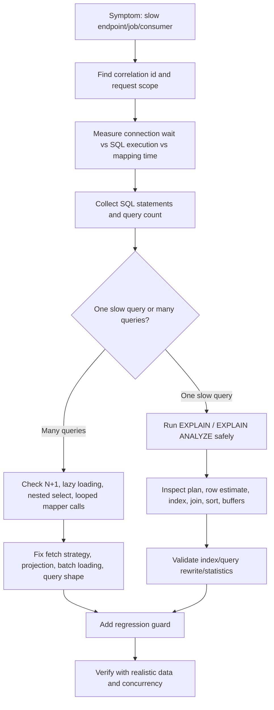

# Part 037 — Query Performance and SQL Visibility

Query performance adalah kemampuan persistence layer untuk menjawab pertanyaan sederhana:

> SQL apa yang benar-benar dijalankan, berapa kali dijalankan, berapa lama, memakai plan apa, membaca berapa banyak data, dan kenapa?

Tanpa SQL visibility, persistence layer berubah menjadi black box.

Di MyBatis, SQL biasanya terlihat karena ditulis eksplisit. Tetapi dynamic SQL, nested select, parameter expansion, dan mapper reuse tetap bisa menyembunyikan bentuk query final.

Di JPA/Hibernate, SQL sering tidak terlihat di source code karena dihasilkan dari entity graph, JPQL, Criteria API, lazy loading, dirty checking, flush timing, dan fetch strategy.

Core principle:

> Performance review persistence layer harus dimulai dari SQL nyata, bukan dari asumsi repository method name.

Dalam sistem CPQ, quote, order, catalog, entitlement, billing, workflow, dan event-driven backend, query performance sering menjadi akar masalah untuk:

- endpoint list/search lambat
- quote detail lambat karena relationship loading
- order submission timeout
- catalog lookup lambat
- pricing rule evaluation lambat
- reconciliation job terlalu lama
- event consumer lag
- connection pool exhaustion
- database CPU tinggi
- lock wait meningkat
- deployment baru memperburuk query plan

Pertanyaan senior engineer:

- SQL apa yang benar-benar dijalankan?
- Berapa kali SQL itu dijalankan per request/message/job?
- Apakah query memakai index yang diharapkan?
- Apakah row estimate planner jauh dari actual row?
- Apakah query lambat karena scan, join, sort, lock wait, network, atau application mapping?
- Apakah JPA menghasilkan SQL yang berbeda dari ekspektasi?
- Apakah MyBatis dynamic SQL menghasilkan query variant yang sulit di-cache atau sulit diprediksi?
- Apakah parameter yang dilog aman dari PII?
- Apakah perubahan query disertai regression evidence?

---

## 1. Performance Is Not Only Query Duration

Bad diagnosis:

> Endpoint lambat. Berarti query lambat. Tambah index.

Diagnosis yang lebih benar:

Endpoint latency adalah gabungan dari:

- request deserialization
- authorization/tenant resolution
- service orchestration
- transaction start
- connection acquisition
- SQL execution
- lock wait
- row fetch
- object mapping
- lazy loading tambahan
- serialization response
- network latency ke database
- retries
- cache lookup/miss
- downstream call jika ada

Query duration adalah bagian penting, tetapi bukan satu-satunya.

Namun persistence engineer tetap harus dapat menjawab:

```text
endpoint latency = connection wait + query execution + result fetch + object mapping + extra queries + serialization
```

Jika tidak bisa memecah latency, tuning akan acak.

---

## 2. SQL Visibility Sources

SQL visibility bisa berasal dari beberapa layer.

| Source | Apa yang terlihat | Risiko |
|---|---|---|
| MyBatis mapper XML | SQL template | Belum tentu bentuk final dynamic SQL |
| MyBatis logging | SQL final dan parameter | Bisa bocor PII jika tidak diatur |
| Hibernate SQL log | Generated SQL | Parameter bisa tersembunyi atau bocor tergantung config |
| Hibernate statistics | Query count, entity load, cache hit | Harus diaktifkan dan diinterpretasi |
| PostgreSQL logs | Query lambat, lock wait, error | Perlu akses dan correlation id |
| APM trace | Span database per request | Bisa kurang detail plan |
| pg_stat_statements | Aggregated query fingerprint | Parameter tidak terlihat, query normalized |
| EXPLAIN/EXPLAIN ANALYZE | Plan dan actual execution | Harus hati-hati untuk query write |

Prinsipnya:

> Source code memberitahu intention. Runtime SQL memberitahu truth.

---

## 3. MyBatis SQL Visibility

MyBatis cenderung SQL-first.

Contoh mapper method:

```java
List<QuoteSummaryRow> searchQuotes(QuoteSearchQuery query);
```

Mapper XML:

```xml
<select id="searchQuotes" resultMap="QuoteSummaryRowMap">
  SELECT
    q.id,
    q.quote_number,
    q.status,
    q.customer_id,
    q.updated_at
  FROM quote q
  WHERE q.tenant_id = #{tenantId}
    <if test="status != null">
      AND q.status = #{status}
    </if>
    <if test="customerId != null">
      AND q.customer_id = #{customerId}
    </if>
  ORDER BY q.updated_at DESC, q.id DESC
  LIMIT #{limit}
</select>
```

Visibility advantage:

- SQL dapat dibaca langsung.
- Column selection eksplisit.
- Join dan filter eksplisit.
- PostgreSQL-specific features bisa dipakai langsung.

Tetapi tetap ada visibility problem:

- `<if>` membuat banyak query shape.
- `<foreach>` untuk `IN` bisa menghasilkan query besar.
- `${sortColumn}` berbahaya jika tidak di-whitelist.
- nested select ResultMap bisa memunculkan query tambahan.
- reuse `<sql>` fragment bisa membuat final SQL sulit dibaca.
- log bisa berbeda dari XML karena parameter null/dynamic branch.

Review rule:

> Untuk MyBatis, review SQL template dan minimal satu contoh SQL final untuk branch penting.

---

## 4. JPA/Hibernate SQL Visibility

JPA/Hibernate cenderung entity-first.

Repository code:

```java
Quote quote = entityManager.find(Quote.class, quoteId);
return mapper.toResponse(quote);
```

Source code terlihat sederhana, tetapi runtime SQL dapat berupa:

```sql
select q.* from quote q where q.id = ?
```

Lalu saat serializer/mapper menyentuh relasi:

```sql
select i.* from quote_item i where i.quote_id = ?
select p.* from product p where p.id = ?
select a.* from quote_attachment a where a.quote_id = ?
```

Visibility problem:

- lazy loading terjadi jauh dari repository method
- flush bisa terjadi sebelum query
- dirty checking menghasilkan update tersembunyi
- JPQL tidak sama persis dengan SQL final
- Criteria API sulit dibaca saat kompleks
- relationship mapping memengaruhi jumlah query
- entity graph/fetch join mengubah SQL shape
- bulk update membuat persistence context stale

Review rule:

> Untuk JPA/Hibernate, review repository code tidak cukup. Harus lihat generated SQL, query count, dan entity loading path.

---

## 5. Query Count Is a First-Class Metric

Query lambat tidak selalu satu query lambat.

Sering kali endpoint lambat karena banyak query kecil:

```text
GET /quotes/{id}
  1 query load quote
  1 query load customer
  60 query load quote items
  60 query load product per item
  60 query load pricing attributes
```

Total 182 query mungkin masing-masing cepat, tetapi secara end-to-end lambat.

Query count harus dipantau pada:

- endpoint detail
- endpoint list/search
- export
- async consumer
- reconciliation job
- workflow task handler
- test integration untuk use case penting

Rule:

> Untuk use case penting, query count harus predictable.

---

## 6. EXPLAIN vs EXPLAIN ANALYZE

`EXPLAIN` menunjukkan execution plan yang diperkirakan planner.

```sql
EXPLAIN
SELECT *
FROM quote
WHERE tenant_id = 't1'
  AND status = 'APPROVED'
ORDER BY updated_at DESC
LIMIT 50;
```

`EXPLAIN ANALYZE` menjalankan query dan menunjukkan actual execution.

```sql
EXPLAIN (ANALYZE, BUFFERS)
SELECT *
FROM quote
WHERE tenant_id = 't1'
  AND status = 'APPROVED'
ORDER BY updated_at DESC
LIMIT 50;
```

Perbedaan penting:

| Tool | Menjalankan query? | Cocok untuk |
|---|---:|---|
| EXPLAIN | Tidak | Melihat estimasi plan dengan aman |
| EXPLAIN ANALYZE | Ya | Membandingkan estimasi vs actual |
| EXPLAIN ANALYZE BUFFERS | Ya | Melihat read dari memory/disk buffer |

Caution:

- Jangan sembarang menjalankan `EXPLAIN ANALYZE` untuk write query di production.
- Untuk `INSERT/UPDATE/DELETE`, `EXPLAIN ANALYZE` benar-benar menjalankan perubahan kecuali dibungkus transaksi lalu rollback.
- Untuk query mahal, `EXPLAIN ANALYZE` tetap membebani database.

Safe pattern:

```sql
BEGIN;
EXPLAIN (ANALYZE, BUFFERS)
UPDATE quote
SET status = 'EXPIRED'
WHERE expires_at < now()
  AND status = 'ACTIVE';
ROLLBACK;
```

Tetap verifikasi kebijakan internal sebelum menjalankan di environment sensitif.

---

## 7. What to Read in Query Plan

Saat membaca plan, fokus pada:

- estimated rows vs actual rows
- total execution time
- node dengan cost/time terbesar
- scan type
- join strategy
- sort operation
- filter removed rows
- buffer hit/read
- index condition vs filter condition
- loops count

Contoh red flag:

```text
Seq Scan on quote
  Filter: (status = 'APPROVED')
  Rows Removed by Filter: 5000000
```

Kemungkinan masalah:

- index tidak ada
- index tidak cocok dengan filter
- table kecil sehingga seq scan wajar
- statistics stale
- predicate tidak selective
- query memakai function/cast yang membuat index tidak terpakai

Red flag lain:

```text
Nested Loop
  loops=50000
```

Artinya inner operation dijalankan berkali-kali. Bisa wajar, bisa juga tanda join strategy buruk atau N+1 di SQL level.

---

## 8. Index Usage Is a Contract Between Query and Schema

Index bukan sekadar `CREATE INDEX`.

Index adalah kontrak antara:

- WHERE predicate
- JOIN predicate
- ORDER BY
- cardinality/selectivity
- tenant filter
- soft delete filter
- effective date filter
- pagination strategy
- update/write cost

Contoh query:

```sql
SELECT id, quote_number, status, updated_at
FROM quote
WHERE tenant_id = ?
  AND status = ?
  AND deleted_at IS NULL
ORDER BY updated_at DESC, id DESC
LIMIT 50;
```

Kemungkinan index:

```sql
CREATE INDEX idx_quote_tenant_status_active_updated
ON quote (tenant_id, status, updated_at DESC, id DESC)
WHERE deleted_at IS NULL;
```

Tetapi ini bukan rekomendasi otomatis.

Harus dicek:

- Apakah predicate umum?
- Apakah cardinality status cukup selective?
- Apakah tenant_id selalu dipakai?
- Apakah index terlalu banyak membebani write path?
- Apakah partial index cocok dengan soft delete convention?
- Apakah query lain membutuhkan urutan kolom berbeda?

Rule:

> Index harus lahir dari query pattern nyata, bukan dari semua kolom yang sering muncul.

---

## 9. Common Reasons Index Is Not Used

Index ada, tetapi query tetap lambat.

Kemungkinan penyebab:

### 9.1 Function on Column

```sql
WHERE lower(customer_name) = lower(?)
```

Index biasa pada `customer_name` tidak cukup. Perlu expression index jika memang pattern ini valid.

### 9.2 Type Cast Mismatch

```sql
WHERE customer_id::text = ?
```

Cast pada column dapat menghambat index usage.

### 9.3 Leading Wildcard LIKE

```sql
WHERE quote_number LIKE '%ABC%'
```

B-tree index biasa biasanya tidak membantu banyak.

### 9.4 OR Predicate Too Broad

```sql
WHERE status = ? OR customer_id = ?
```

Planner bisa memilih seq scan jika selectivity buruk.

### 9.5 Low Selectivity Column

```sql
WHERE active = true
```

Jika hampir semua row `active = true`, index mungkin tidak berguna.

### 9.6 Stale Statistics

Planner bergantung pada statistics. Jika statistics tidak akurat, plan bisa buruk.

### 9.7 Dynamic SQL Shape Explosion

Terlalu banyak kombinasi filter membuat sulit memastikan index optimal untuk semua variant.

---

## 10. Join Strategy Awareness

PostgreSQL dapat memilih beberapa strategi join.

| Join strategy | Mental model | Risk |
|---|---|---|
| Nested loop | Untuk setiap row outer, cari row inner | Buruk jika outer besar dan inner mahal |
| Hash join | Build hash table lalu probe | Butuh memory, bisa spill |
| Merge join | Join dua input sorted | Butuh sort/index order |

Persistence engineer tidak harus menjadi DBA, tetapi harus bisa melihat:

- join mana yang dominan
- apakah row estimate salah
- apakah join menyebabkan row explosion
- apakah filter diterapkan terlalu lambat
- apakah query mengambil column terlalu banyak
- apakah relationship mapping JPA memaksa join besar

JPA fetch join contoh:

```java
SELECT q
FROM Quote q
LEFT JOIN FETCH q.items
WHERE q.id = :id
```

Jika ditambah banyak collection fetch sekaligus, result set bisa meledak karena cartesian multiplication.

MyBatis nested result juga bisa mengalami hal sama jika join terlalu lebar.

---

## 11. Query Plan Is Data-Dependent

Query yang cepat di local bisa lambat di production karena:

- data volume berbeda
- tenant tertentu jauh lebih besar
- distribution status berbeda
- statistics berbeda
- index berbeda
- parameter tertentu sangat tidak selective
- cache/buffer state berbeda
- cloud network latency berbeda
- concurrent load berbeda

Bad benchmark:

```text
Di local cuma 20 ms.
```

Better benchmark:

```text
Dengan dataset mendekati production, tenant besar, filter umum, cold-ish cache, dan concurrency realistis, p95 query duration sekian ms.
```

---

## 12. Hibernate Generated SQL Review

Untuk JPA/Hibernate, review harus menjawab:

- Berapa SQL untuk satu service method?
- Apakah ada select tambahan karena lazy loading?
- Apakah ada update karena dirty checking?
- Apakah flush terjadi sebelum query?
- Apakah query memakai join yang wajar?
- Apakah pagination dilakukan di SQL atau memory?
- Apakah fetch join dengan pagination aman?
- Apakah entity graph menghasilkan query terlalu lebar?

Contoh risky code:

```java
@Transactional
public QuoteResponse getQuote(UUID id) {
    Quote quote = quoteRepository.getById(id);
    return quoteMapper.toResponse(quote);
}
```

Jika `toResponse` menyentuh:

```java
quote.getItems()
quote.getCustomer()
quote.getItems().get(i).getProduct()
```

SQL muncul dari mapper, bukan dari repository.

Review harus memasukkan mapping layer.

---

## 13. MyBatis SQL Review

Untuk MyBatis, review harus menjawab:

- Apakah query memilih column yang benar-benar dibutuhkan?
- Apakah WHERE clause tenant/security/soft-delete/effective-date lengkap?
- Apakah dynamic sorting aman?
- Apakah pagination stable?
- Apakah join cardinality dipahami?
- Apakah ResultMap nested select memicu N+1?
- Apakah dynamic SQL terlalu banyak branch?
- Apakah parameter binding aman?
- Apakah query punya index support?
- Apakah query mudah di-EXPLAIN?

Contoh red flag:

```xml
ORDER BY ${sortBy} ${sortDirection}
```

Aman hanya jika `sortBy` dan `sortDirection` berasal dari whitelist internal, bukan input mentah API.

---

## 14. Safe SQL Logging

SQL logging penting untuk debugging, tetapi berbahaya jika bocor data sensitif.

Risiko logging:

- PII di parameter
- token/session/user identifier sensitif
- quote/order/customer data sensitif
- credential atau secret tidak sengaja masuk query
- log volume tinggi
- production CPU/I/O overhead
- compliance issue

Better approach:

- log query fingerprint
- log duration
- log row count jika aman
- log endpoint/use case/correlation id
- redact parameter sensitif
- sample query log untuk production
- gunakan slow query threshold
- bedakan dev/test logging dan production logging

Bad log:

```text
SELECT * FROM customer WHERE email = 'alice@example.com' AND national_id = '...'
```

Better log:

```text
sqlFingerprint=customer_lookup_by_email durationMs=84 rows=1 correlationId=... endpoint=GET /customers/{id}
```

---

## 15. Parameter Logging and PII Redaction

Parameter penting untuk reproduksi plan.

Tetapi parameter bisa sensitif.

Guideline:

- Jangan log raw PII secara default.
- Jangan log payload besar JSONB secara default.
- Jangan log full search keyword jika bisa mengandung PII.
- Gunakan allowlist field aman.
- Gunakan hashing untuk correlation jika perlu.
- Simpan full parameter hanya di secure diagnostic channel jika policy mengizinkan.

Internal verification required:

- Apakah logging framework sudah melakukan redaction?
- Apakah SQL parameter logging aktif di production?
- Apakah Hibernate bind parameter logging dimatikan atau direduksi?
- Apakah MyBatis logging mencetak parameter sensitif?
- Apakah APM menangkap DB statement dengan value parameter?

---

## 16. Query Regression Testing

Query performance bisa regress walau test functional tetap hijau.

Regression source:

- menambah join
- mengubah filter optional
- mengganti pagination
- menambah relationship mapping eager
- menghapus index
- mengubah type column
- mengubah entity graph
- menambah field response yang memicu lazy loading
- data volume bertambah
- migration mengubah statistics/index

Test yang bisa membantu:

- query count assertion
- integration test dengan dataset representatif kecil
- EXPLAIN snapshot untuk query kritikal
- performance smoke test
- benchmark job untuk mapper/repository kritikal
- slow query threshold di staging

Caution:

> Jangan membuat test rapuh yang mengunci semua plan detail. Fokus pada invariant penting: query count, index expectation, no full scan untuk table besar, dan p95/p99 threshold pada environment yang relevan.

---

## 17. Query Performance Debugging Workflow

Gunakan workflow ini saat endpoint/job lambat.



---

## 18. Java/JAX-RS Backend Impact

Persistence performance affects JAX-RS services in several ways:

- request thread blocked while waiting for database
- connection pool wait increases endpoint latency
- large result mapping increases heap allocation
- lazy loading during response mapping creates hidden database access
- transaction stays open longer than expected
- timeout from DB maps to HTTP 500/503/504 depending handling
- serialization can trigger lazy proxy access if entity leaks to API
- streaming response can hold DB connection until client finishes reading

Rule:

> Do not return JPA entities directly from JAX-RS resource methods.

Reason:

- lazy loading may occur during serialization
- entity fields may expose persistence internals
- transaction may already be closed
- security/PII filtering may be bypassed
- response shape becomes coupled to schema/entity mapping

---

## 19. Transaction Boundary Impact

Query performance is transaction-sensitive.

Long queries can:

- keep connection occupied
- keep transaction open
- hold row/table locks for write queries
- maintain MVCC snapshot longer
- delay vacuum cleanup in some patterns
- increase chance of timeout
- increase deadlock window if locks are acquired
- slow event consumers or workflow workers

Read query does not automatically mean no transaction impact.

Questions:

- Is this query inside a write transaction?
- Is it executed after entity mutation that can trigger flush?
- Does it require repeatable view of data?
- Is statement timeout configured?
- Is lock timeout configured?
- Is transaction timeout configured?
- Does query hold cursor/stream open?

---

## 20. Microservices and Event-Driven Impact

In microservices/event-driven systems, slow queries appear as:

- API latency
- consumer lag
- outbox publisher lag
- inbox dedup lookup latency
- saga step timeout
- read model rebuild delay
- reconciliation job overrun
- workflow task backlog

A slow query in one service can become systemic if:

- it consumes shared DB resources
- it blocks event publication
- it delays order/quote lifecycle progression
- it causes retry storm
- it exhausts connection pool across replicas
- it creates lock contention with write path

Rule:

> Query performance review must include async paths, not only HTTP endpoints.

---

## 21. Kubernetes, Cloud, and On-Prem Impact

Deployment topology changes performance.

Kubernetes/cloud concerns:

- every pod has its own connection pool
- autoscaling can amplify DB load
- rolling deploy can create connection storm
- network latency to managed PostgreSQL matters
- cloud DB IOPS/CPU/memory limits matter
- noisy neighbor/resource throttling can affect p99
- DNS/private endpoint issues can look like DB latency
- on-prem network and firewall behavior may differ

Do not tune query using only local latency.

Use environment-aware signals:

- DB CPU
- DB I/O
- connection count
- pool wait
- network latency
- p95/p99 query duration
- lock wait
- rows read vs rows returned

---

## 22. Common Failure Modes

### Failure Mode 1: Hidden N+1

Symptom:

- endpoint latency grows with item count
- query count grows linearly
- database CPU moderate but request slow

Cause:

- lazy loading in response mapper
- MyBatis nested select
- looped repository calls

Detection:

- query count per request
- SQL logs with correlation id
- integration test query assertion

Fix:

- fetch join/entity graph
- DTO projection
- batch fetch
- single explicit SQL query

### Failure Mode 2: Index Not Matching Query

Symptom:

- query scans too many rows
- slow only for large tenants
- production slow, local fast

Cause:

- missing composite/partial index
- wrong column order
- predicate not selective
- function/cast on column

Detection:

- EXPLAIN ANALYZE BUFFERS
- pg_stat_statements
- row estimate vs actual

Fix:

- query rewrite
- index redesign
- statistics update
- pagination/filter change

### Failure Mode 3: Dynamic SQL Branch Regression

Symptom:

- only certain filter combination is slow
- common case fast
- support report tied to specific search form

Cause:

- optional filter creates unindexed query shape
- dynamic sort prevents index usage
- OR predicate too broad

Detection:

- capture final SQL and parameter class
- test major filter combinations
- plan per branch

Fix:

- split query paths
- whitelist indexed sort/filter combinations
- create targeted indexes
- limit unsupported broad searches

### Failure Mode 4: Hibernate Flush Before Query

Symptom:

- SELECT unexpectedly slow
- UPDATE appears before SELECT
- lock wait before read query

Cause:

- dirty managed entity flushed before JPQL/native query

Detection:

- Hibernate SQL log
- flush event log/statistics
- transaction trace

Fix:

- separate read/write transaction
- explicit flush timing
- avoid accidental managed mutation
- adjust flush mode only with clear understanding

### Failure Mode 5: Slow Query Causes Pool Exhaustion

Symptom:

- many requests waiting for connection
- DB query count not high, but pool saturated
- p99 latency spikes

Cause:

- long-running query holds connections
- streaming endpoint holds cursor
- batch job uses too many concurrent connections

Detection:

- pool active/idle/wait metrics
- query duration histogram
- thread dump

Fix:

- query tuning
- reduce concurrency
- isolate batch pool if architecture allows
- enforce timeout
- chunk work

---

## 23. Performance Review Checklist

Use this checklist for PRs that add/change query behavior.

### Query Shape

- [ ] SQL final is known or easy to derive.
- [ ] Selected columns are minimal.
- [ ] WHERE clause includes tenant/security/soft-delete/effective-date filters where required.
- [ ] ORDER BY is stable.
- [ ] Pagination is database-level, not memory-level.
- [ ] Dynamic SQL branches are reviewed.

### Index and Plan

- [ ] Query has expected index support.
- [ ] EXPLAIN evidence exists for critical/high-volume query.
- [ ] Large tenant/high-volume case is considered.
- [ ] Count query cost is considered.
- [ ] Join cardinality is understood.
- [ ] Sort/hash memory risk is considered.

### MyBatis

- [ ] Dynamic sorting uses whitelist.
- [ ] `${}` is avoided unless strictly controlled.
- [ ] Nested select N+1 risk is reviewed.
- [ ] ResultMap does not over-fetch.
- [ ] PostgreSQL-specific SQL has integration tests.

### JPA/Hibernate

- [ ] Generated SQL is reviewed.
- [ ] Query count is predictable.
- [ ] Lazy loading outside repository is considered.
- [ ] Entity graph/fetch join is intentional.
- [ ] Bulk operation stale context risk is handled.
- [ ] Flush-before-query risk is considered.

### Observability

- [ ] Query can be correlated to endpoint/message/job.
- [ ] Slow query is visible in logs/APM/metrics.
- [ ] Parameter logging is redacted.
- [ ] Query count/duration can be measured.
- [ ] Regression guard exists for critical path.

---

## 24. Internal Verification Checklist

Because CSG/team-specific implementation details are not available here, verify these internally.

### Codebase

- [ ] Where are MyBatis mapper XML files located?
- [ ] Where are JPA repositories/entities located?
- [ ] Is SQL logging enabled in local, test, staging, or production?
- [ ] Is Hibernate generated SQL visible during integration tests?
- [ ] Is MyBatis final SQL visible during integration tests?
- [ ] Are query count assertions used anywhere?
- [ ] Are DTO projections preferred for list endpoints?

### Database

- [ ] Is `pg_stat_statements` enabled?
- [ ] Are slow query logs enabled?
- [ ] What is the slow query threshold?
- [ ] Who can run EXPLAIN/EXPLAIN ANALYZE in non-prod/prod?
- [ ] How are query plans captured during incidents?
- [ ] Are index changes reviewed by DBA/platform/backend leads?
- [ ] Are statistics/vacuum issues monitored?

### Observability

- [ ] Can an HTTP request be correlated to DB queries?
- [ ] Can Kafka/RabbitMQ consumer work be correlated to DB queries?
- [ ] Are connection pool metrics available per pod?
- [ ] Are query duration percentiles available?
- [ ] Are lock waits/deadlocks visible?
- [ ] Are DB errors mapped to service traces?
- [ ] Is PII redaction verified for SQL logs/APM?

### Process

- [ ] Does PR template ask for query/index/migration impact?
- [ ] Does migration review include query regression risk?
- [ ] Are performance-sensitive queries documented?
- [ ] Are known slow queries tracked in backlog?
- [ ] Are incident notes searchable by query/table/endpoint?
- [ ] Is there a DBA/platform escalation path?

---

## 25. Senior Engineer Heuristics

Use these heuristics during design and review:

1. A repository method name is not evidence of performance.
2. A fast local query is not production evidence.
3. A missing index is not always the problem.
4. An index can improve reads and degrade writes.
5. A list endpoint needs stable ordering before pagination.
6. A JPA entity graph can fix N+1 and create row explosion.
7. A MyBatis nested select can look clean and behave like N+1.
8. Dynamic SQL increases test matrix.
9. Query count matters as much as single-query latency.
10. SQL logging without redaction is an incident waiting to happen.
11. Every performance optimization should name the failure mode it prevents.
12. Every critical query should be observable, explainable, and regression-guarded.

---

## 26. Summary

Query performance is not guesswork.

A senior persistence engineer must be able to move from:

```text
Endpoint is slow.
```

to:

```text
This endpoint executes 43 SQL statements.
Most latency comes from 40 lazy-loaded product lookups.
The main search query is 80 ms, but total DB time is 900 ms.
The fix is DTO projection or batch fetch, plus a query count test.
```

Or:

```text
This MyBatis dynamic search is slow only when status is null and sort is created_at.
That branch scans 8M active rows because no index matches tenant_id + deleted_at + created_at.
We need either restrict sort/filter combination or add a targeted partial index after DBA review.
```

The mastery target:

> Make SQL behavior visible before production, measurable in production, and reviewable in every persistence-related PR.
