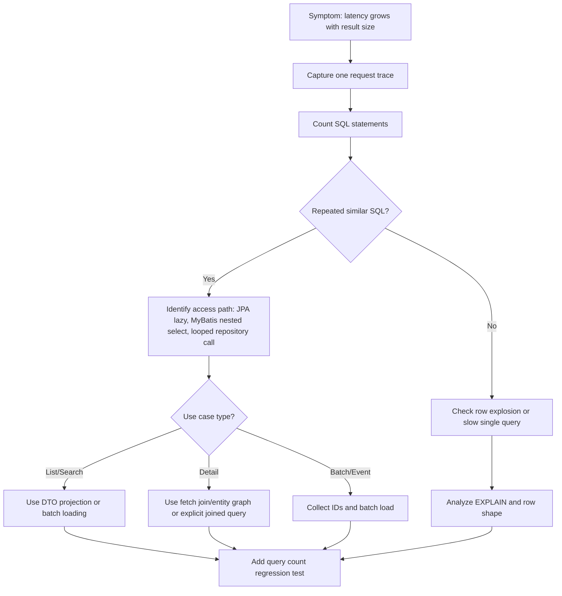

# Part 038 — N+1 and Relationship Loading

N+1 adalah salah satu bug performance paling umum di persistence layer.

Definisi sederhana:

> N+1 terjadi saat aplikasi menjalankan 1 query utama untuk mengambil N row, lalu menjalankan query tambahan per row atau per relationship.

Contoh:

```text
1 query  : load 50 quotes
50 query : load customer for each quote
50 query : load items for each quote
50 query : load product for each item group
```

Total bisa menjadi 151 query hanya untuk satu endpoint list.

N+1 sering tidak terlihat di code review karena source code terlihat bersih:

```java
List<Quote> quotes = quoteRepository.findRecentQuotes();
return quotes.stream()
    .map(quoteMapper::toResponse)
    .toList();
```

Masalahnya bisa tersembunyi di:

- JPA lazy loading
- JPA eager relationship yang terlalu agresif
- Hibernate proxy initialization
- response mapper yang menyentuh relationship
- serializer yang mengakses getter entity
- MyBatis nested select
- loop yang memanggil repository/mapper per item
- resolver/enricher yang melakukan lookup per row

Core principle:

> Relationship loading strategy harus dirancang berdasarkan use case response shape, bukan berdasarkan kenyamanan entity mapping.

---

## 1. Why N+1 Is Dangerous

N+1 berbahaya karena latency bertumbuh mengikuti jumlah data.

Jika endpoint mengambil 10 quote, mungkin masih aman.

Jika mengambil 100 quote, query count dan latency melonjak.

Jika tenant besar atau filter broad, production bisa timeout.

Masalah utama:

- query count tidak predictable
- database round trip meningkat
- connection dipakai lebih lama
- transaction bertahan lebih lama
- CPU database naik karena banyak query kecil
- application CPU naik karena mapping banyak object
- p95/p99 latency memburuk
- event consumer throughput turun
- connection pool exhaustion bisa terjadi

N+1 adalah performance bug yang sering lolos functional test karena hasil datanya benar.

---

## 2. N+1 Is Not Only JPA Problem

Banyak engineer mengira N+1 hanya masalah Hibernate.

Salah.

N+1 adalah pola akses data, bukan bug framework tertentu.

N+1 bisa terjadi di:

- JPA lazy loading
- JPA eager loading yang memicu query tambahan
- MyBatis nested select
- raw JDBC loop query
- repository call dalam loop
- cache miss per row
- enrichment service call per row
- GraphQL/DataLoader tanpa batching
- event processor yang lookup reference data per message

Framework hanya menentukan bagaimana N+1 muncul dan bagaimana memperbaikinya.

---

## 3. JPA/Hibernate Lazy Loading N+1

Entity:

```java
@Entity
public class Quote {
    @Id
    private UUID id;

    @ManyToOne(fetch = FetchType.LAZY)
    private Customer customer;

    @OneToMany(mappedBy = "quote", fetch = FetchType.LAZY)
    private List<QuoteItem> items;
}
```

Repository:

```java
List<Quote> quotes = entityManager
    .createQuery("select q from Quote q where q.status = :status", Quote.class)
    .setParameter("status", QuoteStatus.APPROVED)
    .setMaxResults(50)
    .getResultList();
```

Mapper:

```java
QuoteListRow toRow(Quote quote) {
    return new QuoteListRow(
        quote.getId(),
        quote.getCustomer().getName(),
        quote.getItems().size()
    );
}
```

Runtime behavior:

```text
1 query  : select quotes
50 query : select customer per quote
50 query : select items per quote
```

The source of N+1 is not the repository alone. It is the combination of:

- query shape
- entity mapping
- persistence context
- mapper access pattern
- transaction scope

---

## 4. Eager Loading Is Not a Universal Fix

Bad fix:

```java
@ManyToOne(fetch = FetchType.EAGER)
private Customer customer;
```

Why bad?

Because eager loading changes the default loading behavior for every use case.

It may improve one endpoint but harm others.

Risks:

- over-fetching data
- larger result set
- hidden joins
- more memory usage
- circular loading surprises
- relationship loaded even when not needed
- difficult to reason per use case

Rule:

> Do not fix a use-case-specific N+1 by making the entity globally eager unless the relationship is truly always required and cheap.

Prefer use-case-specific fetch strategy.

---

## 5. Fetch Join

Fetch join loads relationship in the same query.

Example:

```java
select q
from Quote q
join fetch q.customer
where q.status = :status
```

Benefits:

- avoids lazy query per quote
- relationship initialized with main query
- readable in JPQL

Risks:

- result set can become large
- duplicate parent rows if fetching collection
- pagination with collection fetch join can be dangerous
- multiple collection fetch joins can cause cartesian explosion
- query becomes harder to tune

Good use case:

- load one aggregate detail with limited relationships
- load list with one many-to-one relationship
- load known small collection

Risky use case:

- list 100 parent rows and fetch multiple collections
- paginated query with collection fetch
- fetch join across deep object graph

---

## 6. Entity Graph

Entity graph lets you define fetch plan for a use case.

Example concept:

```java
@EntityGraph(attributePaths = {"customer", "items"})
List<Quote> findByStatus(QuoteStatus status);
```

Benefits:

- separates fetch plan from default entity mapping
- can be reused for specific query use cases
- avoids globally eager relationship

Risks:

- generated SQL still must be inspected
- may fetch too much if graph is broad
- can interact with pagination badly
- nested graph can create complex SQL/query count

Rule:

> Entity graph is a fetch plan, not a performance guarantee.

Always check generated SQL and query count.

---

## 7. Batch Fetching

Hibernate batch fetching loads lazy relationships in batches instead of one by one.

Without batch fetching:

```text
select items where quote_id = ?
select items where quote_id = ?
select items where quote_id = ?
...
```

With batch fetching:

```sql
select *
from quote_item
where quote_id in (?, ?, ?, ?, ?, ?, ?, ?, ?, ?);
```

Benefits:

- reduces query count
- useful when lazy loading is unavoidable
- less invasive than fetch join

Risks:

- still not as explicit as DTO query
- `IN` list size must be reasonable
- may load relationships not all needed
- can hide access pattern problem

Use batch fetching when:

- relationships are accessed for many loaded entities
- relationship cardinality is moderate
- fetch join would create row explosion
- DTO projection is not appropriate

---

## 8. Subselect Fetching

Subselect fetching can load collection relationships using the parent query as basis.

Conceptually:

```sql
select *
from quote_item
where quote_id in (
  select id
  from quote
  where status = ?
  limit 50
);
```

Benefits:

- reduces N+1 for collections
- can be useful for batch loading child rows

Risks:

- generated SQL must be inspected
- may be sensitive to parent query complexity
- not always ideal for pagination/filter combinations

Use carefully and verify with query plans.

---

## 9. DTO Projection as N+1 Prevention

For list/search endpoints, DTO projection is often better than entity loading.

JPA projection example:

```java
select new com.example.QuoteListRow(
    q.id,
    q.quoteNumber,
    c.name,
    q.status,
    q.updatedAt
)
from Quote q
join q.customer c
where q.tenantId = :tenantId
order by q.updatedAt desc
```

MyBatis projection example:

```sql
SELECT
  q.id,
  q.quote_number,
  c.name AS customer_name,
  q.status,
  q.updated_at
FROM quote q
JOIN customer c ON c.id = q.customer_id
WHERE q.tenant_id = #{tenantId}
ORDER BY q.updated_at DESC, q.id DESC
LIMIT #{limit}
```

Benefits:

- exact column shape
- no lazy loading
- stable query count
- easier EXPLAIN
- better API/persistence separation

Risks:

- duplicate mapping if overused carelessly
- query-specific DTO proliferation
- may bypass domain invariants if used for command path

Rule:

> For read/list/search/reporting use cases, projection is often the most predictable loading strategy.

---

## 10. MyBatis Nested Select N+1

MyBatis can express nested relationships with nested select.

Example:

```xml
<resultMap id="QuoteMap" type="QuoteDto">
  <id property="id" column="id"/>
  <result property="quoteNumber" column="quote_number"/>
  <collection property="items"
              column="id"
              select="selectItemsByQuoteId"/>
</resultMap>
```

Main query:

```xml
<select id="selectQuotes" resultMap="QuoteMap">
  SELECT id, quote_number
  FROM quote
  WHERE status = #{status}
</select>
```

Nested query:

```xml
<select id="selectItemsByQuoteId" resultType="QuoteItemDto">
  SELECT id, quote_id, product_id, quantity
  FROM quote_item
  WHERE quote_id = #{quoteId}
</select>
```

Runtime:

```text
1 query for quotes
N queries for items
```

This is N+1.

Nested select can be acceptable for:

- loading one parent detail
- very small N
- explicit lazy-style loading
- admin/debug path with low volume

It is risky for:

- list endpoint
- export
- reporting
- event batch processing
- high-volume consumer

---

## 11. MyBatis Nested Result

Alternative: join parent and child in one query.

```xml
<resultMap id="QuoteWithItemsMap" type="QuoteDto">
  <id property="id" column="quote_id"/>
  <result property="quoteNumber" column="quote_number"/>
  <collection property="items" ofType="QuoteItemDto">
    <id property="id" column="item_id"/>
    <result property="productId" column="product_id"/>
    <result property="quantity" column="quantity"/>
  </collection>
</resultMap>
```

SQL:

```sql
SELECT
  q.id AS quote_id,
  q.quote_number,
  i.id AS item_id,
  i.product_id,
  i.quantity
FROM quote q
LEFT JOIN quote_item i ON i.quote_id = q.id
WHERE q.id = #{quoteId}
```

Benefits:

- avoids per-parent query
- SQL visible
- can be efficient for one parent detail

Risks:

- duplicate parent row in result set
- row explosion for multiple collections
- pagination of parent rows becomes difficult
- mapping requires careful column aliases

Rule:

> Nested result is good when one joined result set represents the intended response shape. It is risky when it creates wide cartesian data.

---

## 12. Repository Calls in Loop

N+1 can be framework-independent.

Bad pattern:

```java
List<QuoteSummary> summaries = new ArrayList<>();
for (QuoteId id : quoteIds) {
    Quote quote = quoteRepository.findById(id);
    Customer customer = customerRepository.findById(quote.customerId());
    summaries.add(toSummary(quote, customer));
}
```

Better pattern:

```java
List<Quote> quotes = quoteRepository.findByIds(quoteIds);
Map<CustomerId, Customer> customers = customerRepository.findByIds(customerIds);
```

Or direct projection query if read-only:

```sql
SELECT q.id, q.quote_number, c.name
FROM quote q
JOIN customer c ON c.id = q.customer_id
WHERE q.id = ANY (?);
```

Review smell:

- repository/mapper call inside loop
- service call inside stream map
- enrichment per row
- cache lookup per row without batch API

---

## 13. Query Count Assertion

Functional test proves result correctness.

Query count test proves loading strategy.

Example intention:

```text
When loading quote list with 50 rows,
query count should stay <= 2,
not grow with number of quotes.
```

Possible approaches:

- Hibernate statistics in integration test
- datasource proxy/query counter
- log-based assertion in test harness
- APM span count in performance tests
- repository-specific test around expected query shape

Avoid brittle tests that assert every SQL string exactly unless necessary.

Better invariants:

- query count does not grow linearly with N
- no select per parent row
- no lazy loading during serialization
- no unexpected update/flush
- list endpoint does not fetch collection unless required

---

## 14. Relationship Loading Strategy Matrix

| Use case | Preferred strategy | Why |
|---|---|---|
| List/search page | DTO projection | Stable columns and query count |
| Detail page, one aggregate | Fetch join/entity graph or explicit MyBatis join | Load intended graph in controlled way |
| Reporting/export | MyBatis/SQL projection or streaming query | SQL visibility and performance control |
| Command update aggregate | JPA aggregate load or explicit MyBatis command query | Preserve invariants and locking |
| Reference data enrichment | Batch load/cache with tenant-safe key | Avoid lookup per row |
| Event consumer batch | Batch query by IDs | Avoid per-message DB round trip |
| Complex collection tree | Multiple explicit queries assembled in application | Avoid cartesian explosion |

No strategy is always best.

The question is:

> What shape does this use case need, and what is the most predictable way to load exactly that shape?

---

## 15. JPA Relationship Loading Review

Review these points:

- Are entities returned directly to API serialization?
- Are lazy relationships touched in mapper?
- Are there `FetchType.EAGER` relationships by default?
- Is fetch join used with pagination?
- Are multiple collections fetch-joined?
- Is entity graph scoped to use case?
- Is batch fetching configured intentionally?
- Is query count known?
- Is persistence context size bounded?
- Are detached entities causing lazy initialization errors?

Bad smell:

```java
return quoteRepository.findAll().stream()
    .map(quote -> new QuoteResponse(
        quote.getCustomer().getName(),
        quote.getItems().stream().map(...).toList()
    ))
    .toList();
```

This code hides database access inside mapping.

---

## 16. MyBatis Relationship Loading Review

Review these points:

- Does ResultMap use nested select?
- Is nested select used on list endpoint?
- Does nested result join too many collections?
- Are column aliases unambiguous?
- Is parent deduplication correct?
- Are child collections expected to be small?
- Is pagination applied before or after join?
- Does query select unnecessary columns?
- Is tenant/security/soft-delete filter applied to joined tables?
- Is JSONB/array mapping doing heavy transformation per row?

Bad smell:

```xml
<collection property="items" column="id" select="selectItems"/>
```

inside a mapper used by a search/list API.

---

## 17. Pagination and N+1

Pagination makes relationship loading harder.

Bad pattern:

```sql
SELECT q.*, i.*
FROM quote q
LEFT JOIN quote_item i ON i.quote_id = q.id
ORDER BY q.updated_at DESC
LIMIT 50;
```

This limits joined rows, not necessarily 50 parent quotes.

Safer pattern:

1. Page parent IDs first.
2. Load child rows for those IDs.
3. Assemble result.

Example:

```sql
SELECT q.id
FROM quote q
WHERE q.tenant_id = ?
ORDER BY q.updated_at DESC, q.id DESC
LIMIT 50;
```

Then:

```sql
SELECT *
FROM quote_item
WHERE quote_id = ANY (?);
```

This avoids both N+1 and parent pagination distortion.

---

## 18. Row Explosion vs Query Explosion

There are two opposite failure modes.

### Query Explosion

Many small queries:

```text
1 + N + N*M queries
```

Typical cause:

- lazy loading
- nested select
- looped repository calls

### Row Explosion

One huge joined query:

```text
quote x items x discounts x attachments x attributes
```

Typical cause:

- multiple collection fetch joins
- wide MyBatis nested result
- over-eager DTO query

Both are bad.

Goal:

> Use a small, predictable number of queries with controlled row shape.

Often best solution is 2-4 explicit queries assembled by application code.

---

## 19. LazyInitializationException Is a Symptom

In Hibernate, `LazyInitializationException` often appears when lazy relationship is accessed outside persistence context.

Bad fix:

- Open Session in View as blanket solution
- make relationship eager
- return entity directly to API

Better fix:

- define response shape explicitly
- load needed data inside transaction
- use DTO projection
- use use-case-specific fetch join/entity graph
- keep serialization detached from persistence access

Rule:

> LazyInitializationException is not only an error to suppress. It reveals unclear loading boundary.

---

## 20. Transaction Boundary and N+1

N+1 inside transaction means:

- transaction stays open longer
- connection held longer
- persistence context grows
- lock window may increase if writes are involved
- timeout risk rises

N+1 outside transaction means:

- lazy loading may fail
- additional queries may run without intended consistency boundary if framework allows
- response serialization can become database access layer

Review question:

> At what layer is relationship loading allowed to happen?

Recommended stance:

- repository/application service decides loading shape
- mapper converts already-loaded data
- serializer does not trigger DB access
- transaction closes after required data is loaded

---

## 21. PostgreSQL Impact

N+1 stresses PostgreSQL through repeated round trips.

Even if each query uses an index:

```sql
SELECT * FROM quote_item WHERE quote_id = ?;
```

running it 500 times can be worse than one batch query.

PostgreSQL concerns:

- many index lookups
- repeated parse/bind/execute overhead
- network round trips
- plan cache behavior
- CPU overhead
- buffer churn
- lock wait repeated many times
- connection held longer

Better:

```sql
SELECT *
FROM quote_item
WHERE quote_id = ANY (?);
```

or controlled join/projection.

---

## 22. Microservices and Event-Driven Impact

N+1 is not only HTTP problem.

Event consumer example:

```java
for (OrderEvent event : batch) {
    Customer customer = customerRepository.findById(event.customerId());
    Product product = productRepository.findById(event.productId());
    process(event, customer, product);
}
```

If batch size is 500, this can be 1000 lookup queries.

Better:

- collect IDs
- batch load reference data
- use local cache carefully
- precompute read model
- use inbox/outbox table join if appropriate

Workflow/task handler example:

- Camunda worker loads process context
- then loads quote
- then loads customer
- then loads items one by one

N+1 can reduce workflow throughput and create backlog.

---

## 23. Kubernetes and Cloud Impact

N+1 gets worse under scale-out.

If one request executes 100 queries:

```text
100 requests/sec = 10,000 queries/sec
```

If autoscaling adds pods, total query pressure increases.

Cloud network latency amplifies many small query round trips.

On-prem deployment may have different latency and DB topology.

Connection pool symptoms:

- active connections high
- wait time rises
- p99 endpoint latency spikes
- database CPU moderate but app threads blocked

Fixing N+1 often reduces:

- query count
- network round trips
- connection occupancy time
- p99 latency
- DB CPU overhead

---

## 24. Security and Privacy Concerns

Relationship loading must preserve security filters.

Risks:

- JPA relationship loads child rows without tenant filter expectation
- MyBatis nested select forgets tenant_id
- joined query includes soft-deleted child rows
- projection exposes sensitive child field
- eager loading fetches data not needed by role
- serialization leaks related entity fields

Checklist:

- tenant condition applied to parent and child where required
- soft-delete condition applied consistently
- role/permission filter applied before loading sensitive relationship
- DTO only exposes allowed fields
- lazy serialization not allowed to reveal hidden data

---

## 25. Observability for N+1

Signals:

- query count per request/message
- repeated identical SQL with different bind values
- high DB span count in APM
- endpoint latency proportional to result size
- connection active duration high
- Hibernate entity/collection fetch count
- MyBatis repeated nested select log pattern

Useful dashboards:

- top endpoints by DB query count
- top endpoints by DB time
- query count p95/p99
- repeated query fingerprints per trace
- connection pool active/wait
- event consumer DB query count per batch

---

## 26. N+1 Debugging Workflow



---

## 27. PR Review Checklist

### General

- [ ] Query count is known for the use case.
- [ ] Query count does not grow linearly with number of parent rows unless intentionally bounded.
- [ ] Repository/mapper calls are not inside unbounded loops.
- [ ] Response mapper does not trigger hidden database access.
- [ ] Serializer does not receive live JPA entities.
- [ ] Relationship loading matches response shape.

### JPA/Hibernate

- [ ] Lazy relationships touched by mapper are intentionally loaded.
- [ ] EAGER mapping is justified and not used as broad N+1 fix.
- [ ] Fetch join is not misused with pagination/large collections.
- [ ] Entity graph is scoped to use case.
- [ ] Batch fetching is configured/tested if used.
- [ ] Generated SQL and query count are reviewed.
- [ ] Persistence context size is bounded.

### MyBatis

- [ ] Nested select is not used for high-volume list/search path.
- [ ] Nested result does not create row explosion.
- [ ] Parent pagination is not broken by child join.
- [ ] Column aliases are explicit.
- [ ] Child queries include tenant/security/soft-delete filters where required.
- [ ] Batch loading by IDs is used where appropriate.

### Testing

- [ ] Integration test covers realistic N.
- [ ] Query count assertion exists for critical endpoint/job.
- [ ] Test catches lazy loading during mapping/serialization.
- [ ] Test covers high-cardinality parent/child case.
- [ ] Performance smoke test exists for critical list/detail/export path.

---

## 28. Internal Verification Checklist

Because CSG/team-specific implementation details are not available here, verify these internally.

### JPA/Hibernate

- [ ] Are JPA entities ever returned from JAX-RS resources?
- [ ] Are `FetchType.EAGER` mappings allowed by team convention?
- [ ] Are entity graphs used? Where?
- [ ] Is batch fetching configured globally or per relationship?
- [ ] Are Hibernate statistics available in tests/staging?
- [ ] Are query count tests used for endpoints?
- [ ] Are lazy loading failures seen in incident notes?

### MyBatis

- [ ] Which ResultMaps use nested select?
- [ ] Are nested selects used by list/search endpoints?
- [ ] Are there mapper methods called inside loops?
- [ ] Are large joined ResultMaps used for multiple collections?
- [ ] Is parent pagination done before child loading?
- [ ] Are tenant/soft-delete filters included in nested child queries?
- [ ] Are mapper integration tests checking query count or SQL shape?

### API and Service Layer

- [ ] Do response mappers trigger relationship loading?
- [ ] Is DTO projection used for list endpoints?
- [ ] Are detail endpoints loading bounded graph intentionally?
- [ ] Are export/report queries separate from command repositories?
- [ ] Are batch/event consumers doing per-message lookups?
- [ ] Are reference data lookups batched or cached safely?

### Observability and Incidents

- [ ] Can APM show DB span count per endpoint?
- [ ] Can repeated SQL fingerprints be identified?
- [ ] Are N+1 incidents documented?
- [ ] Is there a dashboard for query count/DB time?
- [ ] Are slow endpoints linked to mapper/repository ownership?
- [ ] Are query count regressions caught before production?

---

## 29. Senior Engineer Heuristics

Use these heuristics:

1. A clean object graph can hide an expensive SQL graph.
2. Lazy is not bad; uncontrolled lazy access is bad.
3. Eager is not good; globally eager is often worse.
4. Fetch join fixes query explosion but can create row explosion.
5. DTO projection is often best for read/list/search.
6. Entity loading is often better for command lifecycle and invariants.
7. MyBatis nested select is explicit N+1 unless bounded by use case.
8. Query count should be a reviewable property.
9. Pagination and collection fetch require special care.
10. Serialization must not be allowed to decide database access.
11. N+1 in async consumers becomes throughput collapse.
12. The right loading strategy is use-case-specific, not framework-specific.

---

## 30. Summary

N+1 is a relationship loading failure.

It happens when loading behavior is implicit, scattered, or controlled by entity access instead of use-case design.

A senior persistence engineer should move from:

```text
This endpoint works, but it is slow.
```

to:

```text
This endpoint loads 50 quotes and triggers 100 additional queries through response mapping.
The list response only needs customer name and item count.
Use a DTO projection or a two-step batch query, then add query count assertion.
```

Or:

```text
This MyBatis ResultMap uses nested select for items.
It is acceptable for quote detail by ID, but dangerous for quote search.
Split the mapper method: one projection for list, one detail loader for bounded aggregate view.
```

The mastery target:

> Make relationship loading explicit, bounded, measurable, and aligned with the use case response shape.
