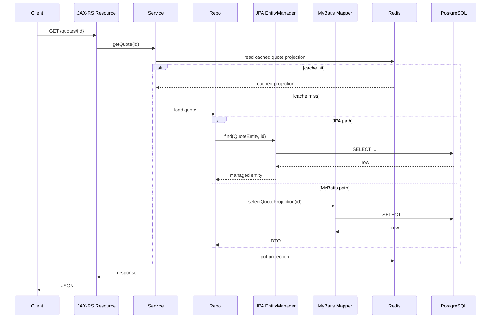
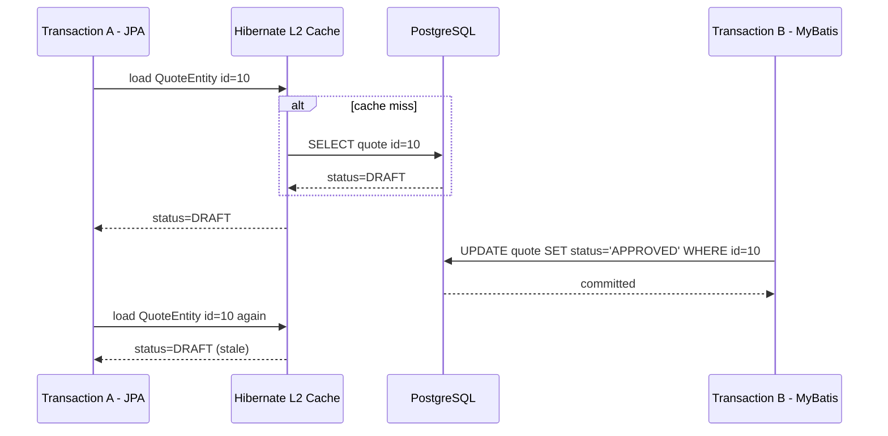
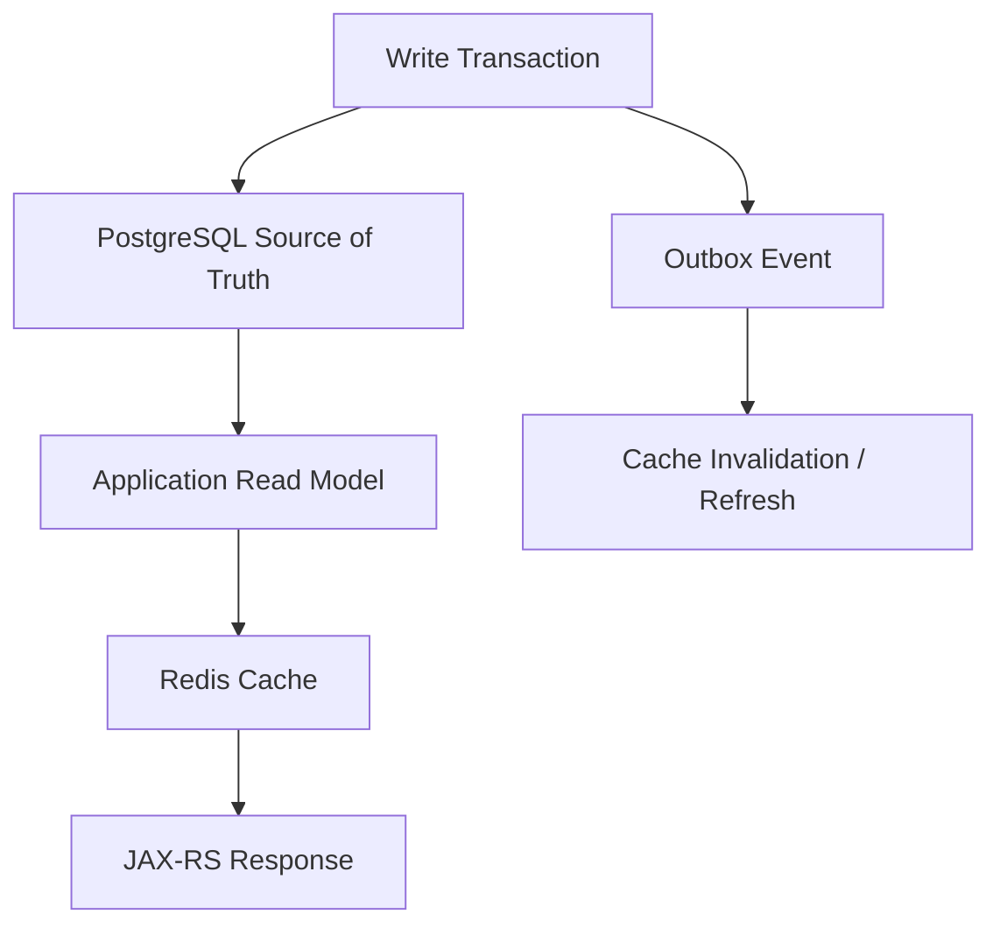
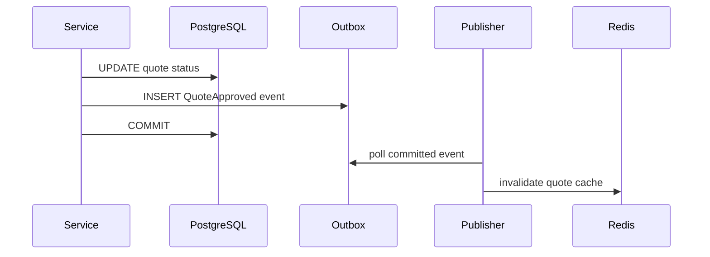
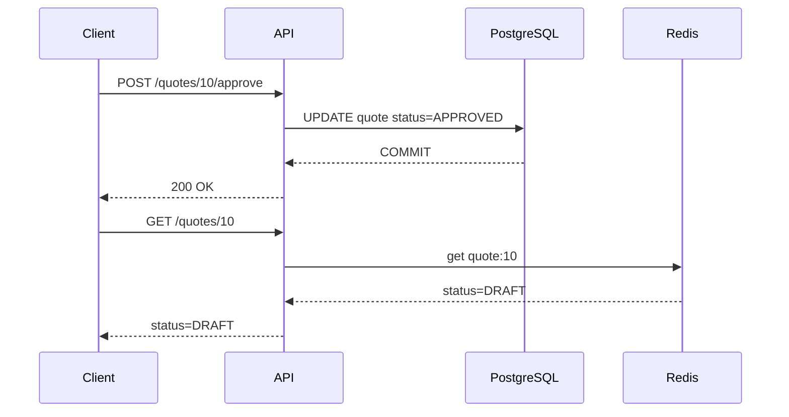
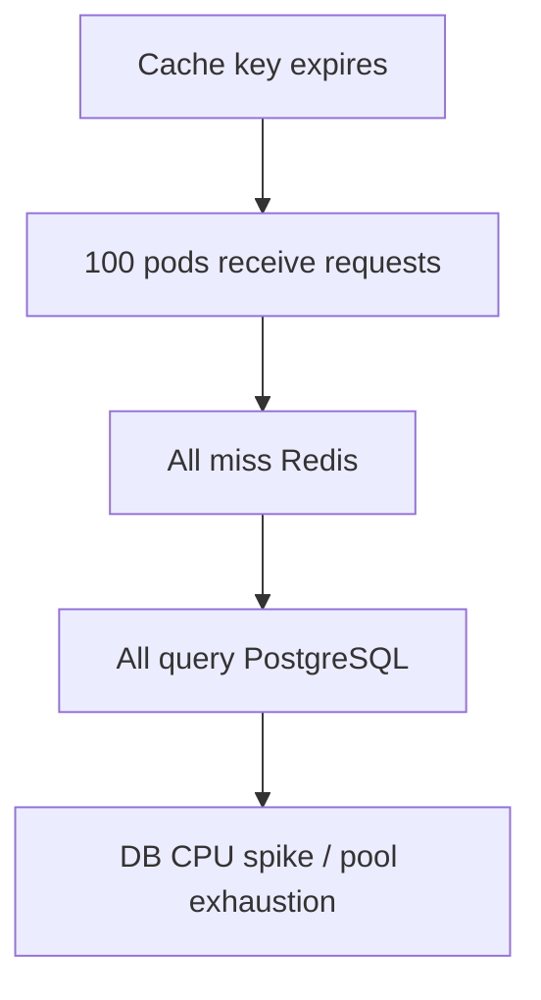

# Part 039 — Caching in Persistence Layer

Cache di persistence layer bukan sekadar optimisasi performa. Cache adalah **copy data dengan umur, scope, dan consistency contract tertentu**.

Masalahnya: banyak production bug muncul karena tim memperlakukan cache sebagai detail teknis, padahal cache mengubah behavior sistem:

- read bisa tidak lagi membaca source of truth langsung;
- write bisa commit di database tetapi cache belum berubah;
- transaction bisa rollback tetapi cache sudah terisi;
- JPA bisa membaca object lama dari persistence context;
- MyBatis bisa menjalankan SQL benar tetapi hasilnya dianggap salah karena cache eksternal belum invalidated;
- Redis bisa menyimpan projection yang tidak lagi sesuai dengan PostgreSQL.

Dalam enterprise Java/JAX-RS system, cache harus dipahami sebagai bagian dari **persistence correctness design**, bukan hanya performance tuning.

---

## 1. Core Mental Model

Persistence cache menjawab pertanyaan:

> “Bolehkah sistem membaca copy data selain dari database, dalam kondisi apa, selama berapa lama, dan bagaimana copy itu diperbarui?”

Ada beberapa level cache yang sering muncul:

| Cache Layer | Scope | Contoh | Risiko Utama |
|---|---:|---|---|
| JPA first-level cache | Satu persistence context / transaction | EntityManager managed entities | stale state dalam transaction |
| Hibernate second-level cache | Shared antar session | entity/collection cache | stale antar transaction/node |
| Hibernate query cache | Query result ids | cache hasil JPQL/query | invalidation kompleks |
| MyBatis local cache | SqlSession scope | cache hasil select dalam session | hasil lama dalam session panjang |
| MyBatis second-level cache | Mapper namespace scope | cache antar session | invalidation tidak selalu obvious |
| Redis/application cache | Cross-service/cross-pod | read model, lookup, token, reference data | stale distributed cache |
| HTTP/client cache | Di luar service | ETag, CDN, browser | API consistency expectation |

Prinsip utama:

> Cache boleh mempercepat read, tetapi tidak boleh mengaburkan siapa pemilik kebenaran data dan kapan data dianggap valid.

---

## 2. Cache Is Not One Thing

Kesalahan umum adalah membahas “cache” seolah hanya Redis. Di persistence layer, cache bisa berada di banyak tempat.

Contoh request lifecycle:



Pada diagram ini, data bisa berada di:

- PostgreSQL;
- JPA persistence context;
- Hibernate L2 cache;
- MyBatis local/session cache;
- Redis;
- response object;
- client cache.

Semakin banyak copy, semakin jelas invalidation contract harus dibuat.

---

## 3. JPA First-Level Cache: Persistence Context Cache

JPA first-level cache adalah cache wajib dalam persistence context. Ia bukan fitur opsional.

Dalam satu `EntityManager`, entity dengan identity yang sama akan direpresentasikan oleh object yang sama.

```java
QuoteEntity q1 = entityManager.find(QuoteEntity.class, quoteId);
QuoteEntity q2 = entityManager.find(QuoteEntity.class, quoteId);

assert q1 == q2;
```

Jika entity sudah managed, JPA tidak selalu query ulang database.

### Why It Exists

First-level cache mendukung:

- identity map;
- dirty checking;
- unit of work;
- transactional write-behind;
- relationship consistency dalam persistence context.

### Failure Mode

Masalah muncul ketika database diubah di luar EntityManager yang sama.

Contoh:

```java
@Transactional
public QuoteView updateAndRead(UUID quoteId) {
    QuoteEntity entity = entityManager.find(QuoteEntity.class, quoteId);

    myBatisMapper.updateQuoteStatus(quoteId, "APPROVED");

    // entity.status bisa tetap nilai lama karena EntityManager sudah punya managed instance.
    return QuoteView.from(entity);
}
```

Database sudah berubah via MyBatis, tetapi JPA masih memegang object lama.

### Safe Options

Beberapa opsi defensif:

```java
entityManager.flush();   // kirim perubahan JPA pending ke DB
entityManager.clear();   // lepas semua managed entities
```

Atau lebih targeted:

```java
entityManager.refresh(entity);
```

Tetapi ini bukan obat universal. Lebih baik hindari satu transaction yang memodifikasi table/aggregate sama lewat dua persistence model berbeda.

---

## 4. Hibernate Second-Level Cache

Hibernate second-level cache adalah cache lintas `Session`/`EntityManager`. Tidak seperti first-level cache, ini opsional.

Ia bisa menyimpan:

- entity data;
- collection data;
- natural-id mapping;
- query result metadata/id.

### When It Helps

Cocok untuk data yang:

- jarang berubah;
- sering dibaca;
- tidak terlalu besar;
- invalidation-nya jelas;
- tidak sensitif terhadap slight staleness.

Contoh:

- reference data;
- catalog lookup yang versioned;
- country/currency/config table;
- static-ish permission metadata.

### When It Is Dangerous

Berbahaya untuk:

- quote/order state yang sering berubah;
- workflow task state;
- inventory/reservation-like data;
- balance/credit/limit;
- data tenant-sensitive tanpa key isolation yang kuat;
- aggregate yang juga di-update via MyBatis/native SQL.

### MyBatis + Hibernate L2 Cache Conflict

Jika Hibernate L2 cache aktif untuk entity `QuoteEntity`, lalu MyBatis melakukan update ke table `quote`, Hibernate tidak otomatis tahu row tersebut berubah.



Ini salah satu alasan kenapa entity/table yang juga diubah MyBatis sebaiknya tidak menggunakan Hibernate L2 cache, kecuali invalidation-nya eksplisit dan reliable.

---

## 5. Hibernate Query Cache

Hibernate query cache sering lebih berbahaya daripada entity cache karena yang di-cache biasanya bukan full object, melainkan daftar ID hasil query.

Contoh conceptual:

```java
List<QuoteEntity> results = entityManager
    .createQuery("select q from QuoteEntity q where q.status = :status", QuoteEntity.class)
    .setParameter("status", QuoteStatus.APPROVED)
    .setHint("org.hibernate.cacheable", true)
    .getResultList();
```

Query cache harus tahu kapan table yang relevan berubah. Dalam sistem dengan native query, trigger, MyBatis update, bulk update, dan migration scripts, invalidation bisa sulit diverifikasi.

### Rule of Thumb

Gunakan query cache hanya jika:

- query sangat sering dipakai;
- data jarang berubah;
- invalidation bisa dipahami;
- impact stale data dapat diterima;
- ada observability hit/miss dan stale incident path.

Untuk business-critical mutable data, query cache sering lebih mahal secara correctness daripada manfaat performance-nya.

---

## 6. MyBatis Local Cache

MyBatis memiliki local cache pada scope `SqlSession`. Default behavior dapat menyebabkan query yang sama dalam session yang sama tidak selalu hit database ulang.

Dalam typical framework integration, session biasanya scoped per request/transaction sehingga risikonya lebih kecil. Namun tetap penting memahami bahwa MyBatis bukan selalu “query database setiap kali” dalam semua konfigurasi.

### Failure Mode

Jika session terlalu panjang atau ada mixed update path, hasil select bisa tampak stale.

Contoh conceptual:

```java
QuoteDto before = mapper.selectQuote(id);
mapper.updateQuoteStatus(id, "APPROVED");
QuoteDto after = mapper.selectQuote(id);
```

Behavior aktual bergantung pada executor, cache scope, statement config, dan transaction/session lifecycle.

### Review Point

Pastikan tim tahu:

- scope SqlSession;
- apakah local cache default dipakai;
- apakah ada second-level cache MyBatis;
- apakah mapper tertentu punya cache custom;
- apakah update/insert/delete melakukan flush cache sesuai expectation.

---

## 7. MyBatis Second-Level Cache

MyBatis second-level cache biasanya scoped pada mapper namespace. Ini bisa meningkatkan read performance, tetapi juga menambah risiko stale result.

Contoh mapper XML:

```xml
<mapper namespace="com.example.persistence.mapper.QuoteMapper">
  <cache />

  <select id="selectQuote" resultMap="QuoteResultMap">
    SELECT id, status, total_amount
    FROM quote
    WHERE id = #{id}
  </select>
</mapper>
```

### Risk

Jika table yang sama di-update oleh:

- mapper namespace lain;
- JPA/Hibernate;
- database trigger;
- stored procedure;
- migration script;
- background job;

maka invalidation namespace-local bisa tidak cukup.

### Rule of Thumb

Untuk enterprise system yang kompleks, MyBatis second-level cache harus dianggap **architecture decision**, bukan mapper-level convenience.

---

## 8. Redis/Application Cache

Redis sering dipakai untuk:

- lookup/reference cache;
- read model cache;
- idempotency key;
- rate limit;
- session/token metadata;
- expensive projection cache;
- workflow state acceleration.

Dalam persistence context, Redis harus memiliki contract:



Redis sebaiknya bukan “database kedua” tanpa lifecycle ownership.

### Cache-Aside Pattern

```java
public QuoteSummary getQuoteSummary(UUID quoteId) {
    String key = "quote-summary:" + quoteId;

    QuoteSummary cached = redis.get(key, QuoteSummary.class);
    if (cached != null) {
        return cached;
    }

    QuoteSummary loaded = quoteQueryRepository.findSummary(quoteId);
    redis.set(key, loaded, Duration.ofMinutes(5));
    return loaded;
}
```

Simple, tetapi failure mode-nya:

- stale selama TTL;
- cache stampede;
- inconsistent serialization;
- tenant leakage jika key tidak tenant-aware;
- cache populated before transaction commit;
- cache not invalidated after write.

---

## 9. Transaction and Cache Coupling

Salah satu bug paling umum: update cache sebelum transaction commit.

```java
@Transactional
public void approveQuote(UUID quoteId) {
    quoteRepository.approve(quoteId);

    // Dangerous: jika transaction rollback setelah ini, Redis sudah berisi state yang tidak pernah commit.
    redis.set("quote-status:" + quoteId, "APPROVED");

    auditRepository.insertAudit(...); // bisa gagal
}
```

Lebih aman menggunakan after-commit hook atau outbox.

Conceptual after-commit:

```java
@Transactional
public void approveQuote(UUID quoteId) {
    quoteRepository.approve(quoteId);

    transactionSynchronization.afterCommit(() -> {
        redis.delete("quote-summary:" + quoteId);
    });
}
```

Atau gunakan event/outbox:



Outbox lebih kuat untuk distributed system karena invalidation bisa di-retry.

---

## 10. Cache Invalidation Strategies

Tidak ada invalidation strategy yang universal.

| Strategy | Cara Kerja | Cocok Untuk | Risiko |
|---|---|---|---|
| TTL only | Cache expired otomatis | data toleran stale | stale window |
| Write-through | write DB + cache | simple single-writer | rollback/order issue |
| Write-behind | write cache, async DB | latency-sensitive | data loss/correctness risk |
| Cache-aside | app load on miss | simple read cache | stale until invalidated/TTL |
| Explicit invalidation | delete/update cache after write | mutable data | missed invalidation |
| Event-driven invalidation | event/outbox triggers invalidation | microservices | lag/duplicate event |
| Versioned cache key | key includes version/effective date | catalog/reference | key explosion |

For enterprise persistence layer, prefer:

- **TTL for non-critical stale-tolerant data**;
- **explicit invalidation for local mutable cache**;
- **outbox/event-driven invalidation for distributed read models**;
- **versioned keys for catalog/effective-dated data**.

---

## 11. Read-After-Write Consistency

A common API expectation:

> User sends update, then immediately reads and sees updated data.

Cache can violate this expectation.

Example:



This is often perceived as a bug even if the cache is “eventually consistent”.

### Design Options

- Invalidate cache synchronously after commit.
- Bypass cache for read-after-write path.
- Return updated representation from write endpoint.
- Use versioned cache key.
- Use short TTL only if business accepts stale response.
- Document eventual consistency in API contract.

---

## 12. Cache and Multi-Tenancy

Cache key must include tenant dimension when data is tenant-specific.

Bad:

```text
quote-summary:{quoteId}
```

Better:

```text
tenant:{tenantId}:quote-summary:{quoteId}
```

Even better if versioned/effective-dated:

```text
tenant:{tenantId}:catalog:{catalogId}:version:{version}:price:{priceId}
```

### Failure Mode

Cross-tenant leakage through Redis is a severe security incident, not just a cache bug.

Internal review must verify:

- tenant-aware key construction;
- tenant-aware invalidation;
- tenant-aware metrics/logs;
- no fallback key without tenant;
- no shared cache entry for tenant-specific permission/data.

---

## 13. Cache and Soft Delete / Temporal Data

Soft delete and effective dating make cache harder.

Example key:

```text
price:{productId}
```

This is not enough if price depends on:

- tenant;
- catalog version;
- effective date;
- currency;
- channel;
- deleted flag;
- customer segment.

A cache key that omits business dimensions returns correct-looking but wrong data.

### Principle

> Cache key must include every dimension that changes the answer.

If the answer depends on effective date, the key must include effective date or version. If it depends on tenant, include tenant. If it depends on soft-delete visibility, include visibility mode or avoid caching that path.

---

## 14. Cache and Event-Driven Architecture

In microservices, cache invalidation often flows through events.

Example:

- Quote Service commits quote status change.
- It writes outbox event `QuoteApproved`.
- Publisher sends event to Kafka/RabbitMQ.
- Read model/cache service consumes event.
- Redis projection is invalidated/refreshed.

Failure modes:

- event published but cache invalidation fails;
- duplicate event causes duplicate invalidation/refresh;
- event arrives out of order;
- replay reintroduces old data;
- consumer lag creates stale read window;
- schema evolution breaks consumer deserialization.

For cache invalidation events, handlers must be idempotent.

```java
public void handle(QuoteApproved event) {
    redis.delete("tenant:" + event.tenantId() + ":quote-summary:" + event.quoteId());
}
```

Delete-based invalidation is usually easier to make idempotent than update-based invalidation.

---

## 15. Cache and MyBatis + JPA Mixing

Mixing MyBatis and JPA increases cache complexity because each tool has a different state model.

### Dangerous Pattern

```java
@Transactional
public QuoteResponse approve(UUID quoteId) {
    QuoteEntity entity = entityManager.find(QuoteEntity.class, quoteId);

    mapper.approveQuote(quoteId);

    return QuoteResponse.from(entity); // may use stale entity state
}
```

### Safer Pattern

```java
@Transactional
public QuoteResponse approve(UUID quoteId) {
    entityManager.flush();
    entityManager.clear();

    mapper.approveQuote(quoteId);

    QuoteProjection projection = mapper.selectQuoteProjection(quoteId);
    return QuoteResponse.from(projection);
}
```

But the safest design is usually ownership separation:

- JPA owns aggregate lifecycle write path;
- MyBatis owns projection/reporting read path;
- same table write path is not split;
- cache is disabled or carefully invalidated for shared tables.

---

## 16. Cache Stampede and Hot Keys

Cache stampede happens when many requests miss cache at the same time and all hit PostgreSQL.

Scenario:



Mitigation options:

- request coalescing;
- lock per cache key;
- probabilistic early refresh;
- staggered TTL with jitter;
- background refresh;
- serving stale while revalidating if acceptable.

TTL jitter example:

```java
Duration ttl = Duration.ofMinutes(5).plusSeconds(ThreadLocalRandom.current().nextInt(0, 60));
redis.set(key, value, ttl);
```

---

## 17. Security and Privacy Concerns

Cache often bypasses database-level controls.

Review carefully:

- Does Redis store PII?
- Is data encrypted in transit/at rest?
- Are keys tenant-aware?
- Are values masked/tokenized where required?
- Are cache logs leaking payloads?
- Are debug endpoints exposing cache values?
- Is cache invalidated on permission/role changes?
- Does least privilege apply to cache access?

A database can have row-level security, but Redis typically will not enforce the same rule automatically.

---

## 18. Observability for Cache

Cache without observability is guesswork.

Minimum metrics:

- hit rate;
- miss rate;
- latency;
- error rate;
- timeout rate;
- eviction count;
- memory usage;
- key cardinality;
- stale read incidents;
- invalidation event lag;
- fallback-to-database rate.

For persistence-level cache, also correlate:

- cache miss spike with DB query spike;
- Redis latency with API latency;
- invalidation lag with stale read reports;
- deploy time with key format changes;
- query cache hit rate with Hibernate performance.

---

## 19. Production Debugging Flow

When cache is suspected:

1. Identify the source of truth row in PostgreSQL.
2. Read the actual row using SQL.
3. Check JPA/Hibernate cache possibility.
4. Check MyBatis cache/session scope if relevant.
5. Check Redis key/value/TTL.
6. Verify tenant/effective-date/key dimensions.
7. Check invalidation event/outbox status.
8. Check transaction timing: was cache updated before commit?
9. Check whether the read path bypasses DB unexpectedly.
10. Reproduce with SQL logging and cache disabled if safe in lower environment.

Do not start by deleting random Redis keys in production unless you understand blast radius.

---

## 20. Design Heuristics

Use cache when:

- read is frequent;
- data is expensive to compute;
- staleness tolerance is understood;
- invalidation path is reliable;
- source of truth remains clear;
- observability exists.

Avoid cache when:

- correctness requires immediate consistency;
- data changes frequently;
- invalidation cannot be proven;
- tenant/security filters are complex;
- MyBatis and JPA both mutate the same table;
- query performance issue is caused by missing index or bad query plan that should be fixed at source.

Cache should not be used to hide broken query design indefinitely.

---

## 21. Java/JAX-RS Impact

Persistence cache affects JAX-RS API behavior:

- GET may return stale representation.
- POST/PUT may need to return fresh representation directly from write result.
- HTTP status may be correct but body may be old.
- Idempotency response replay may use cached result.
- ETag/version header can help expose representation version.
- Cache-Control must not conflict with backend cache semantics.

For command endpoints, be explicit whether response is:

- committed state;
- accepted async state;
- eventually consistent projection;
- cached representation.

---

## 22. PostgreSQL Impact

Cache can reduce read pressure, but it also changes PostgreSQL workload shape:

- fewer repeated reads;
- sudden DB spikes during cache expiry;
- less planner feedback if queries rarely run;
- stale cache hiding bad migrations temporarily;
- more intense bursts after deploy/cache flush;
- cache miss path becoming under-tested.

Performance review should inspect both cache hit path and cache miss path.

---

## 23. Kubernetes / Cloud / On-Prem Impact

In Kubernetes:

- each pod may have local in-memory cache;
- Redis may be shared;
- rolling deploy can invalidate/warm cache unevenly;
- replica scale-out can trigger cache stampede;
- secret rotation can break Redis access;
- network latency to Redis matters;
- multi-region cache consistency is harder.

In hybrid/on-prem deployment, verify:

- Redis availability model;
- failover behavior;
- latency between app and cache;
- cache persistence setting;
- backup/restore expectations;
- operational ownership.

---

## 24. PR Review Checklist

Ask these questions in PR review:

- What is the source of truth?
- What exactly is cached?
- Is the cached data entity, DTO, projection, query result, or computed value?
- What is the cache key?
- Does the key include tenant, version, effective date, locale, currency, channel, and permission dimensions if relevant?
- What is the TTL?
- What invalidates the cache?
- Does invalidation happen after transaction commit?
- What happens if invalidation fails?
- Is the handler idempotent?
- Can stale data violate business correctness?
- Is cache used to hide a bad query that should be indexed/tuned?
- Does MyBatis update data cached by Hibernate?
- Does JPA update data cached by MyBatis/Redis?
- Is Hibernate L2/query cache enabled for mutable data?
- Are PII and tenant data protected?
- Are hit/miss/error/latency metrics available?

---

## 25. Internal Verification Checklist

Verify in the internal CSG/team codebase before assuming behavior:

- Cache technologies used: Redis, in-memory cache, Hibernate L2, MyBatis second-level cache, HTTP cache.
- Whether Hibernate second-level cache is enabled.
- Whether Hibernate query cache is enabled.
- Whether MyBatis local cache defaults are overridden.
- Whether MyBatis second-level cache is used in mapper XML.
- Redis key naming convention.
- Tenant-aware cache key convention.
- Cache TTL standards.
- Cache invalidation mechanism.
- Whether invalidation is synchronous, after-commit, or event-driven.
- Whether outbox/inbox is used for cache invalidation.
- Whether cache stores PII or sensitive commercial data.
- Observability dashboard for cache hit/miss/latency/errors.
- Known stale cache incidents.
- Review policy for adding new cache.
- Ownership between backend, platform, and SRE for cache infrastructure.

---

## 26. Senior Engineer Summary

Cache is useful only when its consistency model is explicit.

For persistence engineering:

- JPA first-level cache is part of the unit-of-work model.
- Hibernate L2/query cache must be treated as architecture-level decision.
- MyBatis cache must be reviewed with mapper namespace and update ownership in mind.
- Redis cache must be tenant-aware, invalidation-aware, and observable.
- Cache updates must respect transaction commit.
- Event-driven invalidation must be idempotent and replay-safe.
- MyBatis + JPA mixing makes cache correctness significantly harder.

The senior-level question is not “can we cache this?”

The real question is:

> “What exact stale-data behavior are we willing to accept, and how will we detect when reality violates that contract?”
