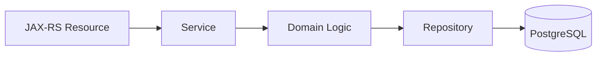
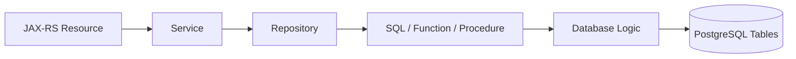
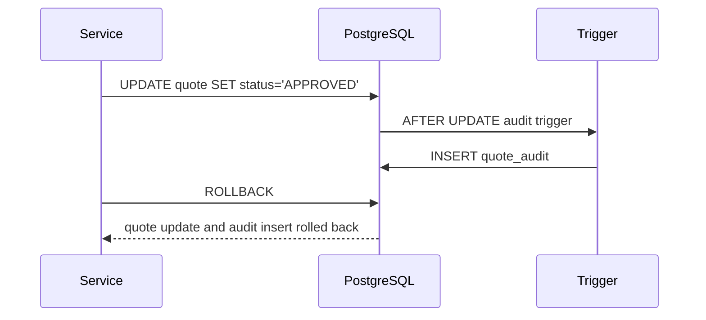

# Part 040 — Stored Procedures, Functions, and Database Logic

Database logic adalah logic yang dijalankan di database, bukan di Java application layer.

Dalam PostgreSQL, bentuknya bisa berupa:

- function;
- procedure;
- trigger function;
- trigger;
- generated column;
- constraint;
- view/materialized view;
- rule;
- PL/pgSQL block;
- extension-provided function;
- custom operator/index behavior.

Database logic dapat sangat berguna. Namun dalam enterprise Java/JAX-RS system, database logic juga bisa menjadi sumber failure karena behavior penting tersembunyi dari service code, PR reviewer, test suite, tracing, dan domain model.

Prinsip utama:

> Database logic harus diperlakukan sebagai production code: versioned, tested, observable, reviewed, and owned.

---

## 1. Why Database Logic Exists

Database logic biasanya muncul karena salah satu alasan ini:

- menjaga invariant sedekat mungkin dengan data;
- menjalankan operasi set-based yang lebih efisien di SQL;
- mengurangi round trip aplikasi ke database;
- mempertahankan compatibility dengan legacy system;
- menyediakan API database untuk banyak aplikasi;
- mengelola audit/change tracking;
- melakukan data normalization/denormalization;
- memanfaatkan PostgreSQL-specific capability;
- menjalankan operation atomic dekat transaction.

Contoh penggunaan yang reasonable:

- trigger audit table;
- function untuk complex pricing lookup;
- procedure untuk batch maintenance;
- function untuk JSONB transformation;
- generated value yang harus konsisten lintas writer;
- database constraint untuk invariant fundamental.

Contoh penggunaan yang perlu dicurigai:

- business workflow besar tersembunyi dalam trigger;
- procedure memanggil banyak table tanpa ownership jelas;
- function mengubah data walau namanya terlihat seperti read;
- trigger melakukan side effect ke table lain tanpa dokumentasi;
- application code tidak tahu procedure bisa lock table besar;
- migration mengubah function tanpa compatibility test.

---

## 2. Function vs Procedure in PostgreSQL

Secara mental model:

| Object | Return | Transaction Behavior | Typical Use |
|---|---|---|---|
| Function | Mengembalikan value/table/void | Berjalan dalam transaction caller | computation, lookup, transformation, trigger function |
| Procedure | Dipanggil dengan `CALL` | Dapat punya transaction control dalam kondisi tertentu | operational routine, maintenance, batch operation |
| Trigger Function | Dipanggil oleh trigger | Dalam transaction statement yang memicu trigger | audit, validation, derived data, side effect |

Function sering dipanggil di SQL:

```sql
SELECT calculate_quote_total(:quote_id);
```

Procedure dipanggil dengan:

```sql
CALL recalculate_catalog_prices(:catalog_id);
```

Trigger function dipasang ke table:

```sql
CREATE TRIGGER quote_audit_trigger
AFTER UPDATE ON quote
FOR EACH ROW
EXECUTE FUNCTION audit_quote_change();
```

---

## 3. Stored Logic as Persistence Boundary

Jika business rule dijalankan di database, maka persistence boundary berubah.

Tanpa DB logic:



Dengan DB logic:



Pertanyaan review berubah:

- logic ini milik application layer atau database layer?
- apakah Java domain model mengetahui side effect-nya?
- apakah test application mencakup DB logic?
- apakah migration mengubah behavior tanpa update code?
- apakah observability bisa melihat waktu/error di DB logic?

---

## 4. Calling Database Logic with JDBC

JDBC menyediakan `CallableStatement` untuk function/procedure call.

Conceptual example:

```java
try (Connection connection = dataSource.getConnection();
     CallableStatement statement = connection.prepareCall("{ call recalculate_catalog_prices(?) }")) {

    statement.setObject(1, catalogId);
    statement.execute();
}
```

Function dengan return value bisa dipanggil sebagai SQL biasa atau callable syntax.

```java
try (PreparedStatement statement = connection.prepareStatement(
        "select calculate_quote_total(?)")) {

    statement.setObject(1, quoteId);

    try (ResultSet rs = statement.executeQuery()) {
        if (rs.next()) {
            BigDecimal total = rs.getBigDecimal(1);
        }
    }
}
```

### JDBC Review Points

- Apakah parameter binding aman?
- Apakah timeout diset?
- Apakah transaction boundary jelas?
- Apakah output parameter/result set dibaca benar?
- Apakah SQLException/SQLState dimapping?
- Apakah function/procedure dapat lock table besar?
- Apakah connection dilepas dengan benar?

---

## 5. Calling Database Logic with MyBatis

MyBatis cocok untuk function/procedure call karena SQL tetap eksplisit.

Function as select:

```xml
<select id="calculateQuoteTotal" resultType="java.math.BigDecimal">
  SELECT calculate_quote_total(#{quoteId})
</select>
```

Procedure call:

```xml
<select id="recalculateCatalogPrices" statementType="CALLABLE">
  { call recalculate_catalog_prices(#{catalogId, jdbcType=OTHER}) }
</select>
```

PostgreSQL-specific function returning table:

```xml
<select id="findEligibleOffers" resultMap="OfferResultMap">
  SELECT *
  FROM find_eligible_offers(
    #{tenantId},
    #{customerId},
    #{effectiveDate}
  )
</select>
```

### MyBatis Strength

MyBatis keeps SQL visible. Reviewer can see exactly what function/procedure is called.

### MyBatis Risk

The XML call still does not reveal what the database function does internally.

Therefore, PR review must inspect migration/function definition too.

---

## 6. Calling Database Logic with JPA

JPA supports native query and stored procedure query.

Native function call:

```java
BigDecimal total = (BigDecimal) entityManager
    .createNativeQuery("select calculate_quote_total(:quoteId)")
    .setParameter("quoteId", quoteId)
    .getSingleResult();
```

Stored procedure query:

```java
StoredProcedureQuery query = entityManager
    .createStoredProcedureQuery("recalculate_catalog_prices")
    .registerStoredProcedureParameter("p_catalog_id", UUID.class, ParameterMode.IN)
    .setParameter("p_catalog_id", catalogId);

query.execute();
```

### JPA-Specific Risk

JPA persistence context may become stale if procedure/function changes rows behind EntityManager.

```java
@Transactional
public QuoteEntity recalculateAndReturn(UUID quoteId) {
    QuoteEntity quote = entityManager.find(QuoteEntity.class, quoteId);

    entityManager
        .createNativeQuery("select recalculate_quote(:quoteId)")
        .setParameter("quoteId", quoteId)
        .getSingleResult();

    return quote; // may be stale
}
```

Safer:

```java
entityManager.flush();
entityManager.clear();
```

Then reload explicitly.

```java
QuoteEntity refreshed = entityManager.find(QuoteEntity.class, quoteId);
```

But again, if procedure mutates aggregate state, ask whether JPA should be the owner of that lifecycle instead.

---

## 7. Triggers: Powerful but Easy to Hide

A trigger runs automatically when a table event occurs.

Example audit trigger:

```sql
CREATE OR REPLACE FUNCTION audit_quote_change()
RETURNS trigger AS $$
BEGIN
  INSERT INTO quote_audit (
    quote_id,
    old_status,
    new_status,
    changed_at
  ) VALUES (
    OLD.id,
    OLD.status,
    NEW.status,
    now()
  );

  RETURN NEW;
END;
$$ LANGUAGE plpgsql;

CREATE TRIGGER trg_quote_audit
AFTER UPDATE ON quote
FOR EACH ROW
EXECUTE FUNCTION audit_quote_change();
```

This can be good because all writers get audit consistently:

- JPA;
- MyBatis;
- JDBC;
- migration script;
- admin tool.

But it can also hide behavior from Java code.

### Trigger Failure Modes

- unexpected insert/update to another table;
- recursion;
- lock amplification;
- slow write because trigger does heavy work;
- trigger failure causing application write failure;
- audit user context missing;
- JPA entity state not aware of DB-generated changes;
- MyBatis `RETURNING` does not include trigger-mutated fields unless designed.

---

## 8. Database Logic and Transaction Boundary

Database logic normally runs inside the caller transaction.

If Java transaction rolls back, changes made by function/trigger inside the same transaction usually roll back too.



This is usually good.

But review carefully:

- Does procedure attempt transaction control?
- Is it called inside framework-managed transaction?
- Does it use external extension or side effect?
- Does it write to tables with different ownership?
- Does it acquire locks longer than expected?

---

## 9. Database Logic and JPA Flush

Before native query or procedure call, Hibernate may flush pending changes depending on flush mode and query synchronization.

Example:

```java
@Transactional
public void calculate(UUID quoteId) {
    QuoteEntity quote = entityManager.find(QuoteEntity.class, quoteId);
    quote.setStatus(QuoteStatus.REVIEWING);

    entityManager
        .createNativeQuery("select calculate_quote_total(:quoteId)")
        .setParameter("quoteId", quoteId)
        .getSingleResult();
}
```

A flush may happen before the native query, causing UPDATE earlier than expected.

### Review Question

If a function reads the same table as a managed entity, do you know whether pending entity changes are flushed before function execution?

If not, behavior may differ between tests and production depending on transaction and flush mode.

---

## 10. Database Logic and MyBatis/JPA Mixing

Database logic adds a third writer/reader model.

Now you may have:

- JPA entity lifecycle;
- MyBatis explicit SQL;
- database trigger/function mutation.

This combination can be powerful but dangerous.

Example failure:

1. JPA loads `QuoteEntity` status `DRAFT`.
2. MyBatis calls `approve_quote()` function.
3. Function updates `quote.status` and inserts audit row.
4. JPA entity remains `DRAFT` in persistence context.
5. Later JPA dirty checking flushes entity and accidentally overwrites status.

This is a serious correctness risk.

Safe design requires:

- explicit ownership;
- flush/clear/refresh discipline;
- no hidden same-row mutation;
- test for stale persistence context;
- no duplicate audit/version logic.

---

## 11. Function Volatility and Query Planning

PostgreSQL functions have volatility categories:

- `IMMUTABLE`;
- `STABLE`;
- `VOLATILE`.

This affects planner assumptions.

Wrong volatility marking can cause incorrect or surprising query behavior.

Example conceptual:

```sql
CREATE FUNCTION normalize_code(input text)
RETURNS text
IMMUTABLE
LANGUAGE sql
AS $$
  SELECT lower(trim(input));
$$;
```

This is reasonable because output depends only on input.

But a function reading tables or current time should not be marked immutable.

Internal review should verify function volatility where performance/indexing depends on it.

---

## 12. Database Logic and Indexes

Functions may participate in indexes.

Example functional index:

```sql
CREATE INDEX idx_customer_email_normalized
ON customer (lower(email));
```

Query must match expression shape:

```sql
SELECT *
FROM customer
WHERE lower(email) = lower(:email);
```

Custom functions can also be used, but reviewer must verify:

- volatility allows index usage;
- expression matches query;
- collation/case normalization is correct;
- function cost is acceptable;
- EXPLAIN confirms index use.

---

## 13. Hidden Business Logic Problem

A major architecture smell:

> Java service appears to do one thing, but database trigger/function does additional business workflow that is not visible in service code.

Example:

```java
quoteRepository.updateStatus(quoteId, APPROVED);
```

But trigger also:

- creates order draft;
- emits integration row;
- recalculates price;
- updates catalog snapshot;
- modifies customer entitlement.

This makes PR review misleading because reviewer cannot infer side effects from Java diff.

### Guideline

Database logic should be documented at repository method boundary.

```java
/**
 * Approves quote by calling approve_quote database function.
 * Database side effects:
 * - updates quote.status
 * - inserts quote_audit
 * - writes quote_outbox event row
 * - recalculates quote_total
 */
void approveQuote(UUID quoteId);
```

If this comment feels too large, the database function may be hiding too much business logic.

---

## 14. Error Handling

Database functions/procedures can raise errors.

PL/pgSQL example:

```sql
RAISE EXCEPTION 'Quote % is not approvable', p_quote_id
  USING ERRCODE = 'P0001';
```

Java side must map this carefully.

Bad:

```java
catch (Exception e) {
    throw new RuntimeException("Database error", e);
}
```

Better conceptual mapping:

```java
catch (PersistenceException e) {
    SqlError sqlError = sqlErrorExtractor.extract(e);

    if (sqlError.sqlState().equals("P0001")) {
        throw new DomainConflictException("Quote is not approvable", e);
    }

    throw e;
}
```

But avoid coupling business meaning to free-text error message. Prefer structured error codes where possible.

---

## 15. Timeout and Locking

Database logic can hide expensive operations.

A Java method may look small:

```java
mapper.repriceCatalog(catalogId);
```

But procedure may:

- scan millions of rows;
- update many records;
- acquire row/table locks;
- call other functions;
- generate large WAL;
- block online traffic.

Review must check:

- statement timeout;
- lock timeout;
- expected row count;
- index usage;
- transaction duration;
- whether chunking is needed;
- whether procedure is safe during peak traffic.

---

## 16. Migration and Versioning

Database logic must be versioned with migration tool.

Bad:

- manually editing function in database console;
- undocumented hotfix;
- function definition not in repository;
- application assumes function signature that migration changed;
- rollback removes function used by old app version.

Better:

```sql
-- V20260711_1430__create_calculate_quote_total_function.sql
CREATE OR REPLACE FUNCTION calculate_quote_total(p_quote_id uuid)
RETURNS numeric AS $$
BEGIN
  -- implementation
END;
$$ LANGUAGE plpgsql;
```

### Compatibility Concern

Changing function signature is like changing API contract.

During rolling deployment, old and new app versions may coexist. Therefore:

- add new function signature first;
- deploy app using new signature;
- remove old signature later;
- or preserve backward compatibility.

---

## 17. Testing Database Logic

Database logic needs tests against real PostgreSQL.

Mock-based tests are insufficient for:

- PL/pgSQL syntax;
- trigger behavior;
- lock behavior;
- transaction rollback;
- SQLState;
- query plan;
- function volatility;
- type mapping;
- JSONB/array handling.

Recommended test categories:

- migration applies cleanly;
- function returns expected result;
- procedure mutates expected rows;
- trigger fires exactly when expected;
- rollback rolls back trigger side effects;
- error code maps to domain error;
- concurrent calls behave correctly;
- performance regression for large fixtures;
- JPA persistence context stale-state test if mixed with JPA.

Example test shape:

```java
@Test
void approveQuoteFunction_updatesStatusAndWritesAudit() {
    UUID quoteId = fixture.insertDraftQuote();

    mapper.approveQuoteUsingFunction(quoteId);

    QuoteRow quote = mapper.selectQuoteRow(quoteId);
    List<AuditRow> audit = mapper.selectAuditRows(quoteId);

    assertThat(quote.status()).isEqualTo("APPROVED");
    assertThat(audit).hasSize(1);
}
```

---

## 18. Observability

Database logic should be observable.

Minimum signals:

- procedure/function call duration;
- error count by SQLState;
- lock wait time;
- row count affected;
- slow query log entries;
- application trace span around call;
- migration version containing function definition;
- database logs for raised exceptions;
- audit/outbox rows created.

Application wrapper should name the operation clearly:

```java
tracer.span("db.function.calculate_quote_total", () -> {
    return mapper.calculateQuoteTotal(quoteId);
});
```

Avoid generic spans like `db.query` for critical procedures.

---

## 19. Security

Database logic has security implications.

Review:

- function owner;
- execution privilege;
- `SECURITY DEFINER` vs invoker behavior;
- search path safety;
- SQL injection in dynamic SQL inside PL/pgSQL;
- exposure of sensitive data through function result;
- audit trail for function calls;
- least privilege for application DB user;
- migration user vs runtime user.

`SECURITY DEFINER` functions are especially sensitive because they can run with privileges of the function owner.

If used, verify search path and privilege boundaries carefully.

---

## 20. Performance Trade-Offs

Database logic can improve performance by:

- reducing round trips;
- processing set-based operations close to data;
- avoiding transferring large intermediate result sets;
- using indexes/operators efficiently;
- centralizing logic shared by multiple queries.

But it can hurt performance by:

- hiding expensive work from application metrics;
- making query plan harder to inspect;
- causing lock amplification;
- running row-by-row procedural logic instead of set-based SQL;
- making migrations slower;
- blocking concurrent writes;
- increasing CPU load on database instead of horizontally scalable app pods.

Database CPU is usually harder to scale horizontally than stateless Java pods.

---

## 21. When Database Logic Is a Good Fit

Good fit:

- fundamental data invariant;
- audit/change capture that must cover all writers;
- set-based batch update;
- PostgreSQL-specific transformation;
- high-volume operation where app round trips are bottleneck;
- legacy compatibility layer;
- data repair or maintenance operation;
- outbox row creation tightly coupled to write transaction.

Poor fit:

- rapidly changing business workflow;
- logic requiring external service calls;
- logic needing rich domain model behavior;
- logic owned by multiple teams without clear contract;
- logic requiring heavy branching and feature flags;
- logic that duplicates Java validation inconsistently;
- logic hidden from test/review pipeline.

---

## 22. Java/JAX-RS Impact

For JAX-RS backend, database logic affects:

- endpoint latency;
- exception mapping;
- transaction duration;
- response freshness;
- generated IDs/fields;
- audit metadata;
- API idempotency;
- retry behavior;
- observability span naming.

If endpoint calls a procedure, API review must include:

- worst-case duration;
- whether it should be sync or async;
- timeout contract;
- error mapping;
- retry safety;
- transaction scope;
- side effects.

---

## 23. Kubernetes / Cloud / On-Prem Impact

Database logic can change deployment risk:

- migration job may deploy function before app rollout;
- rolling deployment may have app versions expecting different function signatures;
- long procedure may exceed cloud DB timeout or maintenance windows;
- procedure may create CPU spike on managed PostgreSQL;
- on-prem DB may have different extension/version availability;
- secret/permission model may differ by environment;
- read replicas may not support write procedure calls.

Review whether function/procedure exists and behaves consistently across:

- local dev;
- CI Testcontainers;
- staging;
- cloud managed PostgreSQL;
- on-prem PostgreSQL;
- DR environment.

---

## 24. PR Review Checklist

Ask these questions:

- Is this logic better in Java or database?
- Who owns the function/procedure/trigger?
- Is it versioned in migration?
- Is the function signature backward compatible?
- What tables does it read/write?
- Does Java code document side effects?
- Does it run inside caller transaction?
- Can it cause stale JPA persistence context?
- Can it conflict with MyBatis/JPA ownership?
- Does it bypass validation/audit/security filters?
- Does it duplicate business logic in Java?
- What SQLState/error codes can it raise?
- How are errors mapped to domain/API errors?
- What locks can it acquire?
- What is worst-case row count and duration?
- Is statement/lock timeout configured?
- Is it tested against real PostgreSQL?
- Is it observable in traces/metrics/logs?
- Does it expose PII or sensitive data?
- Does it work during rolling deployment?

---

## 25. Internal Verification Checklist

Verify in the internal CSG/team environment before assuming behavior:

- Whether PostgreSQL functions/procedures/triggers are used.
- Where function/procedure definitions live in repository.
- Whether Liquibase/Flyway manages database logic.
- Naming convention for DB functions/procedures/triggers.
- Ownership between backend team and DBA/team platform.
- Whether runtime DB user can execute procedures/functions.
- Whether `SECURITY DEFINER` functions exist.
- Whether triggers perform audit/outbox/derived-data updates.
- Whether MyBatis mapper calls functions/procedures.
- Whether JPA native queries/stored procedure queries are used.
- Whether DB logic updates tables also mapped by JPA entities.
- Whether tests cover DB logic in Testcontainers/real PostgreSQL.
- Whether slow query logs include procedure/function internals.
- Whether incident notes mention hidden trigger/function behavior.
- Whether migration rollback/roll-forward handles DB logic safely.

---

## 26. Senior Engineer Summary

Database logic is neither inherently good nor bad.

It is powerful when:

- close-to-data logic is the right abstraction;
- behavior is versioned;
- side effects are documented;
- tests run against real PostgreSQL;
- transaction and lock behavior are understood;
- observability exists;
- ownership is clear.

It is dangerous when:

- it hides business workflow;
- it bypasses Java domain model expectations;
- it mutates JPA-managed tables behind EntityManager;
- it duplicates MyBatis/JPA validation/audit/versioning;
- it has no migration discipline;
- it cannot be debugged in production.

The senior-level review question is:

> “Is this database logic part of a clear persistence contract, or is it hidden behavior that future engineers will only discover during an incident?”
