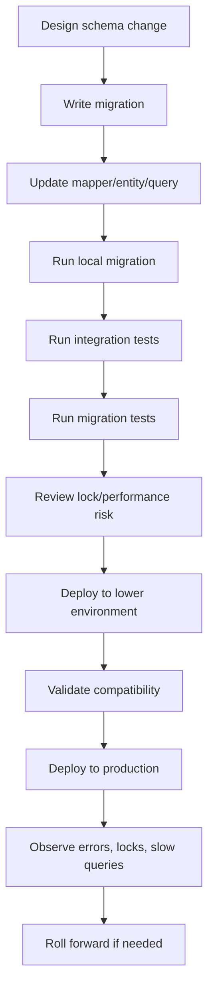
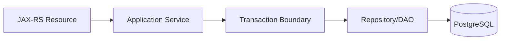
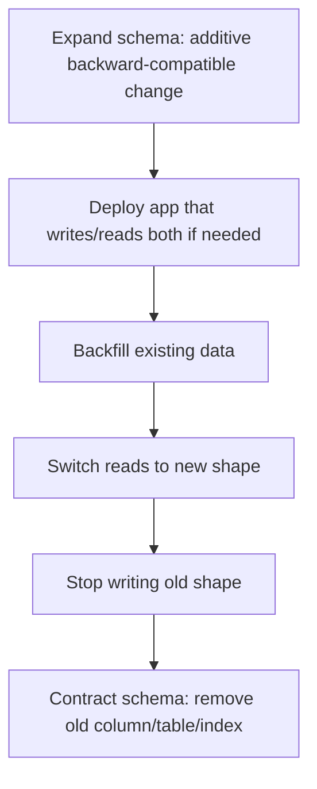

# Part 041 — Database Migration with Persistence Layer

Database migration bukan sekadar file SQL untuk mengubah schema.

Dalam enterprise Java/JAX-RS system, migration adalah **kontrak evolusi** antara:

- database schema;
- JPA entity mapping;
- Hibernate runtime behavior;
- MyBatis mapper SQL;
- JDBC direct SQL;
- repository/service assumption;
- transaction boundary;
- deployment pipeline;
- rollback/roll-forward strategy;
- production data correctness.

Migration yang salah jarang berhenti sebagai “DDL error”. Biasanya efeknya muncul sebagai:

- endpoint gagal karena column hilang;
- mapper mismatch karena alias berubah;
- JPA entity tidak cocok dengan schema;
- query planner memilih plan buruk setelah index berubah;
- migration lock membuat service timeout;
- rolling deployment rusak karena versi lama dan baru tidak compatible;
- backfill partial menyebabkan data invariant rusak;
- rollback tidak mungkin karena data sudah berubah irreversible.

Prinsip utama:

> Treat database migration as production code that changes the system contract, not as an incidental script.

---

## 1. What Database Migration Actually Changes

Migration dapat mengubah lebih dari schema fisik.

Ia dapat mengubah:

- struktur table;
- column name/type/nullability/default;
- index;
- constraint;
- sequence;
- enum type;
- function/procedure;
- trigger;
- view/materialized view;
- data semantics;
- query performance profile;
- locking behavior;
- compatibility antara app lama dan app baru.

Contoh perubahan sederhana yang terlihat aman:

```sql
ALTER TABLE quote ADD COLUMN status_reason text;
```

Namun perubahan ini punya implikasi:

- apakah JPA entity perlu field baru?
- apakah MyBatis `INSERT` eksplisit harus diubah?
- apakah column nullable?
- apakah default diperlukan?
- apakah API response perlu expose field ini?
- apakah migration aman saat rolling deployment?
- apakah data lama harus dibackfill?
- apakah index/filter perlu diperbarui?

Migration adalah perubahan contract lintas layer.

---

## 2. Versioned Migration vs Repeatable Migration

Secara umum tool seperti Flyway dan Liquibase mendukung dua style utama.

| Migration Type | Mental Model | Typical Usage | Risk |
|---|---|---|---|
| Versioned migration | Perubahan berurutan dan immutable | create table, add column, data migration | urutan salah, file diedit setelah applied |
| Repeatable migration | Re-applied saat content berubah | view, function, procedure, reference data tertentu | accidental behavior change |

Versioned migration harus dianggap immutable setelah masuk branch utama dan dipakai environment bersama.

Bad practice:

```text
V041__add_quote_status_reason.sql
```

lalu setelah applied di dev/staging, file diedit lagi untuk memperbaiki isi.

Better practice:

```text
V041__add_quote_status_reason.sql
V042__fix_quote_status_reason_default.sql
```

Alasannya sederhana: production history harus bisa direkonstruksi.

---

## 3. Migration Lifecycle

Migration bukan hanya file. Ia punya lifecycle.



A migration should not be reviewed alone. It must be reviewed together with the application code that depends on it.

---

## 4. Migration and Java/JAX-RS Request Lifecycle

A JAX-RS request usually flows like this:



Migration affects the final database contract, but the failure can surface anywhere:

- resource returns 500 because repository throws SQL exception;
- service validation accepts a state that database constraint rejects;
- repository loads entity but Hibernate cannot map new/removed column;
- MyBatis mapper fails because result column alias changed;
- transaction rolls back because trigger raises error;
- endpoint latency spikes because an index was dropped or changed.

This is why migration review must include runtime path review.

---

## 5. Entity/Schema Mismatch

JPA/Hibernate assumes entity metadata matches database schema.

Common mismatch examples:

| Schema Change | Entity Risk |
|---|---|
| column renamed | entity still maps old column |
| column dropped | entity insert/select fails |
| column changed to NOT NULL | entity insert fails if field omitted |
| column type changed | converter/type mismatch |
| sequence renamed | id generation fails |
| enum value changed | enum mapping fails |
| constraint added | flush fails at commit |

Example:

```java
@Entity
@Table(name = "quote")
public class QuoteEntity {
    @Column(name = "status")
    private String status;

    @Column(name = "status_reason")
    private String statusReason;
}
```

If migration adds `status_reason` as `NOT NULL` without default:

```sql
ALTER TABLE quote ADD COLUMN status_reason text NOT NULL;
```

This may fail immediately because existing rows do not have value.

Safer variant:

```sql
ALTER TABLE quote ADD COLUMN status_reason text;

UPDATE quote
SET status_reason = 'UNKNOWN'
WHERE status_reason IS NULL;

ALTER TABLE quote ALTER COLUMN status_reason SET NOT NULL;
```

But even this must be reviewed for lock duration, batch size, and table size.

---

## 6. Mapper/Schema Mismatch

MyBatis is explicit SQL. That gives visibility, but also means schema changes can silently miss mapper updates.

Common mismatch examples:

| Schema Change | MyBatis Risk |
|---|---|
| column renamed | SELECT/INSERT/UPDATE fails |
| column added with NOT NULL | explicit INSERT misses required column |
| column type changed | TypeHandler mismatch |
| alias changed | ResultMap no longer maps value |
| enum type changed | parameter binding fails |
| table split | mapper still joins old table |
| trigger added | update has hidden side effect |

Example mapper risk:

```xml
<insert id="insertQuote">
  INSERT INTO quote (
    id,
    customer_id,
    status
  ) VALUES (
    #{id},
    #{customerId},
    #{status}
  )
</insert>
```

If migration adds a required column:

```sql
ALTER TABLE quote ADD COLUMN source_system text NOT NULL;
```

The mapper insert will fail unless:

- the column has a safe default;
- the mapper includes the new column;
- the application computes it;
- the migration is staged using expand-contract.

---

## 7. JDBC Direct SQL Migration Risk

Direct JDBC usage often hides SQL in Java strings.

Example:

```java
String sql = "SELECT id, status FROM quote WHERE id = ?";
```

If schema changes, searchability is weaker than centralized mapper XML or entity metadata.

Review direct JDBC usage carefully for:

- string SQL references;
- hardcoded column names;
- ResultSet index access;
- CallableStatement procedure signatures;
- generated key assumptions;
- SQLState error mapping;
- manual transaction handling.

ResultSet index access is especially fragile:

```java
String id = rs.getString(1);
String status = rs.getString(2);
```

Prefer column labels:

```java
String id = rs.getString("id");
String status = rs.getString("status");
```

Even better: make direct JDBC rare, isolated, and heavily tested.

---

## 8. Expand-Contract Migration Pattern

The safest general model for production schema evolution is expand-contract.



The pattern reduces risk during rolling deployment because old and new application versions can coexist.

### Example: rename column

Unsafe:

```sql
ALTER TABLE quote RENAME COLUMN status TO quote_status;
```

Why unsafe:

- old app still reads `status`;
- old MyBatis mapper fails;
- old JPA entity fails;
- rollback may be awkward;
- rolling deployment breaks.

Safer expand-contract:

1. Add new column.

```sql
ALTER TABLE quote ADD COLUMN quote_status text;
```

2. Deploy app that writes both `status` and `quote_status`.

3. Backfill.

```sql
UPDATE quote
SET quote_status = status
WHERE quote_status IS NULL;
```

4. Deploy app that reads `quote_status`.

5. Stop reading old column.

6. Later drop old column.

```sql
ALTER TABLE quote DROP COLUMN status;
```

This looks slower, but it is much safer in production systems.

---

## 9. Backward-Compatible Migration Rules

A migration is backward-compatible if the old app can still run after the migration is applied.

Usually safe:

- add nullable column;
- add column with safe default after reviewing table rewrite/lock behavior;
- add new table;
- add new index concurrently where appropriate;
- add non-enforced logic first;
- add optional field not required by old app.

Usually unsafe:

- drop column used by old app;
- rename column/table;
- change column type directly;
- add NOT NULL without backfill/default;
- add constraint that existing data violates;
- change function signature used by app;
- change trigger behavior without compatibility review.

Important distinction:

> A migration that passes on an empty local database may still be unsafe on production data.

---

## 10. Migration Ordering

Ordering matters because application deployment and database migration deployment may not be atomic together.

Common strategies:

| Strategy | Description | Risk |
|---|---|---|
| Migration before app | DB updated first, app later | old app compatibility required |
| App before migration | app deployed first, DB later | new app must tolerate old schema |
| Migration job in deployment | pipeline runs migration during release | failure can block rollout |
| Manual DBA migration | DBA applies controlled change | coordination/visibility risk |

For most enterprise services, assume:

- multiple pods may run different app versions temporarily;
- migrations may complete before all pods are updated;
- rollback of app may happen after DB migration;
- data written during partial rollout must remain valid.

Therefore migration must be designed for version overlap.

---

## 11. Migration and Transaction Boundary

DDL behavior can affect transactions.

Migration scripts may:

- run inside one transaction;
- run each statement separately;
- be tool-dependent;
- include statements that cannot run inside a transaction;
- hold locks for the duration of the migration;
- block application transactions.

Review questions:

- Does this migration run in a transaction?
- If one statement fails, what remains applied?
- Does this DDL acquire table lock?
- Does this backfill update millions of rows in one transaction?
- Does this index creation block writes?
- Does this change interact with long-running application transactions?

A migration can be logically correct but operationally dangerous.

---

## 12. PostgreSQL Locking Risk During Migration

Schema changes can acquire locks. Even short locks can be dangerous under high traffic if they wait behind long transactions.

Risky operations include:

- altering column type;
- adding constraint validation;
- dropping columns;
- creating indexes without concurrency where table is large;
- rewriting table due to default/type change;
- large backfills;
- trigger changes on hot tables.

Production review should consider:

- table size;
- write rate;
- read rate;
- long-running transactions;
- lock timeout;
- statement timeout;
- migration window;
- rollback/roll-forward plan.

A safe migration often uses small steps, explicit timeouts, and validation phases.

---

## 13. Index Migration

Index migration is not only performance work. It can affect availability.

Reasons to add index:

- support new query path;
- reduce slow endpoint latency;
- enforce uniqueness;
- support foreign key lookup;
- support tenant-aware filtering;
- support keyset pagination;
- support partial active-row query.

Questions before adding index:

- What query will use it?
- What is the expected selectivity?
- Does column order match query predicate/order?
- Is it tenant-aware?
- Is it partial or full?
- Does it increase write overhead?
- Can it be created safely on production table?

Example:

```sql
CREATE INDEX CONCURRENTLY idx_quote_customer_status_created
ON quote (customer_id, status, created_at DESC);
```

But do not blindly add indexes. Every index increases write cost and maintenance overhead.

---

## 14. Data Migration and Backfill

Data migration changes existing rows.

It is riskier than pure schema migration because it can corrupt business state.

Review backfills for:

- correctness rule;
- null handling;
- duplicate handling;
- idempotency;
- chunking;
- lock duration;
- retry behavior;
- verification query;
- rollback/roll-forward;
- auditability.

Bad backfill:

```sql
UPDATE quote SET status_reason = 'UNKNOWN';
```

Why risky:

- overwrites meaningful existing values;
- updates all rows in one transaction;
- may create huge WAL;
- may lock heavily;
- cannot distinguish touched rows.

Better:

```sql
UPDATE quote
SET status_reason = 'UNKNOWN'
WHERE status_reason IS NULL;
```

For very large tables, use chunking strategy through migration job or controlled operational script.

---

## 15. Idempotent Migration Thinking

A migration tool tracks applied migrations, but the logic inside migration should still be reasoned about idempotency where possible.

Important for:

- retry after partial failure;
- repeated lower environment setup;
- local development reset;
- backfill jobs;
- operational scripts;
- roll-forward fixes.

Example verification query:

```sql
SELECT COUNT(*)
FROM quote
WHERE status_reason IS NULL;
```

A good migration has:

- precondition;
- change;
- verification;
- known failure mode;
- next roll-forward step.

---

## 16. Liquibase Mental Model

Liquibase organizes changes into changesets.

A changeset usually has:

- id;
- author;
- file path;
- change definition;
- checksum;
- preconditions;
- rollback section if defined.

Conceptual example:

```xml
<changeSet id="041-add-quote-status-reason" author="team">
  <addColumn tableName="quote">
    <column name="status_reason" type="text"/>
  </addColumn>
</changeSet>
```

Liquibase can express migrations in XML, YAML, JSON, or SQL depending on team convention.

Review focus:

- is changeset immutable after applied?
- are preconditions used where needed?
- is rollback meaningful or misleading?
- does generated SQL match PostgreSQL expectation?
- does the changeset interact safely with app versions?

---

## 17. Flyway Mental Model

Flyway commonly uses versioned SQL files.

Example naming:

```text
V041__add_quote_status_reason.sql
V042__backfill_quote_status_reason.sql
V043__set_quote_status_reason_not_null.sql
```

Flyway tracks applied migrations in a schema history table.

Review focus:

- are version numbers sequential and intentional?
- is the script immutable after merge?
- is SQL PostgreSQL-specific and tested against PostgreSQL?
- is repeatable migration used only where appropriate?
- does checksum change indicate accidental edit?

Flyway SQL files are direct and transparent, but reviewers must understand PostgreSQL DDL behavior.

---

## 18. Migration in CI/CD

Migration must be part of CI/CD quality gates.

Useful checks:

- apply all migrations from empty database;
- apply migrations to representative previous schema;
- run mapper/entity integration tests after migration;
- run migration compatibility test;
- validate rollback/roll-forward plan where applicable;
- detect destructive DDL;
- detect edited applied migration;
- run basic schema diff checks;
- run query smoke tests.

A good CI pipeline catches:

- syntax error;
- ordering error;
- missing table/column;
- invalid function/procedure;
- mapper result mismatch;
- entity mapping mismatch;
- migration checksum drift.

CI cannot fully prove production safety, but it can eliminate many avoidable failures.

---

## 19. Migration and MyBatis Review

When migration changes schema, review MyBatis paths explicitly.

Checklist:

- Does every affected `SELECT` still use valid columns?
- Are aliases stable for ResultMap?
- Do `INSERT` statements include required new columns?
- Do `UPDATE` statements preserve new invariants?
- Does dynamic SQL need new filter conditions?
- Does soft delete/tenant/effective-date condition still apply?
- Are TypeHandlers still correct?
- Are JSONB paths still correct?
- Are pagination sort columns still valid?
- Are tests covering affected mapper methods?

MyBatis makes SQL visible. Use that visibility during review.

---

## 20. Migration and JPA/Hibernate Review

When migration changes schema, review JPA/Hibernate behavior explicitly.

Checklist:

- Does entity mapping match table/column names?
- Does id generation still work?
- Does sequence allocation still work?
- Does enum/converter mapping still work?
- Does nullable/optional field match schema?
- Does relationship join column still exist?
- Does cascade/orphan removal still align with constraints?
- Does new constraint fail at flush/commit?
- Does bulk update bypass persistence context?
- Does generated SQL still perform acceptably?

A JPA mapping can compile but fail only when flushed.

---

## 21. Migration and Repository Contract

Repository methods often encode assumptions.

Example:

```java
Optional<Quote> findActiveQuoteByCustomerId(CustomerId customerId);
```

This assumes:

- there is a definition of active;
- active data can be uniquely identified;
- soft-deleted rows are excluded;
- effective-date logic is correct;
- tenant boundary is applied;
- index supports the query.

If migration changes `status`, soft delete, tenant, or temporal columns, repository contract may change even if method signature does not.

Review repository semantics, not just SQL/entity fields.

---

## 22. Migration Rollback vs Roll-Forward

Rollback sounds attractive, but database rollback is often hard.

Why rollback may be unsafe:

- data was transformed irreversibly;
- new app already wrote new format;
- old column was dropped;
- enum values changed;
- backfill partially completed;
- external events were published;
- cache/index/materialized view state changed.

For production systems, **roll-forward** is often safer:

- add missing column;
- restore compatibility view;
- fix bad data with corrective migration;
- reintroduce old behavior temporarily;
- disable new code path by feature flag;
- repair mapper/entity mismatch.

A migration PR should answer:

> If this migration fails after partial production rollout, what is the next safe action?

---

## 23. Feature Flags and Migration

Feature flags help decouple deploy from release, but they do not eliminate migration risk.

Useful pattern:

1. Deploy backward-compatible schema.
2. Deploy code that can handle old and new schema.
3. Keep new behavior disabled.
4. Backfill and verify data.
5. Enable feature flag gradually.
6. Observe metrics.
7. Contract old schema later.

Feature flags are especially useful for:

- new write path;
- dual-write;
- read switch;
- new index-dependent query;
- migration of high-value domain logic;
- event/outbox changes.

But if the application cannot start without the migration, feature flag does not help.

---

## 24. Migration and Event-Driven Architecture

Schema changes can affect event publication and consumption.

Examples:

- outbox payload schema changes;
- event table column added;
- idempotency key format changes;
- consumer inbox deduplication changes;
- replay logic expects old columns;
- CDC captures table changes differently;
- Debezium connector schema changes;
- downstream read model breaks.

Review questions:

- Does migration affect outbox table?
- Does it affect event payload construction?
- Does it affect CDC publication?
- Does it require consumer compatibility?
- Does event replay still work?
- Does idempotency still work?
- Does reconciliation need update?

Persistence migration and messaging correctness are tightly coupled in event-driven systems.

---

## 25. Migration and Kubernetes/Cloud Deployment

In Kubernetes/cloud/on-prem hybrid environments, migration is operationally sensitive.

Review:

- where migration runs;
- whether it runs once or per pod;
- whether multiple deployments can race;
- whether migration job has correct DB credential;
- whether app waits for migration;
- whether migration can block startup;
- whether secret rotation affects migration job;
- whether cloud PostgreSQL has connection/lock limitations;
- whether on-prem deployment follows same ordering.

Bad pattern:

```text
Each application pod runs migration at startup without coordination.
```

This can create:

- migration race;
- lock contention;
- connection storm;
- startup failure loop;
- inconsistent deployment behavior.

Better pattern depends on team/platform convention and must be verified internally.

---

## 26. Migration Failure Modes

Common failure modes:

| Failure | Symptom | Detection |
|---|---|---|
| syntax error | migration job fails | CI/lower env |
| lock wait | deploy hangs, endpoint timeout | lock metrics/logs |
| table rewrite | high IO/WAL, latency spike | DB metrics |
| mapper mismatch | runtime SQL error | integration tests/logs |
| entity mismatch | flush/select failure | repository tests/logs |
| bad backfill | incorrect business data | validation query/reconciliation |
| missing index | slow endpoint | slow query dashboard |
| incompatible rollout | old pods fail | rollout logs/errors |
| trigger surprise | unexpected write/error | audit/log analysis |
| irreversible change | rollback impossible | deployment review |

Failure detection must be part of migration design.

---

## 27. Production-Safe Migration Review Questions

Ask these before approving migration PR:

1. Is the change backward-compatible with the currently deployed app?
2. Is the change forward-compatible with the new app?
3. Does rolling deployment create version overlap risk?
4. Does the migration touch hot table?
5. Does it acquire heavy locks?
6. Does it rewrite large table?
7. Does it require backfill?
8. Is backfill chunked/idempotent/verifiable?
9. Are MyBatis mappers updated and tested?
10. Are JPA entities updated and tested?
11. Are indexes/constraints reviewed?
12. Are event/outbox/read models affected?
13. Is rollback or roll-forward plan clear?
14. Are dashboards/logs ready for validation?
15. Is there an internal owner for the migration?

---

## 28. Example: Adding a Required Column Safely

Goal: add `source_system` to `quote` and make it required.

Unsafe one-shot migration:

```sql
ALTER TABLE quote ADD COLUMN source_system text NOT NULL;
```

Safer sequence:

### Step 1: Expand

```sql
ALTER TABLE quote ADD COLUMN source_system text;
```

### Step 2: Deploy app writing new column

MyBatis insert includes `source_system`.
JPA entity includes field.
Repository contract is updated.

### Step 3: Backfill

```sql
UPDATE quote
SET source_system = 'UNKNOWN'
WHERE source_system IS NULL;
```

For large table, chunk this outside one huge transaction.

### Step 4: Verify

```sql
SELECT COUNT(*)
FROM quote
WHERE source_system IS NULL;
```

### Step 5: Enforce

```sql
ALTER TABLE quote ALTER COLUMN source_system SET NOT NULL;
```

### Step 6: Monitor

Watch:

- insert failures;
- mapper exceptions;
- JPA flush errors;
- slow queries;
- lock waits;
- deployment errors.

---

## 29. Example: Adding a Unique Constraint Safely

Goal: enforce one active quote per customer.

Naive:

```sql
ALTER TABLE quote
ADD CONSTRAINT uq_quote_customer_active UNIQUE (customer_id, active);
```

Problems:

- existing duplicates may violate it;
- `active = false` may allow only one inactive row per customer;
- business semantics may require partial index;
- concurrent writes may fail suddenly;
- application error mapping may not handle unique violation.

Better PostgreSQL partial unique index:

```sql
CREATE UNIQUE INDEX CONCURRENTLY uq_quote_one_active_per_customer
ON quote (customer_id)
WHERE active = true;
```

Review with application:

- does service catch unique violation?
- should conflict return HTTP 409?
- is retry useful or not?
- does JPA optimistic lock interact?
- does MyBatis insert/update path handle it?
- are duplicates cleaned before constraint?

---

## 30. Example: Migration Affecting Outbox

Goal: add event type version to outbox.

Migration:

```sql
ALTER TABLE outbox_event ADD COLUMN event_version integer;
```

Application impact:

- producer must write `event_version`;
- publisher must read it;
- retry logic must handle null during transition;
- consumers may need compatibility;
- old outbox rows need default/backfill;
- replay tooling must understand version.

Safer approach:

1. Add nullable column.
2. Deploy publisher tolerant of null.
3. Deploy producer writing version.
4. Backfill existing events if needed.
5. Enforce NOT NULL only after queue drains or old rows updated.

Outbox migration is not just database migration; it is distributed contract migration.

---

## 31. Internal Verification Checklist

Use this checklist inside CSG/team context. Do not assume answers; verify them.

### Tooling and Process

- What migration tool is used: Liquibase, Flyway, custom, or platform-managed?
- Where are migration files located?
- Are migration files SQL, XML, YAML, JSON, or mixed?
- Are applied migrations immutable?
- Is there a schema history table?
- Who owns migration review: backend, DBA, platform, or shared?

### Deployment

- Does migration run before app deploy, during deploy, or manually?
- Does migration run once or per pod?
- How is migration coordinated in Kubernetes?
- How does on-prem deployment handle migration?
- Is there a different process for AWS/Azure/cloud-hosted PostgreSQL?
- Is rollback or roll-forward documented?

### PostgreSQL Safety

- Are lock timeout and statement timeout configured for migration?
- Are large table migrations reviewed separately?
- Are indexes created concurrently when needed?
- Are constraints validated safely?
- Are backfills chunked for large tables?
- Are vacuum/WAL/replication impacts considered?

### MyBatis Impact

- Which mapper XML/interface references changed table/columns?
- Are ResultMaps updated?
- Are insert/update statements updated?
- Are dynamic SQL filters updated?
- Are TypeHandlers affected?
- Are mapper integration tests updated?

### JPA/Hibernate Impact

- Which entities map changed tables?
- Are column nullability/type annotations aligned?
- Are relationship mappings affected?
- Are sequences/id generation affected?
- Are converters/enums affected?
- Are repository/entity mapping tests updated?

### Production Readiness

- Is there a validation query after migration?
- Is there a dashboard to observe errors/locks/slow queries?
- Is there an incident rollback/roll-forward playbook?
- Are event/outbox/read model impacts reviewed?
- Are data privacy/security implications reviewed?
- Are senior engineer/DBA/platform approvals needed?

---

## 32. PR Review Checklist

A persistence migration PR should answer:

- What schema/data contract changes?
- Which Java code path depends on it?
- Which MyBatis mappers are affected?
- Which JPA entities are affected?
- Which repositories/services are affected?
- Is the migration backward-compatible?
- Is the migration safe for rolling deployment?
- Is there a backfill?
- Is the backfill idempotent and verifiable?
- Does the migration affect hot tables?
- Does it add/drop/change index or constraint?
- Does it affect transaction behavior?
- Does it affect outbox/inbox/events?
- Does it affect tenant/security/privacy rules?
- What tests prove correctness?
- What metrics/logs prove production health after release?
- What is the roll-forward plan?

---

## 33. Common Anti-Patterns

Avoid these:

- editing an already-applied migration file;
- mixing unrelated schema changes in one huge migration;
- adding NOT NULL column without staged rollout;
- renaming column directly in rolling deployment;
- dropping column before old app stops reading it;
- adding constraint without checking existing data;
- backfilling huge table in one transaction without review;
- creating blocking index on hot table;
- changing function signature without app compatibility check;
- updating JPA entity but forgetting MyBatis mapper;
- updating MyBatis mapper but forgetting JPA entity;
- relying only on local empty database migration;
- assuming rollback is easy;
- treating migration as DBA-only concern with no application review.

---

## 34. Senior Engineer Mental Model

A senior engineer should review migration with four simultaneous questions:

1. **Correctness:** will data still mean what the application thinks it means?
2. **Compatibility:** can old and new app versions coexist safely?
3. **Operability:** can this run on production data without unacceptable lock/latency risk?
4. **Recoverability:** if this fails, do we have a safe next move?

Migration discipline is persistence engineering discipline.

---

## 35. Key Takeaways

- Migration changes the contract between database, MyBatis, JPA, JDBC, repositories, and deployment.
- Passing local migration is not proof of production safety.
- Expand-contract is the default safe pattern for rolling deployment.
- MyBatis requires explicit mapper review after schema changes.
- JPA/Hibernate requires entity mapping and flush behavior review after schema changes.
- Backfill must be treated as production data change, not incidental SQL.
- Roll-forward is often more realistic than rollback.
- Migration PRs must include compatibility, performance, transaction, testing, and observability evidence.

