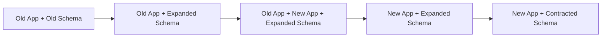
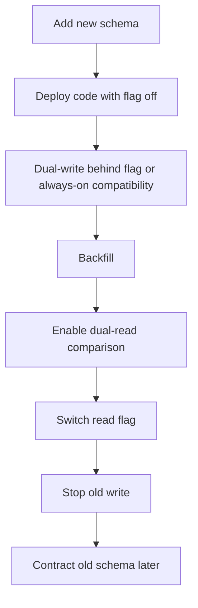
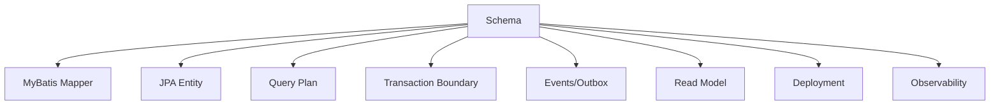

# Part 042 — Schema Evolution and Backward Compatibility

Schema evolution adalah proses mengubah database schema tanpa merusak aplikasi yang sedang berjalan, data lama, data baru, integrasi downstream, dan operational safety.

Dalam sistem enterprise Java/JAX-RS, schema evolution harus memperhitungkan:

- rolling deployment;
- multiple pod versions;
- MyBatis mapper SQL;
- JPA/Hibernate entity mapping;
- direct JDBC query;
- PostgreSQL locks and query planner;
- event/outbox schema;
- read model;
- backfill;
- rollback/roll-forward;
- cloud/on-prem deployment differences;
- data correctness selama compatibility window.

Prinsip utama:

> Schema evolution yang aman bukan “ubah schema lalu sesuaikan code”, tetapi choreography antara schema, code, data, deployment, and observability.

---

## 1. Why Backward Compatibility Matters

Dalam local development, app dan database sering berubah bersamaan.

Di production, biasanya tidak sesederhana itu:

- pod lama dan pod baru bisa berjalan bersamaan;
- migration bisa selesai sebelum semua pod update;
- rollback app bisa terjadi setelah schema berubah;
- consumer event lama masih membaca payload lama;
- cache/read model masih menyimpan bentuk lama;
- on-prem customer mungkin upgrade dengan urutan berbeda;
- hybrid deployment mungkin punya latency dan operational constraints berbeda.

Backward compatibility diperlukan agar system tetap berjalan selama transisi.

---

## 2. Compatibility Window

Compatibility window adalah periode ketika dua atau lebih versi contract harus hidup bersama.



Selama window ini, sistem mungkin harus mendukung:

- old column dan new column;
- old table dan new table;
- old enum value dan new enum value;
- old event payload dan new event payload;
- old mapper SQL dan new mapper SQL;
- old JPA entity assumptions dan new entity assumptions.

Backward compatibility adalah desain untuk window ini.

---

## 3. Add Column

Adding a column is usually the safest schema evolution operation, but only if staged correctly.

### Safe case

```sql
ALTER TABLE quote ADD COLUMN status_reason text;
```

Why relatively safe:

- old app ignores the column;
- new app can start using it;
- existing rows remain valid;
- MyBatis inserts usually still work if column nullable;
- JPA entity can map it later.

### Risky case

```sql
ALTER TABLE quote ADD COLUMN status_reason text NOT NULL;
```

Risks:

- existing rows violate constraint;
- old app insert fails if no default;
- MyBatis explicit insert misses column;
- JPA entity may flush null;
- rolling deployment breaks.

### Safer sequence

1. Add nullable column.
2. Deploy app that writes it.
3. Backfill old rows.
4. Verify no nulls remain.
5. Add NOT NULL constraint.

---

## 4. Rename Column

Renaming a column is dangerous in rolling deployment.

Unsafe:

```sql
ALTER TABLE quote RENAME COLUMN status TO quote_status;
```

Old app will fail immediately.

Safer expand-contract:

```sql
ALTER TABLE quote ADD COLUMN quote_status text;
```

Then:

1. write both columns;
2. backfill new from old;
3. read new with fallback;
4. stop writing old;
5. drop old later.

Application transition:

```java
String resolvedStatus = quoteStatus != null ? quoteStatus : status;
```

This fallback should be temporary and tracked for removal.

---

## 5. Drop Column

Dropping a column is a contract removal.

Never drop a column just because new code no longer uses it.

Before dropping, verify:

- no old app version reads it;
- no MyBatis mapper references it;
- no JPA entity maps it;
- no JDBC SQL references it;
- no view/function/trigger references it;
- no report/read model depends on it;
- no downstream CDC/event process needs it;
- no rollback requires it;
- no operational script references it.

Safer sequence:

1. Stop writing column.
2. Stop reading column.
3. Remove code references.
4. Deploy and observe.
5. Confirm no DB-level references.
6. Drop column in later release.

Dropping should often be delayed until confidence is high.

---

## 6. Change Column Type

Changing type can be risky because it affects:

- storage;
- casts;
- indexes;
- query plans;
- MyBatis TypeHandler;
- JPA AttributeConverter;
- enum mapping;
- JSON serialization;
- API contract;
- existing data validity.

Unsafe direct change:

```sql
ALTER TABLE quote ALTER COLUMN amount TYPE numeric(18,2);
```

Potential issues:

- lock/table rewrite;
- data cannot cast;
- precision loss;
- query plan changes;
- Java type mismatch.

Safer approach:

1. Add new typed column.
2. Dual-write old and new values.
3. Backfill with explicit conversion.
4. Validate conversion correctness.
5. Switch reads.
6. Drop old column later.

---

## 7. Add Table

Adding a new table is usually safe if no old app depends on it.

Review still required:

- primary key strategy;
- foreign keys;
- indexes;
- tenant columns;
- audit fields;
- soft delete fields;
- effective date fields;
- migration ownership;
- repository ownership;
- mapper/entity mapping;
- data retention/privacy classification.

Example:

```sql
CREATE TABLE quote_adjustment (
  id uuid PRIMARY KEY,
  quote_id uuid NOT NULL REFERENCES quote(id),
  adjustment_type text NOT NULL,
  amount numeric(18,2) NOT NULL,
  created_at timestamptz NOT NULL
);
```

Questions:

- should `quote_id` be indexed?
- should delete cascade exist or not?
- is `adjustment_type` constrained?
- is money precision correct?
- are audit/tenant fields required?

---

## 8. Split Table

Splitting a table is high-risk because it changes data ownership and query shape.

Example: split `quote` into:

- `quote`;
- `quote_pricing_snapshot`;
- `quote_customer_context`.

Risks:

- joins become required;
- JPA relationship mapping changes;
- MyBatis ResultMap changes;
- transaction writes span more tables;
- partial migration leaves inconsistent rows;
- old reports break;
- event payload construction changes;
- indexes need redesign.

Safe strategy:

1. Create new tables.
2. Dual-write old and new structure.
3. Backfill historical data.
4. Validate row count and checksum-like invariants.
5. Switch read path.
6. Stop old writes.
7. Remove old columns later.

---

## 9. Merge Table

Merging tables also changes ownership and cardinality.

Risks:

- duplicate row semantics;
- nullability changes;
- constraint conflicts;
- larger row width;
- slower scans;
- lock/contention changes;
- unclear source of truth during transition.

Review:

- what is the canonical source during migration?
- are writes dual-written?
- what happens if one write succeeds and the other fails?
- how is consistency verified?
- how are old foreign keys handled?
- how are read models updated?

Merging is not merely SQL refactoring. It is domain model migration.

---

## 10. Add Index

Adding an index is often backward-compatible, but not free.

Benefits:

- faster reads;
- support pagination;
- support uniqueness;
- reduce lock wait in some access patterns;
- support tenant filtering;
- support foreign key joins.

Costs:

- slower writes;
- more disk;
- more vacuum/index maintenance;
- migration time;
- lock/IO impact;
- possible planner changes.

Index should be tied to query evidence.

Example query:

```sql
SELECT *
FROM quote
WHERE tenant_id = :tenantId
  AND status = :status
ORDER BY created_at DESC
LIMIT 50;
```

Possible index:

```sql
CREATE INDEX CONCURRENTLY idx_quote_tenant_status_created
ON quote (tenant_id, status, created_at DESC);
```

But validate with `EXPLAIN` and real cardinality assumptions.

---

## 11. Drop Index

Dropping index can break performance after deploy.

Before dropping:

- check query usage;
- check slow query logs;
- check index scan stats if available;
- check constraints using the index;
- check read model/reporting queries;
- check batch jobs;
- check tenant-specific queries;
- check fallback plan.

Index may look unused in a short observation window but still serve monthly/quarterly jobs.

Do not drop index without operational evidence.

---

## 12. Add Constraint

Constraints are correctness tools.

Types:

- NOT NULL;
- UNIQUE;
- CHECK;
- FOREIGN KEY;
- EXCLUDE;
- partial unique index;
- domain-specific constraints.

Adding a constraint has two questions:

1. Does existing data satisfy it?
2. Can all current app versions continue writing valid data?

Example:

```sql
ALTER TABLE quote
ADD CONSTRAINT chk_quote_total_non_negative
CHECK (total_amount >= 0);
```

Review:

- can old app write negative total?
- should validation happen earlier too?
- should failure map to domain error?
- does backfill/correction need to happen first?

---

## 13. Remove Constraint

Removing constraint increases freedom but may weaken correctness.

Before removing:

- identify why constraint exists;
- check domain invariant impact;
- check application validation replacement;
- check downstream assumption;
- check audit/compliance impact;
- check data quality monitoring.

A removed constraint can silently allow corrupted states that later code cannot handle.

---

## 14. Backfill Strategy

Backfill is data evolution.

Backfill design dimensions:

| Dimension | Question |
|---|---|
| Correctness | How is new value derived? |
| Scope | Which rows are affected? |
| Idempotency | Can it be retried safely? |
| Chunking | Does it avoid huge transaction? |
| Locking | Does it block live traffic? |
| Observability | How do we measure progress? |
| Verification | How do we prove completion? |
| Roll-forward | How do we fix partial failure? |

Example verification:

```sql
SELECT COUNT(*)
FROM quote
WHERE new_column IS NULL;
```

For complex backfill, verify by domain invariant, not only null count.

---

## 15. Dual-Write

Dual-write means application writes both old and new schema during transition.

Example:

```java
quoteRepository.updateStatusBothColumns(quoteId, status);
```

It may write:

```sql
UPDATE quote
SET status = :status,
    quote_status = :status
WHERE id = :id;
```

Risks:

- one path forgotten;
- old and new values diverge;
- MyBatis and JPA write models differ;
- retry writes only one side;
- audit triggers fire differently;
- validation differs;
- transaction boundary incomplete.

Dual-write must be:

- temporary;
- tested;
- monitored;
- owned;
- removed after migration.

---

## 16. Dual-Read

Dual-read means application can read old and new schema during transition.

Pattern:

```java
String status = row.getQuoteStatus() != null
    ? row.getQuoteStatus()
    : row.getStatus();
```

Risks:

- fallback hides incomplete backfill;
- stale old value wins accidentally;
- query cannot use index efficiently;
- JPA projection becomes awkward;
- MyBatis mapper becomes more complex;
- business semantics become unclear.

Dual-read must have an exit plan.

After backfill and validation, remove fallback.

---

## 17. Read Switch

Read switch is the moment application stops relying on old schema.

Can be controlled by:

- feature flag;
- config toggle;
- deployment version;
- environment-specific rollout;
- tenant-by-tenant rollout.

Review:

- can new read path handle all historical data?
- are indexes ready?
- are query plans validated?
- are null/invalid cases handled?
- is fallback still available?
- are dashboards comparing old vs new result?

For high-risk migrations, compare old and new read results before switching fully.

---

## 18. Write Switch

Write switch is when application stops writing old schema.

Before switching:

- all readers must use new schema;
- backfill must be complete;
- old app versions must be gone;
- event/CDC/read model consumers must be compatible;
- rollback plan must be reviewed.

After switching:

- monitor old column/table for unexpected writes;
- log if fallback read is still used;
- alert on divergence;
- plan contract migration.

---

## 19. Contract Phase

Contract phase removes old schema.

Examples:

- drop old column;
- drop old table;
- remove compatibility view;
- remove old trigger;
- remove old function signature;
- remove dual-read/dual-write code;
- remove old index.

Contract phase should usually be separate from expand and switch phases.

Why:

- gives observation time;
- allows rollback of app behavior;
- reduces blast radius;
- simplifies incident response.

---

## 20. MyBatis Compatibility Concerns

Schema evolution with MyBatis requires SQL audit.

Concern areas:

- explicit `INSERT` column list;
- explicit `SELECT` column list;
- ResultMap column aliases;
- dynamic WHERE conditions;
- dynamic ORDER BY whitelist;
- TypeHandler for changed types;
- nested result mapping after table split;
- nested select after relationship changes;
- bulk update paths;
- stored procedure signatures.

A migration is not safe for MyBatis until affected mappers have been searched and tested.

Useful search terms:

- old table name;
- old column name;
- ResultMap id;
- SQL alias;
- TypeHandler class;
- procedure/function name.

---

## 21. JPA/Hibernate Compatibility Concerns

Schema evolution with JPA requires entity metadata audit.

Concern areas:

- `@Table`;
- `@Column`;
- `@JoinColumn`;
- `@JoinTable`;
- `@Enumerated`;
- `@Convert`;
- `@Version`;
- sequence generator;
- nullable/optional mismatch;
- relationship cardinality;
- cascade/orphan removal;
- entity graph/fetch join query.

Hibernate may fail at:

- application startup if validation is enabled;
- first select;
- flush;
- commit;
- lazy loading;
- bulk update;
- native query result mapping.

Do not rely on compilation as proof.

---

## 22. Direct JDBC Compatibility Concerns

Direct JDBC requires manual audit.

Search for:

- SQL string literals;
- table/column names;
- ResultSet labels/indexes;
- CallableStatement signatures;
- generated key assumptions;
- manual row mappers;
- SQLState handling;
- transaction scripts.

Direct JDBC is powerful but has low metadata safety.

Schema evolution must include targeted tests for direct JDBC code paths.

---

## 23. Event and Read Model Compatibility

Schema changes can affect event-driven paths.

Examples:

- event payload field renamed;
- outbox table changed;
- CDC topic schema changed;
- read model projection changes;
- idempotency table changes;
- replay logic changes;
- reconciliation query changes.

Compatibility questions:

- Can old consumers process new events?
- Can new consumers process old events?
- Does outbox publisher tolerate mixed rows?
- Does replay read old schema?
- Does read model rebuild still work?
- Does Debezium/CDC need config update?

Schema evolution in event-driven systems is contract evolution.

---

## 24. API Compatibility vs Schema Compatibility

Do not confuse API compatibility with schema compatibility.

A REST API can remain unchanged while schema changes drastically.

But schema evolution can still break API behavior by:

- changing default values;
- changing uniqueness rules;
- changing sorting order;
- changing pagination stability;
- changing null handling;
- changing effective-date resolution;
- changing soft-delete visibility;
- changing tenant isolation.

Test API behavior around schema changes, not just persistence code.

---

## 25. PostgreSQL-Specific Compatibility Considerations

PostgreSQL details matter.

Review:

- lock level of DDL;
- table rewrite risk;
- index creation strategy;
- constraint validation strategy;
- enum type evolution;
- JSONB path changes;
- function/procedure signature changes;
- trigger behavior;
- sequence ownership;
- default expression behavior;
- query planner statistics after change.

A schema change can be syntactically correct and operationally dangerous.

---

## 26. Enum Evolution

PostgreSQL enum or application enum changes need care.

Risks:

- Java enum lacks DB value;
- DB enum lacks Java value;
- old app cannot read new value;
- MyBatis TypeHandler fails;
- JPA enum mapping fails;
- event consumer rejects new value.

Safer rule:

- add support in readers before writers emit new value;
- avoid removing enum value during compatibility window;
- map unknown values defensively where appropriate;
- validate downstream consumers.

For mission-critical systems, enum evolution is distributed contract evolution.

---

## 27. JSONB Schema Evolution

JSONB gives flexibility but can hide schema evolution.

Risks:

- application expects key that old rows do not have;
- query uses JSONB path missing in old data;
- index does not support new JSONB query;
- MyBatis TypeHandler maps old/new shapes differently;
- JPA converter fails on missing field;
- API exposes inconsistent shape.

Review:

- is JSONB shape versioned?
- is defaulting explicit?
- are old rows backfilled?
- are JSONB indexes updated?
- are unknown fields tolerated?
- are tests covering old and new shape?

JSONB reduces DDL frequency, not schema responsibility.

---

## 28. Feature Flag Pattern for Schema Evolution

Feature flags can manage read/write switching.



Useful flags:

- write new column;
- read new column;
- compare old/new results;
- use new query path;
- publish new event version;
- enable new constraint behavior at app layer.

Flags must not become permanent compatibility debt.

---

## 29. Observability During Schema Evolution

Observe the transition directly.

Useful metrics/logs:

- old read fallback count;
- old write count;
- new write count;
- null count for new column;
- backfill progress;
- divergence count between old/new values;
- constraint violation count;
- SQL exception count;
- slow query count;
- lock wait duration;
- migration duration;
- outbox publish failures;
- read model lag.

A schema rollout without observability is a blind migration.

---

## 30. Testing Backward Compatibility

Good tests simulate version overlap.

Test scenarios:

- old code against expanded schema;
- new code against old-compatible schema if deployment order allows;
- new code against partially backfilled data;
- mapper reads old and new column shape;
- JPA entity handles nullable transition;
- event publisher handles old outbox rows;
- read model rebuild handles old data;
- rollback app version still works after expand migration.

Integration tests with real PostgreSQL are important.

Mocks rarely catch schema compatibility bugs.

---

## 31. Example: Safe Column Rename with MyBatis

Goal: rename `status` to `quote_status`.

### Phase 1: Expand

```sql
ALTER TABLE quote ADD COLUMN quote_status text;
```

### Phase 2: MyBatis dual-write

```xml
<update id="updateQuoteStatus">
  UPDATE quote
  SET status = #{status},
      quote_status = #{status}
  WHERE id = #{quoteId}
</update>
```

### Phase 3: Dual-read

```xml
<select id="findQuoteStatus" resultType="string">
  SELECT COALESCE(quote_status, status) AS status
  FROM quote
  WHERE id = #{quoteId}
</select>
```

### Phase 4: Backfill

```sql
UPDATE quote
SET quote_status = status
WHERE quote_status IS NULL;
```

### Phase 5: Switch to new column

```xml
<select id="findQuoteStatus" resultType="string">
  SELECT quote_status
  FROM quote
  WHERE id = #{quoteId}
</select>
```

### Phase 6: Contract later

```sql
ALTER TABLE quote DROP COLUMN status;
```

Each phase should be independently deployable.

---

## 32. Example: Safe Column Rename with JPA

JPA is trickier because entity fields map to columns.

During transition, entity may temporarily map both fields:

```java
@Column(name = "status")
private String status;

@Column(name = "quote_status")
private String quoteStatus;

public String resolvedStatus() {
    return quoteStatus != null ? quoteStatus : status;
}

public void changeStatus(String newStatus) {
    this.status = newStatus;
    this.quoteStatus = newStatus;
}
```

This is transitional code.

Risks:

- dirty checking may update both columns;
- business code may read wrong field directly;
- validation may apply to one field only;
- projection query may bypass fallback;
- old field removal must be coordinated.

For high-risk transitions, prefer explicit repository methods or DTO projections over spreading fallback logic across domain code.

---

## 33. Example: Split Table with Read Model

Goal: move pricing snapshot from `quote` to `quote_pricing_snapshot`.

Phases:

1. Create new table.
2. Add repository write path for new table.
3. Dual-write quote pricing to old columns and new table.
4. Backfill historical snapshots.
5. Compare old and new read results.
6. Switch read model to new table.
7. Stop writing old pricing columns.
8. Drop old columns later.

Review:

- is pricing snapshot immutable?
- is quote update transaction writing both records?
- does outbox event use old or new source?
- do reports join new table?
- are indexes supporting quote lookup?
- is backfill deterministic?

Table split usually deserves ADR.

---

## 34. Internal Verification Checklist

Use this checklist inside CSG/team context. Verify; do not assume.

### Deployment and Compatibility

- Does the team use rolling deployment, blue-green, canary, or manual deployment?
- Can old and new app versions run at the same time?
- Does database migration run before or after app deploy?
- Is app rollback possible after migration?
- Are on-prem and cloud deployments ordered differently?
- Are feature flags available for read/write switch?

### Codebase Search

- Which MyBatis mappers reference changed table/columns?
- Which JPA entities map changed table/columns?
- Which repositories expose affected business contract?
- Which direct JDBC SQL strings reference changed schema?
- Which tests cover old/new schema behavior?
- Which batch jobs/reports/reference-data scripts are affected?

### Data and Backfill

- How large is the affected table?
- Is existing data clean enough for new constraint/type?
- Is backfill required?
- Is backfill chunked and idempotent?
- Is there a verification query?
- Is there a divergence check for dual-write?
- Is there a data repair plan?

### Event/Integration

- Does schema change affect outbox/inbox?
- Does it affect Kafka/RabbitMQ payload construction?
- Does it affect CDC/Debezium?
- Does it affect read models?
- Does it affect downstream consumers?
- Does event replay still work?

### PostgreSQL Operations

- Does DDL acquire locks on hot table?
- Are indexes created/dropped safely?
- Are constraints validated safely?
- Are statement/lock timeouts configured?
- Is query plan impacted?
- Are DB metrics monitored during rollout?

### Governance

- Does this change need ADR?
- Does it need DBA/platform/SRE review?
- Is contract phase tracked as follow-up?
- Is temporary dual-read/write code tracked for removal?
- Are operational dashboards and alerts ready?

---

## 35. PR Review Checklist

For schema evolution PRs, ask:

- What exact schema contract is changing?
- Is this additive, destructive, or semantic?
- Can old app run after migration?
- Can new app tolerate old/partial data?
- Is expand-contract needed?
- Is there a compatibility window?
- Are dual-read/dual-write paths needed?
- Are MyBatis mappers updated?
- Are JPA entities updated?
- Are direct JDBC paths updated?
- Are migrations and app changes ordered safely?
- Is backfill required and safe?
- Are indexes/constraints safe on production data?
- Are event/read model contracts affected?
- Is temporary code tracked for deletion?
- What monitoring proves rollout health?
- What is the roll-forward plan?

---

## 36. Common Anti-Patterns

Avoid these:

- direct rename of column in rolling deployment;
- direct drop of column used by old app;
- direct type change on hot table without review;
- adding NOT NULL before app writes the value;
- adding constraint before cleaning existing data;
- assuming JSONB means no schema evolution;
- leaving dual-write forever;
- leaving fallback dual-read forever;
- switching reads before backfill validation;
- dropping old index without query evidence;
- ignoring downstream consumers;
- forgetting direct JDBC string SQL;
- relying on compile success for JPA compatibility;
- relying on mapper XML search without integration tests.

---

## 37. Senior Engineer Mental Model

Schema evolution should be reviewed as a distributed change:



A safe schema evolution plan answers:

- how data changes;
- how code changes;
- how deployment is ordered;
- how old and new versions coexist;
- how correctness is verified;
- how production health is observed;
- how temporary compatibility logic is removed.

---

## 38. Key Takeaways

- Backward compatibility matters because production deployment is rarely atomic.
- Compatibility window is the central concept in safe schema evolution.
- Additive changes are safer than destructive changes, but still need review.
- Rename/drop/type-change should usually follow expand-contract.
- Backfill must be idempotent, observable, and verifiable.
- Dual-read and dual-write are temporary migration tools, not permanent design patterns.
- MyBatis, JPA, JDBC, event consumers, read models, and operational scripts must all be checked.
- Schema evolution is not database-only work; it is architecture work.

