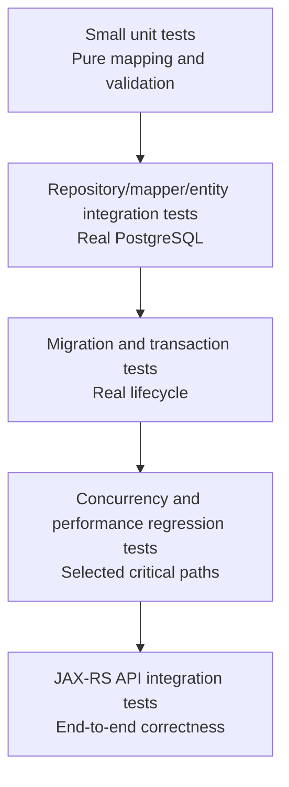
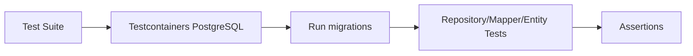
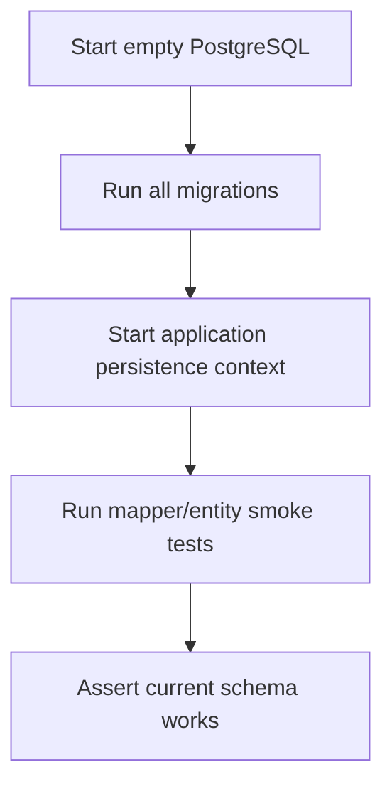
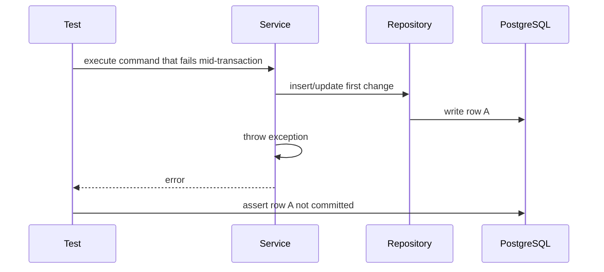
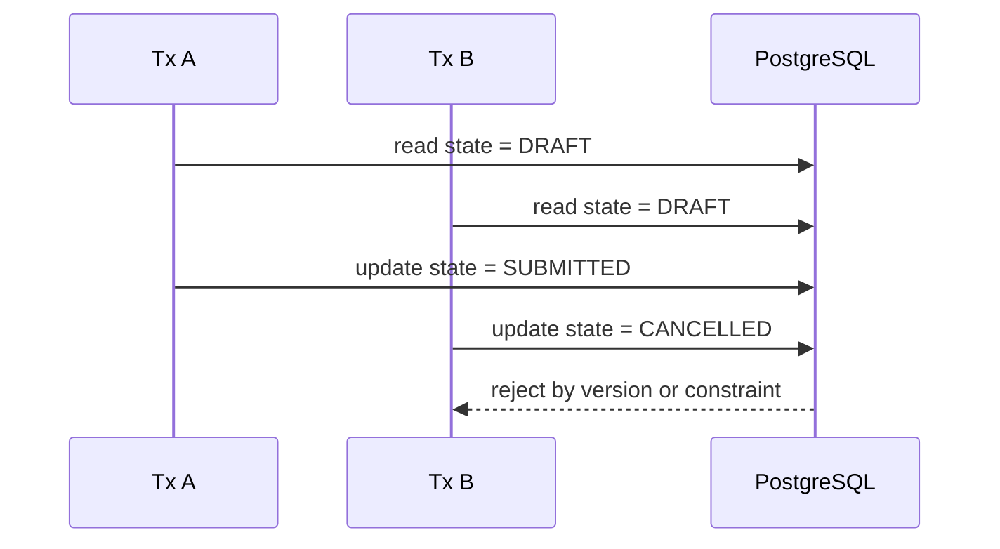
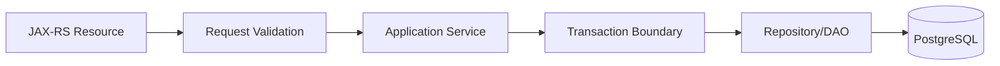
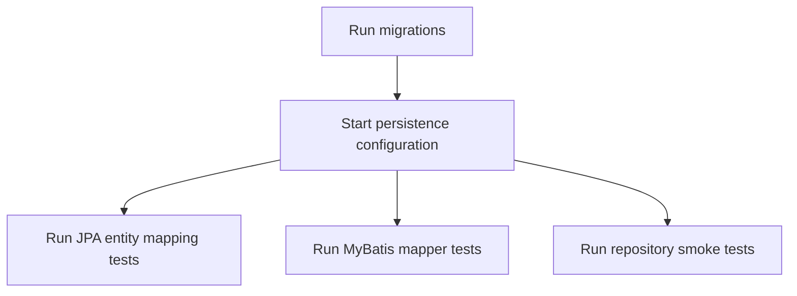
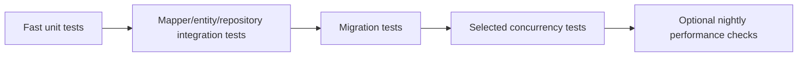

# Part 043 — Testing Persistence Layer

Persistence layer testing bukan sekadar memastikan repository method mengembalikan object.

Dalam enterprise Java/JAX-RS system, persistence test harus membuktikan bahwa:

- SQL benar secara syntax dan semantics;
- mapper/entity cocok dengan schema PostgreSQL nyata;
- transaction boundary bekerja sesuai ekspektasi;
- migration bisa dijalankan dari awal sampai versi terbaru;
- constraint database menjaga invariant yang benar;
- concurrency behavior tidak merusak data;
- query tidak diam-diam menjadi terlalu lambat;
- read/write path tetap benar saat ada MyBatis, JPA/Hibernate, JDBC, cache, event, dan migration;
- production failure dapat direproduksi secara lokal atau di CI.

Testing persistence layer adalah cara membuktikan bahwa code Java dan database contract benar-benar kompatibel.

Prinsip utama:

> Do not test persistence by pretending the database does not exist.

Mock punya tempat, tetapi mock tidak bisa membuktikan PostgreSQL behavior.

---

## 1. Why Persistence Layer Needs Serious Tests

Persistence layer punya karakteristik berbeda dari pure application logic.

Ia bergantung pada:

- schema fisik;
- SQL dialect PostgreSQL;
- transaction isolation;
- lock behavior;
- index dan planner;
- connection pool;
- driver JDBC;
- MyBatis mapper XML;
- JPA/Hibernate mapping;
- migration order;
- trigger/function/procedure;
- timezone dan type conversion;
- concurrent write;
- database constraint.

Unit test biasa tidak cukup untuk semua itu.

Contoh bug yang sering lolos jika hanya memakai mock:

- nama column salah di mapper XML;
- ResultMap tidak match alias query;
- enum value tidak cocok dengan database;
- JSONB TypeHandler gagal saat null;
- JPQL valid di compile time tetapi error runtime;
- migration menambahkan NOT NULL tanpa default;
- optimistic locking tidak benar;
- SELECT FOR UPDATE tidak mengunci row yang dimaksud;
- transaction rollback tidak mencakup outbox insert;
- query pagination tidak stable;
- PostgreSQL function berubah signature;
- Hibernate lazy relation memicu N+1;
- bulk update membuat persistence context stale.

Persistence test harus menangkap bug seperti ini sebelum production.

---

## 2. Persistence Test Taxonomy

Gunakan taxonomy yang jelas agar test tidak bercampur tanpa tujuan.

| Test Type | Tujuan | Database Nyata? | Cocok Untuk |
|---|---|---:|---|
| Unit test | Pure mapping/helper logic | Tidak | mapper helper, specification builder, validator |
| Repository integration test | Repository/DAO terhadap PostgreSQL | Ya | CRUD, query, constraint, transaction |
| Mapper test | MyBatis mapper XML/interface | Ya | ResultMap, dynamic SQL, TypeHandler |
| Entity mapping test | JPA/Hibernate mapping | Ya | table/column/relationship/lifecycle |
| Migration test | Validasi migration chain | Ya | schema evolution, repeatable migration |
| Transaction test | Commit/rollback/propagation | Ya | rollback rules, nested call, flush behavior |
| Concurrency test | Race condition dan lock | Ya | lost update, unique race, deadlock/retry |
| Query regression test | SQL shape/performance guard | Ya | N+1, query count, plan stability |
| End-to-end API test | JAX-RS endpoint sampai DB | Ya | API contract + persistence side effect |

Tidak semua method perlu semua jenis test.

Namun setiap write path kritikal harus punya kombinasi test yang membuktikan:

- data yang benar tersimpan;
- invariant dilindungi;
- transaction rollback benar;
- duplicate/concurrent request tidak merusak state;
- query utama tetap performan.

---

## 3. Test Pyramid for Persistence Layer

Test pyramid persistence tidak sama dengan test pyramid pure application.



Proporsi ideal:

- banyak unit test untuk pure logic;
- cukup banyak repository/mapper/entity integration test;
- migration test wajib untuk schema lifecycle;
- concurrency/performance test selektif untuk path kritikal;
- E2E test tidak terlalu banyak, tetapi mewakili business flow penting.

Anti-pattern:

- semua persistence behavior dimock;
- semua bug database hanya ditangkap manual QA;
- E2E test dipakai menggantikan repository test;
- migration tidak pernah diuji dari database kosong;
- test memakai H2 tetapi production memakai PostgreSQL;
- test hanya membuktikan happy path tanpa constraint/concurrency case.

---

## 4. Why Real PostgreSQL Matters

PostgreSQL bukan sekadar storage.

PostgreSQL punya behavior khusus:

- MVCC;
- isolation semantics;
- row lock;
- deadlock detection;
- JSONB operator;
- array type;
- enum type;
- sequence behavior;
- `RETURNING` clause;
- `ON CONFLICT` upsert;
- `SKIP LOCKED`;
- function/procedure/trigger;
- query planner;
- index behavior;
- timezone conversion;
- text/collation behavior.

Mock atau in-memory database tidak bisa merepresentasikan semua ini dengan akurat.

Jika production memakai PostgreSQL, persistence integration test kritikal harus memakai PostgreSQL juga.

Biasanya pilihan praktis:

- Testcontainers PostgreSQL;
- Docker Compose PostgreSQL untuk local workflow;
- ephemeral database di CI;
- isolated schema per test suite;
- migration-applied test database.

Rule of thumb:

> Use mock for pure application decisions. Use real PostgreSQL for persistence correctness.

---

## 5. Testcontainers Mental Model

Testcontainers membantu menjalankan PostgreSQL nyata selama test.

Mental model-nya:



Manfaat:

- schema nyata;
- PostgreSQL dialect nyata;
- migration bisa dijalankan;
- constraint nyata;
- query nyata;
- lock behavior lebih realistis;
- test lebih dekat ke production.

Trade-off:

- lebih lambat dari unit test;
- butuh Docker di local/CI;
- perlu fixture management;
- harus mengontrol test isolation;
- test parallel butuh desain database/schema isolation.

Jangan jadikan semua test sebagai Testcontainers test.

Gunakan untuk boundary yang memang perlu database.

---

## 6. Unit Tests Still Matter

Unit test tetap berguna untuk logic yang tidak membutuhkan database.

Contoh:

- request validation;
- command normalization;
- query object builder;
- pagination parameter validation;
- sort whitelist;
- mapping pure DTO ke command;
- business invariant sebelum repository call;
- retry classifier berdasarkan error code abstraction;
- idempotency key generation;
- SQL fragment builder jika benar-benar pure dan aman.

Namun unit test tidak boleh mengklaim bahwa query database benar.

Bad test smell:

```java
when(repository.findById(id)).thenReturn(Optional.of(entity));

service.handle(command);

verify(repository).save(any());
```

Test seperti ini hanya membuktikan service memanggil repository.

Ia tidak membuktikan:

- SQL benar;
- transaction commit;
- constraint database;
- optimistic locking;
- mapping schema;
- generated ID;
- audit field;
- actual data persisted.

Unit test berguna, tetapi bukan pengganti persistence integration test.

---

## 7. Repository Integration Tests

Repository integration test memvalidasi repository/DAO sebagai kontrak application layer ke database.

Fokusnya:

- method repository bekerja terhadap PostgreSQL nyata;
- input command/query diterjemahkan menjadi SQL atau EntityManager operation yang benar;
- output object sesuai contract;
- constraint dan transaction behavior benar;
- error mapping bisa diuji jika dekat dengan repository boundary.

Contoh coverage untuk repository write:

- insert success;
- generated key/ID benar;
- unique constraint violation;
- foreign key violation;
- null/check constraint violation;
- update existing row;
- update missing row;
- optimistic lock conflict;
- delete/soft delete;
- audit fields;
- transaction rollback.

Contoh coverage untuk repository read:

- find by ID;
- not found;
- filter by status;
- tenant filter;
- effective date filter;
- soft delete exclusion;
- pagination stable ordering;
- projection mapping;
- join result correctness.

Repository test harus menulis assertion terhadap database state, bukan hanya returned object.

---

## 8. Mapper Tests for MyBatis

MyBatis mapper test harus menganggap mapper XML/interface sebagai production code.

Yang perlu dibuktikan:

- mapper method bound ke statement XML yang benar;
- SQL syntax valid di PostgreSQL;
- parameter binding benar;
- `ResultMap` benar;
- dynamic SQL branch benar;
- TypeHandler benar;
- null handling benar;
- generated key/RETURNING behavior benar;
- transaction participation benar.

Mapper test sering lebih penting daripada service test untuk query-heavy feature.

Alasannya: bug MyBatis sering berada di XML, alias, dynamic branch, atau type conversion.

Detail khusus MyBatis dibahas di Part 044.

---

## 9. Entity Mapping Tests for JPA/Hibernate

JPA/Hibernate entity mapping test memvalidasi mapping runtime, bukan hanya annotation secara visual.

Yang perlu dibuktikan:

- entity bisa persist;
- ID generation benar;
- enum/converter benar;
- embedded object benar;
- relationship join benar;
- cascade behavior sesuai ekspektasi;
- orphan removal tidak menghapus data tak terduga;
- lazy loading tidak pecah di transaction boundary;
- optimistic lock bekerja;
- dirty checking menghasilkan update yang benar;
- flush timing tidak mengejutkan;
- native/JPQL query valid.

Test entity mapping harus memakai schema hasil migration.

Jika entity test membuat schema otomatis dari Hibernate, test itu berisiko tidak menangkap mismatch migration.

Rule:

> In enterprise systems, migrations own schema. Hibernate must adapt to schema, not silently replace it in tests.

---

## 10. Migration Tests

Migration test membuktikan bahwa database bisa dibangun dari migration history.

Minimal test:



Yang perlu diuji:

- migration bisa dijalankan dari kosong;
- repeatable migration valid;
- function/procedure/trigger compiled;
- seed/reference data ada;
- schema cocok dengan JPA entity;
- schema cocok dengan MyBatis mapper;
- data migration tidak melanggar constraint;
- rollback/roll-forward strategy jelas jika ada failure.

Untuk expand-contract:

- test versi lama aplikasi terhadap schema baru jika memungkinkan;
- test versi baru aplikasi terhadap schema transitional;
- test backfill idempotent;
- test dual-read/dual-write path.

Migration test penting karena migration failure sering menjadi incident deployment, bukan bug lokal.

---

## 11. Transaction Tests

Transaction test membuktikan commit/rollback semantics.

Hal yang perlu diuji:

- successful command commits all expected writes;
- exception menyebabkan rollback sesuai policy;
- checked/unchecked exception behavior sesuai framework;
- nested call propagation benar;
- `REQUIRES_NEW` benar-benar commit terpisah jika digunakan;
- savepoint behavior benar jika memakai nested transaction;
- outbox insert berada dalam transaction yang sama dengan aggregate write;
- external call tidak membuat transaction terlalu panjang;
- MyBatis dan JPA share transaction yang sama jika dipakai bersama.

Contoh bug yang harus bisa ditangkap:

- audit insert commit walau aggregate rollback, padahal tidak diinginkan;
- outbox event hilang karena tidak ikut transaction;
- mapper write terjadi di autocommit karena tidak participate ke transaction manager;
- JPA flush terjadi sebelum validation akhir;
- exception dimapping menjadi HTTP error tetapi transaction tidak rollback.

Test transaction harus sering mengecek database state setelah exception.

---

## 12. Rollback Test Pattern

Pattern penting:



Assertion penting:

- row yang ditulis sebelum error tidak committed;
- sequence gap boleh terjadi dan tidak harus dianggap bug;
- audit/outbox behavior sesuai desain;
- lock dilepas setelah rollback;
- idempotency state sesuai semantics.

Jangan hanya assert exception thrown.

Assert database state.

---

## 13. Concurrency Tests

Concurrency test membuktikan behavior saat dua atau lebih transaksi berjalan bersamaan.

Gunakan untuk path yang memiliki risiko:

- unique constraint race;
- duplicate submit;
- quote/order state transition;
- inventory/reservation-like decrement;
- approval/escalation transition;
- idempotency key claim;
- job queue with `SKIP LOCKED`;
- optimistic locking;
- pessimistic locking;
- saga/inbox/outbox processing.

Contoh skenario:



Concurrency test perlu hati-hati agar deterministic.

Teknik umum:

- `CountDownLatch` untuk sinkronisasi thread;
- explicit transaction boundaries;
- lock timeout pendek;
- test data kecil dan isolated;
- assertion terhadap final state;
- retry policy diuji secara eksplisit.

Jangan menulis concurrency test yang hanya “berharap race terjadi”.

Buat race condition secara terkontrol.

---

## 14. Query Performance Regression Tests

Tidak semua performance test harus benchmark besar.

Banyak regression dapat dicegah dengan guard sederhana:

- query count assertion;
- no N+1 assertion;
- max rows fixture untuk pagination;
- EXPLAIN plan smoke check untuk query kritikal;
- index usage check untuk query paling penting;
- timeout untuk test query lambat;
- limit terhadap result size;
- assertion bahwa endpoint tidak memuat relation besar tanpa projection.

Contoh guard:

- list endpoint tidak boleh mengeksekusi lebih dari 3 query;
- query search harus memakai stable ordering;
- pagination tidak boleh melakukan load semua rows;
- N+1 relation loading harus gagal test jika query count naik.

Performance regression test bukan pengganti load test.

Namun ia efektif untuk menangkap perubahan query shape yang jelas-jelas buruk.

---

## 15. Fixture Strategy

Persistence test butuh data.

Fixture buruk membuat test rapuh dan sulit dipahami.

Pilihan fixture:

| Strategy | Cocok Untuk | Risiko |
|---|---|---|
| SQL fixture | schema-level setup eksplisit | bisa verbose |
| Builder Java | domain setup readable | bisa menyembunyikan DB details |
| Factory helper | reuse setup umum | bisa menjadi terlalu magic |
| Migration seed data | reference data | coupling ke global state |
| Per-test insert | isolation kuat | setup panjang |

Prinsip fixture:

- data minimal;
- setup terlihat di test;
- gunakan nama jelas;
- hindari fixture global besar;
- jangan bergantung pada order test;
- jangan reuse mutable row antar test;
- pisahkan reference data dan scenario data;
- pastikan tenant/effective/soft-delete state eksplisit.

Bad fixture smell:

- test gagal jika dijalankan sendiri;
- test hanya berhasil jika urutan tertentu;
- fixture punya terlalu banyak row tidak relevan;
- field penting diisi default tersembunyi;
- assertion tidak jelas karena data terlalu generik.

---

## 16. Test Isolation

Persistence test harus isolated.

Beberapa strategi:

### 16.1 Transaction Rollback per Test

Test dibungkus transaction lalu rollback.

Pros:

- cepat;
- database bersih;
- cocok untuk repository read/write sederhana.

Cons:

- tidak menguji commit behavior nyata;
- async/outbox behavior bisa tidak terlihat;
- transaction propagation bisa berbeda;
- connection/session scope test bisa menyembunyikan bug.

### 16.2 Truncate Tables per Test

Data dibersihkan sebelum/sesudah test.

Pros:

- commit behavior lebih nyata;
- cocok untuk transaction tests.

Cons:

- lebih lambat;
- perlu urutan FK;
- perlu hati-hati dengan reference data.

### 16.3 New Schema/Database per Test Suite

Schema isolated per suite atau class.

Pros:

- parallel-friendly;
- kuat untuk migration tests.

Cons:

- setup lebih kompleks;
- resource lebih mahal.

Tidak ada satu strategi untuk semua.

Pilih berdasarkan apa yang ingin dibuktikan.

---

## 17. Testing with JAX-RS Request Lifecycle

Persistence tidak selalu diuji langsung dari repository.

Beberapa flow harus diuji dari JAX-RS boundary:



API integration test berguna untuk membuktikan:

- request DTO validation;
- error mapping;
- transaction rollback saat exception;
- response DTO mapping;
- idempotency behavior;
- security/tenant context propagation;
- audit user context;
- persistence side effect dari endpoint.

Namun jangan semua persistence behavior diuji dari API.

Repository/mapper/entity test lebih cepat dan lebih langsung untuk banyak kasus.

---

## 18. Testing PostgreSQL Constraints

Database constraint adalah bagian dari domain defense.

Test constraint penting untuk:

- `NOT NULL`;
- unique constraint;
- composite unique constraint;
- foreign key;
- check constraint;
- exclusion constraint jika ada;
- generated column jika ada;
- partial index behavior;
- tenant-aware uniqueness;
- effective date overlap prevention jika memakai constraint.

Contoh assertion:

- duplicate business key ditolak;
- duplicate idempotency key ditolak;
- invalid state transition ditolak jika dijaga DB;
- FK mencegah orphan reference;
- tenant A dan tenant B boleh punya same code jika uniqueness tenant-scoped;
- soft-deleted row tidak menghalangi uniqueness jika memakai partial unique index.

Constraint test harus memverifikasi SQLState atau exception category jika mapping error bergantung pada itu.

---

## 19. Testing Generated IDs and Sequences

Generated ID sering dianggap trivial, padahal bisa gagal di integration.

Yang perlu diuji:

- sequence name benar;
- allocation size JPA cocok dengan sequence behavior;
- generated key MyBatis/JDBC benar;
- `RETURNING` clause mapping benar;
- ID tersedia setelah persist/insert;
- rollback tidak diasumsikan mengembalikan sequence;
- ID type cocok antara Java dan PostgreSQL.

Jangan assert sequence tanpa gap.

Sequence gap normal terjadi saat rollback atau concurrent insert.

---

## 20. Testing Time, Timezone, and Temporal Logic

Persistence bugs sering muncul dari waktu.

Test untuk:

- `created_at` dan `updated_at`;
- application clock vs database clock;
- timezone conversion;
- date-only vs timestamp;
- effective date boundaries;
- valid-from inclusive/exclusive;
- soft delete timestamp;
- SLA timeout;
- audit ordering;
- retention/deletion logic.

Gunakan controllable clock di application layer jika memungkinkan.

Namun tetap test bagaimana value tersimpan di PostgreSQL.

---

## 21. Testing Soft Delete and Tenant Filters

Soft delete dan multi-tenancy harus diuji eksplisit.

Test minimal:

- query normal tidak mengembalikan soft-deleted row;
- admin/audit query boleh mengembalikan jika memang didesain;
- update tidak mengubah deleted row kecuali explicit restore;
- unique constraint behavior dengan deleted row benar;
- tenant A tidak bisa membaca tenant B;
- count query memakai filter yang sama;
- MyBatis mapper dan JPA repository konsisten.

Bug umum:

- list query filter soft delete, detail query tidak;
- count query lupa tenant filter;
- JPA filter aktif, MyBatis query lupa condition;
- Redis cache key tidak tenant-aware;
- reporting query membaca data deleted tanpa sadar.

---

## 22. Testing MyBatis + JPA Mixed Persistence

Jika satu service memakai MyBatis dan JPA, test harus membuktikan transaction dan state consistency.

Skenario penting:

### 22.1 JPA Write then MyBatis Read

- persist/update entity;
- flush jika MyBatis harus membaca perubahan;
- mapper read;
- assert mapper melihat expected state.

Tanpa flush, MyBatis mungkin membaca database sebelum Hibernate mengirim SQL.

### 22.2 MyBatis Write then JPA Read

- load entity ke persistence context;
- update row via MyBatis;
- read entity lagi via JPA;
- assert apakah stale state terjadi;
- gunakan clear/refresh jika dibutuhkan.

### 22.3 Same Transaction Shared

- JPA write;
- MyBatis write;
- throw exception;
- assert keduanya rollback.

### 22.4 Cache Safety

- MyBatis update row;
- JPA second-level cache jika ada;
- assert stale cache tidak terjadi atau cache disabled/evicted.

Mixed persistence tanpa test adalah high-risk design.

---

## 23. Testing Event-Driven Persistence

Persistence layer sering berhubungan dengan Kafka/RabbitMQ melalui outbox/inbox.

Test penting:

- aggregate write dan outbox insert berada dalam transaction yang sama;
- rollback menghapus aggregate dan outbox bersama;
- publisher hanya publish committed outbox row;
- duplicate event diproses idempotently;
- inbox table mencegah double processing;
- retry tidak membuat duplicate side effect;
- reconciliation bisa menemukan stuck outbox row;
- event payload cocok dengan persisted state.

Untuk test cepat, event broker bisa dimock di boundary publisher.

Namun outbox/inbox table harus diuji dengan PostgreSQL nyata.

---

## 24. Testing Migration + Application Compatibility

Migration tidak cukup diuji sendirian.

Yang ideal:



Jika memakai rolling deployment:

- app versi lama harus tetap jalan dengan schema expand;
- app versi baru harus jalan dengan schema transitional;
- contract step tidak boleh drop column yang masih dipakai;
- backfill harus idempotent;
- constraint baru harus ditambahkan setelah data valid.

Compatibility test tidak selalu mudah, tetapi untuk path kritikal sangat berharga.

---

## 25. Testing Query Result Shape

Query result shape harus diuji, terutama untuk projection.

Test:

- semua selected column mapped;
- alias benar;
- null value tidak memecahkan mapper/constructor;
- join duplicate tidak menggandakan parent object;
- order deterministic;
- pagination stable;
- count query match filter query;
- DTO projection tidak accidentally expose sensitive data;
- enum/string mapping benar.

Untuk MyBatis, ResultMap assertion penting.

Untuk JPA, DTO projection constructor/type matching penting.

---

## 26. Testing Error Mapping

Persistence error harus diterjemahkan ke domain/API error yang benar.

Test dari service/API boundary:

- unique violation menjadi conflict;
- not found menjadi 404 atau domain-specific error;
- validation/constraint violation menjadi 400/409 sesuai contract;
- deadlock/serialization failure masuk retry atau 503/409 sesuai policy;
- lock timeout tidak menjadi generic 500 tanpa context;
- sensitive SQL detail tidak muncul di response.

Jangan hanya test repository throws exception.

Test behavior yang dilihat caller.

---

## 27. Testing Security and Privacy in Persistence

Persistence test juga harus menangkap security/privacy issue.

Contoh:

- dynamic sorting memakai whitelist;
- SQL injection payload tidak mengubah query semantics;
- tenant filter tidak bisa dibypass;
- read-only endpoint tidak memakai write DB user jika architecture mendukung;
- sensitive columns tidak masuk projection publik;
- logs tidak mencetak full PII pada SQL parameter;
- test fixtures tidak memakai data produksi nyata.

Security test untuk persistence sering lebih efektif jika ditulis sebagai negative case.

---

## 28. Testing Observability Hooks

Observability bisa diuji secara terbatas.

Contoh:

- slow query warning emitted untuk query melewati threshold di test khusus;
- metric repository duration tercatat;
- transaction failure metric increment;
- deadlock/retry counter tercatat;
- SQL log redaction tidak membocorkan PII;
- correlation ID/user/tenant context ikut audit log.

Tidak semua observability perlu unit assertion.

Namun critical audit/metric/log redaction behavior sebaiknya punya test.

---

## 29. CI/CD Placement

Persistence tests harus dipisah berdasarkan biaya.

Contoh pipeline:



Rekomendasi praktis:

- unit test di setiap commit;
- integration persistence test di PR;
- migration test di PR;
- concurrency tests untuk path kritikal di PR atau nightly;
- heavier performance regression nightly atau pre-release;
- manual DBA review untuk migration berisiko tinggi.

Jangan membuat test suite terlalu lambat tanpa klasifikasi.

Kalau test lambat, engineer akan mencari cara melewatinya.

---

## 30. Common Persistence Testing Anti-Patterns

### 30.1 Mocking Repository and Calling It Persistence Test

Mock repository test bukan persistence test.

Ia hanya service unit test.

### 30.2 Using H2 for PostgreSQL-Specific Behavior

H2 tidak cukup untuk JSONB, MVCC, lock, function, planner, dan dialect behavior PostgreSQL.

### 30.3 Hibernate Auto-DDL in Tests While Production Uses Migration

Ini menyembunyikan mismatch schema.

### 30.4 One Giant Fixture for All Tests

Membuat test sulit dipahami dan rapuh.

### 30.5 Ignoring Negative Cases

Persistence bugs sering muncul di constraint, conflict, duplicate, timeout, dan rollback.

### 30.6 Testing Only Returned Object

Harus assert persisted database state.

### 30.7 No Concurrency Test for Concurrent Write Path

Jika path rawan race, happy path single-thread tidak cukup.

### 30.8 No Migration Test

Migration failure akan pindah ke deployment environment.

---

## 31. Debugging Failed Persistence Tests

Saat persistence test gagal, debug dengan urutan:

1. Pastikan migration applied.
2. Lihat SQL yang dieksekusi.
3. Lihat bound parameters.
4. Cek schema aktual.
5. Cek fixture data.
6. Re-run query di SQL console.
7. Cek transaction commit/rollback.
8. Cek persistence context/cache jika JPA.
9. Cek ResultMap/alias jika MyBatis.
10. Cek constraint dan SQLState.
11. Cek timezone/type conversion.
12. Cek test isolation.

Jangan langsung menyalahkan framework.

Biasanya failure ada di contract antara code, fixture, schema, dan transaction.

---

## 32. Java/JAX-RS Impact

Persistence test memengaruhi JAX-RS service karena endpoint behavior bergantung pada database side effect.

Yang perlu diuji di integration level:

- request validation sebelum transaction;
- transaction boundary di service method;
- repository exception mapping ke HTTP response;
- response DTO tidak expose entity internal;
- tenant/user context masuk persistence layer;
- idempotency key behavior;
- audit fields dari authenticated principal;
- pagination/filtering API contract;
- rollback saat endpoint gagal.

JAX-RS resource sebaiknya tipis.

Persistence behavior utama tetap diuji di service/repository layer.

---

## 33. PostgreSQL Impact

PostgreSQL-specific behavior harus diuji ketika digunakan.

Contoh:

- JSONB query;
- array mapping;
- enum type;
- function/procedure;
- trigger side effect;
- partial index;
- unique constraint race;
- `ON CONFLICT`;
- `RETURNING`;
- `FOR UPDATE SKIP LOCKED`;
- advisory lock;
- statement timeout;
- lock timeout.

Jangan menganggap SQL valid hanya karena string terlihat benar.

Run against PostgreSQL.

---

## 34. Transaction Boundary Impact

Testing harus membuktikan transaction boundary eksplisit.

Pertanyaan penting:

- method mana yang membuka transaction?
- repository boleh dipanggil di luar transaction?
- read-only transaction dipakai?
- MyBatis dan JPA memakai transaction manager yang sama?
- flush terjadi kapan?
- rollback rules apa?
- external event ditulis dalam transaction atau setelah commit?
- timeout transaction berapa?

Transaction yang tidak diuji sering menjadi sumber data partial dan ghost event.

---

## 35. Microservices and Event-Driven Impact

Dalam microservices, persistence test harus memperhatikan data ownership.

Yang perlu diuji:

- service tidak menulis table milik service lain;
- read model update idempotent;
- outbox event sesuai aggregate write;
- inbox deduplication;
- compensation state persist;
- saga step state transition;
- replay event aman;
- reconciliation query benar.

Jika service memakai Kafka/RabbitMQ, broker test bisa dipisah.

Namun persistence state untuk outbox/inbox harus nyata.

---

## 36. Kubernetes/Cloud/On-Prem Impact

Beberapa behavior sulit diuji di unit/integration lokal, tetapi harus masuk checklist:

- connection pool per pod;
- migration job ordering;
- secret rotation;
- network latency;
- DB max connections;
- read replica lag jika ada;
- rolling deployment compatibility;
- on-prem version differences;
- cloud PostgreSQL parameter differences.

Untuk test suite, minimal pastikan:

- migration tidak bergantung pada local-only assumption;
- tests tidak memakai hardcoded timezone/locale yang beda dari deployment;
- connection leak detection bisa muncul saat test;
- CI environment cukup mirip untuk database behavior utama.

---

## 37. Failure Modes

Persistence testing harus dirancang untuk menangkap failure mode berikut:

| Failure Mode | Test Signal |
|---|---|
| Mapper SQL salah | mapper integration test fail |
| Entity/schema mismatch | entity mapping test fail |
| Migration gagal | migration test fail |
| Constraint tidak ada | negative constraint test unexpectedly passes |
| Transaction partial commit | rollback assertion fail |
| Lost update | concurrency test final state invalid |
| N+1 | query count regression |
| Soft delete leak | deleted row appears in read test |
| Cross-tenant leak | tenant isolation test fail |
| Dynamic SQL injection | malicious input changes query result |
| Stale JPA context | mixed JPA/MyBatis test mismatch |
| Cache stale | read-after-write test fail |
| Bad pagination | duplicate/missing rows across pages |

---

## 38. Trade-Offs

Testing persistence deeply punya biaya.

| Decision | Benefit | Cost |
|---|---|---|
| Real PostgreSQL tests | correctness tinggi | lebih lambat |
| Testcontainers | reproducible | Docker dependency |
| Migration test every PR | deployment safety | CI time |
| Concurrency tests | race detection | complexity |
| Query count assertion | N+1 guard | framework instrumentation |
| Performance regression | early warning | flakiness risk |

Prinsipnya bukan “test everything deeply”.

Prinsipnya:

> Test the persistence risks that can corrupt data, break deployment, or cause production incidents.

---

## 39. Correctness Concerns

Persistence tests harus membuktikan correctness berikut:

- write atomicity;
- invariant enforcement;
- unique business key;
- tenant isolation;
- soft delete filtering;
- temporal validity;
- idempotency;
- version-based concurrency;
- event/outbox consistency;
- audit traceability;
- mapping completeness;
- error semantics;
- rollback behavior.

Jika correctness tidak diuji, ia hanya asumsi.

---

## 40. Performance Concerns

Test tidak harus menjadi full benchmark, tetapi harus mencegah regression jelas:

- N+1;
- accidental full table scan pada query kritikal;
- pagination load-all;
- missing limit;
- huge persistence context;
- unbounded result list;
- batch tanpa chunking;
- query count explosion;
- slow dynamic filter.

Gunakan performance guard yang stabil dan murah.

---

## 41. Security and Privacy Concerns

Persistence tests harus memperhatikan:

- SQL injection;
- dynamic sort injection;
- tenant filter bypass;
- sensitive projection leakage;
- PII in logs;
- unsafe test data;
- privilege assumption;
- audit traceability.

Security bugs di persistence layer sering punya dampak besar karena langsung menyentuh data.

---

## 42. Observability Concerns

Test suite bisa membantu memastikan observability tidak hilang.

Hal yang bisa dicek:

- repository metrics emitted;
- SQL logging redacted;
- transaction failure logged with correlation ID;
- retry attempts counted;
- audit trail created;
- outbox stuck event detectable.

Observability bukan hanya production concern.

Ia harus dirancang dan diuji sejak development.

---

## 43. PR Review Checklist

Saat review PR yang menyentuh persistence test, tanyakan:

- Apakah perubahan schema punya migration test?
- Apakah mapper/entity yang berubah punya integration test?
- Apakah negative constraint case diuji?
- Apakah rollback behavior diuji?
- Apakah query baru diuji dengan PostgreSQL nyata?
- Apakah pagination/filtering/sorting punya edge case test?
- Apakah tenant/soft-delete/effective-date filter diuji?
- Apakah concurrency risk punya test atau alasan eksplisit?
- Apakah MyBatis + JPA mixing diuji untuk stale state/flush?
- Apakah outbox/inbox/idempotency behavior diuji?
- Apakah test memakai fixture minimal dan jelas?
- Apakah test bisa berjalan di CI tanpa urutan khusus?
- Apakah sensitive data tidak bocor di fixture/log?
- Apakah performance regression guard diperlukan?

---

## 44. Internal Verification Checklist

Gunakan checklist ini di codebase/team internal.

### Test Infrastructure

- Cek apakah integration test memakai PostgreSQL nyata atau in-memory database.
- Cek apakah Testcontainers/Docker Compose tersedia.
- Cek bagaimana migration dijalankan dalam test.
- Cek apakah CI mendukung Docker/Testcontainers.
- Cek durasi test suite persistence.
- Cek parallel test strategy.
- Cek cleanup/isolation strategy.

### Repository/DAO Tests

- Cek coverage repository utama.
- Cek write path kritikal.
- Cek read path dengan filter kompleks.
- Cek negative constraint tests.
- Cek not-found behavior.
- Cek generated ID behavior.
- Cek transaction rollback tests.

### MyBatis Tests

- Cek mapper XML test coverage.
- Cek ResultMap tests.
- Cek dynamic SQL branch tests.
- Cek TypeHandler tests.
- Cek JSONB/array/enum tests.
- Cek SQL injection guard tests.
- Cek mapper SQL syntax validation.

### JPA/Hibernate Tests

- Cek entity mapping tests.
- Cek relationship loading tests.
- Cek N+1/query count tests.
- Cek flush/dirty checking tests.
- Cek optimistic/pessimistic lock tests.
- Cek native/JPQL query tests.
- Cek migration compatibility tests.

### Transaction and Concurrency

- Cek rollback rules.
- Cek propagation tests.
- Cek idempotency tests.
- Cek lost update tests.
- Cek unique race tests.
- Cek deadlock/serialization retry tests.
- Cek outbox transaction tests.

### Production Readiness

- Cek slow query regression approach.
- Cek performance dashboard linkage.
- Cek incident reproduction tests.
- Cek migration failure runbook.
- Cek DBA/platform involvement untuk high-risk tests.
- Cek policy untuk adding tests with persistence PRs.

---

## 45. Practical Testing Strategy by Change Type

| Change Type | Minimum Test Expected |
|---|---|
| Add mapper query | mapper integration test, result shape test |
| Add dynamic filter | branch tests, injection guard, pagination/count test |
| Add JPA entity field | migration test, entity mapping test |
| Add relationship | relationship loading test, N+1 guard |
| Add migration | migration chain test, compatibility check |
| Add unique constraint | duplicate negative test |
| Add command endpoint | API/service integration, rollback, idempotency if needed |
| Add batch job | chunking, transaction size, retry/idempotency test |
| Add outbox event | atomic write + outbox test |
| Mix MyBatis and JPA | flush/clear/stale state transaction test |
| Add tenant filter | cross-tenant negative test |
| Add soft delete | deleted row exclusion test |

---

## 46. Senior Engineer Heuristic

A senior engineer should not ask only:

> “Is there a test?”

Ask instead:

> “Which production failure does this test prevent?”

Good persistence tests are not just coverage.

They are executable evidence for:

- schema compatibility;
- data correctness;
- transaction safety;
- concurrency safety;
- operational diagnosability;
- migration readiness;
- production incident prevention.

---

## 47. Final Summary

Persistence layer testing must be stricter than ordinary unit testing because persistence bugs often become:

- corrupted data;
- failed deployment;
- slow production endpoint;
- duplicate event;
- cross-tenant exposure;
- broken audit trail;
- unreproducible concurrency incident.

The practical model:

- use unit tests for pure logic;
- use real PostgreSQL for persistence correctness;
- run migrations in test;
- test repository/mapper/entity behavior directly;
- test transaction rollback and propagation;
- test concurrency for critical write paths;
- add performance guards for query-heavy paths;
- verify security/privacy constraints;
- tie tests to production failure modes.

Persistence tests are not ceremony.

They are a safety net for the data contract that the system cannot afford to break.
