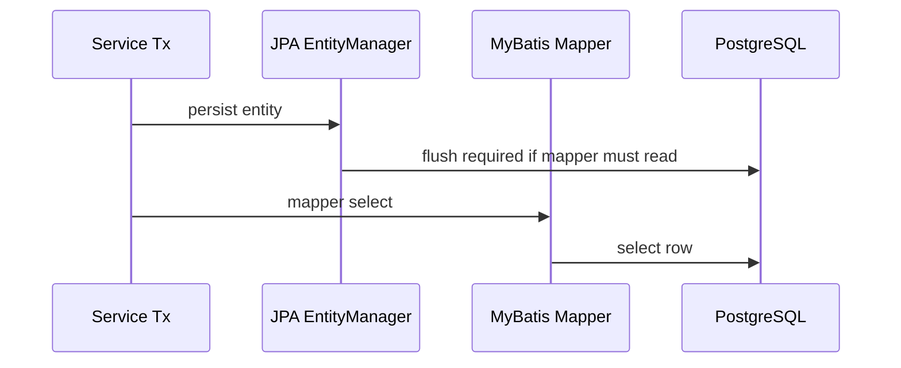

# Part 044 — MyBatis Testing

MyBatis test harus memperlakukan mapper sebagai production code.

Dalam MyBatis, banyak logic persistence tidak berada di Java class, tetapi di:

- mapper XML;
- SQL statement;
- `ResultMap`;
- dynamic SQL branch;
- parameter binding;
- custom `TypeHandler`;
- PostgreSQL-specific syntax;
- transaction integration;
- mapper method contract.

Karena itu, testing MyBatis tidak cukup dengan mock mapper interface.

Mock mapper hanya membuktikan service memanggil method.

Ia tidak membuktikan SQL, mapping, dynamic branch, type conversion, transaction, lock, atau PostgreSQL behavior.

Prinsip utama:

> A MyBatis mapper is executable SQL contract. Test it against the real database dialect.

---

## 1. What Makes MyBatis Testing Different

MyBatis berbeda dari JPA/Hibernate.

MyBatis tidak memiliki persistence context yang mengatur entity lifecycle.

MyBatis adalah SQL mapper.

Artinya:

- SQL adalah milik application code;
- query visibility tinggi;
- mapping manual/eksplisit;
- dynamic SQL powerful tetapi risky;
- framework tidak otomatis menjaga dirty checking;
- framework tidak otomatis memahami aggregate lifecycle;
- test harus membuktikan SQL dan mapping secara langsung.

Bug MyBatis biasanya muncul pada:

- typo column/table;
- salah alias;
- parameter name mismatch;
- `#{}` vs `${}`;
- dynamic SQL branch yang tidak valid;
- `ResultMap` nested salah;
- duplicate parent object dari join;
- null handling;
- TypeHandler salah;
- enum/JSONB/array mapping;
- pagination/sorting injection;
- update count tidak dicek;
- generated key tidak terisi;
- transaction tidak ikut rollback.

Semua ini perlu test nyata.

---

## 2. Minimum MyBatis Test Categories

| Category | What It Proves |
|---|---|
| Mapper load test | XML/interface binding valid |
| SQL syntax test | statement valid di PostgreSQL |
| ResultMap test | row mapped ke object dengan benar |
| Dynamic SQL branch test | semua kombinasi penting menghasilkan SQL valid |
| TypeHandler test | custom type conversion benar |
| Insert/update/delete test | write operation dan affected rows benar |
| Generated key test | ID/RETURNING behavior benar |
| Transaction test | mapper participate dalam transaction manager |
| Locking test | SELECT FOR UPDATE/NOWAIT/SKIP LOCKED behavior benar |
| Pagination/filtering test | stable result, count query, sorting safe |
| Injection guard test | input tidak mengubah SQL structure |
| PostgreSQL feature test | JSONB, array, enum, function/procedure benar |

Tidak semua mapper butuh semua kategori.

Namun mapper yang critical, complex, atau dynamic harus diuji lebih dalam.

---

## 3. Test Against Real PostgreSQL

Jika mapper memakai PostgreSQL syntax, test harus memakai PostgreSQL.

Contoh fitur yang tidak aman diuji dengan database lain:

- JSONB operators;
- array operators;
- enum type;
- `RETURNING`;
- `ON CONFLICT`;
- `FOR UPDATE SKIP LOCKED`;
- advisory lock;
- function/procedure;
- trigger side effect;
- partial index;
- `ILIKE` behavior;
- `DISTINCT ON`;
- recursive CTE;
- window function;
- planner/index behavior.

H2 atau mock tidak cukup.

Gunakan:

- Testcontainers PostgreSQL;
- Docker Compose PostgreSQL;
- ephemeral PostgreSQL di CI;
- schema hasil migration.

Rule:

> If the mapper SQL is PostgreSQL-specific, the test must execute on PostgreSQL.

---

## 4. Mapper Load Test

Mapper load test memastikan MyBatis configuration bisa memuat mapper.

Ia menangkap:

- XML invalid;
- namespace salah;
- statement id tidak match mapper method;
- duplicate statement id;
- missing ResultMap;
- TypeHandler tidak terdaftar;
- alias type salah;
- configuration invalid.

Test ini sering terjadi otomatis saat application context/persistence context start.

Namun pastikan CI benar-benar memuat seluruh mapper.

Failure yang ingin ditangkap:

```text
Invalid bound statement (not found)
```

atau:

```text
Could not resolve type alias
```

Jika mapper hanya gagal saat runtime path tertentu, berarti load coverage belum cukup.

---

## 5. SQL Syntax Test

SQL syntax test memastikan statement bisa dieksekusi.

Untuk query read:

- insert fixture;
- panggil mapper method;
- assert result.

Untuk write:

- panggil insert/update/delete;
- assert affected rows;
- query database state.

SQL syntax test tidak boleh hanya memanggil method tanpa assertion meaningful.

Bad:

```java
mapper.findByStatus("ACTIVE");
```

Better:

```java
List<QuoteRow> rows = mapper.findByStatus("ACTIVE");
assertThat(rows).extracting(QuoteRow::status).containsOnly("ACTIVE");
```

Lebih baik lagi:

- fixture berisi positive dan negative rows;
- assert filter benar;
- assert ordering benar;
- assert soft delete/tenant/effective-date behavior.

---

## 6. ResultMap Tests

`ResultMap` adalah sumber banyak bug MyBatis.

Yang perlu diuji:

- simple column-to-field mapping;
- alias join;
- constructor mapping;
- nested object mapping;
- collection mapping;
- discriminator mapping;
- null nested association;
- duplicate parent row handling;
- enum mapping;
- JSONB mapping;
- array mapping;
- timestamp mapping.

Contoh bug:

```xml
<result property="customerName" column="name"/>
```

Query join punya dua column `name` dari table berbeda.

Tanpa alias eksplisit, mapper bisa mengambil value yang salah.

Better:

```sql
SELECT
  q.id AS quote_id,
  q.name AS quote_name,
  c.name AS customer_name
FROM quote q
JOIN customer c ON c.id = q.customer_id
```

Dan ResultMap:

```xml
<result property="quoteName" column="quote_name"/>
<result property="customerName" column="customer_name"/>
```

Test harus membuktikan value tidak tertukar.

---

## 7. Testing Nested Select vs Nested Result

MyBatis mendukung nested select dan nested result.

Keduanya punya risk.

### Nested Select Risk

Nested select bisa menyebabkan N+1.

Test perlu assert query count jika instrumentation tersedia.

Scenario:

- query 10 parent rows;
- nested select memuat child per parent;
- total query menjadi 11;
- jika expected query 1 atau 2, test harus gagal.

### Nested Result Risk

Nested result memakai join.

Risk:

- duplicate parent;
- missing child;
- wrong collection grouping;
- memory besar untuk join lebar.

Test perlu fixture dengan:

- parent tanpa child;
- parent satu child;
- parent banyak child;
- child dengan null optional field;
- parent berbeda punya child berbeda.

Assertion harus memastikan object graph benar.

---

## 8. Dynamic SQL Branch Tests

Dynamic SQL harus diuji per branch penting.

MyBatis dynamic tags:

- `<if>`;
- `<choose>`;
- `<when>`;
- `<otherwise>`;
- `<where>`;
- `<trim>`;
- `<set>`;
- `<foreach>`;
- `<bind>`.

Test scenario harus mencakup:

- semua filter kosong;
- satu filter aktif;
- beberapa filter aktif;
- optional date range;
- null vs empty string;
- empty collection;
- large collection;
- dynamic sort;
- dynamic pagination;
- branch default;
- invalid input rejected before mapper.

Contoh dynamic SQL bug:

```xml
<where>
  <if test="status != null">
    AND status = #{status}
  </if>
  <if test="customerId != null">
    AND customer_id = #{customerId}
  </if>
</where>
```

Ini biasanya aman karena `<where>` membersihkan leading `AND`.

Namun jika ada dynamic `ORDER BY ${sort}` tanpa whitelist, itu injection risk.

Dynamic SQL test harus mencakup security negative cases.

---

## 9. Testing Parameter Binding

Parameter binding bug sering terjadi karena:

- mapper method punya banyak parameter tanpa `@Param`;
- XML memakai nama parameter yang salah;
- object parameter property typo;
- nullable parameter tidak di-handle;
- collection parameter salah nama;
- primitive default value ambigu;
- `${}` dipakai untuk value.

Test harus membuktikan:

- parameter value benar-benar dipakai;
- filter tidak ignored;
- null behavior sesuai desain;
- collection binding benar;
- malicious string tidak mengubah SQL.

Rule:

- pakai `#{}` untuk values;
- pakai `${}` hanya untuk identifier yang sudah whitelist;
- jangan pass raw user input ke `${}`.

---

## 10. Testing Dynamic Sorting Safely

Sorting sering membutuhkan dynamic SQL.

Bad:

```xml
ORDER BY ${sortBy} ${direction}
```

Jika `sortBy` berasal dari request, ini injection risk.

Better pattern:

- validate sort field di service/query object;
- map API field ke known SQL column;
- direction enum `ASC`/`DESC`;
- mapper hanya menerima safe SQL fragment dari whitelist internal;
- atau gunakan `<choose>` untuk known fields.

Test cases:

- sort by allowed field;
- sort direction ascending/descending;
- unknown field rejected before mapper;
- malicious field rejected;
- stable secondary ordering exists;
- pagination result deterministic.

Injection payload test:

```text
name desc; drop table quote; --
```

Expected:

- validation rejects;
- mapper not called;
- database unchanged.

---

## 11. Testing IN Clause and foreach

`<foreach>` sering dipakai untuk `IN` clause.

Test cases:

- one ID;
- many IDs;
- duplicate IDs;
- empty list;
- null list;
- large list;
- list with unauthorized tenant IDs;
- result order if order matters.

Empty list harus punya behavior eksplisit:

- return empty result tanpa query;
- atau query dengan `WHERE false`;
- atau reject input.

Jangan membiarkan SQL invalid:

```sql
WHERE id IN ()
```

Untuk list besar, pertimbangkan:

- temporary table;
- array binding;
- join against values;
- batch chunking;
- avoiding huge SQL string.

---

## 12. TypeHandler Tests

Custom `TypeHandler` harus punya test eksplisit.

Contoh TypeHandler:

- JSONB ke object;
- PostgreSQL array ke `List<String>`;
- enum domain ke database enum/string;
- encrypted field;
- money/decimal type;
- custom ID type;
- timestamp/timezone conversion.

Test harus mencakup:

- non-null value;
- null value;
- invalid database value;
- round-trip insert + select;
- backward compatibility value lama;
- JSON field missing;
- JSON extra field;
- enum unknown value handling.

Untuk JSONB:

- insert object;
- query by JSONB field;
- read back object;
- compare logical equality;
- test null JSON vs empty JSON.

TypeHandler bug sering tidak muncul sampai data nyata punya value edge case.

---

## 13. JSONB Mapper Tests

Jika mapper memakai JSONB, test harus PostgreSQL-native.

Test cases:

- insert JSONB;
- select JSONB;
- filter by JSON field;
- existence operator;
- containment operator;
- JSON path if used;
- missing key;
- null value;
- empty object;
- nested object;
- array inside JSON;
- index-backed query jika critical.

Contoh query:

```sql
SELECT id
FROM quote_snapshot
WHERE payload ->> 'status' = #{status}
```

Test harus memastikan:

- string compare sesuai;
- missing key tidak false positive;
- status dari column biasa tidak tertukar dengan status di JSON;
- JSONB TypeHandler round-trip benar.

---

## 14. Array and Enum Tests

PostgreSQL array dan enum butuh test nyata.

Array cases:

- empty array;
- null array;
- one item;
- multiple items;
- contains query;
- overlap query;
- order sensitivity jika relevan.

Enum cases:

- valid enum;
- unknown database value;
- Java enum rename risk;
- migration adding enum value;
- sorting/filtering enum;
- compatibility dengan old application version.

Jika enum PostgreSQL dipakai, migration test penting karena enum value addition punya constraint lifecycle tersendiri.

---

## 15. Insert Tests

Insert mapper harus diuji untuk:

- required fields;
- optional fields;
- generated key;
- default column value;
- audit fields;
- tenant field;
- enum field;
- JSONB field;
- unique constraint;
- foreign key;
- `RETURNING` mapping;
- row count.

Assertion penting:

- returned ID tidak null;
- row benar-benar ada di database;
- default value sesuai;
- audit timestamp/user sesuai;
- missing required field gagal;
- duplicate business key gagal.

Jika insert menggunakan explicit SQL column list, test akan menangkap column baru yang tidak diberi default ketika migration berubah.

---

## 16. Update Tests

Update mapper harus diuji untuk:

- update existing row;
- update missing row;
- affected row count;
- optimistic version check;
- updated timestamp/user;
- partial update;
- dynamic `<set>`;
- null field update semantics;
- tenant-safe update;
- soft-deleted row update behavior;
- status transition guard.

Affected row count sangat penting.

Jika optimistic update:

```sql
UPDATE quote
SET status = #{status}, version = version + 1
WHERE id = #{id}
  AND version = #{expectedVersion}
```

Test harus mencakup:

- expected version match: row count 1;
- expected version stale: row count 0;
- service menerjemahkan row count 0 menjadi concurrency error.

Jangan mengabaikan row count.

---

## 17. Delete and Soft Delete Tests

Untuk hard delete:

- row benar-benar hilang;
- FK behavior benar;
- delete missing row behavior jelas;
- cascade database jika ada disengaja.

Untuk soft delete:

- deleted flag/timestamp di-set;
- normal read tidak mengembalikan row;
- audit/admin read jika ada bisa melihat row;
- update normal tidak mengubah deleted row;
- unique constraint behavior sesuai desain;
- tenant filter tetap aktif.

Soft delete bug biasanya muncul karena satu mapper lupa `deleted_at IS NULL`.

Test setiap read mapper penting untuk table soft-deleted.

---

## 18. Pagination Tests

Pagination test harus membuktikan:

- page size dihormati;
- offset/cursor benar;
- stable ordering;
- no duplicate across pages;
- no missing row across pages dalam fixture statis;
- count query memakai filter yang sama;
- sort whitelist aman;
- large offset risk diketahui;
- keyset pagination menggunakan cursor benar.

Fixture minimal:

- beberapa row dengan sort key sama;
- secondary order by `id` atau created timestamp;
- row yang harus excluded karena tenant/soft delete/filter.

Tanpa stable ordering, pagination bisa flakey di production.

---

## 19. Count Query Tests

Banyak list API punya data query dan count query.

Bug umum:

- count query lupa filter;
- count query lupa tenant;
- count query lupa soft delete;
- count query join berbeda;
- count query menghitung duplicate karena join one-to-many;
- count query terlalu mahal.

Test:

- result list size for page;
- total count expected;
- filters same as data query;
- tenant/soft delete excluded;
- duplicate join not overcounted.

Jika count query mahal, desain API mungkin perlu reconsider.

---

## 20. Locking Tests

MyBatis sering memakai locking eksplisit SQL.

Contoh:

- `SELECT ... FOR UPDATE`;
- `FOR UPDATE NOWAIT`;
- `FOR UPDATE SKIP LOCKED`;
- advisory lock;
- manual optimistic lock via version column.

Test cases:

- transaction A locks row;
- transaction B blocked/rejected/skips row sesuai SQL;
- lock timeout handled;
- row released after commit/rollback;
- deadlock retry policy jika ada;
- job queue `SKIP LOCKED` tidak mengambil job sama dua kali.

Locking test harus memakai dua connection/transaction berbeda.

Satu transaction tidak bisa membuktikan blocking behavior.

---

## 21. Transaction Participation Tests

Mapper harus participate dalam transaction manager application.

Test penting:

- call service method transactional;
- mapper insert row;
- throw exception;
- assert row rollback;
- jika ada JPA write juga, assert keduanya rollback bersama;
- jika ada `REQUIRES_NEW`, assert behavior sesuai desain.

Jika MyBatis dikonfigurasi salah, mapper bisa autocommit di luar transaction.

Ini fatal untuk correctness.

Test transaction participation adalah wajib untuk mixed framework system.

---

## 22. Function and Procedure Call Tests

Jika mapper memanggil PostgreSQL function/procedure:

Test harus membuktikan:

- function exists;
- signature match;
- input parameter mapping benar;
- output parameter/result mapping benar;
- transaction behavior jelas;
- exception dari function dimapping benar;
- side effect ke table benar;
- trigger/function version sesuai migration.

Database logic harus diuji seperti application logic.

Jangan biarkan procedure menjadi blind spot.

---

## 23. Trigger Side Effect Tests

Trigger bisa mengubah data tanpa terlihat di mapper SQL.

Test untuk:

- audit trigger mengisi audit table;
- updated timestamp trigger;
- validation trigger;
- denormalized summary update;
- event/outbox trigger jika ada;
- trigger tidak double-run;
- trigger compatible dengan batch operation.

Jika trigger side effect penting untuk business correctness, mapper test harus assert side effect itu.

---

## 24. SQL Injection Guard Tests

MyBatis aman jika memakai `#{}` untuk value binding.

Namun risk muncul dari:

- `${}`;
- dynamic ORDER BY;
- dynamic table/column name;
- raw SQL fragment;
- LIKE pattern construction;
- function/operator injection;
- CSV string IN clause;
- user-controlled JSON path.

Test injection guard:

- malicious sort field rejected;
- malicious direction rejected;
- search keyword treated as value;
- LIKE wildcard semantics intentional;
- raw SQL fragment impossible dari API input;
- mapper not called when validation fails.

Payload examples:

```text
x' OR '1'='1
```

```text
name desc; drop table quote; --
```

```text
%'; update quote set status='APPROVED'; --
```

Expected:

- no extra rows returned;
- no table modified;
- validation error if identifier invalid;
- database schema intact.

---

## 25. LIKE Query Tests

LIKE/ILIKE query butuh test karena wildcard behavior bisa tidak sengaja.

Test:

- exact match;
- partial match;
- case-insensitive match jika memakai ILIKE;
- `%` input literal vs wildcard;
- `_` input literal vs wildcard;
- escape character;
- empty keyword;
- minimum keyword length;
- index/trigram strategy jika critical.

Jika user input `%` mengembalikan semua rows, apakah itu acceptable?

Harus eksplisit.

---

## 26. Batch Executor Tests

Jika memakai MyBatis batch executor:

Test harus mencakup:

- batch insert success;
- batch update success;
- partial failure handling;
- generated key behavior;
- flush statements;
- transaction rollback;
- memory usage untuk chunk besar;
- duplicate key in batch;
- retry strategy;
- idempotency.

Batch failure sering sulit didiagnosis karena error muncul saat flush, bukan saat method dipanggil.

Test harus assert behavior saat flush/commit.

---

## 27. Mapper Test Fixture Design

Fixture untuk mapper harus kecil dan jelas.

Contoh fixture untuk list query:

- row matching all filters;
- row wrong tenant;
- row soft deleted;
- row expired effective date;
- row different status;
- row same sort key;
- row with null optional field.

Dengan fixture seperti ini, satu mapper test bisa membuktikan banyak filter penting tanpa fixture besar.

Naming data harus jelas:

- `matchingQuote`;
- `otherTenantQuote`;
- `deletedQuote`;
- `expiredQuote`;
- `sameCreatedAtQuote`.

Hindari anonymous rows yang membuat assertion sulit dibaca.

---

## 28. Mapper Test Structure

Struktur test yang baik:

```text
Arrange
  - prepare fixture rows
  - build query/command object

Act
  - call mapper method

Assert
  - assert returned object/result
  - assert database state if write
  - assert row count/affected rows
  - assert excluded rows not present
```

Untuk dynamic SQL:

- satu test per scenario penting;
- test name menyebut branch;
- jangan terlalu banyak assertion unrelated;
- gunakan helper fixture tanpa menyembunyikan semantics.

---

## 29. Example: Mapper Read Test Shape

```java
@Test
void findActiveQuotes_excludesDeletedAndOtherTenantRows() {
    insertQuote("q-1", "tenant-a", "ACTIVE", false);
    insertQuote("q-2", "tenant-a", "ACTIVE", true);
    insertQuote("q-3", "tenant-b", "ACTIVE", false);
    insertQuote("q-4", "tenant-a", "DRAFT", false);

    QuoteSearchQuery query = new QuoteSearchQuery(
        "tenant-a",
        "ACTIVE",
        PageRequest.of(0, 20)
    );

    List<QuoteListRow> rows = quoteMapper.findActiveQuotes(query);

    assertThat(rows)
        .extracting(QuoteListRow::id)
        .containsExactly("q-1");
}
```

Test ini membuktikan:

- status filter;
- tenant filter;
- soft delete filter;
- ordering jika `containsExactly` dipakai;
- projection ID mapping.

---

## 30. Example: Mapper Update with Optimistic Lock

```java
@Test
void updateStatus_returnsZeroRowsWhenVersionIsStale() {
    insertQuote("q-1", "DRAFT", 3);

    int updated = quoteMapper.updateStatus(
        new UpdateQuoteStatusCommand("q-1", "SUBMITTED", 2)
    );

    assertThat(updated).isZero();

    QuoteRow row = quoteMapper.findById("q-1").orElseThrow();
    assertThat(row.status()).isEqualTo("DRAFT");
    assertThat(row.version()).isEqualTo(3);
}
```

Service layer test kemudian harus membuktikan row count 0 diterjemahkan menjadi concurrency error.

Mapper test membuktikan SQL guard bekerja.

---

## 31. Example: SQL Injection Guard Test

```java
@Test
void search_rejectsUnsafeSortFieldBeforeCallingMapper() {
    SearchRequest request = new SearchRequest(
        "tenant-a",
        "name desc; drop table quote; --",
        "ASC"
    );

    assertThatThrownBy(() -> queryService.search(request))
        .isInstanceOf(InvalidSortException.class);

    assertThat(quoteMapper.countAll()).isGreaterThanOrEqualTo(0);
}
```

Idealnya validation terjadi sebelum mapper.

Jika mapper menerima dynamic identifier, ia harus berasal dari whitelist internal, bukan raw request.

---

## 32. Example: Transaction Rollback Test

```java
@Test
void mapperWrite_rollsBackWithServiceTransaction() {
    assertThatThrownBy(() -> quoteService.createThenFail(command))
        .isInstanceOf(ExpectedFailure.class);

    assertThat(quoteMapper.findByBusinessKey(command.businessKey()))
        .isEmpty();
}
```

Test ini membuktikan MyBatis mapper ikut transaction boundary service.

Jika row tetap ada, ada masalah transaction configuration atau autocommit.

---

## 33. Testing MyBatis with JPA in Same Transaction

Jika service memakai MyBatis dan JPA bersama, test harus eksplisit.

### JPA Then MyBatis Read



Test:

- persist entity;
- optionally flush;
- mapper read;
- assert visibility.

### MyBatis Then JPA Read

Test:

- load entity;
- mapper update same row;
- read entity again;
- assert stale unless refresh/clear;
- document expected behavior.

Mixed persistence test mencegah false assumption bahwa database state dan persistence context selalu sinkron.

---

## 34. Testing Query Count for MyBatis

MyBatis bisa punya N+1 jika memakai nested select.

Query count test berguna untuk mapper list/detail yang memuat child objects.

Expected:

- one query untuk flat projection;
- one join query untuk nested result;
- bounded number untuk intentional nested load;
- no per-row child query untuk list besar kecuali memang diterima.

Instrumentation bisa berasal dari datasource proxy, log capture, atau metrics test helper.

Jika belum ada tooling internal, masukkan ke internal verification checklist.

---

## 35. Testing Large Result and Cursor

Jika mapper memakai cursor/streaming:

Test harus membuktikan:

- cursor bisa dibaca bertahap;
- memory tidak menampung semua row;
- transaction tetap terbuka selama streaming;
- connection ditutup setelah selesai;
- cancellation/early close menutup resource;
- fetch size diterapkan jika relevan;
- timeout behavior jelas.

Jangan ubah streaming mapper menjadi `List` di test hanya karena lebih mudah.

Test harus mengikuti lifecycle nyata.

---

## 36. Testing Idempotency Mapper

Mapper untuk idempotency harus diuji dengan concurrency.

Test cases:

- first request claims key;
- second same key gets existing state;
- same key different fingerprint rejected;
- completed response can be replayed;
- failed state retry policy sesuai desain;
- unique constraint prevents duplicate claim;
- concurrent insert only one succeeds.

Idempotency correctness biasanya bergantung pada unique constraint dan transaction semantics.

Mock tidak cukup.

---

## 37. Testing Outbox/Inbox Mapper

Outbox mapper tests:

- insert event with aggregate write;
- find unpublished events;
- mark published;
- retry failed event;
- skip locked processing;
- ordering by created time/id;
- no duplicate claim by concurrent publisher.

Inbox mapper tests:

- insert processed event ID;
- duplicate event rejected/ignored;
- processing state transition;
- retry failed processing;
- cleanup/retention.

Jika memakai Kafka/RabbitMQ, mapper test tetap fokus pada PostgreSQL table behavior.

Broker integration test bisa dipisah.

---

## 38. Common MyBatis Testing Anti-Patterns

### 38.1 Mocking Mapper and Calling It Done

Mock mapper bukan mapper test.

### 38.2 Only Testing Happy Path

Dynamic SQL dan constraint bugs biasanya muncul di edge cases.

### 38.3 Not Testing ResultMap

ResultMap typo bisa silently map wrong data.

### 38.4 No Test for `${}` Usage

Setiap `${}` harus punya alasan dan guard.

### 38.5 No Empty Collection Test

`IN ()` bug umum pada dynamic SQL.

### 38.6 Ignoring Affected Row Count

Update/delete tanpa row count check bisa menyembunyikan stale write.

### 38.7 Test Data Too Generic

Jika semua row mirip, filter bug tidak terlihat.

### 38.8 Testing Against Wrong Database

PostgreSQL-specific SQL harus diuji di PostgreSQL.

---

## 39. Debugging Failed MyBatis Tests

Urutan debugging:

1. Pastikan mapper XML loaded.
2. Lihat statement id dan namespace.
3. Enable SQL logging untuk test.
4. Lihat bound parameters.
5. Copy SQL ke PostgreSQL console.
6. Cek schema hasil migration.
7. Cek fixture data.
8. Cek alias column.
9. Cek ResultMap property names.
10. Cek TypeHandler registration.
11. Cek transaction open/commit/rollback.
12. Cek dynamic branch yang aktif.
13. Cek null/empty collection behavior.
14. Cek tenant/soft-delete/effective filters.

Jangan debug hanya dari Java stack trace.

MyBatis failure sering lebih cepat ditemukan dengan melihat SQL aktual.

---

## 40. Java/JAX-RS Impact

MyBatis mapper test berdampak langsung ke JAX-RS API behavior.

Jika mapper salah:

- endpoint list mengembalikan row tenant lain;
- endpoint detail tidak menemukan data padahal ada;
- command endpoint update row salah;
- pagination response duplicate/missing;
- search endpoint rawan SQL injection;
- error database menjadi 500 generic;
- audit/outbox tidak tertulis.

Karena JAX-RS resource biasanya tipis, mapper test memberi confidence besar terhadap API behavior.

Namun API test tetap dibutuhkan untuk validation, security context, transaction, dan error mapping.

---

## 41. PostgreSQL Impact

MyBatis memberi kontrol eksplisit atas PostgreSQL.

Konsekuensinya, test harus membuktikan PostgreSQL behavior yang dipakai:

- operator JSONB;
- index-friendly predicate;
- locking clause;
- function/procedure call;
- upsert conflict target;
- returning clause;
- partial unique constraint;
- array/enum conversion;
- timeout/lock behavior.

Semakin banyak fitur PostgreSQL dipakai, semakin penting mapper integration test.

---

## 42. Transaction Boundary Impact

Mapper tidak otomatis mendefinisikan transaction boundary.

Ia harus participate ke transaction yang dibuka service/framework.

Test harus menjawab:

- apakah mapper method dipanggil dalam transaction?
- apakah rollback bekerja?
- apakah batch flush ikut transaction?
- apakah mapper dan JPA share connection/transaction manager?
- apakah lock dilepas setelah transaction selesai?
- apakah read-only transaction tetap tidak melakukan write?

Transaction behavior yang tidak diuji akan menjadi asumsi berbahaya.

---

## 43. Microservices and Event-Driven Impact

Dalam microservice/event-driven system, MyBatis sering dipakai untuk:

- outbox polling;
- inbox deduplication;
- read model projection;
- reporting query;
- reconciliation query;
- batch job;
- job queue with SKIP LOCKED.

Mapper test untuk area ini harus menguji:

- idempotency;
- duplicate handling;
- lock behavior;
- ordering;
- retry state;
- stale event recovery;
- tenant partitioning;
- batch chunking.

Event-driven correctness sering bergantung pada SQL yang sangat eksplisit.

MyBatis cocok untuk itu, tetapi test-nya harus serius.

---

## 44. Kubernetes/Cloud/On-Prem Impact

Mapper test tidak langsung menguji Kubernetes/cloud, tetapi ia harus mempertimbangkan deployment reality:

- multiple pods menjalankan query yang sama;
- outbox poller concurrent;
- connection pool terbatas;
- lock timeout berbeda per environment;
- statement timeout bisa diterapkan di DB;
- on-prem PostgreSQL version mungkin berbeda;
- cloud PostgreSQL parameter bisa berbeda;
- migration job dan app pod bisa overlap.

Internal verification harus memastikan test environment cukup representatif untuk PostgreSQL version dan configuration penting.

---

## 45. Correctness Concerns

MyBatis tests harus menjaga correctness berikut:

- row yang benar dibaca;
- row yang benar ditulis;
- tenant isolation;
- soft delete filter;
- temporal/effective filter;
- optimistic lock;
- idempotency;
- outbox/inbox atomicity;
- audit fields;
- generated key;
- affected rows;
- mapping completeness;
- null behavior;
- constraint enforcement.

Jika mapper salah, database bisa tetap menerima SQL tetapi data semantics rusak.

---

## 46. Performance Concerns

Test MyBatis juga bisa menjaga performance:

- no N+1 nested select;
- pagination memakai limit;
- count query benar;
- query filter index-friendly;
- no accidental wildcard full scan untuk search kritikal;
- batch operation chunked;
- large result streaming tidak load semua;
- dynamic SQL tidak menghasilkan query buruk untuk common path.

Tidak semua mapper test harus EXPLAIN.

Tetapi mapper kritikal perlu performance guard atau minimal query shape review.

---

## 47. Security and Privacy Concerns

MyBatis memberi kebebasan SQL tinggi.

Karena itu test security penting:

- no raw user input in `${}`;
- dynamic sort whitelist;
- LIKE escaping;
- tenant filter mandatory;
- sensitive field projection controlled;
- SQL logs redacted;
- error response tidak membocorkan raw SQL;
- test fixture tidak memakai production PII.

Every dynamic SQL path is a security review path.

---

## 48. Observability Concerns

Mapper test dapat membantu memastikan query observable.

Hal yang perlu diverifikasi:

- SQL logging bisa diaktifkan di test/dev;
- parameter logging aman;
- mapper method name muncul dalam trace/metric jika tooling ada;
- slow query threshold dapat mengidentifikasi mapper;
- outbox/inbox mapper punya metrics;
- retry/lock failure tercatat.

Untuk production debugging, mapper method harus mudah ditelusuri ke SQL.

---

## 49. PR Review Checklist

Saat review PR MyBatis, tanyakan:

- Apakah mapper XML baru punya integration test?
- Apakah query dijalankan di PostgreSQL nyata?
- Apakah ResultMap/alias diuji?
- Apakah dynamic SQL branch penting diuji?
- Apakah empty/null parameter diuji?
- Apakah `${}` digunakan? Jika ya, apakah ada whitelist dan injection test?
- Apakah dynamic sort/filter aman?
- Apakah tenant/soft-delete/effective-date filter lengkap?
- Apakah pagination stable?
- Apakah count query match filter?
- Apakah write mapper mengecek affected rows?
- Apakah optimistic lock diuji?
- Apakah generated key/RETURNING diuji?
- Apakah TypeHandler punya round-trip test?
- Apakah JSONB/array/enum PostgreSQL-specific behavior diuji?
- Apakah mapper participate dalam transaction?
- Apakah MyBatis + JPA mixing diuji jika ada?
- Apakah query performance risk direview?
- Apakah sensitive data tidak terexpose?

---

## 50. Internal Verification Checklist

Gunakan checklist ini untuk codebase/team internal.

### Mapper Test Infrastructure

- Cek apakah mapper test memakai PostgreSQL nyata.
- Cek apakah migration dijalankan sebelum mapper test.
- Cek apakah seluruh mapper XML dimuat di test context.
- Cek apakah SQL logging bisa diaktifkan saat test gagal.
- Cek apakah bound parameter terlihat dengan redaction aman.
- Cek apakah test parallel aman.

### ResultMap and Mapping

- Cek mapper dengan join kompleks.
- Cek alias convention.
- Cek nested select/nested result.
- Cek DTO projection mapping.
- Cek constructor mapping.
- Cek null handling.
- Cek enum/JSONB/array mapping.

### Dynamic SQL

- Cek semua mapper yang memakai `<if>`, `<choose>`, `<foreach>`, `<bind>`.
- Cek mapper yang memakai `${}`.
- Cek dynamic sorting.
- Cek dynamic filtering.
- Cek IN clause empty list.
- Cek optional parameter behavior.
- Cek SQL injection guard tests.

### Write Operations

- Cek insert/update/delete tests.
- Cek generated key/RETURNING tests.
- Cek affected row count handling.
- Cek optimistic version update.
- Cek audit field behavior.
- Cek soft delete behavior.
- Cek tenant-safe update/delete.

### PostgreSQL Advanced Features

- Cek JSONB query tests.
- Cek array/enum tests.
- Cek function/procedure call tests.
- Cek trigger side effect tests.
- Cek upsert tests.
- Cek SKIP LOCKED/advisory lock tests.
- Cek partial index/constraint tests jika relevan.

### Transaction and Mixed Persistence

- Cek mapper rollback test.
- Cek mapper + JPA same transaction test jika keduanya dipakai.
- Cek explicit flush before mapper read jika JPA write sebelumnya.
- Cek clear/refresh after mapper write jika JPA entity sudah loaded.
- Cek cache interaction jika Hibernate/MyBatis cache aktif.

### Production Readiness

- Cek slow mapper query historis.
- Cek query count guard untuk list/detail mapper.
- Cek mapper yang sering muncul di incident.
- Cek mapper critical path tanpa test.
- Cek DBA/platform review untuk query berat.
- Cek observability mapping dari metric/log ke mapper statement.

---

## 51. Practical Test Matrix by Mapper Type

| Mapper Type | Required Tests |
|---|---|
| Simple findById | found, not found, tenant/soft-delete if applicable |
| List/search mapper | filters, sorting, pagination, count, injection guard |
| Insert mapper | required fields, generated key, defaults, constraints |
| Update mapper | affected rows, stale version, audit, tenant guard |
| Delete/soft delete mapper | exclusion from reads, row count, audit |
| JSONB mapper | round-trip, filter, missing key, null |
| Batch mapper | chunk, flush, rollback, partial failure |
| Locking mapper | concurrent transaction behavior |
| Outbox mapper | claim, publish, retry, SKIP LOCKED, duplicate prevention |
| Inbox mapper | deduplication, retry state, unique event ID |
| Reporting mapper | result shape, joins, count, performance guard |
| Dynamic SQL mapper | branch matrix, null/empty, injection guard |

---

## 52. Senior Engineer Heuristic

Untuk MyBatis, senior engineer harus selalu bertanya:

> “Have we executed the actual SQL shape that will run in production?”

Jika jawabannya tidak, confidence belum cukup.

Mapper XML adalah code.

Dynamic SQL branch adalah code.

ResultMap adalah code.

TypeHandler adalah code.

SQL injection guard adalah code.

Semua itu perlu test yang sesuai dengan risiko production-nya.

---

## 53. Final Summary

MyBatis testing harus SQL-first, PostgreSQL-aware, transaction-aware, dan security-aware.

Fokus utama:

- execute mapper SQL against real PostgreSQL;
- test ResultMap and projection correctness;
- cover dynamic SQL branches;
- test parameter binding and injection guards;
- test TypeHandler round-trip;
- test insert/update/delete affected rows;
- test generated key and `RETURNING` behavior;
- test transaction rollback;
- test locking/concurrency for critical paths;
- test JSONB/array/enum/function/procedure if used;
- test tenant, soft delete, pagination, count, and effective-date filters;
- test MyBatis + JPA mixed behavior explicitly.

MyBatis gives high SQL control.

That control is valuable only if the SQL contract is tested as seriously as Java code.
