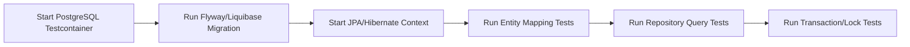

# Part 045 — JPA/Hibernate Testing

JPA/Hibernate testing bukan sekadar memastikan repository method bisa dipanggil.

Yang harus diuji adalah runtime behavior dari persistence context, entity lifecycle, generated SQL, relationship loading, flush timing, dirty checking, lock semantics, transaction boundary, dan compatibility antara entity mapping dengan schema PostgreSQL hasil migration.

JPA/Hibernate punya dua sifat yang membuat testing-nya berbeda dari MyBatis:

1. Banyak SQL dihasilkan oleh provider, bukan ditulis eksplisit oleh developer.
2. Banyak write terjadi karena state entity berubah, bukan karena method `update()` eksplisit dipanggil.

Karena itu test JPA/Hibernate harus menjawab pertanyaan berikut:

- apakah mapping entity sesuai schema nyata?
- apakah JPQL/native query menghasilkan data benar?
- apakah relationship loading menyebabkan N+1?
- apakah flush muncul pada waktu yang dipahami?
- apakah dirty checking meng-update field yang memang dimaksud?
- apakah `merge()` tidak membuat overwrite yang tidak disengaja?
- apakah optimistic/pessimistic locking bekerja pada concurrent request?
- apakah migration baru kompatibel dengan entity lama dan baru?
- apakah query berjalan di PostgreSQL nyata, bukan database simulasi yang terlalu permisif?

Prinsip utama:

> Test JPA/Hibernate as a stateful persistence runtime, not as a simple CRUD helper.

---

## 1. Why Mocking JPA Repository Is Not Enough

Mock repository hanya membuktikan application service memanggil dependency.

Mock tidak membuktikan:

- table name benar;
- column name benar;
- sequence/generator benar;
- enum converter benar;
- nullability match;
- `@Version` bekerja;
- JPQL valid;
- native query valid;
- relationship loading aman;
- cascade tidak berlebihan;
- orphan removal tidak menghapus data yang salah;
- flush tidak terjadi sebelum query yang tidak diperkirakan;
- transaction rollback benar;
- lock behavior benar;
- generated SQL performan;
- migration kompatibel.

Mock tetap berguna untuk unit test application service.

Namun persistence correctness harus dibuktikan dengan integration test terhadap database nyata.

Rule:

> Mock service boundaries. Do not mock the database when the risk lives in mapping, SQL, transaction, or locking.

---

## 2. Minimum JPA/Hibernate Test Categories

| Test Category | What It Proves |
|---|---|
| Entity mapping test | Entity sesuai table, column, ID, sequence, enum, converter |
| Repository test | Contract repository benar dari sisi read/write |
| JPQL test | Query JPA valid dan menghasilkan data benar |
| Native query test | SQL PostgreSQL valid dan mapping benar |
| Relationship loading test | Fetch strategy sesuai use case |
| N+1 test | Query count terkendali |
| Dirty checking test | Mutation entity menghasilkan update yang diharapkan |
| Flush test | Flush timing dipahami dan tidak mengejutkan |
| Merge/detach test | Detached entity tidak menyebabkan overwrite salah |
| Optimistic lock test | Concurrent update terdeteksi |
| Pessimistic lock test | Row lock, timeout, NOWAIT/SKIP LOCKED behavior benar |
| Transaction test | Commit/rollback/propagation sesuai boundary |
| Migration compatibility test | Entity dan schema hasil migration sinkron |
| Performance smoke test | Generated SQL tidak obvious buruk |

Tidak semua repository perlu semua kategori.

Tetapi aggregate critical, high-write path, relationship-heavy domain, dan query yang dipakai endpoint penting harus diuji lebih dalam.

---

## 3. Use Real PostgreSQL for JPA/Hibernate Tests

JPA membuat developer merasa database bisa diabstraksi.

Dalam production, abstraction itu tetap berakhir di PostgreSQL.

Jangan menguji PostgreSQL behavior dengan database berbeda jika production memakai PostgreSQL.

Fitur yang harus diuji di PostgreSQL nyata:

- sequence behavior;
- identity/generated key behavior;
- enum column;
- JSONB/native query;
- array column;
- transaction isolation;
- row lock;
- `FOR UPDATE`;
- lock timeout;
- serialization failure;
- constraint violation;
- unique constraint race;
- trigger side effect;
- function/procedure behavior;
- index/operator behavior;
- case sensitivity;
- timestamp/time zone behavior.

Gunakan Testcontainers PostgreSQL, Docker Compose PostgreSQL, atau ephemeral PostgreSQL di CI.

H2 boleh dipakai untuk fast smoke test yang sangat terbatas, tetapi jangan menjadikannya bukti persistence correctness.

Rule:

> If production correctness depends on PostgreSQL behavior, test with PostgreSQL.

---

## 4. Test Scope: EntityManager, Repository, or Application Service?

Ada tiga level test yang sering dibutuhkan.

| Level | Purpose | Example |
|---|---|---|
| EntityManager-level | Memvalidasi mapping/lifecycle langsung | persist, flush, clear, find |
| Repository-level | Memvalidasi contract data access | `findActiveByCustomerId`, `save`, `lockForUpdate` |
| Application service-level | Memvalidasi transaction boundary + business invariant | submit quote, approve order, reserve resource |

EntityManager-level cocok untuk:

- mapping;
- lifecycle;
- flush;
- dirty checking;
- cascade;
- lock mode;
- native query mapping.

Repository-level cocok untuk:

- query contract;
- projection;
- pagination;
- filter;
- sorting;
- soft delete;
- tenant filter;
- effective dating.

Application service-level cocok untuk:

- transaction boundary;
- rollback semantics;
- idempotency;
- concurrency;
- outbox write;
- domain invariant.

Jangan semua test dipaksa menjadi service-level test.

Semakin tinggi level test, semakin lambat dan semakin sulit menentukan root cause.

---

## 5. Entity Mapping Test

Entity mapping test memastikan entity benar-benar bisa dipersist dan dibaca kembali dari PostgreSQL.

Yang diuji:

- `@Table`;
- `@Column`;
- `@Id`;
- `@GeneratedValue`;
- sequence name;
- enum mapping;
- `AttributeConverter`;
- embedded value;
- timestamp;
- `@Version`;
- nullable field;
- default column;
- unique constraint;
- foreign key;
- schema name jika digunakan.

Contoh test intent:

```java
@Test
void shouldPersistAndReloadQuoteEntity() {
    QuoteEntity quote = new QuoteEntity(...);

    entityManager.persist(quote);
    entityManager.flush();
    entityManager.clear();

    QuoteEntity reloaded = entityManager.find(QuoteEntity.class, quote.getId());

    assertThat(reloaded.getStatus()).isEqualTo(QuoteStatus.DRAFT);
    assertThat(reloaded.getVersion()).isNotNull();
}
```

Hal penting:

- panggil `flush()` agar SQL benar-benar dieksekusi;
- panggil `clear()` agar read berikutnya tidak hanya mengambil object dari first-level cache;
- assert field yang relevan;
- gunakan schema hasil migration, bukan schema buatan manual di test.

Tanpa `flush()` dan `clear()`, test bisa false positive.

---

## 6. Flush and Clear as Testing Tools

Dalam JPA test, `flush()` dan `clear()` adalah alat penting.

`flush()` memaksa Hibernate mengirim SQL pending ke database.

`clear()` mengosongkan persistence context.

Pattern test yang sehat:

```java
entityManager.persist(entity);
entityManager.flush();
entityManager.clear();

Entity reloaded = entityManager.find(Entity.class, entity.getId());
```

Pattern ini membuktikan:

- insert benar-benar terjadi;
- generated ID benar;
- mapping database benar;
- read bukan dari first-level cache;
- converter bekerja dua arah;
- default/trigger database terlihat jika memang dibaca ulang.

Anti-pattern:

```java
repository.save(entity);
assertThat(entity.getStatus()).isEqualTo(Status.ACTIVE);
```

Itu hanya assert object memory, bukan database correctness.

---

## 7. Repository Contract Test

Repository test harus menguji contract, bukan implementation detail.

Contoh contract:

- find only active records;
- exclude soft-deleted rows;
- respect tenant ID;
- use effective date correctly;
- return stable ordering;
- return projection only;
- update only expected aggregate;
- throw/return empty when not found;
- lock row when requested;
- enforce optimistic version.

Contoh structure:

```java
@Test
void shouldFindOnlyActiveQuotesForTenant() {
    insertQuote("tenant-a", "ACTIVE");
    insertQuote("tenant-a", "DELETED");
    insertQuote("tenant-b", "ACTIVE");

    List<QuoteSummary> result = repository.findActiveQuotes("tenant-a");

    assertThat(result)
        .extracting(QuoteSummary::tenantId, QuoteSummary::status)
        .containsExactly(tuple("tenant-a", "ACTIVE"));
}
```

Repository test harus punya fixture yang membuktikan negative case.

Jika hanya ada positive row, filter bisa salah tetapi test tetap pass.

---

## 8. JPQL Query Test

JPQL test memastikan query valid dan sesuai domain contract.

Yang perlu diuji:

- join path benar;
- filter status benar;
- enum parameter benar;
- soft delete filter benar;
- tenant filter benar;
- effective date benar;
- pagination benar;
- sorting benar;
- projection constructor benar;
- bulk update/delete tidak merusak persistence context.

JPQL sering terlihat aman karena compile Java berhasil.

Tetapi banyak JPQL error baru muncul saat runtime.

Contoh failure:

```text
org.hibernate.query.SemanticException
```

atau:

```text
Could not resolve attribute
```

Test harus mengeksekusi query, bukan hanya membuat repository bean.

---

## 9. Native Query Test

Native query di JPA harus diuji seperti SQL production.

Risiko native query:

- column alias tidak match projection;
- scalar type mismatch;
- enum/JSONB conversion error;
- result set mapping salah;
- pagination native tidak portable;
- PostgreSQL syntax tidak compatible dengan test database palsu;
- query berjalan tetapi tidak memakai index;
- native update membuat persistence context stale.

Jika native query mengembalikan DTO projection, assert semua field penting.

Jika native query memodifikasi data, pertimbangkan `entityManager.clear()` setelah eksekusi.

Rule:

> Native query bypasses some ORM assumptions. Test both SQL correctness and persistence context impact.

---

## 10. Relationship Loading Test

Relationship mapping harus diuji karena bug-nya sering tidak terlihat dari functional assertion.

Yang perlu diuji:

- relasi parent-child terbaca benar;
- relasi optional tidak menyebabkan exception;
- lazy relation tidak dipakai setelah transaction selesai;
- eager relation tidak mengambil data terlalu banyak;
- cascade tidak menyimpan entity yang tidak dimaksud;
- orphan removal tidak menghapus child yang masih valid;
- bidirectional relation konsisten;
- join table benar.

Contoh smell:

```java
Quote quote = repository.findById(id);
return quote.getItems().stream().map(...).toList();
```

Jika `items` lazy dan transaction sudah selesai, bisa muncul:

```text
LazyInitializationException
```

Jika transaction masih terbuka, bisa muncul N+1.

Test relationship loading tidak cukup assert data benar.

Harus juga assert query count atau SQL shape untuk path kritikal.

---

## 11. N+1 Test

N+1 test membuktikan query count tidak bertambah linear terhadap jumlah parent rows.

Contoh target:

- load 10 quotes with items;
- expected query count 1-3;
- bukan 11 atau 21.

Strategi:

- enable Hibernate statistics;
- gunakan datasource proxy;
- gunakan query counter di test;
- assert number of executed statements;
- test dengan beberapa parent rows, bukan hanya satu.

Contoh pseudo-assertion:

```java
queryCounter.clear();

List<QuoteView> quotes = repository.findQuoteViews(customerId);

assertThat(quotes).hasSize(10);
assertThat(queryCounter.selectCount()).isLessThanOrEqualTo(3);
```

N+1 tidak terlihat jika fixture hanya satu parent.

Rule:

> A relationship loading test with one parent row does not prove N+1 safety.

---

## 12. DTO Projection Test

DTO projection sering menjadi solusi untuk query read path.

Test projection harus memastikan:

- constructor expression match;
- selected fields lengkap;
- alias benar untuk native query;
- null handling benar;
- computed fields benar;
- ordering benar;
- duplicate rows tidak muncul;
- pagination terjadi pada parent row yang benar.

Projection lebih aman untuk read API jika:

- API tidak butuh entity lifecycle;
- query join kompleks;
- result shape berbeda dari aggregate;
- performance lebih penting dari domain mutation.

Namun projection juga rawan silent mismatch jika field ditambah tetapi query tidak di-update.

Test harus menjadi contract untuk shape projection.

---

## 13. Dirty Checking Test

Dirty checking adalah salah satu sumber kekuatan sekaligus surprise JPA.

Test dirty checking memastikan mutation entity menghasilkan SQL update yang diharapkan.

Contoh:

```java
@Test
void shouldUpdateStatusThroughDirtyChecking() {
    QuoteEntity quote = persistQuote(Status.DRAFT);
    entityManager.flush();
    entityManager.clear();

    QuoteEntity managed = entityManager.find(QuoteEntity.class, quote.getId());
    managed.approve();

    entityManager.flush();
    entityManager.clear();

    QuoteEntity reloaded = entityManager.find(QuoteEntity.class, quote.getId());
    assertThat(reloaded.getStatus()).isEqualTo(Status.APPROVED);
}
```

Test ini membuktikan:

- entity managed;
- mutation dikenali;
- update dieksekusi saat flush;
- database state berubah.

Tambahkan assertion untuk field yang tidak boleh berubah.

Dirty checking bug sering berupa unexpected update, bukan missing update saja.

---

## 14. Flush Timing Test

Flush bisa terjadi sebelum query.

Contoh:

```java
entity.setStatus(Status.APPROVED);
repository.findSomethingElse(); // may trigger flush before query
```

Jika entity berada dalam persistence context dan query membutuhkan synchronization, Hibernate dapat flush sebelum query.

Test flush timing penting jika:

- ada validation database;
- ada constraint yang baru gagal saat flush;
- ada MyBatis read dalam transaction yang sama;
- ada native query setelah entity mutation;
- ada event/outbox write yang bergantung urutan SQL;
- ada stored procedure yang membaca table yang sama.

Test harus memverifikasi urutan operasi jika correctness bergantung pada urutan.

Rule:

> In JPA, the moment you mutate a managed entity is not always the moment SQL is sent.

---

## 15. Merge and Detached Entity Test

`merge()` sering disalahpahami.

`merge()` tidak menjadikan object detached menjadi managed instance yang sama.

Hibernate menyalin state dari detached object ke managed copy.

Risiko:

- overwrite field dengan `null`;
- overwrite update orang lain;
- mengabaikan partial update intent;
- cascade merge terlalu luas;
- entity graph terlalu besar;
- optimistic lock tidak dipakai dengan benar;
- stale DTO berubah menjadi stale entity update.

Test merge harus membuktikan:

- field yang tidak dikirim tidak terhapus;
- version check berjalan;
- concurrent update tidak tertimpa diam-diam;
- cascade merge tidak menyentuh child yang tidak dimaksud.

Jika use case adalah patch/partial update, lebih aman:

1. load managed entity;
2. apply allowed changes explicitly;
3. flush;
4. assert changed fields only.

---

## 16. Optimistic Lock Test

Optimistic lock test membuktikan concurrent update terdeteksi melalui version column.

Scenario umum:

1. transaction A membaca row version 1;
2. transaction B membaca row version 1;
3. B update dan commit menjadi version 2;
4. A mencoba update berdasarkan version 1;
5. A harus gagal dengan optimistic lock exception.

Test harus memakai dua transaction/persistence context berbeda.

Pseudo-flow:

```java
QuoteEntity a = tx1.find(id);
QuoteEntity b = tx2.find(id);

b.approve();
tx2.commit();

a.cancel();
assertThatThrownBy(tx1::commit)
    .isInstanceOf(OptimisticLockException.class);
```

Jangan test optimistic lock dalam satu persistence context saja.

Itu tidak mensimulasikan concurrency.

---

## 17. Pessimistic Lock Test

Pessimistic lock test membuktikan row benar-benar dikunci.

Gunakan dua transaction.

Scenario:

1. transaction A lock row dengan `PESSIMISTIC_WRITE`;
2. transaction B mencoba lock/update row yang sama;
3. B harus menunggu, timeout, atau gagal tergantung lock mode/timeout.

Yang perlu diuji:

- `LockModeType.PESSIMISTIC_WRITE`;
- lock timeout hint;
- PostgreSQL `FOR UPDATE` generated SQL;
- NOWAIT behavior jika dipakai native query;
- SKIP LOCKED behavior jika dipakai worker queue;
- rollback melepas lock;
- transaction duration tidak terlalu panjang.

Pessimistic lock test harus hati-hati agar tidak membuat CI hang.

Gunakan timeout pendek dan deterministic synchronization.

---

## 18. Transaction Rollback Test

Rollback test memastikan write tidak committed saat exception terjadi.

Scenario:

```java
try {
    service.performCommandThatFails();
} catch (ExpectedException ignored) {
}

assertThat(repository.findByBusinessKey(key)).isEmpty();
```

Namun perhatikan:

- test framework sering menjalankan test dalam transaction yang rollback otomatis;
- itu bisa menyembunyikan behavior production;
- untuk membuktikan commit/rollback service, gunakan transaction boundary eksplisit;
- cek juga outbox/audit write jika menggunakan `REQUIRES_NEW`.

Pertanyaan penting:

- exception mana yang trigger rollback?
- checked exception rollback atau tidak?
- error mapping JAX-RS terjadi setelah transaction rollback?
- apakah event/outbox ikut rollback?
- apakah audit sengaja tidak ikut rollback?

---

## 19. Bulk Update/Delete Test

Bulk JPQL update/delete bypass persistence context state.

Contoh:

```java
entityManager.createQuery("update Quote q set q.status = :status where q.expired = true")
    .setParameter("status", Status.EXPIRED)
    .executeUpdate();
```

Risiko:

- managed entity di persistence context masih stale;
- entity listener tidak terpanggil;
- dirty checking tidak berlaku;
- version tidak otomatis dinaikkan kecuali query mengaturnya;
- audit field tidak terisi;
- soft delete logic terlewat;
- cache stale.

Test bulk operation harus:

- assert affected row count;
- clear persistence context;
- reload data;
- assert version/audit behavior;
- assert cache invalidation jika relevan.

Rule:

> After bulk JPQL/native update, assume the persistence context is stale unless explicitly cleared.

---

## 20. Migration Compatibility Test

Migration compatibility test memastikan entity mapping cocok dengan schema hasil migration.

Test harus menjalankan migration yang sama dengan production path.

Bukan membuat table manual di test.

Yang harus diuji:

- semua entity dapat dimuat;
- repository critical dapat query;
- new nullable/default column bekerja;
- renamed column tidak dipakai lagi;
- dropped column tidak masih direferensikan entity/query;
- sequence masih valid;
- constraint baru tidak mematahkan existing write path;
- index baru tidak merusak deployment;
- converter masih cocok dengan column type.

Workflow ideal:



Migration test adalah salah satu guard paling penting untuk enterprise persistence layer.

---

## 21. Testing Soft Delete, Tenant Filter, and Effective Dating

Banyak persistence bug di enterprise system bukan karena SQL syntax salah, tetapi karena filter wajib lupa diterapkan.

Test wajib untuk:

- soft delete;
- tenant isolation;
- effective date;
- catalog version;
- status visibility;
- security scope;
- ownership scope;
- active/inactive flag.

Fixture harus berisi:

- row valid;
- row soft-deleted;
- row tenant lain;
- row expired;
- row future-effective;
- row inactive;
- row unauthorized.

Tanpa negative fixture, filter bug tidak tertangkap.

Rule:

> A query test without negative rows is mostly a happy-path smoke test.

---

## 22. Testing Generated SQL Visibility

JPA test sebaiknya bisa melihat SQL yang dihasilkan.

Gunakan salah satu:

- Hibernate SQL log;
- datasource proxy;
- p6spy;
- Hibernate statistics;
- test query counter;
- database slow query log untuk test performance khusus.

SQL visibility membantu mendeteksi:

- N+1;
- unnecessary join;
- cartesian product;
- missing where clause;
- eager loading tidak sengaja;
- update semua column;
- flush sebelum query;
- batch tidak aktif;
- pagination dilakukan salah.

Jangan snapshot semua SQL secara brittle.

Tetapi untuk path kritikal, assert query count dan key query shape bisa sangat berguna.

---

## 23. Test Data Strategy

Test data persistence harus intentional.

Gunakan fixture yang kecil tetapi expressive.

Bad fixture:

- terlalu banyak data tanpa alasan;
- tidak jelas row mana yang valid;
- shared mutable fixture antar test;
- data setup tersembunyi di helper terlalu magic;
- semua test memakai satu giant seed;
- tidak ada negative case.

Good fixture:

- setiap row punya alasan;
- naming jelas;
- positive dan negative rows eksplisit;
- created by helper yang readable;
- test independent;
- cleanup reliable;
- schema berasal dari migration.

Contoh naming:

```text
quote_active_tenant_a
quote_deleted_tenant_a
quote_active_tenant_b
quote_expired_tenant_a
```

Test data adalah bagian dari readability test.

---

## 24. Concurrency Test Design

Concurrency test sulit tetapi penting untuk lock/version/idempotency path.

Gunakan concurrency test hanya untuk behavior yang memang concurrency-sensitive.

Yang layak diuji:

- optimistic lock conflict;
- pessimistic lock timeout;
- unique constraint race;
- idempotency key race;
- double submit;
- worker queue `SKIP LOCKED`;
- inventory/reservation decrement;
- state transition race;
- outbox publication race.

Pattern:

- gunakan dua transaction terpisah;
- gunakan latch/barrier untuk mengontrol timing;
- gunakan timeout pendek;
- assert final database state;
- assert exception type;
- hindari sleep arbitrary jika bisa.

Concurrency test tidak perlu banyak, tetapi harus ada pada invariant yang mahal jika rusak.

---

## 25. JPA/Hibernate Testing Anti-Patterns

Hindari anti-pattern berikut:

| Anti-Pattern | Why It Is Dangerous |
|---|---|
| Mocking repository untuk persistence correctness | Tidak menguji mapping/SQL/database behavior |
| Test tanpa `flush()` | SQL belum tentu dieksekusi |
| Test tanpa `clear()` | Read bisa berasal dari first-level cache |
| Fixture hanya positive row | Filter bug tidak tertangkap |
| H2 untuk PostgreSQL-specific behavior | False confidence |
| Tidak assert query count | N+1 lolos |
| Tidak test lock dengan dua transaction | Tidak membuktikan concurrency |
| Bulk update tanpa clear/reload assertion | Stale context tidak terlihat |
| Tidak menjalankan migration | Entity/schema mismatch lolos |
| Snapshot SQL terlalu brittle | Test sering gagal karena perubahan non-substantive |

Testing harus membuktikan behavior penting, bukan membuat suite rapuh.

---

## 26. PR Review Checklist for JPA/Hibernate Tests

Saat review PR yang menambah/mengubah JPA/Hibernate code, tanyakan:

- Apakah entity mapping baru punya integration test?
- Apakah migration dijalankan dalam test?
- Apakah query JPQL/native dieksekusi di test?
- Apakah test memakai PostgreSQL nyata jika query PostgreSQL-specific?
- Apakah relationship loading diuji untuk N+1?
- Apakah test memakai `flush()` dan `clear()` ketika membuktikan database state?
- Apakah optimistic/pessimistic lock diuji dengan dua transaction?
- Apakah bulk update/delete meng-clear persistence context?
- Apakah soft delete/tenant/effective-date filter punya negative fixture?
- Apakah query count atau SQL visibility tersedia untuk path performance-critical?
- Apakah transaction rollback behavior diuji?
- Apakah error/constraint mapping diuji?
- Apakah migration compatibility dengan entity dibuktikan?

Jika PR menyentuh production-critical persistence path tanpa test nyata, itu risk yang harus dibahas.

---

## 27. Internal Verification Checklist

Gunakan checklist ini di codebase/team sebelum menyimpulkan standar JPA/Hibernate testing internal.

### Repository and Entity Test Structure

- Di mana test repository/entity berada?
- Apakah test memakai naming convention tertentu?
- Apakah test menjalankan application context penuh atau slice test?
- Apakah ada base class untuk persistence integration test?
- Apakah ada helper untuk `flush()` dan `clear()`?

### Database Test Environment

- Apakah test memakai Testcontainers PostgreSQL?
- Apakah CI memakai PostgreSQL nyata?
- Apakah ada test yang masih memakai H2?
- Apakah schema test berasal dari migration?
- Apakah test database version sama/mirip production?

### Migration Compatibility

- Apakah Flyway/Liquibase dijalankan sebelum JPA context start?
- Apakah migration failure menggagalkan CI?
- Apakah ada test untuk migration baru?
- Apakah entity/schema mismatch pernah terjadi?

### Query and Performance Guard

- Apakah SQL log tersedia di test?
- Apakah ada query count assertion?
- Apakah Hibernate statistics aktif di test tertentu?
- Apakah ada test N+1 untuk endpoint/list critical?
- Apakah native query punya integration test?

### Transaction and Locking

- Apakah transaction tests membuktikan commit/rollback production behavior?
- Apakah optimistic lock diuji?
- Apakah pessimistic lock diuji?
- Apakah idempotency/concurrency race diuji?
- Apakah timeout test tidak flaky?

### Team Convention

- Apa standar minimum test untuk entity baru?
- Apa standar minimum test untuk repository method baru?
- Kapan PR wajib menambah N+1 test?
- Kapan PR wajib menambah concurrency test?
- Siapa reviewer untuk migration + entity changes?

---

## 28. Practical Testing Heuristics

Gunakan heuristik berikut:

1. Jika mapping berubah, test persist-read ulang.
2. Jika query berubah, test positive dan negative fixture.
3. Jika relationship berubah, test query count.
4. Jika transaction berubah, test rollback/commit boundary.
5. Jika lock berubah, test dua transaction.
6. Jika migration berubah, test schema hasil migration.
7. Jika bulk update berubah, test clear + reload.
8. Jika native SQL berubah, test di PostgreSQL.
9. Jika tenant/soft delete/effective date terlibat, test negative rows.
10. Jika performance-sensitive, ukur SQL count atau query plan.

---

## 29. Senior Engineer Mental Model

JPA/Hibernate testing harus memperlakukan ORM sebagai runtime dengan state, bukan utility stateless.

Test yang baik membuktikan:

- object state menjadi database state dengan benar;
- database state menjadi object state dengan benar;
- persistence context tidak menyembunyikan bug;
- transaction boundary benar;
- generated SQL masuk akal;
- relationship loading tidak meledakkan query count;
- concurrency conflict terdeteksi;
- migration tidak mematahkan mapping;
- production failure mode punya guard di CI.

Kalau test hanya membuktikan method Java dipanggil, persistence layer belum benar-benar diuji.

---

## 30. Summary

JPA/Hibernate testing harus fokus pada behavior yang tidak terlihat dari code biasa:

- mapping;
- generated SQL;
- persistence context;
- flush;
- dirty checking;
- lazy loading;
- N+1;
- transaction;
- locking;
- migration compatibility;
- PostgreSQL-specific behavior.

Testing yang kuat tidak berarti semua hal di-test berat.

Testing yang kuat berarti risk terbesar diuji pada level yang tepat.

Untuk senior backend engineer, tujuan akhirnya bukan hanya membuat test pass.

Tujuannya adalah memastikan perubahan persistence tidak menjadi silent data corruption, performance incident, atau production-only failure.
