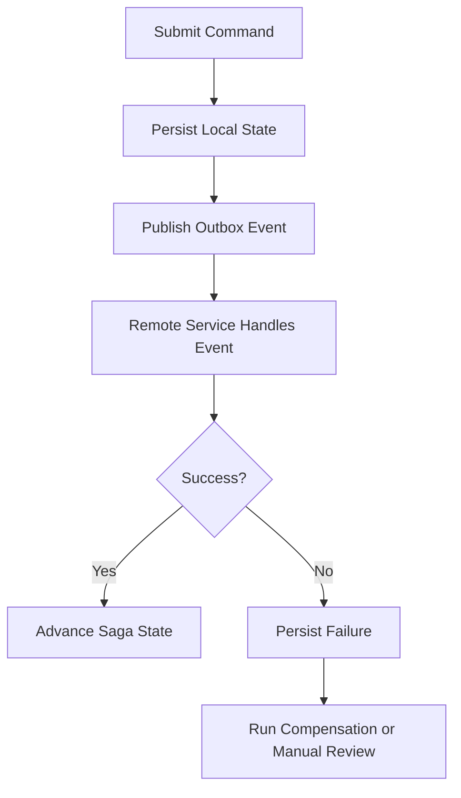

# Part 046 — Persistence Layer in Microservices

Persistence layer dalam microservices bukan hanya soal bagaimana satu service membaca dan menulis database.

Masalah utamanya adalah ownership.

Di monolith, database sering menjadi pusat integrasi.

Di microservices, database tidak boleh otomatis menjadi shared integration layer.

Jika service boundary tidak jelas, persistence layer akan menjadi tempat coupling tersembunyi:

- service A membaca table milik service B;
- service B menulis column yang dianggap internal oleh service A;
- migration satu service mematahkan service lain;
- transaction lokal disalahpahami sebagai distributed consistency;
- read model dianggap source of truth;
- event-driven flow kehilangan reconciliation;
- shared database menjadi monolith tersembunyi.

Prinsip utama:

> In microservices, persistence design is service boundary design.

---

## 1. Persistence Boundary in Microservices

Persistence boundary menentukan siapa yang berhak:

- mendefinisikan schema;
- menulis table;
- membaca table;
- mengubah constraint;
- menjalankan migration;
- menentukan invariant;
- menerbitkan event perubahan data;
- memperbaiki data rusak;
- menjawab pertanyaan production tentang data tersebut.

Dalam microservices, ownership ini harus eksplisit.

Tanpa ownership, database menjadi shared mutable state antar team/service.

Itu membuat perubahan kecil menjadi risk besar.

---

## 2. Database per Service: The Ideal Direction

Pattern umum microservices adalah database per service.

Artinya setiap service memiliki persistence store yang dimiliki sendiri.

Bentuknya bisa:

- database fisik berbeda;
- schema berbeda dalam instance PostgreSQL yang sama;
- logical database berbeda;
- managed database berbeda;
- kombinasi tergantung platform dan constraints.

Yang penting bukan hanya physical separation.

Yang penting adalah ownership separation.

Service lain tidak boleh mengandalkan table internal sebagai contract.

Contract antar service harus melalui:

- API;
- event;
- read model yang disepakati;
- data product/reporting pipeline yang governance-nya jelas;
- published integration contract.

---

## 3. Database per Service Is Not Always Physical Database per Service

Dalam enterprise environment, terutama sistem besar dan hybrid/on-prem, database per service tidak selalu berarti satu PostgreSQL server per service.

Bisa saja ada shared PostgreSQL cluster karena:

- licensing;
- operational cost;
- DBA governance;
- backup/DR model;
- latency;
- compliance;
- platform standard;
- migration history;
- on-prem constraints.

Namun walaupun physical infrastructure shared, ownership harus tetap jelas.

Contoh separation level:

| Separation Level | Meaning | Risk |
|---|---|---|
| Separate database instance | Isolation kuat | Operational overhead lebih tinggi |
| Separate database in same cluster | Isolation cukup baik | Cluster-level blast radius |
| Separate schema | Ownership bisa jelas | Permission harus ketat |
| Shared schema, separate tables | Lebih lemah | Coupling mudah terjadi |
| Shared tables | Sangat berisiko | Ownership kabur dan migration fragile |

Jika shared infrastructure tidak bisa dihindari, governance harus lebih kuat.

---

## 4. Shared Database Anti-Pattern

Shared database anti-pattern terjadi ketika beberapa service membaca/menulis table yang sama tanpa ownership contract yang jelas.

Gejala:

- service lain join langsung ke table internal;
- column dipakai diam-diam oleh banyak service;
- migration harus koordinasi manual lintas team;
- tidak jelas siapa boleh mengubah constraint;
- service A gagal karena migration service B;
- data invariant ditegakkan sebagian di service berbeda;
- audit/soft delete/tenant filter tidak konsisten;
- database lock antar service tidak dipahami;
- performance query service A mengganggu service B;
- incident ownership saling lempar.

Shared DB kadang muncul dari kebutuhan pragmatis.

Namun tanpa governance, ia berubah menjadi distributed monolith.

Rule:

> Sharing a PostgreSQL cluster is not automatically wrong. Sharing table ownership casually is dangerous.

---

## 5. Data Ownership

Data ownership menjawab:

- service mana yang menjadi source of truth?
- siapa yang boleh menulis data?
- siapa yang boleh mengubah schema?
- siapa yang menerbitkan event perubahan?
- siapa yang bertanggung jawab jika data corrupt?
- siapa yang menyetujui migration?
- siapa yang mendefinisikan retention/privacy policy?

Ownership harus berada pada business capability, bukan sekadar table.

Contoh konseptual:

- catalog service owns product/catalog definitions;
- quote service owns quote lifecycle;
- order service owns order lifecycle;
- billing service owns billing/accounting state;
- customer service owns customer profile.

Dalam konteks CSG/team, nama service/domain spesifik harus diverifikasi secara internal.

Jangan mengasumsikan boundary hanya dari nama table atau package.

---

## 6. Schema Ownership

Schema ownership adalah versi teknis dari data ownership.

Schema owner bertanggung jawab untuk:

- DDL migration;
- constraint;
- index;
- trigger/function/procedure;
- table lifecycle;
- column lifecycle;
- backward compatibility;
- data migration;
- backfill;
- rollback/roll-forward;
- permission;
- documentation.

Jika satu schema dipakai banyak service, setidaknya harus jelas:

- service mana pemilik schema;
- service mana hanya consumer;
- consumer membaca melalui view/API/event atau direct table;
- migration approval path;
- compatibility guarantee;
- deprecation process.

Tanpa schema ownership, migration menjadi politis dan berisiko.

---

## 7. Migration Ownership

Migration ownership menentukan siapa yang boleh mengubah database structure.

Dalam microservices, idealnya migration hidup bersama service owner.

Keuntungan:

- code dan schema evolve bersama;
- PR bisa mereview repository/entity/mapper + migration sekaligus;
- CI bisa menjalankan migration + persistence tests;
- deployment order lebih jelas;
- ownership incident jelas.

Risiko jika migration repo terpisah tanpa governance:

- application code berubah tanpa schema siap;
- schema berubah tanpa mapper/entity update;
- deployment ordering kabur;
- rollback sulit;
- DBA-only migration tidak terlihat oleh backend tests;
- service lain terkena efek samping.

Untuk enterprise, migration bisa tetap dikelola platform/DBA.

Namun contract dengan service team harus eksplisit.

---

## 8. Cross-Service Data Query

Cross-service data query terjadi ketika service membaca data milik service lain.

Ada beberapa pilihan:

| Approach | Use Case | Risk |
|---|---|---|
| Synchronous API call | Need fresh data, small request | Latency, availability coupling |
| Event-based local copy | Need local decision/read model | Eventual consistency, replay complexity |
| Shared read model | Reporting/search/list view | Ownership and freshness ambiguity |
| Direct DB read | Legacy/performance shortcut | Strong coupling and migration risk |
| Data warehouse/lake | Analytics/reporting | Not suitable for transactional command |

Direct DB read harus dianggap exception, bukan default.

Jika direct DB read terpaksa dilakukan, perlu contract:

- table/view yang boleh dibaca;
- column compatibility;
- freshness expectation;
- query performance guard;
- index ownership;
- security/tenant filtering;
- migration notice;
- deprecation policy.

---

## 9. Reference Data

Reference data sering membuat boundary kabur.

Contoh reference data:

- country;
- currency;
- tax code;
- product category;
- status code;
- price list reference;
- catalog metadata;
- tenant configuration;
- workflow configuration.

Pertanyaan utama:

- apakah reference data static atau frequently changing?
- siapa owner-nya?
- apakah service boleh cache?
- apakah update harus real-time?
- apakah ada effective date/version?
- apakah perubahan harus diterbitkan sebagai event?
- apakah data ini regulatory/compliance sensitive?

Reference data bisa disebar melalui:

- API lookup;
- event replication;
- startup seed;
- configuration service;
- shared read-only schema;
- cache;
- data product.

Jangan menjadikan reference data sebagai alasan untuk shared write ownership.

---

## 10. Read Model

Read model adalah model data yang dioptimalkan untuk read/query use case.

Ia sering dibuat dari event atau replication.

Read model cocok untuk:

- list page;
- dashboard;
- search;
- reporting;
- projection API;
- workflow inbox;
- denormalized query;
- cross-domain view.

Read model bukan source of truth kecuali memang didefinisikan begitu.

Risiko read model:

- stale data;
- event replay bug;
- missing event;
- duplicate event;
- out-of-order event;
- partial projection;
- schema drift;
- unclear rebuild process;
- query dianggap transactional truth.

Read model harus punya:

- owner;
- source event/source API;
- freshness SLA;
- rebuild strategy;
- reconciliation strategy;
- idempotency;
- schema/versioning policy.

---

## 11. Eventual Consistency

Dalam microservices, banyak flow tidak bisa dijaga oleh satu ACID transaction.

Eventual consistency berarti data antar service akan konsisten setelah waktu tertentu, bukan langsung pada saat command selesai.

Ini bukan alasan untuk correctness asal-asalan.

Eventual consistency butuh desain eksplisit:

- event contract;
- idempotent consumer;
- retry;
- dead-letter handling;
- reconciliation;
- state machine;
- compensation;
- monitoring lag;
- duplicate handling;
- replay safety;
- user experience untuk pending state.

Pertanyaan penting:

- consistency window berapa lama yang diterima?
- apa yang user lihat saat state masih pending?
- apa yang terjadi jika event gagal?
- bagaimana memperbaiki projection yang salah?
- apakah command boleh lanjut jika dependency belum sync?

Eventual consistency tanpa operational mechanism adalah bug yang ditunda.

---

## 12. Saga and Compensation

Saga mengelola proses bisnis yang melibatkan beberapa service tanpa distributed transaction global.

Ada dua bentuk umum:

- choreography: service bereaksi terhadap event;
- orchestration: satu orchestrator mengatur langkah.

Saga cocok untuk:

- quote-to-order flow;
- reservation;
- provisioning;
- billing setup;
- fulfillment;
- workflow long-running process;
- integration dengan external system.

Persistence layer dalam saga harus menyimpan:

- saga state;
- step status;
- correlation ID;
- idempotency key;
- retry count;
- error detail;
- compensation status;
- timeout/deadline;
- audit trail.

Compensation bukan rollback database sederhana.

Compensation adalah action bisnis untuk membalik atau menetralkan efek langkah sebelumnya.

Contoh konseptual:



---

## 13. Local Transaction vs Distributed Consistency

Satu service hanya bisa menjamin local transaction pada database miliknya.

Misalnya:

1. update aggregate local;
2. insert outbox event;
3. commit.

Itu atomic secara lokal.

Namun event publication ke Kafka/RabbitMQ dan update service lain terjadi kemudian.

Jangan mengklaim flow distributed sudah atomic hanya karena local transaction berhasil.

Correct wording:

- local state committed;
- event scheduled for publication;
- downstream consistency pending;
- reconciliation required for failure cases.

Incorrect assumption:

- database commit berarti semua service sudah konsisten;
- event publish pasti sukses;
- consumer hanya menerima sekali;
- order event selalu benar;
- distributed rollback otomatis terjadi.

---

## 14. Transactional Outbox in Microservices

Transactional outbox adalah pattern utama untuk menghubungkan database transaction dan event publication.

Flow:

1. service menerima command;
2. validate business invariant;
3. update local aggregate;
4. insert outbox row dalam transaction yang sama;
5. commit;
6. publisher membaca outbox;
7. publish ke Kafka/RabbitMQ;
8. mark as published atau rely on idempotency/CDC.

Keuntungan:

- tidak ada database commit tanpa event record;
- event bisa retry;
- event publication bisa diamati;
- reconciliation mungkin dilakukan;
- consumer bisa idempotent.

Risiko:

- publisher lag;
- duplicate publication;
- outbox table bloat;
- event ordering;
- schema evolution event;
- poison event;
- transaction terlalu besar;
- missing monitoring.

Outbox harus dianggap bagian dari persistence layer.

---

## 15. Inbox and Idempotent Consumers

Inbox pattern menyimpan event/message yang sudah diterima atau diproses.

Ia membantu mencegah duplicate processing.

Consumer event harus mengasumsikan:

- message bisa duplicate;
- message bisa datang terlambat;
- message bisa out of order;
- processing bisa gagal setelah sebagian write;
- acknowledgement bisa gagal setelah commit;
- replay bisa terjadi.

Inbox table bisa menyimpan:

- message ID;
- source service;
- event type;
- aggregate ID;
- processing status;
- processed timestamp;
- error detail;
- retry count.

Persistence operation consumer sebaiknya:

1. start transaction;
2. check/insert inbox message ID;
3. apply local state change idempotently;
4. commit;
5. ack message.

Jika duplicate masuk, consumer bisa skip atau replay response secara aman.

---

## 16. Shared Table Write Risk

Shared table write adalah salah satu risiko terbesar.

Jika dua service menulis table yang sama:

- invariant bisa berbeda;
- validation bisa berbeda;
- audit bisa berbeda;
- soft delete bisa berbeda;
- tenant filter bisa berbeda;
- optimistic lock bisa diabaikan;
- trigger side effect tidak dipahami;
- data state machine bisa dilompati;
- incident ownership kabur.

Contoh bahaya:

```text
Service A enforces quote status transition: DRAFT -> APPROVED -> ORDERED
Service B directly updates quote.status = ORDERED for integration shortcut
```

Akibat:

- audit trail tidak lengkap;
- approval skipped;
- outbox event tidak terbit;
- downstream read model stale;
- reconciliation sulit.

Rule:

> One table can be physically shared, but write ownership must not be casually shared.

---

## 17. Shared Read Risk

Shared read terlihat lebih aman daripada shared write, tetapi tetap berbahaya.

Risiko:

- service consumer mengandalkan internal column;
- query consumer membuat load pada table owner;
- migration owner tidak tahu consumer;
- tenant/security filter bisa lupa;
- query plan consumer mengganggu production workload;
- consumer membaca state intermediate yang tidak dimaksud untuk publik;
- consumer salah memahami semantic field.

Jika shared read tidak bisa dihindari, gunakan mitigasi:

- dedicated view;
- read-only user;
- documented contract;
- compatibility guarantee;
- query limit;
- index review;
- monitoring;
- deprecation policy;
- migration notification.

Better option biasanya:

- API;
- event projection;
- materialized read model;
- data warehouse/reporting pipeline.

---

## 18. Microservices and JPA/MyBatis Selection

Framework persistence juga dipengaruhi boundary microservice.

MyBatis cocok untuk:

- read model projection;
- complex reporting query;
- PostgreSQL-specific query;
- batch projection rebuild;
- explicit SQL for integration tables;
- outbox polling query;
- operational query yang butuh SQL visibility.

JPA/Hibernate cocok untuk:

- aggregate lifecycle dalam satu service;
- CRUD domain yang relationship-nya jelas;
- optimistic locking entity;
- domain state transition dengan Unit of Work;
- write path yang mengikuti aggregate boundary.

JDBC langsung cocok untuk:

- very small low-level operation;
- performance-critical batch;
- special driver behavior;
- migration utility;
- lightweight outbox publisher;
- cases where framework overhead tidak diinginkan.

Yang berbahaya:

- JPA entity untuk table yang bukan milik service;
- MyBatis write ke aggregate yang lifecycle-nya dimiliki JPA service lain;
- shared table dengan dua write model;
- read model diperlakukan sebagai aggregate source of truth.

---

## 19. Service Boundary and Aggregate Boundary

Service boundary dan aggregate boundary tidak selalu sama.

Namun dalam microservices, service sebaiknya menjadi owner dari aggregate yang ia modifikasi.

Pertanyaan saat melihat repository:

- aggregate ini milik service ini atau service lain?
- repository ini command repository atau query repository?
- apakah write path melewati state machine yang benar?
- apakah query membaca source of truth atau projection?
- apakah data ini local copy dari event?
- apakah update local copy boleh dilakukan manual?
- siapa menerbitkan event saat aggregate berubah?

Jika repository tidak bisa menjawab ownership, itu architecture smell.

---

## 20. Reporting and Analytics Are Different Workloads

Reporting sering menjadi alasan direct DB access antar service.

Namun reporting workload berbeda dari transactional workload.

Risiko menjalankan reporting query langsung ke transactional database:

- long-running query;
- lock/IO pressure;
- bad query plan;
- index trade-off untuk OLTP vs analytics;
- tenant/privacy exposure;
- schema coupling;
- migration fragility.

Better approach:

- read replica;
- data warehouse;
- ETL/ELT pipeline;
- event-driven projection;
- materialized view dengan ownership jelas;
- reporting API dengan limit.

Transactional database harus dilindungi dari query reporting yang tidak terkendali.

---

## 21. Reference Integrity Across Services

Database foreign key tidak mudah dipakai antar database/service.

Dalam microservices, referential integrity antar service sering menjadi application-level concern.

Contoh:

- quote menyimpan `customerId` milik customer service;
- order menyimpan `quoteId` milik quote service;
- fulfillment menyimpan `orderId` milik order service.

Pertanyaan:

- apakah ID remote harus divalidasi sinkron?
- apakah local copy diperlukan?
- apakah deleted/merged remote entity memengaruhi local data?
- apakah event update harus memperbarui projection?
- bagaimana menangani remote service unavailable?
- apakah stale reference acceptable?

Tidak ada jawaban universal.

Yang penting, contract dan failure mode harus eksplisit.

---

## 22. State Machines Across Services

Quote/order/provisioning-like domains sering memiliki state machine.

Dalam microservices, state bisa tersebar.

Risiko:

- service A menganggap status final;
- service B masih pending;
- event terlambat mengubah read model;
- compensation mengubah state balik;
- retry membuat transition duplicate;
- manual intervention tidak tercermin di downstream;
- status enum berbeda antar service.

Persistence layer harus mendukung:

- state transition history;
- versioning;
- idempotency;
- correlation ID;
- event log/outbox;
- audit;
- reconciliation;
- query by pending/failed state;
- timeout handling.

State machine distributed harus dianggap production workflow, bukan sekadar enum column.

---

## 23. Schema Evolution in Microservices

Schema evolution dalam microservices lebih sulit karena consumer bisa berada di versi berbeda.

Jika data dipublikasikan melalui event/API/read model, compatibility juga harus dijaga di contract tersebut.

Perubahan berisiko:

- rename column;
- drop column;
- change enum value;
- change status semantic;
- split table;
- merge table;
- change identifier format;
- change effective dating logic;
- change event schema;
- change projection shape.

Gunakan expand-contract:

1. add new schema element;
2. deploy producer yang dual-write jika perlu;
3. deploy consumer yang dual-read jika perlu;
4. backfill;
5. verify;
6. stop old usage;
7. drop old schema setelah compatibility window.

Microservices membuat compatibility window lebih penting.

---

## 24. Kubernetes and Cloud Runtime Impact

Microservices biasanya berjalan dengan banyak pod/replica.

Persistence impact:

- setiap pod punya connection pool;
- autoscaling bisa membuat connection storm;
- rolling deploy bisa menjalankan versi berbeda bersamaan;
- migration job harus terkoordinasi;
- leader election mungkin dibutuhkan untuk jobs;
- network latency memengaruhi cross-service query;
- secret rotation bisa memutus koneksi;
- cloud DB memiliki connection limit dan failover behavior;
- read replica lag bisa memengaruhi read-after-write.

Microservice persistence design harus dihitung bersama deployment topology.

Formula sederhana:

```text
potential_connections = service_replicas * max_pool_size
```

Lalu kalikan dengan jumlah service yang mengarah ke database cluster yang sama.

Jika angka ini mendekati PostgreSQL `max_connections`, incident tinggal menunggu traffic spike atau deploy.

---

## 25. Security and Privacy Across Service Boundaries

Data access lintas service memperluas risiko security/privacy.

Pertanyaan wajib:

- apakah service consumer boleh melihat semua column?
- apakah PII ikut direplikasi?
- apakah tenant filter diterapkan di source dan read model?
- apakah cache key tenant-aware?
- apakah logs mengandung data sensitif?
- apakah data retention ikut diterapkan di projection?
- apakah deletion request menghapus local copy?
- apakah audit trail melacak cross-service access?

Read model dan event sering membawa data lebih banyak daripada yang dibutuhkan.

Minimize payload.

Jangan menerbitkan PII hanya karena consumer mungkin butuh nanti.

---

## 26. Observability for Microservice Persistence

Persistence observability di microservices harus menjawab local dan distributed questions.

Local metrics:

- query duration;
- pool usage;
- transaction duration;
- lock wait;
- deadlock;
- timeout;
- migration status;
- repository error rate.

Distributed metrics:

- outbox lag;
- event publish failure;
- consumer lag;
- inbox duplicate count;
- projection freshness;
- reconciliation mismatch;
- saga stuck count;
- compensation failure;
- cross-service API dependency latency.

Tanpa observability distributed, eventual consistency bug hanya terlihat dari customer complaint.

---

## 27. Failure Modes

Common failure modes:

| Failure Mode | Symptom | Root Cause |
|---|---|---|
| Shared DB coupling | Service fails after other service migration | Undocumented table dependency |
| Lost event | Downstream state missing | No outbox/retry/reconciliation |
| Duplicate event | Duplicate row/action | Consumer not idempotent |
| Stale read model | UI/API shows old state | Projection lag or failed consumer |
| Cross-tenant leakage | Tenant sees wrong data | Missing tenant filter in query/projection |
| Migration race | New app reads old schema | No expand-contract |
| Connection storm | DB max connections exhausted | Per-pod pool not sized |
| Saga stuck | Business process pending forever | Missing timeout/retry/manual recovery |
| Shared write corruption | Invalid state transition | Multiple services update same table |
| Reporting overload | OLTP degraded | Heavy query on transactional DB |

Senior engineer harus mengenali pola ini dari logs, metrics, schema, dan deployment history.

---

## 28. PR Review Checklist

Saat review persistence change dalam microservices, tanyakan:

- Service ini owner data/table/schema tersebut?
- Apakah change ini command path atau read path?
- Apakah ada service lain yang membaca/menulis table ini?
- Apakah migration backward-compatible?
- Apakah event/API contract berubah?
- Apakah read model terdampak?
- Apakah outbox/inbox/idempotency dibutuhkan?
- Apakah transaction hanya local atau ada distributed consistency assumption?
- Apakah retry bisa menyebabkan duplicate write?
- Apakah tenant/security/privacy filter tetap berlaku?
- Apakah query ini membebani database milik service lain?
- Apakah connection pool impact dihitung untuk replica count?
- Apakah observability untuk failure mode tersedia?
- Apakah reconciliation/manual repair path ada?
- Apakah ADR dibutuhkan karena boundary berubah?

Jika PR mengubah data ownership, itu bukan sekadar code review.

Itu architecture review.

---

## 29. Internal Verification Checklist

Gunakan checklist ini untuk memahami persistence layer microservices di CSG/team tanpa mengarang detail internal.

### Service and Data Ownership

- Service apa saja yang memiliki database/schema sendiri?
- Apakah ownership table terdokumentasi?
- Apakah ada shared schema/table?
- Siapa owner migration per schema?
- Siapa yang boleh approve DDL?
- Apakah ada ADR data ownership?

### Cross-Service Access

- Apakah ada service yang membaca table service lain langsung?
- Jika ada, apakah melalui view/read-only user?
- Apakah direct read punya contract?
- Apakah ada service yang menulis table milik service lain?
- Apakah ada dependency yang hanya diketahui lewat query SQL?

### Event and Read Model

- Apakah outbox pattern digunakan?
- Apakah inbox/idempotency digunakan consumer?
- Apakah Kafka/RabbitMQ publication transactional dengan DB write?
- Apakah read model punya owner?
- Apakah projection freshness dimonitor?
- Apakah replay/rebuild strategy tersedia?

### Saga and Workflow

- Apakah long-running business flow memakai saga/orchestrator/Camunda/workflow engine?
- Di mana saga state disimpan?
- Apakah compensation terdokumentasi?
- Apakah stuck workflow dimonitor?
- Apakah manual recovery path tersedia?

### Migration and Deployment

- Apakah migration service-specific atau centralized?
- Apakah deployment rolling membuat old/new version overlap?
- Apakah expand-contract dipakai?
- Apakah backfill punya runbook?
- Apakah migration job berjalan di Kubernetes/GitOps pipeline?

### Runtime and Operations

- Berapa max pool per pod?
- Berapa replica service yang connect ke DB sama?
- Apakah autoscaling menghitung DB connection limit?
- Apakah cloud/on-prem DB failover behavior dipahami?
- Apakah read replica lag relevan?

### Security and Compliance

- Apakah event/read model membawa PII?
- Apakah tenant isolation diterapkan di projection?
- Apakah data retention berlaku untuk local copy/read model?
- Apakah audit trace cross-service tersedia?
- Apakah DB permission mengikuti least privilege?

---

## 30. Practical Architecture Heuristics

Gunakan heuristik berikut:

1. Jika service lain menulis table Anda, ownership rusak.
2. Jika service lain membaca table Anda, contract harus eksplisit.
3. Jika migration Anda bisa mematahkan service lain tanpa CI mengetahuinya, boundary bocor.
4. Jika command butuh update dua service, pikirkan saga/outbox, bukan distributed transaction dulu.
5. Jika read butuh gabungan data banyak service, pertimbangkan read model, bukan join langsung.
6. Jika event bisa duplicate, consumer harus idempotent.
7. Jika read model bisa stale, UX/API contract harus mengakuinya.
8. Jika data direplikasi, privacy/retention harus ikut direplikasi.
9. Jika pool per pod besar, hitung total connection seluruh replica.
10. Jika ownership tidak bisa dijelaskan, perubahan persistence harus berhenti untuk architecture clarification.

---

## 31. Senior Engineer Mental Model

Dalam microservices, persistence layer adalah boundary enforcement mechanism.

Repository, mapper, entity, migration, event, dan schema bukan artefak lokal saja.

Mereka menentukan coupling antar service.

Senior engineer harus bisa melihat:

- apakah sebuah query melanggar ownership;
- apakah sebuah migration aman untuk consumer;
- apakah sebuah event cukup untuk menjaga downstream consistency;
- apakah read model bisa direbuild;
- apakah data duplication punya idempotency;
- apakah transaction lokal disalahartikan sebagai distributed guarantee;
- apakah connection pool aman untuk Kubernetes scaling;
- apakah privacy mengikuti data yang direplikasi;
- apakah incident bisa ditelusuri dari audit/event/outbox.

Microservices tidak menghapus kompleksitas persistence.

Ia memindahkan sebagian kompleksitas dari database transaction ke ownership, messaging, idempotency, observability, dan reconciliation.

---

## 32. Summary

Persistence layer dalam microservices harus dipahami sebagai kombinasi:

- data ownership;
- schema ownership;
- migration ownership;
- service boundary;
- transaction boundary;
- read model;
- event-driven consistency;
- saga/compensation;
- idempotency;
- security/privacy;
- observability;
- operational runtime.

Database per service adalah arah yang sehat, tetapi yang lebih penting adalah ownership yang jelas.

Shared infrastructure bisa diterima.

Shared mutable table ownership tanpa governance adalah sumber incident.

Untuk senior backend engineer, pertanyaan terpenting bukan hanya:

> Query ini jalan atau tidak?

Tetapi:

> Service mana yang memiliki data ini, contract apa yang menjaganya, dan bagaimana sistem pulih ketika consistency lintas service gagal?
