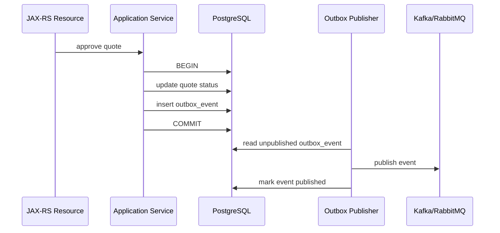

# Part 047 — Outbox, Inbox, and Event-Driven Persistence

Event-driven persistence adalah titik di mana database correctness bertemu dengan message delivery correctness.

Di backend enterprise, banyak use case tidak berhenti pada `INSERT` atau `UPDATE` ke PostgreSQL.

Setelah data berubah, sistem sering harus:

- menerbitkan event ke Kafka;
- mengirim command/message ke RabbitMQ;
- memulai atau melanjutkan workflow Camunda;
- memperbarui read model;
- memicu downstream billing, provisioning, notification, fulfillment, atau audit process;
- menyediakan data untuk service lain secara eventual consistent.

Masalah utama:

> Database transaction dan message broker transaction biasanya bukan satu atomic transaction yang sama.

Jika application service menulis database lalu publish event langsung ke broker, akan muncul failure window.

Contoh:

1. Service menyimpan `quote_approved` ke PostgreSQL.
2. Transaction commit berhasil.
3. Service crash sebelum publish event ke Kafka.
4. Database mengatakan quote approved.
5. Downstream tidak pernah tahu.

Sebaliknya:

1. Service publish event ke Kafka.
2. Database commit gagal.
3. Downstream melihat event untuk state yang sebenarnya tidak pernah committed.

Outbox dan inbox pattern ada untuk menutup gap ini secara realistis.

Prinsip utama:

> Treat event publication as part of persistence correctness, not as a side effect after persistence.

---

## 1. The Dual-Write Problem

Dual-write adalah kondisi ketika satu use case mencoba menulis dua resource berbeda, misalnya:

- PostgreSQL + Kafka;
- PostgreSQL + RabbitMQ;
- PostgreSQL + Redis;
- PostgreSQL + external HTTP API;
- PostgreSQL + Camunda workflow engine;
- PostgreSQL + audit store.

Jika kedua resource tidak berada dalam satu atomic transaction, maka system bisa masuk state parsial.

| Operation Order | Failure Window | Result |
|---|---|---|
| DB commit lalu publish event | Crash setelah commit sebelum publish | Data berubah, event hilang |
| Publish event lalu DB commit | DB rollback setelah event published | Event palsu |
| DB write + broker publish dalam satu method tanpa outbox | Timeout tidak jelas | Unknown state |
| Retry publish tanpa idempotency | Duplicate event | Downstream memproses berkali-kali |
| Retry DB write tanpa unique key | Duplicate data | Data correctness rusak |

Distributed transaction atau 2PC sering tidak praktis dalam microservices modern.

Karena itu solusi umum adalah mengubah publish event menjadi data yang disimpan dalam transaction lokal yang sama dengan business write.

Itulah transactional outbox.

---

## 2. Transactional Outbox Mental Model

Transactional outbox adalah pattern di mana service menulis business data dan event record ke table outbox dalam transaction PostgreSQL yang sama.

Flow sederhananya:



Kunci pattern ini:

- business row dan outbox row committed bersama;
- event tidak hilang jika service crash setelah commit;
- publisher bisa retry secara terpisah;
- publish menjadi at-least-once;
- downstream harus idempotent;
- reconciliation bisa menemukan event yang belum published.

Outbox tidak menjamin exactly-once end-to-end.

Outbox menjamin bahwa event yang berasal dari committed data dapat ditemukan dan dipublish ulang sampai berhasil.

Rule:

> Outbox converts an unsafe dual-write into a recoverable local transaction plus retryable publication.

---

## 3. Outbox Table Design

Outbox table harus cukup kaya untuk mendukung publication, retry, observability, replay, dan audit.

Contoh conceptual schema:

```sql
CREATE TABLE outbox_event (
  id UUID PRIMARY KEY,
  aggregate_type TEXT NOT NULL,
  aggregate_id TEXT NOT NULL,
  event_type TEXT NOT NULL,
  event_version INT NOT NULL,
  payload JSONB NOT NULL,
  headers JSONB NOT NULL DEFAULT '{}'::jsonb,
  status TEXT NOT NULL,
  created_at TIMESTAMPTZ NOT NULL DEFAULT now(),
  available_at TIMESTAMPTZ NOT NULL DEFAULT now(),
  published_at TIMESTAMPTZ,
  attempt_count INT NOT NULL DEFAULT 0,
  last_error TEXT,
  correlation_id TEXT,
  causation_id TEXT,
  trace_id TEXT
);

CREATE INDEX idx_outbox_event_status_available
  ON outbox_event (status, available_at, created_at);

CREATE INDEX idx_outbox_event_aggregate
  ON outbox_event (aggregate_type, aggregate_id, created_at);
```

Field penting:

| Field | Purpose |
|---|---|
| `id` | Event identity untuk deduplication |
| `aggregate_type` | Jenis aggregate/source |
| `aggregate_id` | ID business entity |
| `event_type` | Nama event kontraktual |
| `event_version` | Evolusi schema event |
| `payload` | Data event |
| `headers` | Metadata transport/correlation |
| `status` | Pending, processing, published, failed |
| `available_at` | Retry backoff dan delayed publish |
| `attempt_count` | Observability retry |
| `correlation_id` | Trace business request |
| `causation_id` | Event/request penyebab event ini |

Jangan menyimpan payload yang terlalu miskin sehingga downstream harus query balik ke service source untuk semua hal.

Namun jangan juga menjadikan payload sebagai full database dump tanpa kontrak.

Event payload adalah contract.

---

## 4. Writing Outbox in the Same Transaction

Application service harus menulis outbox row di transaction yang sama dengan business mutation.

Contoh intent:

```java
@Transactional
public void approveQuote(ApproveQuoteCommand command) {
    Quote quote = quoteRepository.findForUpdate(command.quoteId());

    quote.approve(command.approvedBy());

    quoteRepository.save(quote);

    outboxRepository.insert(OutboxEvent.from(
        "Quote",
        quote.id().toString(),
        "QuoteApproved",
        1,
        quoteApprovedPayload(quote),
        command.correlationId()
    ));
}
```

Hal yang harus diperhatikan:

- jangan publish ke Kafka/RabbitMQ langsung di tengah transaction;
- jangan membuat outbox insert di transaction berbeda kecuali alasan sangat eksplisit;
- jangan menulis outbox setelah method transactional selesai tanpa recovery mechanism;
- jangan membuat event dari state yang belum final;
- jangan menaruh event generation di layer yang tidak memahami business invariant;
- jangan lupa correlation/causation metadata.

Dalam JPA, outbox bisa ditulis dengan entity atau native insert.

Dalam MyBatis, outbox bisa ditulis dengan mapper SQL eksplisit.

Yang penting bukan framework-nya.

Yang penting adalah transaction boundary.

---

## 5. Outbox with JPA/Hibernate

Jika business aggregate dikelola JPA, outbox insert bisa dilakukan lewat JPA entity atau repository khusus.

Risiko JPA:

- flush timing tidak dipahami;
- event dibuat dari entity managed yang akan berubah lagi sebelum commit;
- event dibuat sebelum generated ID tersedia;
- lazy loading terjadi saat membangun payload;
- dirty checking menghasilkan update tambahan sebelum outbox insert;
- `@TransactionalEventListener` disalahpahami sebagai durable outbox;
- entity listener membuat outbox implicit dan sulit di-review.

Pattern yang lebih aman:

- mutate aggregate secara eksplisit;
- validasi invariant;
- build payload dari state final dalam transaction;
- insert outbox row eksplisit;
- commit;
- publish async dari table.

Jika memakai Hibernate flush mode default, query sebelum commit bisa memicu flush.

Untuk outbox, ini biasanya acceptable jika dipahami, tetapi harus terlihat dalam SQL log/test.

Review question:

> Apakah event payload berasal dari state yang pasti ikut committed dalam transaction yang sama?

---

## 6. Outbox with MyBatis

MyBatis membuat SQL outbox lebih eksplisit.

Contoh mapper intent:

```xml
<insert id="insertOutboxEvent" parameterType="OutboxEventRecord">
  INSERT INTO outbox_event (
    id,
    aggregate_type,
    aggregate_id,
    event_type,
    event_version,
    payload,
    headers,
    status,
    created_at,
    available_at,
    correlation_id,
    causation_id,
    trace_id
  ) VALUES (
    #{id},
    #{aggregateType},
    #{aggregateId},
    #{eventType},
    #{eventVersion},
    #{payload, typeHandler=JsonbTypeHandler},
    #{headers, typeHandler=JsonbTypeHandler},
    'PENDING',
    now(),
    now(),
    #{correlationId},
    #{causationId},
    #{traceId}
  )
</insert>
```

Risiko MyBatis:

- outbox insert lupa dipanggil pada salah satu write path;
- payload tidak konsisten antar mapper/service;
- JSONB TypeHandler tidak stabil;
- transaction manager mapper tidak sama dengan business write;
- status transition outbox tidak atomic;
- publisher query terlalu agresif dan lock contention;
- retry update tidak idempotent.

MyBatis cocok untuk outbox karena status transition dan claim query bisa dibuat eksplisit dengan PostgreSQL features seperti `FOR UPDATE SKIP LOCKED`.

---

## 7. Polling Publisher Pattern

Polling publisher membaca outbox row yang pending lalu publish ke broker.

Basic flow:

1. Ambil batch pending event.
2. Claim event secara aman.
3. Publish ke broker.
4. Mark as published.
5. Jika gagal, increment attempt dan set `available_at` berikutnya.

Contoh PostgreSQL claim query:

```sql
WITH picked AS (
  SELECT id
  FROM outbox_event
  WHERE status = 'PENDING'
    AND available_at <= now()
  ORDER BY created_at
  FOR UPDATE SKIP LOCKED
  LIMIT 100
)
UPDATE outbox_event e
SET status = 'PROCESSING',
    attempt_count = attempt_count + 1
FROM picked
WHERE e.id = picked.id
RETURNING e.*;
```

`SKIP LOCKED` berguna agar multiple publisher worker bisa bekerja paralel tanpa mengambil row yang sama.

Namun hati-hati:

- event ordering per aggregate bisa rusak jika parallelism tidak dikontrol;
- row yang selalu gagal bisa tertinggal;
- batch terlalu besar bisa menahan lock lama;
- publisher crash setelah publish sebelum mark published bisa menyebabkan duplicate publish;
- duplicate publish adalah expected failure mode.

Karena itu consumer harus idempotent.

Rule:

> Outbox publisher gives at-least-once delivery. Design consumers for duplicates.

---

## 8. Marking Published: The Duplicate Window

Ada failure window penting:

1. Publisher publish event ke Kafka/RabbitMQ berhasil.
2. Publisher crash sebelum update `status = 'PUBLISHED'`.
3. Setelah restart, event yang sama dipublish lagi.

Ini bukan bug outbox.

Ini konsekuensi at-least-once delivery.

Solusinya bukan mencoba menyembunyikan duplicate dengan asumsi exactly-once.

Solusinya:

- event memiliki stable event ID;
- consumer menyimpan processed event ID di inbox/idempotency table;
- operation downstream idempotent;
- duplicate detection observable;
- replay didukung.

Untuk Kafka, producer idempotence dapat membantu pada level producer session, tetapi tidak menghapus semua duplicate end-to-end dari database outbox ke consumer side effect.

Untuk RabbitMQ, acknowledgement dan publisher confirm membantu durability transport, tetapi tetap butuh idempotent consumer.

---

## 9. CDC/Debezium Outbox Pattern

Alternatif polling publisher adalah CDC.

Flow:

1. Application menulis business data + outbox row dalam transaction PostgreSQL.
2. Debezium membaca WAL/binlog PostgreSQL.
3. Connector mem-publish outbox event ke Kafka.
4. Consumer membaca Kafka.

Kelebihan:

- tidak perlu polling query intensif;
- event publication mengikuti commit log database;
- ordering per database log lebih natural;
- cocok untuk high-throughput event publication.

Trade-off:

- operasional lebih kompleks;
- butuh connector infrastructure;
- schema outbox harus sesuai convention connector;
- observability pindah ke Kafka Connect/Debezium;
- replay dan filtering perlu governance;
- tidak otomatis cocok untuk RabbitMQ langsung;
- perubahan payload/schema perlu kontrol ketat.

CDC bukan pengganti outbox.

CDC adalah salah satu mekanisme untuk mem-publish outbox.

---

## 10. Inbox Pattern

Inbox pattern adalah sisi consumer dari outbox.

Tujuannya mencegah duplicate event diproses lebih dari sekali secara harmful.

Consumer menyimpan event ID yang sudah diproses.

Contoh schema:

```sql
CREATE TABLE inbox_event (
  event_id UUID PRIMARY KEY,
  source_service TEXT NOT NULL,
  event_type TEXT NOT NULL,
  received_at TIMESTAMPTZ NOT NULL DEFAULT now(),
  processed_at TIMESTAMPTZ,
  status TEXT NOT NULL,
  last_error TEXT,
  payload_hash TEXT
);
```

Flow:

1. Consumer menerima event.
2. Consumer mencoba insert `event_id` ke inbox.
3. Jika insert gagal karena duplicate, skip atau replay response.
4. Jika berhasil, proses business logic dalam transaction yang sama.
5. Mark processed.

Pseudo-flow:

```java
@Transactional
public void handleQuoteApproved(Event event) {
    boolean firstTime = inboxRepository.tryInsert(event.id(), event.metadata());

    if (!firstTime) {
        return;
    }

    readModelRepository.upsertFrom(event.payload());

    inboxRepository.markProcessed(event.id());
}
```

Untuk PostgreSQL, `INSERT ... ON CONFLICT DO NOTHING` sangat berguna.

Rule:

> Every at-least-once event consumer that mutates state needs an idempotency boundary.

---

## 11. Inbox and Transaction Boundary

Inbox insert dan side effect lokal harus berada dalam transaction yang sama jika side effect adalah database write lokal.

Jika consumer:

- insert inbox;
- update read model;
- create task;
- write audit;
- enqueue local outbox;

maka semuanya sebaiknya berada dalam satu transaction lokal.

Jika consumer melakukan external HTTP call di tengah transaction, risiko meningkat:

- transaction lama;
- lock lebih lama;
- timeout ambiguous;
- external side effect tidak ikut rollback;
- retry bisa duplicate.

Lebih aman:

- consume event;
- write local intent/state;
- commit;
- publish/execute external side effect via local outbox/job;
- reconcile.

Event-driven persistence adalah rantai local transactions, bukan satu distributed transaction raksasa.

---

## 12. Event Ordering

Event ordering sering disalahpahami.

Kafka bisa memberi ordering dalam satu partition.

RabbitMQ bisa menjaga order dalam kondisi tertentu, tetapi retry/dead-letter/requeue dapat mengubah practical order.

Database outbox bisa membaca `created_at`, tetapi parallel publisher bisa mengubah publish order.

Pertanyaan penting:

- apakah ordering global benar-benar dibutuhkan?
- apakah ordering hanya per aggregate?
- apa partition key Kafka?
- apakah outbox publisher menjaga per-aggregate order?
- apakah consumer tahan menerima event versi lama setelah versi baru?
- apakah event membawa version/sequence?

Untuk aggregate seperti quote/order, ordering per aggregate biasanya lebih penting daripada global ordering.

Tambahkan field seperti:

- aggregate version;
- event sequence;
- occurred_at;
- effective_at;
- causation_id.

Consumer bisa menolak stale event atau melakukan reconciliation jika sequence gap.

---

## 13. Reconciliation

Outbox/inbox tidak lengkap tanpa reconciliation.

Reconciliation menjawab:

- apakah ada outbox event pending terlalu lama?
- apakah ada event failed melewati retry limit?
- apakah ada business row yang seharusnya punya event tetapi tidak punya outbox row?
- apakah ada downstream read model yang tertinggal?
- apakah ada event duplicate berlebihan?
- apakah ada event sequence gap?
- apakah ada consumer stuck?

Contoh reconciliation query:

```sql
SELECT event_type, count(*)
FROM outbox_event
WHERE status IN ('PENDING', 'PROCESSING', 'FAILED')
  AND created_at < now() - interval '10 minutes'
GROUP BY event_type;
```

Untuk critical lifecycle seperti quote approval/order submission, reconciliation bukan optional.

Production systems harus punya cara untuk menemukan dan memperbaiki event drift.

---

## 14. Outbox and Camunda/Workflow Systems

Jika persistence change harus memulai workflow Camunda, jangan otomatis memulai workflow langsung setelah database write tanpa durability plan.

Risiko:

- business state committed tetapi workflow tidak start;
- workflow start tetapi business state rollback;
- duplicate workflow instance karena retry;
- workflow correlation gagal;
- task dibuat tanpa audit event.

Pattern yang lebih aman:

- business transaction menulis state + outbox event `QuoteApproved` atau command intent `StartFulfillmentWorkflow`;
- publisher/worker memulai workflow secara retryable;
- workflow start memakai business key/idempotency key;
- state transition workflow dicatat kembali melalui inbox/outbox;
- reconciliation mengecek state yang committed tetapi workflow belum aktif.

Untuk Camunda, internal convention harus diverifikasi.

Jangan mengarang apakah CSG memakai outbox langsung ke Camunda, Kafka bridge, RabbitMQ command, atau workflow API synchronous.

---

## 15. Outbox, Redis, and Cache Invalidation

Outbox juga bisa digunakan untuk cache invalidation.

Contoh:

- quote updated;
- service menulis outbox event;
- cache invalidation worker menghapus Redis key;
- downstream read model juga mendapat event.

Risiko jika cache invalidation dilakukan langsung di transaction:

- Redis delete berhasil tetapi DB rollback;
- DB commit berhasil tetapi Redis delete gagal;
- stale cache bertahan;
- retry delete tidak terlacak.

Outbox memberi mekanisme retryable.

Namun cache invalidation event tetap harus idempotent.

Deleting same Redis key berkali-kali harus aman.

---

## 16. Event Schema and Versioning

Outbox payload adalah contract jangka panjang.

Jangan menganggap JSON payload bebas berubah karena berada di table internal.

Jika event dikonsumsi service lain, payload harus dikelola seperti API contract.

Pertimbangkan:

- event name stable;
- event version eksplisit;
- backward-compatible field addition;
- field removal melalui deprecation window;
- enum expansion risk;
- timestamp format;
- ID format;
- nullability;
- schema registry jika digunakan;
- consumer contract tests.

Untuk PostgreSQL JSONB payload, migration schema tidak otomatis memvalidasi payload structure.

Validasi harus ada di producer tests dan consumer tests.

---

## 17. Observability for Outbox/Inbox

Metrics minimum:

| Metric | Why It Matters |
|---|---|
| Outbox pending count | Publication backlog |
| Outbox oldest pending age | Event delay SLO |
| Outbox publish success/failure rate | Broker or payload issue |
| Outbox retry count | Reliability degradation |
| Outbox dead-letter count | Manual intervention needed |
| Inbox duplicate count | Producer/transport retry visibility |
| Inbox processing failure | Consumer correctness risk |
| Event lag per type | Business process delay |
| Publisher batch duration | Throughput bottleneck |
| Broker publish latency | Kafka/RabbitMQ dependency health |

Logs harus memiliki:

- event ID;
- aggregate ID;
- event type;
- correlation ID;
- causation ID;
- trace ID;
- attempt count;
- broker topic/queue/routing key;
- failure reason.

Jangan log payload penuh jika mengandung PII atau sensitive commercial data.

---

## 18. Security and Privacy Concerns

Event payload sering menyebar ke banyak system.

Karena itu privacy risk lebih besar daripada table lokal.

Checklist security/privacy:

- apakah payload mengandung PII?
- apakah payload mengandung price/discount/contract data sensitif?
- apakah semua consumer berhak melihat field tersebut?
- apakah event log menyimpan payload?
- apakah outbox table punya retention policy?
- apakah DLQ/dead-letter menyimpan payload sensitif?
- apakah encryption/tokenization diperlukan?
- apakah topic/queue permission dibatasi?
- apakah test data event aman?

Rule:

> Do not put data in an event just because it is easy to serialize from an entity.

---

## 19. Common Failure Modes

| Failure Mode | Symptom | Likely Cause | Debug Direction |
|---|---|---|---|
| Data committed but no event | Downstream stale | Missing outbox insert or publisher stuck | Check outbox by aggregate ID |
| Duplicate event processed | Duplicate downstream row/action | Consumer not idempotent | Check inbox/event ID |
| Pending backlog grows | Event delay | Broker down, publisher error, bad payload | Check outbox oldest pending age |
| Event ordering wrong | State regression downstream | Parallel publisher, wrong Kafka key | Check aggregate sequence/partition key |
| Event payload incompatible | Consumer deserialization failure | Breaking schema change | Check event version/schema tests |
| Publisher locks contend | DB CPU/lock wait | Bad claim query/batch size | Check `SKIP LOCKED`, index, batch size |
| Outbox table huge | Slow publisher query | No retention/archive | Check partitioning/cleanup |
| Workflow not started | Business state stuck | Missing command/event bridge | Check outbox + workflow correlation |
| Cache stale | Read shows old data | Invalidation event failed | Check outbox/invalidation worker |

---

## 20. Production-Safe Debugging Flow

Saat ada dugaan event-driven persistence failure:

1. Cari business aggregate di PostgreSQL.
2. Cari outbox event berdasarkan aggregate ID dan event type.
3. Periksa status, created_at, attempt_count, last_error.
4. Cek apakah event sampai broker topic/queue.
5. Cek consumer inbox berdasarkan event ID.
6. Cek downstream state/read model.
7. Cek duplicate/retry logs.
8. Cek DLQ/dead-letter.
9. Cek reconciliation report.
10. Hindari manual update tanpa memahami idempotency dan sequence.

Manual replay harus menggunakan event ID yang sama jika tujuannya retry event yang sama.

Membuat event baru untuk memperbaiki event lama bisa merusak ordering dan audit trail.

---

## 21. Internal Verification Checklist

Verifikasi di codebase/team internal:

- Apakah service menggunakan transactional outbox?
- Di mana outbox table/schema berada?
- Apakah outbox insert satu transaction dengan business write?
- Apakah publisher polling, CDC/Debezium, atau mechanism lain?
- Apakah Kafka, RabbitMQ, atau keduanya digunakan untuk event publication?
- Apa convention event ID, aggregate ID, event type, version, correlation ID, causation ID?
- Apakah consumer menggunakan inbox/idempotency table?
- Apakah duplicate event dianggap normal dan diuji?
- Apakah ada DLQ/dead-letter process?
- Apakah outbox pending age dipantau?
- Apakah event replay didukung?
- Apakah reconciliation tersedia untuk critical lifecycle?
- Apakah payload mengandung PII/sensitive data?
- Apakah outbox table punya retention/archive policy?
- Apakah event schema/versioning terdokumentasi?
- Apakah Camunda/workflow integration memakai outbox/command intent atau direct call?
- Apakah Redis cache invalidation memakai event/outbox?
- Apakah migration outbox/inbox diuji di CI?
- Apakah ada incident notes tentang event hilang, duplicate, stale read model, atau workflow stuck?

---

## 22. PR Review Checklist

Saat review PR yang menyentuh event-driven persistence, tanyakan:

- Apakah business mutation dan outbox insert atomic?
- Apakah event hanya dipublish setelah commit?
- Apakah event ID stable?
- Apakah consumer idempotent?
- Apakah payload contract backward-compatible?
- Apakah ordering per aggregate dibutuhkan?
- Apakah partition/routing key benar?
- Apakah retry/backoff jelas?
- Apakah failure akan terlihat di metrics/logs?
- Apakah reconciliation disediakan untuk state critical?
- Apakah outbox query punya index yang tepat?
- Apakah batch publisher bisa menyebabkan lock contention?
- Apakah payload mengandung data sensitif?
- Apakah event schema diuji?
- Apakah test membuktikan duplicate handling?
- Apakah manual replay/runbook jelas?

---

## 23. Senior Engineer Mental Model

Outbox/inbox bukan hanya pattern messaging.

Ini adalah persistence correctness pattern.

Seorang senior backend engineer harus bisa melihat satu use case command dan bertanya:

- data apa yang berubah?
- event apa yang harus keluar?
- apakah event keluar hanya jika data committed?
- apakah event bisa hilang?
- apakah event bisa duplicate?
- apakah downstream tahan duplicate?
- apakah ordering dibutuhkan?
- apakah ada reconciliation jika broker/consumer gagal?
- apakah observability cukup untuk membuktikan state end-to-end?

Kesimpulan:

> In event-driven systems, the write is not complete when PostgreSQL commits. The write is complete when committed state, durable event intent, idempotent consumption, and reconciliation all exist.
