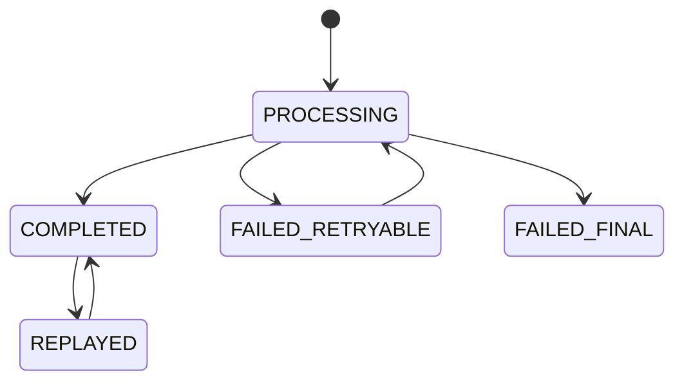

# Part 048 — Idempotency and Request Deduplication

Idempotency adalah kemampuan sebuah operation untuk dipanggil lebih dari sekali tanpa menghasilkan side effect berulang yang merusak correctness.

Dalam sistem enterprise, duplicate request bukan edge case.

Duplicate request terjadi karena:

- client retry setelah timeout;
- API gateway retry;
- load balancer retry;
- user double-click;
- mobile/browser reconnect;
- Kafka/RabbitMQ redelivery;
- job scheduler retry;
- worker crash setelah partial processing;
- network partition;
- optimistic UI resubmit;
- downstream timeout ambiguous;
- manual replay operation.

Jika persistence layer tidak mendukung idempotency, retry yang seharusnya meningkatkan reliability justru menciptakan duplicate order, duplicate payment intent, duplicate workflow, duplicate event, duplicate audit, atau inconsistent state.

Prinsip utama:

> Retry without idempotency is a correctness risk.

---

## 1. Idempotency Is Not “No Duplicate HTTP Calls”

HTTP call bisa duplicate.

Message bisa redelivered.

Job bisa dijalankan ulang.

Karena itu target realistis bukan mencegah duplicate request masuk.

Target realistis adalah memastikan duplicate request tidak menghasilkan duplicate business effect.

Untuk command seperti:

- submit quote;
- approve order;
- reserve resource;
- create customer account;
- start workflow;
- publish fulfillment request;
- apply price adjustment;
- generate invoice;

idempotency harus didesain sebagai bagian dari persistence boundary.

Bukan sekadar filter di controller.

---

## 2. Idempotent vs Naturally Idempotent vs Deduplicated

Ada tiga konsep yang sering tercampur.

| Concept | Meaning | Example |
|---|---|---|
| Naturally idempotent | Operation sama memang menghasilkan state sama | `PUT /resource/{id}` set status to CANCELLED |
| Deduplicated | Duplicate request dikenali dan di-skip/replay | `POST /orders` dengan idempotency key |
| Safe retryable | Bisa diulang setelah failure ambiguous | Worker memproses event dengan inbox table |

`GET` seharusnya safe dan idempotent dari sisi state.

`PUT` sering bisa dibuat idempotent jika client menentukan resource ID atau target state.

`POST` biasanya tidak natural idempotent, sehingga perlu idempotency key.

Namun HTTP method semantics saja tidak cukup.

Persistence layer tetap harus menegakkan uniqueness, state transition, dan deduplication.

---

## 3. Idempotency Key

Idempotency key adalah identifier yang diberikan client atau dibuat upstream untuk menyatakan “request intent yang sama”.

Contoh header:

```http
POST /quotes/submit HTTP/1.1
Idempotency-Key: 6b6a0f1c-5d4f-4b31-9f16-0dc0e52a1d2e
Content-Type: application/json
```

Key harus:

- unik per logical command;
- stabil saat client retry;
- scoped agar tidak collision antar endpoint/tenant/user;
- disimpan durable;
- dikaitkan dengan request fingerprint;
- memiliki status processing/completed/failed;
- punya retention policy.

Jangan memakai timestamp random baru di setiap retry.

Jika key berubah setiap retry, idempotency tidak bekerja.

---

## 4. Request Fingerprint

Idempotency key saja tidak cukup.

Client bisa memakai key yang sama untuk payload berbeda karena bug.

Karena itu simpan fingerprint request.

Fingerprint bisa berupa hash canonical dari:

- HTTP method;
- endpoint/operation name;
- tenant ID;
- principal/customer ID;
- business target ID;
- normalized request body;
- important headers.

Jika request dengan idempotency key sama tetapi fingerprint berbeda, response harus error conflict.

Contoh status:

- `409 Conflict` untuk key sama payload berbeda;
- `422 Unprocessable Entity` jika request tidak valid;
- `200 OK` atau `201 Created` replay jika completed;
- `202 Accepted` jika masih processing dan operation async.

Rule:

> Same idempotency key must mean same business intent, not merely same caller.

---

## 5. Idempotency Store Design in PostgreSQL

PostgreSQL cocok untuk idempotency ketika command menghasilkan database write yang harus atomic dengan deduplication record.

Contoh schema:

```sql
CREATE TABLE idempotency_record (
  idempotency_key TEXT NOT NULL,
  scope TEXT NOT NULL,
  tenant_id TEXT,
  request_fingerprint TEXT NOT NULL,
  status TEXT NOT NULL,
  response_status INT,
  response_body JSONB,
  resource_type TEXT,
  resource_id TEXT,
  error_code TEXT,
  created_at TIMESTAMPTZ NOT NULL DEFAULT now(),
  updated_at TIMESTAMPTZ NOT NULL DEFAULT now(),
  expires_at TIMESTAMPTZ NOT NULL,
  PRIMARY KEY (scope, idempotency_key)
);

CREATE INDEX idx_idempotency_record_expires
  ON idempotency_record (expires_at);
```

`scope` penting.

Contoh scope:

- `tenantId:endpointName`;
- `customerId:submitQuote`;
- `serviceName:messageConsumer`;
- `workflowName:startProcess`.

Tanpa scope, collision key antar use case bisa berbahaya.

---

## 6. Processing State Machine

Idempotency record sebaiknya punya state machine sederhana.



Makna state:

| State | Meaning |
|---|---|
| `PROCESSING` | Request pertama sedang berjalan atau pernah crash di tengah |
| `COMPLETED` | Side effect sukses dan response bisa direplay |
| `FAILED_RETRYABLE` | Failure sementara, retry boleh mencoba lagi |
| `FAILED_FINAL` | Failure validasi/domain final, response bisa direplay atau ditolak |

Beberapa sistem tidak menyimpan `FAILED_RETRYABLE` karena membiarkan caller retry setelah lock timeout.

Yang penting: state transition harus eksplisit.

---

## 7. Atomic Claim with Unique Constraint

Deduplication harus mengandalkan unique constraint, bukan hanya read-then-insert.

Pattern buruk:

```sql
SELECT * FROM idempotency_record WHERE key = ?;
-- if not found
INSERT INTO idempotency_record ...;
```

Dua concurrent request bisa sama-sama melihat not found.

Pattern lebih aman:

```sql
INSERT INTO idempotency_record (
  scope,
  idempotency_key,
  request_fingerprint,
  status,
  expires_at
)
VALUES (?, ?, ?, 'PROCESSING', now() + interval '24 hours')
ON CONFLICT (scope, idempotency_key) DO NOTHING;
```

Lalu cek row count.

Jika insert berhasil, caller adalah pemilik eksekusi pertama.

Jika insert tidak berhasil, baca record existing dan putuskan:

- fingerprint sama + completed: replay response;
- fingerprint sama + processing: return 409/202 atau wait policy;
- fingerprint beda: conflict;
- failed retryable: retry/claim ulang sesuai policy;
- expired: tergantung cleanup policy.

---

## 8. Transaction Boundary for Idempotent Commands

Idealnya idempotency claim, business write, outbox write, dan response snapshot dilakukan dalam boundary yang benar.

Ada dua style umum.

### Style A: Single Transaction for Short Command

Cocok untuk command cepat.

```java
@Transactional
public SubmitQuoteResponse submit(SubmitQuoteRequest request) {
    IdempotencyRecord record = idempotencyRepository.claimOrLoad(request.key(), request.fingerprint());

    if (record.isCompleted()) {
        return record.replayResponse();
    }

    Quote quote = quoteRepository.submit(request.toCommand());
    outboxRepository.insert(QuoteSubmittedEvent.from(quote));

    SubmitQuoteResponse response = SubmitQuoteResponse.from(quote);
    idempotencyRepository.markCompleted(request.key(), response);

    return response;
}
```

Kelebihan:

- atomic;
- simple;
- replay response mudah;
- cocok untuk short DB transaction.

Risiko:

- transaction terlalu lama jika command melakukan external call;
- response body besar;
- lock contention pada idempotency row.

### Style B: Claim Then Async Processing

Cocok untuk long-running command.

1. Request claim idempotency key.
2. Simpan job/work item/outbox command.
3. Return `202 Accepted`.
4. Worker memproses async.
5. Client poll status atau menerima callback/event.

Kelebihan:

- request cepat;
- long-running process tidak menahan HTTP transaction;
- retry lebih aman.

Risiko:

- client contract lebih kompleks;
- perlu status endpoint;
- response replay berbeda.

---

## 9. Response Replay

Response replay berarti duplicate request dengan key yang sama mengembalikan response yang sama atau semantically equivalent.

Ini penting karena client retry setelah timeout tidak tahu apakah request pertama berhasil.

Simpan minimal:

- response HTTP status;
- resource ID;
- business status;
- response body ringkas;
- error code final jika relevant.

Tidak semua response harus disimpan penuh.

Untuk data sensitif, lebih aman menyimpan resource reference lalu rebuild response dari database.

Namun rebuild harus hati-hati: state resource bisa berubah setelah request pertama selesai.

Jika response harus merepresentasikan hasil saat command pertama, simpan snapshot.

Jika response boleh menunjukkan state terkini, dokumentasikan contract.

---

## 10. Redis-Based Idempotency

Redis sering dipakai untuk fast deduplication.

Cocok untuk:

- short TTL duplicate submit prevention;
- rate-limited idempotency;
- low-value operation;
- API edge deduplication;
- cache-like guard sebelum durable processing.

Contoh primitive:

```text
SET idempotency:{scope}:{key} PROCESSING NX EX 86400
```

Jika `SET NX` berhasil, request pertama boleh jalan.

Jika gagal, request duplicate.

Namun Redis punya trade-off:

- tidak otomatis atomic dengan PostgreSQL business write;
- data bisa hilang jika eviction/misconfiguration;
- replay response terbatas jika tidak disimpan durable;
- failover behavior harus dipahami;
- race dengan DB transaction masih mungkin;
- privacy risk jika response disimpan di Redis.

Redis cocok sebagai acceleration layer.

Untuk correctness critical command, PostgreSQL unique constraint biasanya tetap harus menjadi sumber kebenaran.

Rule:

> Redis may reduce duplicate pressure. PostgreSQL constraints should protect correctness.

---

## 11. Unique Constraint as Business Idempotency

Kadang idempotency terbaik adalah business unique constraint.

Contoh:

- satu active quote per customer/request reference;
- satu order per external order ID;
- satu workflow instance per business key;
- satu payment authorization per provider id;
- satu processed event per event ID;
- satu catalog version per effective date range.

Contoh:

```sql
CREATE UNIQUE INDEX uq_order_external_reference
  ON customer_order (tenant_id, external_reference);
```

Dengan constraint ini, duplicate insert akan gagal atau bisa diubah menjadi upsert/replay.

Kelebihan:

- invariant ditegakkan database;
- melindungi semua code path;
- tidak tergantung framework;
- aman dari race condition.

Kekurangan:

- response replay perlu logic tambahan;
- error harus dimapping dengan benar;
- constraint harus mencerminkan business identity yang benar;
- migration/backfill bisa sulit jika data existing duplicate.

---

## 12. Idempotency with MyBatis

MyBatis cocok untuk idempotency karena SQL bisa eksplisit.

Mapper operations yang umum:

- `tryInsertProcessingRecord`;
- `findByScopeAndKey`;
- `markCompleted`;
- `markFailedRetryable`;
- `markFailedFinal`;
- `claimFailedRetryable`;
- `deleteExpired`.

Contoh mapper intent:

```xml
<insert id="tryInsertProcessing" parameterType="IdempotencyRecord">
  INSERT INTO idempotency_record (
    scope,
    idempotency_key,
    request_fingerprint,
    status,
    expires_at
  ) VALUES (
    #{scope},
    #{idempotencyKey},
    #{requestFingerprint},
    'PROCESSING',
    #{expiresAt}
  )
  ON CONFLICT (scope, idempotency_key) DO NOTHING
</insert>
```

Pastikan mapper mengembalikan affected row count.

Jangan menyimpulkan insert berhasil tanpa melihat result.

MyBatis review focus:

- unique key benar;
- status transition atomic;
- JSONB response mapping aman;
- conflict handling eksplisit;
- transaction manager sama dengan business write;
- SQL injection tidak ada pada scope/key construction.

---

## 13. Idempotency with JPA/Hibernate

JPA bisa dipakai untuk idempotency record, tetapi harus memahami constraint race.

Pattern yang sering dipakai:

1. Persist `IdempotencyRecord` dengan primary key `(scope, key)`.
2. Flush agar constraint violation muncul segera.
3. Jika duplicate, load existing record.
4. Compare fingerprint.
5. Replay/return processing/conflict.

Risiko JPA:

- duplicate constraint baru muncul saat flush/commit;
- exception handling terjadi terlambat;
- persistence context menyimpan entity stale;
- merge bisa overwrite status;
- optimistic locking perlu dipakai untuk state transition;
- response body JSON mapping perlu converter.

Untuk claim yang sangat concurrency-sensitive, native query atau MyBatis/JDBC insert `ON CONFLICT DO NOTHING` sering lebih jelas.

JPA tetap bisa dipakai untuk lifecycle idempotency record jika behavior diuji.

---

## 14. Idempotent Event Consumers

Event consumer harus memperlakukan message delivery sebagai at-least-once.

Gunakan inbox table atau processed event table.

Flow:

```sql
INSERT INTO processed_event (event_id, source, processed_at)
VALUES (?, ?, now())
ON CONFLICT (event_id) DO NOTHING;
```

Jika row count 0, event duplicate dan bisa di-skip.

Namun jika duplicate event seharusnya mengembalikan response ke caller, simpan result atau resource reference.

Untuk consumer yang update read model, gunakan upsert idempotent:

```sql
INSERT INTO quote_read_model (quote_id, status, version, updated_at)
VALUES (?, ?, ?, now())
ON CONFLICT (quote_id)
DO UPDATE SET
  status = EXCLUDED.status,
  version = EXCLUDED.version,
  updated_at = now()
WHERE quote_read_model.version < EXCLUDED.version;
```

`WHERE version < EXCLUDED.version` mencegah event lama menimpa state baru.

---

## 15. Idempotency and Workflow/Camunda

Starting workflow is a classic duplicate risk.

Duplicate retry bisa membuat dua workflow instance untuk business object yang sama.

Mitigation:

- gunakan business key stable;
- simpan workflow instance ID di database;
- enforce unique constraint pada business key/process type;
- gunakan idempotency key untuk start command;
- jika start timeout ambiguous, query existing instance/state sebelum start ulang;
- tulis workflow-start intent ke outbox/job table;
- reconcile business state vs workflow state.

Internal convention harus diverifikasi.

Jangan mengasumsikan apakah team memakai Camunda business key, external task, message correlation, REST API, Java client, atau event bridge tertentu.

---

## 16. Idempotency and Transaction Isolation

Idempotency claim harus aman terhadap concurrent request.

Read committed biasanya cukup jika unique constraint dipakai.

Tanpa unique constraint, isolation level lebih tinggi pun bukan solusi elegan.

Gunakan database constraint untuk business identity.

Gunakan lock hanya jika state transition membutuhkan serialization.

Contoh:

- duplicate create: unique constraint;
- duplicate transition: version column/optimistic lock;
- duplicate worker claim: `FOR UPDATE SKIP LOCKED`;
- duplicate event: inbox primary key;
- duplicate workflow: business key unique record.

Rule:

> Prefer constraints and idempotent state transitions over broad locks.

---

## 17. Timeout and Unknown Outcome

Timeout adalah alasan utama idempotency dibutuhkan.

Client menerima timeout bukan berarti server gagal.

Kemungkinan:

- request tidak sampai server;
- request sampai, gagal sebelum transaction;
- transaction commit berhasil, response hilang;
- transaction masih processing;
- external side effect sudah terjadi;
- worker akan melanjutkan async.

Tanpa idempotency, retry bisa membuat duplicate.

Dengan idempotency, retry bisa:

- menemukan completed response;
- menemukan processing state;
- menemukan failed final;
- melanjutkan retryable processing;
- mengembalikan conflict jika payload berbeda.

Inilah alasan response replay dan processing state penting.

---

## 18. Error Mapping in JAX-RS

JAX-RS resource harus mengubah idempotency state menjadi HTTP response yang jelas.

Contoh mapping:

| Condition | Suggested Response |
|---|---|
| First request accepted and completed sync | `200 OK` or `201 Created` |
| Duplicate completed same fingerprint | Replay previous `200/201` |
| Duplicate still processing async | `202 Accepted` |
| Duplicate still processing sync and cannot wait | `409 Conflict` or `425 Too Early` depending API policy |
| Same key different fingerprint | `409 Conflict` |
| Validation failure final | Replay same `4xx` if contract chooses |
| Retryable internal failure | `503` with retry guidance, but avoid duplicate side effect |

Do not expose internal SQL constraint names directly.

Map persistence conflict to stable domain/API error code.

---

## 19. Observability for Idempotency

Metrics:

- idempotency claim success count;
- duplicate hit count;
- fingerprint conflict count;
- processing timeout count;
- completed replay count;
- failed retryable count;
- failed final count;
- idempotency store latency;
- cleanup count;
- duplicate event/inbox count;
- unique constraint violation count per business key.

Logs should include:

- idempotency key hash, not necessarily raw key;
- scope;
- tenant/customer ID if safe;
- request fingerprint hash;
- resource ID;
- correlation ID;
- status transition;
- replay decision.

Avoid logging full request body or response body if it can contain PII or commercial data.

---

## 20. Retention and Cleanup

Idempotency records cannot grow forever.

Retention depends on retry window and business contract.

Examples:

- API duplicate submit: 24 hours or 7 days;
- payment-like operation: longer depending audit/compliance;
- event inbox: often longer because replay can happen later;
- workflow start: as long as business process can be retried/reconciled;
- high-volume technical dedupe: short TTL if safe.

Cleanup must not delete records still needed for replay or duplicate prevention.

If cleanup deletes idempotency record too early, late retry can create duplicate side effect.

For PostgreSQL:

- index `expires_at`;
- cleanup in batches;
- avoid massive delete transaction;
- consider partitioning for high volume;
- monitor table bloat/vacuum.

For Redis:

- TTL is natural;
- verify eviction policy;
- avoid storing critical-only state solely in volatile cache.

---

## 21. Security and Privacy

Idempotency keys and response snapshots can leak information.

Security concerns:

- key predictability;
- cross-tenant replay if scope weak;
- storing sensitive response body;
- logging raw idempotency key;
- returning response to wrong principal;
- replay after authorization context changed;
- idempotency table accessible by too broad DB user;
- Redis key enumeration;
- retention beyond privacy policy.

Rules:

- scope key by tenant/user/operation as needed;
- compare authorization context on replay;
- store response snapshot minimally;
- hash large/sensitive fingerprints;
- redact logs;
- enforce least privilege;
- define retention.

---

## 22. Common Failure Modes

| Failure Mode | Symptom | Likely Cause | Fix Direction |
|---|---|---|---|
| Duplicate order/quote | Two resources created from retry | No idempotency key or business unique constraint | Add scoped idempotency + unique business key |
| Same key different payload accepted | Wrong replay or corruption | No fingerprint check | Store canonical request hash |
| Request stuck processing | Duplicate returns forever processing | Crash left state open | Add timeout/recovery policy |
| Duplicate event processed | Double downstream side effect | No inbox table | Add processed event unique key |
| Redis idempotency lost | Duplicate after failover/eviction | Redis used as only correctness store | Add PostgreSQL constraint/store |
| Constraint violation leaks | API exposes SQL detail | Poor exception mapping | Map to domain error |
| Replay returns wrong data | Resource changed after first request | Rebuild response from current state without contract | Store snapshot or document semantics |
| Cross-tenant key collision | Tenant sees wrong replay | Scope missing tenant/principal | Strengthen scope and auth check |
| Cleanup causes late duplicate | Retry after TTL creates new effect | Retention too short | Align TTL with retry/business window |

---

## 23. Production-Safe Debugging Flow

Saat ada laporan duplicate side effect:

1. Cari correlation ID/request ID.
2. Cari idempotency key dan scope.
3. Cek apakah request fingerprint sama.
4. Cek status idempotency record.
5. Cek business unique constraint/resource record.
6. Cek outbox event terkait.
7. Cek inbox/processed event jika duplicate berasal dari event.
8. Cek retry logs client/gateway/worker.
9. Cek transaction commit time vs timeout time.
10. Cek apakah cleanup/TTL menghapus record terlalu cepat.

Jangan langsung delete duplicate row tanpa memahami downstream event, audit, workflow, dan cache effect.

Duplicate data correction sering memerlukan compensation, not just deletion.

---

## 24. Internal Verification Checklist

Verifikasi di codebase/team internal:

- Endpoint command mana yang membutuhkan idempotency?
- Apakah API menerima `Idempotency-Key` atau equivalent?
- Apakah idempotency key scoped per tenant/user/operation?
- Apakah request fingerprint disimpan dan dibandingkan?
- Apakah response replay disimpan atau dibangun ulang?
- Apakah idempotency store memakai PostgreSQL, Redis, atau keduanya?
- Apakah critical command dilindungi unique constraint database?
- Apakah idempotency claim atomic menggunakan constraint/upsert?
- Apakah transaction boundary mencakup idempotency record + business write + outbox?
- Apakah duplicate event consumer memakai inbox table?
- Apakah workflow start punya business key/unique protection?
- Apakah retry policy client/gateway/worker diketahui?
- Apakah cleanup TTL sesuai business retry window?
- Apakah idempotency metrics tersedia?
- Apakah idempotency key/fingerprint diredaсt di log?
- Apakah ada incident notes tentang duplicate submit/order/event/workflow?
- Apakah JPA/MyBatis implementation diuji dengan concurrent request?
- Apakah exception mapping unique violation menjadi domain conflict jelas?

---

## 25. PR Review Checklist

Saat review PR untuk command endpoint atau consumer:

- Apakah operation bisa dipanggil dua kali?
- Apa business effect yang harus tidak duplicate?
- Apakah ada idempotency key atau natural business key?
- Apakah key scoped dengan benar?
- Apakah fingerprint dicek?
- Apakah claim atomic?
- Apakah database constraint menegakkan invariant?
- Apakah retry setelah timeout aman?
- Apakah response replay contract jelas?
- Apakah duplicate event aman?
- Apakah Redis dipakai sebagai optimization atau source of truth?
- Apakah transaction boundary benar?
- Apakah outbox/inbox terlibat?
- Apakah workflow/external side effect deduplicated?
- Apakah cleanup tidak terlalu agresif?
- Apakah tests mencakup concurrent duplicate request?

---

## 26. Senior Engineer Mental Model

Idempotency bukan fitur tambahan.

Idempotency adalah bagian dari correctness model untuk sistem yang menerima retry.

Seorang senior engineer harus melihat setiap command dan bertanya:

- apa identity dari business intent ini?
- apa yang terjadi jika request yang sama datang dua kali bersamaan?
- apa yang terjadi jika timeout terjadi setelah commit?
- apa yang terjadi jika event dikirim dua kali?
- apa yang terjadi jika workflow start dipanggil dua kali?
- apa yang terjadi jika Redis kehilangan key?
- constraint database apa yang melindungi invariant?
- response apa yang diberikan untuk duplicate?
- bagaimana membuktikannya dengan test concurrency?
- bagaimana mendebugnya di production?

Kesimpulan:

> Idempotency is persistence-backed retry safety. Without it, reliability mechanisms become duplicate side-effect generators.
