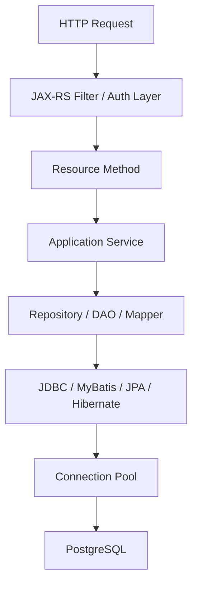
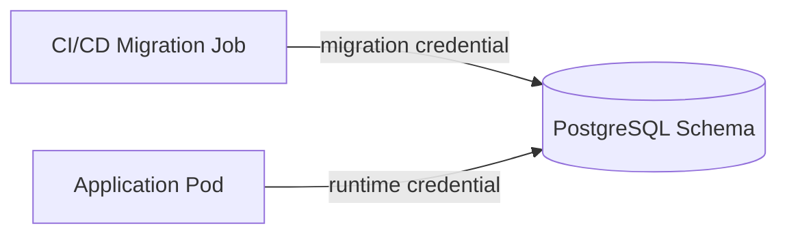

# Part 049 — Persistence Layer Security

Persistence layer security bukan hanya “jangan SQL injection”.

Di sistem enterprise Java/JAX-RS, persistence layer adalah titik di mana request, identity, tenant, authorization, business rule, SQL, schema permission, credential, audit, log, dan operational access bertemu.

Jika layer ini lemah, bug kecil bisa berubah menjadi:

- data leakage antar tenant;
- privilege escalation melalui query path;
- destructive migration;
- unauthorized read melalui reporting endpoint;
- PII bocor di SQL log;
- dynamic SQL injection;
- bypass authorization di repository;
- migration user terlalu powerful;
- service account bisa drop schema production;
- cache key tidak tenant-aware;
- incident yang sulit diaudit karena tidak ada trace.

Prinsip utama:

> Persistence security is about controlling who can read or mutate which data, through which path, under which transaction, with which evidence.

---

## 1. Security Boundary in Java/JAX-RS Persistence Flow

Dalam request lifecycle JAX-RS, security biasanya dimulai sebelum resource method dipanggil.

Namun persistence security tidak boleh bergantung hanya pada controller/resource layer.

Alur umum:



Security context harus tetap terbawa sampai persistence boundary.

Yang perlu dijaga:

- principal/user identity;
- tenant identity;
- role/permission claim;
- correlation/request ID;
- operation name;
- data classification;
- audit actor;
- authorization decision evidence.

Jika repository tidak tahu tenant atau actor, ia rentan menghasilkan query global yang tidak sengaja membaca data lintas boundary.

---

## 2. SQL Injection Is a Persistence Boundary Failure

SQL injection terjadi ketika input tidak dipercaya masuk ke struktur SQL, bukan hanya value SQL.

Contoh raw JDBC yang salah:

```java
String sql = "select * from quote where quote_number = '" + quoteNumber + "'";
statement.executeQuery(sql);
```

Masalahnya bukan hanya string concatenation.

Masalahnya adalah aplikasi membiarkan input user menjadi bagian dari grammar SQL.

Yang aman:

```java
String sql = "select * from quote where quote_number = ?";
try (PreparedStatement ps = connection.prepareStatement(sql)) {
    ps.setString(1, quoteNumber);
    try (ResultSet rs = ps.executeQuery()) {
        // map result
    }
}
```

Rule:

> Values must be bound. SQL structure must be controlled by trusted code.

---

## 3. Parameter Binding: JDBC, MyBatis, JPA

### JDBC

Gunakan `PreparedStatement` untuk value.

```java
PreparedStatement ps = connection.prepareStatement(
    "select * from orders where tenant_id = ? and order_id = ?"
);
ps.setString(1, tenantId);
ps.setString(2, orderId);
```

### MyBatis

Gunakan `#{}` untuk bind parameter.

```xml
<select id="findById" resultMap="OrderResultMap">
  select *
  from orders
  where tenant_id = #{tenantId}
    and order_id = #{orderId}
</select>
```

Hindari `${}` untuk input user.

```xml
<!-- Dangerous if sortColumn comes from user -->
order by ${sortColumn}
```

Jika dynamic order diperlukan, gunakan whitelist di Java atau XML branching.

```xml
<choose>
  <when test="sort == 'createdAt'">order by created_at</when>
  <when test="sort == 'updatedAt'">order by updated_at</when>
  <otherwise>order by order_id</otherwise>
</choose>
```

### JPA/Hibernate

Gunakan named parameter.

```java
entityManager.createQuery(
    "select q from QuoteEntity q where q.tenantId = :tenantId and q.id = :id",
    QuoteEntity.class
).setParameter("tenantId", tenantId)
 .setParameter("id", id)
 .getSingleResult();
```

Native query tetap harus bind parameter.

```java
entityManager.createNativeQuery("select * from quote where tenant_id = :tenantId")
    .setParameter("tenantId", tenantId)
    .getResultList();
```

---

## 4. Dynamic SQL Risk

Dynamic SQL tidak otomatis salah.

Dynamic SQL menjadi berbahaya ketika:

- column name berasal dari request tanpa whitelist;
- sort direction berasal dari request tanpa whitelist;
- filter operator dibuat dari user input;
- table name/schema name dibuat dari user input;
- raw condition fragment dikirim dari API;
- search expression dipasang langsung ke query;
- dynamic IN clause tidak dibatasi;
- wildcard search tidak di-escape;
- JSON path/query dibuat dari input mentah.

Bad smell:

```java
String where = request.getQueryParam("where");
String sql = "select * from quote where " + where;
```

Ini bukan flexibility.

Ini memberi user mini SQL console.

Dynamic query yang aman harus memakai:

- parameter binding;
- enum/whitelist untuk field;
- enum/whitelist untuk direction/operator;
- maximum filter count;
- maximum page size;
- controlled query builder;
- integration test untuk malicious input.

---

## 5. Safe Sorting and Filtering Contract

Sorting/filtering dari API harus dianggap sebagai contract, bukan string passthrough.

Contoh safe mapping:

```java
public enum QuoteSortField {
    CREATED_AT("created_at"),
    UPDATED_AT("updated_at"),
    QUOTE_NUMBER("quote_number");

    private final String column;

    QuoteSortField(String column) {
        this.column = column;
    }

    public String column() {
        return column;
    }
}
```

Kemudian mapper hanya menerima value dari enum yang sudah tervalidasi.

Pada MyBatis, jika akhirnya memakai `${}` untuk identifier SQL, pastikan input sudah berasal dari whitelist internal, bukan langsung dari request.

Pada JPA Criteria API, dynamic field juga tetap perlu whitelist agar user tidak bisa query field internal yang tidak seharusnya diekspos.

---

## 6. Tenant Isolation Is Security, Not Just Filtering

Tenant ID bukan sekadar kolom biasa.

Tenant ID adalah security boundary.

Query seperti ini berbahaya:

```sql
select * from quote where quote_id = ?;
```

Lebih aman:

```sql
select *
from quote
where tenant_id = ?
  and quote_id = ?;
```

Untuk command:

```sql
update quote
set status = ?
where tenant_id = ?
  and quote_id = ?
  and status = ?;
```

Jika `tenant_id` tidak ada di WHERE clause, repository bisa membaca atau mengubah data tenant lain jika ID collision atau bug routing terjadi.

Rule:

> Every tenant-scoped query must prove tenant scope at the persistence boundary.

---

## 7. Row-Level Security Awareness

PostgreSQL Row-Level Security atau RLS dapat menjadi defense-in-depth.

Namun RLS bukan pengganti application-level authorization.

RLS berguna ketika:

- ada risiko query lupa tenant filter;
- beberapa service/user mengakses schema sama;
- data sangat sensitif;
- compliance membutuhkan enforcement di database;
- reporting/query path kompleks dan raw SQL banyak.

Tetapi RLS menambah kompleksitas:

- perlu session variable atau role strategy;
- query plan bisa berubah;
- debugging permission lebih sulit;
- migration/test harus aware RLS;
- connection pool harus mengatur reset session context;
- background job harus punya policy jelas.

Internal verification diperlukan sebelum mengasumsikan RLS dipakai.

---

## 8. Least Privilege DB User

Service runtime user tidak seharusnya punya privilege seperti migration/admin user.

Minimal separation:

| User | Purpose | Typical Permission |
|---|---|---|
| Runtime app user | Normal service query/write | SELECT/INSERT/UPDATE/DELETE on owned tables only |
| Read-only user | Reporting/diagnostic read | SELECT only, limited schema/table |
| Migration user | Schema migration | DDL privileges, controlled pipeline only |
| Admin/DBA user | Operational admin | Restricted human/platform access |

Anti-pattern:

- service app user bisa `DROP TABLE`;
- service app user bisa alter schema;
- migration credential disimpan di app runtime secret;
- semua service memakai satu DB user global;
- read-only dashboard memakai write credential;
- local dev credential sama dengan shared environment;
- manual support tool memakai owner privilege.

Rule:

> Runtime code should not have more database privilege than its runtime responsibility.

---

## 9. PostgreSQL Schema Permission Discipline

Dalam PostgreSQL, privilege bukan hanya table-level.

Perlu memeriksa:

- database connect privilege;
- schema usage privilege;
- table privileges;
- sequence privileges;
- function/procedure execute privilege;
- view/materialized view access;
- default privileges untuk object baru;
- ownership object migration;
- grants setelah migration;
- search path.

`search_path` sering diremehkan.

Jika search path tidak dikontrol, query unqualified dapat mengambil object dari schema yang tidak diharapkan.

Untuk production-grade system, schema qualification atau controlled search path perlu jelas.

---

## 10. Migration User vs Runtime User

Migration membutuhkan DDL.

Runtime service biasanya tidak.

Karena itu credential migration dan credential runtime sebaiknya dipisah.

Contoh separation:



Risiko jika tidak dipisah:

- bug runtime bisa alter schema;
- SQL injection impact menjadi jauh lebih besar;
- leaked app secret memberi attacker DDL access;
- accidental migration dari app startup;
- rollback/debug manual lebih berbahaya.

Internal verification checklist harus memastikan bagaimana CSG/team menjalankan migration: app startup, CI job, Kubernetes job, GitOps pipeline, DBA-controlled, atau hybrid.

---

## 11. Read-Only Transaction Is Not the Same as Read-Only User

Read-only transaction membantu mencegah write dalam transaction tertentu.

Read-only DB user membatasi privilege di database.

Keduanya berbeda.

```java
@Transactional(readOnly = true)
public QuoteView getQuote(String id) {
    return quoteRepository.findView(id);
}
```

`readOnly = true` dapat membantu intent dan optimization tertentu, tetapi jangan menganggapnya security boundary absolut.

Jika connection memakai write-capable DB user, bug atau native query tertentu tetap perlu diverifikasi sesuai framework dan database behavior.

Security boundary yang lebih kuat adalah privilege database.

---

## 12. Authorization Must Not Live Only in API Layer

Authorization yang hanya dicek di resource method mudah bocor ketika:

- repository dipanggil dari worker;
- repository dipakai oleh scheduled job;
- service method dipakai ulang oleh internal API;
- event consumer melakukan write;
- admin endpoint reuse query umum;
- batch job bypass controller;
- test helper menjadi production utility.

Lebih defensible:

- application service menerima security context eksplisit;
- repository menerima tenant/scope eksplisit;
- query selalu menyertakan tenant/data scope;
- domain operation mengecek state/invariant;
- database constraint menegakkan invariant kritikal;
- audit mencatat actor dan operation.

---

## 13. Sensitive Data and Column-Level Awareness

Persistence engineer harus tahu field mana yang sensitif.

Contoh:

- customer identity;
- email/phone/address;
- payment-related metadata;
- account identifiers;
- contract data;
- quote/order commercial terms;
- internal notes;
- token/API credential;
- workflow comments;
- audit actor;
- tenant/customer ID.

Risiko utama:

- sensitive column ikut `select *`;
- entity serialized ke API response;
- SQL log mencetak parameter sensitif;
- exception message berisi value sensitif;
- test fixture memakai data nyata;
- cache menyimpan PII tanpa TTL/encryption;
- data export tanpa masking;
- debugging dump dikirim ke ticket/chat.

Rule:

> Persistence code should make sensitive data movement explicit.

---

## 14. Avoid `select *` in Production Query Design

`select *` terlihat praktis, tetapi buruk untuk security dan performance.

Masalah:

- kolom sensitif baru otomatis ikut terbaca;
- payload lebih besar;
- mapping fragile terhadap schema change;
- index-only scan bisa gagal;
- audit/query review sulit;
- projection tidak jelas;
- DTO bisa membawa data yang tidak dibutuhkan.

Lebih baik eksplisit:

```sql
select
  quote_id,
  quote_number,
  status,
  created_at,
  updated_at
from quote
where tenant_id = #{tenantId}
  and quote_id = #{quoteId}
```

Pada JPA, hindari load entity penuh jika endpoint hanya butuh summary projection.

---

## 15. JPA Entity Serialization Risk

JPA entity jangan sembarangan dikembalikan langsung sebagai JAX-RS response.

Risiko:

- lazy loading terjadi saat serialization;
- sensitive field ikut keluar;
- relationship graph terbuka;
- circular reference;
- tenant/internal field bocor;
- persistence annotation bercampur API contract;
- accidental update jika entity managed dimutasi sebelum response.

Gunakan response DTO atau projection model.

```java
public record QuoteSummaryResponse(
    String id,
    String quoteNumber,
    String status
) {}
```

Security benefit:

- field output eksplisit;
- sensitive field tidak ikut otomatis;
- API contract tidak tergantung entity schema;
- query bisa projection-only.

---

## 16. MyBatis ResultMap and Sensitive Field Leakage

MyBatis memberi kontrol eksplisit atas SQL, tetapi mapping bisa tetap membocorkan field sensitif.

Periksa:

- apakah query memakai `select *`;
- apakah ResultMap memetakan kolom internal;
- apakah DTO projection dipakai sebagai API response;
- apakah nested result membawa object berisi sensitive field;
- apakah mapper reuse query admin untuk endpoint publik;
- apakah dynamic projection tersedia tanpa whitelist.

Projection untuk endpoint publik harus berbeda dari projection internal/admin.

---

## 17. Encryption: At Rest, In Transit, and Application-Level

Ada beberapa level encryption.

| Layer | Purpose | Notes |
|---|---|---|
| TLS client-to-database | Protect data in transit | Verify JDBC SSL config/internal platform policy |
| Disk/storage encryption | Protect storage media | Usually cloud/platform managed |
| Column/application encryption | Protect sensitive values from broad DB access | Adds key management/query limitation |
| Tokenization | Replace sensitive value with token | Useful for payment/identity-like data |

Application-level encryption tidak gratis.

Trade-off:

- indexing sulit;
- equality search perlu deterministic encryption/tokenization;
- range query hampir tidak mungkin;
- key rotation kompleks;
- migration/backfill perlu plan;
- debugging lebih sulit;
- logging harus hati-hati.

Jangan mengklaim encryption internal CSG tanpa verifikasi.

---

## 18. Secret and Credential Handling

Database credential harus diperlakukan sebagai production secret.

Yang harus dicek:

- disimpan di secret manager/Kubernetes Secret/Vault atau equivalent;
- tidak masuk repository;
- tidak dicetak di log startup;
- rotation process jelas;
- runtime user dan migration user dipisah;
- local/dev credential berbeda dari shared/prod;
- credential scope per service/environment;
- connection pool bisa recover setelah rotation;
- failed rotation punya rollback plan.

Bad smell:

```yaml
DATABASE_PASSWORD: password123
```

Atau credential muncul di stack trace/health endpoint.

---

## 19. Logging SQL Safely

SQL logging sangat membantu debugging.

Namun SQL logging bisa menjadi data exfiltration path.

Risiko:

- bind parameter berisi PII;
- query berisi token/credential;
- error log mencetak payload besar;
- slow query log menyimpan literal;
- Hibernate format SQL + bind values aktif di production;
- log aggregator diakses banyak pihak;
- debug logging lupa dimatikan.

Safer practice:

- log SQL template tanpa sensitive values;
- redact known sensitive fields;
- sample logs;
- enable bind logging hanya sementara dan terkontrol;
- gunakan correlation ID;
- batasi retention;
- pastikan incident/debug export disanitasi.

---

## 20. Exception Message Leakage

Persistence exception sering membawa detail internal:

- table name;
- column name;
- constraint name;
- SQL fragment;
- bind value;
- connection detail;
- schema name;
- stack trace framework.

Jangan kirim exception mentah ke HTTP response.

JAX-RS exception mapper harus memetakan ke error contract yang aman.

Contoh mapping:

| Failure | External Response | Internal Log |
|---|---|---|
| Unique violation | 409 Conflict | constraint name, correlation ID |
| FK violation | 409/422 | constraint name, table, operation |
| SQL syntax bug | 500 | sanitized SQL identifier, deployment version |
| Timeout | 503/504 | query name, duration, correlation ID |
| Authorization/data scope failure | 403/404 | principal, tenant, operation |

External response tidak perlu menyebut table/schema internal.

---

## 21. Stored Procedure and Function Security

Database function/procedure punya security model sendiri.

Periksa:

- `SECURITY DEFINER` vs `SECURITY INVOKER`;
- execute privilege;
- search path di function;
- input validation;
- dynamic SQL di PL/pgSQL;
- audit trail;
- error message leakage;
- migration ownership;
- test coverage.

`SECURITY DEFINER` dapat memperluas privilege caller.

Jika salah, runtime user yang privilege-nya terbatas bisa mengeksekusi operation lebih tinggi melalui function.

---

## 22. Cache Security

Redis/cache layer sering menjadi blind spot persistence security.

Periksa:

- cache key menyertakan tenant/scope;
- cache value tidak memuat PII yang tidak perlu;
- TTL sesuai data sensitivity;
- invalidation aman;
- cache tidak bypass authorization;
- admin/public response tidak memakai key yang sama;
- encryption/transport security sesuai platform;
- log cache miss/hit tidak mencetak sensitive key.

Bad smell:

```text
quote:{quoteId}
```

Lebih aman:

```text
tenant:{tenantId}:quote-summary:{quoteId}
```

Tetap pastikan `tenantId` bukan secret dan log/cache key policy internal terpenuhi.

---

## 23. Security in MyBatis + JPA Mixed Systems

Mixing MyBatis dan JPA dapat menciptakan security inconsistency.

Contoh:

- JPA entity memakai tenant filter, MyBatis query lupa tenant condition;
- JPA soft delete filter aktif, MyBatis query membaca deleted rows;
- Hibernate interceptor mengisi audit actor, MyBatis update tidak;
- JPA entity listener mengenkripsi field, MyBatis raw insert tidak;
- MyBatis mapper melakukan update tanpa version/authorization check;
- second-level cache menyimpan data yang diubah lewat MyBatis;
- native query bypass filter framework.

Rule:

> A security rule enforced only by one persistence framework is not a system rule until every access path enforces it.

---

## 24. Security Testing for Persistence Layer

Security test persistence harus mencakup:

- SQL injection negative test;
- dynamic sort/filter whitelist test;
- tenant isolation test;
- authorization bypass test;
- soft-deleted data visibility test;
- read-only user permission test;
- migration user separation test jika feasible;
- log redaction test;
- sensitive field projection test;
- cache tenant key test;
- MyBatis/JPA mixed path consistency test.

Contoh test idea:

```java
@Test
void dynamicSortRejectsUnknownColumn() {
    assertThrows(InvalidSortException.class, () ->
        repository.search(new SearchQuery("created_at; drop table quote; --"))
    );
}
```

Lebih penting lagi: test harus menggunakan PostgreSQL nyata bila behavior spesifik database terlibat.

---

## 25. Security Review Checklist for PR

Saat mereview PR persistence layer, tanyakan:

1. Apakah semua value user memakai parameter binding?
2. Apakah ada `${}` MyBatis, string concatenation SQL, atau native query raw?
3. Apakah dynamic sort/filter memakai whitelist?
4. Apakah tenant/data scope selalu hadir di query?
5. Apakah query memakai `select *`?
6. Apakah response DTO mengekspos field sensitif?
7. Apakah repository dipakai oleh worker/job yang bypass API authorization?
8. Apakah DB user runtime punya privilege berlebihan?
9. Apakah migration membutuhkan grant baru?
10. Apakah SQL/bind logging bisa membocorkan PII?
11. Apakah exception mapper menyembunyikan detail internal?
12. Apakah cache key tenant-aware?
13. Apakah MyBatis dan JPA menegakkan filter/security rule yang sama?
14. Apakah test mencakup malicious input dan cross-tenant attempt?
15. Apakah audit trail mencatat actor/operation yang cukup?

---

## 26. Internal Verification Checklist

Karena detail internal CSG/team tidak tersedia, verifikasi langsung hal berikut:

- framework auth/authz yang dipakai sebelum JAX-RS resource;
- cara security context diteruskan ke service/repository;
- tenant model dan tenant enforcement convention;
- penggunaan PostgreSQL RLS atau tidak;
- runtime DB user dan migration DB user;
- schema/table/sequence/function privilege;
- secret manager dan credential rotation process;
- policy SQL logging dan bind parameter logging;
- sensitive field/PII classification;
- encryption/tokenization policy;
- MyBatis dynamic SQL convention;
- JPA filter/interceptor/entity listener security rule;
- cache key convention Redis;
- exception mapping standard;
- security test strategy;
- PR checklist untuk persistence security;
- incident notes terkait SQL injection, data leakage, permission, or credential issue.

---

## 27. Common Failure Modes

| Failure Mode | Cause | Detection | Prevention |
|---|---|---|---|
| SQL injection | Raw SQL concatenation | Security test, code review | Parameter binding, whitelist |
| Cross-tenant read | Missing tenant filter | Tenant isolation test, audit | Tenant scoped repository contract |
| Sensitive data leakage | Entity returned as API DTO | API response review | DTO projection |
| PII in logs | Bind logging enabled | Log scan | Redaction and controlled logging |
| Runtime user too powerful | Shared admin credential | DB privilege audit | Least privilege users |
| Migration privilege leak | Migration secret used by app | Secret review | Separate credentials |
| Cache data leakage | Key lacks tenant scope | Cache key review | Tenant-aware key design |
| Bypassed JPA filter | Native/MyBatis query | Mixed path test | Enforce rule in all access paths |

---

## 28. Practical Senior Engineer Heuristic

Ketika melihat persistence security change, jangan hanya bertanya:

> “Apakah query ini jalan?”

Tanyakan:

> “Siapa yang bisa memanggil path ini, data scope apa yang dibuktikan query ini, privilege apa yang dipakai connection ini, data sensitif apa yang bergerak, dan evidence apa yang tersisa jika terjadi incident?”

Security persistence yang matang selalu menggabungkan:

- safe query construction;
- explicit data scope;
- least privilege;
- DTO/projection discipline;
- log redaction;
- auditability;
- test coverage;
- operational evidence.

---

## 29. Summary

Persistence layer security adalah kombinasi antara code discipline, database privilege, runtime configuration, schema design, logging policy, cache discipline, dan review culture.

JDBC, MyBatis, JPA, dan Hibernate memiliki risiko berbeda:

- JDBC raw memberi kontrol penuh tetapi mudah salah jika SQL dibangun manual;
- MyBatis memberi SQL visibility tetapi dynamic SQL harus dijaga ketat;
- JPA/Hibernate mengurangi boilerplate tetapi filter, lazy loading, entity serialization, dan native query bisa menjadi blind spot;
- PostgreSQL menyediakan privilege, RLS, function security, dan constraints, tetapi harus dikonfigurasi dengan benar;
- Redis/cache dapat mempercepat read path tetapi dapat membocorkan data jika key/scope salah.

Final rule:

> Persistence security is not a feature. It is a property of every query, transaction, credential, cache entry, migration, log line, and review decision.
