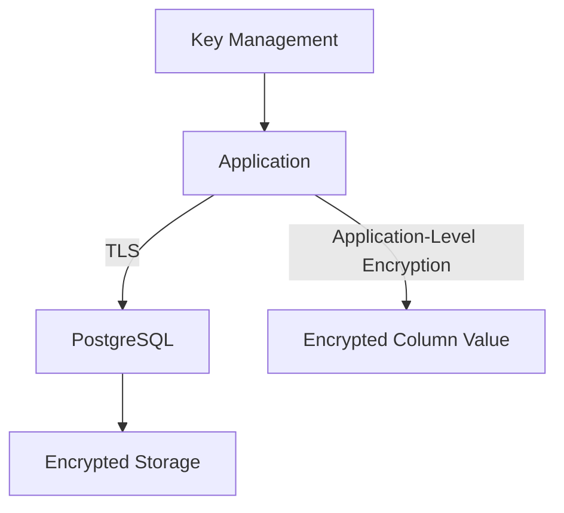
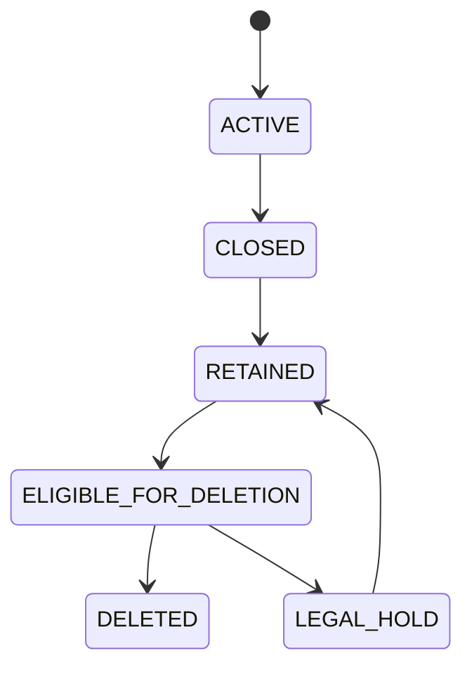
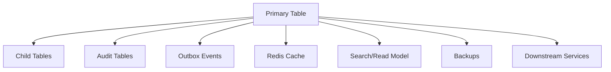

# Part 050 — Data Privacy and Compliance

Data privacy dan compliance bukan hanya urusan legal atau security team.

Di sistem enterprise, persistence engineer ikut menentukan:

- data apa yang disimpan;
- berapa lama data disimpan;
- siapa yang bisa mengakses data;
- apakah data muncul di log;
- apakah data masuk backup;
- apakah data dipakai di test environment;
- apakah data bisa dihapus atau dianonimkan;
- apakah perubahan data bisa diaudit;
- apakah export/reporting membocorkan informasi sensitif;
- apakah evidence compliance bisa dibuktikan saat audit.

Prinsip utama:

> If data is persisted, it becomes a liability, an obligation, and an audit surface.

---

## 1. Privacy Starts at Data Modelling

Privacy tidak bisa ditempel di akhir.

Saat membuat table, entity, mapper, DTO, atau event payload, engineer harus bertanya:

- Apakah field ini benar-benar perlu disimpan?
- Apakah field ini PII atau sensitive business data?
- Apakah field ini perlu searchable?
- Apakah field ini perlu tampil di API?
- Apakah field ini perlu masuk audit log?
- Apakah field ini perlu masuk event?
- Apakah field ini perlu masuk cache?
- Apakah field ini perlu retention berbeda?
- Apakah field ini harus bisa dihapus/anonymized?
- Apakah field ini boleh dipakai di test data?

Data yang tidak disimpan tidak perlu dilindungi, dimigrasikan, dihapus, dienkripsi, dimasking, atau diaudit.

---

## 2. Data Classification

Sebelum menerapkan privacy control, klasifikasikan data.

Contoh kategori:

| Category | Example | Concern |
|---|---|---|
| Direct PII | name, email, phone, address | Identity exposure |
| Indirect PII | customer ID, account ID, device ID | Linkability |
| Sensitive commercial data | quote price, discount, contract term | Business confidentiality |
| Authentication secret | token, API key, credential | Account compromise |
| Operational metadata | IP, user agent, audit actor | Traceability/privacy |
| Regulated data | payment/financial/health-like fields if applicable | Legal obligation |
| Internal-only data | notes, workflow comments, support remarks | Access control and leakage |

Classification harus memengaruhi:

- column naming;
- encryption decision;
- masking policy;
- retention policy;
- access control;
- API response design;
- logging policy;
- cache TTL;
- export approval;
- test data generation.

Internal classification CSG/team harus diverifikasi, bukan diasumsikan.

---

## 3. PII in Database

PII di database perlu dilihat dari beberapa sisi:

- apakah disimpan sebagai plain text;
- apakah di-index;
- apakah ikut foreign key atau unique constraint;
- apakah masuk JSONB blob;
- apakah ikut audit table;
- apakah ikut outbox event;
- apakah ikut cache;
- apakah ikut search index;
- apakah ikut materialized view;
- apakah ikut backup;
- apakah ikut data warehouse/export;
- apakah ada retention/deletion path.

JSONB sering menjadi blind spot.

Jika payload mentah disimpan sebagai JSONB, PII bisa tersembunyi dari schema review.

Bad smell:

```sql
payload JSONB NOT NULL
```

Tanpa kontrak jelas tentang isi `payload`, privacy review menjadi sulit.

---

## 4. PII in Logs

Log sering lebih mudah diakses daripada database.

Karena itu PII di log sering lebih berbahaya.

Sumber PII di log:

- request body log;
- SQL bind parameter log;
- exception message;
- validation error detail;
- audit debug log;
- event payload log;
- retry/dead-letter log;
- migration/backfill log;
- test failure snapshot;
- cache key/value log;
- distributed trace attribute.

Rule:

> A value protected in the database but printed in logs is not protected.

Praktik aman:

- log identifier teknis, bukan raw PII;
- gunakan correlation ID;
- redaction central;
- avoid logging request body by default;
- mask sensitive fields;
- restrict bind parameter logging;
- sample debug logs;
- define log retention.

---

## 5. Masking

Masking mengubah tampilan data agar tidak memperlihatkan value penuh.

Contoh:

| Data | Masked |
|---|---|
| `john.doe@example.com` | `j***@example.com` |
| `+628123456789` | `+628*****789` |
| `1234567890` | `******7890` |

Masking cocok untuk:

- UI admin/support;
- logs;
- export;
- test snapshot;
- non-production copy;
- analytics sample.

Namun masking bukan encryption.

Masked value masih bisa menjadi identifying jika pola terlalu jelas atau dataset kecil.

Masking policy harus konsisten antara:

- API response;
- SQL/reporting view;
- logs;
- support tool;
- export job;
- test data.

---

## 6. Tokenization

Tokenization mengganti data sensitif dengan token yang tidak bermakna di sistem utama.

Contoh:

```text
real email/identifier -> token reference
```

Keuntungan:

- service utama tidak menyimpan value sensitif penuh;
- blast radius kebocoran database berkurang;
- token bisa direvoke/rotate;
- access ke vault/token service bisa diaudit terpisah.

Trade-off:

- dependency runtime tambahan;
- lookup latency;
- failure mode token service;
- migration/backfill kompleks;
- query/search terbatas;
- perlu cache discipline.

Tokenization cocok untuk data yang sangat sensitif dan jarang perlu diproses langsung di query SQL.

---

## 7. Encryption

Encryption dapat terjadi di beberapa layer.



Jenis utama:

| Type | Protects Against | Limitation |
|---|---|---|
| TLS | Network sniffing | Data readable by DB |
| Storage encryption | Disk theft/snapshot exposure | Data readable by DB/runtime |
| Column/application encryption | Broad DB read exposure | Query/index limitation |
| Deterministic encryption | Equality lookup | Pattern leakage |
| Key wrapping/rotation | Key lifecycle | Operational complexity |

Jangan mengenkripsi tanpa memahami query requirement.

Jika field harus dipakai untuk range query, sort, partial search, atau uniqueness, encryption strategy harus dirancang dengan hati-hati.

---

## 8. Hashing vs Encryption

Hashing dan encryption berbeda.

| Mechanism | Reversible | Use Case |
|---|---|---|
| Hash | No | Fingerprint, dedup check, password-like verification with salt/KDF |
| Encryption | Yes with key | Need recover original value |
| Tokenization | Indirect | Replace sensitive value with reference |

Untuk request fingerprint/idempotency, hash cocok.

Untuk data yang perlu ditampilkan kembali, encryption atau tokenization diperlukan.

Untuk password, jangan pakai general hash biasa; gunakan password hashing/KDF sesuai security standard internal.

Dalam seri ini, detail cryptographic standard harus mengikuti policy internal/security team.

---

## 9. Data Retention

Retention menjawab: berapa lama data boleh/harus disimpan.

Retention bukan hanya `created_at < now() - interval 'x days'`.

Perlu mempertimbangkan:

- business lifecycle;
- legal hold;
- audit obligation;
- dispute period;
- quote/order lifecycle;
- workflow/case status;
- downstream replicated data;
- backup retention;
- logs/traces retention;
- cache retention;
- data warehouse retention;
- event retention Kafka/RabbitMQ/DLQ;
- outbox/inbox retention;
- test environment retention.

Retention policy harus diterjemahkan menjadi persistence behavior yang jelas.

---

## 10. Retention State Machine

Data enterprise jarang langsung dihapus.

Sering ada state lifecycle.



State seperti `LEGAL_HOLD` penting.

Jika retention job menghapus data yang masih berada dalam dispute/legal hold, itu compliance incident.

---

## 11. Deletion Semantics

“Delete” bisa berarti beberapa hal.

| Type | Meaning | Risk |
|---|---|---|
| Hard delete | Row removed | Break FK/audit/history |
| Soft delete | Mark as deleted | Data still exists and can leak |
| Anonymization | Remove identity fields | Hard to reverse, must preserve referential analytics |
| Pseudonymization | Replace identity with token/pseudonym | Re-identification possible if mapping exists |
| Tombstone | Keep minimal deletion marker | Needed for dedup/event sync |

Untuk enterprise systems, deletion harus didesain per data class.

Tidak semua data boleh hard delete karena audit, financial, legal, atau operational needs.

Tidak semua data boleh soft delete karena privacy obligation.

---

## 12. Deletion in Relational Graphs

Hard delete pada relational graph sulit.

Pertanyaan:

- apakah table punya FK dari child table?
- apakah child table punya PII juga?
- apakah audit table menyimpan copy?
- apakah outbox/event table menyimpan payload?
- apakah search index punya replica?
- apakah cache punya value?
- apakah materialized view menyimpan data?
- apakah backup tetap menyimpan data?
- apakah downstream microservice punya copy?

Deletion plan harus melacak semua copy.



Jika hanya primary table yang dihapus, privacy obligation mungkin belum selesai.

---

## 13. Audit Trail vs Privacy Deletion

Auditability dan deletion kadang tegang.

Audit ingin menyimpan history.

Privacy ingin menghapus/minimize sensitive data.

Solusi biasanya bukan memilih salah satu secara absolut, tetapi mendesain audit data dengan minimization:

- simpan actor ID internal, bukan full personal details;
- simpan event type dan timestamp;
- mask old/new value sensitif;
- simpan hash/fingerprint untuk proof tanpa raw data;
- pisahkan audit sensitive payload;
- beri retention berbeda;
- dukung anonymization audit subject;
- catat reason/legal basis.

Audit trail harus berguna untuk investigation tanpa menjadi duplicate PII dump.

---

## 14. Access Traceability

Compliance sering membutuhkan kemampuan menjawab:

- siapa mengakses data ini?
- kapan diakses?
- melalui endpoint/job/report apa?
- untuk tenant/customer mana?
- apakah akses authorized?
- apakah data diexport?
- apakah data diubah?
- apakah data dikirim ke downstream?

Persistence layer dapat membantu dengan:

- audit table;
- application audit event;
- database audit extension/policy jika ada;
- correlation ID;
- actor/user context;
- tenant ID;
- operation name;
- immutable event log;
- export record.

Namun jangan asal audit semua `SELECT` tanpa memahami volume dan privacy impact.

---

## 15. Data Export Risk

Export adalah salah satu jalur terbesar data leakage.

Export bisa berupa:

- CSV download;
- admin report;
- BI pipeline;
- support dump;
- database snapshot;
- debugging query result;
- integration feed;
- archive file;
- regulatory evidence package.

Checklist export:

- siapa requester;
- legal/business purpose;
- tenant/customer scope;
- columns included;
- masking/anonymization;
- approval workflow;
- encryption at rest/in transit;
- expiry/retention export file;
- audit record;
- recipient tracking;
- revocation/deletion plan.

`select *` untuk export hampir selalu red flag.

---

## 16. Backup Privacy

Data yang sudah dihapus dari primary database mungkin masih ada di backup.

Backup privacy perlu memahami:

- backup retention;
- point-in-time recovery window;
- who can restore;
- restored environment controls;
- backup encryption;
- backup access audit;
- deletion/anonymization limitation;
- legal/compliance interpretation;
- disaster recovery testing;
- non-production restore masking.

Engineer tidak boleh menjanjikan data “langsung hilang dari semua tempat” tanpa memahami backup policy.

Internal verification dengan DBA/platform/SRE wajib.

---

## 17. Test Data Privacy

Test environment sering menjadi jalur bocor karena kontrolnya lebih longgar.

Risiko:

- production dump dipakai di dev;
- PII muncul di test fixtures;
- snapshot integration test berisi data nyata;
- logs test masuk artifact CI;
- failed test mencetak payload sensitive;
- developer laptop menyimpan dump;
- shared staging punya broad access;
- exported query result dikirim via chat/ticket.

Praktik lebih aman:

- synthetic data by default;
- masked/anonymized production-like data;
- minimal dataset;
- short retention;
- restricted access;
- no real secrets;
- scrubbed logs;
- documented approval for production data use.

---

## 18. Migration and Backfill Privacy

Migration/backfill sering membaca dan menulis data massal.

Privacy risks:

- backfill log mencetak row data;
- temporary table menyimpan PII tanpa retention;
- failed migration meninggalkan staging table;
- script export ke local file;
- data transformation menggandakan sensitive fields;
- backfill event mengirim payload ke downstream;
- rollback menyimpan copy lama;
- dry-run output berisi sensitive values.

Backfill checklist:

- column classification;
- temp table cleanup;
- logging redaction;
- row count metrics without raw value;
- limited batch size;
- access approval;
- rollback plan;
- post-run verification;
- retention for intermediate artifacts.

---

## 19. Event-Driven Privacy

Event payload sering menyebarkan data ke banyak service.

Jika event berisi PII, maka privacy obligation ikut menyebar.

Periksa:

- apakah event perlu membawa full PII atau cukup ID/reference;
- Kafka retention topic;
- DLQ retention;
- replay behavior;
- consumer storage;
- schema registry/history;
- log consumer;
- outbox payload;
- CDC payload;
- Debezium before/after image;
- redaction in event observability.

Event minimalism sangat penting.

Rule:

> Publish the minimum data needed for consumers to act, not the entire entity because it is convenient.

---

## 20. Redis and Cache Privacy

Redis/cache sering menyimpan data yang sama sensitifnya dengan database, tetapi governance-nya berbeda.

Periksa:

- value mengandung PII atau sensitive commercial data;
- key mengandung PII;
- TTL;
- eviction behavior;
- encryption/transport;
- access control;
- tenant-aware key;
- cache dump/persistence setting;
- log of cache key/value;
- invalidation after deletion/anonymization;
- cache in non-prod.

Hindari cache key seperti:

```text
customer-email:john.doe@example.com
```

Lebih baik gunakan internal ID atau hashed key sesuai policy.

---

## 21. PostgreSQL Views for Privacy Boundaries

Kadang view dapat membantu membatasi field untuk read path.

Contoh:

```sql
create view quote_public_view as
select
  tenant_id,
  quote_id,
  quote_number,
  status,
  created_at
from quote;
```

Keuntungan:

- projection reusable;
- field sensitive tidak ikut;
- permission bisa diberikan ke view, bukan table penuh;
- reporting query lebih aman.

Trade-off:

- migration harus maintain view;
- performance perlu dicek;
- view bisa menyembunyikan query complexity;
- updatable view punya aturan sendiri;
- JPA/MyBatis mapping perlu sinkron.

View bukan magic, tetapi bisa menjadi privacy boundary tambahan jika dikelola disiplin.

---

## 22. Privacy in MyBatis

MyBatis privacy discipline:

- hindari `select *`;
- gunakan projection DTO eksplisit;
- pisahkan mapper admin vs public/support;
- whitelist field export;
- pastikan dynamic SQL tidak membuka field internal;
- result map tidak memetakan sensitive field tanpa kebutuhan;
- TypeHandler untuk encrypted/JSONB field diuji;
- SQL logging tidak mencetak sensitive bind values;
- tenant/privacy filter konsisten di semua query.

MyBatis memberi SQL visibility.

Gunakan visibility itu untuk privacy review.

---

## 23. Privacy in JPA/Hibernate

JPA/Hibernate privacy risks:

- entity terlalu besar dan memuat PII;
- entity dikembalikan ke API response;
- lazy relationship terbuka saat serialization;
- fetch join membawa data lebih dari kebutuhan;
- second-level cache menyimpan entity sensitif;
- audit listener menyimpan old/new value sensitif;
- native query bypass filter;
- soft delete/privacy filter tidak berlaku di query tertentu;
- bulk update/delete melewati lifecycle listener.

Praktik lebih aman:

- gunakan DTO projection;
- hindari entity serialization;
- batasi cache entity sensitif;
- review fetch graph;
- pisahkan admin/internal read model;
- test visibility field;
- audit value masking.

---

## 24. Compliance Evidence

Compliance bukan hanya melakukan hal benar.

Compliance juga membutuhkan bukti.

Evidence bisa berupa:

- migration history;
- access audit log;
- deletion job log;
- retention policy execution log;
- approval ticket;
- export record;
- schema/data classification document;
- encryption configuration evidence;
- DB privilege grants;
- incident response record;
- test results;
- dashboard/alert history;
- backup/restore policy;
- code review checklist.

Tanpa evidence, sulit membuktikan control berjalan.

---

## 25. Data Subject / Customer Request Readiness

Bergantung regulasi dan kontrak, sistem mungkin perlu mendukung request seperti:

- show/export personal data;
- correct data;
- delete/anonymize data;
- restrict processing;
- audit access;
- prove retention/deletion.

Persistence implication:

- data harus discoverable;
- copy di audit/outbox/cache/log harus dipahami;
- deletion/anonymization workflow harus aman;
- downstream propagation harus jelas;
- backup limitation harus terdokumentasi;
- operation harus auditable.

Jangan menambahkan PII ke schema baru tanpa tahu bagaimana data itu akan ditemukan dan dihapus/anonymized jika diwajibkan.

---

## 26. Privacy Review Checklist for PR

Saat mereview PR persistence layer, tanyakan:

1. Apakah ada field baru yang termasuk PII/sensitive data?
2. Apakah field tersebut benar-benar perlu disimpan?
3. Apakah field muncul di DTO/API response?
4. Apakah field muncul di event/outbox/inbox?
5. Apakah field muncul di log/error message/trace?
6. Apakah field masuk audit table?
7. Apakah field masuk cache/Redis?
8. Apakah field perlu encryption/tokenization/masking?
9. Apakah field punya retention/deletion/anonymization path?
10. Apakah migration/backfill mencetak atau menggandakan data sensitif?
11. Apakah test fixture memakai data nyata?
12. Apakah export/reporting path membatasi kolom?
13. Apakah query memakai `select *`?
14. Apakah backup/downstream copy dipahami?
15. Apakah compliance evidence tersedia?

---

## 27. Internal Verification Checklist

Karena detail internal CSG/team tidak tersedia, verifikasi langsung:

- data classification policy;
- definisi PII/sensitive commercial data internal;
- field quote/order/customer/catalog yang dianggap sensitif;
- logging redaction standard;
- SQL bind logging policy;
- encryption/tokenization/masking policy;
- retention policy per data domain;
- deletion/anonymization workflow;
- audit trail requirement;
- export/reporting approval workflow;
- production data use in non-prod;
- backup retention and restore process;
- Kafka/RabbitMQ topic retention untuk event berisi data sensitif;
- outbox/inbox retention;
- Redis/cache privacy convention;
- migration/backfill privacy checklist;
- compliance evidence repository;
- ownership antara backend, DBA, platform/SRE, security, dan compliance team.

---

## 28. Common Failure Modes

| Failure Mode | Cause | Detection | Prevention |
|---|---|---|---|
| PII leaked in logs | Request/SQL bind logging | Log scan, incident review | Redaction, logging policy |
| Sensitive field exposed by API | Entity serialization or broad DTO | API contract test | Explicit response DTO |
| Deleted data still visible | Soft delete filter missing | Query test | Centralized filter/condition |
| Data not deleted everywhere | Copies in audit/cache/events | Data lineage review | Deletion propagation plan |
| Production data in dev | DB dump reused | Environment audit | Synthetic/masked data |
| Export overexposes data | `select *` or broad report | Export review | Column whitelist, approval |
| Backup contradicts deletion promise | Backup retention misunderstood | Policy review | Document limitation clearly |
| Event spreads PII | Full entity event payload | Schema review | Minimal event payload |
| Cache leaks data | PII in key/value | Cache inspection | Tenant-aware, masked, TTL cache |

---

## 29. Practical Senior Engineer Heuristic

Ketika melihat perubahan persistence, jangan hanya bertanya:

> “Apakah schema ini benar dan query-nya cepat?”

Tanyakan juga:

> “Data sensitif apa yang sekarang menjadi durable, ke mana saja ia mengalir, berapa lama ia tinggal, siapa yang bisa melihatnya, bagaimana ia dihapus, dan bukti apa yang tersedia saat audit?”

Privacy dan compliance yang matang selalu memerlukan:

- data minimization;
- explicit classification;
- controlled access;
- safe logging;
- retention/deletion design;
- auditability;
- downstream lineage;
- test data discipline;
- compliance evidence.

---

## 30. Summary

Data privacy dan compliance adalah bagian inti dari persistence engineering.

Semakin enterprise sebuah sistem, semakin besar biaya dari data yang disimpan sembarangan.

JDBC, MyBatis, JPA, Hibernate, PostgreSQL, Redis, Kafka/RabbitMQ, migration scripts, logs, backups, dan test fixtures semuanya bisa menjadi tempat data sensitif hidup lebih lama dari yang diperkirakan.

Final rule:

> Treat every persisted field as a long-lived responsibility: classify it, minimize it, protect it, observe it, retain it deliberately, delete or anonymize it correctly, and preserve evidence that the system did what it promised.
