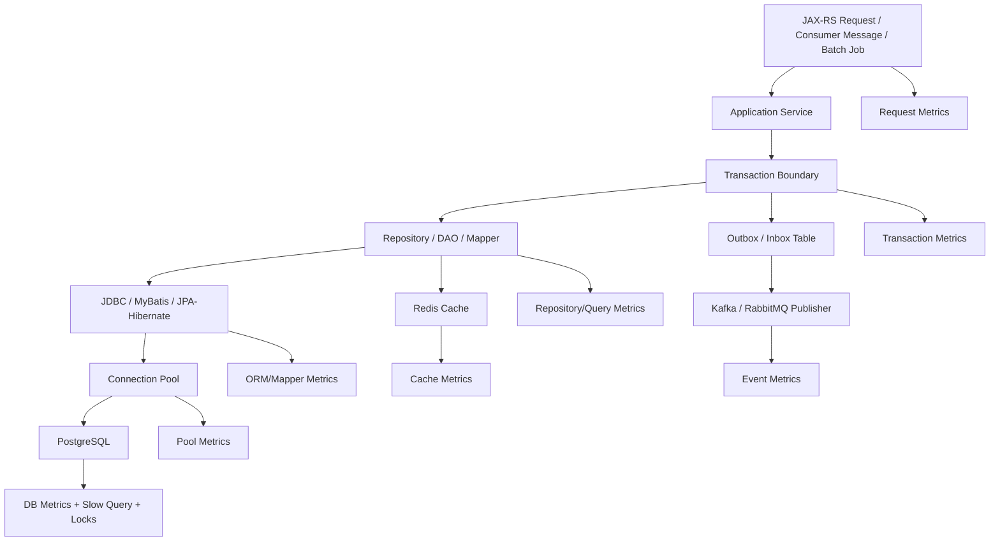

# Part 051 — Observability for Persistence Layer

Persistence layer yang tidak observable adalah blind spot production.

Di aplikasi enterprise Java/JAX-RS, banyak incident terlihat di permukaan sebagai:

- endpoint lambat,
- timeout API,
- pod restart,
- CPU naik,
- connection pool habis,
- Kafka/RabbitMQ consumer lag,
- order stuck,
- quote calculation lambat,
- user melihat data stale,
- batch job tidak selesai,
- migration gagal,
- incident sporadis yang sulit direproduksi.

Tetapi akar masalahnya sering ada di persistence layer:

- query terlalu lambat,
- query plan berubah,
- index tidak dipakai,
- N+1 query,
- transaction terlalu panjang,
- lock wait,
- deadlock,
- pool exhaustion,
- result set terlalu besar,
- Hibernate flush tidak terduga,
- MyBatis dynamic SQL menghasilkan query buruk,
- Redis cache stale,
- outbox publisher tertahan karena database load,
- migration mengunci table,
- PostgreSQL vacuum/index bloat memengaruhi latency.

Observability persistence layer bukan sekadar menyalakan SQL log. Observability yang sehat harus menjawab:

1. Request mana yang lambat?
2. Query mana yang membuat request lambat?
3. Transaction mana yang terlalu lama?
4. Pool mana yang hampir habis?
5. Lock mana yang menahan write path?
6. Query plan mana yang berubah?
7. Framework mana yang menghasilkan SQL: MyBatis, Hibernate, JDBC langsung, job, atau migration?
8. Apakah masalahnya di application code, database, network, cache, deployment, atau concurrency?
9. Apakah issue ini regresi dari release terbaru?
10. Apakah failure ini perlu retry, rollback, tuning, index, refactor, atau incident mitigation?

## 1. Core Mental Model

Persistence observability harus dilihat sebagai chain, bukan sebagai metric terpisah.

A persistence incident is rarely isolated.

A slow query can cause:

- longer transaction duration,
- longer connection hold time,
- pool exhaustion,
- request timeout,
- retry storm,
- more duplicate requests,
- idempotency table contention,
- event publication delay,
- consumer lag,
- cascading downstream latency.

Because of that, persistence observability must connect application-level symptoms to database-level evidence.

## 2. Observability Goals

A mature persistence layer should support these operational questions.

### 2.1 Runtime health

Can the service still access the database safely?

Signals:

- database connection success rate,
- connection pool active/idle/pending,
- query latency,
- transaction duration,
- timeout rate,
- database CPU/memory/IO,
- DB max connection pressure,
- network latency to database.

### 2.2 Correctness risk

Is the persistence layer producing stale, duplicated, partial, or inconsistent data?

Signals:

- optimistic lock failures,
- unique constraint violations,
- deadlocks,
- serialization failures,
- outbox stuck events,
- duplicate idempotency keys,
- mismatch reconciliation findings,
- failed migration,
- cache hit on stale version,
- data repair scripts.

### 2.3 Performance regression

Did this release make persistence slower?

Signals:

- endpoint p95/p99 latency,
- query p95/p99 latency,
- number of queries per request,
- rows scanned/returned,
- connection hold time,
- Hibernate entity load count,
- MyBatis mapper method latency,
- slow query count by query fingerprint,
- query plan changes.

### 2.4 Capacity risk

Will the system collapse under load?

Signals:

- pool utilization near maximum,
- pending connection queue,
- DB max connection usage,
- lock wait accumulation,
- long-running transactions,
- replication lag if read replica is used,
- index/table bloat,
- vacuum lag,
- batch job overlap.

## 3. Signal Taxonomy

Persistence observability should combine four signal types:

| Signal | Purpose | Examples |
|---|---|---|
| Metrics | Trend, alert, SLO, dashboard | pool active connections, query duration, slow query count |
| Logs | Forensic details | SQL error, SQLState, migration failure, deadlock detail |
| Traces | Causal path | request span -> service span -> repository span -> DB span |
| Profiles / plans | Deep diagnosis | EXPLAIN ANALYZE, heap profile, thread dump, pg_stat views |

Do not rely on one signal only.

SQL logs alone are dangerous because they can leak PII, create noise, and hide aggregate patterns. Metrics alone are insufficient because they do not explain which SQL caused the issue. Traces without DB detail only show that the database span is slow, not why.

## 4. Request-to-Query Correlation

The most important observability capability is connecting request identity to query identity.

You need to answer:

- Which endpoint triggered this query?
- Which user journey triggered it?
- Which tenant/account/customer was affected?
- Which service method called it?
- Which repository/mapper/entity query produced it?
- Which transaction was active?
- Which release/version generated it?
- Which pod/node executed it?
- Which database instance handled it?

A useful correlation context usually includes:

- trace id,
- span id,
- request id,
- tenant id or account id if safe and allowed,
- endpoint route,
- HTTP method,
- service version,
- pod name,
- mapper/repository method name,
- transaction name if available,
- query fingerprint/hash,
- database name/schema,
- operation type: read/write/batch/migration/job.

### Important rule

Never log raw sensitive values blindly.

Prefer:

- query fingerprint,
- bind parameter count,
- parameter types,
- safe business identifiers only if policy allows,
- redacted values,
- hashed identifiers for debugging,
- controlled sampling.

## 5. Application Metrics

Application-level metrics show the symptom.

Minimum metrics:

- HTTP request count by route/status,
- HTTP duration p50/p95/p99,
- error rate,
- timeout rate,
- retry count,
- consumer processing duration,
- batch job duration,
- outbox publish delay,
- idempotency conflict count.

Persistence-aware additions:

- repository method duration,
- mapper method duration,
- JPA repository/query duration,
- query count per request,
- transaction duration,
- rows returned if available,
- write operation count,
- retryable DB failure count,
- non-retryable DB failure count.

### Suggested metric dimensions

Use low-cardinality dimensions:

- route template, not raw URL,
- repository/mapper method name,
- operation type,
- success/failure,
- SQLState class,
- exception class category,
- datasource name,
- database role: primary/read-replica if applicable.

Avoid high-cardinality dimensions:

- raw SQL text,
- raw customer id,
- raw quote id/order id,
- raw email/phone,
- full exception message,
- dynamic filter values.

## 6. Connection Pool Metrics

Connection pool metrics are often the earliest warning before full outage.

For HikariCP or equivalent, monitor:

- active connections,
- idle connections,
- total connections,
- pending threads waiting for connection,
- connection acquisition time,
- connection usage/hold time,
- connection timeout count,
- connection creation failure count,
- leak detection events,
- max pool size,
- minimum idle.

### Interpretation

| Symptom | Possible Meaning |
|---|---|
| Active connections near max | DB operations slow or workload too high |
| Pending threads rising | Pool exhaustion |
| Idle always zero | Pool under-sized or queries too slow |
| Connection acquisition p95 high | Pool queueing |
| DB CPU low but pool exhausted | App holds connections too long |
| DB max connections near limit | Too many pods/services/pools |
| Leak detection fires | Connection not returned or transaction stuck |

### Pool exhaustion is not always solved by increasing pool size

Increasing pool size may:

- increase DB contention,
- increase context switching,
- make slow queries slower,
- hide long transaction problems,
- exhaust PostgreSQL max connections faster,
- amplify connection storm during rollout.

First ask:

- Why are connections held long?
- Are queries slow?
- Are transactions doing remote calls?
- Are streams keeping connections open?
- Are batch jobs too large?
- Are pods over-replicated?
- Is there an N+1 explosion?
- Is there a lock wait?

## 7. Transaction Metrics

Transaction duration is a correctness and performance signal.

Monitor:

- transaction count,
- transaction duration p50/p95/p99,
- long transaction count,
- rollback count,
- rollback reason category,
- timeout count,
- retry count,
- deadlock retry count,
- serialization retry count.

### Long transactions are dangerous because they can

- hold locks longer,
- hold connections longer,
- increase deadlock probability,
- delay vacuum cleanup in PostgreSQL,
- increase stale read windows,
- create larger rollback cost,
- make user-facing timeout more likely,
- make event/outbox delay worse.

### Useful transaction classification

| Transaction Type | Expected Shape |
|---|---|
| Simple read | short, no locks, low rows |
| Simple command | short, few writes, clear invariants |
| Aggregate lifecycle write | may load/update multiple tables but should be bounded |
| Reporting query | read-only, may be long but should not block writes |
| Batch chunk | bounded chunk size and duration |
| Migration | controlled, separate operational window/job |
| Outbox publish mark | short and idempotent |

## 8. SQL Logging

SQL logging is valuable but must be controlled.

Useful SQL logging modes:

1. Disabled by default in production.
2. Enabled in lower environments.
3. Sampled in production.
4. Temporarily enabled for incident investigation.
5. Slow-query-only logging.
6. Fingerprint/hash-based logging.
7. Parameter-redacted logging.

### What to log

Prefer:

- query fingerprint,
- framework source: MyBatis mapper/JPA/native/JDBC/migration,
- duration,
- row count if available,
- SQLState on error,
- route/trace id,
- pool/datasource name,
- timeout/lock wait info,
- bind parameter count/types.

Avoid:

- raw PII,
- authentication tokens,
- raw payment/account data,
- full JSONB payloads,
- huge IN lists,
- secrets in connection URLs,
- unbounded stack traces for expected errors.

## 9. PostgreSQL Observability

Application metrics must be paired with PostgreSQL evidence.

Key PostgreSQL sources to understand:

- active sessions,
- long-running queries,
- lock waits,
- deadlocks,
- slow query logs,
- statement statistics,
- table/index scan stats,
- index usage,
- vacuum/autovacuum activity,
- replication lag if applicable,
- connection count,
- temporary file usage,
- checkpoint/IO pressure,
- query plan via EXPLAIN/EXPLAIN ANALYZE.

### Common PostgreSQL indicators

| Indicator | Why It Matters |
|---|---|
| Long-running transaction | Can hold snapshots and block cleanup |
| Lock wait | User-visible latency or stuck writes |
| Deadlock count | Concurrency design issue |
| Sequential scan on large table | Missing/unused index or bad predicate |
| Temp file usage | Sort/hash spilling to disk |
| High rows removed by filter | Inefficient predicate/index |
| Vacuum lag | Bloat and degraded plans |
| High connection count | Pool sizing/deployment issue |
| Slow query fingerprint | Repeated expensive query pattern |

## 10. Hibernate Observability

Hibernate can hide SQL generation behind object access.

Important Hibernate metrics/logging:

- executed SQL count,
- entity load count,
- entity fetch count,
- collection fetch count,
- query execution count,
- flush count,
- dirty checking cost symptoms,
- second-level cache hit/miss/put,
- query cache hit/miss,
- JDBC batch count,
- slow query log,
- session/persistence context size if observable.

### Hibernate signals to watch

| Signal | Possible Failure |
|---|---|
| Many collection fetches | N+1 relationship loading |
| Unexpected flush count | Flush surprise |
| High entity load count | Loading too much graph |
| Low L2 cache hit ratio | Cache ineffective or wrong key strategy |
| High L2 stale complaints | Cache invalidation risk |
| Slow generated SQL | ORM query shape mismatch |
| High dirty checking cost | Persistence context too large |

### Practical review point

If a JAX-RS endpoint returns a list of 50 quotes and Hibernate emits 501 SQL statements, the bug is not only “slow query”. It is relationship loading strategy failure.

## 11. MyBatis Observability

MyBatis gives SQL visibility, but observability can still be weak if mapper methods are not instrumented.

Track:

- mapper method duration,
- SQL statement id,
- query count per request,
- result row count,
- dynamic SQL branch if safe,
- update affected row count,
- batch executor flush duration,
- cursor/stream duration,
- TypeHandler errors,
- mapping errors,
- SQLState on failure.

### MyBatis-specific failure signals

| Signal | Possible Failure |
|---|---|
| Mapper method slow | Bad SQL, bad plan, lock wait, too many rows |
| Affected rows = 0 on update | Optimistic lock failure or wrong predicate |
| Result mapping error | Schema/mapping mismatch |
| Dynamic SQL branch explosion | Too many query variants |
| Large IN clause | Bad API or batching design |
| Cursor held long | Connection held open |
| Nested select count high | N+1 via result mapping |

## 12. Cache Observability

Persistence-layer cache includes:

- JPA first-level cache,
- Hibernate second-level cache,
- Hibernate query cache,
- MyBatis local cache,
- MyBatis second-level cache,
- Redis application cache,
- derived read model cache.

Monitor:

- cache hit ratio,
- cache miss ratio,
- cache put count,
- eviction count,
- invalidation count,
- stale read reports,
- cache key cardinality,
- Redis latency,
- Redis error rate,
- Redis memory/eviction,
- cache refresh duration,
- transaction-to-cache update delay.

### Cache observability must answer

- Was data read from DB or cache?
- Which cache layer served it?
- Was the cache key tenant-aware?
- Was the cached version consistent with DB?
- Was invalidation triggered after commit?
- Did MyBatis update bypass JPA/Hibernate cache?
- Did a direct SQL/script update bypass application cache?
- Did event replay rebuild read model correctly?

## 13. Migration Observability

Database migrations are production events.

Observe:

- migration start/end time,
- migration duration,
- migration version,
- migration status,
- failed migration reason,
- lock wait during migration,
- DDL blocking sessions,
- rows affected by data migration,
- backfill progress,
- rollback/roll-forward action,
- app version compatibility.

### Migration failure modes

- migration blocks writes,
- app starts with schema mismatch,
- MyBatis mapper references missing column,
- JPA entity expects column not deployed yet,
- index creation blocks traffic,
- backfill creates high database load,
- constraint validation fails,
- migration order differs between environments.

## 14. Outbox/Inbox Observability

For event-driven consistency, persistence observability must include event tables.

Track:

- outbox rows pending,
- oldest pending outbox age,
- outbox publish success/failure,
- retry count,
- dead-letter count,
- inbox duplicate count,
- inbox processing duration,
- idempotency conflict count,
- reconciliation mismatch count,
- Kafka/RabbitMQ publish latency,
- CDC lag if used.

### Important invariant

A command path is not fully healthy if the database write succeeds but outbox events are stuck.

For quote/order systems, this may mean downstream projections, workflows, billing, provisioning, or notifications do not reflect committed state.

## 15. Dashboard Design

A useful persistence dashboard should have layers.

### 15.1 Executive/operational summary

- service request rate,
- error rate,
- latency p95/p99,
- DB error rate,
- pool utilization,
- slow query count,
- deadlock count,
- outbox lag,
- migration status.

### 15.2 Service persistence panel

- repository/mapper duration top N,
- query count per endpoint,
- transaction duration,
- rollback rate,
- timeout rate,
- SQLState breakdown,
- Hibernate query/entity load count,
- MyBatis statement latency.

### 15.3 Connection pool panel

- active/idle/pending connections,
- acquisition latency,
- connection timeout count,
- leak detection count,
- pool max size,
- DB max connection utilization.

### 15.4 PostgreSQL panel

- active sessions,
- long-running queries,
- lock waits,
- deadlocks,
- slow query fingerprints,
- sequential scans on large tables,
- temp file usage,
- IO latency,
- vacuum/autovacuum activity.

### 15.5 Data correctness panel

- optimistic lock failures,
- unique constraint conflict count,
- idempotency duplicate count,
- reconciliation mismatch,
- outbox stuck age,
- failed migration count,
- cache stale read alerts if available.

## 16. Alerting Strategy

Alerting must avoid noise. Alert on user impact and leading indicators.

### Good alerts

- API p99 latency above threshold for key route.
- Connection pool pending threads > 0 for sustained window.
- Connection acquisition timeout count > 0.
- Database error rate spike.
- Deadlocks above baseline.
- Lock waits sustained.
- Outbox oldest pending age above SLA.
- Migration failed.
- Slow query count sharply increased after release.
- PostgreSQL max connections near limit.
- Redis unavailable for critical cache/idempotency path.
- Consumer lag caused by database persistence bottleneck.

### Bad alerts

- Every slow query once.
- Every unique constraint violation.
- Every optimistic lock failure.
- Raw CPU threshold without user impact.
- High cache miss during warmup.
- Single transient network blip.

### Alert design rule

Alerts should be actionable.

For every alert, define:

- what happened,
- why it matters,
- how to confirm,
- first mitigation,
- escalation owner,
- rollback criteria,
- dashboard link,
- runbook link.

## 17. Tracing Strategy

Distributed tracing should make persistence spans visible.

Useful spans:

- JAX-RS request span,
- application service span,
- transaction span,
- repository/mapper span,
- database query span,
- Redis cache span,
- outbox publish span,
- external service span.

### Span attributes

Safe attributes:

- route template,
- repository method,
- mapper statement id,
- query fingerprint,
- database operation,
- row count bucket,
- duration,
- datasource,
- transaction read/write,
- success/failure,
- SQLState category.

Avoid:

- raw SQL with parameters,
- PII,
- full JSON payload,
- tenant/customer identifiers unless explicitly allowed and redacted/hashed.

## 18. Failure-Oriented Observability Matrix

| Failure Mode | Best Early Signal | Confirming Evidence | Common Fix |
|---|---|---|---|
| N+1 query | query count per request | trace SQL spans | fetch join, entity graph, batch fetch, DTO query |
| Pool exhaustion | pending connections | pool + long query dashboard | shorten transactions, tune query, resize pool carefully |
| Deadlock | deadlock count/log | DB deadlock graph/log | lock ordering, shorter transaction, retry |
| Lock wait | long query + lock wait | pg lock/session views | index, lock order, reduce transaction duration |
| Bad query plan | slow query spike | EXPLAIN ANALYZE | stats, index, query rewrite |
| Stale JPA state | incorrect read after mapper write | trace order + persistence context behavior | flush/clear or avoid mixed write path |
| Cache stale | user sees old data | cache hit + DB mismatch | invalidation, TTL, ownership fix |
| Migration failure | migration job failed | CI/CD logs + DB state | roll-forward, compatibility fix |
| Outbox stuck | pending age grows | outbox table + publisher logs | publisher fix, retry, DB tuning |
| JSONB query slow | high DB CPU/IO | plan shows scan/filter | GIN/expression index, query rewrite |

## 19. Java/JAX-RS Integration Points

In a JAX-RS service, persistence observability should appear across:

- request filters,
- exception mappers,
- transaction interceptors,
- repository/DAO wrappers,
- MyBatis interceptors/plugins,
- Hibernate statistics/logging,
- datasource metrics,
- health checks,
- readiness checks,
- background jobs,
- Kafka/RabbitMQ consumers,
- migration jobs.

### Health vs readiness

Do not confuse health checks with correctness.

A simple database ping says:

- the database is reachable,
- credentials work,
- connection can be acquired.

It does not say:

- queries are fast,
- migrations are compatible,
- pool is healthy under load,
- locks are absent,
- data is correct,
- outbox is caught up,
- cache is consistent.

Readiness checks should be conservative enough to avoid routing traffic to a pod that cannot safely handle persistence traffic.

## 20. Kubernetes and Cloud Considerations

In Kubernetes/cloud/on-prem hybrid deployment, persistence observability must include topology.

Track:

- pod replica count,
- pool size per pod,
- total possible DB connections,
- rollout events,
- pod restarts,
- node/network latency,
- DNS/private endpoint issues,
- secret rotation events,
- cloud database failover,
- read replica lag,
- migration job execution,
- resource throttling.

### Common Kubernetes persistence incident

A service scales from 4 pods to 20 pods.

Each pod has max pool size 30.

The service can now open 600 connections.

If PostgreSQL max connections or cloud proxy limit is lower, production may fail even when each pod’s config looked reasonable in isolation.

## 21. Internal Verification Checklist

Use this checklist against the actual CSG/team codebase. Do not assume internal conventions without verification.

### Application metrics

- [ ] Are request latency metrics available by route?
- [ ] Are DB-related failures separated from generic 500 errors?
- [ ] Are retryable vs non-retryable DB errors distinguishable?
- [ ] Are repository/mapper durations measured?
- [ ] Is query count per request observable or testable?

### SQL visibility

- [ ] Can engineers identify generated SQL for a JPA query?
- [ ] Can engineers identify mapper statement id for MyBatis?
- [ ] Is slow SQL logged safely?
- [ ] Are parameters redacted?
- [ ] Is there a query fingerprint/hash strategy?

### Connection pool

- [ ] Are active/idle/pending connection metrics exposed?
- [ ] Are connection acquisition time and timeout count visible?
- [ ] Is max pool size reviewed against pod replica count?
- [ ] Is leak detection configured in any environment?
- [ ] Is DB max connection capacity documented?

### Transaction

- [ ] Is transaction duration observable?
- [ ] Are rollback reasons categorized?
- [ ] Are long transactions detectable?
- [ ] Are deadlock/serialization retries measured?
- [ ] Are external calls inside transactions detectable in traces?

### Hibernate/JPA

- [ ] Is Hibernate SQL logging available in lower environment?
- [ ] Are Hibernate statistics enabled somewhere safe?
- [ ] Can N+1 be detected from query count?
- [ ] Is second-level cache usage visible if enabled?
- [ ] Are flush surprises diagnosable?

### MyBatis

- [ ] Are mapper statement ids visible in logs/traces?
- [ ] Are mapper method durations measured?
- [ ] Are affected row counts checked for update/delete?
- [ ] Are dynamic SQL branch failures testable?
- [ ] Are TypeHandler errors logged with enough context?

### PostgreSQL

- [ ] Is slow query log enabled or available through managed service tooling?
- [ ] Can engineers inspect long-running queries?
- [ ] Can engineers inspect lock waits/deadlocks?
- [ ] Are index usage and query plans accessible?
- [ ] Are vacuum/bloat indicators monitored?

### Migration

- [ ] Is migration execution logged as a first-class deployment event?
- [ ] Are failed migrations alerted?
- [ ] Is migration duration tracked?
- [ ] Are data migrations/backfills observable?
- [ ] Is schema compatibility checked in CI/CD?

### Event-driven consistency

- [ ] Is outbox pending count visible?
- [ ] Is oldest outbox age visible?
- [ ] Are inbox duplicate counts visible?
- [ ] Are idempotency conflicts visible?
- [ ] Is reconciliation mismatch visible?

### Security/privacy

- [ ] Are SQL logs redacted?
- [ ] Are PII fields prevented from entering logs/traces?
- [ ] Are tenant/customer identifiers handled according to policy?
- [ ] Are database credentials never logged?
- [ ] Are dashboard permissions appropriate?

## 22. PR Review Checklist

When reviewing a persistence-related PR, ask:

- Does this change add a query? Is its performance observable?
- Does this change add a transaction? Is its duration bounded?
- Does this change add a mapper/entity? Can generated/written SQL be inspected?
- Does this change add dynamic SQL? Are unsafe parameters prevented?
- Does this change add cache? Is invalidation observable?
- Does this change affect outbox/inbox? Is lag visible?
- Does this change add migration? Is migration status observable?
- Does this change increase connection usage?
- Does this change add batch/streaming behavior?
- Does this change risk N+1?
- Does this change expose PII in logs?
- Does this change need a dashboard or alert update?

## 23. Production Readiness Checklist

Before declaring a persistence-heavy feature production-ready:

- [ ] Key queries have been observed in lower environment.
- [ ] SQL shape is known for JPA/Hibernate paths.
- [ ] MyBatis statement ids are traceable.
- [ ] Query count is understood.
- [ ] Transaction boundaries are visible.
- [ ] Pool impact is estimated.
- [ ] Slow query behavior has a dashboard path.
- [ ] Migration behavior is observable.
- [ ] Outbox/inbox behavior is observable if involved.
- [ ] Cache behavior is observable if involved.
- [ ] Rollback/roll-forward path is documented.
- [ ] Runbook exists for likely failure mode.

## 24. Senior Engineer Heuristics

A senior engineer does not ask only, “Does the query work?”

They ask:

- How will we know if this query becomes slow?
- How will we know if this transaction blocks another transaction?
- How will we know if this mapper returns too many rows?
- How will we know if Hibernate emits N+1?
- How will we know if the pool is exhausted because of this feature?
- How will we know if the migration is stuck?
- How will we know if the cache is stale?
- How will we know if outbox events are delayed?
- How will on-call debug this at 2 AM without reading code first?

Persistence observability is not decoration. It is part of the design.

## 25. Key Takeaways

- Persistence observability connects request, transaction, repository, framework, pool, database, cache, and event publication.
- SQL visibility must be balanced with privacy and redaction.
- Connection pool metrics are leading indicators, not just capacity stats.
- Transaction duration is both performance and correctness signal.
- Hibernate needs explicit query-count and lifecycle visibility.
- MyBatis needs mapper-level timing and statement identity.
- PostgreSQL lock, plan, and slow query evidence must be accessible.
- Migration and outbox need first-class observability.
- Alerts must be actionable and tied to runbooks.
- A feature touching persistence is not production-ready until its failure modes are observable.
