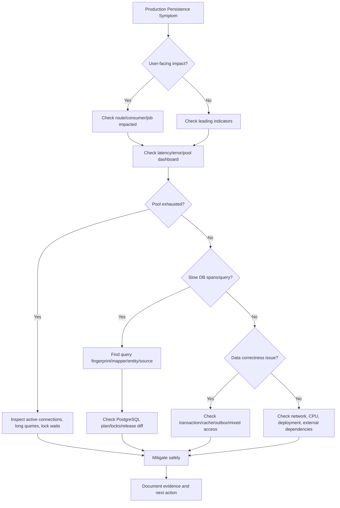

# Part 052 — Production Troubleshooting

Production troubleshooting persistence layer adalah proses mengubah symptom menjadi evidence.

Symptom umum:

- endpoint lambat,
- request timeout,
- batch job stuck,
- Kafka/RabbitMQ consumer lag,
- connection pool exhausted,
- database CPU tinggi,
- deadlock meningkat,
- lock wait panjang,
- data stale,
- data duplicate,
- migration gagal,
- order/quote workflow tidak maju,
- cache tidak sinkron,
- outbox event terlambat.

Kesalahan paling umum saat troubleshooting adalah langsung menebak:

- “Tambah index.”
- “Naikkan pool size.”
- “Restart pod.”
- “Clear cache.”
- “Rollback release.”
- “Database sedang lambat.”
- “Hibernate memang lambat.”
- “MyBatis query-nya pasti salah.”

Senior engineer harus bekerja dari evidence.

## 1. Troubleshooting Principles

### 1.1 Stabilize first, diagnose second

Saat incident aktif, prioritas awal:

1. Kurangi user impact.
2. Cegah cascading failure.
3. Lindungi data correctness.
4. Kumpulkan evidence yang tidak merusak production.
5. Lakukan mitigation minimal.
6. Setelah stabil, lakukan root cause analysis.

Jangan menjalankan query diagnostik berat di production tanpa memahami impact.

### 1.2 Separate symptom from cause

Contoh:

- Symptom: API timeout.
- Possible cause: slow query, pool exhaustion, lock wait, network issue, Redis latency, deadlock retry storm, downstream service call inside transaction.

- Symptom: connection pool exhausted.
- Possible cause: too many requests, slow query, long transaction, stream not closed, lock wait, oversized result set, DB unavailable, thread stuck.

- Symptom: stale data.
- Possible cause: JPA persistence context stale, Redis stale cache, read replica lag, MyBatis write bypassing Hibernate cache, event projection lag.

### 1.3 Do not destroy evidence

Avoid:

- restarting everything before capturing metrics,
- killing sessions blindly,
- truncating tables,
- manually changing rows without audit,
- clearing all cache without knowing keys,
- rerunning migrations manually without recording state,
- applying index changes without validating plan,
- disabling constraints to “unblock” writes.

## 2. First 10-Minute Triage

Use this rapid flow.



Minimum facts to collect:

- impacted route/job/consumer,
- start time,
- release/deployment correlation,
- service version,
- affected tenant/account scope if safe,
- p95/p99 latency,
- error rate,
- SQLState/error category,
- pool active/idle/pending,
- DB active sessions,
- slow query fingerprint,
- lock/deadlock evidence,
- transaction duration,
- outbox/cache status if relevant.

## 3. Slow Endpoint Due to Query

### Symptom

- One or more JAX-RS endpoints become slow.
- DB span dominates trace.
- CPU may or may not be high.
- p95/p99 worse than p50.
- User sees timeout.

### Immediate questions

- Which endpoint route?
- Which repository/mapper/entity method?
- Which SQL?
- Is the query written by MyBatis, generated by Hibernate, raw JDBC, or migration/job?
- Is it slow for all tenants or specific data shape?
- Did it start after deployment or data growth?
- Is it lock wait or query execution?

### Evidence to collect

- trace for slow request,
- query fingerprint,
- SQL text if safe,
- bind parameter shape,
- rows returned,
- rows scanned,
- EXPLAIN plan from representative parameter,
- index usage,
- recent release diff,
- slow query log,
- query count per request.

### Diagnosis branches

| Evidence | Likely Cause |
|---|---|
| Query count exploded | N+1 |
| One query slow with many rows scanned | missing/bad index or predicate |
| Query waits before executing | lock wait |
| Query plan changed recently | stats, data skew, parameter selectivity |
| Query fast in DB but endpoint slow | mapping, serialization, network, memory |
| Slow only for large tenant | data distribution/index design |
| Slow only after release | query shape/code change |

### Safe mitigations

- reduce traffic to endpoint if possible,
- feature flag expensive path,
- lower page size,
- temporarily disable expensive filter/sort if acceptable,
- add targeted index only after plan validation,
- rollback recent query change if clearly correlated,
- kill only confirmed runaway query if safe and approved,
- scale app only if DB is not bottleneck,
- avoid increasing pool blindly.

### MyBatis-specific checks

- Did dynamic SQL include optional filter that disables index?
- Did `${}` dynamic ORDER BY create unsafe/unplanned query?
- Did `foreach IN (...)` create huge list?
- Did nested select cause N+1?
- Did ResultMap map too much object graph?
- Did pagination miss stable ordering?
- Did mapper return too many rows?

### JPA/Hibernate-specific checks

- Did lazy loading trigger N+1?
- Did fetch join multiply rows?
- Did entity graph load too much graph?
- Did a query flush pending changes first?
- Did dirty checking slow down transaction?
- Did bulk query create stale persistence context?
- Did generated SQL differ from expected JPQL?

## 4. Connection Pool Exhaustion

### Symptom

- Requests wait for DB connection.
- Pool pending threads increase.
- Connection acquisition timeout occurs.
- API errors may show timeout before query starts.
- DB may be idle or overloaded depending on cause.

### Critical distinction

Pool exhaustion is not the cause. It is a queueing symptom.

Root causes include:

- slow queries,
- long transactions,
- lock waits,
- too many concurrent requests,
- connection leak,
- streaming response holds connection,
- batch job consumes pool,
- database unavailable,
- pod replica surge,
- pool size too small for legitimate workload,
- pool size too large causing DB contention.

### Evidence to collect

- active/idle/pending connections,
- connection acquisition latency,
- timeout count,
- long-running queries,
- transaction duration,
- thread dumps if app threads stuck,
- DB active sessions,
- lock waits,
- deployment/scale events,
- batch/job schedule,
- leak detection logs.

### Diagnosis branches

| Evidence | Likely Cause |
|---|---|
| Active=max, pending>0, DB slow queries | queries hold connections |
| Active=max, DB idle | app holds connections without DB work |
| Active=max during batch | batch monopolizes pool |
| Pending rises after scale-out | total connections/pods issue |
| Leak detection logs | connection/resource leak |
| Long HTTP streams | cursor/result stream holding connection |
| Lock waits high | connections stuck waiting on DB locks |

### Safe mitigations

- pause or throttle batch/consumer workload,
- reduce traffic or enable backpressure,
- rollback recent query/release if correlated,
- kill confirmed blocked/runaway DB sessions carefully,
- reduce pod replicas if causing connection storm,
- increase pool only after DB capacity is confirmed,
- shorten transaction scope,
- fix streaming resource closure,
- split pool for batch vs request path if architecture allows.

### Anti-mitigation

Increasing max pool size during DB saturation can make outage worse.

## 5. Deadlock

### Symptom

- Database reports deadlock.
- One transaction is aborted.
- Application sees retryable DB exception.
- Usually intermittent under concurrency.

### Why deadlock happens

Two or more transactions hold locks the other needs.

Example:

```mermaid
sequenceDiagram
    participant T1 as Transaction 1
    participant T2 as Transaction 2
    participant A as Row A
    participant B as Row B

    T1->>A: lock/update A
    T2->>B: lock/update B
    T1->>B: waits for B
    T2->>A: waits for A
    Note over T1,T2: Deadlock detected; one transaction aborted
```

### Evidence to collect

- deadlock logs,
- involved SQL statements,
- table/index/row lock info if available,
- transaction call paths,
- order of updates,
- release changes,
- retry behavior,
- affected domain operation.

### Common causes

- inconsistent lock ordering,
- multiple rows updated in different order,
- JPA flush order differs from expected code order,
- MyBatis and JPA update same tables in one transaction,
- trigger updates another table,
- foreign key checks lock related rows,
- batch updates overlap with request writes,
- missing index on foreign key or predicate,
- long transaction holds locks.

### Safe fixes

- enforce consistent lock order,
- shorten transactions,
- add retry for retryable deadlock failure,
- reduce batch chunk size,
- avoid mixing two write models on same aggregate,
- add proper indexes for locking predicates,
- avoid hidden trigger side effects if possible,
- split unrelated writes only if correctness allows.

### Review question

Can every command path that touches the same aggregate lock rows in the same order?

If no, deadlock risk remains.

## 6. Lock Wait

### Symptom

- Query appears slow but consumes little CPU.
- DB sessions are waiting.
- Writes or reads with locks are stuck.
- Pool may eventually exhaust.

### Evidence to collect

- blocking session,
- blocked session,
- SQL of blocker,
- SQL of waiter,
- transaction age,
- lock type,
- table/index involved,
- application trace id/pod if available,
- transaction owner route/job.

### Common causes

- long transaction holding row lock,
- migration DDL locking table,
- batch update overlapping request update,
- SELECT FOR UPDATE too broad,
- missing index causes many rows locked/scanned,
- idle-in-transaction session,
- user interaction or remote call inside transaction,
- trigger/procedure doing hidden writes.

### Safe mitigations

- identify blocker first,
- terminate blocker only with approval and rollback impact understood,
- pause batch/migration if safe,
- reduce consumer concurrency,
- add statement/lock timeout for future prevention,
- rewrite lock query to target fewer rows,
- add index if predicate is broad due to scan,
- remove external calls from transaction path.

### Anti-pattern

Do not kill random sessions by duration alone. A long analytical read may be less dangerous than a short blocked write chain, depending on context.

## 7. Serialization Failure

### Symptom

- Transaction fails with serialization error.
- Usually occurs under higher isolation or concurrent conflicting writes.
- Application may surface 500 if not handled.

### Correct response

Serialization failure is expected under serializable-style concurrency. It must usually be retried if the operation is safe and idempotent.

### Evidence to collect

- SQLState/error category,
- transaction isolation level,
- command idempotency,
- retry count,
- conflicting operation type,
- affected aggregate/key,
- transaction duration,
- retry backoff behavior.

### Safe fixes

- add bounded retry for retryable serialization failures,
- ensure command idempotency,
- reduce transaction scope,
- avoid broad predicate reads before writes,
- use explicit locks if business invariant requires,
- move expensive computation outside transaction if safe.

### Dangerous fix

Lowering isolation without understanding the invariant may reintroduce write skew or lost update.

## 8. Unique Constraint Race

### Symptom

- Duplicate create requests collide.
- Unique constraint violation appears.
- User may retry and see error.
- System may create duplicate side effects if not idempotent.

### Common scenarios

- same quote/order request submitted twice,
- idempotency key missing,
- natural key unique constraint used as concurrency control,
- check-then-insert race,
- message redelivery,
- outbox replay,
- concurrent catalog/reference data import.

### Safe pattern

Prefer atomic database enforcement:

- unique constraint,
- insert with conflict handling,
- idempotency table,
- response replay if needed,
- transactionally stored processing state.

### Troubleshooting questions

- Is the violation expected business conflict or duplicate retry?
- Should API return 409, 200 replay, or 202 processing?
- Is the side effect idempotent?
- Did event publication happen twice?
- Is there an idempotency table?
- Is the key scoped by tenant/account?

## 9. Bad Query Plan

### Symptom

- Query used to be fast, now slow.
- Same SQL has variable latency.
- DB CPU/IO increases.
- EXPLAIN shows sequential scan, bad join order, or large row estimates mismatch.

### Causes

- data growth,
- skewed data distribution,
- stale statistics,
- missing index,
- index not selective,
- expression prevents index usage,
- implicit casts,
- dynamic SQL changed predicate,
- parameter values not representative,
- JSONB query not indexed,
- ORDER BY requires large sort,
- pagination offset too large.

### Evidence to collect

- EXPLAIN/EXPLAIN ANALYZE,
- actual vs estimated rows,
- index usage,
- table size,
- filter selectivity,
- sort/hash spill,
- parameter shape,
- recent data load/migration,
- changed SQL text.

### Safe fixes

- add or adjust index after plan validation,
- rewrite predicate,
- avoid function on indexed column unless expression index exists,
- add composite index matching filter/order,
- use keyset pagination,
- update statistics if appropriate and approved,
- split query,
- precompute read model if needed.

### PostgreSQL-specific checks

- Is the query filtering by tenant and status?
- Does index order match WHERE and ORDER BY?
- Is JSONB queried with supported index?
- Is there implicit cast between text/uuid/int?
- Is `LIKE '%term%'` forcing scan?
- Is large offset pagination causing work amplification?

## 10. N+1 Issue

### Symptom

- Endpoint latency grows with number of rows.
- Query count increases linearly.
- DB has many small fast queries.
- Application CPU may increase due to mapping/serialization.

### MyBatis N+1

Common source:

- nested select in ResultMap,
- loop in service calling mapper per row,
- per-row lookup for reference data,
- dynamic query inside mapper association.

### JPA/Hibernate N+1

Common source:

- lazy relationship accessed during serialization,
- loop accesses collection,
- missing fetch join/entity graph,
- default eager to-one chains,
- Open Session in View style behavior if present.

### Evidence

- query count per request,
- trace DB span count,
- SQL logs grouped by fingerprint,
- endpoint response size,
- serialization path,
- mapper/entity relation mapping.

### Fixes

- DTO projection,
- fetch join carefully,
- entity graph,
- batch fetching,
- MyBatis nested result instead of nested select,
- bulk load reference data,
- request-level cache for reference lookup,
- avoid returning JPA entity directly to API serialization.

## 11. Failed Migration

### Symptom

- deployment fails,
- app startup fails,
- migration job stuck,
- schema version inconsistent,
- mapper/entity references missing column/table,
- production traffic blocked by DDL lock.

### Evidence to collect

- migration version,
- migration logs,
- database schema version table,
- failed SQL,
- current DB schema,
- app version,
- lock wait sessions,
- partial migration state,
- deployment order.

### Common causes

- migration not backward-compatible,
- DDL lock on large table,
- data migration too heavy,
- constraint validation fails,
- column dropped while old app still uses it,
- JPA entity deployed before column exists,
- MyBatis mapper deployed before migration,
- repeatable migration changed unexpectedly,
- environment drift.

### Safe response

- stop further rollout,
- determine if migration committed partially,
- avoid manual edits without recording,
- prefer roll-forward fix if schema state changed,
- keep old and new app compatibility in mind,
- coordinate with DBA/platform,
- capture state for postmortem.

### Prevention

- expand-contract,
- backward-compatible changes,
- migration tests,
- dry run on production-like data,
- lock timeout for migration,
- online index creation strategy,
- backfill chunking,
- clear rollback/roll-forward plan.

## 12. Entity/Schema Mismatch

### Symptom

- JPA startup error,
- column not found,
- null constraint violation,
- enum conversion failure,
- generated SQL references wrong name,
- lazy load fails,
- mapper result mismatch.

### Causes

- migration missing,
- entity annotation wrong,
- naming strategy mismatch,
- column renamed without compatibility window,
- enum value changed,
- converter mismatch,
- schema drift between environments,
- native query not updated,
- MyBatis ResultMap stale.

### Evidence

- failing SQL,
- entity mapping,
- migration version,
- actual table definition,
- failing environment,
- deployment sequence,
- mapper XML or JPQL/native query.

### Fix

- align migration and mapping,
- add compatibility columns temporarily,
- update ResultMap/entity mapping,
- add migration test,
- avoid breaking rename/drop in one deployment,
- verify naming strategy.

## 13. Mapper Result Mismatch

### Symptom

- MyBatis mapping exception,
- null fields unexpectedly,
- wrong field populated,
- duplicate rows mapped incorrectly,
- nested collection wrong,
- enum/JSONB conversion fails.

### Causes

- column alias missing,
- ResultMap references old column,
- join produces duplicate column names,
- constructor mapping order mismatch,
- TypeHandler mismatch,
- nested result id not configured correctly,
- schema changed without mapper update.

### Evidence

- mapper statement id,
- SQL output,
- result columns,
- ResultMap definition,
- Java DTO/entity constructor,
- migration diff.

### Fix

- add explicit aliases,
- update ResultMap,
- test mapper with representative rows,
- avoid `resultType` for complex joins,
- validate TypeHandler,
- add integration test around changed query.

## 14. Stale JPA Persistence Context

### Symptom

- Application reads old value after database was updated.
- MyBatis update occurs but JPA entity still has old state.
- Bulk update runs but loaded entity does not change.
- Cache returns stale object.
- Unexpected overwrite occurs on flush.

### Common scenarios

1. JPA loads entity.
2. MyBatis updates same row.
3. JPA reads entity again in same transaction.
4. EntityManager returns first-level cached entity.
5. Code sees stale state.

Or:

1. JPA loads entity.
2. MyBatis updates same row.
3. JPA-managed entity is later flushed.
4. Old in-memory state overwrites newer database value.

### Evidence

- transaction trace,
- order of JPA/MyBatis calls,
- entity id/table,
- SQL logs,
- flush timing,
- second-level cache config,
- bulk update usage.

### Fixes

- avoid same-use-case mixed write path,
- flush before external mapper read if needed,
- clear/detach/refresh after mapper write if needed,
- use separate transaction/use case boundaries,
- use DTO projection for MyBatis read,
- disable unsafe second-level cache,
- document ownership.

### Review rule

If a PR uses MyBatis and JPA against the same table/aggregate in the same transaction, require explicit stale-state reasoning.

## 15. Cache Inconsistency

### Symptom

- User sees old data.
- DB is correct but API response is stale.
- Some pods show different results.
- Read model/cache updates late.
- Manual DB fix does not reflect in app.

### Cache layers to inspect

- JPA first-level cache,
- Hibernate second-level cache,
- Hibernate query cache,
- MyBatis local/second-level cache,
- Redis,
- API gateway cache if any,
- browser/client cache,
- derived read model/projection.

### Evidence

- cache hit/miss,
- cache key,
- tenant/account key scope,
- TTL,
- invalidation event,
- DB version/timestamp,
- outbox/event lag,
- pod instance,
- direct DB read comparison.

### Causes

- invalidation missing,
- invalidation before commit,
- MyBatis update bypasses Hibernate cache,
- direct DB script bypasses app cache,
- tenant not included in key,
- cache key too coarse,
- projection/event consumer lag,
- Redis failover/lost event,
- second-level cache stale.

### Fixes

- invalidate after commit,
- include tenant/version in key,
- shorten TTL only as temporary mitigation,
- rebuild projection/read model,
- disable unsafe cache for mutable aggregate,
- publish correction event,
- document cache ownership,
- add cache observability.

## 16. Outbox Stuck / Event Publication Delay

### Symptom

- DB write succeeds but downstream state does not update.
- Kafka/RabbitMQ messages delayed.
- Outbox pending count grows.
- Consumer lag grows.
- Business workflow stuck.

### Evidence

- outbox pending count,
- oldest outbox age,
- publisher logs,
- DB query for publisher selection,
- SKIP LOCKED usage if any,
- retry/dead-letter count,
- Kafka/RabbitMQ broker status,
- transaction failures,
- serialization/mapping errors.

### Causes

- publisher stopped,
- query slow due to missing index,
- row lock contention,
- poison event,
- broker unavailable,
- serialization failure,
- transaction rollback,
- duplicate event handling bug,
- too-small batch size,
- too-large batch causing lock/timeout.

### Safe mitigations

- restart publisher if stateless and safe,
- skip/quarantine poison event with audit,
- add/rebuild index after plan validation,
- reduce batch size,
- increase publisher concurrency carefully,
- reconcile downstream state,
- do not delete outbox rows without recovery plan.

## 17. Batch Job Stuck

### Symptom

- batch duration exceeds normal,
- database load high,
- locks increase,
- pool exhausted,
- job retries forever,
- partial updates visible.

### Evidence

- job progress markers,
- last processed id/time,
- transaction chunk size,
- query plan,
- row lock wait,
- memory/GC,
- affected rows per chunk,
- retry count,
- idempotency design.

### Causes

- chunk too large,
- missing index,
- batch overlaps with online traffic,
- long transaction,
- cursor not closed,
- persistence context grows in JPA,
- MyBatis batch executor not flushed predictably,
- retry repeats same failing row,
- no checkpointing.

### Fixes

- smaller chunks,
- checkpoint progress,
- isolate batch pool if possible,
- pause online conflicting path or schedule off-peak,
- clear persistence context per chunk,
- flush MyBatis batch per chunk,
- add idempotent resume behavior,
- quarantine bad records.

## 18. Production-Safe Debugging Steps

### 18.1 Safe actions

Generally safe:

- inspect dashboards,
- inspect logs,
- inspect traces,
- read slow query stats,
- run EXPLAIN without ANALYZE for rough plan,
- run limited SELECT on indexed key,
- check migration version table,
- check pool metrics,
- check outbox counts,
- check cache metadata.

Potentially risky:

- EXPLAIN ANALYZE on expensive query,
- SELECT without limit on large table,
- count on huge filtered table,
- querying lock-heavy system views repeatedly,
- enabling verbose SQL logs globally,
- increasing pool size,
- clearing all cache,
- killing DB sessions,
- running manual DDL,
- rerunning migration,
- manual data patch.

Dangerous without approval:

- disabling constraints,
- truncating tables,
- deleting outbox events,
- changing migration history table,
- force-unlocking by killing unknown sessions,
- applying unreviewed index/DDL in peak traffic,
- patching rows without audit trail.

## 19. Runbook: Slow Endpoint

1. Identify impacted route and time window.
2. Check deployment correlation.
3. Open trace for slow request.
4. Identify DB spans.
5. Group SQL by fingerprint.
6. Check query count.
7. Determine MyBatis/JPA/JDBC source.
8. Check pool metrics.
9. Check DB slow query/lock wait.
10. Get representative EXPLAIN.
11. Compare with previous release/query shape.
12. Mitigate: rollback, feature flag, traffic throttle, index after validation, or query fix.
13. Record evidence.

## 20. Runbook: Pool Exhaustion

1. Confirm pending connection count.
2. Check active/idle/max pool.
3. Check connection acquisition timeout errors.
4. Inspect DB active sessions.
5. Identify long queries/transactions.
6. Check lock waits.
7. Check batch/consumer activity.
8. Check recent scaling/rollout.
9. Check leak detection/thread dumps.
10. Mitigate workload or blockers.
11. Avoid pool increase unless DB capacity and cause are understood.
12. Add prevention item.

## 21. Runbook: Deadlock

1. Confirm deadlock error category.
2. Retrieve deadlock log/details.
3. Identify involved SQL statements.
4. Map SQL to repository/mapper/entity path.
5. Determine lock acquisition order.
6. Check recent changes and batch overlap.
7. Add bounded retry if missing.
8. Fix lock ordering or transaction scope.
9. Add concurrency test.
10. Document invariant.

## 22. Runbook: Failed Migration

1. Stop rollout.
2. Capture failed migration logs.
3. Check schema version table.
4. Determine whether failure is before/after commit.
5. Inspect database schema state.
6. Check app versions currently running.
7. Identify backward compatibility impact.
8. Coordinate DBA/platform/backend.
9. Prefer roll-forward if schema partially changed.
10. Add migration test and deployment guard.

## 23. Runbook: Stale Data

1. Confirm stale value vs DB value.
2. Identify read path.
3. Check cache layers.
4. Check read replica/projection lag if applicable.
5. Check transaction trace.
6. Check MyBatis/JPA mixed access.
7. Check outbox/event lag.
8. Check invalidation timing.
9. Mitigate by refreshing/invalidation/rebuilding read model.
10. Fix ownership/invalidation/stale context cause.

## 24. Internal Verification Checklist

Use this checklist against the actual internal system. Do not assume CSG/team implementation details.

### Incident process

- [ ] Is there a persistence incident runbook?
- [ ] Is escalation path to DBA/platform/SRE clear?
- [ ] Are production-safe debugging rules documented?
- [ ] Are manual data fixes audited?
- [ ] Are postmortems linked to code/migration changes?

### Slow query

- [ ] Can engineers identify SQL from a slow endpoint?
- [ ] Are MyBatis mapper ids visible?
- [ ] Are Hibernate generated SQL logs accessible safely?
- [ ] Is EXPLAIN workflow documented?
- [ ] Are query plans captured for critical paths?

### Pool exhaustion

- [ ] Are pool metrics visible?
- [ ] Is max pool reviewed against pod replicas?
- [ ] Are long transaction metrics visible?
- [ ] Are connection leaks detectable?
- [ ] Are batch jobs isolated or throttled?

### Locking/concurrency

- [ ] Are deadlock logs accessible?
- [ ] Is serialization failure retried where appropriate?
- [ ] Are lock waits monitored?
- [ ] Are concurrency tests present for critical write paths?
- [ ] Is lock ordering documented for shared aggregates?

### Migration

- [ ] Is migration version state visible?
- [ ] Is failed migration alerting present?
- [ ] Are expand-contract practices followed?
- [ ] Are backfills chunked and observable?
- [ ] Is rollback/roll-forward strategy documented?

### MyBatis/JPA mixing

- [ ] Are same-table mapper/entity overlaps known?
- [ ] Is ownership documented?
- [ ] Are flush/clear rules documented?
- [ ] Is Hibernate second-level cache disabled/controlled where unsafe?
- [ ] Are mixed access paths tested?

### Cache/read model

- [ ] Are cache keys tenant/version-aware?
- [ ] Is invalidation after commit?
- [ ] Is outbox lag monitored?
- [ ] Is read model rebuild documented?
- [ ] Are stale data incidents tracked?

### Data repair

- [ ] Is there a safe data patch process?
- [ ] Are patch scripts reviewed?
- [ ] Are patch scripts idempotent?
- [ ] Are before/after checks required?
- [ ] Are customer-impacting changes auditable?

## 25. PR Review Checklist for Troubleshootability

Before approving a persistence change, ask:

- If this query becomes slow, how will we find it?
- If this transaction deadlocks, will retry handle it?
- If this migration fails halfway, what is the roll-forward plan?
- If this cache becomes stale, how do we invalidate/rebuild?
- If this mapper mapping breaks, is there an integration test?
- If this JPA query triggers N+1, do we have query count evidence?
- If this batch job stalls, can it resume safely?
- If this endpoint is retried, is it idempotent?
- If this change increases DB connections, was capacity checked?
- If this write path emits events, can outbox lag be observed?

## 26. Anti-Patterns During Production Incidents

Avoid:

- treating restart as root cause fix,
- increasing pool size without DB capacity check,
- applying index without plan evidence,
- blaming PostgreSQL without application trace,
- blaming Hibernate without SQL count,
- blaming MyBatis without query plan,
- clearing Redis globally,
- killing all long sessions,
- manually editing rows without audit,
- bypassing migration tool,
- disabling constraints,
- ignoring stale state due to MyBatis/JPA mixing,
- retrying non-idempotent commands blindly,
- hiding incident notes from future reviewers.

## 27. Senior Engineer Troubleshooting Mindset

A senior engineer should move through this reasoning:

1. What changed?
2. What is the exact user-visible symptom?
3. Which persistence component is in the causal path?
4. Is the issue performance, availability, correctness, or consistency?
5. What evidence confirms the hypothesis?
6. What mitigation reduces blast radius without corrupting data?
7. What permanent fix prevents recurrence?
8. What test/metric/runbook would have caught this earlier?

## 28. Key Takeaways

- Production troubleshooting must start from evidence, not guesses.
- Pool exhaustion is usually a symptom of slow/blocked/long-held connections.
- Deadlocks require lock-order and transaction-scope analysis, not panic.
- Serialization failures are often retryable but only if the command is safe/idempotent.
- Query slowness requires distinguishing execution time, lock wait, result mapping, and serialization overhead.
- Migration failures need schema-state discipline and usually roll-forward thinking.
- MyBatis/JPA mixing can create stale persistence context and cache inconsistency.
- Cache issues require knowing every cache layer in the read path.
- Manual production actions must be auditable and reversible where possible.
- A persistence feature is not production-ready if it cannot be diagnosed safely under incident pressure.
