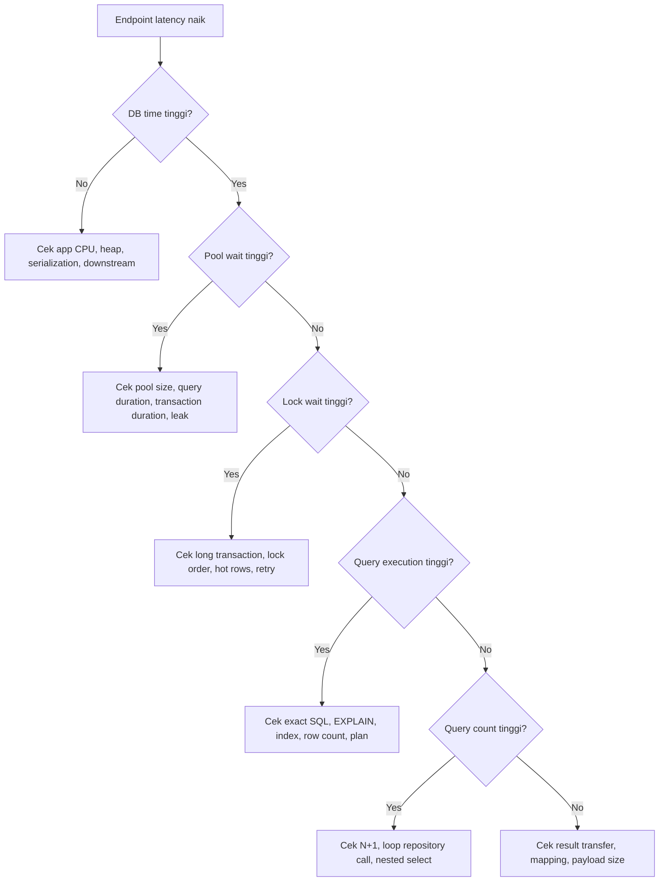

# Part 053 — Persistence Layer Performance Tuning

Persistence performance tuning bukan proses menebak satu parameter ajaib.

Bukan hanya:

- tambah index,
- naikkan pool size,
- aktifkan cache,
- ganti JPA ke MyBatis,
- ganti MyBatis ke JDBC,
- tambah replica pod,
- naikkan CPU database,
- atau rewrite query tanpa memahami workload.

Performance tuning persistence layer adalah proses mencari bottleneck nyata di jalur:

```text
HTTP request
  -> JAX-RS resource
  -> application service
  -> transaction boundary
  -> repository / DAO / mapper
  -> JDBC driver
  -> connection pool
  -> PostgreSQL backend process
  -> planner / executor / lock manager / buffer cache
  -> network response
  -> object mapping
  -> serialization response
```

Tuning yang benar selalu evidence-based.

Kalau tidak ada measurement, tuning berubah menjadi ritual.

## 1. Core Mental Model

### 1.1 Performance is end-to-end

Endpoint lambat belum tentu query lambat.

Kemungkinan lain:

- request antre di thread pool,
- connection pool exhausted,
- query menunggu lock,
- PostgreSQL CPU tinggi,
- query plan buruk,
- index tidak dipakai,
- result set terlalu besar,
- object mapping mahal,
- lazy loading memicu banyak query,
- transaction terlalu panjang,
- Redis/cache miss storm,
- network latency tinggi,
- JSON serialization mahal,
- GC pressure dari object graph besar,
- retry storm akibat deadlock/serialization failure.

Senior engineer tidak boleh berhenti pada label “database lambat”.

Label itu terlalu kasar.

### 1.2 A simple latency equation

Untuk satu request synchronous, latency persistence kira-kira:

```text
request_db_time =
  pool_wait_time
+ transaction_setup_time
+ network_round_trip_time
+ database_lock_wait_time
+ database_execution_time
+ result_transfer_time
+ jdbc_mapping_time
+ framework_mapping_time
+ object_allocation_gc_cost
```

Untuk request yang menjalankan banyak query:

```text
total_db_time = sum(each_query_cost) + query_round_trip_overhead + transaction_duration_side_effects
```

Implikasi:

- query kecil tetapi 200 kali tetap lambat,
- query cepat tetapi menunggu connection tetap lambat,
- query cepat tetapi result 100 MB tetap lambat,
- query cepat tetapi memegang lock lama tetap berbahaya,
- query cepat di dev belum tentu cepat di production data volume.

### 1.3 Throughput is constrained by the tightest resource

Bottleneck bisa berada di:

- CPU aplikasi,
- heap aplikasi,
- connection pool,
- PostgreSQL CPU,
- PostgreSQL I/O,
- lock contention,
- network,
- thread pool,
- Kafka/RabbitMQ consumer concurrency,
- Redis/cache,
- external service call di dalam transaction.

Menambah pod saat database sudah saturated dapat memperburuk keadaan.

Menambah pool size saat query lambat dapat memperbanyak query concurrent yang menekan database.

Menambah index saat bottleneck adalah lock wait tidak menyelesaikan masalah.

## 2. Tuning Workflow

### 2.1 Start with symptom classification

Klasifikasikan symptom:

| Symptom | Kemungkinan bottleneck |
|---|---|
| p95/p99 endpoint naik | query lambat, pool wait, lock wait, downstream call |
| DB CPU tinggi | query plan buruk, scan besar, high concurrency, missing index |
| DB I/O tinggi | full scan, vacuum pressure, cold cache, large reads |
| pool wait tinggi | pool kecil, query lama, connection leak, transaction lama |
| deadlock naik | inconsistent lock order, competing updates |
| serialization failure naik | high contention, serializable/repeatable-read conflict |
| heap naik | result terlalu besar, persistence context membesar, DTO graph besar |
| consumer lag naik | batch write lambat, lock contention, outbox poller lambat |

Jangan langsung tuning sebelum symptom jelas.

### 2.2 Build a baseline

Minimal baseline:

- endpoint p50/p95/p99,
- request rate,
- error rate,
- DB query count per request,
- slowest query by duration,
- total DB time per request,
- pool active/idle/pending,
- transaction duration,
- PostgreSQL CPU/I/O/lock wait,
- row count returned,
- payload size,
- heap allocation/GC during endpoint.

Untuk JPA/Hibernate:

- generated SQL,
- query count,
- flush count,
- entity load count,
- collection fetch count,
- second-level cache hit/miss jika dipakai.

Untuk MyBatis:

- exact SQL statement,
- parameter shape,
- ResultMap complexity,
- nested select count,
- dynamic SQL branch,
- returned row count.

### 2.3 Tune one layer at a time

Urutan praktis:

1. Pastikan measurement benar.
2. Identifikasi top offender.
3. Reproduce dengan data representatif.
4. Lihat exact SQL dan parameter.
5. Jalankan `EXPLAIN` / `EXPLAIN ANALYZE` secara aman.
6. Cek lock wait dan row count.
7. Cek query shape dan index.
8. Cek fetch/mapping size.
9. Cek transaction duration.
10. Baru ubah query/index/config.
11. Validasi dengan benchmark dan regression test.
12. Monitor setelah deploy.

Tuning tanpa validasi adalah perubahan spekulatif.

## 3. Query Tuning

### 3.1 Query tuning starts from exact SQL

Untuk MyBatis, SQL biasanya terlihat jelas di XML/annotation.

Untuk JPA/Hibernate, SQL harus dilihat dari log atau statement inspector.

Jangan tune JPQL secara mental tanpa melihat generated SQL.

Contoh JPA issue:

```java
var orders = orderRepository.findRecentOrders(customerId);
for (Order order : orders) {
    order.getItems().size();
}
```

Code terlihat sederhana.

SQL aktual bisa menjadi:

```text
1 query untuk orders
N query untuk items per order
```

Tuning harus menyerang SQL aktual, bukan ilusi object graph.

### 3.2 Query smell checklist

Smell umum:

- `SELECT *` pada endpoint list,
- join terlalu banyak untuk kebutuhan response kecil,
- filter tidak memakai indexed column,
- function di sisi column yang membuat index tidak usable,
- wildcard prefix search seperti `%abc`,
- `OR` kompleks tanpa index strategy,
- `IN` terlalu besar,
- dynamic SQL menghasilkan predicate tidak stabil,
- pagination offset besar,
- count query mahal,
- sorting pada expression mahal,
- query mengambil row jauh lebih banyak dari yang dipakai,
- duplicate query akibat loop,
- query generated Hibernate tidak sesuai ekspektasi,
- MyBatis nested select diam-diam menciptakan N+1.

### 3.3 Reduce data before optimizing mechanics

Pertanyaan pertama:

> Apakah kita perlu mengambil data sebanyak ini?

Strategi:

- pilih kolom yang diperlukan,
- gunakan DTO projection,
- gunakan keyset pagination untuk scrolling besar,
- batasi date range,
- batasi status yang relevan,
- pecah read model untuk query reporting,
- hindari loading aggregate penuh untuk list page,
- hindari entity graph besar untuk endpoint ringkas.

Mengambil data yang tidak diperlukan adalah bentuk waste paling mahal.

### 3.4 Prefer query shape that matches access pattern

Contoh use case quote/order list:

- API list butuh summary,
- detail page butuh aggregate lengkap,
- export butuh streaming,
- reporting butuh aggregation,
- workflow transition butuh locking dan invariant check.

Jangan pakai satu query “serbaguna” untuk semua.

Query serbaguna sering menghasilkan:

- banyak optional predicate,
- dynamic join,
- result map kompleks,
- plan tidak stabil,
- sulit ditest,
- sulit dioptimalkan.

### 3.5 Avoid accidental cartesian multiplication

JPA fetch join atau SQL join ke collection dapat menggandakan row.

Contoh:

```sql
SELECT q.*, l.*, d.*
FROM quote q
JOIN quote_line l ON l.quote_id = q.id
JOIN quote_discount d ON d.quote_id = q.id
WHERE q.id = ?;
```

Jika quote punya 20 line dan 5 discount, result bisa menjadi 100 row.

Object graph mungkin tetap terlihat benar setelah deduplication, tetapi database dan network tetap membayar biaya row multiplication.

### 3.6 Tuning aggregation queries

Aggregation query perlu perhatian:

- group cardinality,
- filter sebelum group,
- index yang mendukung WHERE dan GROUP BY,
- memory untuk hash aggregate,
- sort cost,
- partial aggregation possibility,
- precomputed read model jika query sering dan mahal.

Jika query reporting berat dipakai di endpoint latency-sensitive, pertimbangkan read model atau materialized representation.

## 4. Index Tuning

### 4.1 Index is not decoration

Index adalah struktur data dengan biaya:

- mempercepat read tertentu,
- memperlambat write tertentu,
- menambah storage,
- menambah maintenance cost,
- memengaruhi planner,
- bisa menjadi obsolete ketika workload berubah.

Jangan menambah index hanya karena query lambat.

Tambahkan index karena ada access pattern yang jelas.

### 4.2 Index design follows predicates and ordering

Lihat query:

```sql
SELECT id, status, updated_at
FROM orders
WHERE tenant_id = ?
  AND status = ?
  AND updated_at >= ?
ORDER BY updated_at DESC
LIMIT 50;
```

Index yang mungkin:

```sql
CREATE INDEX idx_orders_tenant_status_updated_at
ON orders (tenant_id, status, updated_at DESC);
```

Tapi urutan column harus diuji dengan data nyata.

Pertanyaan review:

- predicate mana paling selektif?
- column mana equality?
- column mana range?
- column mana dipakai sorting?
- apakah query multi-tenant selalu filter tenant?
- apakah partial index lebih cocok?
- apakah index membantu write path atau malah merusak write throughput?

### 4.3 Composite index trade-off

Composite index berguna jika query pattern stabil.

Namun terlalu banyak composite index menyebabkan:

- write lebih mahal,
- migration lebih lama,
- storage lebih besar,
- planner choice lebih kompleks,
- maintenance lebih sulit.

Index bukan pengganti query design.

### 4.4 Partial index

Partial index cocok untuk subset data yang sering diakses.

Contoh konseptual:

```sql
CREATE INDEX idx_order_active_by_tenant
ON orders (tenant_id, updated_at DESC)
WHERE deleted_at IS NULL
  AND status IN ('DRAFT', 'SUBMITTED');
```

Cocok untuk:

- active records,
- unprocessed outbox events,
- non-deleted rows,
- pending workflow tasks,
- current effective records.

Review concern:

- predicate query harus match dengan predicate partial index,
- dynamic SQL harus konsisten,
- JPA filters/MyBatis WHERE harus tidak lupa condition.

### 4.5 Index for soft delete and tenant

Untuk multi-tenant table dengan soft delete, index sering perlu mengandung tenant dan visibility predicate.

Smell:

```sql
WHERE status = ?
```

di table multi-tenant.

Lebih aman:

```sql
WHERE tenant_id = ?
  AND status = ?
  AND deleted_at IS NULL
```

Kalau query tidak tenant-aware, bukan hanya lambat; itu security/data isolation risk.

### 4.6 Index for foreign key

Foreign key tidak otomatis selalu cukup untuk query performance.

Pastikan foreign key columns yang sering dipakai join/filter memiliki index yang sesuai.

Contoh:

- `quote_line.quote_id`,
- `order_item.order_id`,
- `workflow_task.case_id`,
- `outbox_event.aggregate_id`,
- `idempotency_request.idempotency_key`.

### 4.7 Index tuning anti-patterns

Anti-pattern:

- menambah index untuk setiap slow query tanpa mengukur write impact,
- membuat index yang tidak pernah dipakai,
- membuat index dengan column order salah,
- membuat index besar untuk query jarang,
- melupakan tenant/deleted/effective-date predicate,
- mengandalkan index saat query mengambil 40% table,
- menambah index saat bottleneck sebenarnya lock wait,
- menambah index tanpa regression test/monitoring.

## 5. EXPLAIN and Plan Interpretation

### 5.1 What to look for

Saat membaca plan, cari:

- sequential scan pada table besar,
- row estimate jauh dari actual,
- nested loop dengan inner scan mahal,
- sort besar,
- hash aggregate besar,
- repeated index lookup terlalu banyak,
- filter applied too late,
- join order tidak sesuai,
- actual row count jauh lebih besar dari expected,
- time banyak di I/O atau CPU,
- planning time vs execution time.

### 5.2 Estimate mismatch matters

Jika planner memperkirakan 100 row tetapi actual 1.000.000 row, planner bisa memilih plan buruk.

Penyebab:

- statistics stale,
- data skew,
- correlated columns,
- parameter value distribution tidak seragam,
- dynamic query terlalu variatif,
- tenant besar berbeda drastis dari tenant kecil.

Untuk sistem enterprise multi-tenant, tenant skew sering penting.

Query cepat untuk tenant kecil bisa lambat untuk tenant besar.

### 5.3 Parameter-sensitive workload

Query yang sama dengan parameter berbeda bisa punya profile berbeda.

Contoh:

- tenant A punya 1.000 row,
- tenant B punya 50 juta row,
- status `ACTIVE` mencakup 90% row,
- status `FAILED` mencakup 0.1% row.

Benchmark harus memakai parameter representatif, bukan random sample yang nyaman.

## 6. Fetch Size and Result Shape

### 6.1 Fetch size is not a magic speed setting

Fetch size mengontrol cara driver mengambil row dari database.

Efeknya tergantung:

- driver behavior,
- autocommit/transaction mode,
- cursor usage,
- result set size,
- network latency,
- memory pressure,
- framework abstraction.

Fetch size membantu jika result besar dan streaming benar.

Fetch size tidak memperbaiki query plan buruk.

### 6.2 Result shape matters more than object count alone

Object kecil ribuan mungkin aman.

Object graph besar ratusan bisa mahal.

Contoh berat:

```text
Quote
  -> 200 QuoteLine
      -> Product
      -> Price
      -> Discount
      -> Attribute map
  -> Workflow state
  -> Audit info
```

Jika endpoint list mengambil graph itu untuk 50 quote, performance akan buruk walau row count terlihat “tidak banyak”.

### 6.3 Projection first for read endpoints

Untuk endpoint list/search/reporting:

- MyBatis DTO projection sering cocok,
- JPA constructor projection bisa cocok,
- native query bisa cocok jika SQL kompleks,
- entity loading penuh sering tidak perlu.

Rule praktis:

> Load entity ketika butuh lifecycle/dirty checking. Load projection ketika hanya membaca data untuk response/query model.

## 7. Batch Size and Bulk Operation Tuning

### 7.1 Batch size must balance throughput and risk

Batch terlalu kecil:

- banyak round trip,
- overhead tinggi,
- throughput rendah.

Batch terlalu besar:

- transaction lama,
- lock lama,
- memory tinggi,
- rollback mahal,
- timeout risk,
- retry mahal,
- WAL pressure tinggi.

Batch size harus diuji.

Tidak ada angka universal.

### 7.2 JPA/Hibernate batching concerns

Hibernate batching dipengaruhi:

- JDBC batch size config,
- ID generation strategy,
- flush/clear frequency,
- entity state count,
- ordering insert/update,
- relationship cascade,
- versioned data behavior.

Dalam batch besar, gunakan pola:

```java
for (int i = 0; i < items.size(); i++) {
    entityManager.persist(toEntity(items.get(i)));

    if (i % batchSize == 0) {
        entityManager.flush();
        entityManager.clear();
    }
}
```

Tujuannya bukan hanya mengirim batch, tetapi membatasi persistence context.

### 7.3 MyBatis batch concerns

MyBatis batch executor memberi kontrol SQL lebih eksplisit, tetapi tetap perlu memperhatikan:

- statement grouping,
- flush statements,
- transaction size,
- generated key handling,
- error partial failure,
- retry idempotency,
- memory pada parameter list,
- constraint violation handling.

### 7.4 Bulk update stale context

Bulk update langsung di SQL atau JPQL dapat membuat JPA persistence context stale.

Contoh:

```java
Order order = entityManager.find(Order.class, id);

// bulk update via JPQL/native/MyBatis
markOrderExpired(id);

// object ini masih bisa punya state lama
order.getStatus();
```

Mitigasi:

- flush sebelum bulk operation jika perlu,
- clear/detach setelah bulk operation,
- reload entity,
- hindari mixing write path dalam transaction sama kecuali sangat eksplisit,
- tulis test untuk stale state.

## 8. Connection Pool Size Tuning

### 8.1 Pool size is a concurrency gate

Connection pool bukan storage koneksi sebanyak mungkin.

Pool adalah gate untuk concurrency ke database.

Pool terlalu kecil:

- request menunggu connection,
- latency naik,
- throughput terbatas.

Pool terlalu besar:

- database overloaded,
- context switching naik,
- lock contention naik,
- query concurrent terlalu banyak,
- p99 bisa memburuk.

### 8.2 Pool tuning must include all replicas

Total potential connections:

```text
total_connections = service_replicas * max_pool_size_per_pod
```

Jika ada banyak service:

```text
total_connections_all_services = sum(each_service_replicas * each_service_pool_size)
```

Jangan tune pool satu service tanpa melihat total database connection budget.

### 8.3 Pool wait is a signal

Jika pool wait tinggi, jangan langsung naikkan pool.

Tanya:

- apakah query lambat?
- apakah transaction terlalu panjang?
- apakah connection leak?
- apakah stream tidak ditutup?
- apakah lock wait tinggi?
- apakah DB saturated?
- apakah consumer concurrency terlalu tinggi?
- apakah pod replica terlalu banyak?

Naik pool size saat root cause query lambat dapat memperburuk DB.

### 8.4 Pool tuning checklist

- ukur active/idle/pending connections,
- ukur pool wait duration,
- ukur transaction duration,
- ukur query duration,
- cek database max connections,
- cek replica count,
- cek autoscaling behavior,
- cek leak detection,
- cek timeout alignment,
- validasi dengan load test.

## 9. Transaction Duration Tuning

### 9.1 Long transaction is performance and correctness risk

Long transaction dapat menyebabkan:

- connection held longer,
- lock held longer,
- vacuum impact,
- stale snapshot,
- higher conflict probability,
- timeout risk,
- user request latency tinggi,
- pool exhaustion.

Jangan memasukkan pekerjaan non-database panjang ke dalam transaction.

### 9.2 Avoid external calls inside transaction

Smell:

```text
begin transaction
  update order
  call external pricing service
  publish message synchronously
  call another service
commit
```

Risiko:

- lock ditahan selama network call,
- rollback semantics tidak jelas,
- retry berbahaya,
- pool connection ditahan,
- failure external membuat database transaction lama.

Pola lebih sehat:

- validate input,
- open transaction pendek,
- write state + outbox,
- commit,
- publish/event asynchronously,
- reconcile jika gagal.

### 9.3 Transaction scope review questions

- Apa invariant yang harus atomic?
- Query/write mana harus dalam transaction sama?
- External side effect mana harus setelah commit?
- Apakah transaction melingkupi streaming response?
- Apakah transaction melingkupi loop besar?
- Apakah transaction bisa dipecah dengan chunking?
- Apakah rollback akan mahal?

## 10. JPA Fetch Strategy Tuning

### 10.1 Default lazy does not mean safe

Lazy loading bisa menghindari load awal besar.

Tapi jika dipakai dalam loop, lazy loading menciptakan N+1.

Eager loading bisa menghindari LazyInitializationException.

Tapi eager loading sering menghasilkan query terlalu besar.

Tidak ada default yang selalu benar.

### 10.2 Choose fetch per use case

Untuk detail page:

- fetch aggregate yang benar-benar dibutuhkan,
- gunakan fetch join/entity graph dengan hati-hati,
- hindari fetch banyak collection sekaligus.

Untuk list/search:

- gunakan projection,
- hindari entity graph besar,
- hindari collection loading.

Untuk command/write:

- load minimal state untuk invariant,
- lock/version check jika perlu,
- jangan load graph besar hanya untuk update satu field.

### 10.3 Dirty checking cost

Persistence context besar memperbesar biaya dirty checking.

Smell:

- membaca ribuan entity managed dalam satu transaction,
- melakukan batch import dengan entity tetap managed,
- tidak `clear()` setelah flush batch,
- memakai entity untuk report/export besar.

Jika hanya membaca, pertimbangkan:

- read-only transaction hint,
- projection,
- stateless/session alternative jika tersedia dan sesuai,
- MyBatis/JDBC streaming.

## 11. MyBatis SQL Optimization

### 11.1 MyBatis gives visibility, not automatic performance

MyBatis memberi SQL eksplisit.

Itu membantu debugging.

Tapi SQL eksplisit tetap bisa buruk.

Masalah umum:

- dynamic SQL terlalu kompleks,
- nested select N+1,
- ResultMap terlalu besar,
- column tidak di-alias dengan jelas,
- query list mengambil detail berlebihan,
- string substitution `${}` untuk sort/filter,
- IN clause besar,
- branch query tidak dites semua.

### 11.2 Split mapper methods by access pattern

Daripada satu method:

```java
searchOrders(SearchOrderRequest request)
```

yang mendukung semua kemungkinan field, pertimbangkan:

- `findOrderSummaryPage`,
- `findOrderDetailById`,
- `findOrdersForExportCursor`,
- `findPendingOrdersForWorker`,
- `findOrderIdsForBackfill`,
- `countOrdersForSearch`.

Semakin jelas use case, semakin mudah SQL dioptimalkan.

### 11.3 Dynamic SQL guardrails

Guardrail:

- whitelist sortable columns,
- batasi maximum page size,
- batasi IN clause size,
- jangan pakai `${}` untuk user input,
- test branch dynamic SQL,
- log query name bukan hanya SQL raw,
- pisahkan query reporting berat dari endpoint transactional.

## 12. Prepared Statement Behavior

### 12.1 Prepared statements reduce parsing overhead but do not fix bad SQL

PreparedStatement membantu:

- parameter binding aman,
- mengurangi injection risk,
- memungkinkan reuse statement pada level tertentu,
- memisahkan SQL shape dari value.

Tetapi PreparedStatement tidak memperbaiki:

- missing index,
- plan buruk,
- row terlalu banyak,
- lock wait,
- N+1,
- result mapping mahal.

### 12.2 Parameter binding affects plan and safety

Selalu pisahkan:

- value user input: parameter binding,
- identifier/sort column: whitelist,
- SQL fragment: controlled server-side generation.

Jangan mengikat identifier sebagai value.

Jangan menyisipkan user input sebagai SQL fragment.

## 13. Database Round Trip Tuning

### 13.1 Round trip multiplication is often invisible

Query 3 ms sebanyak 100 kali berarti minimal 300 ms database time, belum termasuk network dan mapping.

Sumber multiplication:

- N+1,
- loop repository call,
- per-row validation query,
- per-row audit lookup,
- per-row reference data lookup,
- per-row sequence/function call,
- per-message idempotency check tanpa batching.

### 13.2 Reduce round trips carefully

Strategi:

- batch lookup by IDs,
- use join/projection,
- cache reference data jika aman,
- prefetch needed relations,
- batch insert/update,
- use outbox batch publisher,
- avoid one repository call per item.

Tetapi jangan menggabungkan semua menjadi satu mega-query yang tidak maintainable.

Balance visibility dan efficiency.

## 14. Serialization Cost and API Shape

### 14.1 Persistence tuning can fail if response shape is huge

Query bisa cepat, tapi response serialization lambat.

Tanda:

- DB duration rendah,
- endpoint latency tinggi,
- CPU app tinggi,
- heap allocation tinggi,
- response size besar.

Masalahnya bukan database.

Masalahnya mungkin object graph/API response terlalu besar.

### 14.2 Avoid exposing persistence graph

JPA entity graph tidak boleh otomatis menjadi API response graph.

Risiko:

- lazy loading saat serialization,
- recursive relationship,
- leaking internal fields,
- payload bengkak,
- security/privacy leakage,
- unstable API contract.

Gunakan response DTO/projection.

## 15. Memory Usage Tuning

### 15.1 Persistence can create heap pressure

Sumber memory pressure:

- result set besar dimaterialisasi,
- JPA persistence context besar,
- collection relationship besar,
- DTO projection terlalu banyak,
- MyBatis mapping nested object besar,
- batch parameter list besar,
- JSONB deserialize ke object besar,
- response serialization besar.

### 15.2 Control memory with streaming and chunking

Pola:

- page/chunk read,
- cursor/stream dengan resource closing jelas,
- JPA flush/clear batch,
- MyBatis cursor untuk export besar,
- limit page size,
- projection minimal,
- avoid collecting all rows before processing,
- apply backpressure pada worker.

### 15.3 Heap symptom checklist

- GC pause naik,
- Old Gen naik selama endpoint tertentu,
- OOM saat export/report,
- pod restart karena memory limit,
- CPU app naik tanpa DB CPU naik,
- response serialization lama,
- large object allocation terlihat di profiler.

## 16. Caching as Performance Tuning

### 16.1 Cache is not first-line fix for wrong query ownership

Cache bisa membantu:

- reference data read-heavy,
- expensive derived read model,
- stable catalog snapshot,
- external lookup result,
- frequently read rarely changed configuration.

Cache berbahaya untuk:

- rapidly changing order/quote state,
- permission/tenant-sensitive data tanpa tenant-aware key,
- transactionally sensitive read-after-write path,
- data yang juga dimutasi lewat MyBatis dan JPA.

### 16.2 Cache tuning questions

- Apa source of truth?
- Kapan invalidasi terjadi?
- Apakah key tenant-aware?
- Apakah cache perlu version/effective-date?
- Apakah stale data acceptable?
- Apakah update path MyBatis/JPA sama-sama invalidasi cache?
- Apakah cache metrics tersedia?

## 17. Performance Tuning by Access Pattern

### 17.1 Simple CRUD command

Prioritas:

- transaction pendek,
- optimistic lock jika perlu,
- minimal entity load,
- validation/invariant jelas,
- index untuk lookup by ID/tenant,
- audit/outbox after write.

Framework:

- JPA cocok jika entity lifecycle penting,
- MyBatis cocok jika update eksplisit lebih jelas,
- JDBC jarang perlu kecuali path sangat kecil/kritis.

### 17.2 Complex search/list

Prioritas:

- projection,
- stable pagination,
- dynamic SQL guardrails,
- index matching filters/sort,
- count query strategy,
- no entity graph loading.

Framework:

- MyBatis sering cocok,
- JPA Criteria cocok jika complexity terkendali,
- native query bisa dipakai jika SQL-specific.

### 17.3 Reporting/export

Prioritas:

- streaming/chunking,
- read-only transaction semantics,
- timeout strategy,
- resource closing,
- backpressure,
- no huge persistence context,
- maybe read model.

Framework:

- MyBatis/JDBC sering lebih predictable,
- JPA entity loading penuh biasanya tidak ideal.

### 17.4 Workflow worker / queue consumer

Prioritas:

- idempotency,
- SKIP LOCKED jika polling table,
- batch size,
- retry/backoff,
- lock duration,
- outbox/inbox consistency,
- observability per batch.

Framework:

- MyBatis cocok untuk explicit locking SQL,
- JPA bisa cocok untuk aggregate transition dengan optimistic lock,
- mixing harus sangat hati-hati.

## 18. Tuning MyBatis + JPA Mixed Systems

### 18.1 Performance tuning can break correctness

Contoh berbahaya:

```text
JPA loads entity
MyBatis bulk update same table for performance
JPA still has stale managed entity
transaction commits with dirty checking
old state overwrites new state
```

Performance optimization yang bypass persistence context dapat menjadi data correctness bug.

### 18.2 Safe rules

- Jangan mutate same table via MyBatis saat entity JPA untuk row yang sama masih managed.
- Flush sebelum MyBatis read jika perlu membaca JPA pending changes.
- Clear/reload setelah MyBatis write jika JPA akan lanjut membaca/memodifikasi data sama.
- Hindari second-level cache untuk table yang juga ditulis MyBatis.
- Dokumentasikan query ownership.
- Test mixed transaction path.

## 19. Benchmarking and Load Testing

### 19.1 Benchmark must represent production shape

Benchmark palsu:

- data sedikit,
- tenant kecil saja,
- no concurrent update,
- no lock contention,
- no network latency,
- no realistic payload,
- no migration/index state sama,
- no cache cold/warm distinction.

Benchmark berguna:

- data volume mirip production,
- tenant skew disimulasikan,
- concurrent request realistis,
- p95/p99 dicatat,
- query count dan DB metrics dicatat,
- heap/GC diamati,
- rollback/retry scenario diuji.

### 19.2 Measure before and after

Untuk setiap tuning, catat:

- baseline,
- hypothesis,
- change,
- result,
- side effect,
- rollback plan,
- monitoring after deploy.

Contoh:

```text
Hypothesis:
  Endpoint /orders/search lambat karena offset pagination dan count query mahal.

Change:
  Tambah keyset pagination untuk infinite scroll path dan pisahkan approximate count.

Expected:
  p95 turun, DB CPU turun, rows scanned turun.

Validation:
  Compare before/after query plan dan production metrics 24 jam.
```

## 20. Mermaid: Performance Diagnosis Flow



## 21. Common Tuning Anti-Patterns

### 21.1 Tuning by folklore

Contoh:

- “Pool harus 50.”
- “Semua foreign key harus index composite.”
- “JPA selalu lambat.”
- “MyBatis selalu cepat.”
- “Cache saja.”
- “Tambah replica pod.”
- “Matikan lazy loading.”

Semua klaim itu bisa benar atau salah tergantung workload.

### 21.2 Optimizing the wrong layer

Contoh:

- query lambat karena missing index, tetapi yang diubah JSON serializer,
- pool exhausted karena long transaction, tetapi pool size dinaikkan,
- endpoint lambat karena N+1, tetapi DB CPU dinaikkan,
- stale data karena cache, tetapi query dituning,
- lock wait karena external call dalam transaction, tetapi index ditambah.

### 21.3 Local-only validation

Query cepat di lokal karena:

- data sedikit,
- no concurrent load,
- no tenant skew,
- no production index bloat,
- no network latency,
- no lock contention.

Validasi lokal berguna untuk correctness, bukan bukti final performance production.

## 22. Java/JAX-RS Backend Impact

Persistence tuning berdampak ke JAX-RS layer:

- timeout endpoint,
- HTTP response size,
- error mapping,
- request cancellation,
- streaming response,
- transaction per request,
- thread utilization,
- backpressure.

Pertanyaan review:

- Apakah endpoint list membatasi page size?
- Apakah query dibatalkan saat request dibatalkan?
- Apakah transaction tetap terbuka saat response streaming?
- Apakah exception timeout dipetakan benar?
- Apakah endpoint mengembalikan object graph terlalu besar?

## 23. PostgreSQL-Specific Performance Concerns

Perhatikan:

- MVCC dan long transaction,
- row lock contention,
- deadlock,
- statistics dan planner,
- index bloat,
- vacuum pressure,
- JSONB operator/index choice,
- partial index predicate,
- statement timeout,
- lock timeout,
- temp file usage untuk sort/hash besar,
- connection count.

Internal detail harus diverifikasi dengan DBA/platform team.

## 24. Production Readiness Checklist

Sebelum merge performance-sensitive persistence change:

- exact SQL sudah terlihat,
- query plan sudah diperiksa untuk data representatif,
- index impact sudah dipikirkan,
- transaction duration tidak membesar,
- lock behavior dipahami,
- query count tidak naik,
- result size dibatasi,
- mapping cost wajar,
- timeout jelas,
- retry behavior aman,
- observability tersedia,
- rollback/roll-forward plan ada,
- migration/index creation aman,
- security/privacy logging aman.

## 25. Internal Verification Checklist

Cek di codebase/team:

- top 10 slow endpoint dari dashboard,
- top 10 slow query PostgreSQL,
- query count per endpoint penting,
- connection pool config per service,
- replica count service dan DB max connection,
- transaction timeout default,
- statement timeout dan lock timeout,
- Hibernate statistics/logging availability,
- MyBatis SQL logging convention,
- index review process,
- migration process untuk index besar,
- load test environment dan dataset,
- performance regression test di CI/CD,
- incident notes terkait slow query/pool exhaustion/N+1,
- dashboard DB CPU/I/O/lock/wait,
- SRE/DBA escalation process,
- policy untuk cache, read model, dan denormalization,
- convention untuk JPA vs MyBatis pada read-heavy path,
- convention untuk query hint/fetch graph,
- maximum page size API,
- timeout alignment antara gateway, app, pool, JDBC, PostgreSQL.

## 26. Senior Engineer Review Questions

Saat mereview PR persistence performance:

1. Query apa yang berubah?
2. SQL aktualnya seperti apa?
3. Berapa row yang dibaca, bukan hanya dikembalikan?
4. Index apa yang dipakai?
5. Apakah plan stabil untuk tenant besar?
6. Apakah query count berubah?
7. Apakah transaction menjadi lebih panjang?
8. Apakah ada lock baru?
9. Apakah ada bulk update yang membuat JPA context stale?
10. Apakah result mapping membesar?
11. Apakah page size dibatasi?
12. Apakah timeout dan cancellation dipikirkan?
13. Apakah error retry aman?
14. Apakah observability cukup untuk membuktikan improvement?
15. Apa rollback plan jika performance memburuk?

## 27. Practical Exercise

Ambil satu endpoint list/search di codebase.

Lakukan:

1. Temukan resource method JAX-RS.
2. Trace ke service.
3. Trace ke repository/mapper/entity query.
4. Catat transaction boundary.
5. Catat SQL aktual.
6. Catat query count.
7. Catat row count.
8. Lihat plan.
9. Lihat index.
10. Lihat response DTO shape.
11. Cari risiko N+1.
12. Cari risiko dynamic sort/filter injection.
13. Tulis satu tuning hypothesis.
14. Validasi dengan test/measurement.

## 28. Summary

Persistence performance tuning yang matang bukan sekadar membuat query cepat.

Tujuannya adalah menjaga:

- latency,
- throughput,
- correctness,
- isolation,
- memory safety,
- database stability,
- operational predictability.

JDBC memberi primitive.

MyBatis memberi SQL visibility.

JPA/Hibernate memberi entity lifecycle dan unit-of-work.

PostgreSQL memberi MVCC, planner, lock manager, dan index machinery.

Kubernetes/cloud memberi replica, network, deployment, dan connection dynamics.

Senior engineer harus melihat semuanya sebagai satu sistem.
