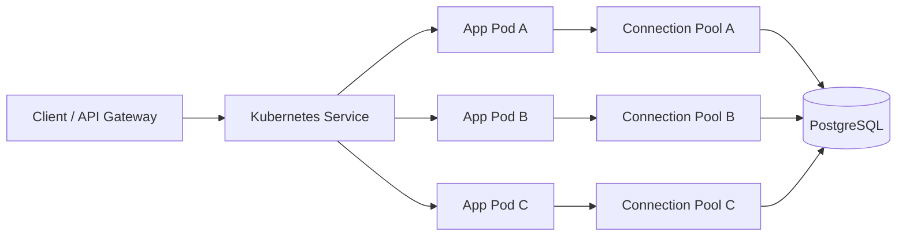
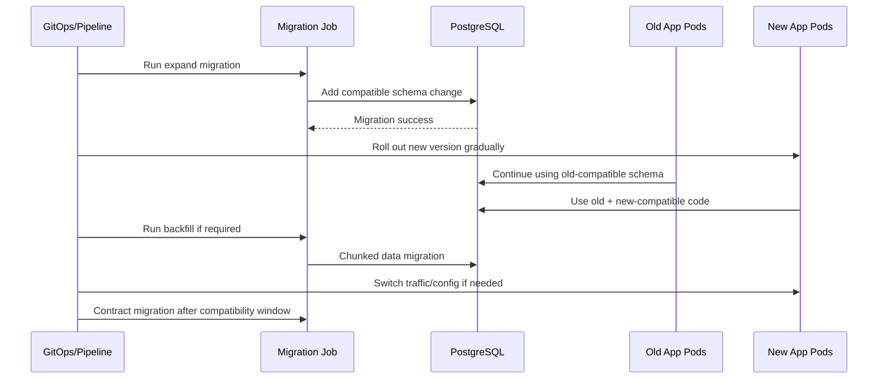

# Part 054 — Persistence Layer in Kubernetes and Cloud

Persistence layer tidak berjalan di ruang kosong.

Di production modern, persistence layer berjalan di atas:

- container,
- Kubernetes pod,
- service mesh atau network policy,
- secret manager,
- cloud/on-prem database,
- managed PostgreSQL,
- GitOps/IaC deployment,
- autoscaling,
- rolling deployment,
- migration job,
- monitoring dan alerting,
- hybrid network.

Banyak incident database bukan disebabkan query baru saja.

Sering penyebabnya adalah runtime topology:

- pod terlalu banyak membuka connection,
- rollout menciptakan connection storm,
- pool per pod dikonfigurasi tanpa menghitung total service,
- migration job berjalan paralel,
- secret rotation memutus connection,
- network latency berubah,
- DNS/private endpoint bermasalah,
- read/write path tidak cocok dengan cloud database topology,
- liveness probe membunuh pod saat DB lambat,
- startup service gagal karena database belum siap.

Senior backend engineer harus memahami persistence sebagai runtime dependency, bukan hanya code repository.

## 1. Core Mental Model

### 1.1 In Kubernetes, every pod has its own pool

Jika satu service punya 10 replica dan setiap pod punya pool max 20, maka service itu bisa membuka sampai:

```text
10 * 20 = 200 database connections
```

Kalau ada 8 service dengan pola mirip, total potential connection bisa jauh lebih besar dari yang disadari.

Connection pool bukan global per service.

Connection pool biasanya ada per application process/pod.

### 1.2 Database connection is a scarce shared resource

PostgreSQL connection bukan resource gratis.

Terlalu banyak connection dapat menyebabkan:

- memory database naik,
- context switching naik,
- throughput turun,
- query latency naik,
- max connection reached,
- connection storm saat rollout,
- cascading failure antar service.

Connection pool harus dituning sebagai bagian dari platform capacity, bukan preferensi satu repository.

### 1.3 Cloud does not remove database physics

Managed database membantu operasi:

- provisioning,
- backup,
- monitoring,
- patching,
- failover capability,
- storage management.

Namun tetap ada batas:

- CPU,
- memory,
- I/O,
- lock contention,
- connection count,
- network latency,
- transaction duration,
- query plan,
- index design,
- migration risk.

Cloud bukan alasan mengabaikan SQL dan transaction correctness.

## 2. Deployment Topology and Persistence Path

### 2.1 Basic runtime path



Setiap pod membawa pool sendiri.

Saat replica naik, potential DB connections naik.

Saat rollout, pod lama dan pod baru bisa hidup bersamaan sementara.

### 2.2 Total connection formula

Untuk satu service:

```text
total_service_connections = replicas * max_pool_size_per_pod
```

Untuk banyak service:

```text
total_application_connections =
  sum(service_replicas * service_pool_size)
```

Tambahkan juga:

- migration job,
- admin tools,
- BI/reporting tools,
- background workers,
- outbox pollers,
- scheduled jobs,
- test/staging connections jika berbagi DB,
- DBA sessions,
- monitoring agents.

### 2.3 Rolling deployment multiplier

Saat rolling deployment, sementara bisa ada pod lama dan pod baru.

Jika `maxSurge` memungkinkan tambahan pod, connection budget harus memperhitungkan surge.

Contoh konseptual:

```text
steady_state_replicas = 10
max_surge = 2
pool_per_pod = 20
potential_during_rollout = 12 * 20 = 240
```

Kalau banyak service rollout bersamaan, connection storm bisa terjadi.

## 3. Pool Sizing in Kubernetes

### 3.1 Pool size is not independent from replica count

Konfigurasi ini berbahaya jika tidak dihitung:

```yaml
replicas: 20
DB_POOL_MAX_SIZE: 50
```

Potential connection:

```text
1000 connections
```

Belum termasuk service lain.

### 3.2 Start from database budget

Cara berpikir:

1. Berapa max connection database yang aman?
2. Berapa connection yang disisakan untuk admin/maintenance/monitoring?
3. Berapa service yang memakai database ini?
4. Service mana latency-sensitive?
5. Service mana background-heavy?
6. Berapa replica per service?
7. Berapa concurrency per pod?
8. Berapa query/transaction duration rata-rata dan p95?

Pool sizing harus mengikuti budget.

Bukan sebaliknya.

### 3.3 Smaller pool can improve stability

Pool besar membuat lebih banyak query concurrent masuk ke database.

Jika DB saturated, pool besar memperburuk:

- CPU contention,
- lock contention,
- queueing di database,
- p99 latency,
- failure blast radius.

Pool kecil dapat berfungsi sebagai backpressure.

Namun pool terlalu kecil membuat app antre terlalu lama.

Tuning harus berbasis measurement.

### 3.4 Pool timeout alignment

Timeout yang perlu selaras:

- HTTP gateway timeout,
- JAX-RS/application request timeout,
- transaction timeout,
- connection acquisition timeout,
- JDBC query timeout,
- PostgreSQL statement timeout,
- PostgreSQL lock timeout,
- consumer processing timeout,
- Kubernetes termination grace period.

Smell:

- gateway timeout 30s,
- app transaction timeout 120s,
- statement timeout tidak ada,
- connection acquisition timeout 60s.

User sudah menerima timeout, tetapi database work masih berjalan.

## 4. Connection Storm

### 4.1 What is connection storm

Connection storm terjadi ketika banyak pod membuka koneksi ke database secara bersamaan.

Penyebab:

- deployment banyak replica,
- autoscaling mendadak,
- restart massal node,
- secret rotation,
- database failover,
- network interruption,
- liveness probe terlalu agresif,
- app startup langsung warm up semua connection,
- pool minimum idle tinggi.

### 4.2 Connection storm failure mode

Failure mode:

- database max connection reached,
- app pod gagal ready,
- retry connection makin agresif,
- CPU DB naik karena connection churn,
- cascading restart,
- service unavailable,
- migration job gagal mendapatkan connection.

### 4.3 Mitigation patterns

Mitigasi:

- readiness probe yang benar,
- startup jitter/backoff,
- minimum idle tidak terlalu tinggi,
- max pool masuk akal,
- rollout bertahap,
- PodDisruptionBudget,
- autoscaling guardrail,
- connection acquisition timeout yang tidak terlalu panjang,
- monitoring connection count,
- database proxy/pooler jika platform menyediakannya dan sesuai kebijakan,
- koordinasi deployment untuk service besar.

Internal architecture harus diverifikasi dengan platform team.

## 5. Readiness, Liveness, and Startup

### 5.1 Liveness should not kill pod for transient DB slowness

Liveness probe sebaiknya menjawab:

> Apakah process ini stuck dan perlu direstart?

Bukan:

> Apakah database sedang cepat?

Jika liveness probe bergantung kuat pada DB, DB slowness bisa menyebabkan pod restart massal, lalu connection storm.

### 5.2 Readiness can reflect dependency availability

Readiness probe menjawab:

> Apakah pod siap menerima traffic?

Readiness boleh mempertimbangkan dependency penting, tetapi harus hati-hati:

- jangan query berat,
- jangan membuka transaction mahal,
- jangan menyebabkan load tambahan saat incident,
- pertimbangkan degraded mode jika ada.

### 5.3 Startup migration anti-pattern

Anti-pattern:

```text
Setiap pod menjalankan migration saat startup.
```

Risiko:

- migration race,
- lock migration table,
- startup lambat,
- pod gagal ready,
- rollout stuck,
- schema berubah sebelum semua app siap,
- rollback rumit.

Lebih aman biasanya migration dijalankan sebagai controlled job/pipeline step, sesuai convention internal.

## 6. Migration Jobs in Kubernetes

### 6.1 Migration is a deployment actor

Migration job adalah actor yang mengubah source of truth.

Ia harus diperlakukan seperti production change, bukan startup side effect.

Perlu jelas:

- kapan berjalan,
- siapa menjalankan,
- credential apa dipakai,
- namespace/environment mana,
- apakah single instance,
- timeout berapa,
- observability apa,
- rollback/roll-forward bagaimana,
- apakah compatible dengan app version lama/baru.

### 6.2 Migration and rolling deployment

Expand-contract migration cocok untuk Kubernetes rolling deployment.

Sequence umum:

```text
1. Expand schema: add nullable column/table/index compatible.
2. Deploy app version that can use old + new shape.
3. Backfill data safely.
4. Switch reads/writes gradually if needed.
5. Contract: remove old column/path after compatibility window.
```

Jangan drop/rename column yang masih dipakai pod lama.

### 6.3 Migration locking risk

DDL dapat memegang lock.

Index creation dapat mahal.

Constraint validation dapat mahal.

Backfill dapat menekan WAL/I/O/lock.

Review migration harus menjawab:

- berapa ukuran table?
- apakah DDL blocking?
- apakah index dibuat dengan strategi aman?
- apakah backfill di-chunk?
- apakah statement timeout diatur?
- apakah ada monitoring selama migration?
- apakah ada kill/rollback plan?

### 6.4 Migration job checklist

- job hanya satu instance,
- image/version jelas,
- migration tool jelas,
- credential migration berbeda jika policy mengharuskan,
- logs tersimpan,
- metrics/event deployment tersedia,
- timeout jelas,
- retry tidak membahayakan,
- idempotency migration dipahami,
- compatible dengan rolling deployment,
- DBA/platform aware untuk migration besar.

## 7. Secret Rotation and Database Credentials

### 7.1 Credentials are runtime dependencies

Database credential bisa berubah karena:

- rotation berkala,
- incident security,
- environment rebuild,
- cloud secret manager update,
- manual DBA operation,
- GitOps secret update.

Aplikasi harus punya perilaku jelas saat credential berubah.

### 7.2 Failure modes during rotation

- existing connections tetap hidup, new connections gagal,
- pool terus mencoba credential lama,
- pod perlu restart untuk membaca secret baru,
- restart massal menciptakan connection storm,
- migration job memakai credential berbeda dan gagal,
- read-only user dipakai untuk write path,
- migration user bocor ke application runtime.

### 7.3 Credential separation

Idealnya role berbeda:

- application runtime user,
- read-only/reporting user,
- migration user,
- admin/DBA user,
- monitoring user.

Namun detail internal harus diverifikasi.

Jangan mengarang policy CSG/team.

### 7.4 Secret checklist

- Cek secret source: Kubernetes Secret, external secret, vault, cloud secret manager, atau mekanisme internal.
- Cek apakah pod reload secret otomatis atau perlu restart.
- Cek rotation runbook.
- Cek credential privilege.
- Cek migration credential.
- Cek incident plan jika credential invalid.
- Cek audit access secret.

## 8. Network Latency and Private Connectivity

### 8.1 Database latency is not only execution time

Total query time mencakup:

- app-to-DB network latency,
- TLS overhead jika ada,
- packet loss/retry,
- cross-zone/cross-region routing,
- service mesh/proxy overhead,
- database execution,
- result transfer.

Query kecil yang banyak sangat sensitif terhadap round trip.

N+1 semakin buruk di network latency tinggi.

### 8.2 Private endpoint and DNS concerns

Private connectivity dapat melibatkan:

- private endpoint,
- VPC/VNet peering,
- private DNS zone,
- firewall/security group,
- route table,
- network policy,
- on-prem VPN/direct connect/express route equivalent.

Failure mode:

- DNS resolves ke endpoint salah,
- latency cross-zone tinggi,
- firewall rule berubah,
- private endpoint unavailable,
- TLS certificate/hostname mismatch,
- intermittent packet loss.

Backend engineer perlu tahu jalur network minimal untuk troubleshooting.

### 8.3 Hybrid deployment concerns

Untuk hybrid cloud/on-prem:

- latency lebih variatif,
- network partition lebih mungkin,
- firewall/proxy lebih kompleks,
- DNS split-horizon bisa membingungkan,
- failover path harus diuji,
- monitoring harus lintas environment,
- retry storm bisa memperburuk link terbatas.

Persistence design harus menghindari chatty DB access jika latency antar environment tinggi.

## 9. Managed PostgreSQL Awareness

### 9.1 Managed PostgreSQL is still PostgreSQL

Managed PostgreSQL tetap memiliki:

- MVCC,
- locks,
- transactions,
- indexes,
- query planner,
- vacuum/autovacuum behavior,
- connection limits,
- replication/failover considerations,
- parameter groups/configuration,
- backup/restore behavior.

Vendor detail berbeda dan harus diverifikasi di dokumentasi/platform internal.

### 9.2 AWS/Azure/on-prem differences to verify

Internal verification, bukan asumsi:

- engine/version PostgreSQL,
- managed service type,
- high availability model,
- backup retention,
- failover behavior,
- maintenance window,
- max connection limits,
- parameter management,
- extension availability,
- network path,
- private endpoint rules,
- monitoring integration,
- IAM/identity integration jika ada,
- encryption at rest/in transit,
- replica/read scaling policy.

Jangan mengandalkan knowledge umum tanpa mengecek environment nyata.

### 9.3 Failover behavior

Saat failover:

- existing connections bisa putus,
- transaction in-flight rollback,
- DNS endpoint bisa berubah,
- app pool harus reconnect,
- retry policy harus membedakan retryable/non-retryable,
- idempotency menjadi penting,
- outbox/inbox membantu recovery event-driven path.

Failure mode ini harus diuji atau minimal dipahami dari platform runbook.

## 10. Autoscaling and Persistence

### 10.1 HPA can overload the database

Horizontal Pod Autoscaler dapat menambah pod karena CPU app tinggi.

Tapi jika CPU app tinggi akibat menunggu DB atau retry, menambah pod dapat:

- menambah DB connections,
- menambah query pressure,
- memperparah lock contention,
- memperburuk latency.

Autoscaling harus memahami downstream database capacity.

### 10.2 Consumer concurrency

Kafka/RabbitMQ consumer scaling perlu dihitung:

```text
consumer_concurrency_total = replicas * concurrency_per_pod
```

Jika setiap message melakukan transaction/write, total concurrent DB write bisa naik drastis.

Risiko:

- lock contention,
- deadlock,
- serialization failure,
- pool exhaustion,
- outbox/inbox table hot spot,
- idempotency table contention.

### 10.3 Backpressure

Backpressure lebih sehat daripada overload.

Mechanism:

- pool as concurrency gate,
- bounded worker threads,
- consumer pause/backoff,
- queue lag alert,
- rate limit endpoint,
- shed low-priority work,
- circuit breaker untuk dependency non-DB,
- retry with jitter.

## 11. PostgreSQL in Kubernetes? Be Careful

Jika PostgreSQL sendiri berjalan di Kubernetes/on-prem platform, concern tambahan:

- persistent volume latency,
- storage class behavior,
- pod rescheduling,
- backup/restore operator,
- failover operator,
- anti-affinity,
- node maintenance,
- disk pressure,
- network policy,
- statefulset lifecycle.

Aplikasi tetap harus memakai database sebagai dependency eksternal dengan SLA dan runbook yang jelas.

Detail internal harus diverifikasi dengan platform/DBA.

## 12. GitOps/IaC and Persistence Changes

### 12.1 Persistence config must be reviewed as code

Config yang memengaruhi persistence:

- pool size,
- timeout,
- DB host/port,
- SSL mode,
- migration enable flag,
- replica count,
- HPA rules,
- resource limits,
- secret references,
- network policy,
- init/migration job,
- environment variables.

Perubahan config bisa sama berisikonya dengan perubahan Java code.

### 12.2 GitOps drift risk

Risiko:

- manual hotfix config tidak masuk Git,
- secret/config mismatch antar environment,
- staging berbeda jauh dari production,
- migration job disabled di satu env,
- pool size override tidak terdokumentasi,
- HPA min/max berbeda tanpa alasan.

Senior engineer harus mencari source of truth config.

## 13. Resource Requests, Limits, and Persistence Behavior

### 13.1 CPU throttling affects DB latency indirectly

Jika pod CPU throttled:

- query mapping lebih lambat,
- transaction lebih lama,
- connection ditahan lebih lama,
- pool active connection naik,
- timeout meningkat,
- retry meningkat.

DB bisa terlihat lambat padahal aplikasi throttled.

### 13.2 Memory limit and large result

Jika endpoint mengambil result besar:

- heap naik,
- GC naik,
- pod OOMKilled,
- transaction putus,
- client menerima error,
- retry dapat menggandakan load.

Large result harus di-stream/chunk dengan timeout dan cancellation jelas.

### 13.3 Resource checklist

- Cek CPU throttling metrics.
- Cek memory usage per endpoint/job.
- Cek OOMKilled event.
- Cek GC pause.
- Cek large result endpoint.
- Cek batch job memory profile.
- Cek pod resource request/limit.

## 14. Timeouts in Cloud/Kubernetes

### 14.1 Timeout stack

Timeout bisa berada di:

- API gateway/ingress,
- load balancer,
- service mesh,
- JAX-RS server,
- application transaction,
- connection pool acquisition,
- JDBC statement,
- PostgreSQL statement timeout,
- PostgreSQL lock timeout,
- cloud network idle timeout,
- message broker consumer timeout.

Jika timeout tidak selaras, failure menjadi sulit dipahami.

### 14.2 Timeout ordering

Prinsip praktis:

- lock timeout biasanya lebih pendek dari request timeout,
- statement timeout harus mencegah query liar berjalan terlalu lama,
- connection acquisition timeout tidak boleh menyembunyikan pool exhaustion terlalu lama,
- transaction timeout harus lebih pendek dari user-facing timeout jika memungkinkan,
- worker timeout harus mempertimbangkan idempotency/retry.

Detail angka harus diverifikasi internal.

## 15. Observability Across App, Kubernetes, and Database

### 15.1 Required correlation

Untuk incident persistence, butuh korelasi:

- request ID / trace ID,
- endpoint,
- pod name,
- deployment version,
- DB query name/SQL fingerprint,
- transaction duration,
- pool wait,
- DB wait event,
- lock wait,
- error SQLState,
- migration version,
- Kafka/RabbitMQ message ID jika worker.

Tanpa korelasi, troubleshooting menjadi tebak-tebakan.

### 15.2 Dashboards to connect

Dashboard yang perlu terhubung:

- service latency/error/throughput,
- pod CPU/memory/restart,
- connection pool active/idle/pending,
- DB CPU/I/O/connections,
- slow queries,
- locks/deadlocks,
- transaction duration,
- migration status,
- consumer lag,
- outbox/inbox backlog,
- network errors/latency.

### 15.3 Alerting anti-pattern

Alert buruk:

- terlalu banyak noise,
- hanya CPU tanpa symptom user,
- tidak membedakan transient vs sustained,
- tidak punya runbook,
- tidak menunjuk owner,
- tidak punya severity.

Alert bagus:

- actionable,
- punya threshold berbasis baseline,
- terkait user impact atau data correctness,
- punya link dashboard/runbook,
- punya escalation path.

## 16. Security and Network Policy

### 16.1 Least privilege at network and database layer

Persistence security bukan hanya SQL injection.

Perlu juga:

- pod mana boleh akses DB,
- namespace mana boleh akses DB,
- DB user privilege,
- migration user privilege,
- read-only access,
- TLS requirements,
- secret access,
- audit database connection.

### 16.2 Network policy failure mode

Perubahan network policy dapat menyebabkan:

- pod tidak bisa connect DB,
- migration job gagal,
- health check gagal,
- DNS blocked,
- connection timeout bukan authentication error,
- partial outage antar namespace.

Runbook harus membedakan authentication failure, DNS failure, network timeout, dan DB reject.

## 17. Multi-Region and Read Replica Awareness

### 17.1 Read replica is not free consistency

Jika memakai read replica, perhatikan:

- replication lag,
- read-after-write consistency,
- routing query read/write,
- transaction boundary,
- stale read risk,
- failover behavior,
- cache interaction.

Command path yang membutuhkan immediate read-after-write biasanya harus membaca dari primary atau memiliki consistency strategy.

### 17.2 Multi-region latency

Cross-region database access bisa sangat mahal untuk chatty persistence access.

N+1 di region sama sudah buruk.

N+1 cross-region jauh lebih buruk.

Jika architecture multi-region relevan, persistence access pattern harus didesain ulang, bukan hanya dituning.

Internal topology harus diverifikasi.

## 18. Event-Driven Workers in Kubernetes

### 18.1 Worker scaling changes DB write pressure

Kafka/RabbitMQ consumer yang diskalakan horizontal dapat meningkatkan:

- concurrent transactions,
- row lock contention,
- duplicate processing race,
- idempotency table writes,
- outbox/inbox load,
- deadlock probability.

Consumer concurrency harus menjadi bagian dari DB capacity plan.

### 18.2 Worker shutdown and transaction safety

Saat pod termination:

- consumer harus berhenti menerima message baru,
- in-flight transaction harus selesai atau rollback,
- message ack/nack harus sesuai commit result,
- termination grace period harus cukup,
- duplicate processing harus idempotent.

Persistence correctness dan Kubernetes lifecycle saling terkait.

## 19. Deployment Failure Modes

### 19.1 Common failure modes

- New version expects column that migration belum jalan.
- Migration drops column while old pod still running.
- Pool size override terlalu besar.
- Secret rotated but pods still use old credential.
- Readiness checks fail karena DB cold start.
- Liveness restarts all pods during DB slowness.
- Autoscaler adds pods and overloads DB.
- Migration job runs in parallel.
- Index migration locks hot table.
- Backfill saturates I/O.
- Network policy blocks DB.
- DNS/private endpoint misconfigured.
- Failover causes connection reset and non-idempotent retry duplicates writes.

### 19.2 Failure mode table

| Failure | Symptom | Evidence | Mitigation |
|---|---|---|---|
| Connection storm | many pod startup failures | DB connection count spike | rollout throttle, lower min idle, backoff |
| Pool exhaustion | request waits/fails | pool pending high | tune query/transaction/pool, reduce concurrency |
| Blocking migration | endpoint stuck | lock wait, DDL active | stop migration if safe, schedule safer migration |
| Stale credential | new connections fail | auth error after rotation | restart/reload secret, fix secret version |
| Network block | connection timeout | pod logs + network policy | restore route/policy/DNS |
| Replica lag | stale reads | lag metric | route consistency-sensitive reads to primary |
| Failover | connection reset | DB event + SQL errors | retry idempotently, reconnect pool |

## 20. Mermaid: Deployment and Migration Safety



## 21. Java/JAX-RS Service Design Implications

### 21.1 Request lifecycle

JAX-RS request should not blindly hold DB resources for entire request if not necessary.

Review:

- transaction begins where?
- connection acquired when?
- connection released when?
- response serialization happens inside or outside transaction?
- streaming response holds connection?
- timeout and cancellation propagate?

### 21.2 Graceful shutdown

During pod shutdown:

- stop accepting new requests,
- finish/timeout in-flight requests,
- close pools cleanly,
- stop consumers safely,
- avoid half-committed side effects,
- preserve idempotency on retry.

If shutdown is abrupt, in-flight DB transactions rollback, but external side effects may not rollback.

Outbox pattern helps.

## 22. Internal Verification Checklist

Cek bersama team/platform/DBA:

- Kubernetes replica count per service,
- HPA min/max per service,
- connection pool max/min per service,
- total DB connection budget,
- PostgreSQL max connection dan reserved connection,
- migration execution model,
- whether migration runs in pipeline, job, init container, or app startup,
- rolling deployment strategy,
- maxSurge/maxUnavailable,
- PodDisruptionBudget,
- readiness/liveness/startup probe behavior,
- secret source dan rotation process,
- DB user privilege separation,
- network path app-to-DB,
- private endpoint/DNS/firewall model,
- cloud/on-prem/hybrid topology,
- managed PostgreSQL vendor/type/version,
- failover behavior and runbook,
- backup/restore process,
- statement/lock/transaction timeout defaults,
- dashboard for app/pod/pool/DB metrics,
- alert thresholds,
- incident notes related to connection storm, pool exhaustion, failed migration, failover, secret rotation,
- load test assumptions for replica and connection count,
- consumer concurrency for Kafka/RabbitMQ workers,
- outbox/inbox backlog monitoring,
- policy for read replica usage if any,
- policy for direct DB access from tools/jobs.

## 23. PR Review Checklist

Saat PR menyentuh deployment/config/persistence:

- Apakah pool size berubah?
- Apakah replica/HPA berubah?
- Apakah total DB connection dihitung?
- Apakah timeout berubah?
- Apakah migration aman untuk rolling deployment?
- Apakah migration job single-instance?
- Apakah secret reference berubah?
- Apakah DB privilege berubah?
- Apakah network policy berubah?
- Apakah readiness/liveness berubah?
- Apakah worker concurrency berubah?
- Apakah query/batch bisa menambah DB pressure?
- Apakah observability cukup untuk mendeteksi regression?
- Apakah rollback plan tersedia?

## 24. Production Readiness Checklist

Sebelum service persistence-heavy production-ready:

- pool sizing dihitung terhadap replica,
- timeout stack jelas,
- migration process controlled,
- startup tidak menjalankan migration berbahaya,
- readiness/liveness tidak menyebabkan restart storm,
- secret rotation runbook ada,
- DB credential privilege minimal,
- dashboard app/pod/pool/DB tersedia,
- slow query dan lock monitoring tersedia,
- failover behavior dipahami,
- deployment rollback/roll-forward dipahami,
- consumer shutdown idempotent,
- outbox/inbox recoverable,
- network path terdokumentasi,
- platform/DBA escalation jelas.

## 25. Practical Exercise

Ambil satu service persistence-heavy.

Lakukan audit:

1. Hitung replica saat normal.
2. Hitung replica saat rollout surge.
3. Catat max pool size per pod.
4. Hitung total potential connections.
5. Bandingkan dengan DB connection budget.
6. Cek HPA max replica.
7. Cek worker concurrency.
8. Cek migration model.
9. Cek readiness/liveness probe.
10. Cek timeout stack.
11. Cek secret rotation behavior.
12. Cek dashboard pool dan DB connection.
13. Tulis satu risiko terbesar.
14. Tulis mitigasi yang bisa direview dengan platform/DBA.

## 26. Summary

Persistence layer di Kubernetes/cloud adalah kombinasi code dan runtime topology.

Code yang benar bisa gagal jika:

- terlalu banyak pod membuka connection,
- pool size tidak dihitung,
- rollout menciptakan connection storm,
- migration tidak compatible,
- secret rotation tidak dipahami,
- network path tidak stabil,
- timeout tidak selaras,
- observability tidak menghubungkan app, pod, pool, dan database.

Senior backend engineer harus bisa membaca:

- Java/JAX-RS request lifecycle,
- transaction boundary,
- connection pool,
- Kubernetes deployment behavior,
- cloud database constraints,
- migration process,
- operational runbook.

Di production, persistence performance dan correctness tidak hanya ditentukan oleh SQL.

Ia juga ditentukan oleh cara service dijalankan.
