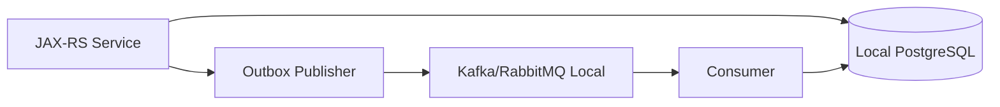

# Part 055 — Local Development Workflow

Local development workflow untuk persistence layer bukan sekadar “bisa run service di laptop”. Untuk sistem enterprise Java/JAX-RS yang menggunakan PostgreSQL, MyBatis, JPA/Hibernate, migration tool, event-driven consistency, dan deployment Kubernetes/cloud/on-prem, local workflow harus membantu engineer menjawab pertanyaan yang lebih penting:

> Apakah query, mapping, transaction, migration, dan behavior database yang saya lihat secara lokal cukup mirip dengan production sehingga bug penting bisa ditemukan sebelum PR merged?

Persistence bug sering lolos bukan karena engineer tidak menulis test, tetapi karena environment lokal terlalu jauh dari real database behavior. Mock repository tidak menangkap constraint violation. In-memory database tidak menangkap PostgreSQL JSONB, MVCC, lock, sequence, isolation, index planner, trigger, function, atau `RETURNING`. Local data yang terlalu kecil tidak menangkap slow query. Migration yang tidak dijalankan dari nol tidak menangkap ordering issue.

Tujuan part ini adalah membangun workflow lokal yang berguna untuk senior backend engineer: cepat dipakai, reproducible, SQL-aware, migration-aware, dan cukup realistis untuk debugging failure mode persistence layer.

---

## 1. Mental Model: Local Workflow Is a Safety Simulator

Local workflow adalah simulator untuk beberapa jenis risiko:

| Risiko | Yang harus bisa disimulasikan lokal |
|---|---|
| Schema mismatch | Migration dari database kosong sampai versi terbaru |
| Mapper mismatch | MyBatis query benar terhadap PostgreSQL asli |
| Entity mismatch | JPA entity sesuai table, column, constraint, sequence |
| Transaction bug | Commit, rollback, propagation, lock, retry |
| Performance regression | Query plan dasar, query count, N+1, large result behavior |
| Data correctness bug | Constraint, invariant, idempotency, soft delete, tenant filter |
| Operational bug | Pool exhaustion, timeout, failed migration, bad seed data |

Local workflow tidak harus meniru production secara penuh. Tetapi workflow lokal harus cukup nyata untuk menangkap bug persistence yang paling mahal.

Prinsipnya:

```text
Mock boleh untuk domain logic.
Real PostgreSQL wajib untuk persistence behavior.
```

---

## 2. Local PostgreSQL Strategy

Ada beberapa pilihan menjalankan PostgreSQL lokal:

1. PostgreSQL native di laptop.
2. PostgreSQL via Docker Compose.
3. PostgreSQL ephemeral via Testcontainers.
4. Shared dev database.

Untuk persistence engineering, prioritas terbaik biasanya:

```text
Testcontainers untuk automated tests.
Docker Compose untuk manual local debugging.
Shared dev DB hanya untuk integration scenario tertentu, bukan default local confidence.
```

### 2.1 Native PostgreSQL

Kelebihan:

- Cepat setelah terpasang.
- Mudah diakses dari SQL console.
- Cocok untuk exploratory query.

Risiko:

- Version drift dengan production.
- Extension/configuration drift.
- State lokal menjadi kotor.
- Sulit direproduksi oleh engineer lain.

Native PostgreSQL boleh, tetapi jangan menjadi satu-satunya dasar validasi persistence change.

### 2.2 Docker Compose PostgreSQL

Docker Compose cocok untuk workflow manual karena environment bisa dideklarasikan.

Contoh minimal:

```yaml
services:
  postgres:
    image: postgres:16
    container_name: persistence-local-postgres
    ports:
      - "5432:5432"
    environment:
      POSTGRES_DB: quote_order_local
      POSTGRES_USER: app
      POSTGRES_PASSWORD: app
    volumes:
      - postgres-data:/var/lib/postgresql/data
    healthcheck:
      test: ["CMD-SHELL", "pg_isready -U app -d quote_order_local"]
      interval: 5s
      timeout: 5s
      retries: 20

volumes:
  postgres-data:
```

Yang perlu diperhatikan:

- Gunakan PostgreSQL major version yang sama atau sedekat mungkin dengan runtime target.
- Jangan menyimpan credential production di compose file.
- Pisahkan user aplikasi, user migration, dan user admin jika ingin mensimulasikan least privilege.
- Pastikan reset database mudah dilakukan.

Workflow reset yang sehat:

```bash
docker compose down -v
docker compose up -d postgres
./mvnw verify -Pintegration
```

Atau:

```bash
docker compose exec postgres psql -U app -d quote_order_local
```

### 2.3 Testcontainers PostgreSQL

Testcontainers cocok untuk automated integration tests karena setiap test suite bisa membawa PostgreSQL ephemeral sendiri.

Contoh konsep JUnit:

```java
static PostgreSQLContainer<?> postgres = new PostgreSQLContainer<>("postgres:16")
    .withDatabaseName("testdb")
    .withUsername("app")
    .withPassword("app");
```

Manfaat utama:

- Database test fresh.
- Migration bisa diuji dari nol.
- Tidak tergantung state laptop engineer.
- Behavior PostgreSQL lebih realistis daripada H2/in-memory DB.

Trade-off:

- Test lebih lambat dibanding unit test.
- Butuh Docker runtime.
- Harus dikelola agar CI tidak terlalu lambat.

Aturan praktis:

```text
Unit test untuk pure logic.
Testcontainers untuk persistence correctness.
```

---

## 3. Migration on Startup: Useful, but Dangerous if Misunderstood

Dalam local workflow, migration sering dijalankan otomatis saat aplikasi start. Ini berguna, tetapi harus dipahami sebagai behavior environment-specific.

### 3.1 Local Migration Startup

Local migration startup membantu engineer:

- Menjalankan schema terbaru tanpa manual SQL.
- Menemukan migration ordering issue.
- Menemukan syntax error DDL lebih cepat.
- Menyamakan local schema dengan branch aktif.

Tetapi jangan mengasumsikan production melakukan hal yang sama.

Dalam production, migration bisa berjalan sebagai:

- init job,
- Kubernetes job,
- CI/CD migration step,
- manual DBA-controlled process,
- Flyway/Liquibase at app startup,
- atau deployment pipeline terpisah.

### 3.2 Migration Discipline Lokal

Setiap perubahan persistence harus bisa melewati skenario:

```text
empty database -> run all migrations -> start application -> run integration tests
```

Dan untuk schema evolution:

```text
old schema -> apply new migration -> old app compatibility if required -> new app compatibility
```

Untuk local development, biasakan command seperti:

```bash
./mvnw test -Pintegration
./mvnw flyway:migrate
./mvnw liquibase:update
```

Nama command tergantung setup internal. Jangan mengarang command CSG; cek repository masing-masing.

---

## 4. Seed Data and Fixtures

Seed data lokal sering berubah menjadi sumber bug bila tidak dikontrol. Seed data sebaiknya dipisahkan dari migration production.

### 4.1 Migration vs Seed Data

| Item | Migration | Seed/fixture |
|---|---|---|
| Tujuan | Evolusi schema/data production | Data development/test |
| Harus deterministic | Ya | Ya |
| Masuk production | Ya, jika migration production | Tidak selalu |
| Boleh sering berubah | Tidak sembarangan | Boleh dengan kontrol |
| Harus backward compatible | Sering ya | Tergantung test |

Jangan memasukkan sample data lokal ke migration production kecuali memang reference data yang valid untuk production.

### 4.2 Fixture yang Baik

Fixture persistence yang baik memiliki properti:

- kecil tetapi representatif,
- deterministic,
- mudah dibaca,
- tidak bergantung pada urutan test acak,
- mencakup edge case penting,
- tidak memakai PII nyata,
- konsisten dengan constraint terbaru.

Contoh fixture domain Quote & Order secara generic:

```text
customer
catalog_offering
price_plan
quote
quote_item
order_request
outbox_event
```

Tetapi nama table aktual harus diverifikasi di codebase internal.

### 4.3 Fixture untuk Failure Mode

Jangan hanya seed happy path. Siapkan fixture untuk:

- quote expired,
- soft-deleted record,
- tenant berbeda,
- duplicate external reference,
- large quote with many items,
- pending outbox event,
- partially processed inbox event,
- version conflict,
- missing optional field,
- invalid state transition.

Persistence layer harus diuji terhadap data yang buruk, bukan hanya data ideal.

---

## 5. SQL Console as Debugging Tool

Senior engineer harus nyaman berpindah antara Java code dan SQL console.

SQL console digunakan untuk:

- melihat schema aktual,
- menjalankan query MyBatis secara manual,
- memverifikasi generated SQL Hibernate,
- menjalankan `EXPLAIN`,
- memeriksa lock,
- mengecek row count,
- membandingkan before/after migration,
- memeriksa trigger/function side effect.

Command dasar:

```sql
\dt
\d+ table_name
\di
\df
\x on
```

Query inspection:

```sql
EXPLAIN ANALYZE
SELECT ...;
```

Lock inspection lokal:

```sql
SELECT
  pid,
  state,
  wait_event_type,
  wait_event,
  query
FROM pg_stat_activity
WHERE datname = current_database();
```

Index inspection:

```sql
SELECT
  schemaname,
  tablename,
  indexname,
  indexdef
FROM pg_indexes
WHERE tablename = 'target_table';
```

Jangan menjalankan query destructive tanpa transaksi eksplisit saat debugging:

```sql
BEGIN;
UPDATE ...;
SELECT ...;
ROLLBACK;
```

---

## 6. MyBatis Mapper Debugging Workflow

MyBatis debugging harus menjawab empat pertanyaan:

1. SQL apa yang benar-benar dieksekusi?
2. Parameter apa yang dibind?
3. Result set shape seperti apa yang kembali dari PostgreSQL?
4. Object Java hasil mapping apakah sesuai harapan?

### 6.1 Debugging Mapper XML

Checklist lokal:

- Buka mapper interface.
- Buka mapper XML dengan namespace yang sama.
- Temukan statement id sesuai method.
- Salin SQL final ke SQL console.
- Ganti parameter dengan value test.
- Jalankan `EXPLAIN` untuk query berat.
- Validasi column alias sesuai ResultMap.
- Jalankan test mapper dengan fixture yang sama.

### 6.2 Dynamic SQL Debugging

Dynamic SQL rentan karena SQL final berubah berdasarkan parameter.

Untuk setiap dynamic mapper, test minimal:

- no filter,
- single filter,
- multiple filters,
- null parameter,
- empty collection,
- large `IN` clause,
- invalid sort field,
- pagination boundary,
- tenant filter,
- soft delete filter.

Jangan hanya menguji satu kombinasi parameter.

### 6.3 MyBatis Logging

Pastikan local profile bisa menampilkan:

- statement id,
- SQL,
- bound parameters,
- row count jika tersedia,
- duration jika instrumentation ada.

Tetapi logging parameter harus hati-hati bila data bisa sensitif. Local profile boleh lebih verbose, tetapi tetap jangan membiasakan log PII mentah.

---

## 7. JPA/Hibernate SQL Debugging Workflow

JPA/Hibernate debugging berbeda dari MyBatis karena SQL bisa muncul akibat lifecycle, bukan karena explicit query method.

Pertanyaan utama:

1. Entity mana yang managed?
2. Kapan flush terjadi?
3. SQL apa yang digenerate?
4. Apakah ada N+1?
5. Apakah persistence context menyimpan stale state?

### 7.1 Hibernate Logging Lokal

Local profile sebaiknya bisa mengaktifkan:

- SQL logging,
- bind parameter logging,
- query count,
- slow query threshold,
- Hibernate statistics jika tersedia.

Contoh conceptual setting:

```properties
hibernate.show_sql=false
hibernate.format_sql=true
hibernate.generate_statistics=true
```

Untuk production, jangan asal aktifkan verbose SQL logging karena risiko volume log dan PII. Local dan test profile berbeda dari production profile.

### 7.2 Flush Debugging

Flush surprise sering muncul ketika query dijalankan setelah entity managed dimutasi.

Contoh mental model:

```java
entity.setStatus(Status.APPROVED);

// Query berikut dapat memicu flush sebelum SELECT,
// tergantung flush mode dan transaction context.
repository.findSomethingElse();
```

Debugging lokal:

- Aktifkan SQL log.
- Tandai boundary transaction.
- Lihat apakah `UPDATE` muncul sebelum `SELECT`.
- Cek apakah entity dimutasi secara tidak sengaja.
- Cek apakah mapper MyBatis membaca data sebelum/after flush jika mixed path.

### 7.3 N+1 Debugging

Local dataset kecil bisa menyembunyikan N+1. Siapkan fixture dengan jumlah child cukup besar.

Contoh:

```text
1 quote -> 50 quote items -> each item has product/price references
```

Kemudian assert query count atau minimal inspeksi log.

---

## 8. Local Transaction Testing

Transaction bug harus bisa direproduksi lokal.

Skenario yang perlu diuji:

- rollback saat exception,
- checked vs unchecked exception behavior jika framework membedakan,
- nested service call,
- `REQUIRES_NEW` behavior,
- outbox insert atomic dengan business write,
- lock wait,
- deadlock simulation,
- serialization failure retry,
- stale JPA context after MyBatis update.

### 8.1 Simulasi Lock Lokal

Session A:

```sql
BEGIN;
SELECT * FROM quote WHERE id = 'q-1' FOR UPDATE;
```

Session B:

```sql
UPDATE quote SET status = 'APPROVED' WHERE id = 'q-1';
```

Session B akan menunggu sampai Session A commit/rollback. Ini membantu engineer memahami lock wait secara nyata.

### 8.2 Simulasi Unique Constraint Race

Gunakan dua thread/test transaction yang mencoba insert key yang sama.

Expected behavior:

- satu berhasil,
- satu gagal unique violation,
- service mengubahnya menjadi domain error/idempotent response jika sesuai.

Jangan mengandalkan pre-check `SELECT exists` sebagai satu-satunya guard.

---

## 9. Local Performance Testing: Useful but Limited

Local performance testing tidak menggantikan load test atau production telemetry. Tetapi berguna untuk menemukan masalah obvious:

- N+1,
- missing index,
- full table scan pada fixture besar,
- serialization/deserialization besar,
- mapper nested select,
- JPA persistence context memory growth,
- batch operation terlalu besar,
- pagination offset terlalu besar.

### 9.1 Buat Data Volume Sintetis

Untuk local diagnosis, buat script fixture volume:

```text
10 tenants
1,000 customers
10,000 quotes
100,000 quote items
pending outbox events
expired/soft-deleted rows
```

Jumlah aktual disesuaikan laptop dan domain internal.

### 9.2 Jangan Salah Membaca Local Benchmark

Local benchmark tidak valid untuk klaim absolute latency production karena:

- hardware berbeda,
- network latency berbeda,
- database config berbeda,
- cache berbeda,
- concurrency berbeda,
- data distribution berbeda.

Tetapi local benchmark valid untuk membandingkan dua query di environment yang sama secara kasar.

---

## 10. Local Event-Driven Persistence Workflow

Untuk microservices dengan Kafka/RabbitMQ/outbox/inbox, local workflow sebaiknya bisa mensimulasikan minimal:

- business write + outbox insert dalam satu transaction,
- polling publisher membaca outbox,
- event marked as published,
- duplicate event handling,
- inbox deduplication,
- replay event,
- failed handler retry.

Docker Compose bisa menyediakan PostgreSQL + broker lokal.

Contoh conceptual topology:



Jika broker lokal terlalu berat, test persistence outbox/inbox tetap bisa dilakukan dengan repository-level integration test terhadap PostgreSQL.

---

## 11. Local Profile Configuration

Local profile harus eksplisit dan tidak bercampur dengan production.

Local profile biasanya mengatur:

- datasource URL,
- pool size kecil,
- migration enabled,
- SQL logging lebih verbose,
- fake/test credentials,
- seed data enabled,
- broker lokal,
- cache lokal/disabled,
- timeout lebih pendek untuk debugging,
- feature flags lokal.

Contoh prinsip:

```text
Production config must not be required for local development.
Local config must not accidentally point to production resources.
```

Guard penting:

- gunakan database name yang jelas mengandung `local` atau `test`,
- blokir destructive local script jika URL bukan local/test,
- jangan commit credential nyata,
- jangan memakai production dump berisi PII tanpa sanitization.

---

## 12. Common Local Workflow Anti-Patterns

### 12.1 Mocking Repository untuk Semua Test

Mock repository berguna untuk service logic, tetapi tidak membuktikan SQL, mapping, constraint, transaction, atau PostgreSQL behavior.

Anti-pattern:

```text
All persistence changes are validated only with mocked repository tests.
```

### 12.2 Menggunakan H2 untuk PostgreSQL-Specific System

H2 bisa berbeda dalam SQL dialect, type, locking, JSONB, constraint, sequence, function, dan planner. Untuk PostgreSQL-heavy system, H2 sering memberi false confidence.

### 12.3 Local Database Tidak Pernah Reset

Database lokal yang sudah lama dipakai bisa menyembunyikan migration bug karena schema-nya tidak lagi representatif.

Biasakan reset dari nol secara berkala.

### 12.4 Seed Data Terlalu Sempurna

Data production sering tidak sempurna. Local fixture harus punya edge case.

### 12.5 Tidak Pernah Melihat SQL Final

Baik MyBatis maupun Hibernate harus dilihat SQL finalnya. Senior engineer tidak boleh hanya percaya abstraction.

---

## 13. PR Readiness from Local Workflow

Sebelum membuka PR persistence change, minimal jawab:

- Apakah migration berjalan dari database kosong?
- Apakah mapper/entity test menggunakan PostgreSQL asli?
- Apakah SQL final sudah dilihat?
- Apakah query plan untuk query berat sudah dicek?
- Apakah transaction boundary sudah diuji?
- Apakah rollback behavior jelas?
- Apakah tenant/soft-delete/effective-date filter tidak hilang?
- Apakah dynamic SQL punya test branch penting?
- Apakah JPA query tidak menghasilkan N+1?
- Apakah data sensitif tidak muncul di log?

---

## 14. Internal Verification Checklist

Verifikasi di codebase dan team:

- Tool lokal resmi: Docker Compose, Dev Container, Testcontainers, atau internal platform tool.
- PostgreSQL version yang digunakan production/dev/test.
- Migration tool: Flyway, Liquibase, custom migration runner, atau pipeline internal.
- Apakah migration dijalankan saat app startup atau job terpisah.
- Lokasi migration repository/directory.
- Lokasi seed data dan test fixture.
- Cara menjalankan integration test persistence.
- Apakah CI memakai PostgreSQL asli atau mock/in-memory DB.
- Logging SQL lokal untuk MyBatis.
- Logging SQL lokal untuk Hibernate.
- Cara melihat generated SQL dan bind parameters.
- Cara mengakses SQL console lokal.
- Convention reset local DB.
- Apakah ada sanitized production-like dataset.
- Apakah ada local Kafka/RabbitMQ/Redis setup.
- Apakah cache disabled atau enabled di local profile.
- Apakah local profile aman dari accidental production connection.
- Apakah ada guide internal untuk debugging mapper/entity/migration.

---

## 15. Practical Local Development Checklist

Gunakan checklist ini saat mengerjakan persistence change:

```text
[ ] Start PostgreSQL lokal dengan version yang sesuai.
[ ] Reset database jika change menyentuh migration/schema.
[ ] Jalankan semua migration dari nol.
[ ] Jalankan integration test mapper/repository/entity.
[ ] Lihat SQL final untuk query yang berubah.
[ ] Jalankan query penting di SQL console.
[ ] Cek ResultMap/entity mapping terhadap schema.
[ ] Cek transaction boundary dan rollback behavior.
[ ] Cek tenant/soft-delete/effective-date filter.
[ ] Cek dynamic SQL branches.
[ ] Cek N+1/query count jika relation loading berubah.
[ ] Cek EXPLAIN untuk query berat.
[ ] Cek log agar tidak membocorkan PII.
[ ] Cek local profile tidak menunjuk environment non-local.
```

---

## 16. Key Takeaways

Local development workflow persistence layer harus diperlakukan sebagai safety simulator. Untuk sistem enterprise Java/JAX-RS dengan PostgreSQL, MyBatis, JPA/Hibernate, migration, transaction, event-driven consistency, dan cloud/Kubernetes deployment, workflow lokal yang baik harus:

- memakai PostgreSQL asli untuk behavior penting,
- menjalankan migration dari nol,
- menyediakan fixture edge case,
- membuat SQL final terlihat,
- mendukung debugging MyBatis dan Hibernate,
- memungkinkan transaction/lock/concurrency test,
- memisahkan local config dari production,
- dan memberikan confidence sebelum PR masuk review.

Engineer yang kuat di persistence layer bukan hanya bisa menulis repository. Ia bisa membuktikan bahwa repository tersebut benar terhadap schema, transaction, query plan, concurrency, migration, dan production-like failure mode.
