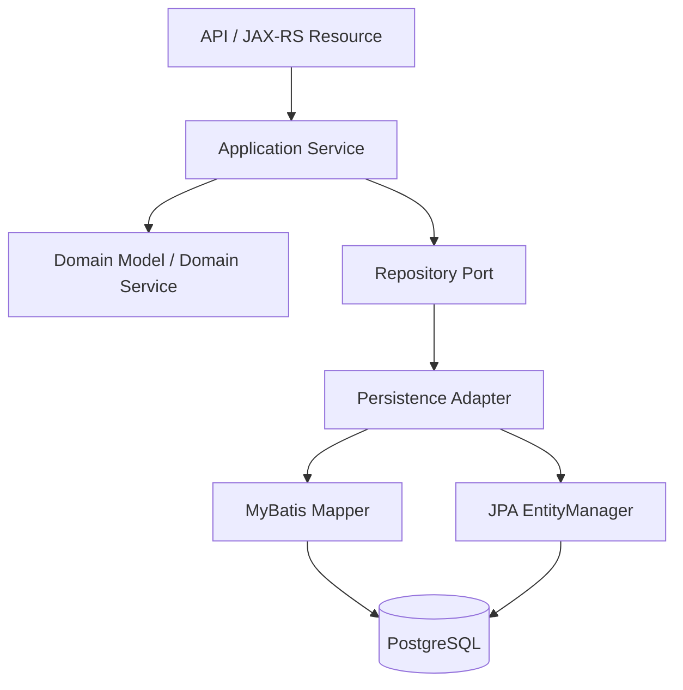

# Part 056 — Persistence Layer Code Organization

Persistence layer yang buruk jarang terlihat buruk pada hari pertama. Awalnya hanya ada satu repository, satu mapper, satu entity, dan beberapa query. Masalah muncul ketika sistem tumbuh: query tersebar, mapper duplikat, entity dipakai sebagai DTO API, migration tidak sinkron dengan model, TypeHandler tidak diketahui pemiliknya, test fixture sulit dicari, dan tidak ada yang tahu siapa pemilik table tertentu.

Code organization di persistence layer bukan soal estetika folder. Ini adalah mekanisme untuk menjaga:

- ownership,
- reviewability,
- boundary clarity,
- data correctness,
- migration safety,
- query visibility,
- testing discipline,
- dan production troubleshooting.

Dalam sistem enterprise Java/JAX-RS dengan PostgreSQL, MyBatis, JPA/Hibernate, migration, Kafka/RabbitMQ outbox, Redis cache, Kubernetes/cloud/on-prem deployment, struktur kode harus membantu engineer memahami satu pertanyaan penting:

> Perubahan data ini dimiliki oleh siapa, dieksekusi lewat path mana, diuji di mana, dan dampaknya ke schema/query/transaction apa?

---

## 1. Mental Model: Organize by Ownership, Not by Accident

Ada dua gaya umum organisasi persistence code:

1. Technical-layer-first.
2. Domain/module-first.

### 1.1 Technical-Layer-First

Contoh:

```text
com.company.app
  controller
  service
  repository
  mapper
  entity
  dto
```

Kelebihan:

- Mudah dipahami untuk aplikasi kecil.
- Semua entity ada di satu tempat.
- Semua mapper ada di satu tempat.

Kekurangan:

- Cepat menjadi dumping ground.
- Ownership domain kabur.
- Query untuk use case berbeda bercampur.
- Sulit melihat aggregate boundary.
- Risiko circular dependency meningkat.

### 1.2 Domain/Module-First

Contoh:

```text
com.company.quoteorder
  quote
    api
    application
    domain
    persistence
  order
    api
    application
    domain
    persistence
  catalog
    api
    application
    domain
    persistence
```

Kelebihan:

- Ownership lebih jelas.
- Query dekat dengan use case/domain.
- Review lebih fokus.
- Cocok untuk bounded context dan modular monolith/microservice.

Kekurangan:

- Butuh discipline dependency.
- Shared persistence utilities harus dirancang hati-hati.
- Bisa terjadi duplikasi jika boundary tidak jelas.

Untuk enterprise system, domain/module-first sering lebih scalable, tetapi harus disesuaikan dengan convention internal.

---

## 2. Recommended High-Level Structure

Struktur ideal bergantung pada repository internal. Jangan mengarang struktur CSG. Namun secara umum, struktur persistence yang sehat biasanya memisahkan beberapa concern:

```text
src/main/java
  com.company.product
    <module>
      api
      application
      domain
      persistence
        repository
        mapper
        entity
        projection
        command
        typehandler
        converter

src/main/resources
  db/migration
  mapper/<module>
  sql/<module>            optional, if SQL externalized

src/test/java
  com.company.product
    <module>
      persistence
        repository
        mapper
        entity
        fixture

src/test/resources
  fixtures
  db/testdata
```

Yang penting bukan nama foldernya, tetapi boundary-nya.

---

## 3. Repository Package

Repository adalah boundary yang dipanggil application/service layer. Repository tidak harus selalu memakai JPA. Repository bisa diimplementasikan dengan:

- MyBatis mapper,
- JPA EntityManager,
- Spring Data/Jakarta equivalent jika ada,
- JDBC langsung,
- kombinasi aman dengan ownership eksplisit.

### 3.1 Repository Interface

Repository interface sebaiknya berbicara dalam bahasa application/domain, bukan bahasa table mentah.

Contoh baik:

```java
interface QuoteRepository {
    Optional<Quote> findById(QuoteId id);
    void save(Quote quote);
    boolean existsActiveQuoteForCustomer(CustomerId customerId);
}
```

Contoh rawan:

```java
interface QuoteRepository {
    List<Map<String, Object>> runQuery(String sql);
    void updateColumn(String table, String column, Object value);
}
```

Repository harus menyembunyikan detail akses data, tetapi tidak boleh menyembunyikan transaction dan performance concern dari reviewer.

### 3.2 Command Repository vs Query Repository

Untuk sistem kompleks, pisahkan command dan query repository.

```text
QuoteCommandRepository
QuoteQueryRepository
QuoteReportRepository
```

Manfaat:

- Write path lebih mudah dikontrol.
- Read model/projection tidak mencemari aggregate lifecycle.
- MyBatis reporting query bisa dipisahkan dari JPA aggregate repository.
- Mixing MyBatis + JPA lebih aman karena ownership jelas.

### 3.3 Repository Anti-Patterns

Hindari:

- repository terlalu generic,
- repository memanggil repository lain tanpa alasan jelas,
- repository membuka transaction sendiri tanpa convention,
- repository mengembalikan JPA entity managed ke API layer,
- repository MyBatis mengupdate table yang dimiliki JPA aggregate tanpa ownership,
- repository menyembunyikan external call atau broker publish.

---

## 4. DAO Package

DAO sering digunakan sebagai istilah data access object yang lebih dekat ke table/query. Dalam beberapa codebase, DAO dan repository dipakai bergantian. Yang penting adalah convention internal.

Gunakan perbedaan konseptual ini:

| Konsep | Fokus |
|---|---|
| DAO | Data access teknis, table/query oriented |
| Repository | Domain/application collection abstraction |
| Mapper | MyBatis SQL mapping interface/XML |
| EntityManager access | JPA persistence context operations |

Jika codebase memakai DAO, pastikan:

- DAO tidak menjadi business service tersembunyi.
- DAO method tidak terlalu generic.
- DAO tidak melakukan transaction orchestration kompleks tanpa visibility.
- DAO tidak mencampur query unrelated.

---

## 5. MyBatis Mapper Package

Mapper package harus membuat SQL ownership mudah ditemukan.

Contoh:

```text
persistence/mapper
  QuoteMapper.java
  QuoteReadMapper.java
  QuoteCommandMapper.java
  QuoteReportMapper.java
```

Mapper XML:

```text
resources/mapper/quote
  QuoteMapper.xml
  QuoteReadMapper.xml
  QuoteCommandMapper.xml
  QuoteReportMapper.xml
```

### 5.1 Mapper Interface Naming

Nama mapper harus menunjukkan ownership dan intent.

Lebih baik:

```text
QuoteCommandMapper
QuoteQueryMapper
QuoteReportMapper
OutboxEventMapper
```

Kurang baik:

```text
CommonMapper
GenericMapper
UtilityMapper
DataMapper
```

### 5.2 Mapper XML Organization

Dalam XML, kelompokkan statement berdasarkan use case:

```xml
<!-- Quote lookup -->
<select id="findQuoteHeaderById" ... />

<!-- Quote item projection -->
<select id="findQuoteItemsByQuoteId" ... />

<!-- Quote state transition -->
<update id="markQuoteApproved" ... />
```

Jangan menaruh semua query lintas domain di satu XML besar.

### 5.3 ResultMap Ownership

ResultMap harus dekat dengan mapper yang memakainya. Jika ResultMap dipakai banyak mapper, tanyakan:

- Apakah projection ini benar-benar shared?
- Apakah ini tanda boundary salah?
- Apakah perubahan satu query akan merusak mapper lain?

ResultMap global sering berubah menjadi coupling tersembunyi.

---

## 6. JPA Entity Package

Entity package harus merepresentasikan persistence model secara jelas.

Contoh:

```text
persistence/entity
  QuoteEntity.java
  QuoteItemEntity.java
  OutboxEventEntity.java
```

Atau jika JPA entity adalah domain model:

```text
domain/model
  Quote.java
  QuoteItem.java
```

Keduanya bisa valid, tetapi konsekuensinya berbeda.

### 6.1 Entity as Persistence Model

Jika entity adalah persistence model:

- domain model terpisah,
- mapping diperlukan,
- API tidak boleh expose entity,
- persistence concern tidak bocor ke domain.

Cocok untuk sistem yang ingin domain model bersih dari ORM.

### 6.2 Entity as Domain Model

Jika entity juga domain model:

- mapping lebih sedikit,
- lifecycle JPA langsung melekat pada aggregate,
- harus disiplin dengan lazy loading, serialization, equals/hashCode, mutation, dan transaction boundary.

Cocok jika aggregate sederhana dan team memahami Hibernate dengan baik.

### 6.3 Entity Package Smells

Waspadai:

- entity berisi annotation API serialization,
- entity dipakai sebagai request/response DTO,
- entity punya business method yang memanggil repository,
- entity memiliki relationship terlalu luas,
- entity berubah menjadi god object,
- entity mapping tidak punya test.

---

## 7. DTO, Projection, Command, and Query Object Packages

Persistence layer butuh beberapa jenis object yang berbeda.

| Object | Fungsi |
|---|---|
| API DTO | Kontrak request/response REST |
| Command object | Input untuk write operation |
| Query object | Parameter pencarian/filtering |
| Projection DTO | Hasil read/query/report |
| Entity | Persistence model JPA |
| Domain model | Business concept/invariant |

Struktur yang jelas:

```text
api/dto
application/command
application/query
persistence/projection
persistence/entity
persistence/mapper
```

### 7.1 Projection DTO

Projection DTO cocok untuk:

- read-heavy endpoint,
- reporting query,
- list page,
- search result,
- query dengan join kompleks,
- MyBatis read model.

Jangan memaksa semua read lewat JPA entity jika hanya butuh 8 kolom dari 6 table.

### 7.2 Command Object

Command object cocok untuk write path:

```java
record ApproveQuoteCommand(
    QuoteId quoteId,
    UserId approvedBy,
    Instant approvedAt,
    long expectedVersion
) {}
```

Command object membuat validation dan audit metadata eksplisit.

### 7.3 Query Object

Query object membantu dynamic SQL tetap terkendali:

```java
record QuoteSearchQuery(
    TenantId tenantId,
    Optional<String> customerName,
    Optional<QuoteStatus> status,
    PageRequest page
) {}
```

Query object lebih aman daripada method mapper dengan 15 parameter.

---

## 8. TypeHandler and Converter Package

MyBatis `TypeHandler` dan JPA `AttributeConverter` sering terlihat kecil, tetapi bisa memengaruhi correctness seluruh sistem.

Contoh concern:

- enum mapping,
- JSONB serialization,
- PostgreSQL array,
- money/decimal,
- timestamp/timezone,
- encrypted field,
- domain identifier wrapper,
- value object mapping.

### 8.1 MyBatis TypeHandler

Struktur:

```text
persistence/typehandler
  JsonbTypeHandler.java
  QuoteStatusTypeHandler.java
  MoneyTypeHandler.java
```

Checklist:

- Apakah null handling benar?
- Apakah serialization deterministic?
- Apakah JSONB memakai type PostgreSQL benar?
- Apakah enum mapping tahan rename?
- Apakah TypeHandler punya integration test?

### 8.2 JPA AttributeConverter

Struktur:

```text
persistence/converter
  QuoteStatusConverter.java
  MoneyConverter.java
  JsonbConverter.java
```

Checklist:

- Apakah converter autoApply aman?
- Apakah converter berlaku ke semua entity atau hanya field tertentu?
- Apakah converter konsisten dengan MyBatis TypeHandler jika table sama dibaca oleh dua framework?
- Apakah converter menangani backward compatibility value lama?

### 8.3 Shared Mapping Risk

Jika MyBatis dan JPA mengakses column yang sama tetapi memakai TypeHandler/Converter berbeda, risiko muncul:

```text
Java enum A -> DB value X lewat JPA
DB value X -> Java enum B lewat MyBatis
```

Ini harus direview ketat.

---

## 9. Migration Directory Organization

Migration directory harus mudah dibaca sebagai sejarah perubahan schema.

Contoh:

```text
src/main/resources/db/migration
  V001__create_quote_tables.sql
  V002__create_order_tables.sql
  V003__add_quote_version.sql
  V004__create_outbox_table.sql
```

Atau Liquibase:

```text
src/main/resources/db/changelog
  db.changelog-master.yaml
  changes
    001-create-quote-tables.yaml
    002-add-quote-version.yaml
```

### 9.1 Naming Migration

Nama migration harus menjelaskan intent:

Baik:

```text
V042__add_quote_status_index.sql
V043__backfill_quote_effective_dates.sql
V044__add_quote_effective_dates_not_null_constraint.sql
```

Buruk:

```text
V042__changes.sql
V043__fix.sql
V044__update.sql
```

### 9.2 Migration Grouping

Hindari satu migration raksasa yang melakukan semuanya:

- create table,
- add column,
- backfill,
- add constraint,
- create index,
- update data,
- drop old column.

Untuk production, lebih aman menggunakan tahapan expand-contract.

### 9.3 SQL File Ownership

Jika ada SQL file terpisah untuk MyBatis/procedure/report, pastikan tidak bercampur dengan migration. Migration adalah sejarah schema. Query runtime adalah application code.

---

## 10. Test Fixture Organization

Test fixture harus mudah ditemukan dari test persistence.

Contoh:

```text
src/test/resources/fixtures/quote
  quote-basic.sql
  quote-with-items.sql
  quote-expired.sql
  quote-soft-deleted.sql
  quote-cross-tenant.sql
  quote-version-conflict.sql
```

Atau object builder:

```text
src/test/java/.../fixture
  QuoteFixture.java
  OrderFixture.java
  OutboxFixture.java
```

### 10.1 SQL Fixture vs Builder Fixture

| Fixture style | Cocok untuk |
|---|---|
| SQL fixture | Mapping/query/migration test |
| Java builder | Domain/application test |
| Hybrid | Integration test kompleks |

SQL fixture berguna karena membuat row shape eksplisit. Builder berguna karena menjaga readability di test Java.

### 10.2 Fixture Anti-Patterns

Hindari:

- fixture global terlalu besar,
- test saling bergantung pada fixture mutasi test lain,
- fixture berisi PII nyata,
- fixture tidak ikut berubah saat migration berubah,
- fixture hanya happy path,
- fixture tidak punya tenant/soft-delete/effective-date edge case.

---

## 11. SQL File Organization

Untuk MyBatis, SQL biasanya berada di mapper XML. Tetapi beberapa codebase menyimpan SQL terpisah untuk report/procedure/script.

Jika SQL externalized, pastikan:

```text
resources/sql/<module>/<use-case>.sql
```

Beri aturan:

- satu SQL file punya owner,
- query runtime bukan migration,
- query report tidak dicampur command update,
- parameter binding tetap aman,
- test membaca SQL yang sama dengan runtime jika memungkinkan.

SQL file harus reviewable. Query 300 baris tanpa komentar struktur akan sulit dipertahankan.

---

## 12. Internal Persistence Library

Enterprise system sering punya internal library untuk:

- datasource config,
- transaction abstraction,
- repository base class,
- mapper scanner,
- common TypeHandler,
- common AttributeConverter,
- audit context,
- tenant context,
- id generation,
- outbox utilities,
- testcontainers setup,
- migration test helper.

Internal library berguna, tetapi bisa menjadi hidden framework.

Checklist:

- Apakah behavior transaction jelas?
- Apakah exception mapping jelas?
- Apakah SQL logging/redaction jelas?
- Apakah tenant/audit context implisit?
- Apakah library version drift antar service?
- Apakah dokumentasi cukup?

Jangan memakai internal library secara buta. Pahami behavior-nya terutama di transaction, retry, audit, tenant, dan connection management.

---

## 13. Code Ownership Model

Persistence layer butuh ownership karena satu table bisa disentuh banyak use case.

Ownership minimal harus menjawab:

- Siapa pemilik table?
- Siapa pemilik migration?
- Siapa pemilik mapper/entity?
- Siapa reviewer wajib untuk query berat?
- Siapa reviewer wajib untuk migration irreversible?
- Siapa yang memutuskan index baru?
- Siapa yang approve stored procedure/trigger?
- Siapa yang menjaga dashboard/alert persistence?

### 13.1 Ownership per Aggregate/Table

Contoh ownership map:

```text
quote tables          -> Quote domain team/module
order tables          -> Order domain team/module
catalog reference     -> Catalog team/module
outbox_event          -> Platform/backend shared ownership
idempotency_key       -> Application/platform shared ownership
```

Nama aktual harus diverifikasi internal.

### 13.2 CODEOWNERS

Jika repository memakai CODEOWNERS, persistence area sebaiknya punya reviewer eksplisit:

```text
/db/migration/                 @backend-persistence-reviewers
/src/main/resources/mapper/    @backend-persistence-reviewers
/src/main/java/**/entity/      @backend-persistence-reviewers
```

Ini hanya contoh. Ikuti convention internal.

---

## 14. Dependency Direction

Persistence layer boleh bergantung pada infrastructure. Domain layer sebaiknya tidak bergantung langsung pada MyBatis/Hibernate kecuali desain memang entity-as-domain.

Generic direction:



Jika menggunakan hexagonal/ports-adapters, repository interface bisa berada di application/domain side, sedangkan implementation berada di persistence adapter.

Jika tidak menggunakan hexagonal, tetap jaga agar API layer tidak langsung memanggil mapper/entity manager.

---

## 15. Organizing MyBatis + JPA Coexistence

Jika MyBatis dan JPA hidup dalam sistem yang sama, struktur kode harus mencegah ambiguity.

### 15.1 Good Separation

```text
quote/persistence
  jpa
    QuoteEntity.java
    QuoteJpaRepository.java
  mybatis
    QuoteReadMapper.java
    QuoteReportMapper.java
    QuoteProjection.java
```

Atau:

```text
quote/command/persistence/jpa
quote/query/persistence/mybatis
```

Tujuannya jelas:

- JPA mengelola aggregate lifecycle/write model.
- MyBatis mengelola projection/report/read model.
- Tidak ada dua write model untuk table yang sama.

### 15.2 Dangerous Organization

```text
persistence
  QuoteEntity.java
  QuoteMapper.java
  QuoteRepository.java
```

Jika `QuoteEntity` dan `QuoteMapper` sama-sama bisa update `quote`, reviewer sulit tahu siapa pemilik state.

### 15.3 Naming to Expose Intent

Gunakan nama yang tidak ambigu:

```text
QuoteProjectionMapper
QuoteReportMapper
QuoteCommandJpaRepository
```

Hindari nama seperti:

```text
QuoteMapper
QuoteRepositoryImpl
QuoteDao
```

jika mereka menyembunyikan framework dan ownership.

---

## 16. Package Smells in Persistence Layer

Waspadai smell berikut:

### 16.1 `common` Menjadi Tempat Semua Hal

```text
common/mapper
common/entity
common/repository
```

Ini biasanya tanda ownership hilang.

### 16.2 `util` Berisi Query Logic

Utility class yang membangun SQL sering menghindari review mapper/query normal.

### 16.3 Entity Keluar dari Boundary

Jika JPA entity muncul di JAX-RS response, serialization dan lazy loading bug akan mengikuti.

### 16.4 Migration Tidak Dekat dengan Test

Jika migration berubah tetapi tidak ada migration test atau fixture update, schema drift mudah terjadi.

### 16.5 Mapper XML Terlalu Besar

Mapper XML ribuan baris dengan unrelated queries membuat review sulit dan bug duplicate filter meningkat.

### 16.6 Duplicate Model Tanpa Contract

DTO, projection, entity, domain model boleh mirip. Yang berbahaya adalah mirip tanpa ownership dan mapping test.

---

## 17. PR Review Checklist for Code Organization

Saat review PR persistence layer, tanyakan:

```text
[ ] Apakah file baru berada di module/package yang benar?
[ ] Apakah ownership table/query jelas?
[ ] Apakah repository boundary tetap bersih?
[ ] Apakah mapper/entity tidak bocor ke API layer?
[ ] Apakah command/query/projection model dipisahkan?
[ ] Apakah MyBatis dan JPA coexistence terlihat jelas dari struktur folder/nama?
[ ] Apakah migration diberi nama yang menjelaskan intent?
[ ] Apakah fixture/test ikut diperbarui?
[ ] Apakah TypeHandler/Converter punya test?
[ ] Apakah SQL file/query runtime tidak bercampur dengan migration?
[ ] Apakah package common/util tidak menjadi dumping ground?
[ ] Apakah CODEOWNERS/reviewer sesuai area risiko?
```

---

## 18. Internal Verification Checklist

Verifikasi di codebase dan team:

- Package structure resmi untuk API/application/domain/persistence.
- Perbedaan internal antara repository, DAO, mapper, adapter, gateway.
- Lokasi MyBatis mapper interface.
- Lokasi MyBatis mapper XML.
- Convention namespace mapper XML.
- Lokasi JPA entity.
- Apakah entity dipakai sebagai domain model atau persistence model.
- Lokasi DTO API, projection DTO, command object, query object.
- Lokasi TypeHandler MyBatis.
- Lokasi AttributeConverter JPA.
- Lokasi migration directory.
- Naming convention migration.
- Lokasi fixture dan seed data.
- Tool fixture yang dipakai di integration test.
- Apakah ada internal persistence library.
- Apakah ada package untuk audit/tenant context.
- Apakah ada outbox/inbox shared module.
- Apakah ada CODEOWNERS untuk persistence changes.
- Siapa reviewer wajib untuk migration/index/query berat.
- Apakah ada ADR untuk memilih MyBatis/JPA/JDBC.
- Apakah ada documented rule untuk mixing MyBatis dan JPA.

---

## 19. Practical Organization Template

Template konseptual untuk satu module:

```text
quote
  api
    QuoteResource.java
    dto
      QuoteResponse.java
      ApproveQuoteRequest.java

  application
    QuoteApplicationService.java
    command
      ApproveQuoteCommand.java
    query
      QuoteSearchQuery.java

  domain
    Quote.java
    QuoteStatus.java
    QuotePolicy.java

  persistence
    repository
      QuoteCommandRepository.java
      QuoteQueryRepository.java
      JpaQuoteCommandRepository.java
      MyBatisQuoteQueryRepository.java

    entity
      QuoteEntity.java
      QuoteItemEntity.java

    mapper
      QuoteProjectionMapper.java
      QuoteReportMapper.java

    projection
      QuoteListItemProjection.java
      QuoteDetailProjection.java

    typehandler
      QuoteStatusTypeHandler.java

    converter
      QuoteStatusConverter.java
```

Ini bukan struktur wajib. Ini template berpikir. Struktur aktual harus mengikuti repository dan architecture internal.

---

## 20. Key Takeaways

Persistence code organization adalah alat correctness dan governance. Struktur yang baik membuat hal penting terlihat:

- siapa pemilik data,
- path mana yang membaca/menulis table,
- framework apa yang dipakai,
- query mana yang performance-critical,
- migration mana yang mengubah schema,
- fixture mana yang membuktikan behavior,
- dan reviewer mana yang harus dilibatkan.

Untuk senior backend engineer, organisasi kode bukan preferensi gaya. Ini cara mencegah duplicate mapping, hidden write path, stale persistence model, migration mismatch, cache conflict, tenant leakage, dan production incident.

Jika struktur folder membuat reviewer sulit menjawab “siapa mengubah data apa lewat path mana?”, struktur itu belum cukup baik untuk enterprise persistence layer.
