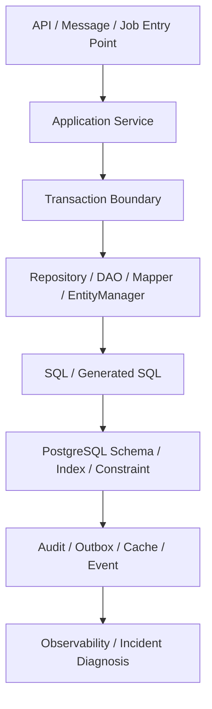

# Part 057 — PR Review and Architecture Decision Checklist

PR persistence layer tidak boleh direview seperti PR biasa. Perubahan kecil pada mapper, entity, migration, index, transaction annotation, atau cache invalidation dapat mengubah behavior production secara besar: data corrupt, stale read, deadlock, pool exhaustion, failed migration, cross-tenant leakage, N+1, slow endpoint, atau event outbox tidak terkirim.

Senior engineer tidak hanya bertanya:

> Apakah code ini compile?

Pertanyaan yang lebih tepat:

> Apakah perubahan ini menjaga correctness data, aman terhadap concurrency, kompatibel dengan deployment, observable saat gagal, dan bisa dipertanggungjawabkan secara architecture?

Part ini adalah checklist review dan architecture decision untuk perubahan persistence layer pada enterprise Java/JAX-RS system dengan PostgreSQL, JDBC, MyBatis, JPA/Hibernate, migration, microservices, Kafka/RabbitMQ, Redis, Kubernetes, cloud/on-prem, dan production operations.

---

## 1. Mental Model: Persistence PR Is a Production Data Change

Persistence PR hampir selalu menyentuh minimal satu dari area berikut:

- schema,
- query,
- mapping,
- transaction boundary,
- locking,
- validation,
- audit,
- security,
- cache,
- migration,
- deployment safety,
- observability,
- atau data ownership.

Karena itu, review tidak cukup hanya membaca Java method. Reviewer harus menelusuri jalur lengkap:



Jika reviewer tidak bisa menjawab “SQL apa yang akan berjalan, dalam transaksi mana, terhadap table/index/constraint apa, dan failure mode-nya apa”, review belum selesai.

---

## 2. First-Pass PR Triage

Sebelum masuk detail, klasifikasikan PR.

### 2.1 Low-Risk Persistence PR

Contoh:

- menambah query read-only sederhana dengan parameter binding aman,
- memperbaiki alias ResultMap tanpa mengubah behavior,
- menambah index non-breaking dengan migration aman,
- menambah test untuk mapper/entity existing.

Tetap perlu review, tetapi biasanya tidak perlu ADR.

### 2.2 Medium-Risk Persistence PR

Contoh:

- menambah repository baru,
- menambah entity baru,
- menambah mapper baru,
- mengubah transaction annotation,
- menambah dynamic SQL,
- mengubah pagination/sorting,
- menambah bulk update,
- menambah cache read path.

Perlu checklist lengkap dan bukti test/integration.

### 2.3 High-Risk Persistence PR

Contoh:

- migration destructive,
- rename/drop column/table,
- mengubah isolation/locking,
- mencampur MyBatis dan JPA pada aggregate/table sama,
- mengubah outbox/inbox/idempotency,
- mengubah tenant filter,
- mengubah audit/soft delete,
- query baru pada table besar tanpa evidence plan,
- bulk operation pada data production.

PR seperti ini sebaiknya memiliki ADR, rollout plan, rollback/roll-forward plan, observability plan, dan diskusi lintas tim jika berdampak besar.

---

## 3. Repository / DAO Boundary Review

Repository/DAO harus menjadi boundary yang jelas antara application logic dan persistence detail.

### Review Questions

- Apakah service layer memanggil repository, atau langsung mapper/EntityManager?
- Apakah repository method bernama sesuai use case, bukan hanya nama SQL teknis?
- Apakah command path dan query path dipisahkan bila kompleks?
- Apakah repository menyembunyikan SQL terlalu jauh sampai failure sulit didiagnosis?
- Apakah repository mengembalikan domain object, persistence entity, DTO projection, atau raw map?
- Apakah return type mencerminkan cardinality: single, optional, list, page, stream?
- Apakah method read-only benar-benar tidak memicu flush/write tersembunyi?
- Apakah repository mengandung business rule yang seharusnya berada di domain/application service?

### Red Flags

- `findAll()` pada table besar tanpa limit.
- Repository method generic tetapi dipakai untuk banyak use case berbeda.
- Repository mengembalikan JPA entity langsung ke API layer.
- Mapper dipanggil dari controller/resource.
- Transaction logic tersebar di beberapa repository.
- Satu repository mengelola aggregate yang tidak satu boundary.

### Good Review Comment Example

```text
Method ini terlihat seperti query repository untuk screen/search, bukan aggregate repository.
Lebih aman kalau return DTO projection dan nama method mengikuti use case pencarian,
bukan expose entity lifecycle JPA ke application layer.
```

---

## 4. MyBatis Mapper Review

MyBatis memberi SQL visibility, tetapi juga memberi kebebasan untuk membuat SQL yang terlalu dinamis, tidak aman, atau sulit diuji.

### Mapper Interface

Checklist:

- Method name jelas dan specific.
- Parameter object dipakai untuk query kompleks.
- Tidak ada terlalu banyak primitive parameter.
- Return type eksplisit.
- Naming konsisten dengan XML statement id.
- Tidak mencampur command dan reporting query secara liar.

### Mapper XML

Checklist:

- Namespace sesuai interface.
- `resultMap` jelas dan reusable hanya jika benar-benar sama shape-nya.
- Column alias digunakan untuk join.
- Tidak ada `${}` kecuali benar-benar whitelisted.
- Dynamic `ORDER BY` memakai whitelist.
- Dynamic filter tetap readable.
- `foreach` untuk `IN` clause mempertimbangkan size limit.
- Query kompleks memiliki test branch.
- SQL PostgreSQL-specific ditandai dan diuji dengan PostgreSQL asli/Testcontainers.

### ResultMap Review

Periksa:

- id mapping benar.
- nullable column ditangani.
- enum mapping jelas.
- JSONB/array memakai TypeHandler bila perlu.
- nested select tidak menyebabkan N+1.
- nested result tidak menduplikasi object secara salah.
- discriminator tidak menyembunyikan domain branching yang penting.

### Dynamic SQL Red Flags

- Banyak `<if>` saling bergantung tanpa test kombinasi.
- Sort column berasal dari request tanpa whitelist.
- `${keyword}` dipakai untuk search.
- Query berubah shape ekstrem berdasarkan parameter.
- Pagination tanpa stable ordering.
- Optional filter membuat full table scan accidental.

---

## 5. JPA Entity and Hibernate Review

Review JPA tidak cukup melihat annotation. Reviewer harus membayangkan entity lifecycle, persistence context, flush, dirty checking, relationship loading, dan generated SQL.

### Entity Mapping Checklist

- `@Table` dan `@Column` cocok dengan schema.
- `@Id` dan generation strategy cocok dengan PostgreSQL sequence/identity.
- `@Version` ada untuk aggregate yang perlu optimistic locking.
- Enum storage tidak fragile jika enum berubah.
- `AttributeConverter` diuji.
- Timestamp/audit field konsisten.
- Soft delete behavior eksplisit.
- Entity tidak membawa API serialization concern yang berbahaya.

### Relationship Checklist

- `FetchType.EAGER` tidak dipakai sembarangan.
- Cascade hanya dipakai pada lifecycle ownership yang benar.
- `orphanRemoval` sesuai invariant domain.
- Bidirectional relationship punya owner jelas.
- `ManyToMany` langsung dipertanyakan.
- Collection besar tidak di-load tanpa batas.
- Fetch join/entity graph dipakai untuk read path yang butuh relasi.

### Hibernate Behavior Checklist

- Apakah dirty checking dapat menyebabkan update tak terduga?
- Apakah query akan memicu flush before query?
- Apakah `merge()` aman, atau justru overwrite stale detached state?
- Apakah persistence context dapat membesar dalam loop/batch?
- Apakah lazy loading terjadi di luar transaction?
- Apakah second-level/query cache aman untuk data ini?

### Red Flags

- Entity dipakai sebagai response DTO.
- `CascadeType.ALL` pada relationship yang bukan lifecycle ownership.
- `@OneToMany` besar di-load untuk list endpoint.
- Bulk JPQL update tanpa clear persistence context.
- Native query mengembalikan entity tetapi tidak sinkron dengan cache/context.
- Setter entity dipanggil di banyak layer tanpa command intention jelas.

---

## 6. Transaction Review

Transaction boundary adalah unit correctness. Review harus memastikan semua write, read-after-write, outbox, audit, locking, dan retry berada pada boundary yang benar.

### Checklist

- Entry point transaction jelas: service method, job handler, message consumer, command handler.
- Read-only transaction digunakan dengan tepat.
- Tidak ada external HTTP call panjang di dalam transaction kecuali benar-benar justified.
- Rollback rule jelas untuk checked/unchecked exception.
- Timeout transaction sesuai risiko lock dan endpoint SLA.
- Propagation tidak dipilih secara accidental.
- `REQUIRES_NEW` dipakai dengan alasan eksplisit.
- `NESTED`/savepoint didukung oleh stack yang digunakan.
- Self-invocation tidak membatalkan transaction annotation jika framework proxy-based.
- Outbox write berada dalam transaction yang sama dengan state change.

### Propagation Review Questions

- Jika inner method gagal, apakah outer transaction harus rollback?
- Jika audit gagal, apakah business transaction harus rollback?
- Jika outbox write gagal, apakah state change boleh commit?
- Jika retry terjadi, apakah operation idempotent?
- Jika MyBatis dan JPA dipakai bersama, apakah flush/clear ordering jelas?

### Red Flags

- Transaction annotation di repository dan service secara tidak konsisten.
- Satu request membuka beberapa transaksi tanpa alasan.
- `REQUIRES_NEW` dipakai untuk “memperbaiki” rollback tanpa memahami consequence.
- Bulk operation dalam satu transaction sangat besar.
- Transaction mencakup network call, file I/O, atau long computation.

---

## 7. Query and Index Review

Setiap query production harus direview bersama table size, selectivity, index, join strategy, dan pagination.

### Query Checklist

- SQL yang akan berjalan terlihat.
- Parameter binding aman.
- Filter utama memakai indexed/selective column bila volume besar.
- Join punya cardinality yang dipahami.
- Pagination punya stable ordering.
- Count query cost dipahami.
- Query tidak mengambil column besar yang tidak diperlukan.
- Projection digunakan untuk read model/list screen.
- Generated SQL JPA sudah dicek, bukan diasumsikan.
- Query PostgreSQL-specific memiliki test dan owner.

### Index Checklist

- Index baru sesuai query predicate/order/join.
- Tidak menambah index hanya berdasarkan intuisi.
- Mempertimbangkan write overhead.
- Mempertimbangkan composite index order.
- Mempertimbangkan partial index bila cocok.
- Mempertimbangkan expression index untuk JSONB/function expression.
- Index creation aman untuk production table besar.
- Drop index memiliki evidence tidak dipakai.

### Evidence yang Ideal

Untuk query kritikal, PR sebaiknya menyertakan:

```text
- SQL final / generated SQL
- EXPLAIN atau EXPLAIN ANALYZE dari data representatif
- estimasi cardinality
- index yang digunakan
- before/after latency jika tuning
- risiko lock jika migration/index besar
```

---

## 8. Migration Review

Migration adalah production deployment artifact. Review migration harus mempertimbangkan versi aplikasi lama dan baru yang berjalan bersamaan.

### Checklist

- Migration version naming benar.
- Migration idempotency sesuai tool internal.
- Expand-contract dilakukan untuk breaking change.
- Add column punya default/nullability strategy aman.
- Rename/drop column tidak dilakukan dalam satu step dengan code change yang masih butuh compatibility.
- Backfill dipisah bila data besar.
- Constraint addition mempertimbangkan existing dirty data.
- Index creation pada table besar menggunakan strategi aman sesuai PostgreSQL/version/internal policy.
- Entity/MyBatis mapper sudah sinkron dengan schema baru.
- Roll-forward plan tersedia.
- Rollback policy jelas, tetapi tidak mengandalkan rollback destructive untuk data production.

### Red Flags

- Drop column bersamaan dengan deploy code pertama.
- Add NOT NULL tanpa backfill aman.
- Long-running migration dijalankan saat app startup.
- Data migration besar tanpa chunking.
- Migration mengubah function/trigger tanpa test.
- Migration tidak diuji dari schema kosong dan schema existing.

---

## 9. MyBatis + JPA Mixing Review

Ini salah satu area review paling penting. Mixing tidak selalu salah, tetapi harus memiliki ownership dan ordering yang eksplisit.

### Safe-ish Patterns

- JPA mengelola aggregate lifecycle, MyBatis hanya projection/read model.
- MyBatis dipakai untuk reporting query kompleks read-only.
- MyBatis memakai table/read model terpisah.
- JPA dan MyBatis berada pada bounded context berbeda.
- Shared transaction manager jelas.
- Flush sebelum MyBatis read yang bergantung pada perubahan JPA.
- Clear/refresh setelah MyBatis write yang mengubah data yang mungkin ada di persistence context.

### Anti-Pattern Checklist

- Satu table punya dua write model.
- JPA entity dimodifikasi lalu MyBatis update table sama tanpa flush ordering.
- MyBatis update table sama ketika entity managed masih stale.
- Hibernate L2 cache aktif untuk entity yang juga diubah MyBatis.
- Audit/version/soft delete/tenant filter diimplementasikan berbeda.
- Optimistic locking dilakukan JPA dan MyBatis dengan aturan berbeda.
- Mapper query membaca data yang seharusnya terkena JPA filter/security filter.

### Review Questions

- Framework mana owner write path?
- Framework mana owner read path?
- Apakah keduanya menyentuh table/aggregate sama?
- Apakah ada persistence context stale risk?
- Apakah cache invalidation jelas?
- Apakah tests membuktikan sequence mixed access?
- Apakah alasan mixing didokumentasikan?

---

## 10. Locking and Concurrency Review

Concurrency bug jarang tertangkap oleh happy-path test. PR write path harus direview terhadap race condition.

### Checklist

- Lost update dicegah dengan version/lock/constraint.
- Unique constraint race ditangani sebagai expected conflict.
- Optimistic lock punya user/domain error mapping.
- Pessimistic lock punya timeout.
- Deadlock/serialization failure punya retry policy jika operation idempotent.
- `SELECT FOR UPDATE` scope minimal.
- Lock order konsisten untuk multi-table update.
- Batch job tidak mengunci range terlalu lama.
- `SKIP LOCKED` hanya dipakai untuk queue/worker pattern yang cocok.

### Red Flags

- Read-check-write tanpa lock/constraint.
- “Cek dulu lalu insert” tanpa unique constraint.
- Retry otomatis pada operation non-idempotent.
- Lock diambil terlalu awal dan dilepas terlalu akhir.
- Transaction panjang sambil menunggu external service.

---

## 11. Batch, Bulk, and Streaming Review

Batch dan streaming harus direview terhadap memory, transaction size, connection hold time, cancellation, dan retry.

### Batch Checklist

- Chunk size jelas.
- Batch size sesuai driver/framework.
- Transaction size dibatasi.
- Persistence context di-clear untuk JPA batch.
- Bulk JPQL update diikuti clear/refresh bila perlu.
- Retry aman dan idempotent.
- Progress/reconciliation tersedia.
- Failure partial dipahami.

### Streaming Checklist

- Fetch size/cursor behavior jelas.
- Transaction tetap terbuka selama streaming jika dibutuhkan.
- Connection held open dipertimbangkan terhadap pool.
- Timeout/cancellation ditangani.
- Resource ditutup saat client disconnect.
- HTTP streaming tidak membuat pool starvation.

---

## 12. Security and Privacy Review

Persistence PR dapat menjadi security incident meski fitur terlihat internal.

### Security Checklist

- Tidak ada SQL injection path.
- Dynamic sort/filter memakai whitelist.
- DB user privilege minimal.
- Migration user dipisah jika internal policy mengharuskan.
- Tenant condition tidak opsional accidental.
- Row-level security dipahami jika digunakan.
- Sensitive column tidak ter-log.
- Error response tidak membocorkan SQL/schema.
- Query read-only tidak membuka data lintas tenant/role.

### Privacy Checklist

- PII field dikenali.
- Masking/redaction diterapkan di log/event/export.
- Test fixture tidak memakai data production mentah.
- Retention/deletion requirement tidak dilanggar.
- Audit access tersedia jika data sensitif dibaca/diubah.
- Backup/export implications dipahami.

---

## 13. Observability and Operational Readiness Review

Perubahan persistence harus bisa di-debug saat gagal.

### Checklist

- Query duration observable.
- Error rate/SQLState visible.
- Connection pool metrics tersedia.
- Slow query dapat dikorelasikan ke endpoint/job.
- Transaction duration dapat dipantau.
- Lock wait/deadlock terlihat.
- Migration failure terlihat di CI/CD atau deployment logs.
- Business operation memiliki correlation id.
- Logs tidak membocorkan PII.
- Alert threshold tidak terlalu bising atau terlalu lambat.

### Reviewer Questions

- Jika query ini lambat di production, dashboard mana yang akan menunjukkan?
- Jika migration gagal, siapa yang tahu dan bagaimana recover?
- Jika connection pool exhausted, apakah log cukup menjelaskan caller?
- Jika event outbox stuck, apakah ada metric backlog?
- Jika deadlock terjadi, apakah SQLState dipetakan dan diretry dengan aman?

---

## 14. ADR for Persistence Decisions

Tidak semua PR butuh ADR. Namun ADR diperlukan saat keputusan mengubah arah architecture atau menambah risiko jangka panjang.

### ADR Dibutuhkan Jika

- memilih MyBatis vs JPA vs JDBC untuk module besar,
- mencampur MyBatis dan JPA pada bounded context sama,
- mengubah schema ownership,
- memperkenalkan shared database access,
- menambah cache persistence-level,
- mengubah transaction propagation/isolation,
- menambah stored procedure/trigger untuk business logic,
- memperkenalkan outbox/inbox/idempotency framework,
- melakukan migration destructive,
- mengubah multi-tenancy/security persistence model.

### ADR Minimal Structure

```md
# ADR: <Decision Title>

## Context
Masalah, constraint, current behavior, production risk.

## Decision
Pilihan yang diambil.

## Alternatives Considered
JDBC / MyBatis / JPA / database logic / cache / migration alternatives.

## Consequences
Correctness, performance, operability, security, migration, testing impact.

## Rollout Plan
Deployment sequence, migration ordering, compatibility window.

## Verification Plan
Tests, EXPLAIN, dashboards, alerts, rollback/roll-forward.

## Internal Verification Checklist
Hal yang harus divalidasi terhadap codebase, DBA, SRE, platform, senior engineer.
```

---

## 15. Final PR Review Checklist

Gunakan checklist ini sebagai gate ringkas sebelum approve.

### Boundary

- [ ] Entry point dan transaction boundary jelas.
- [ ] Repository/DAO/mapper/entity responsibility jelas.
- [ ] API DTO, domain model, persistence model tidak bocor sembarangan.

### SQL and Mapping

- [ ] SQL final/generate SQL dipahami.
- [ ] Mapping column-object benar.
- [ ] Dynamic SQL aman.
- [ ] Pagination/sorting/filtering stabil.

### Transaction and Concurrency

- [ ] Commit/rollback semantics benar.
- [ ] Propagation intentional.
- [ ] Race condition dipertimbangkan.
- [ ] Locking/retry/idempotency aman.

### Migration and Schema

- [ ] Migration backward-compatible.
- [ ] Entity/mapper/schema sinkron.
- [ ] Backfill/constraint/index aman.
- [ ] Roll-forward plan jelas.

### MyBatis/JPA Mixing

- [ ] Ownership framework jelas.
- [ ] Tidak ada dua write model untuk table/aggregate sama tanpa alasan kuat.
- [ ] Flush/clear/cache risk ditangani.

### Security, Privacy, Observability

- [ ] SQL injection dicegah.
- [ ] Tenant/security/privacy tidak bocor.
- [ ] Metrics/logs/traces cukup untuk debugging.
- [ ] PII redaction aman.

### Production Readiness

- [ ] Performance evidence tersedia untuk query kritikal.
- [ ] Test coverage sesuai risiko.
- [ ] Deployment/migration/recovery plan jelas.
- [ ] Internal stakeholders yang relevan sudah diverifikasi.

---

## 16. Internal Verification Checklist

Gunakan ini untuk konteks CSG/team tanpa mengarang detail internal.

- Cek PR template persistence jika ada.
- Cek repository/DAO/mapper/entity package convention.
- Cek transaction framework dan annotation convention.
- Cek MyBatis/JPA coexistence policy.
- Cek migration tool dan deployment sequence.
- Cek schema ownership dan approval DBA.
- Cek slow query dashboard dan PostgreSQL metrics.
- Cek connection pool dashboard.
- Cek incident notes terkait deadlock, migration failure, stale cache, N+1, pool exhaustion.
- Cek security/privacy review process untuk PII dan tenant isolation.
- Cek ADR repository atau architecture decision log.
- Diskusi dengan senior backend engineer, DBA, platform/SRE, dan security/privacy owner jika perubahan high-risk.

---

## 17. Senior Engineer Review Prompts

Pertanyaan yang sering menghasilkan review berkualitas:

1. SQL apa yang benar-benar akan berjalan?
2. Dalam transaction mana SQL itu berjalan?
3. Apa yang terjadi jika dua request menjalankan path ini bersamaan?
4. Apa constraint database yang menjaga invariant ini?
5. Apakah migration aman untuk rolling deployment?
6. Apakah query ini tetap aman pada data 10x lebih besar?
7. Bagaimana kita tahu jika perubahan ini lambat di production?
8. Apakah data tenant/PII dapat bocor ke log, cache, atau response?
9. Apakah MyBatis/JPA/cache melihat state yang sama?
10. Jika PR ini menyebabkan incident, evidence apa yang tersedia untuk debugging?

---

## 18. Summary

PR persistence layer adalah review correctness, bukan hanya review style. Senior engineer harus melihat hubungan antara code Java, SQL, mapping, schema, transaction, lock, migration, observability, dan deployment topology.

Approve hanya ketika perubahan sudah jelas dalam lima dimensi:

1. **Correctness** — data invariant aman.
2. **Concurrency** — race condition dipertimbangkan.
3. **Compatibility** — migration dan rollout aman.
4. **Operability** — failure bisa dideteksi dan didebug.
5. **Governance** — ownership dan decision rationale jelas.

Persistence PR yang baik bukan hanya “jalan di test”. Ia harus bisa bertahan di production, di bawah concurrency, data besar, partial failure, retry, deployment rolling, dan investigasi incident.
