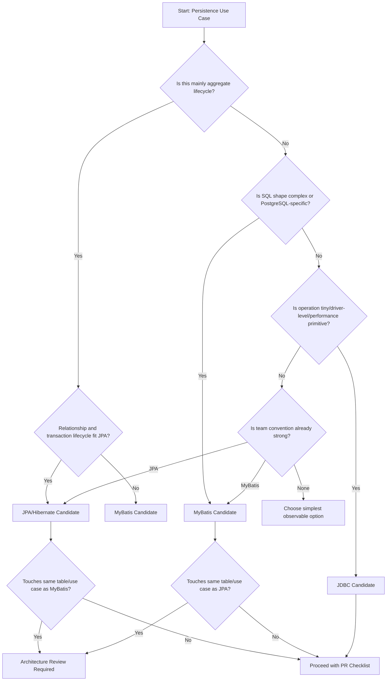

# Part 058 — Decision Matrix: MyBatis vs JPA vs JDBC

Pertanyaan “pakai JDBC, MyBatis, atau JPA?” tidak boleh dijawab dengan preferensi pribadi. Dalam enterprise Java/JAX-RS system, pilihan persistence technology menentukan:

- siapa pemilik SQL,
- bagaimana transaction boundary bekerja,
- seberapa terlihat query di production,
- seberapa mudah mapping berubah,
- bagaimana concurrency dikontrol,
- bagaimana migration direview,
- bagaimana performance didiagnosis,
- dan seberapa besar risiko stale state/cache/hidden query.

Part ini adalah decision matrix praktis untuk memilih JDBC langsung, MyBatis, atau JPA/Hibernate berdasarkan use case nyata: CRUD, reporting, batch, stored procedure, JSONB, dynamic search, relationship-heavy domain, legacy schema, audit-heavy path, event/outbox path, dan read model.

---

## 1. Mental Model Singkat

### JDBC

JDBC adalah primitive layer.

Gunakan ketika butuh:

- kontrol paling eksplisit,
- operasi kecil dan sangat spesifik,
- integrasi driver-level,
- streaming/cursor sangat terkontrol,
- atau framework overhead tidak diinginkan.

Trade-off: banyak boilerplate, mapping manual, resource handling harus disiplin.

### MyBatis

MyBatis adalah SQL-first mapper.

Gunakan ketika SQL adalah asset utama:

- query kompleks,
- reporting/read model,
- PostgreSQL-specific feature,
- dynamic search,
- stored procedure/function,
- legacy schema,
- atau performance path yang butuh SQL visibility.

Trade-off: tidak ada persistence context/dirty checking; mapping dan update lifecycle harus eksplisit.

### JPA/Hibernate

JPA/Hibernate adalah entity-first ORM dengan persistence context dan unit-of-work.

Gunakan ketika model cocok dengan aggregate/entity lifecycle:

- CRUD aggregate,
- relationship domain yang wajar,
- transactional write-behind,
- optimistic locking via `@Version`,
- domain lifecycle yang ingin dikelola sebagai object graph.

Trade-off: hidden SQL, flush surprise, N+1, dirty checking cost, persistence context stale risk.

---

## 2. Default Bias yang Sehat

Tidak ada default universal. Tetapi untuk senior review, gunakan bias ini:

```text
Jika SQL shape kompleks dan menjadi bagian penting dari behavior → cenderung MyBatis.
Jika aggregate lifecycle object-oriented dan write path sederhana → cenderung JPA.
Jika operation sangat kecil, driver-level, atau framework terlalu berat → pertimbangkan JDBC.
Jika path production-critical dan sulit di-debug → pilih opsi dengan visibility terbaik.
Jika MyBatis dan JPA sama-sama ingin menulis table yang sama → berhenti dan review architecture.
```

Keputusan persistence yang buruk biasanya berasal dari mismatch mental model:

- memakai JPA untuk reporting SQL kompleks,
- memakai MyBatis untuk object graph lifecycle yang seharusnya aggregate repository,
- memakai JDBC untuk semua hal sampai codebase penuh boilerplate,
- mencampur MyBatis dan JPA pada use case sama tanpa ownership,
- menambahkan abstraction repository yang menyembunyikan semua trade-off.

---

## 3. Decision Matrix Utama

| Scenario | JDBC | MyBatis | JPA/Hibernate | Default Recommendation |
|---|---:|---:|---:|---|
| Simple CRUD aggregate | Medium | Medium | High | JPA jika entity lifecycle cocok |
| Complex reporting query | Medium | High | Low-Medium | MyBatis |
| Dynamic search/filter/sort | Medium | High | Medium | MyBatis atau Criteria jika query sederhana |
| Batch import | High | High | Medium | JDBC/MyBatis untuk kontrol; JPA jika aggregate lifecycle penting |
| Batch update besar | High | High | Low-Medium | MyBatis/JDBC; hati-hati stale context JPA |
| Stored procedure/function | High | High | Medium | MyBatis/JDBC |
| JSONB-heavy query | Medium | High | Low-Medium | MyBatis |
| Relationship-heavy domain | Low-Medium | Medium | High | JPA jika aggregate boundary sehat |
| Legacy schema kompleks | Medium | High | Low-Medium | MyBatis |
| High-performance write path | High | High | Medium | MyBatis/JDBC, kecuali JPA terbukti cukup |
| Audit-heavy aggregate | Medium | Medium | High | JPA jika audit lifecycle entity konsisten |
| Outbox path | Medium | High | High | Pilih sesuai owner transaction; jangan split atomicity |
| Read model/projection | Medium | High | Medium | MyBatis/DTO projection |
| Streaming large result | High | High | Medium | JDBC/MyBatis |
| Multi-tenant filter-heavy query | Medium | High | Medium | MyBatis jika filter harus eksplisit; JPA jika framework tenant model matang |
| PostgreSQL-specific lock queue | High | High | Low | MyBatis/JDBC |

Matrix ini bukan aturan absolut. Ia adalah starting point untuk review.

---

## 4. Scenario 1: Simple CRUD Aggregate

Contoh:

- create quote header,
- update customer profile kecil,
- manage reference entity sederhana,
- read/update aggregate dengan lifecycle jelas.

### JPA Cocok Jika

- table mapping langsung ke entity,
- aggregate boundary jelas,
- relationship tidak terlalu besar,
- optimistic locking dibutuhkan,
- write path mengikuti entity lifecycle,
- generated SQL mudah dipantau,
- team memahami flush/dirty checking.

### MyBatis Cocok Jika

- schema tidak cocok dengan object model,
- query harus sangat eksplisit,
- CRUD bukan benar-benar CRUD tetapi SQL custom,
- entity lifecycle tidak dibutuhkan,
- update harus mengatur kolom tertentu secara eksplisit.

### JDBC Cocok Jika

- hanya satu operasi kecil,
- tidak ada kebutuhan mapper framework,
- path sangat rendah overhead,
- atau dipakai dalam library/platform utility.

### Review Decision

Jika CRUD aggregate sederhana dan JPA sudah convention internal, JPA biasanya masuk akal. Tetapi jangan memaksa JPA jika domain-nya sebenarnya read/query-heavy atau schema-nya legacy/denormalized.

---

## 5. Scenario 2: Complex Reporting Query

Contoh:

- dashboard quote/order status,
- report cross-table dengan banyak join,
- projection untuk UI grid,
- aggregate metric,
- search dengan conditional filters.

### MyBatis Bias

MyBatis biasanya lebih tepat karena:

- SQL terlihat langsung,
- projection DTO natural,
- join dan aggregation mudah dikontrol,
- PostgreSQL function/window/CTE bisa dipakai eksplisit,
- EXPLAIN lebih mudah dikaitkan dengan source code,
- tidak perlu memuat entity graph.

### JPA Risk

JPA bisa dipakai dengan DTO projection/native query, tetapi hati-hati:

- JPQL kompleks sulit dibaca,
- Criteria API bisa menjadi unreadable,
- native query di JPA sering kehilangan manfaat ORM,
- entity loading dapat menyebabkan N+1,
- pagination/count query bisa tidak optimal.

### JDBC Risk

JDBC memberi kontrol, tetapi mapping manual panjang. Cocok bila query sangat spesifik atau performance-critical dan mapper overhead tidak diinginkan.

### Review Decision

Untuk reporting/read model kompleks, default ke MyBatis kecuali ada alasan kuat memakai JPA projection yang sederhana.

---

## 6. Scenario 3: Dynamic Search

Contoh:

- search quote berdasarkan status, customer, date range, catalog, order state,
- optional filters,
- dynamic sort,
- cursor pagination,
- advanced text search.

### MyBatis Cocok Jika

- filter combination banyak,
- SQL perlu CTE/window/full-text/JSONB,
- sorting harus dikontrol whitelist,
- performance plan harus terlihat,
- query shape berubah signifikan.

### JPA Cocok Jika

- filter sederhana,
- query mengikuti entity model,
- Criteria/specification internal sudah matang,
- projection tidak kompleks,
- team punya convention untuk query count dan fetch strategy.

### JDBC Cocok Jika

- query builder custom diperlukan,
- framework mapper tidak menambah nilai,
- path sangat performance-sensitive.

### Review Decision

Dynamic search yang melebar sering lebih aman dengan MyBatis karena SQL visibility lebih baik. Namun pastikan dynamic SQL tidak berubah menjadi XML spaghetti.

---

## 7. Scenario 4: Batch Import and Bulk Update

Batch path sering gagal bukan karena syntax, tetapi karena memory, transaction size, lock, timeout, dan retry.

### JDBC Cocok Jika

- butuh batching driver-level terkontrol,
- operasi sangat besar,
- mapping sederhana,
- perlu streaming input/output,
- perlu minim overhead.

### MyBatis Cocok Jika

- butuh SQL explicit,
- batch executor cukup,
- mapping masih reusable,
- PostgreSQL `COPY`, `UPSERT`, atau `RETURNING` perlu diorkestrasi sekitar mapper.

### JPA Cocok Jika

- batch tetap harus menghormati entity lifecycle,
- audit/listener/domain invariant penting,
- volume tidak terlalu besar atau chunking + clear dilakukan disiplin.

### JPA Risk

- persistence context memory growth,
- dirty checking cost,
- flush frequency tidak terkendali,
- bulk JPQL membuat managed entity stale,
- cascade memperluas write tanpa disadari.

### Review Decision

Untuk batch besar, bias ke JDBC/MyBatis. Gunakan JPA hanya bila lifecycle entity lebih penting daripada raw throughput dan sudah ada chunking/flush/clear discipline.

---

## 8. Scenario 5: Stored Procedure, Function, Trigger, and DB Logic

### JDBC Cocok Jika

- butuh `CallableStatement` langsung,
- parameter kompleks,
- driver behavior penting,
- integration point kecil dan spesifik.

### MyBatis Cocok Jika

- procedure/function call ingin berada dalam mapper convention,
- result mapping tetap berguna,
- SQL/function call perlu terlihat di XML.

### JPA Cocok Jika

- stored procedure sederhana,
- repository JPA sudah menjadi boundary module,
- result mapping tidak rumit.

### Review Decision

Untuk database logic eksplisit, MyBatis/JDBC biasanya lebih natural. JPA stored procedure query bisa dipakai, tetapi jangan memaksa jika manfaat ORM tidak dipakai.

---

## 9. Scenario 6: JSONB-Heavy Query

PostgreSQL JSONB sering dipakai untuk flexible attributes, catalog metadata, configuration, atau semi-structured payload.

### MyBatis Bias

MyBatis unggul karena:

- operator JSONB terlihat,
- expression index dapat dicocokkan dengan query,
- TypeHandler bisa dibuat eksplisit,
- query plan mudah dianalisis,
- dynamic JSONB filter lebih mudah dikontrol.

### JPA Risk

JPA bisa mapping JSONB via converter/custom type, tetapi query JSONB kompleks sering menjadi native query. Jika sudah native query kompleks, manfaat JPA berkurang.

### JDBC

Cocok untuk path kecil atau utility, tetapi mapping JSON manual bisa repetitif.

### Review Decision

Untuk JSONB-heavy query, default ke MyBatis kecuali JSONB hanya disimpan/dibaca sebagai value tanpa query kompleks.

---

## 10. Scenario 7: Relationship-Heavy Domain Model

Contoh:

- aggregate dengan parent-child lifecycle,
- entity versioning,
- update graph kecil,
- relationship ownership jelas.

### JPA Cocok Jika

- relationship mencerminkan aggregate boundary,
- cascade benar-benar lifecycle ownership,
- optimistic locking natural,
- domain logic bekerja pada object graph,
- query count dikontrol dengan fetch strategy.

### MyBatis Cocok Jika

- relationship hanya untuk read projection,
- graph besar dan tidak ingin managed context,
- nested result lebih predictable daripada lazy loading,
- update harus explicit per table.

### JDBC

Biasanya terlalu manual untuk relationship-heavy domain kecuali path sangat spesifik.

### Review Decision

JPA cocok untuk relationship-heavy domain hanya jika aggregate boundary sehat. Jika relationship sebenarnya hanya kebutuhan query/reporting, MyBatis projection lebih aman.

---

## 11. Scenario 8: Legacy Schema

Legacy schema sering memiliki:

- naming tidak konsisten,
- composite key,
- denormalized table,
- trigger/function side effects,
- nullable ambigu,
- weak constraints,
- view/materialized view,
- stored procedure.

### MyBatis Bias

MyBatis cocok karena tidak memaksa schema menjadi object graph ideal. Mapper dapat mengekspresikan SQL sesuai realita schema.

### JPA Risk

JPA dapat bekerja, tetapi mapping bisa menjadi rumit:

- composite key verbose,
- relationship tidak natural,
- generated SQL tidak optimal,
- cascade tidak cocok,
- dirty checking pada schema dengan trigger side effect bisa membingungkan.

### JDBC

Cocok untuk integration kecil atau legacy call spesifik, tetapi kurang scalable jika banyak query.

### Review Decision

Untuk legacy schema kompleks, MyBatis biasanya paling defensible.

---

## 12. Scenario 9: High-Performance Write Path

Contoh:

- order state transition berfrekuensi tinggi,
- inventory/reservation update,
- queue worker claiming rows,
- idempotency insert,
- outbox append,
- bulk status update.

### MyBatis/JDBC Bias

Keduanya memberi:

- SQL explicit,
- update column minimal,
- lock clause eksplisit,
- `RETURNING`, `UPSERT`, `SKIP LOCKED`, `NOWAIT`,
- version check manual,
- predictable round trip.

### JPA Cocok Jika

- throughput masih aman,
- entity lifecycle penting,
- optimistic locking via `@Version` cukup,
- generated SQL sudah diverifikasi,
- flush behavior predictable.

### Review Decision

Untuk write path paling critical, pilih yang paling mudah diprediksi dan diobservasi. Seringnya MyBatis/JDBC lebih aman, tetapi JPA bisa valid jika domain lifecycle dan convention matang.

---

## 13. Scenario 10: Audit-Heavy Path

Audit-heavy path butuh konsistensi metadata, traceability, version, change history, dan compliance evidence.

### JPA Cocok Jika

- entity listener/auditing framework sudah standard,
- lifecycle entity konsisten,
- `@Version` digunakan,
- audit fields diisi otomatis,
- perubahan terjadi lewat aggregate repository.

### MyBatis Cocok Jika

- write path explicit dan audit columns di-set manual/utility,
- audit table/outbox diinsert dalam transaction sama,
- query/update SQL harus terlihat.

### JDBC Cocok Jika

- audit append sederhana dan sangat low-level,
- digunakan sebagai utility transaction synchronization.

### Review Decision

Audit-heavy tidak otomatis berarti JPA. Yang penting adalah konsistensi audit across all write paths. Jika MyBatis dan JPA sama-sama menulis table yang sama, audit consistency harus menjadi review gate.

---

## 14. Scenario 11: Outbox Path

Outbox adalah correctness pattern. Pilihan framework harus mengikuti transaction atomicity.

### JPA Approach

Cocok jika:

- aggregate state ditulis via JPA,
- outbox entity ditulis dalam persistence context yang sama,
- flush ordering dipahami,
- event payload dibuat dari domain event yang jelas.

### MyBatis Approach

Cocok jika:

- command path SQL-first,
- state change dan outbox insert eksplisit dalam mapper/repository,
- UPSERT/RETURNING/JSONB payload perlu kontrol SQL.

### JDBC Approach

Cocok jika:

- outbox library/platform primitive,
- append sangat sederhana,
- ingin minim dependency.

### Review Decision

Jangan split state change dan outbox ke transaction berbeda kecuali design memang eventual dengan reconciliation. Framework pilihan harus menjaga atomicity.

---

## 15. Scenario 12: Read Model / Projection

Read model biasanya bukan aggregate lifecycle. Ia adalah optimized shape untuk UI/API/report.

### MyBatis Bias

- DTO projection natural.
- SQL join/aggregation jelas.
- Tidak memuat entity graph.
- Pagination/sorting/filtering eksplisit.
- Cocok untuk materialized/read table.

### JPA Alternative

- DTO projection JPQL bisa cukup untuk query sederhana.
- Entity graph/fetch join bisa dipakai bila read model dekat dengan aggregate.

### Review Decision

Jika read model berbeda dari write aggregate, MyBatis projection sering lebih jelas dan aman.

---

## 16. Anti-Decision Patterns

Hindari alasan seperti ini:

```text
Pakai JPA karena semua orang pakai JPA.
Pakai MyBatis karena generated SQL JPA menakutkan.
Pakai JDBC karena paling cepat.
Pakai keduanya agar fleksibel.
```

Alasan tersebut terlalu lemah. Keputusan yang baik menyebutkan:

- use case,
- query shape,
- schema shape,
- transaction boundary,
- concurrency model,
- performance target,
- operational debugging,
- migration impact,
- team convention,
- test strategy,
- dan failure mode.

---

## 17. Scoring Model Sederhana

Gunakan scoring untuk diskusi design. Beri nilai 1-5.

| Dimension | JDBC | MyBatis | JPA/Hibernate |
|---|---:|---:|---:|
| SQL visibility | 5 | 5 | 2-3 |
| Boilerplate reduction | 1 | 4 | 5 |
| Entity lifecycle support | 1 | 2 | 5 |
| Complex SQL support | 5 | 5 | 2-3 |
| Relationship object graph | 1 | 3 | 5 |
| PostgreSQL-specific feature | 5 | 5 | 2-3 |
| Debuggability of executed SQL | 5 | 5 | 3 |
| Risk of hidden query | 1 | 2 | 5 |
| Manual mapping burden | 5 | 3 | 1-2 |
| Batch control | 5 | 4 | 2-3 |
| Stale persistence context risk | 1 | 1 | 5 |
| Learning/discipline requirement | 4 | 4 | 5 |

Interpretasi:

- Nilai tinggi bukan selalu baik; itu menunjukkan intensitas concern.
- JPA memiliki nilai tinggi untuk lifecycle support, tetapi juga tinggi untuk hidden query/stale context risk.
- JDBC punya SQL control tinggi, tetapi boilerplate burden tinggi.
- MyBatis sering berada di tengah: SQL control tinggi, mapping burden medium.

---

## 18. Practical Decision Flow



---

## 19. Framework Selection by Failure Mode

Sometimes the best decision is based on the failure mode you most want to avoid.

### Avoid Hidden SQL

Prefer MyBatis/JDBC.

### Avoid Mapping Boilerplate

Prefer JPA or MyBatis over JDBC.

### Avoid Stale Persistence Context

Prefer MyBatis/JDBC, or use JPA with strict context discipline.

### Avoid SQL Duplication

Prefer JPA for lifecycle CRUD, or centralize MyBatis mapper ownership.

### Avoid N+1

Prefer projection-first query; MyBatis DTO projection or JPA fetch strategy with query count tests.

### Avoid Cross-Tenant Leakage

Prefer explicit tenant filter discipline, or mature JPA tenant filter/RLS model. Review is mandatory either way.

### Avoid Migration Mismatch

Choose framework with clear schema/mapping test strategy. MyBatis needs SQL tests; JPA needs entity mapping/migration compatibility tests.

---

## 20. MyBatis + JPA Coexistence Decision

Coexistence is acceptable when:

- boundaries are separate,
- write ownership is clear,
- read/write model separation is intentional,
- transaction manager is shared or clearly coordinated,
- cache risk is controlled,
- tests prove mixed behavior,
- ADR documents the reason.

Coexistence is dangerous when:

- same table has two write models,
- JPA entity state is bypassed by MyBatis,
- MyBatis updates data already managed by EntityManager,
- second-level cache hides external updates,
- audit/soft delete/tenant/version logic differs,
- flush/clear ordering is not explicit.

Decision rule:

```text
If both frameworks need the same table and at least one writes, require architecture review.
If both frameworks write the same aggregate, assume anti-pattern until proven otherwise.
If MyBatis only reads projection after explicit JPA flush, it may be acceptable.
If MyBatis writes behind JPA persistence context, require clear/refresh/cache strategy.
```

---

## 21. PR Decision Template

Gunakan template ini saat mengusulkan persistence approach.

```md
## Persistence Decision

### Use Case
<What operation/read/write/report/batch/job is being implemented?>

### Data Ownership
<Which aggregate/table/schema/service owns this data?>

### Selected Technology
<JDBC / MyBatis / JPA/Hibernate>

### Why This Choice
<Query complexity, entity lifecycle, performance, schema, transaction, debugging reason.>

### Alternatives Rejected
<Why not the other options?>

### SQL / Mapping Visibility
<Where can reviewer see final SQL or generated SQL?>

### Transaction Boundary
<Which method/job/message handler owns the transaction?>

### Concurrency and Locking
<Optimistic/pessimistic/constraint/retry strategy.>

### Migration Impact
<Schema/index/data migration required?>

### Testing Evidence
<Unit/integration/Testcontainers/migration/query/concurrency tests.>

### Observability
<Metrics/logs/dashboard/slow query visibility.>

### Internal Verification Checklist
<CSG/team-specific items to confirm.>
```

---

## 22. Internal Verification Checklist

Karena detail internal CSG/team tidak tersedia, validasi berikut harus dilakukan di codebase dan dengan tim terkait.

- Cek framework persistence yang digunakan per module/service.
- Cek apakah MyBatis dan JPA dipakai dalam service yang sama.
- Cek table/aggregate yang memiliki mapper dan entity sekaligus.
- Cek transaction manager dan propagation convention.
- Cek datasource/connection pool shared across frameworks.
- Cek Hibernate second-level/query cache policy.
- Cek MyBatis local/second-level cache policy.
- Cek migration tool dan approval process.
- Cek query performance dashboard/slow query log.
- Cek schema ownership dan DBA review process.
- Cek historical incidents: stale data, deadlock, failed migration, N+1, pool exhaustion, duplicate event.
- Cek PR/ADR contoh yang dianggap baik oleh senior engineer.
- Cek apakah ada internal guideline untuk JDBC vs MyBatis vs JPA.

---

## 23. Final Technology Selection Checklist

Sebelum memilih, jawab:

- [ ] Apakah use case ini command, query, report, batch, stream, atau integration?
- [ ] Apakah data ini aggregate lifecycle atau projection/read model?
- [ ] Apakah SQL shape sederhana atau kompleks?
- [ ] Apakah PostgreSQL-specific feature dibutuhkan?
- [ ] Apakah relationship object graph benar-benar dibutuhkan?
- [ ] Apakah performance target membutuhkan SQL control?
- [ ] Apakah transaction boundary jelas?
- [ ] Apakah concurrency/race condition sudah dipikirkan?
- [ ] Apakah migration akan aman untuk rolling deployment?
- [ ] Apakah test bisa membuktikan mapping/query/transaction behavior?
- [ ] Apakah production debugging mudah?
- [ ] Apakah ada risiko MyBatis/JPA mixing pada table/use case sama?
- [ ] Apakah pilihan ini konsisten dengan convention internal atau punya ADR jika berbeda?

---

## 24. Summary

JDBC, MyBatis, dan JPA/Hibernate bukan level kemajuan yang saling menggantikan. Mereka adalah alat dengan mental model berbeda:

- **JDBC**: primitive control.
- **MyBatis**: SQL-first explicit mapping.
- **JPA/Hibernate**: entity-first unit-of-work and persistence context.

Keputusan yang matang selalu dimulai dari use case, bukan framework. Untuk senior backend engineer, tujuan akhirnya bukan “memilih teknologi favorit”, tetapi memilih persistence model yang paling aman terhadap correctness, concurrency, performance, migration, debugging, dan production operations.

Jika ragu, pilih opsi yang membuat behavior paling terlihat dan paling mudah diverifikasi. Dalam production persistence layer, visibility sering lebih berharga daripada elegance.
