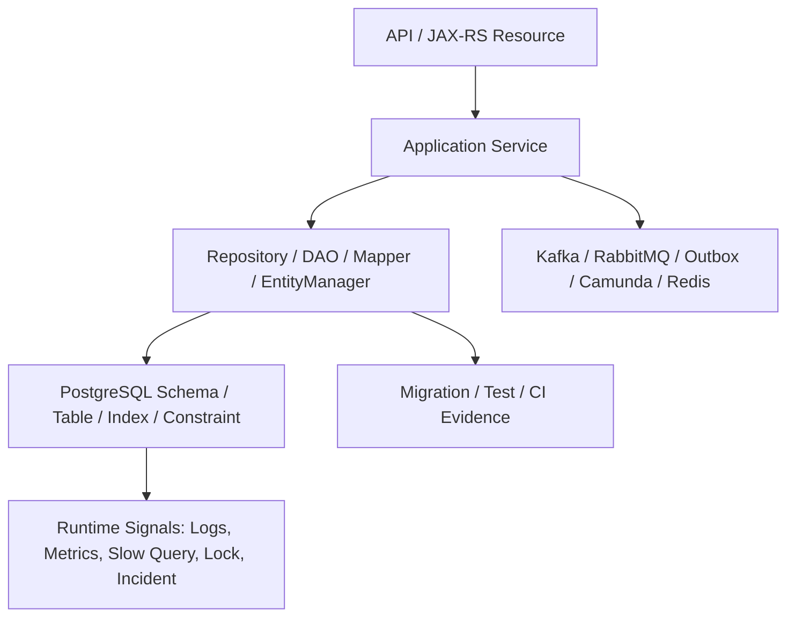

# 30/60/90-Day Persistence Onboarding Plan

## Core idea

Persistence onboarding untuk senior backend engineer bukan sekadar memahami table, repository, mapper, atau entity satu per satu.
Yang perlu dibangun adalah **runtime mental model**:

- data apa yang menjadi source of truth;
- service mana yang memiliki schema atau table;
- write path mana yang transaction-critical;
- query mana yang menjadi bottleneck;
- migration mana yang berisiko saat rolling deployment;
- framework mana yang dipakai untuk use case tertentu;
- invariant mana yang dijaga aplikasi dan mana yang wajib dijaga database;
- failure mode apa yang pernah terjadi di production;
- siapa yang harus dilibatkan saat persistence change berisiko tinggi.

Dalam enterprise Java/JAX-RS system, persistence layer berada di persimpangan antara application service, repository/DAO, MyBatis mapper, JPA/Hibernate entity, PostgreSQL, migration tool, Kafka/RabbitMQ outbox, Redis cache, Camunda workflow state, Kubernetes deployment, cloud/on-prem network, dan operational dashboard.

Onboarding yang baik harus membuat Anda mampu membaca persistence layer sebagai **sistem yang hidup**, bukan hanya folder `repository`, `mapper`, atau `entity`.

---

## Why a 30/60/90 plan matters

Senior engineer biasanya tidak punya kemewahan untuk belajar codebase secara pasif terlalu lama.
Dalam beberapa minggu pertama, Anda mungkin sudah diminta mereview PR, memperbaiki bug query, memahami migration, atau menilai desain write path baru.

Tanpa struktur onboarding, ada tiga risiko besar:

1. **Local understanding tanpa production understanding**  
   Anda paham method repository, tetapi tidak tahu query-nya lambat di production.

2. **Framework understanding tanpa domain ownership**  
   Anda paham MyBatis/JPA, tetapi tidak tahu table mana yang authoritative dan mana yang read model.

3. **Code review confidence palsu**  
   PR terlihat rapi secara Java, tetapi sebenarnya merusak transaction boundary, audit consistency, tenant isolation, atau deployment compatibility.

Rencana 30/60/90 membantu mengurutkan pembelajaran dari **mapping code**, ke **runtime behavior**, lalu ke **architecture influence**.

---

## Onboarding principle

Gunakan prinsip berikut selama 90 hari:

> Jangan hanya bertanya “code ini melakukan apa?”  
> Tanyakan juga “data apa yang berubah, dalam transaction apa, dengan constraint apa, bisa race dengan siapa, terlihat di observability mana, dan bagaimana rollback-nya kalau salah?”

Persistence onboarding harus selalu menghubungkan lima layer:



Kalau satu layer tidak bisa Anda jelaskan, berarti pemahaman persistence path tersebut belum lengkap.

---

# First 30 Days: Map the Persistence Surface

## Goal

Pada 30 hari pertama, fokus utama adalah **orientasi dan inventory**.
Anda belum perlu langsung mengubah architecture.
Anda harus tahu bentuk persistence layer yang sedang Anda masuki:

- schema utama apa saja;
- table penting apa saja;
- repository/DAO/mapper/entity utama berada di mana;
- framework apa yang dipakai di area mana;
- transaction convention seperti apa;
- migration tool dan workflow-nya seperti apa;
- test persistence yang sudah ada seperti apa;
- dashboard dan log apa yang tersedia.

Targetnya bukan menjadi ahli semua domain dalam 30 hari.
Targetnya adalah membangun **peta navigasi**.

---

## Week 1: Find the persistence entry points

Mulai dari request lifecycle.
Cari beberapa endpoint penting lalu ikuti alurnya dari JAX-RS resource sampai database.

Contoh path yang harus ditelusuri:

```text
JAX-RS Resource
  -> Application Service
    -> Domain/Application Logic
      -> Repository / DAO / Mapper / EntityManager
        -> SQL / JPQL / Native Query
          -> PostgreSQL Table / Index / Constraint
```

Yang dicari bukan hanya method call.
Yang dicari adalah **ownership dan boundary**.

Pertanyaan yang harus dijawab:

- Apakah endpoint command dan query dipisahkan?
- Apakah repository mengembalikan entity, domain object, DTO, atau projection?
- Apakah service memanggil mapper langsung?
- Apakah EntityManager tersembunyi di repository?
- Apakah MyBatis XML mudah ditemukan dari mapper interface?
- Apakah entity JPA merepresentasikan domain aggregate atau hanya persistence record?
- Apakah transaction dimulai di service, repository, atau framework interceptor?
- Apakah ada outbox/inbox/idempotency table di write path?

### Output week 1

Buat catatan internal pribadi seperti:

```text
Persistence entry-point map

Use case: Create/Update Quote
- Resource: <internal verification>
- Service: <internal verification>
- Transaction boundary: <internal verification>
- Repository/DAO/Mapper: <internal verification>
- Framework: MyBatis/JPA/JDBC <internal verification>
- Tables touched: <internal verification>
- Events emitted: <internal verification>
- Cache touched: <internal verification>
- Migration files related: <internal verification>
- Main tests: <internal verification>
- Dashboard/logs: <internal verification>
```

Jangan menebak detail internal CSG.
Isi bagian tersebut dari codebase, dokumentasi, PR historis, atau diskusi senior engineer.

---

## Week 2: Inventory framework usage

Buat inventory area yang memakai:

- JDBC langsung;
- MyBatis;
- JPA/Jakarta Persistence;
- Hibernate-specific API/annotation;
- stored procedure/function;
- Redis cache;
- outbox/inbox table;
- migration scripts;
- Testcontainers/integration tests.

Inventory ini penting karena satu service enterprise sering tidak murni satu teknologi.
Ada area yang SQL-first karena reporting atau PostgreSQL-specific query.
Ada area yang entity-first karena aggregate lifecycle.
Ada area legacy yang memakai JDBC langsung.
Ada area yang memakai MyBatis dan JPA bersama.

### Framework inventory template

```text
Persistence framework inventory

Area / Module: <internal verification>
Primary use case: command/query/reporting/batch/outbox <internal verification>
Framework used: JDBC/MyBatis/JPA/Hibernate <internal verification>
Reason known: <internal verification>
Tables owned: <internal verification>
Tables read-only: <internal verification>
Transaction manager: <internal verification>
Cache involved: <internal verification>
Migration ownership: <internal verification>
Known risk: <internal verification>
```

### What to look for

#### JDBC direct usage

Cari apakah JDBC dipakai untuk:

- batch import/export;
- stored procedure/function call;
- low-level performance path;
- legacy integration;
- migration helper;
- custom streaming large result.

Review apakah penggunaan JDBC langsung aman:

- PreparedStatement, bukan string concatenation;
- resource closing benar;
- autocommit dipahami;
- timeout disetel;
- SQLException/SQLState dimapping;
- fetch size/batch size dipakai dengan sadar.

#### MyBatis usage

Cari:

- mapper interface;
- mapper XML;
- ResultMap kompleks;
- dynamic SQL;
- TypeHandler;
- JSONB query;
- nested select;
- mapper yang menulis table sama dengan JPA entity.

Review apakah MyBatis dipakai sebagai SQL-first tool atau berubah menjadi hidden domain logic di XML.

#### JPA/Hibernate usage

Cari:

- entity;
- repository;
- EntityManager;
- JPQL/native query;
- relationship mapping;
- cascade/orphan removal;
- FetchType.EAGER;
- flush/merge usage;
- Hibernate-specific annotation;
- second-level cache.

Review apakah JPA dipakai untuk lifecycle aggregate atau hanya sebagai generated-SQL wrapper untuk semua hal.

---

## Week 3: Understand schema, migration, and data ownership

Persistence layer tidak bisa dipahami tanpa schema.
Minimal pahami:

- table inti;
- primary key dan natural/business key;
- foreign key;
- unique constraint;
- check constraint;
- indexes;
- version column;
- audit columns;
- soft delete columns;
- tenant columns;
- temporal/effective dating columns;
- outbox/inbox/idempotency tables;
- read model tables;
- historical/audit tables.

### Schema reading checklist

Untuk setiap table penting, jawab:

```text
Table: <internal verification>
Purpose: <internal verification>
Owner service/module: <internal verification>
Written by: JDBC/MyBatis/JPA/procedure/trigger <internal verification>
Read by: <internal verification>
Primary key: <internal verification>
Business key: <internal verification>
Important constraints: <internal verification>
Important indexes: <internal verification>
Audit columns: <internal verification>
Version/locking column: <internal verification>
Soft delete/tenant/temporal columns: <internal verification>
Migration history: <internal verification>
Known production incidents: <internal verification>
```

### Migration workflow questions

Cari jawaban untuk:

- Apakah menggunakan Liquibase, Flyway, custom scripts, atau mekanisme lain?
- Apakah migration dijalankan oleh aplikasi, CI/CD job, Helm hook, Kubernetes Job, atau pipeline terpisah?
- Apakah migration user berbeda dari runtime application user?
- Apakah migration wajib backward-compatible?
- Apakah ada expand-contract convention?
- Bagaimana rollback/roll-forward dilakukan?
- Apakah index besar dibuat secara non-blocking/concurrent?
- Apakah backfill dilakukan dalam migration, job terpisah, atau manual runbook?
- Apakah migration dites dengan real PostgreSQL?

---

## Week 4: Learn transaction conventions

Pada akhir 30 hari pertama, Anda harus tahu bagaimana transaksi dikendalikan.

Cari:

- annotation/config transaction;
- transaction manager;
- default propagation;
- default isolation;
- timeout;
- rollback rules;
- self-invocation risk;
- transaction boundary pada command service;
- transaction boundary pada event outbox;
- read-only transaction convention;
- external call di dalam transaction;
- Redis/Kafka/RabbitMQ/Camunda interaction di sekitar transaction.

### Transaction map template

```text
Use case: <internal verification>
Transaction starts at: <internal verification>
Transaction ends at: <internal verification>
Propagation: <internal verification>
Isolation: <internal verification>
Timeout: <internal verification>
Rollback rules: <internal verification>
Repositories/mappers/entities touched: <internal verification>
External systems called inside transaction: <internal verification>
Events/outbox written: <internal verification>
Cache updated/invalidated: <internal verification>
Known risk: <internal verification>
```

### Red flags in first 30 days

Catat, jangan langsung refactor tanpa konteks:

- service method terlalu panjang dalam satu transaction;
- external HTTP call di dalam database transaction;
- mapper update table yang juga dikelola JPA entity;
- JPA entity dimodifikasi lalu MyBatis read dilakukan tanpa flush awareness;
- MyBatis write dilakukan saat JPA entity untuk row yang sama masih managed;
- migration menambah constraint tanpa backfill;
- dynamic SQL memakai `${}` untuk user-controlled field;
- endpoint list memakai offset besar tanpa stable ordering;
- entity relationship memakai eager loading default;
- cache invalidation tidak jelas.

---

## 30-Day deliverables

Pada akhir 30 hari, hasil ideal Anda adalah:

1. **Persistence map** untuk beberapa use case utama.
2. **Framework inventory** JDBC/MyBatis/JPA/Hibernate.
3. **Schema/table ownership notes** untuk table kritikal.
4. **Migration workflow summary**.
5. **Transaction convention notes**.
6. **Initial risk register** berisi smell yang perlu diverifikasi, bukan tuduhan.
7. **List pertanyaan terbuka** untuk senior engineer, DBA, platform/SRE, dan backend team.

Contoh risk register:

```text
Persistence risk register

Risk: MyBatis and JPA may both access <table>
Evidence: <file/method/internal verification>
Potential impact: stale state / duplicate audit / cache inconsistency
Confidence: low/medium/high
Next step: ask owner / inspect tests / review transaction boundary
```

---

# Days 31-60: Understand Runtime Behaviour and Failure Modes

## Goal

Pada fase 31-60 hari, fokus berpindah dari inventory ke **runtime behaviour**.
Anda harus mulai memahami bagaimana persistence layer bekerja saat:

- data besar;
- concurrent request;
- slow query;
- lock contention;
- failed migration;
- stale cache;
- duplicate request;
- event publication retry;
- rolling deployment;
- integration test vs production mismatch.

Di fase ini, Anda mulai membaca production evidence.

---

## Study query performance

Pilih beberapa endpoint atau job yang dianggap penting.
Untuk masing-masing, cari:

- SQL yang dieksekusi;
- jumlah query per request;
- query paling mahal;
- parameter cardinality;
- index yang dipakai;
- EXPLAIN/EXPLAIN ANALYZE;
- slow query log;
- dashboard latency;
- relation dengan pool usage;
- relation dengan lock wait.

### Query performance investigation template

```text
Use case: <internal verification>
Endpoint/job: <internal verification>
Framework: MyBatis/JPA/JDBC <internal verification>
Main SQL/JPQL/mapper: <internal verification>
Average latency: <internal verification>
P95/P99 latency: <internal verification>
Query count: <internal verification>
Slow query evidence: <internal verification>
EXPLAIN summary: <internal verification>
Index used/missing: <internal verification>
Potential tuning: <internal verification>
```

### MyBatis-specific checks

- Apakah dynamic SQL menghasilkan banyak variasi query plan?
- Apakah nested select menyebabkan N+1?
- Apakah query projection terlalu lebar?
- Apakah count query mahal?
- Apakah ORDER BY dinamis aman dan indexed?
- Apakah JSONB query memakai index yang tepat?

### JPA/Hibernate-specific checks

- Apakah entity graph/fetch join digunakan dengan sadar?
- Apakah lazy loading terjadi di loop?
- Apakah persistence context terlalu besar?
- Apakah flush terjadi lebih sering dari yang diduga?
- Apakah bulk update membuat persistence context stale?
- Apakah generated SQL terlihat dan bisa dijelaskan?

---

## Study locking and concurrency

Cari write path yang memodifikasi data penting.
Pahami bagaimana path tersebut mencegah race condition.

Pertanyaan utama:

- Apakah menggunakan optimistic locking?
- Apakah ada version column?
- Apakah MyBatis update memakai `WHERE version = ?`?
- Apakah JPA entity memakai `@Version`?
- Apakah ada `SELECT FOR UPDATE`?
- Apakah ada `SKIP LOCKED` untuk worker/job?
- Apakah serialization failure/deadlock diretry?
- Apakah retry aman secara idempotent?
- Apakah unique constraint dipakai untuk mencegah duplicate business key?

### Concurrency path template

```text
Use case: <internal verification>
Shared resource: <row/table/business key/internal verification>
Concurrent actors: <internal verification>
Locking strategy: optimistic/pessimistic/unique constraint/business lock <internal verification>
Retry strategy: <internal verification>
Idempotency strategy: <internal verification>
Tests: <internal verification>
Known incidents: <internal verification>
```

### Failure modes to test mentally

- Dua request update quote yang sama.
- Dua worker mengambil job yang sama.
- Dua command membuat order dengan business key sama.
- Event diproses ulang setelah consumer restart.
- Timeout terjadi setelah database commit tetapi sebelum response diterima client.
- Migration menambah unique constraint saat duplicate historical data masih ada.

---

## Study MyBatis + JPA coexistence

Fase 31-60 adalah waktu yang tepat untuk memahami apakah MyBatis dan JPA dipakai berdampingan.

Cari jawaban konkret:

- Apakah ada table yang punya JPA entity dan MyBatis mapper?
- Apakah table tersebut read-only untuk salah satu framework?
- Apakah keduanya menulis row yang sama?
- Apakah keduanya dipakai dalam transaction yang sama?
- Apakah ada explicit `flush()` sebelum MyBatis read?
- Apakah ada `clear()`/`refresh()` setelah MyBatis write?
- Apakah second-level cache dinyalakan?
- Apakah audit/tenant/soft delete/version handling konsisten?

### Coexistence classification

Klasifikasikan setiap mixing case:

```text
Case: <internal verification>
Pattern:
  - Safe: separate bounded context
  - Safe: JPA write + MyBatis projection read, no same transaction stale risk
  - Risky: same table read/write with explicit flush/clear discipline
  - Dangerous: two write models for same aggregate
  - Anti-pattern: mapper bypasses entity lifecycle/audit/version/tenant filter
Evidence: <internal verification>
Recommended action: document / test / refactor / escalate <internal verification>
```

---

## Study migration safety

Pilih beberapa migration terbaru dan telusuri dampaknya ke code.

Untuk setiap migration, cek:

- Apakah entity berubah?
- Apakah mapper XML berubah?
- Apakah query native berubah?
- Apakah migration backward-compatible?
- Apakah ada deployment window dengan app lama dan schema baru?
- Apakah ada backfill?
- Apakah constraint/index ditambahkan aman?
- Apakah rollback mungkin atau harus roll-forward?
- Apakah migration diuji di CI?

### Migration safety template

```text
Migration: <internal verification>
Type: schema/data/index/constraint/function/trigger <internal verification>
Related code change: <internal verification>
Backward compatible: yes/no/unclear <internal verification>
Requires backfill: yes/no <internal verification>
Lock risk: low/medium/high <internal verification>
Rollback/roll-forward plan: <internal verification>
Test evidence: <internal verification>
```

---

## Study observability and incident notes

Persistence layer sering paling cepat dipahami lewat incident history.
Cari incident terkait:

- slow query;
- missing index;
- connection pool exhaustion;
- deadlock;
- lock wait;
- failed migration;
- stale cache;
- data mismatch;
- duplicate event;
- cross-tenant data leakage;
- schema/entity mismatch;
- mapper result mismatch;
- outbox publication issue.

Untuk setiap incident, buat ringkasan:

```text
Incident: <internal verification>
Symptom: <internal verification>
Root cause: <internal verification>
Persistence layer involved: SQL / index / transaction / migration / cache / ORM / mapper <internal verification>
Detection signal: <internal verification>
Fix: <internal verification>
Prevention: <internal verification>
Checklist update needed: <internal verification>
```

---

## 60-Day deliverables

Pada akhir 60 hari, Anda seharusnya punya:

1. **Query performance notes** untuk use case penting.
2. **Concurrency and locking map** untuk write path kritikal.
3. **MyBatis/JPA coexistence classification**.
4. **Migration safety observations**.
5. **Incident learning summary**.
6. **Testing gap list** untuk mapper/entity/transaction/migration/concurrency.
7. **Observability gap list** untuk dashboard/log/alert.

---

# Days 61-90: Improve Standards, Review Quality, and Production Readiness

## Goal

Pada fase 61-90 hari, Anda mulai bergerak dari memahami menjadi **mempengaruhi kualitas engineering**.

Fokusnya:

- memperbaiki review checklist;
- mengurangi risiko query/migration/transaction;
- memperjelas ownership;
- menambah test yang bernilai tinggi;
- mendokumentasikan decision framework;
- memimpin diskusi persistence dengan evidence;
- membantu team mencegah incident.

---

## Improve PR review quality

Buat checklist PR persistence yang ringkas tetapi tajam.
Checklist tidak perlu terlalu panjang di PR template, tetapi reviewer harus punya mental model lengkap.

### Minimum PR questions

Untuk setiap PR persistence, tanyakan:

1. Data apa yang berubah?
2. Table/index/constraint mana yang disentuh?
3. Transaction boundary-nya apa?
4. Apakah ada concurrent update risk?
5. Apakah ada migration? Apakah backward-compatible?
6. Apakah mapper/entity/schema sinkron?
7. Apakah query punya index dan stable ordering?
8. Apakah tenant/soft delete/security filter konsisten?
9. Apakah audit/version/timestamp konsisten?
10. Apakah MyBatis dan JPA menyentuh use case/table yang sama?
11. Apakah ada cache yang harus di-invalidate?
12. Apakah ada event/outbox/idempotency impact?
13. Apakah ada test yang membuktikan behavior penting?
14. Apakah observability cukup untuk production debugging?

---

## Build persistence decision notes

Bantu team membuat catatan keputusan sederhana untuk:

- kapan memakai MyBatis;
- kapan memakai JPA/Hibernate;
- kapan memakai JDBC langsung;
- kapan native query diperbolehkan;
- kapan stored procedure/function diterima;
- kapan MyBatis + JPA mixing acceptable;
- kapan mixing harus dicegah;
- bagaimana transaction boundary ditentukan;
- bagaimana migration harus disusun;
- bagaimana query performance dibuktikan.

Format ringan:

```text
Persistence decision note

Decision: <internal verification>
Context: <internal verification>
Options considered: <internal verification>
Chosen approach: <internal verification>
Why: <internal verification>
Trade-offs: <internal verification>
Failure modes: <internal verification>
Testing evidence: <internal verification>
Observability evidence: <internal verification>
Review owner: <internal verification>
```

---

## Reduce highest-risk gaps

Jangan mencoba memperbaiki semua hal sekaligus.
Pilih gap dengan kombinasi tertinggi dari:

- production impact;
- likelihood;
- unclear ownership;
- low test coverage;
- hard-to-debug failure;
- migration/deployment risk;
- security/privacy risk.

### Examples of high-leverage improvements

- Tambah integration test untuk mapper dynamic SQL kritikal.
- Tambah query count assertion untuk endpoint JPA yang rawan N+1.
- Tambah concurrency test untuk write path dengan version column.
- Tambah migration compatibility test.
- Dokumentasikan table ownership dan framework ownership.
- Tambah SQL logging redaction guideline.
- Buat runbook pool exhaustion atau deadlock.
- Tambah dashboard panel connection pool + slow query + transaction duration.
- Buat checklist MyBatis/JPA mixing.

---

## Start leading persistence reviews

Pada bulan ketiga, Anda seharusnya mulai bisa memberi review yang bukan sekadar komentar syntax.

Contoh komentar review yang bernilai:

```text
This mapper writes the same table that is also represented by a managed JPA entity in this transaction path. Before merging, can we confirm whether the EntityManager may already contain this row? If yes, we need an explicit flush/clear strategy or avoid mixing write models here.
```

```text
This migration adds a NOT NULL constraint and the application change assumes the column is always populated. Do we have evidence that historical rows are backfilled before the constraint is enforced, and is this safe during rolling deployment?
```

```text
This endpoint introduces dynamic sorting. Please whitelist sortable columns and avoid direct user-controlled SQL fragments. Also confirm there is a stable secondary ordering to avoid duplicate/missing rows across pages.
```

```text
The JPQL query loads entities and then accesses a lazy collection inside a loop. Can we check query count or use a projection/fetch join/entity graph depending on the response shape?
```

---

## Questions to ask senior engineers

Ask concrete questions, not generic “how does persistence work here?” questions.

Use questions like:

- Which tables are most critical for quote/order correctness?
- Which service owns each major schema/table?
- Which use cases are MyBatis-first and why?
- Which use cases are JPA-first and why?
- Are there known areas where MyBatis and JPA touch the same table?
- What is the accepted pattern for transaction boundaries?
- Are external calls allowed inside database transactions?
- What is the convention for optimistic locking?
- How are audit fields populated?
- How is soft delete handled consistently?
- What migration mistakes have caused incidents before?
- What query patterns are known to be dangerous?
- Which slow queries are currently tolerated because of domain complexity?
- What dashboard/log should I check first during persistence incident?

---

## Questions to ask DBA or database-focused engineers

- What PostgreSQL version and configuration should application engineers know?
- What are the max connection constraints?
- Are statement timeout and lock timeout enforced globally?
- Are there vacuum or bloat issues application engineers should know?
- Which tables have the highest write pressure?
- Which indexes are most critical?
- Are there known bad query plans?
- How are deadlocks investigated?
- How are long-running transactions detected?
- What is the policy for creating indexes on large tables?
- Are JSONB queries indexed consistently?
- Are stored procedures/functions owned by DBA or application teams?
- What is the expected escalation path during DB incidents?

---

## Questions to ask platform/SRE

- How are database credentials injected into pods?
- How is secret rotation handled?
- How are migration jobs run in Kubernetes/cloud/on-prem?
- What happens to DB connections during rolling deployment?
- Are connection pool metrics collected per pod?
- Are slow query logs centralized?
- Are lock wait/deadlock alerts configured?
- How are cloud DB failovers handled?
- What network latency exists between service and database?
- Are there known connection storms during autoscaling/restart?
- What dashboards are considered source of truth during incidents?

---

## Questions to ask backend team

- Which repository/mapper/entity should a new engineer study first?
- Which PRs are good examples of high-quality persistence changes?
- Which PRs caused production issues or near misses?
- What test style is expected for mapper/entity/migration changes?
- What query performance evidence is expected before merging?
- Who owns persistence standards?
- How are persistence decisions documented?
- What is considered acceptable MyBatis/JPA mixing?
- What should never be done in persistence layer here?

---

## Documents and artifacts to find

Find and bookmark:

- architecture overview;
- database schema documentation;
- ERD if available;
- migration guide;
- local development guide;
- testing guide;
- incident runbooks;
- query performance dashboard;
- slow query log access guide;
- connection pool dashboard;
- deployment/migration pipeline docs;
- ADRs about persistence choices;
- security/privacy data classification docs;
- audit/compliance requirements;
- service ownership map.

If documents do not exist, that is a useful finding.
Do not assume absence means negligence.
It may mean knowledge is embedded in senior engineers, legacy PRs, or platform conventions.

---

## Mappers/entities to study first

Prioritize code by production importance, not by alphabetical order.

Study first:

1. write path for quote/order creation or update;
2. high-traffic read endpoint;
3. mapper/entity that touches core business table;
4. migration-heavy module;
5. outbox/inbox/idempotency implementation;
6. batch job or worker that uses locking;
7. endpoint with known performance sensitivity;
8. code path that mixes MyBatis and JPA;
9. cache-backed read path;
10. historical incident area.

For each mapper/entity, record:

```text
Component: <internal verification>
Purpose: <internal verification>
Tables touched: <internal verification>
Read/write: <internal verification>
Transaction boundary: <internal verification>
Framework: <internal verification>
Performance concern: <internal verification>
Correctness concern: <internal verification>
Tests: <internal verification>
Owner: <internal verification>
```

---

## Incidents to study

Persistence incidents teach more than happy-path documentation.
Look for incidents involving:

- duplicate order/quote;
- stale quote status;
- incorrect price effective date;
- missing audit trail;
- failed migration;
- lock timeout;
- deadlock;
- slow query;
- N+1 regression;
- connection pool exhaustion;
- duplicate event publication;
- event not published after DB commit;
- stale Redis cache;
- cross-tenant data access;
- data backfill mistake.

For each incident, ask:

- Was the root cause code, schema, transaction, query, deployment, or operational visibility?
- What signal detected it?
- Could a test have caught it?
- Could a PR checklist have caught it?
- Could a migration review have caught it?
- Could a dashboard or alert have shortened time to detect?

---

## Persistence onboarding checklist

### 30-day checklist

- [ ] I can trace at least three critical endpoints from resource to database.
- [ ] I know where repositories, DAOs, MyBatis mappers, and JPA entities live.
- [ ] I know which framework is used in major persistence areas.
- [ ] I know the migration tool and migration execution flow.
- [ ] I know the transaction annotation/configuration convention.
- [ ] I know where SQL logs, slow query logs, and pool metrics are observed.
- [ ] I have a first list of persistence risks to verify.

### 60-day checklist

- [ ] I can explain query performance characteristics of key endpoints.
- [ ] I can identify N+1, bad pagination, and missing index risks.
- [ ] I know the locking strategy for critical write paths.
- [ ] I know how duplicate request/event processing is handled.
- [ ] I know whether MyBatis and JPA coexist and where the risky boundaries are.
- [ ] I understand migration backward compatibility expectations.
- [ ] I have studied at least a few persistence-related incidents.

### 90-day checklist

- [ ] I can review persistence PRs using correctness, performance, migration, and observability criteria.
- [ ] I can challenge unsafe MyBatis/JPA mixing with specific reasoning.
- [ ] I can propose tests for transaction, query, mapping, migration, and concurrency risk.
- [ ] I can participate in persistence architecture discussion with evidence.
- [ ] I can help update standards/checklists/runbooks.
- [ ] I know when to involve senior engineer, DBA, platform/SRE, or security/privacy reviewer.

---

## Common onboarding traps

## Trap 1: Reading only repository code

Repository code may look simple while SQL, migration, trigger, cache, or transaction behavior carries the real complexity.
Always trace to runtime.

## Trap 2: Assuming framework convention equals team convention

JPA, MyBatis, Hibernate, Liquibase, Flyway, and PostgreSQL have general behavior.
But team conventions define where they are allowed, how transaction boundaries are drawn, and how migration is reviewed.
Mark internal assumptions as `Internal verification checklist`.

## Trap 3: Treating MyBatis vs JPA as taste

It is not taste.
It is a trade-off between explicit SQL control and persistence-context-driven state management.
The right choice depends on use case, query complexity, aggregate lifecycle, schema shape, performance visibility, and correctness risk.

## Trap 4: Ignoring deployment topology

A migration that works locally can fail during rolling deployment.
A pool size that works with one pod can exhaust PostgreSQL with many replicas.
A query that works on small test data can fail under production cardinality.

## Trap 5: Waiting too long before reviewing PRs

You do not need to know the entire codebase to ask good persistence questions.
Ask about transaction boundary, migration compatibility, index, tenant filter, audit, cache, and test evidence.
Those questions are valuable early.

---

## Practical 90-day outcome

After 90 days, you should not merely know “where the mapper is”.
You should be able to say:

- this use case is MyBatis-first because the query is SQL-heavy and projection-oriented;
- this use case is JPA-first because aggregate lifecycle and optimistic locking matter;
- this migration is unsafe during rolling deploy because app version N still expects the old column;
- this query may produce N+1 because relationship loading is implicit;
- this write path needs idempotency because the client retries after timeout;
- this mapper update can stale the JPA persistence context;
- this index does not support the dynamic ORDER BY;
- this transaction is too wide because it contains external calls;
- this cache invalidation is not coupled to commit;
- this PR needs better test evidence before merge.

That is the real target of persistence onboarding for a senior backend engineer.

