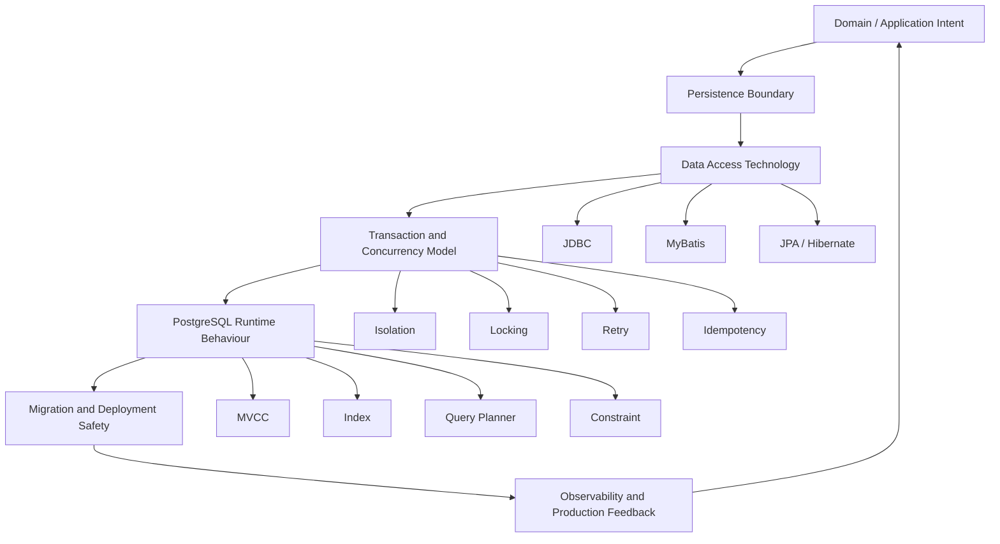
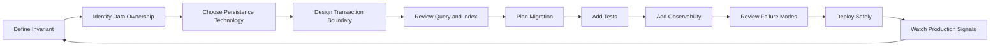

# Final Part: Persistence Layer Mastery Map for Senior Backend Engineer

This is the final part of the series.

The purpose of this part is not to introduce another isolated topic.
The purpose is to consolidate the complete persistence mental model into a working map that can be used during design review, PR review, debugging, migration planning, incident response, and architecture discussion.

A senior backend engineer should not treat persistence as “the code that saves data”.
Persistence is where application intention becomes durable fact.
That makes it one of the highest-risk layers in enterprise systems.

---

## Complete persistence mental model

A production-grade persistence layer must be understood through seven connected dimensions:



If you only understand one dimension, your review will be shallow.
If you connect all seven, you can reason like a senior/principal engineer.

---

## The invariant-first view

The strongest way to reason about persistence is not framework-first.
It is **invariant-first**.

Ask:

1. What must always be true about the data?
2. Which component enforces it?
3. Is it enforced before write, during write, or after write?
4. Can concurrency break it?
5. Can retry duplicate it?
6. Can migration temporarily violate it?
7. Can cache hide its violation?
8. Can observability detect its violation?

Example:

```text
Invariant: A quote/order business key must be unique.
Possible enforcement:
- API validation: early feedback only, not sufficient.
- Service check: useful but race-prone if alone.
- PostgreSQL unique constraint: authoritative protection.
- Idempotency key: prevents retry duplicate.
- Transaction retry handling: maps unique violation correctly.
- Test: concurrent duplicate submission.
- Observability: duplicate conflict/error rate.
```

This is the mindset: correctness is not a single annotation or mapper method.
Correctness is a chain.

---

## Persistence layer as boundary

A healthy persistence boundary answers these questions clearly:

- Who owns the table?
- Who owns the transaction?
- Who owns the SQL?
- Who owns the entity lifecycle?
- Who owns the mapping?
- Who owns the migration?
- Who owns the test evidence?
- Who owns the production dashboard?
- Who owns incident response when data correctness fails?

If ownership is unclear, complexity leaks into production.

---

# JDBC Checklist

JDBC is the foundation beneath MyBatis and JPA/Hibernate.
Even if you rarely write JDBC directly, you need the JDBC mental model to understand connection pooling, transaction behavior, statement execution, exceptions, fetch size, batching, and resource management.

## JDBC review checklist

- [ ] Is SQL parameterized with `PreparedStatement` or equivalent?
- [ ] Is string concatenation avoided for user-controlled input?
- [ ] Is the `Connection` obtained from the correct `DataSource`?
- [ ] Is autocommit behavior understood?
- [ ] Is transaction ownership explicit?
- [ ] Are `ResultSet`, `Statement`, and `Connection` closed safely?
- [ ] Is fetch size configured for large result sets where needed?
- [ ] Is batch execution used intentionally?
- [ ] Are generated keys handled correctly?
- [ ] Is `SQLState`/vendor error code mapped appropriately?
- [ ] Are timeouts configured?
- [ ] Is retry limited to retryable failures?
- [ ] Is logging redacted?

## JDBC failure modes

- connection leak;
- autocommit surprise;
- unclosed cursor/result set;
- SQL injection;
- excessive round trips;
- batch memory pressure;
- wrong generated key handling;
- swallowed SQLState;
- retrying non-idempotent operation;
- long transaction holding connection.

## JDBC mastery signal

You can explain how a single query travels from Java code through connection pool, JDBC driver, PostgreSQL backend process, transaction state, query planner, lock manager, result streaming, exception mapping, and finally HTTP response.

---

# MyBatis Checklist

MyBatis is SQL-first.
Its strength is explicit SQL ownership.
Its risk is that complex XML/dynamic SQL can become hidden application logic.

## MyBatis design checklist

- [ ] Does each mapper have clear ownership?
- [ ] Is the mapper interface aligned with XML namespace?
- [ ] Are method names business-meaningful and query-specific?
- [ ] Are parameter objects explicit for complex queries?
- [ ] Are command objects and query objects separated?
- [ ] Are projections intentionally shaped?
- [ ] Are ResultMaps named and reused carefully?
- [ ] Are nested selects avoided unless N+1 is acceptable and tested?
- [ ] Are column aliases explicit in joins?
- [ ] Are TypeHandlers tested?
- [ ] Are JSONB/array/enum mappings verified with PostgreSQL?
- [ ] Is dynamic SQL readable and bounded?
- [ ] Are `${}` fragments avoided or whitelisted strictly?
- [ ] Are dynamic ORDER BY fields whitelisted?
- [ ] Is pagination stable?
- [ ] Are count queries reviewed for cost?

## MyBatis transaction checklist

- [ ] Does MyBatis participate in the same transaction manager as the service?
- [ ] Is SqlSession lifecycle managed by framework convention?
- [ ] Are MyBatis writes ordered correctly relative to JPA flush if mixed?
- [ ] Are batch executor semantics understood?
- [ ] Are lock statements such as `FOR UPDATE`, `NOWAIT`, or `SKIP LOCKED` used intentionally?
- [ ] Are version checks implemented manually where optimistic locking is required?

## MyBatis failure modes

- mapper XML does not match interface;
- ResultMap silently maps wrong column;
- dynamic SQL generates invalid branch;
- `${}` introduces injection risk;
- nested select creates N+1;
- manual version check missing;
- soft delete/tenant condition forgotten;
- mapper write bypasses JPA entity lifecycle;
- PostgreSQL-specific SQL not tested against real PostgreSQL;
- count query becomes slower than data query.

## MyBatis mastery signal

You can look at a mapper method and predict:

- exact SQL shape;
- result object shape;
- index dependency;
- transaction/lock behavior;
- injection risk;
- mapping risk;
- test cases needed;
- operational debugging path.

---

# JPA/Hibernate Checklist

JPA is entity-first and persistence-context-driven.
Hibernate adds concrete provider behavior: dirty checking, flush, proxy, lazy loading, first-level cache, second-level cache, batch fetching, query generation, and many performance/correctness knobs.

## JPA entity checklist

- [ ] Is the entity mapped to the correct table/schema?
- [ ] Is the identifier strategy correct for PostgreSQL?
- [ ] Are sequence/identity choices intentional?
- [ ] Are enum mappings stable?
- [ ] Are AttributeConverters tested?
- [ ] Is `@Version` used where optimistic locking is needed?
- [ ] Are audit fields populated consistently?
- [ ] Are created/updated timestamps consistent with DB/application time policy?
- [ ] Is soft delete implemented consistently?
- [ ] Are immutable entities marked/read-only where appropriate?
- [ ] Is serialization of entity to API avoided unless explicitly intended?

## JPA relationship checklist

- [ ] Is relationship ownership clear?
- [ ] Is cascade limited to true aggregate lifecycle?
- [ ] Is orphan removal intentional?
- [ ] Is `FetchType.EAGER` avoided unless strongly justified?
- [ ] Are bidirectional relationships kept consistent?
- [ ] Is ManyToMany direct mapping avoided for relationship-with-attributes cases?
- [ ] Are fetch joins/entity graphs used intentionally?
- [ ] Are query count tests present for risky paths?

## Hibernate runtime checklist

- [ ] Is persistence context size controlled?
- [ ] Is flush timing understood?
- [ ] Are hidden updates possible through dirty checking?
- [ ] Is `merge()` used cautiously?
- [ ] Are detach/clear/refresh operations intentional?
- [ ] Is lazy loading safe within the request/transaction boundary?
- [ ] Is second-level cache enabled only where invalidation is safe?
- [ ] Are generated SQL logs available in lower environments?
- [ ] Are Hibernate statistics available for diagnosis?

## JPA/Hibernate failure modes

- N+1 due to lazy loading in loop;
- eager relationship loads too much data;
- cascade deletes/updates unexpected rows;
- dirty checking issues hidden update;
- flush before query surprises reviewer;
- bulk update leaves persistence context stale;
- detached merge overwrites fields;
- persistence context grows during batch;
- second-level cache returns stale data;
- generated SQL hides bad join/index usage;
- entity/schema mismatch after migration.

## JPA/Hibernate mastery signal

You can read a service method and predict not only explicit repository calls, but also implicit SQL caused by dirty checking, flush, lazy loading, cascade, and persistence context lifecycle.

---

# MyBatis vs JPA Decision Checklist

Do not choose based on familiarity alone.
Choose based on use case shape.

## Prefer MyBatis when

- SQL shape matters and must be explicit.
- Query is complex, reporting-oriented, or projection-heavy.
- PostgreSQL-specific features are central: JSONB, arrays, CTE, `RETURNING`, `UPSERT`, `SKIP LOCKED`, advisory lock.
- You need predictable SQL for operational debugging.
- You are reading read models or denormalized projections.
- Legacy schema does not fit ORM well.
- Stored procedure/function integration is significant.
- Batch query/update needs direct SQL control.

## Prefer JPA/Hibernate when

- Aggregate lifecycle is central.
- Entity identity and state transitions matter.
- Relationship navigation is useful and bounded.
- Optimistic locking via `@Version` fits the model.
- CRUD is common and schema maps reasonably to object model.
- Unit-of-work semantics reduce boilerplate.
- Domain logic benefits from managed entity lifecycle.

## Prefer JDBC directly when

- You need minimal abstraction.
- You are writing highly specialized low-level code.
- You need custom streaming/cursor handling.
- You need explicit batch/procedure behavior without mapper abstraction.
- Framework integration cost is higher than benefit.
- The use case is small, isolated, and carefully reviewed.

## Avoid JPA when

- You cannot tolerate hidden SQL.
- Query is too complex for ORM mapping.
- Relationship graph is too large/unbounded.
- Schema is legacy/denormalized in ways that fight entity lifecycle.
- Bulk operation would constantly fight persistence context.

## Avoid MyBatis when

- Mapper XML becomes duplicated domain logic.
- Manual mapping becomes too error-prone.
- Aggregate lifecycle would be safer with entity state management.
- Optimistic locking/audit/soft delete/tenant rules are repeatedly forgotten.
- The team lacks SQL review discipline.

---

# MyBatis + JPA Coexistence Checklist

MyBatis and JPA can coexist.
They should not casually manage the same data in the same way.

## Safe coexistence patterns

- Different bounded contexts.
- Different modules.
- Different schemas.
- JPA owns aggregate write lifecycle; MyBatis owns read-only projection/reporting query.
- MyBatis owns complex SQL read model; JPA owns simple command lifecycle elsewhere.
- Shared datasource and transaction manager are configured intentionally.
- Framework ownership is documented.
- Cache is disabled or carefully invalidated for mixed paths.

## Risky but manageable patterns

- JPA write followed by MyBatis read in same transaction, with explicit flush awareness.
- MyBatis write followed by JPA read, with clear/refresh awareness.
- Same table read by both, but write ownership is single.
- MyBatis native query used for performance-critical read against JPA-owned tables.

## Anti-patterns

- One table, two independent write models.
- MyBatis update bypasses JPA `@Version`, audit, soft delete, tenant filter, or entity listener.
- JPA entity is managed while MyBatis updates the same row behind EntityManager.
- Second-level cache is enabled but mapper writes bypass cache invalidation.
- Duplicate validation and audit behavior diverge.
- Same use case mixes frameworks because of convenience, not architecture.

## Same-use-case review checklist

- [ ] Do both frameworks touch the same table?
- [ ] Do both write the same row/aggregate?
- [ ] Can EntityManager already contain stale state?
- [ ] Is explicit flush needed before MyBatis read?
- [ ] Is clear/refresh needed after MyBatis write?
- [ ] Is optimistic locking consistent?
- [ ] Is audit consistent?
- [ ] Is soft delete consistent?
- [ ] Is tenant/security filtering consistent?
- [ ] Is cache invalidation safe?
- [ ] Is this design documented?
- [ ] Are integration tests covering the mixed path?

---

# Transaction Checklist

Transaction boundary is the unit of correctness.
A persistence change without transaction reasoning is incomplete.

## Transaction boundary checklist

- [ ] Where does the transaction start?
- [ ] Where does it commit?
- [ ] What operations are inside it?
- [ ] What operations are outside it?
- [ ] Are external calls inside the transaction?
- [ ] Is timeout configured?
- [ ] Is rollback behavior correct for checked/unchecked exceptions?
- [ ] Is propagation intentional?
- [ ] Is isolation sufficient?
- [ ] Is transaction duration observable?
- [ ] Is idempotency handled for retry/timeout?

## Propagation checklist

- [ ] Is `REQUIRED` enough?
- [ ] Is `REQUIRES_NEW` truly needed or hiding design smell?
- [ ] Does `REQUIRES_NEW` break atomicity expectations?
- [ ] Is `NESTED` actually supported by the transaction manager/database?
- [ ] Is self-invocation bypassing transaction proxy/interceptor?
- [ ] Are transaction annotations placed at the correct layer?

## Isolation and concurrency checklist

- [ ] Can lost update happen?
- [ ] Can write skew happen?
- [ ] Can phantom read matter?
- [ ] Is optimistic locking used when appropriate?
- [ ] Is pessimistic locking used when necessary?
- [ ] Are deadlock and serialization failures retried safely?
- [ ] Is retry idempotent?
- [ ] Are unique constraints used as final guard for uniqueness?

## Transaction mastery signal

You can explain exactly what happens if the process crashes after database commit but before event publication, after event publication but before response, or after timeout while the database transaction may still commit.

---

# Query Performance Checklist

Query performance is not only a DBA concern.
Persistence engineers own query shape.

## SQL visibility checklist

- [ ] Can we see the SQL executed by this code path?
- [ ] Can we see bound parameters safely without leaking PII?
- [ ] Can we count queries per request?
- [ ] Can we identify slow queries by endpoint/use case?
- [ ] Can we run EXPLAIN/EXPLAIN ANALYZE with representative parameters?
- [ ] Can we map slow SQL back to mapper/repository/entity query?

## Index and planner checklist

- [ ] Does WHERE clause match index prefix/order?
- [ ] Does ORDER BY have supporting index?
- [ ] Is pagination stable?
- [ ] Is count query expensive?
- [ ] Are joins selective?
- [ ] Are statistics current enough?
- [ ] Is JSONB indexed correctly if queried?
- [ ] Is large offset avoided for large tables?

## ORM performance checklist

- [ ] Is N+1 possible?
- [ ] Is fetch join/entity graph needed?
- [ ] Is projection better than entity loading?
- [ ] Is persistence context too large?
- [ ] Is dirty checking cost significant?
- [ ] Is flush frequency controlled?
- [ ] Is JDBC batching enabled and effective?

## MyBatis performance checklist

- [ ] Is nested select producing too many queries?
- [ ] Is ResultMap too broad?
- [ ] Is dynamic SQL causing bad plan variation?
- [ ] Is IN clause too large?
- [ ] Is batch executor used where useful?
- [ ] Is fetch size used for streaming?

---

# Locking Checklist

Locking is not just a database concern.
It is a business correctness mechanism.

## Optimistic locking checklist

- [ ] Is there a version column?
- [ ] Does JPA use `@Version`?
- [ ] Does MyBatis update include `WHERE version = ?`?
- [ ] Is zero-row update mapped to stale object/domain conflict?
- [ ] Is retry appropriate or should user resolve conflict?

## Pessimistic locking checklist

- [ ] Is `SELECT FOR UPDATE` used only inside a transaction?
- [ ] Is lock order consistent to reduce deadlock?
- [ ] Is lock timeout configured?
- [ ] Is `NOWAIT` or `SKIP LOCKED` used intentionally?
- [ ] Are locked rows as narrow as possible?
- [ ] Is the transaction short?

## Business locking checklist

- [ ] Is row-level lock enough?
- [ ] Is advisory lock justified?
- [ ] Is unique constraint enough?
- [ ] Is Redis lock safe and necessary?
- [ ] What happens on process crash?
- [ ] Is lock release guaranteed?

---

# Migration Checklist

Migration is production code.
It changes the contract between application and database.

## Migration review checklist

- [ ] Is migration backward-compatible?
- [ ] Is expand-contract needed?
- [ ] Is old application version compatible with new schema?
- [ ] Is new application version compatible with old schema during rollout?
- [ ] Are data backfills safe and chunked?
- [ ] Are constraints added only after data is valid?
- [ ] Are large indexes created safely?
- [ ] Are mapper/entity changes synchronized?
- [ ] Are native queries updated?
- [ ] Are stored procedures/functions versioned?
- [ ] Is rollback possible, or is roll-forward the plan?
- [ ] Is migration tested with real PostgreSQL?

## Unsafe migration smells

- rename/drop column in one deploy;
- add NOT NULL without backfill/default plan;
- add unique constraint without duplicate cleanup;
- long blocking index creation on large table;
- entity updated before migration compatibility exists;
- mapper references new column while old schema may still run;
- trigger/function change without regression tests;
- rollback script assumed but not tested.

---

# Testing Checklist

Persistence tests should prove behavior that mocks cannot.

## General persistence testing checklist

- [ ] Does the test use real PostgreSQL behavior where needed?
- [ ] Are migrations applied in test setup?
- [ ] Are repository/mapper/entity tests meaningful?
- [ ] Are transaction rollback/commit behaviors tested?
- [ ] Are constraint violations tested?
- [ ] Are concurrency scenarios tested?
- [ ] Are query count/performance regressions guarded where valuable?
- [ ] Are fixtures realistic enough for query shape?
- [ ] Are test data privacy rules respected?

## MyBatis testing checklist

- [ ] Mapper XML loads successfully.
- [ ] Dynamic SQL branches are tested.
- [ ] ResultMap maps all important fields correctly.
- [ ] TypeHandler works against PostgreSQL types.
- [ ] JSONB/array/enum queries are tested.
- [ ] Pagination/sorting is tested.
- [ ] SQL injection guard cases are tested.

## JPA/Hibernate testing checklist

- [ ] Entity mapping matches migration schema.
- [ ] JPQL/native queries run against real DB.
- [ ] Relationship loading does not produce unexpected N+1.
- [ ] Dirty checking and flush behavior are understood.
- [ ] Optimistic/pessimistic lock behavior is tested.
- [ ] Bulk update stale context behavior is handled.

---

# Security and Privacy Checklist

Persistence layer is a major security boundary.

## Security checklist

- [ ] Are all user inputs parameterized?
- [ ] Are dynamic SQL fragments whitelisted?
- [ ] Are DB users least-privilege?
- [ ] Is migration user separated from runtime user if required?
- [ ] Are read-only users used where appropriate?
- [ ] Are schema permissions controlled?
- [ ] Is tenant isolation enforced?
- [ ] Is row-level security used or intentionally not used?
- [ ] Are sensitive values redacted from logs?
- [ ] Are credentials managed via secure secret mechanism?

## Privacy checklist

- [ ] Are PII fields identified?
- [ ] Are PII values avoided in logs?
- [ ] Is masking/tokenization/encryption policy clear?
- [ ] Is data retention implemented?
- [ ] Is deletion/anonymization behavior correct?
- [ ] Are backups covered by privacy policy?
- [ ] Is test data sanitized?
- [ ] Are exports auditable?
- [ ] Is access traceability available?

---

# Observability Checklist

You cannot operate what you cannot see.

## Runtime signals to expect

- query duration;
- query count per request;
- slow query log;
- connection pool active/idle/pending;
- connection acquisition time;
- transaction duration;
- lock wait;
- deadlock count;
- timeout count;
- serialization failure count;
- constraint violation rate;
- migration status;
- Hibernate statistics;
- MyBatis query metrics if available;
- cache hit/miss/invalidation;
- outbox lag;
- inbox duplicate count;
- idempotency conflict count.

## Dashboard review checklist

- [ ] Can we see pool exhaustion before outage?
- [ ] Can we detect slow query regression?
- [ ] Can we correlate endpoint latency with DB latency?
- [ ] Can we detect lock wait/deadlock spikes?
- [ ] Can we see migration failure quickly?
- [ ] Can we detect outbox publishing lag?
- [ ] Can we see cache inconsistency symptoms indirectly?
- [ ] Are alerts actionable, not noisy?

---

# Production Readiness Checklist

Before a persistence-heavy change is production-ready, verify:

## Correctness

- [ ] Invariants are explicit.
- [ ] Database constraints protect critical facts.
- [ ] Transaction boundary is correct.
- [ ] Concurrency risk is handled.
- [ ] Idempotency/retry is handled where needed.
- [ ] Audit/version/timestamp behavior is consistent.
- [ ] Tenant/soft delete/temporal filters are consistent.

## Performance

- [ ] SQL is visible.
- [ ] Query plan is acceptable.
- [ ] Indexes support query shape.
- [ ] Pagination is stable and scalable.
- [ ] N+1 is avoided or measured.
- [ ] Batch/streaming is memory-safe.
- [ ] Pool impact is understood.

## Migration/deployment

- [ ] Migration is backward-compatible.
- [ ] Rolling deployment is safe.
- [ ] Backfill is safe.
- [ ] Roll-forward plan exists.
- [ ] Migration is tested.
- [ ] Entity/mapper/schema mismatch is avoided.

## Operations

- [ ] Logs are sufficient and redacted.
- [ ] Metrics exist.
- [ ] Alerts exist for high-risk failures.
- [ ] Runbook exists for expected failure mode.
- [ ] DBA/platform escalation path is clear.

## Security/privacy

- [ ] SQL injection risk reviewed.
- [ ] Least privilege respected.
- [ ] Sensitive data handling reviewed.
- [ ] Audit/compliance evidence considered.

---

# Internal Verification Checklist

Because actual CSG/team implementation details are not available here, every item below must be verified internally before being treated as fact.

## Codebase verification

- [ ] Repository package structure.
- [ ] DAO package structure.
- [ ] MyBatis mapper interface and XML conventions.
- [ ] JPA entity package and mapping style.
- [ ] EntityManager usage style.
- [ ] Hibernate provider version/configuration.
- [ ] Transaction annotation/configuration.
- [ ] Transaction manager implementation.
- [ ] DataSource and pool configuration.
- [ ] JDBC direct usage.
- [ ] TypeHandler and AttributeConverter usage.
- [ ] DTO/domain/entity mapping convention.

## Database verification

- [ ] PostgreSQL version.
- [ ] Schema ownership.
- [ ] Table ownership.
- [ ] Primary/foreign/business keys.
- [ ] Index strategy.
- [ ] Constraint strategy.
- [ ] Version/audit/tenant/soft delete columns.
- [ ] JSONB/array/function/procedure/trigger usage.
- [ ] Statement timeout and lock timeout.
- [ ] Max connection constraints.

## Migration verification

- [ ] Liquibase/Flyway/custom migration tool.
- [ ] Migration directory structure.
- [ ] Migration execution flow in CI/CD/Kubernetes.
- [ ] Migration user permissions.
- [ ] Expand-contract convention.
- [ ] Backfill convention.
- [ ] Rollback/roll-forward policy.
- [ ] Migration tests.

## Testing verification

- [ ] Unit test conventions.
- [ ] Integration test conventions.
- [ ] Testcontainers usage.
- [ ] Mapper tests.
- [ ] Entity mapping tests.
- [ ] Transaction tests.
- [ ] Concurrency tests.
- [ ] Migration compatibility tests.
- [ ] Query regression tests.

## Operations verification

- [ ] SQL logging availability.
- [ ] Slow query log access.
- [ ] Connection pool metrics.
- [ ] PostgreSQL metrics.
- [ ] Hibernate statistics.
- [ ] MyBatis metrics.
- [ ] Lock/deadlock dashboards.
- [ ] Migration dashboards/logs.
- [ ] Incident runbooks.
- [ ] Escalation paths.

## Architecture verification

- [ ] Whether MyBatis and JPA coexist.
- [ ] Whether they touch same tables.
- [ ] Whether they write same aggregates.
- [ ] Whether second-level cache is enabled.
- [ ] Whether outbox/inbox pattern exists.
- [ ] Whether Redis cache participates in persistence read path.
- [ ] Whether Camunda workflow state is stored locally or externally.
- [ ] Whether Kafka/RabbitMQ publication is transactionally coordinated.
- [ ] Whether services use database-per-service or shared database patterns.

---

# How to keep learning persistence layer in real production systems

Persistence mastery is not achieved by reading framework docs once.
It comes from repeated exposure to real failure modes.

## Study PRs

Look for PRs that changed:

- migration;
- mapper XML;
- entity relationship;
- transaction annotation;
- query performance;
- index;
- outbox/inbox;
- idempotency;
- cache invalidation;
- audit/soft delete/tenant logic.

For each PR, ask:

- What was the intended data change?
- What invariant was affected?
- What tests were added?
- What production signal would detect failure?
- Was the review deep enough?

## Study incidents

Incidents reveal where mental models were incomplete.
Build a personal incident library:

```text
Incident category:
- migration
- transaction
- lock
- query plan
- N+1
- pool exhaustion
- stale cache
- duplicate event
- data correction

Lesson:
- what assumption was wrong?
- what signal was missing?
- what checklist should change?
```

## Study dashboards

Do not wait for incidents.
Regularly inspect:

- slowest queries;
- highest DB time endpoints;
- pool saturation;
- lock waits;
- transaction duration;
- deadlocks;
- outbox lag;
- cache metrics;
- migration failures.

## Study schema evolution

Read old migrations.
They show how the product changed over time.
Schema history often reveals domain history better than code history.

---

# How to become effective in persistence architecture discussions

In architecture discussions, avoid arguing from preference.
Argue from constraints and failure modes.

Weak argument:

```text
I prefer JPA because it is cleaner.
```

Stronger argument:

```text
This use case modifies an aggregate with version-based optimistic locking and simple lifecycle transitions. JPA is acceptable if we keep relationship loading bounded and verify generated SQL. MyBatis may still be better for reporting projections over the same table, but write ownership should stay single.
```

Weak argument:

```text
MyBatis is better because SQL is visible.
```

Stronger argument:

```text
This query depends on PostgreSQL JSONB operators, dynamic filters, and keyset pagination. MyBatis gives explicit SQL control and easier EXPLAIN-based review. We should return DTO projections and keep this path read-only relative to the JPA-owned aggregate.
```

Weak argument:

```text
Just add an index.
```

Stronger argument:

```text
The current query filters by tenant_id and status, sorts by updated_at desc, and paginates. We need to validate cardinality and create an index that matches the filter/order pattern. Also verify count query cost and stable ordering.
```

---

# How to prevent persistence changes from becoming production incidents

Most persistence incidents are not caused by lack of syntax knowledge.
They are caused by missed interaction effects.

## Common missed interactions

- Code change + migration compatibility.
- Mapper write + JPA stale persistence context.
- Entity relationship + N+1.
- Dynamic SQL + SQL injection.
- Offset pagination + large table.
- Cache invalidation + transaction rollback.
- Event publication + database commit.
- Retry + non-idempotent write.
- Pool size + Kubernetes replica count.
- Index creation + table lock.
- Constraint addition + dirty historical data.
- Soft delete + missing filter.
- Tenant ID + missing condition.
- Bulk update + stale persistence context.

## Prevention loop

Use this loop for every significant persistence change:



This is how persistence engineering becomes disciplined instead of reactive.

---

# Final senior engineer operating model

When reviewing or designing persistence changes, operate in this order:

1. **Business invariant**  
   What must never be wrong?

2. **Data ownership**  
   Which service/module/table owns the fact?

3. **Persistence model**  
   JDBC, MyBatis, JPA/Hibernate, stored procedure, cache, or event table?

4. **Transaction boundary**  
   What is atomic? What is not?

5. **Concurrency model**  
   What happens under simultaneous requests/workers/events?

6. **Schema and migration**  
   Can old and new app versions survive the change?

7. **Query performance**  
   What SQL runs? Which index supports it? What is the plan?

8. **Testing evidence**  
   What proves this works against real PostgreSQL behavior?

9. **Observability**  
   How will production tell us if it fails?

10. **Operational response**  
   What is the rollback, roll-forward, or mitigation path?

---

# Final mastery checklist

A senior backend engineer who has mastered this series can:

- [ ] Explain persistence layer as boundary, not implementation detail.
- [ ] Reason from domain invariant to database constraint.
- [ ] Trace JAX-RS request to transaction to SQL to PostgreSQL behavior.
- [ ] Explain JDBC primitives and their impact on higher frameworks.
- [ ] Design MyBatis mappers with explicit SQL ownership.
- [ ] Review MyBatis dynamic SQL for injection and performance risk.
- [ ] Explain JPA persistence context, flush, dirty checking, and entity lifecycle.
- [ ] Diagnose Hibernate N+1, lazy loading, cascade, and stale context issues.
- [ ] Choose JDBC/MyBatis/JPA based on use case, not taste.
- [ ] Identify safe and unsafe MyBatis+JPA coexistence.
- [ ] Design transaction boundaries with propagation/isolation awareness.
- [ ] Handle locking, deadlock, serialization failure, and retry correctly.
- [ ] Review schema migration for backward compatibility.
- [ ] Design tests that prove mapping, transaction, migration, and concurrency behavior.
- [ ] Tune query performance with SQL visibility and PostgreSQL plan evidence.
- [ ] Understand persistence implications in microservices and event-driven architecture.
- [ ] Apply outbox/inbox/idempotency patterns safely.
- [ ] Review security/privacy risks in persistence code.
- [ ] Use observability to diagnose production persistence failures.
- [ ] Lead persistence PR reviews and architecture decisions with evidence.

---

# Closing model

Persistence engineering is where correctness becomes durable.

Framework knowledge is necessary but insufficient.
A senior engineer must understand:

- the Java/JAX-RS request lifecycle;
- the repository/DAO/mapper/entity boundary;
- JDBC as the execution substrate;
- MyBatis as explicit SQL mapping;
- JPA as entity lifecycle and persistence context;
- Hibernate as concrete provider behavior;
- PostgreSQL as MVCC, planner, lock, index, and constraint engine;
- migration as deployment contract;
- transaction as correctness boundary;
- observability as production truth;
- incidents as feedback loop.

The highest-value engineer is not the one who can add the fastest repository method.
It is the one who can prevent a small persistence change from becoming a data correctness incident.

