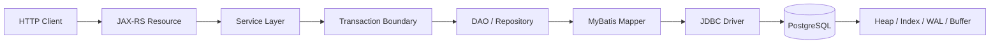
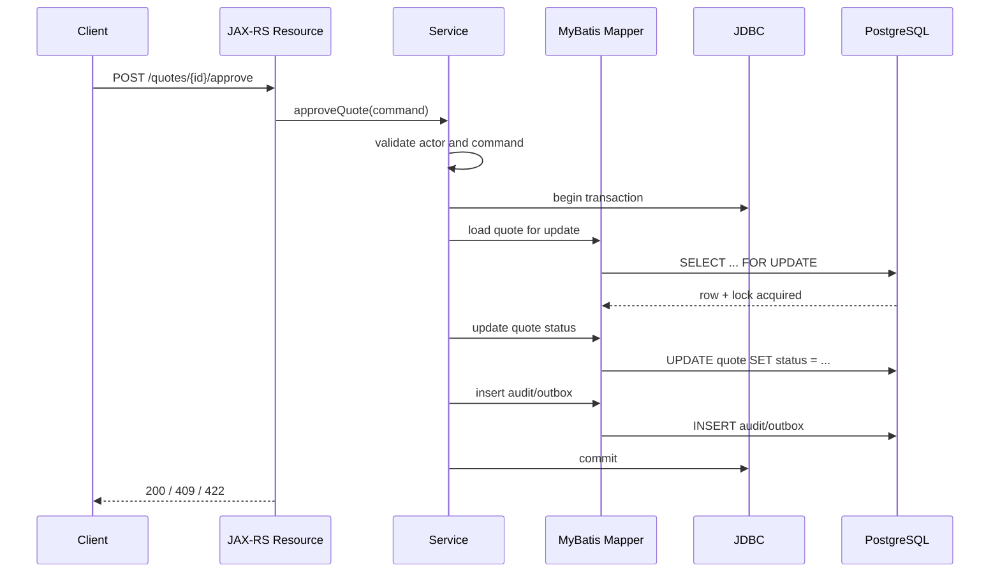

# Part 001 — PostgreSQL Foundation for Enterprise Backend Engineers

## 1. Posisi Part Ini Dalam Seri

Part ini adalah fondasi mental model. Tujuannya bukan membuat Anda langsung hafal syntax SQL, melainkan membuat Anda melihat PostgreSQL sebagai **sistem inti correctness** di belakang aplikasi enterprise Java/JAX-RS.

Dalam backend enterprise, PostgreSQL bukan hanya “database”. Ia adalah tempat banyak keputusan irreversible terjadi:

- apakah data benar-benar tersimpan atau hilang,
- apakah dua request concurrent merusak state atau tidak,
- apakah query API tetap cepat ketika data tumbuh,
- apakah event Kafka keluar konsisten dengan perubahan data,
- apakah migration bisa jalan tanpa downtime,
- apakah incident dapat dipulihkan dengan backup, WAL, dan observability yang memadai.

Dalam konteks CPQ, quote management, order management, atau quote-to-cash, database sering menjadi boundary paling keras antara **intent bisnis** dan **state yang sah**. Jika state quote/order salah, efeknya bisa menjalar ke pricing, approval, fulfillment, billing, audit, dan customer impact.

> Prinsip utama: di enterprise backend, PostgreSQL adalah bagian dari domain correctness, bukan hanya infrastructure dependency.

---

## 2. Apa Itu PostgreSQL?

PostgreSQL adalah relational database management system yang berorientasi pada SQL, transaksi, extensibility, data integrity, dan kemampuan production workload. Dari sudut pandang backend engineer, PostgreSQL perlu dilihat melalui beberapa lensa sekaligus:

1. **Relational database engine**  
   Menyimpan data dalam relasi: table, row, column, key, constraint, dan relationship.

2. **Transactional system**  
   Menjamin perubahan data terjadi dalam unit atomik melalui transaction, commit, rollback, isolation, dan durability.

3. **Query engine**  
   Menerima SQL, membangun execution plan, memilih scan/join/sort/aggregate strategy, lalu mengeksekusi query.

4. **Storage engine**  
   Mengelola heap table, page, tuple, TOAST, visibility, vacuum, dan file fisik di disk.

5. **Indexing engine**  
   Menyediakan B-tree, GIN, GiST, BRIN, hash, expression index, partial index, composite index, dan index-only scan.

6. **Extension platform**  
   Bisa diperluas dengan extension seperti `pg_stat_statements`, `pgcrypto`, `pg_trgm`, `citext`, PostGIS, dan lainnya, tergantung policy environment.

7. **Operational system**  
   Memiliki lifecycle production: backup, restore, replication, failover, vacuum, bloat control, monitoring, alerting, capacity planning, security, dan upgrade.

Untuk engineer Java/JAX-RS, PostgreSQL harus dipahami sebagai engine yang berada di ujung request lifecycle:



Kalau Anda hanya memahami bagian Java-nya, Anda hanya melihat separuh sistem. Separuh lainnya berada di PostgreSQL: query plan, lock, MVCC, index, WAL, vacuum, constraint, dan storage behaviour.

---

## 3. Relational Database Mental Model

Relational database bukan sekadar tabel seperti spreadsheet. Relational database adalah sistem yang memodelkan fakta bisnis dalam bentuk relasi yang bisa divalidasi, di-query, dan dijaga konsistensinya.

Contoh sederhana:

- `customer` adalah fakta tentang pelanggan.
- `quote` adalah fakta tentang penawaran.
- `quote_item` adalah fakta tentang item dalam quote.
- `order` adalah fakta bahwa quote atau intent tertentu sudah dikonversi menjadi order.
- `order_state_history` adalah fakta historis tentang transisi state.

Yang penting bukan hanya “kolom apa saja”, tetapi juga:

- apakah row ini boleh ada tanpa parent?
- apakah status ini boleh berubah langsung ke status lain?
- apakah identifier ini unik secara global atau per tenant?
- apakah data ini mutable atau harus immutable setelah approval?
- apakah data ini snapshot historis atau selalu referensi ke data terbaru?
- apakah delete fisik boleh dilakukan atau harus soft-delete?
- apakah perubahan ini harus menghasilkan event?

Relational thinking memaksa kita membedakan:

| Konsep | Pertanyaan engineering |
|---|---|
| Entity | Apa yang punya identity dan lifecycle? |
| Relationship | Apa hubungan antar entity? Optional atau mandatory? |
| Constraint | Invariant apa yang wajib dijaga database? |
| Transaction | Perubahan apa yang harus terjadi atomik? |
| History | Perubahan mana yang harus diaudit? |
| Ownership | Service mana yang berhak menulis data ini? |
| Query pattern | Bagaimana data akan dibaca oleh API/reporting/event publisher? |

> Model data yang buruk biasanya tidak langsung terlihat pada hari pertama. Ia muncul ketika ada concurrent update, migration, reporting, audit, backfill, atau incident.

---

## 4. PostgreSQL Sebagai Transactional Engine

PostgreSQL menjalankan perubahan data melalui transaction. Transaction adalah unit kerja yang harus dilihat oleh backend engineer sebagai boundary correctness.

Contoh:

```sql
BEGIN;

UPDATE quote
SET status = 'APPROVED', updated_at = now()
WHERE id = :quote_id
  AND status = 'PENDING_APPROVAL';

INSERT INTO outbox_event (...)
VALUES (...);

COMMIT;
```

Dari sudut pandang aplikasi:

- jika update quote sukses tetapi insert outbox gagal, event hilang;
- jika insert outbox sukses tetapi update quote gagal, event bohong;
- jika keduanya berada dalam satu transaction, keduanya commit atau rollback bersama.

Inilah kenapa transaction bukan detail teknis kecil. Transaction adalah cara aplikasi menjaga konsistensi antara business state dan side effect yang akan diproses asynchronous.

### 4.1 Transaction Boundary Di Java/JAX-RS

Jangan samakan HTTP request dengan transaction secara otomatis.

Bad mental model:

```text
1 HTTP request = 1 transaction dari awal sampai akhir
```

Better mental model:

```text
Transaction dibuka hanya di section yang benar-benar perlu atomic database change.
```

Contoh lifecycle yang lebih sehat:

```text
Receive HTTP request
Validate request syntactically
Authorize actor
Load required aggregate/state
Open transaction
  Validate business invariant under transaction
  Mutate database
  Insert outbox/event/audit if needed
Commit
Return response
```

Transaction terlalu panjang bisa menyebabkan:

- lock ditahan terlalu lama,
- vacuum terhambat,
- connection pool cepat habis,
- deadlock lebih mudah terjadi,
- latency API naik,
- throughput turun.

---

## 5. PostgreSQL Sebagai Query Engine

PostgreSQL tidak menjalankan SQL secara literal seperti interpreter baris demi baris. Ia melakukan:

1. parse SQL,
2. analyze object dan type,
3. rewrite jika ada rule/view,
4. plan query,
5. execute plan.

Query engine memilih strategi berdasarkan:

- statistik table,
- estimasi jumlah row,
- available index,
- filter selectivity,
- join condition,
- sort/aggregate cost,
- memory setting,
- parallelism,
- parameter/prepared statement behaviour.

SQL seperti ini:

```sql
SELECT q.id, q.status, q.created_at
FROM quote q
WHERE q.customer_id = :customer_id
ORDER BY q.created_at DESC
LIMIT 50;
```

bisa menjadi cepat atau lambat tergantung index:

```sql
CREATE INDEX idx_quote_customer_created_at
ON quote (customer_id, created_at DESC);
```

Namun index bukan selalu jawaban. Query planner bisa tetap memilih sequential scan jika:

- table kecil,
- filter tidak selective,
- statistics salah/stale,
- index tidak cocok dengan order/filter,
- function/expression membuat index tidak usable,
- data distribution skewed,
- prepared statement memakai generic plan yang kurang cocok.

> Senior engineer tidak bertanya “perlu index apa?” terlebih dahulu. Ia bertanya “query pattern apa, cardinality-nya bagaimana, selectivity-nya apa, dan plan aktualnya seperti apa?”

---

## 6. PostgreSQL Sebagai Storage Engine

Walaupun kita berinteraksi lewat SQL, PostgreSQL menyimpan data secara fisik dalam struktur internal. Pada level mental model awal, Anda perlu tahu beberapa konsep:

| Konsep | Makna praktis |
|---|---|
| Heap table | Tempat row table disimpan. |
| Page/block | Unit fisik penyimpanan, umumnya 8 KB. |
| Tuple | Versi fisik dari sebuah row. UPDATE bisa membuat tuple baru. |
| MVCC | PostgreSQL menjaga beberapa versi row untuk concurrency. |
| WAL | Write-Ahead Log untuk durability dan recovery. |
| TOAST | Mekanisme menyimpan value besar di luar row utama. |
| Visibility map | Membantu vacuum dan index-only scan. |
| FSM | Free Space Map untuk mencari ruang kosong dalam page. |
| Vacuum | Membersihkan row version lama yang tidak lagi terlihat transaction aktif. |

Konsekuensi production-nya:

- `UPDATE` bukan sekadar mengganti byte di tempat lama; sering menghasilkan versi tuple baru.
- Table dengan banyak update/delete bisa bloat.
- Long-running transaction bisa menahan cleanup row lama.
- Value besar seperti JSONB besar dapat masuk TOAST.
- Query yang terlihat sederhana bisa mahal jika harus membaca banyak page.

---

## 7. PostgreSQL Sebagai Indexing Engine

Index adalah struktur data tambahan untuk mempercepat akses data. Tetapi index juga punya biaya.

### 7.1 Manfaat Index

Index membantu untuk:

- lookup by key,
- range query,
- sorting,
- uniqueness enforcement,
- join acceleration,
- full-text search,
- JSONB containment query,
- time-series pruning/scan pattern tertentu.

### 7.2 Biaya Index

Setiap index harus ikut di-maintain ketika table berubah.

Dampaknya:

- insert lebih mahal,
- update lebih mahal jika kolom indexed berubah,
- delete meninggalkan cleanup work,
- storage bertambah,
- bloat bisa terjadi,
- migration index pada table besar bisa berisiko.

Bad index thinking:

```text
Query lambat -> tambah index
```

Better index thinking:

```text
Query lambat -> lihat plan -> pahami filter/join/order/cardinality -> pilih index jika memang bottleneck-nya akses data
```

---

## 8. PostgreSQL Sebagai Extension Platform

PostgreSQL memiliki extension system. Extension memperluas kemampuan database tanpa harus menunggu aplikasi mengimplementasikan semuanya sendiri.

Contoh umum:

| Extension | Kegunaan |
|---|---|
| `pg_stat_statements` | Melihat statistik query. Sangat penting untuk observability. |
| `pgcrypto` | Fungsi kriptografi tertentu. |
| `uuid-ossp` | UUID generation function, walau modern PostgreSQL juga punya pilihan lain tergantung versi. |
| `citext` | Case-insensitive text type. |
| `pg_trgm` | Trigram search untuk LIKE/ILIKE/fuzzy search. |
| `btree_gin` / `btree_gist` | Operator class tambahan untuk index tertentu. |
| PostGIS | Geospatial workload. |

Namun extension adalah dependency production. Sebelum memakai extension, cek:

- apakah tersedia di AWS RDS/Aurora atau Azure PostgreSQL?
- apakah tersedia di on-prem image?
- siapa boleh `CREATE EXTENSION`?
- apakah migration pipeline punya permission?
- apakah extension compatible dengan version upgrade?
- apakah security team mengizinkan extension tersebut?

---

## 9. PostgreSQL vs Oracle, MySQL, SQL Server: Mental Model Level

Perbandingan ini bukan untuk memilih “mana yang terbaik”, tetapi untuk mencegah asumsi salah saat berpindah database.

| Area | PostgreSQL mental model | Risiko asumsi salah |
|---|---|---|
| MVCC | Banyak versi row, vacuum penting | Mengira update selalu overwrite in-place |
| Transaction | Strong transaction model, isolation nuances | Mengira isolation behaviour sama dengan DB lain |
| Extensions | Extensible, banyak fitur via extension | Mengira semua environment punya extension sama |
| JSONB | Native semi-structured support | Mengubah relational model menjadi document dump |
| Stored logic | Function/procedure/trigger kuat | Menyembunyikan business logic dari aplikasi |
| Vacuum | Maintenance fundamental | Mengabaikan bloat dan long transaction |
| Planner | Cost-based planner bergantung statistik | Mengira index pasti dipakai |
| Sequence | Non-transactional sequence behaviour | Mengira gap sequence berarti data hilang |

Untuk senior engineer, perbedaan paling penting bukan syntax, tetapi operational behaviour.

---

## 10. PostgreSQL Dalam Enterprise Java/JAX-RS System

Dalam Java/JAX-RS system, PostgreSQL biasanya berada di balik beberapa layer:

```text
Resource class
  -> Service
    -> Transaction manager / manual transaction boundary
      -> Repository / DAO
        -> MyBatis mapper / JDBC
          -> PostgreSQL
```

Setiap layer punya tanggung jawab berbeda.

| Layer | Tanggung jawab utama | Risiko umum |
|---|---|---|
| JAX-RS resource | HTTP contract, request parsing, response mapping | Business transaction terlalu dekat dengan HTTP detail |
| Service layer | Business orchestration, transaction boundary | Transaction terlalu panjang, mixed side effect |
| Repository/DAO | Persistence operation boundary | Query tersebar tidak terkontrol |
| MyBatis mapper | SQL explicit mapping | Dynamic SQL tidak aman, N+1, mapping salah |
| JDBC | Connection, statement, resultset, SQLState | Connection leak, timeout salah, exception mapping miskin |
| PostgreSQL | Data correctness, query execution, lock, storage | Constraint kurang, index salah, migration berbahaya |

### 10.1 Request Lifecycle Yang Perlu Anda Bayangkan

Misalnya endpoint approve quote:

```text
POST /quotes/{id}/approve
```

Jangan hanya bayangkan controller memanggil service. Bayangkan seluruh chain:



Yang perlu Anda review:

- Apakah row perlu dikunci?
- Apakah status transition valid di bawah concurrency?
- Apakah outbox insert satu transaction dengan update?
- Apakah error unique/lock/deadlock dipetakan benar?
- Apakah endpoint idempotent?
- Apakah audit trail lengkap?
- Apakah query punya index yang sesuai?

---

## 11. PostgreSQL Dalam Microservices

### 11.1 Database-per-Service Pattern

Pattern umum microservices adalah setiap service memiliki database/schema yang menjadi miliknya.

Tujuannya:

- data ownership jelas,
- service bisa evolve schema sendiri,
- tidak ada coupling langsung lewat table,
- integrasi dilakukan via API/event,
- failure boundary lebih jelas.

Namun dalam sistem enterprise nyata, variasinya bisa banyak:

- satu database cluster, banyak schema per service,
- satu database per service,
- shared reporting database,
- replicated read model,
- legacy shared schema,
- on-prem customer deployment dengan topology berbeda.

Karena itu, untuk konteks CSG, jangan asumsikan topology. Verifikasi.

### 11.2 Shared Database Anti-Pattern

Shared database terjadi ketika beberapa service membaca/menulis table yang sama tanpa ownership jelas.

Gejala:

- service A mengubah kolom, service B rusak;
- migration butuh koordinasi banyak team;
- foreign key lintas bounded context;
- query reporting langsung join banyak service table;
- tidak jelas siapa pemilik invariant;
- incident data sulit ditriase.

Shared database kadang muncul karena alasan legacy, performance, reporting, atau deployment constraint. Tetapi harus diperlakukan sebagai coupling, bukan convenience gratis.

### 11.3 Source of Truth

Setiap fakta bisnis harus punya source of truth.

Contoh:

| Data | Pertanyaan ownership |
|---|---|
| Quote status | Service mana yang berhak mengubah status? |
| Product price | Apakah quote menyimpan snapshot harga atau referensi harga terbaru? |
| Order fulfillment status | Apakah order service, fulfillment service, atau external system yang authoritative? |
| Approval decision | Apakah approval engine atau quote service yang menjadi source of truth? |
| Event status | Apakah outbox table atau Kafka topic yang authoritative untuk publish state? |

Rule praktis:

> Kafka event bukan source of truth untuk state transaksi kecuali arsitektur memang event-sourced dan itu diverifikasi. Dalam banyak sistem, PostgreSQL tetap source of truth, Kafka adalah propagation mechanism.

---

## 12. Data Ownership Dan Boundary

Data ownership berarti service/team tertentu bertanggung jawab atas:

- schema,
- write path,
- constraints,
- migrations,
- indexes,
- data repair,
- observability,
- incident response,
- API/event contract yang mengekspos data tersebut.

Tanpa ownership, masalah berikut muncul:

- migration takut dilakukan karena tidak tahu consumer-nya,
- index ditambah sembarangan untuk query service lain,
- kolom menjadi dumping ground,
- business invariant berpindah-pindah antara application dan database,
- data repair tidak jelas persetujuannya,
- audit trail tidak reliable.

Dalam CPQ/order platform, ownership sangat penting karena lifecycle panjang. Quote bisa dibuat, direvisi, di-approve, dikonversi menjadi order, diproses fulfilment, masuk billing, lalu diaudit.

---

## 13. Correctness Concerns

PostgreSQL membantu correctness, tetapi tidak otomatis membuat sistem benar.

### 13.1 Invariant Yang Cocok Ditaruh Di Database

Gunakan database constraint untuk invariant yang jelas dan lokal:

- `NOT NULL` untuk field wajib,
- `UNIQUE` untuk identifier unik,
- `FOREIGN KEY` untuk referential integrity dalam ownership boundary yang sama,
- `CHECK` untuk range/status sederhana,
- exclusion constraint untuk beberapa rule temporal/range tertentu,
- generated column untuk derived value yang stabil.

### 13.2 Invariant Yang Biasanya Tetap Di Application Layer

Beberapa invariant lebih cocok di service layer:

- rule pricing kompleks,
- approval policy multi-step,
- entitlement logic,
- orchestration lintas service,
- call ke external system,
- rule yang butuh feature flag/config runtime,
- workflow state yang dikelola engine eksternal.

Namun walaupun rule utama di aplikasi, database tetap perlu guardrail minimal agar data rusak tidak mudah masuk.

---

## 14. Performance Concerns

Performance PostgreSQL tidak bisa dipisahkan dari desain aplikasi.

Masalah umum dari sisi backend:

- endpoint list memakai offset pagination dalam table besar,
- N+1 query dari mapper,
- query dynamic tanpa index yang cocok,
- filter optional terlalu banyak sehingga plan tidak stabil,
- transaction terlalu panjang,
- connection pool terlalu besar untuk jumlah replica Kubernetes,
- query reporting berat berjalan di primary OLTP,
- JSONB dipakai sebagai dumping ground,
- index ditambahkan tanpa memahami write overhead,
- migration menambah index/blocking DDL di table besar tanpa strategy.

Pertanyaan performance yang lebih senior:

1. Data size sekarang berapa?
2. Growth rate berapa?
3. Query critical path apa?
4. p95/p99 latency berapa?
5. Execution plan aktualnya apa?
6. Index apa yang dipakai?
7. Berapa row estimate vs actual?
8. Apakah ada lock wait?
9. Apakah connection pool saturating?
10. Apakah query ini aman saat data 10x?

---

## 15. Security, Privacy, dan Compliance Concerns

PostgreSQL menyimpan data yang sering kali sensitif. Untuk enterprise system, security bukan hanya network access.

Area yang harus dipikirkan:

- database role dan privilege,
- schema permission,
- read-only vs write account,
- migration account,
- secret management,
- TLS connection,
- encryption at rest,
- PII classification,
- audit trail,
- log redaction,
- backup encryption,
- access traceability,
- data retention,
- data repair approval.

Dangerous pattern:

```text
Semua service memakai user database yang sama dengan privilege luas.
```

Better pattern:

```text
Service account punya privilege minimum sesuai ownership dan operation.
Migration account dipisahkan dari runtime account.
Read-only/reporting account dibatasi.
```

---

## 16. Observability Concerns

Anda tidak bisa mengoperasikan PostgreSQL hanya dengan log aplikasi.

Sinyal minimum yang perlu diketahui:

- slow query log,
- `pg_stat_statements`,
- `pg_stat_activity`,
- lock wait,
- connection count,
- transaction age,
- idle in transaction,
- cache hit ratio,
- temp file usage,
- WAL generation,
- replication lag,
- dead tuple,
- autovacuum activity,
- disk usage,
- backup status,
- restore drill status.

Untuk backend engineer, observability database berguna untuk menjawab:

- endpoint mana yang menghasilkan query lambat?
- query mana yang paling banyak total time?
- apakah masalahnya CPU, IO, lock, atau connection?
- apakah index baru membantu?
- apakah migration menyebabkan plan regression?
- apakah long transaction berasal dari service tertentu?

---

## 17. Failure Modes Awal Yang Harus Dikenali

| Failure mode | Gejala | Akar masalah umum |
|---|---|---|
| Slow query | API latency naik | Missing index, bad plan, data growth, stale stats |
| Connection exhaustion | Request gagal/time out | Pool leak, pool terlalu besar, DB max connection habis |
| Lock wait | Request menggantung | Transaction panjang, row hot, DDL blocking |
| Deadlock | Error transaction aborted | Update order berbeda antar transaction |
| Serialization failure | SQLSTATE `40001` | Isolation tinggi, concurrent write conflict |
| Unique violation race | API conflict | Tidak handle duplicate insert concurrent |
| Bloat | Disk naik, query melambat | Update/delete tinggi, vacuum tidak mengejar |
| Replication lag | Read replica stale | Write load tinggi, slot lag, network/IO issue |
| Failed migration | Deployment berhenti/rusak | DDL blocking, checksum berubah, data migration tidak idempotent |
| Bad data | Business state salah | Constraint kurang, bug aplikasi, repair manual salah |

---

## 18. Debugging Lens Untuk Backend Engineer

Saat ada problem database, jangan langsung lompat ke solusi. Gunakan urutan diagnosis:

```text
1. Apa symptom-nya?
2. Endpoint/job/service mana yang terdampak?
3. Apakah problem latency, correctness, availability, atau data quality?
4. Query apa yang berjalan?
5. Transaction apa yang terbuka?
6. Ada lock wait atau deadlock?
7. Plan query berubah?
8. Ada migration/deployment baru?
9. Data size/growth berubah?
10. Ada issue infrastructure: CPU, IO, disk, network, replica lag?
```

Useful first questions:

- Apakah query lambat selalu lambat atau hanya saat load tinggi?
- Apakah terjadi setelah deployment/migration?
- Apakah hanya tenant/customer tertentu?
- Apakah table tertentu tumbuh cepat?
- Apakah ada long-running transaction?
- Apakah connection pool penuh?
- Apakah replica lag memengaruhi read path?

---

## 19. PostgreSQL Dalam Kubernetes, AWS, Azure, On-Prem, Hybrid

PostgreSQL bisa berjalan dalam berbagai model deployment:

| Deployment | Mental model |
|---|---|
| AWS RDS/Aurora PostgreSQL-compatible | Managed operational layer, tetapi tetap perlu parameter, monitoring, backup, version, extension awareness. |
| Azure Database for PostgreSQL | Managed PostgreSQL dengan konfigurasi networking, HA, backup, monitoring, dan parameter yang perlu dipahami. |
| Kubernetes operator | Stateful workload di cluster; storage, disruption, backup, failover, dan operator maturity sangat penting. |
| On-prem self-managed | Team/platform bertanggung jawab besar atas OS, disk, HA, backup, patching, monitoring. |
| Hybrid | Perlu memahami network latency, DNS, private connectivity, security boundary, dan operational responsibility. |

Untuk seri ini, setiap topik akan membedakan:

- konsep PostgreSQL umum,
- fitur PostgreSQL native,
- integrasi Java/JDBC/MyBatis,
- migration practice,
- cloud-managed PostgreSQL,
- Kubernetes/on-prem concerns,
- hal yang harus diverifikasi secara internal.

---

## 20. Internal Verification Checklist

Gunakan checklist ini saat mulai membaca codebase atau berdiskusi dengan team.

### 20.1 Database Usage

- Service mana saja yang memakai PostgreSQL?
- Apakah satu service satu database, satu schema, atau shared schema?
- Apakah ada shared table antar service?
- Apakah ada read replica?
- Apakah ada reporting database/read model?
- Apakah PostgreSQL primary source of truth untuk quote/order/catalog/approval?

### 20.2 Schema dan Ownership

- Siapa owner setiap schema/table utama?
- Apakah ownership terdokumentasi?
- Apakah ada table yang ditulis banyak service?
- Apakah FK digunakan dalam boundary yang jelas?
- Apakah naming convention konsisten?

### 20.3 Java/JAX-RS Integration

- Di layer mana transaction dibuka/ditutup?
- Apakah ada request-scoped transaction?
- Apakah MyBatis dipakai langsung dari service atau lewat DAO/repository?
- Apakah SQL tersebar atau terpusat di mapper?
- Bagaimana SQLException/SQLState dipetakan ke domain/API error?

### 20.4 Migration

- Tool migration apa yang digunakan: Liquibase, Flyway, custom, manual?
- Apakah migration dijalankan di CI/CD atau runtime startup?
- Apakah ada expand-contract migration practice?
- Apakah rollback policy jelas?
- Apakah large table migration punya runbook?

### 20.5 Operations

- Apakah slow query log aktif?
- Apakah `pg_stat_statements` aktif?
- Apakah ada dashboard lock, connection, replication lag, disk, autovacuum?
- Apakah backup dan restore drill terdokumentasi?
- Apakah incident database sebelumnya tersedia untuk dipelajari?

### 20.6 CSG-Specific Warning

Jangan mengasumsikan:

- schema internal,
- table quote/order/catalog aktual,
- deployment topology,
- HA architecture,
- backup strategy,
- migration policy,
- DBA approval process,
- extension yang diizinkan,
- observability stack,
- failover runbook.

Semua detail tersebut harus diverifikasi di internal repository, documentation, dashboard, atau diskusi dengan DBA/platform/SRE/backend team.

---

## 21. PR Review Checklist Untuk Part Ini

Saat mereview PR yang menyentuh PostgreSQL, minimal tanyakan:

### Data Ownership

- Table/schema ini milik service mana?
- Apakah service lain membaca/menulis table ini?
- Apakah perubahan ini memengaruhi API/event/reporting lain?

### Correctness

- Invariant apa yang dijaga database?
- Invariant apa yang hanya dijaga aplikasi?
- Apakah ada race condition?
- Apakah transaction boundary jelas?

### Query dan Index

- Query baru akan membaca berapa banyak row?
- Apakah query punya index yang sesuai?
- Apakah ada pagination?
- Apakah query aman saat data 10x?

### Migration

- Apakah migration backward-compatible?
- Apakah migration blocking?
- Apakah perlu backfill?
- Apakah rollback/roll-forward jelas?

### Operations

- Apakah ada metric/log untuk mendeteksi failure?
- Apakah perubahan ini bisa menaikkan lock wait, CPU, IO, atau connection usage?
- Apakah ada runbook jika migration gagal?

---

## 22. Latihan Praktis

Lakukan ini di codebase atau local sandbox:

1. Cari semua konfigurasi database connection.
2. Identifikasi JDBC driver dan connection pool yang digunakan.
3. Cari lokasi MyBatis mapper.
4. Pilih satu endpoint yang membaca PostgreSQL.
5. Trace dari JAX-RS resource sampai SQL query.
6. Tandai transaction boundary.
7. Tandai table yang disentuh.
8. Cari index table tersebut.
9. Cari migration yang membuat table/index tersebut.
10. Catat pertanyaan yang harus diverifikasi ke team.

Output latihan:

```md
# PostgreSQL Usage Recon

## Service
- Name:
- Owner:
- Runtime:

## Database Access
- JDBC driver:
- Pool:
- MyBatis location:
- Transaction manager:

## Endpoint Trace
- Endpoint:
- Service method:
- Mapper:
- SQL:
- Tables:
- Indexes:
- Migration files:

## Risks
- Correctness:
- Performance:
- Migration:
- Observability:

## Questions for Team
- ...
```

---

## 23. Ringkasan

PostgreSQL dalam enterprise Java/JAX-RS system harus dipahami sebagai:

- relational model untuk fakta bisnis,
- transactional system untuk atomic correctness,
- query engine untuk read/write performance,
- storage engine dengan MVCC, WAL, vacuum, dan bloat behaviour,
- indexing engine dengan read/write trade-off,
- extension platform dengan dependency/compatibility concern,
- operational system yang butuh backup, monitoring, failover, security, dan runbook.

Part berikutnya akan masuk ke arsitektur internal PostgreSQL: process model, backend process, shared buffers, WAL, checkpointer, background writer, autovacuum, heap, page, tuple, TOAST, visibility map, system catalog, transaction ID, dan snapshot.

---

## References

- PostgreSQL Official Documentation — Current Manual: https://www.postgresql.org/docs/current/
- PostgreSQL About: https://www.postgresql.org/about/
- PostgreSQL MVCC Introduction: https://www.postgresql.org/docs/current/mvcc-intro.html
- PostgreSQL Transaction Isolation: https://www.postgresql.org/docs/current/transaction-iso.html
- PostgreSQL System Catalogs: https://www.postgresql.org/docs/current/catalogs.html
