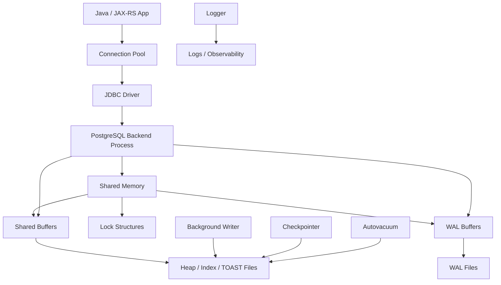
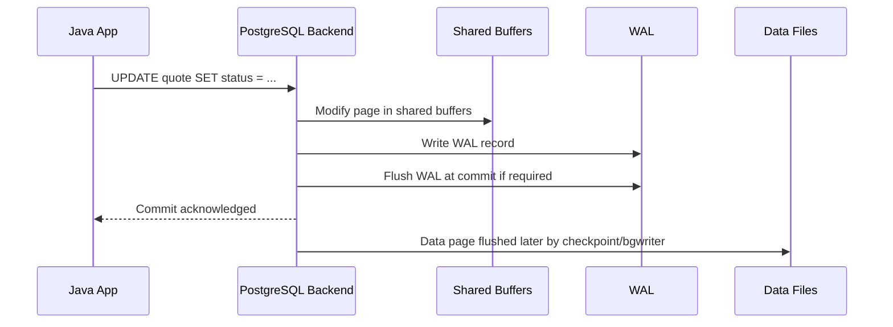

# Part 002 — PostgreSQL Architecture Mental Model

## 1. Posisi Part Ini Dalam Seri

Part ini membangun mental model arsitektur PostgreSQL. Tujuannya bukan menjadikan Anda database kernel developer, tetapi membuat Anda bisa menghubungkan gejala production dengan mekanisme internal PostgreSQL.

Ketika API lambat, penyebabnya bisa berada di beberapa lapisan:

```text
JAX-RS resource
  -> service transaction boundary
  -> MyBatis mapper
  -> JDBC connection
  -> backend process PostgreSQL
  -> lock / snapshot / query plan
  -> shared buffers / disk / WAL
  -> vacuum / bloat / storage layout
```

Tanpa mental model arsitektur, debugging sering berubah menjadi tebakan:

- “Tambah index saja.”
- “Naikkan pool size.”
- “Restart database.”
- “Query-nya di-cache saja.”
- “Pindahkan ke replica.”

Kadang benar. Sering salah. Senior engineer perlu tahu **bagian mana dari PostgreSQL yang sedang menjadi bottleneck**.

---

## 2. Big Picture PostgreSQL Runtime

Secara sederhana, PostgreSQL terdiri dari:

1. **Client process**  
   Aplikasi Java/JAX-RS melalui JDBC driver.

2. **Postmaster / server process**  
   Proses utama yang menerima koneksi dan mengelola process lain.

3. **Backend process**  
   Proses PostgreSQL yang melayani satu client session.

4. **Shared memory**  
   Area memory bersama seperti shared buffers dan lock tables.

5. **Auxiliary/background processes**  
   Proses seperti background writer, checkpointer, WAL writer, autovacuum launcher/worker, logger, archiver, dan lainnya tergantung konfigurasi/versi.

6. **Data files**  
   File table, index, TOAST, system catalog, dan metadata di data directory.

7. **WAL files**  
   Write-Ahead Log untuk durability, crash recovery, replication, PITR, dan logical decoding.

Diagram mental model:



Kunci mental model:

> Aplikasi Anda tidak “langsung menulis row ke disk”. Request melewati backend process, lock/snapshot, buffer, WAL, dan storage subsystem.

---

## 3. Process Model

PostgreSQL secara tradisional menggunakan process-per-connection model. Setiap client session biasanya dilayani oleh backend process tersendiri.

Dari sisi Java/JAX-RS:

```text
HikariCP connection
  -> PostgreSQL session
    -> backend process
```

Konsekuensi:

- terlalu banyak connection berarti terlalu banyak backend process,
- context switching dan memory overhead naik,
- database bukan HTTP server yang bisa menerima ribuan active connection murah,
- pool size harus dihitung bersama jumlah replica aplikasi,
- PgBouncer kadang digunakan untuk mengurangi pressure connection.

### 3.1 Backend Process

Backend process adalah worker PostgreSQL untuk satu client session. Ia:

- menerima SQL dari client,
- parse/analyze/plan/execute query,
- membaca/menulis shared buffers,
- mengambil lock,
- membuat snapshot,
- menulis WAL record,
- mengirim result ke client.

Jika satu request Java meminjam connection dari pool dan menjalankan query lambat, backend process untuk session itu ikut sibuk. Jika banyak request melakukan hal sama, database bisa kehabisan CPU, IO, lock, atau connection slot.

### 3.2 Kenapa Pool Size Tidak Boleh Sembarangan

Misalnya:

```text
20 pod aplikasi
maxPoolSize = 30
```

Total potensi connection:

```text
20 x 30 = 600 connection
```

Jika PostgreSQL `max_connections` efektifnya 300, sistem bisa gagal walaupun setiap pod terlihat “normal”.

Pool sizing harus mempertimbangkan:

- jumlah replica Kubernetes,
- jumlah service yang memakai database sama,
- max connections database,
- workload concurrent query,
- query latency,
- transaction duration,
- apakah ada PgBouncer/RDS Proxy,
- connection untuk migration/job/admin/monitoring.

Detail connection pooling dibahas di part khusus, tetapi architecture mental model-nya dimulai di sini.

---

## 4. Shared Memory dan Shared Buffers

PostgreSQL menggunakan shared memory untuk data yang perlu diakses banyak backend process.

Komponen paling penting untuk mental model awal:

| Komponen | Fungsi |
|---|---|
| Shared buffers | Cache page database milik PostgreSQL. |
| WAL buffers | Buffer untuk WAL record sebelum flush. |
| Lock structures | Struktur internal untuk lock management. |
| ProcArray/snapshot-related structures | Membantu visibility dan transaction tracking. |
| Statistics/monitoring structures | Tergantung versi dan fitur. |

### 4.1 Shared Buffers

Shared buffers adalah cache page database di memory PostgreSQL. Ketika query membutuhkan row, PostgreSQL membaca page dari shared buffers jika ada; jika tidak, ia membaca dari disk atau OS cache ke shared buffers.

Mental model:

```text
Query butuh row
  -> cari page di shared buffers
  -> jika hit, baca dari memory
  -> jika miss, baca dari disk/OS cache
  -> page masuk shared buffers
```

Namun PostgreSQL juga bergantung pada OS page cache. Karena itu, menaikkan `shared_buffers` secara berlebihan tidak otomatis lebih cepat.

### 4.2 Dampak Ke Query Performance

Query yang membaca sedikit page indexed biasanya murah.

Query yang membaca banyak page bisa mahal karena:

- sequential scan besar,
- random IO tinggi,
- cache miss,
- data tidak muat di memory,
- work_mem spill ke temporary file,
- concurrent workload mengusir page penting dari cache.

### 4.3 Dampak Ke Java/JAX-RS

Jika endpoint API memicu query yang membaca banyak page:

- backend process sibuk lebih lama,
- connection pool menahan connection lebih lama,
- request latency naik,
- throughput turun,
- CPU/IO database naik,
- query lain bisa terdampak karena cache pressure.

---

## 5. WAL — Write-Ahead Log

WAL adalah salah satu konsep terpenting di PostgreSQL.

Prinsipnya:

> Sebelum perubahan data dianggap durable, informasi perubahan ditulis ke Write-Ahead Log.

WAL digunakan untuk:

- crash recovery,
- durability commit,
- replication,
- point-in-time recovery,
- logical decoding,
- CDC/Debezium,
- backup consistency.

### 5.1 Lifecycle Write Sederhana



Kunci penting:

- commit tidak harus menunggu data page utama ditulis ke disk,
- commit bergantung pada WAL durability,
- data page bisa ditulis kemudian,
- crash recovery akan replay WAL untuk mengembalikan state konsisten.

### 5.2 WAL dan Event-Driven Architecture

WAL juga relevan untuk CDC.

Jika menggunakan Debezium/logical decoding:

```text
PostgreSQL WAL
  -> logical decoding
    -> Debezium connector
      -> Kafka topic
```

Artinya write-heavy workload dan CDC tidak terpisah sepenuhnya. CDC bergantung pada WAL stream dan replication slot. Jika consumer/connector tertinggal, WAL retention bisa naik dan disk bisa tertekan.

### 5.3 WAL Failure Modes

| Failure mode | Gejala | Dampak |
|---|---|---|
| WAL generation tinggi | Disk cepat naik | Replication/backup pressure |
| Replication slot lag | WAL tidak bisa dibersihkan | Disk full risk |
| Checkpoint terlalu sering | IO spike | Latency naik |
| Slow WAL storage | Commit latency naik | API write latency naik |
| Archiving gagal | PITR risk | Backup/recovery window rusak |

---

## 6. Checkpointer

Checkpointer bertugas membuat checkpoint: titik konsisten di mana dirty data page ditulis ke disk sehingga crash recovery tidak perlu replay WAL terlalu jauh.

Mental model:

```text
Banyak perubahan data
  -> WAL bertambah
  -> dirty pages di shared buffers
  -> checkpoint menulis dirty pages ke data files
  -> recovery point maju
```

Checkpoint terlalu agresif bisa menyebabkan IO spike. Checkpoint terlalu jarang bisa membuat recovery lebih lama dan WAL bertambah banyak.

Dari sisi aplikasi, checkpoint pressure bisa tampak sebagai:

- latency write naik periodik,
- IO utilization tinggi,
- commit lebih lambat,
- p99 API spike.

### Debugging Questions

- Apakah latency spike berkorelasi dengan checkpoint?
- Apakah `max_wal_size` terlalu kecil untuk workload?
- Apakah storage IOPS cukup?
- Apakah write-heavy endpoint/job berjalan bersamaan?

---

## 7. Background Writer

Background writer membantu menulis dirty page dari shared buffers ke disk secara bertahap agar backend process tidak terlalu sering dipaksa melakukan write sendiri.

Mental model:

```text
Backend process mengubah page
  -> page menjadi dirty
  -> background writer menulis sebagian dirty page secara periodik
  -> checkpoint tetap memastikan durability/checkpoint consistency
```

Background writer bukan pengganti WAL dan bukan pengganti checkpoint. Ia membantu smoothing IO.

Dari sisi production, background writer relevan ketika:

- banyak dirty buffers,
- workload write-heavy,
- backend writes tinggi,
- checkpoint spike terlihat.

---

## 8. Autovacuum Launcher dan Worker

Autovacuum adalah mekanisme maintenance otomatis untuk vacuum dan analyze.

Karena PostgreSQL memakai MVCC, UPDATE/DELETE meninggalkan row version lama. Row lama tidak bisa langsung dibuang jika masih mungkin terlihat oleh transaction lain. Setelah tidak lagi terlihat, vacuum dapat membersihkannya.

Autovacuum melakukan dua hal penting:

1. **VACUUM**  
   Membersihkan dead tuple dan membantu mengendalikan bloat.

2. **ANALYZE**  
   Mengumpulkan statistik untuk query planner.

### 8.1 Kenapa Autovacuum Penting

Tanpa vacuum yang sehat:

- table bloat naik,
- index bloat naik,
- query membaca lebih banyak page,
- disk usage naik,
- transaction ID wraparound risk muncul.

Tanpa analyze yang sehat:

- planner memakai statistik stale,
- row estimate salah,
- join strategy buruk,
- index tidak dipakai atau dipakai secara salah,
- plan regression muncul.

### 8.2 Long Transaction Impact

Long-running transaction bisa menahan vacuum karena row version lama masih mungkin dibutuhkan snapshot transaction tersebut.

Contoh dari aplikasi:

```text
Endpoint membuka transaction
  -> melakukan remote call lambat
  -> transaction tetap terbuka
  -> vacuum tidak bisa cleanup row lama
  -> bloat naik
```

Ini alasan kuat kenapa transaction tidak boleh dibuka terlalu awal atau dibiarkan melewati remote call.

### 8.3 Idle In Transaction

`idle in transaction` sangat berbahaya:

- connection masih memegang transaction,
- snapshot lama tetap hidup,
- lock mungkin masih ditahan,
- vacuum bisa terhambat,
- pool slot terpakai percuma.

Dari sisi Java/JAX-RS, penyebabnya bisa:

- exception path tidak menutup transaction,
- manual transaction management salah,
- connection tidak dikembalikan,
- streaming response masih memegang transaction,
- timeout aplikasi tidak sinkron dengan database timeout.

---

## 9. Statistics Collector / Modern Statistics Views

PostgreSQL menyediakan banyak view statistik untuk observability dan planner diagnostics. Detail implementasi internal bisa berubah antar versi, tetapi dari sisi user Anda akan sering memakai:

- `pg_stat_activity`,
- `pg_stat_statements`,
- `pg_stat_database`,
- `pg_stat_user_tables`,
- `pg_stat_user_indexes`,
- `pg_locks`,
- wait events,
- replication statistics,
- WAL statistics pada versi modern.

Catatan penting:

> Jangan menghafal nama komponen internal berdasarkan satu versi saja. Verifikasi versi PostgreSQL yang dipakai dan gunakan dokumentasi sesuai versi.

### Query Awal Observability

```sql
SELECT pid,
       usename,
       application_name,
       state,
       wait_event_type,
       wait_event,
       now() - xact_start AS xact_age,
       now() - query_start AS query_age,
       query
FROM pg_stat_activity
WHERE state <> 'idle'
ORDER BY query_start;
```

Gunakan untuk melihat:

- query aktif,
- long transaction,
- wait event,
- aplikasi asal,
- query yang menggantung.

---

## 10. Storage Layout

PostgreSQL menyimpan data dalam data directory. Untuk mental model backend engineer, Anda tidak perlu mengelola file manual, tetapi perlu tahu struktur konseptualnya.

### 10.1 Heap Table

Heap table adalah storage utama row table. PostgreSQL menyimpan row dalam page.

```text
Table
  -> pages / blocks
    -> tuples / row versions
```

Karena MVCC, satu logical row bisa memiliki beberapa physical tuple version selama lifecycle update/delete.

### 10.2 Page / Block

Page adalah unit IO utama. Default umum adalah 8 KB, walau bisa berbeda jika build custom.

Query performance sering berkaitan dengan jumlah page yang harus dibaca, bukan sekadar jumlah row.

Contoh:

- 100 row yang tersebar di 100 page bisa lebih mahal dari 100 row berdekatan.
- Index scan yang random membaca banyak page bisa kalah dari sequential scan.
- Bloat membuat page berisi dead tuple sehingga query membaca lebih banyak page dari yang perlu.

### 10.3 Tuple

Tuple adalah versi fisik row. UPDATE biasanya membuat tuple baru dan menandai tuple lama sebagai tidak lagi current untuk transaction masa depan.

Konsekuensi:

- UPDATE-heavy table bisa bloat,
- vacuum perlu membersihkan dead tuple,
- index bisa menunjuk ke tuple version,
- HOT update dapat membantu jika update tidak menyentuh indexed column dan page punya space.

### 10.4 TOAST

TOAST digunakan untuk menyimpan value besar, misalnya text besar atau JSONB besar, di luar row utama jika diperlukan.

Dampak ke backend:

- kolom JSONB besar bisa mahal dibaca/ditulis,
- SELECT `*` bisa tidak sengaja membaca data besar,
- update JSONB besar bisa menghasilkan write amplification,
- index pada ekspresi JSONB harus dipilih hati-hati.

Prinsip review:

> Jangan jadikan JSONB besar sebagai tempat semua state jika sebagian besar query hanya butuh field kecil yang stabil.

### 10.5 FSM — Free Space Map

Free Space Map membantu PostgreSQL menemukan page yang masih punya ruang kosong untuk insert/update.

Dampak konseptual:

- table dengan update/delete menghasilkan ruang kosong,
- vacuum membantu menandai ruang yang bisa dipakai ulang,
- bloat terjadi saat ruang tidak efektif dipakai ulang atau table tumbuh lebih cepat dari cleanup.

### 10.6 Visibility Map

Visibility map melacak page yang seluruh tuple-nya visible untuk semua transaction. Ini membantu:

- vacuum optimization,
- index-only scan.

Index-only scan tidak selalu benar-benar hanya membaca index. PostgreSQL perlu memastikan tuple visible. Visibility map membantu menghindari heap fetch.

---

## 11. System Catalog

System catalog adalah table internal PostgreSQL yang menyimpan metadata database:

- database,
- schema,
- table,
- column,
- type,
- function,
- index,
- constraint,
- privilege,
- extension,
- dependency.

Contoh query untuk melihat table user:

```sql
SELECT schemaname, tablename, tableowner
FROM pg_tables
WHERE schemaname NOT IN ('pg_catalog', 'information_schema')
ORDER BY schemaname, tablename;
```

Contoh melihat index:

```sql
SELECT schemaname, tablename, indexname, indexdef
FROM pg_indexes
WHERE schemaname NOT IN ('pg_catalog', 'information_schema')
ORDER BY schemaname, tablename, indexname;
```

### 11.1 Jangan Mengubah System Catalog Langsung

System catalog memang table, tetapi bukan berarti boleh dimodifikasi manual. Gunakan SQL DDL resmi seperti:

- `CREATE TABLE`,
- `ALTER TABLE`,
- `CREATE INDEX`,
- `DROP INDEX`,
- `CREATE EXTENSION`,
- `GRANT`,
- `REVOKE`.

Modifikasi manual catalog dapat merusak database.

---

## 12. Extension Architecture

Extension adalah paket object database yang bisa menambahkan:

- function,
- type,
- operator,
- index operator class,
- view,
- background worker,
- procedural language,
- domain-specific capability.

Contoh:

```sql
CREATE EXTENSION IF NOT EXISTS pg_stat_statements;
CREATE EXTENSION IF NOT EXISTS pg_trgm;
CREATE EXTENSION IF NOT EXISTS citext;
```

Namun di enterprise environment, `CREATE EXTENSION` sering dibatasi.

Checklist sebelum memakai extension:

- Apakah extension tersedia di environment managed cloud?
- Apakah tersedia di on-prem deployment?
- Apakah migration user punya permission?
- Apakah extension disetujui security/DBA?
- Apakah upgrade PostgreSQL memengaruhi extension?
- Apakah extension perlu schema khusus?

---

## 13. Transaction ID dan Snapshot

PostgreSQL memakai transaction ID dan snapshot untuk menentukan visibility row.

Mental model sederhana:

```text
Transaction membaca data
  -> PostgreSQL membuat snapshot
  -> snapshot menentukan tuple version mana yang visible
  -> row version yang terlalu baru atau sudah deleted oleh transaction visible/tidak visible tergantung snapshot
```

### 13.1 Snapshot

Snapshot menjawab:

- transaction mana yang sudah commit saat snapshot dibuat?
- transaction mana yang masih berjalan?
- tuple version mana yang boleh dilihat query ini?

Ini inti MVCC.

### 13.2 Kenapa Reader Tidak Memblokir Writer

Dalam MVCC, reader bisa membaca versi lama sementara writer membuat versi baru. Ini membuat concurrency lebih baik dibanding model locking sederhana.

Tetapi bukan berarti tidak ada lock sama sekali. PostgreSQL tetap memakai lock untuk:

- row update conflict,
- table DDL,
- foreign key enforcement,
- explicit locking,
- unique constraint,
- predicate locking pada Serializable,
- internal consistency.

### 13.3 Transaction ID Wraparound Awareness

Transaction ID memiliki batas. PostgreSQL harus melakukan vacuum/freeze untuk mencegah transaction ID wraparound. Ini bukan masalah sehari-hari untuk semua developer, tetapi di production besar ini critical.

Gejala risiko:

- autovacuum tidak bisa mengejar,
- long transaction menahan freeze,
- database memberi warning wraparound,
- maintenance emergency diperlukan.

---

## 14. Kenapa PostgreSQL Berbeda Dari Oracle/MySQL/SQL Server

Perbedaan paling penting berada pada behaviour, bukan syntax.

### 14.1 MVCC dan Vacuum

PostgreSQL MVCC membuat reader/writer concurrency kuat, tetapi membutuhkan vacuum untuk cleanup.

Jika Anda datang dari database lain, jangan anggap:

```text
UPDATE = overwrite row lama tanpa konsekuensi bloat
```

Di PostgreSQL:

```text
UPDATE sering berarti row version baru + cleanup nanti
```

### 14.2 Planner dan Statistics

PostgreSQL planner sangat bergantung pada statistics. Jika stats stale, plan bisa buruk.

Implikasi:

- autovacuum/analyze penting,
- data skew perlu diperhatikan,
- query dengan dynamic predicate bisa punya plan tidak stabil,
- prepared statement bisa punya generic/custom plan concern.

### 14.3 DDL dan Lock

DDL bisa mengambil lock yang berdampak besar. Migration harus dipahami sebagai production operation, bukan hanya file SQL.

Contoh risk:

```sql
ALTER TABLE large_table ADD COLUMN new_col text DEFAULT 'x' NOT NULL;
```

Tergantung versi dan bentuk DDL, efeknya bisa berbeda. Selalu verifikasi behaviour pada versi PostgreSQL yang dipakai dan test dengan data volume realistis.

---

## 15. Dampak Arsitektur Ke Java/JAX-RS Backend

### 15.1 Transaction Duration

Transaction lama berdampak ke:

- lock duration,
- vacuum delay,
- connection usage,
- snapshot age,
- dead tuple cleanup,
- latency.

Jangan melakukan ini:

```text
BEGIN
  SELECT/UPDATE database
  Call external API
  Publish event synchronously
  Generate large file
COMMIT
```

Lebih aman:

```text
Validate request
Call external read-only dependency if needed before transaction
BEGIN
  Mutate database
  Insert outbox
COMMIT
Publish async via outbox/CDC/poller
```

### 15.2 Connection Pool Backpressure

Jika PostgreSQL lambat, connection pool akan menjadi queue kedua. Gejala di aplikasi:

- timeout menunggu connection,
- thread request menumpuk,
- CPU app mungkin idle tapi request stuck,
- retry storm memperburuk database.

### 15.3 Error Mapping

PostgreSQL error harus dipetakan dengan benar:

| PostgreSQL situation | API/domain mapping umum |
|---|---|
| unique violation | 409 Conflict atau domain duplicate error |
| FK violation | 409/422 tergantung contract |
| serialization failure | retry terbatas, lalu 409/503 tergantung context |
| deadlock | retry jika safe/idempotent |
| lock timeout | 409/503 tergantung operation |
| statement timeout | 504/503/internal timeout mapping |

Detail SQLState dibahas di part MyBatis/JDBC transaction.

---

## 16. Dampak Arsitektur Ke MyBatis/JDBC

MyBatis membuat SQL eksplisit. Ini bagus untuk performance dan kontrol, tetapi membuat engineer bertanggung jawab penuh atas SQL.

Architecture concerns:

- mapper query harus dipahami execution plan-nya,
- dynamic SQL bisa menghasilkan banyak bentuk query,
- `SELECT *` bisa membaca TOAST column besar,
- nested mapping bisa menyebabkan N+1,
- batch executor punya failure/rollback nuance,
- transaction boundary tidak otomatis benar hanya karena mapper berhasil dipanggil,
- JDBC fetch size memengaruhi large result streaming,
- prepared statement behaviour bisa memengaruhi plan.

Checklist mapper awal:

- Apakah query punya filter selective?
- Apakah query punya ORDER BY + LIMIT dengan index cocok?
- Apakah dynamic ORDER BY aman?
- Apakah result map membaca kolom besar yang tidak perlu?
- Apakah mapper dipanggil dalam transaction yang tepat?
- Apakah query bisa lock row?
- Apakah timeout diset?

---

## 17. Dampak Arsitektur Ke Microservices dan Event-Driven System

PostgreSQL sering berada di pusat consistency untuk event-driven architecture.

### 17.1 Outbox Pattern

Outbox pattern bergantung pada transaksi database:

```text
BEGIN
  update business table
  insert outbox_event
COMMIT
```

Publisher kemudian membaca outbox dan publish ke Kafka, atau CDC membaca WAL dan menghasilkan event.

Architecture link:

- WAL mendukung CDC,
- transaction memastikan business state dan event intent atomic,
- replication slot dapat menahan WAL,
- long lag bisa menyebabkan disk pressure,
- event replay membutuhkan idempotency.

### 17.2 Database-per-Service

Jika setiap service punya database sendiri, PostgreSQL architecture concern tetap ada per service. Tetapi cross-service consistency pindah ke event/API level.

Risiko:

- service A commit, event delay,
- service B read model stale,
- duplicate event,
- out-of-order event,
- compensation logic gagal,
- report lintas service tidak strongly consistent.

---

## 18. Dampak Arsitektur Di Kubernetes, AWS, Azure, On-Prem

### 18.1 Managed Cloud PostgreSQL

Managed PostgreSQL seperti AWS RDS/Aurora PostgreSQL-compatible atau Azure Database for PostgreSQL mengelola banyak aspek operational. Tetapi aplikasi tetap harus memahami:

- max connections,
- parameter group/server parameter,
- WAL/replication behaviour,
- backup/PITR,
- extension limitation,
- maintenance window,
- version upgrade,
- monitoring metrics,
- storage autoscaling,
- failover behaviour.

Managed bukan berarti tidak perlu database engineering.

### 18.2 PostgreSQL Di Kubernetes

Jika PostgreSQL berjalan di Kubernetes, arsitektur menjadi lebih sensitif terhadap:

- StatefulSet,
- persistent volume,
- storage class,
- node failure,
- pod disruption,
- backup operator,
- anti-affinity,
- failover automation,
- network policy,
- resource limit,
- operator maturity.

### 18.3 On-Prem / Hybrid

On-prem menambah tanggung jawab:

- OS tuning,
- filesystem,
- disk layout,
- backup storage,
- HA tooling,
- patching,
- monitoring stack,
- TLS/network/firewall,
- air-gapped upgrade,
- hybrid latency/DNS.

Untuk CSG atau enterprise deployment, topology bisa berbeda per customer/environment. Jangan asumsikan sama.

---

## 19. Failure Mode Berbasis Arsitektur

| Area | Failure mode | Gejala | Debugging entry point |
|---|---|---|---|
| Process/connection | Too many connections | connection refused, pool timeout | pool config, `pg_stat_activity`, max_connections |
| Backend process | Query lama | active query age tinggi | `pg_stat_activity`, EXPLAIN |
| Shared buffers | Cache pressure | IO tinggi, latency naik | buffer metrics, query plan buffers |
| WAL | WAL growth | disk usage naik | replication slot, archiving, write workload |
| Checkpoint | IO spike | p99 write latency periodik | checkpoint metrics/log |
| Autovacuum | Tidak mengejar | dead tuple/bloat naik | `pg_stat_user_tables`, autovacuum logs |
| Long transaction | Vacuum tertahan | xact age tinggi | `pg_stat_activity` |
| Lock | Blocking/deadlock | query wait | `pg_locks`, wait_event |
| TOAST | Large value overhead | query/update mahal | column selection, row width, table design |
| Catalog/DDL | Migration blocking | deployment stuck | lock view, migration SQL |
| CDC/logical decoding | Slot lag | WAL retained | replication slot stats |

---

## 20. Detection Queries Awal

> Query berikut adalah diagnostic starting point. Jangan menjalankan query berat sembarangan di production tanpa memahami impact dan permission.

### 20.1 Active Query dan Transaction Age

```sql
SELECT pid,
       application_name,
       client_addr,
       state,
       wait_event_type,
       wait_event,
       now() - xact_start AS xact_age,
       now() - query_start AS query_age,
       left(query, 500) AS query_sample
FROM pg_stat_activity
WHERE state <> 'idle'
ORDER BY query_start NULLS LAST;
```

### 20.2 Idle In Transaction

```sql
SELECT pid,
       application_name,
       now() - xact_start AS xact_age,
       now() - state_change AS idle_age,
       left(query, 500) AS last_query
FROM pg_stat_activity
WHERE state = 'idle in transaction'
ORDER BY xact_start;
```

### 20.3 Blocking Relationship

```sql
SELECT blocked.pid AS blocked_pid,
       blocked.application_name AS blocked_app,
       blocking.pid AS blocking_pid,
       blocking.application_name AS blocking_app,
       blocked.wait_event_type,
       blocked.wait_event,
       left(blocked.query, 300) AS blocked_query,
       left(blocking.query, 300) AS blocking_query
FROM pg_stat_activity blocked
JOIN pg_stat_activity blocking
  ON blocking.pid = ANY(pg_blocking_pids(blocked.pid))
WHERE blocked.wait_event_type IS NOT NULL;
```

### 20.4 Table Activity

```sql
SELECT schemaname,
       relname,
       n_live_tup,
       n_dead_tup,
       last_vacuum,
       last_autovacuum,
       last_analyze,
       last_autoanalyze
FROM pg_stat_user_tables
ORDER BY n_dead_tup DESC
LIMIT 20;
```

### 20.5 Index Inventory

```sql
SELECT schemaname,
       tablename,
       indexname,
       indexdef
FROM pg_indexes
WHERE schemaname NOT IN ('pg_catalog', 'information_schema')
ORDER BY schemaname, tablename, indexname;
```

---

## 21. Architecture PR Review Checklist

Gunakan checklist ini saat PR menyentuh database atau data access.

### 21.1 Process dan Connection

- Apakah perubahan ini menambah query per request?
- Apakah query dilakukan dalam loop?
- Apakah transaction duration bertambah?
- Apakah connection pool akan tertahan lebih lama?
- Apakah ada streaming response yang memegang connection?

### 21.2 WAL dan Write Amplification

- Apakah update menyentuh banyak row?
- Apakah update menyentuh indexed column?
- Apakah JSONB besar di-update?
- Apakah operation menghasilkan WAL besar?
- Apakah CDC/replication slot bisa terdampak?

### 21.3 Storage dan Bloat

- Apakah table update-heavy?
- Apakah ada soft delete massal?
- Apakah perlu retention/archival?
- Apakah vacuum bisa mengejar?
- Apakah table perlu partitioning di masa depan?

### 21.4 Lock dan DDL

- Apakah migration mengambil lock kuat?
- Apakah index dibuat secara blocking?
- Apakah ALTER TABLE aman untuk table besar?
- Apakah ada backfill dalam transaction besar?
- Apakah ada timeout/runbook?

### 21.5 Observability

- Apakah query bisa dilacak lewat application_name/request id?
- Apakah slow query log akan menangkap masalah?
- Apakah dashboard punya metric relevan?
- Apakah alert akan berbunyi sebelum disk/WAL penuh?

---

## 22. Internal Verification Checklist

### 22.1 PostgreSQL Version dan Deployment

- Versi PostgreSQL apa yang dipakai di dev/test/staging/prod?
- Apakah semua environment memakai versi sama?
- Apakah menggunakan AWS RDS, Aurora PostgreSQL-compatible, Azure Flexible Server, Kubernetes operator, atau on-prem?
- Apakah ada perbedaan topology antar customer/environment?

### 22.2 Process dan Connection

- Berapa `max_connections` database?
- Berapa total potensi connection dari semua pod/service?
- Apakah memakai PgBouncer, RDS Proxy, atau pooling layer lain?
- Apakah `application_name` diset dari JDBC connection string?
- Apakah connection leak detection aktif?

### 22.3 Memory dan Parameter

- Nilai `shared_buffers`, `work_mem`, `maintenance_work_mem`, `effective_cache_size`?
- Siapa yang mengelola parameter: DBA, platform, cloud parameter group?
- Apakah parameter berbeda antar environment?
- Apakah ada baseline tuning document?

### 22.4 WAL, Backup, Replication, CDC

- Apakah WAL archiving aktif?
- Apakah PITR tersedia?
- Apakah ada replication slot?
- Apakah Debezium/logical decoding digunakan?
- Apakah ada dashboard WAL generation dan replication lag?
- Apakah pernah terjadi WAL disk pressure?

### 22.5 Autovacuum dan Maintenance

- Apakah autovacuum default atau tuned per table?
- Table mana paling banyak dead tuple?
- Apakah ada long-running transaction incident?
- Apakah ada bloat monitoring?
- Apakah reindex/pg_repack policy tersedia?

### 22.6 Storage

- Apa storage backend yang digunakan?
- Apakah ada storage autoscaling?
- Apakah IOPS/throughput dibatasi?
- Apakah backup storage terpisah?
- Apakah volume expansion pernah dilakukan?

### 22.7 Observability

- Apakah `pg_stat_statements` aktif?
- Apakah slow query log aktif?
- Apakah lock wait dimonitor?
- Apakah dashboard memperlihatkan connection, CPU, IO, disk, WAL, replication lag, autovacuum?
- Apakah incident notes database tersedia?

---

## 23. Latihan Praktis

Lakukan recon awal di environment non-production atau dengan akses read-only yang aman.

### 23.1 Database Runtime Recon

```sql
SELECT version();
```

Catat:

```md
## PostgreSQL Runtime
- Version:
- Deployment model:
- Managed/self-managed:
- Primary/replica topology:
- Extensions:
```

### 23.2 Connection Recon

```sql
SELECT application_name,
       state,
       count(*)
FROM pg_stat_activity
GROUP BY application_name, state
ORDER BY count(*) DESC;
```

Catat:

```md
## Connection Usage
- Top application_name:
- Idle connections:
- Active connections:
- Idle in transaction:
- Unknown clients:
```

### 23.3 Table Maintenance Recon

```sql
SELECT relname,
       n_live_tup,
       n_dead_tup,
       last_autovacuum,
       last_autoanalyze
FROM pg_stat_user_tables
ORDER BY n_dead_tup DESC
LIMIT 10;
```

Catat:

```md
## Maintenance Signals
- Tables with high dead tuples:
- Autovacuum freshness:
- Analyze freshness:
- Questions for DBA/SRE:
```

---

## 24. Ringkasan

Mental model arsitektur PostgreSQL yang harus dibawa ke part berikutnya:

- setiap JDBC connection biasanya terkait session/backend process,
- backend process mengeksekusi query dan berinteraksi dengan shared memory,
- shared buffers menyimpan page database di memory PostgreSQL,
- WAL adalah dasar durability, recovery, replication, PITR, dan CDC,
- checkpointer dan background writer memengaruhi IO pattern,
- autovacuum menjaga MVCC tetap sehat dan statistics tetap relevan,
- heap/page/tuple menjelaskan kenapa update/delete bisa menyebabkan bloat,
- TOAST menjelaskan biaya value besar seperti JSONB besar,
- visibility map dan FSM memengaruhi vacuum dan index-only scan,
- system catalog menyimpan metadata dan tidak boleh dimodifikasi manual,
- snapshot dan transaction ID menjelaskan visibility dan concurrency,
- semua ini berdampak langsung ke Java/JAX-RS latency, transaction boundary, connection pool, migration safety, CDC, dan production operations.

Part berikutnya akan masuk ke **SQL Foundation for Backend Engineers**: SELECT, WHERE, JOIN, aggregation, CTE, window function, LATERAL, UPSERT, RETURNING, bulk operation, dan SQL readability untuk code review.

---

## References

- PostgreSQL Official Documentation — Current Manual: https://www.postgresql.org/docs/current/
- PostgreSQL Glossary: https://www.postgresql.org/docs/current/glossary.html
- PostgreSQL Resource Consumption: https://www.postgresql.org/docs/current/runtime-config-resource.html
- PostgreSQL MVCC Introduction: https://www.postgresql.org/docs/current/mvcc-intro.html
- PostgreSQL Transaction Isolation: https://www.postgresql.org/docs/current/transaction-iso.html
- PostgreSQL System Catalogs: https://www.postgresql.org/docs/current/catalogs.html
